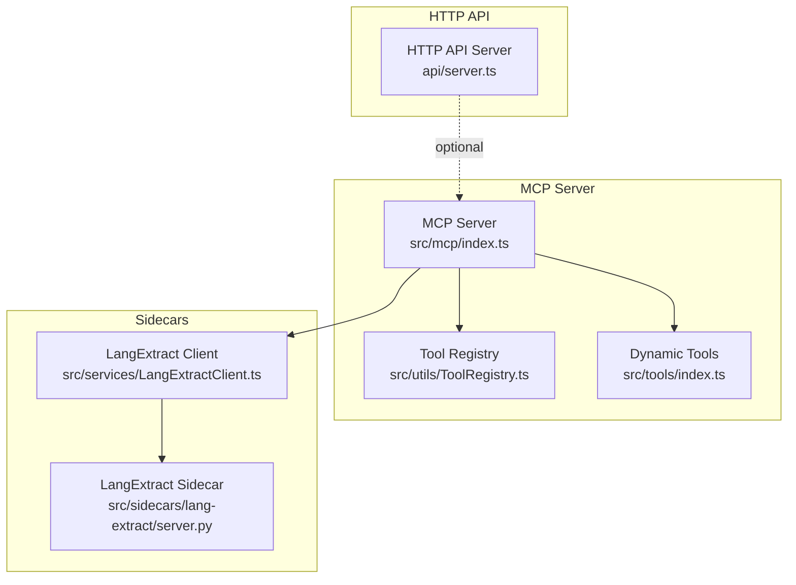
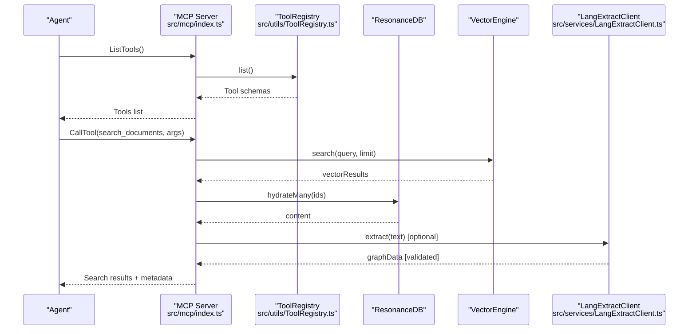
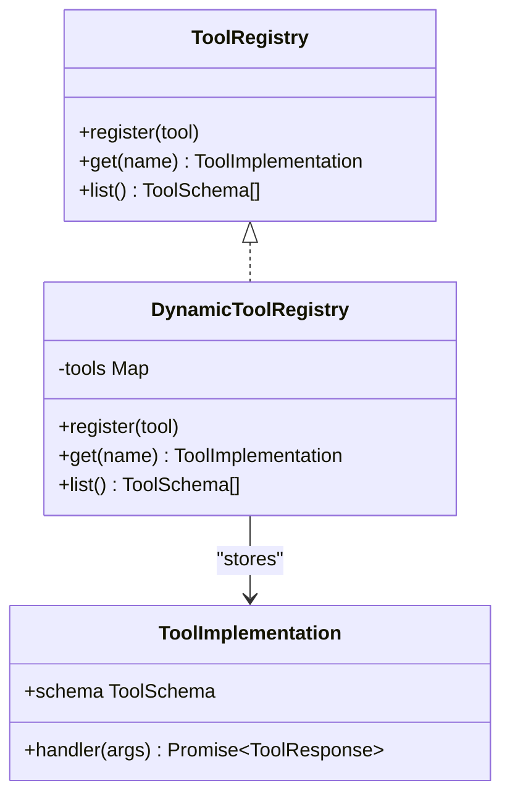
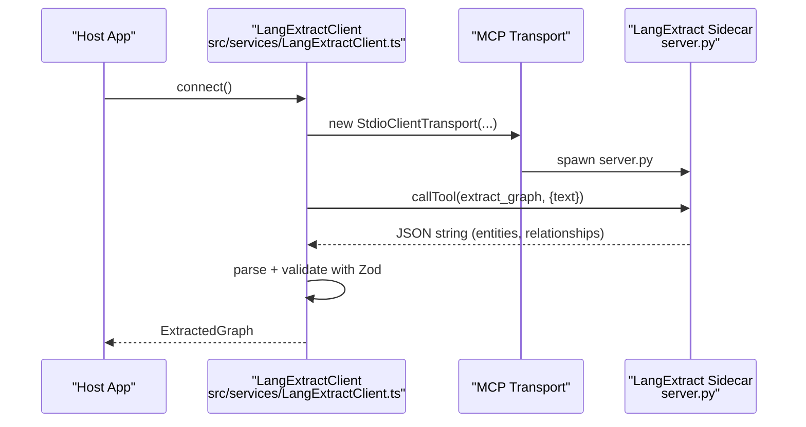
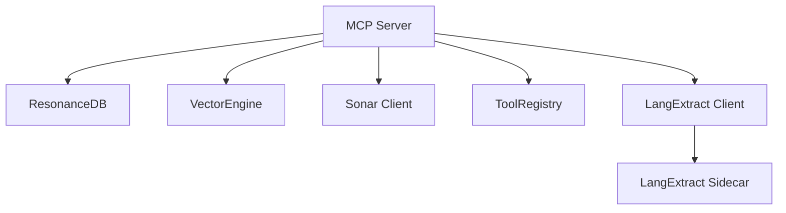

# API Reference

<cite>
**Referenced Files in This Document**
- [MCP-TOOLS.md](file://docs/MCP-TOOLS.md)
- [mcp/index.ts](file://src/mcp/index.ts)
- [tools/index.ts](file://src/tools/index.ts)
- [utils/ToolRegistry.ts](file://src/utils/ToolRegistry.ts)
- [tools/EmberExtractTool.ts](file://src/tools/EmberExtractTool.ts)
- [services/LangExtractClient.ts](file://src/services/LangExtractClient.ts)
- [sidecars/lang-extract/server.py](file://src/sidecars/lang-extract/server.py)
- [api/server.ts](file://api/server.ts)
- [openrouter-rate-limits.md](file://docs/openrouter-rate-limits.md)
- [API_KEYS.md](file://docs/API_KEYS.md)
- [test_mcp_concurrent.ts](file://scripts/verify/test_mcp_concurrent.ts)
</cite>

## Table of Contents
1. [Introduction](#introduction)
2. [Project Structure](#project-structure)
3. [Core Components](#core-components)
4. [Architecture Overview](#architecture-overview)
5. [Detailed Component Analysis](#detailed-component-analysis)
6. [Dependency Analysis](#dependency-analysis)
7. [Performance Considerations](#performance-considerations)
8. [Troubleshooting Guide](#troubleshooting-guide)
9. [Conclusion](#conclusion)
10. [Appendices](#appendices)

## Introduction
This document provides a comprehensive API reference for Amalfa’s public interfaces, focusing on:
- The Model Context Protocol (MCP) tools that power AI agents
- The dynamic tool registry and how to extend it with custom tools
- Sidecar communication protocols for language extraction and other external services
- The HTTP-based REST API exposed by the MCP server and any additional HTTP services
- Authentication methods, rate limiting, and security considerations
- Error codes, exception handling, and response format specifications
- Client implementation examples and integration patterns
- API versioning, backward compatibility, and deprecation policies

## Project Structure
Amalfa exposes:
- An MCP server implementing the Model Context Protocol for tool discovery and invocation
- A dynamic tool registry enabling extension with custom tools
- A LangExtract sidecar (Python) integrated via MCP stdio transport for knowledge graph extraction
- An optional HTTP API server providing Server-Sent Events and JSON endpoints for monitoring and control

**Diagram sources**
- [mcp/index.ts](file://src/mcp/index.ts#L147-L250)
- [utils/ToolRegistry.ts](file://src/utils/ToolRegistry.ts#L8-L27)
- [tools/index.ts](file://src/tools/index.ts#L4-L6)
- [services/LangExtractClient.ts](file://src/services/LangExtractClient.ts#L31-L43)
- [sidecars/lang-extract/server.py](file://src/sidecars/lang-extract/server.py#L1-L226)
- [api/server.ts](file://api/server.ts#L127-L247)

**Section sources**
- [mcp/index.ts](file://src/mcp/index.ts#L147-L250)
- [api/server.ts](file://api/server.ts#L127-L247)

## Core Components
- MCP Server: Implements tool discovery and execution, integrates with ResonanceDB, vector engine, and optional Sonar LLM services. It supports per-request connections and wraps outputs with a scratchpad cache.
- Tool Registry: A dynamic registry that allows registering custom tools. The MCP server lists both legacy tools and dynamic tools from the registry.
- LangExtract Sidecar: A Python MCP sidecar that extracts structured knowledge graphs from text using multiple providers (Gemini, OpenRouter, Ollama). The TypeScript client manages transport, configuration, and parsing.
- HTTP API Server: Provides SSE endpoints and JSON/HTML fragments for monitoring and control, with simulated stats and service state.

**Section sources**
- [mcp/index.ts](file://src/mcp/index.ts#L147-L250)
- [utils/ToolRegistry.ts](file://src/utils/ToolRegistry.ts#L8-L27)
- [services/LangExtractClient.ts](file://src/services/LangExtractClient.ts#L31-L43)
- [sidecars/lang-extract/server.py](file://src/sidecars/lang-extract/server.py#L198-L222)
- [api/server.ts](file://api/server.ts#L127-L247)

## Architecture Overview
The MCP server orchestrates tool execution and integrates with external services:
- Legacy tools are statically registered in the MCP server
- Dynamic tools are registered via the ToolRegistry and listed alongside legacy tools
- The LangExtract client connects to the LangExtract sidecar via stdio transport and validates structured outputs
- Optional Sonar LLM services can refine search results and extract context

**Diagram sources**
- [mcp/index.ts](file://src/mcp/index.ts#L164-L250)
- [utils/ToolRegistry.ts](file://src/utils/ToolRegistry.ts#L24-L26)
- [services/LangExtractClient.ts](file://src/services/LangExtractClient.ts#L248-L343)

## Detailed Component Analysis

### MCP Tools Reference
Amalfa exposes eight MCP tools. Each tool has a signature, parameters, return schema, and usage guidance.

- search_documents
  - Signature: search_documents(query: string, limit?: number)
  - Parameters:
    - query (required): Natural language search query
    - limit (optional): Maximum results (default: 20)
  - Returns: SearchResults with results array and metadata
  - Example usage: Agent invokes with a query and optional limit
  - Notes: Uses a bicameral retrieval pipeline (vector + grep), cross-encoder reranking, and optional Sonar refinement

- read_node_content
  - Signature: read_node_content(id: string)
  - Parameters:
    - id (required): Node ID from search results
  - Returns: Raw markdown content of the document
  - Example usage: Agent reads full content after search

- explore_links
  - Signature: explore_links(id: string, relation?: string)
  - Parameters:
    - id (required): Source node ID
    - relation (optional): Filter by relationship type
  - Returns: Array of edges with target and type
  - Example usage: Agent explores related documents

- list_directory_structure
  - Signature: list_directory_structure(): string[]
  - Parameters: None
  - Returns: List of source directories
  - Example usage: Agent discovers available content areas

- find_gaps
  - Signature: find_gaps(limit?: number, threshold?: number)
  - Parameters:
    - limit (optional): Maximum gaps to return (default: 10)
    - threshold (optional): Similarity threshold (default: 0.8)
  - Returns: Array of Gap objects with source_id, target_id, similarity, reason, suggested_link_type
  - Example usage: Agent identifies semantically similar but unlinked documents

- inject_tags (experimental)
  - Signature: inject_tags(file_path: string, tags: string[])
  - Parameters:
    - file_path (required): Absolute path to markdown file
    - tags (required): Array of tags to inject
  - Returns: Success message indicating injected or merged tags
  - Example usage: Agent auto-tags documents

- scratchpad_read
  - Signature: scratchpad_read(id: string)
  - Parameters:
    - id (required): Scratchpad entry ID (12-char hash)
  - Returns: Full cached content from previous tool call
  - Example usage: Agent retrieves large outputs that were truncated

- scratchpad_list
  - Signature: scratchpad_list(): CacheStats
  - Parameters: None
  - Returns: Entries and stats including total_entries, total_size_bytes, max_size_bytes
  - Example usage: Agent checks cache usage

**Section sources**
- [MCP-TOOLS.md](file://docs/MCP-TOOLS.md#L80-L715)
- [mcp/index.ts](file://src/mcp/index.ts#L164-L250)
- [mcp/index.ts](file://src/mcp/index.ts#L267-L671)

### Tool Registry Interface and Extension
The MCP server dynamically loads tools from the registry:
- Legacy tools are registered in the MCP server
- Dynamic tools are registered via registerAllTools(), which registers EmberExtractTool
- The MCP server lists both legacy and dynamic tools

To extend with custom tools:
- Implement a ToolImplementation with schema and handler
- Register the tool using toolRegistry.register(YourTool)
- Ensure the handler returns a normalized ToolResponse structure

**Diagram sources**
- [utils/ToolRegistry.ts](file://src/utils/ToolRegistry.ts#L8-L27)
- [tools/index.ts](file://src/tools/index.ts#L4-L6)
- [tools/EmberExtractTool.ts](file://src/tools/EmberExtractTool.ts#L12-L33)

**Section sources**
- [mcp/index.ts](file://src/mcp/index.ts#L144-L250)
- [utils/ToolRegistry.ts](file://src/utils/ToolRegistry.ts#L8-L27)
- [tools/index.ts](file://src/tools/index.ts#L4-L6)
- [tools/EmberExtractTool.ts](file://src/tools/EmberExtractTool.ts#L12-L33)

### Sidecar Communication Protocols (LangExtract)
The LangExtract sidecar communicates via MCP stdio transport:
- The TypeScript client initializes a stdio transport pointing to the Python server
- Providers supported: Gemini, OpenRouter, Ollama
- The client validates structured JSON output using Zod schemas
- Errors from the sidecar are parsed and mapped to substrate error codes

**Diagram sources**
- [services/LangExtractClient.ts](file://src/services/LangExtractClient.ts#L188-L246)
- [services/LangExtractClient.ts](file://src/services/LangExtractClient.ts#L248-L343)
- [sidecars/lang-extract/server.py](file://src/sidecars/lang-extract/server.py#L198-L222)

**Section sources**
- [services/LangExtractClient.ts](file://src/services/LangExtractClient.ts#L31-L43)
- [services/LangExtractClient.ts](file://src/services/LangExtractClient.ts#L188-L246)
- [services/LangExtractClient.ts](file://src/services/LangExtractClient.ts#L248-L343)
- [sidecars/lang-extract/server.py](file://src/sidecars/lang-extract/server.py#L198-L222)

### REST API Endpoints (HTTP-based Services)
The HTTP API server provides:
- Server-Sent Events endpoint for real-time updates
- JSON endpoints for stats, services, and runs logs
- Fragment endpoints for HTMX-style partial updates
- A service control endpoint for managing services
- Static file serving

Endpoints:
- GET /api/stream: SSE stream with stats, services, and runs
- GET /api/stats: JSON stats
- GET /api/services: JSON services list
- GET /api/runs: JSON runs log
- GET /api/fragment/stats: HTML fragment for stats
- GET /api/fragment/services: HTML fragment for services
- GET /api/fragment/runs: HTML fragment for runs
- POST /api/services/:name/:action: Service control (returns success payload)
- Static files under public/

**Section sources**
- [api/server.ts](file://api/server.ts#L127-L247)

## Dependency Analysis
- MCP Server depends on:
  - ResonanceDB for graph statistics and content hydration
  - VectorEngine for retrieval
  - Sonar client for optional LLM refinement and context extraction
  - DaemonManager for vector and file watcher daemons
  - ToolRegistry for dynamic tool resolution
- LangExtract Client depends on:
  - StdioClientTransport to communicate with the Python sidecar
  - Zod schemas for output validation
  - HarvesterCache for caching extracted results
- HTTP API Server is independent and optional, used for monitoring and control.

**Diagram sources**
- [mcp/index.ts](file://src/mcp/index.ts#L49-L55)
- [mcp/index.ts](file://src/mcp/index.ts#L32-L33)
- [utils/ToolRegistry.ts](file://src/utils/ToolRegistry.ts#L8-L27)
- [services/LangExtractClient.ts](file://src/services/LangExtractClient.ts#L31-L43)
- [sidecars/lang-extract/server.py](file://src/sidecars/lang-extract/server.py#L1-L226)

**Section sources**
- [mcp/index.ts](file://src/mcp/index.ts#L49-L55)
- [mcp/index.ts](file://src/mcp/index.ts#L32-L33)
- [utils/ToolRegistry.ts](file://src/utils/ToolRegistry.ts#L8-L27)
- [services/LangExtractClient.ts](file://src/services/LangExtractClient.ts#L31-L43)
- [sidecars/lang-extract/server.py](file://src/sidecars/lang-extract/server.py#L1-L226)

## Performance Considerations
- MCP concurrent requests: Verified with concurrent queries to ensure robustness
- Search pipeline stages:
  - Vector search (~10ms for 1000 docs)
  - BGE reranking (~50ms for top 50 candidates)
  - Optional Sonar refinement and context extraction
- HTTP SSE updates: Simulated stats and service status updates every 2 seconds
- Cache behavior: Scratchpad caches tool outputs; Harvester cache stores extracted graphs

**Section sources**
- [test_mcp_concurrent.ts](file://scripts/verify/test_mcp_concurrent.ts#L100-L125)
- [MCP-TOOLS.md](file://docs/MCP-TOOLS.md#L135-L139)
- [api/server.ts](file://api/server.ts#L104-L120)
- [mcp/index.ts](file://src/mcp/index.ts#L75-L92)
- [services/LangExtractClient.ts](file://src/services/LangExtractClient.ts#L45-L47)

## Troubleshooting Guide
Common errors and handling:
- Node not found: Returned when read_node_content receives an invalid or deleted node ID
- Scratchpad entry not found: Returned when scratchpad_read references an expired or invalid ID
- Search errors: Vector search failures return a structured error message
- Sidecar substrate errors: API key missing, invalid, out of credit, or network errors are parsed and surfaced with suggestions

Rate limiting and security:
- OpenRouter rate limits and quotas vary by tier; monitor daily usage and implement throttling
- API key management best practices: rotate keys, separate environments, validate formats, and avoid committing secrets

**Section sources**
- [mcp/index.ts](file://src/mcp/index.ts#L673-L687)
- [mcp/index.ts](file://src/mcp/index.ts#L644-L657)
- [mcp/index.ts](file://src/mcp/index.ts#L590-L602)
- [services/LangExtractClient.ts](file://src/services/LangExtractClient.ts#L106-L186)
- [openrouter-rate-limits.md](file://docs/openrouter-rate-limits.md#L1-L127)
- [API_KEYS.md](file://docs/API_KEYS.md#L269-L443)

## Conclusion
Amalfa’s public interfaces combine a robust MCP tool ecosystem with a flexible dynamic registry, reliable sidecar integrations, and optional HTTP monitoring services. The MCP server emphasizes read-only operations while enabling powerful search, graph traversal, and knowledge graph maintenance. The LangExtract sidecar provides structured extraction with validated outputs and clear error handling. The HTTP API complements the MCP server with real-time monitoring and control.

## Appendices

### API Versioning, Backward Compatibility, and Deprecation
- Versioning: The MCP server declares a version in its server capabilities
- Backward compatibility: Legacy tools are maintained; dynamic tools integrate seamlessly
- Deprecation policy: Experimental tools (e.g., inject_tags) are documented as such and may evolve

**Section sources**
- [mcp/index.ts](file://src/mcp/index.ts#L147-L150)
- [MCP-TOOLS.md](file://docs/MCP-TOOLS.md#L359-L359)

### Authentication Methods
- LangExtract providers:
  - Gemini: Requires GEMINI_API_KEY
  - OpenRouter: Requires OPENROUTER_API_KEY
  - Ollama: Local or remote via OLLAMA_HOST
- HTTP API: No authentication enforced in the provided server; secure deployment recommended

**Section sources**
- [services/LangExtractClient.ts](file://src/services/LangExtractClient.ts#L82-L104)
- [services/LangExtractClient.ts](file://src/services/LangExtractClient.ts#L188-L246)
- [sidecars/lang-extract/server.py](file://src/sidecars/lang-extract/server.py#L31-L47)
- [api/server.ts](file://api/server.ts#L218-L229)

### Rate Limiting and Security Considerations
- OpenRouter: Free tier daily quota and RPM; paid tiers scale with balance; monitor usage and implement throttling
- Security: Validate API key formats, rotate keys regularly, and avoid committing secrets

**Section sources**
- [openrouter-rate-limits.md](file://docs/openrouter-rate-limits.md#L1-L127)
- [API_KEYS.md](file://docs/API_KEYS.md#L269-L443)

### Client Implementation Examples and Integration Patterns
- MCP clients can be built using the Model Context Protocol SDK; examples include connecting via stdio and invoking tools
- Integration patterns:
  - Proactive search at session start
  - Problem-solving pattern with targeted queries
  - Session end pattern suggesting debriefs

**Section sources**
- [MCP-TOOLS.md](file://docs/MCP-TOOLS.md#L609-L647)
- [MCP-TOOLS.md](file://docs/MCP-TOOLS.md#L509-L546)