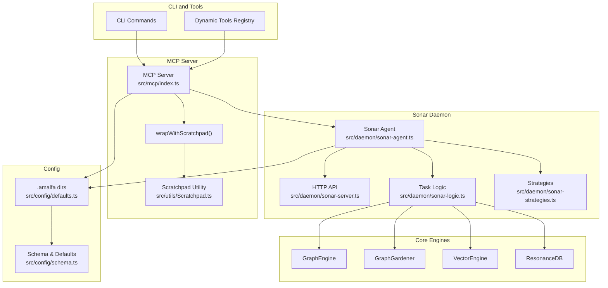
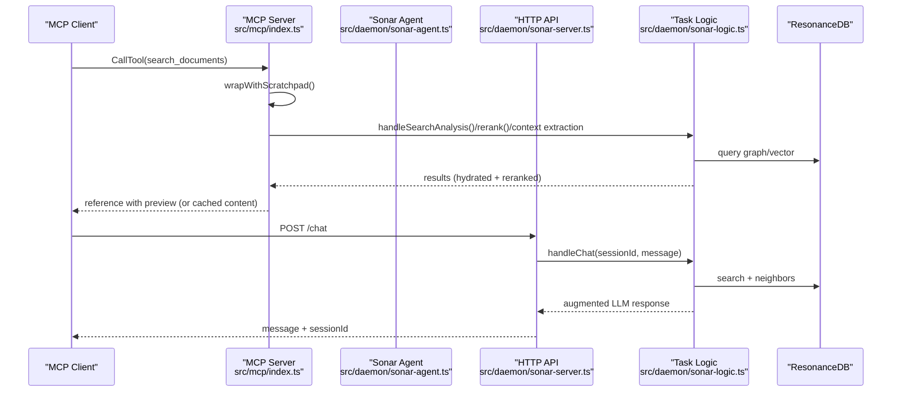
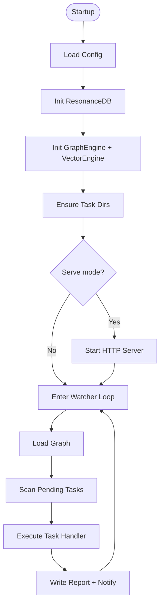
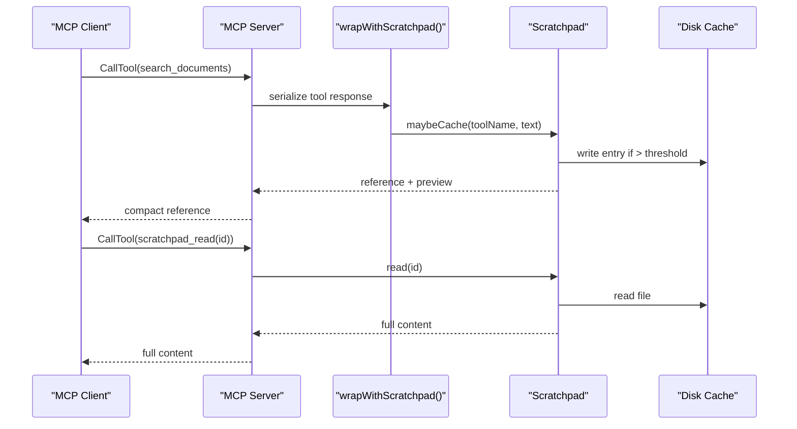
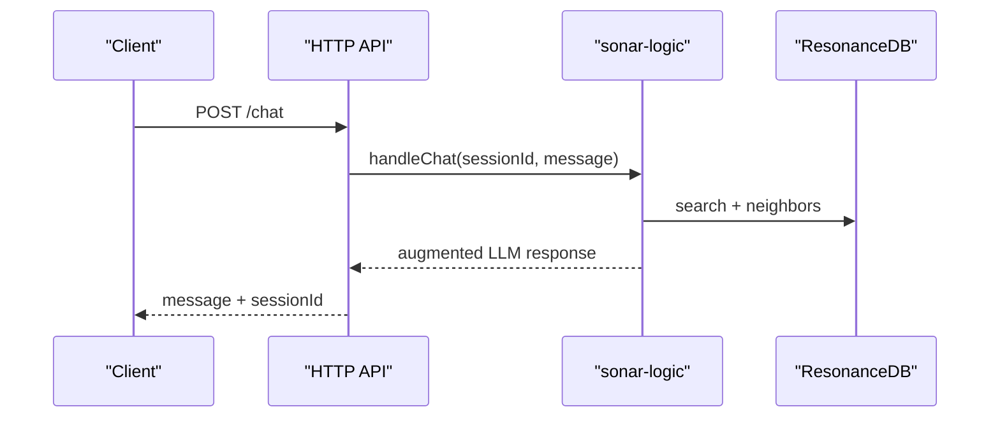
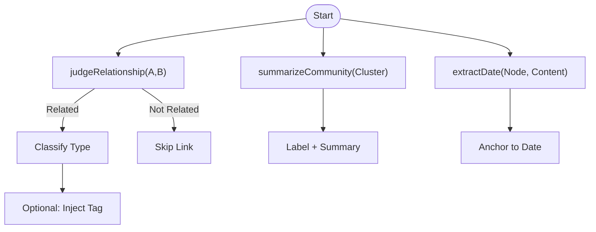
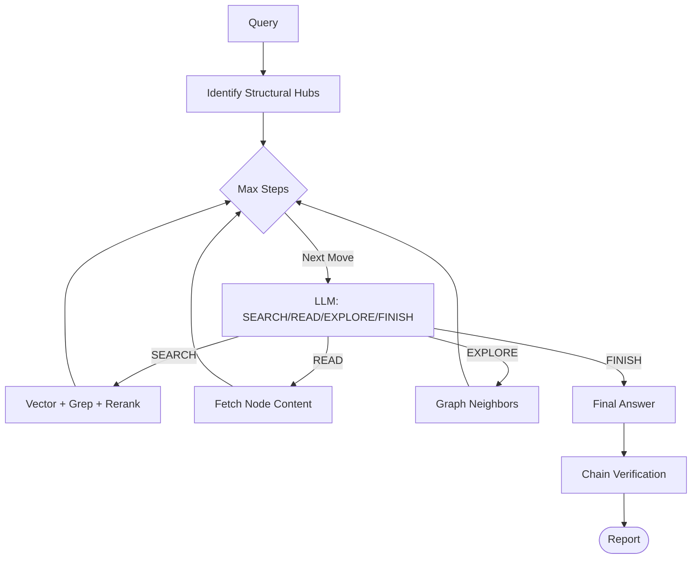
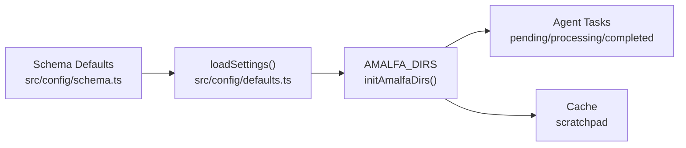
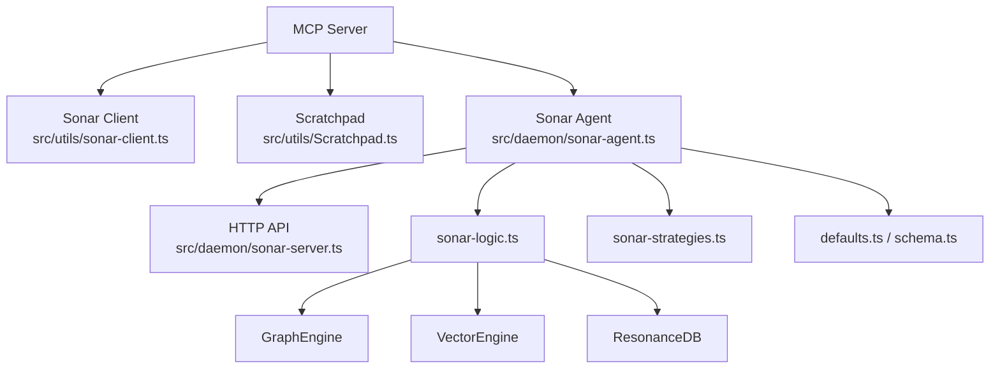

# Agent Integration

<cite>
**Referenced Files in This Document**
- [AGENTS.md](file://AGENTS.md)
- [AGENT_PROTOCOLS.md](file://docs/AGENT_PROTOCOLS.md)
- [SCRATCHPAD-INNOVATION.md](file://docs/SCRATCHPAD-INNOVATION.md)
- [sonar-agent.ts](file://src/daemon/sonar-agent.ts)
- [sonar-server.ts](file://src/daemon/sonar-server.ts)
- [sonar-logic.ts](file://src/daemon/sonar-logic.ts)
- [sonar-strategies.ts](file://src/daemon/sonar-strategies.ts)
- [sonar-client.ts](file://src/utils/sonar-client.ts)
- [Scratchpad.ts](file://src/utils/Scratchpad.ts)
- [mcp/index.ts](file://src/mcp/index.ts)
- [defaults.ts](file://src/config/defaults.ts)
- [schema.ts](file://src/config/schema.ts)
- [2026-01-08-sonar-agent-refactor.md](file://debriefs/2026-01-08-sonar-agent-refactor.md)
- [2026-01-13-scratchpad-protocol.md](file://debriefs/2026-01-13-scratchpad-protocol.md)
</cite>

## Table of Contents
1. [Introduction](#introduction)
2. [Project Structure](#project-structure)
3. [Core Components](#core-components)
4. [Architecture Overview](#architecture-overview)
5. [Detailed Component Analysis](#detailed-component-analysis)
6. [Dependency Analysis](#dependency-analysis)
7. [Performance Considerations](#performance-considerations)
8. [Troubleshooting Guide](#troubleshooting-guide)
9. [Conclusion](#conclusion)
10. [Appendices](#appendices)

## Introduction
This document explains Amalfa’s agent integration capabilities with a focus on the Sonar AI agent. It covers multi-threaded processing, task management, research workflows, and the scratchpad system for caching large outputs. It also details agent strategies for synthesis, timeline anchoring, and graph-guided research, along with integration with the knowledge graph for context-aware responses and automated knowledge discovery. Practical examples, prompt engineering techniques, and best practices are included, alongside performance optimization tips and troubleshooting guidance.

## Project Structure
The agent ecosystem centers around:
- A Sonar daemon that orchestrates tasks, exposes an HTTP API, and coordinates graph and vector engines.
- An MCP server that integrates with Claude Desktop and other clients, wrapping tool outputs with the scratchpad protocol.
- A scratchpad utility that caches large tool outputs to disk and returns references with previews.
- Configuration and directory scaffolding that defines runtime paths and feature toggles.

**Diagram sources**
- [mcp/index.ts](file://src/mcp/index.ts#L1-L748)
- [sonar-agent.ts](file://src/daemon/sonar-agent.ts#L1-L221)
- [sonar-server.ts](file://src/daemon/sonar-server.ts#L1-L134)
- [sonar-logic.ts](file://src/daemon/sonar-logic.ts#L1-L685)
- [sonar-strategies.ts](file://src/daemon/sonar-strategies.ts#L1-L187)
- [Scratchpad.ts](file://src/utils/Scratchpad.ts#L1-L427)
- [defaults.ts](file://src/config/defaults.ts#L1-L143)
- [schema.ts](file://src/config/schema.ts#L1-L298)

**Section sources**
- [mcp/index.ts](file://src/mcp/index.ts#L1-L748)
- [sonar-agent.ts](file://src/daemon/sonar-agent.ts#L1-L221)
- [sonar-server.ts](file://src/daemon/sonar-server.ts#L1-L134)
- [sonar-logic.ts](file://src/daemon/sonar-logic.ts#L1-L685)
- [sonar-strategies.ts](file://src/daemon/sonar-strategies.ts#L1-L187)
- [Scratchpad.ts](file://src/utils/Scratchpad.ts#L1-L427)
- [defaults.ts](file://src/config/defaults.ts#L1-L143)
- [schema.ts](file://src/config/schema.ts#L1-L298)

## Core Components
- Sonar Agent: Multi-purpose sub-agent that watches task queues, loads the graph, and executes tasks (research, synthesis, timeline, gardening, batch enhancement).
- MCP Server: Bridges Claude Desktop and other MCP clients to Amalfa’s knowledge graph, vector engine, and tools, with scratchpad-aware responses.
- Scratchpad: Caches large tool outputs to disk, returning references with previews; supports selective retrieval and pruning.
- HTTP API: Exposes endpoints for chat, metadata enhancement, search analysis, reranking, and context extraction.
- Strategies: LLM-based strategies for relationship judgment, community synthesis, and temporal anchoring.
- Configuration: Centralized schema and directory structure for runtime paths and feature flags.

**Section sources**
- [sonar-agent.ts](file://src/daemon/sonar-agent.ts#L1-L221)
- [mcp/index.ts](file://src/mcp/index.ts#L1-L748)
- [Scratchpad.ts](file://src/utils/Scratchpad.ts#L1-L427)
- [sonar-server.ts](file://src/daemon/sonar-server.ts#L1-L134)
- [sonar-strategies.ts](file://src/daemon/sonar-strategies.ts#L1-L187)
- [schema.ts](file://src/config/schema.ts#L1-L298)
- [defaults.ts](file://src/config/defaults.ts#L1-L143)

## Architecture Overview
The Sonar agent is a long-running daemon that:
- Loads the ResonanceDB and initializes GraphEngine and VectorEngine.
- Starts an HTTP API for chat and search services.
- Watches task directories for JSON task payloads and executes them asynchronously.
- Integrates with MCP to provide search, read, explore, gaps, and scratchpad tools.

**Diagram sources**
- [mcp/index.ts](file://src/mcp/index.ts#L252-L688)
- [sonar-agent.ts](file://src/daemon/sonar-agent.ts#L106-L179)
- [sonar-server.ts](file://src/daemon/sonar-server.ts#L58-L67)
- [sonar-logic.ts](file://src/daemon/sonar-logic.ts#L104-L179)

## Detailed Component Analysis

### Sonar Agent: Multi-threaded Processing and Task Management
- Lifecycle and initialization: Loads config, sets up ResonanceDB, VectorEngine, and GraphGardener; ensures task directories exist.
- HTTP server: Exposes health, chat, metadata enhancement, search analysis, reranking, and context extraction endpoints.
- Task watcher loop: Periodically reloads the graph, processes pending tasks, and writes completion reports.
- Task routing: Dispatches to synthesis, timeline, garden, research, or batch enhancement handlers.

**Diagram sources**
- [sonar-agent.ts](file://src/daemon/sonar-agent.ts#L60-L116)
- [sonar-server.ts](file://src/daemon/sonar-server.ts#L24-L53)

**Section sources**
- [sonar-agent.ts](file://src/daemon/sonar-agent.ts#L1-L221)
- [sonar-server.ts](file://src/daemon/sonar-server.ts#L1-L134)

### MCP Integration and Scratchpad Protocol
- Tool registration: Provides search, read, explore, list, gaps, and scratchpad tools; dynamic tools are registered via a registry.
- Per-request connections: Fresh database and engine instances per tool invocation.
- Scratchpad wrapping: Large tool outputs (>4KB) are cached to disk with a SHA256-based reference and preview; small outputs are returned inline.
- Retrieval tools: scratchpad_read and scratchpad_list enable selective retrieval and cache inspection.

**Diagram sources**
- [mcp/index.ts](file://src/mcp/index.ts#L75-L92)
- [Scratchpad.ts](file://src/utils/Scratchpad.ts#L147-L190)
- [Scratchpad.ts](file://src/utils/Scratchpad.ts#L195-L218)

**Section sources**
- [mcp/index.ts](file://src/mcp/index.ts#L152-L250)
- [mcp/index.ts](file://src/mcp/index.ts#L252-L688)
- [Scratchpad.ts](file://src/utils/Scratchpad.ts#L1-L427)
- [SCRATCHPAD-INNOVATION.md](file://docs/SCRATCHPAD-INNOVATION.md#L1-L469)

### HTTP API: Chat, Search, and Context Services
- Chat: Augments user messages with direct search results and graph neighbors, then queries the LLM for a contextual answer.
- Metadata enhancement: Extracts keywords and summary for a node and updates metadata.
- Search analysis: Parses query intent, entities, and technical level.
- Reranking: Uses a cross-encoder and optionally an LLM to improve relevance.
- Context extraction: Returns a snippet aligned to the query.

**Diagram sources**
- [sonar-server.ts](file://src/daemon/sonar-server.ts#L58-L67)
- [sonar-logic.ts](file://src/daemon/sonar-logic.ts#L104-L179)

**Section sources**
- [sonar-server.ts](file://src/daemon/sonar-server.ts#L1-L134)
- [sonar-logic.ts](file://src/daemon/sonar-logic.ts#L1-L685)

### Agent Strategies: Synthesis, Timeline, and Graph Judgments
- Relationship judgment: Determines if two nodes are related and classifies the relationship type.
- Community synthesis: Summarizes clusters of related nodes into a canonical label and concise synthesis.
- Chronos: Extracts a primary temporal anchor from a document.

**Diagram sources**
- [sonar-strategies.ts](file://src/daemon/sonar-strategies.ts#L34-L84)
- [sonar-strategies.ts](file://src/daemon/sonar-strategies.ts#L90-L142)
- [sonar-strategies.ts](file://src/daemon/sonar-strategies.ts#L148-L186)

**Section sources**
- [sonar-strategies.ts](file://src/daemon/sonar-strategies.ts#L1-L187)

### Research Workflows: Recursive Discovery and Chain Verification
- Research task: Iteratively decides between search, read, explore, or finish based on LLM guidance.
- Chain verification: Audits findings against the original query to ensure completeness and accuracy.

**Diagram sources**
- [sonar-logic.ts](file://src/daemon/sonar-logic.ts#L469-L664)

**Section sources**
- [sonar-logic.ts](file://src/daemon/sonar-logic.ts#L469-L664)

### Configuration and Directory Management
- AMALFA_DIRS centralizes paths for logs, runtime, cache, scratchpad, and task queues.
- Schema defines default values and feature flags for Sonar, scratchpad, and other subsystems.

**Diagram sources**
- [schema.ts](file://src/config/schema.ts#L110-L117)
- [defaults.ts](file://src/config/defaults.ts#L16-L59)

**Section sources**
- [defaults.ts](file://src/config/defaults.ts#L1-L143)
- [schema.ts](file://src/config/schema.ts#L1-L298)

## Dependency Analysis
Key dependencies and relationships:
- MCP server depends on Sonar client for optional LLM-based enhancements.
- Sonar agent depends on ResonanceDB, GraphEngine, and VectorEngine.
- Scratchpad depends on configuration schema and AMALFA_DIRS for persistence.
- HTTP API depends on sonar-logic for orchestration.

**Diagram sources**
- [mcp/index.ts](file://src/mcp/index.ts#L1-L748)
- [sonar-client.ts](file://src/utils/sonar-client.ts#L1-L309)
- [sonar-agent.ts](file://src/daemon/sonar-agent.ts#L1-L221)
- [sonar-server.ts](file://src/daemon/sonar-server.ts#L1-L134)
- [sonar-logic.ts](file://src/daemon/sonar-logic.ts#L1-L685)
- [sonar-strategies.ts](file://src/daemon/sonar-strategies.ts#L1-L187)
- [Scratchpad.ts](file://src/utils/Scratchpad.ts#L1-L427)
- [defaults.ts](file://src/config/defaults.ts#L1-L143)
- [schema.ts](file://src/config/schema.ts#L1-L298)

**Section sources**
- [mcp/index.ts](file://src/mcp/index.ts#L1-L748)
- [sonar-client.ts](file://src/utils/sonar-client.ts#L1-L309)
- [sonar-agent.ts](file://src/daemon/sonar-agent.ts#L1-L221)
- [sonar-server.ts](file://src/daemon/sonar-server.ts#L1-L134)
- [sonar-logic.ts](file://src/daemon/sonar-logic.ts#L1-L685)
- [sonar-strategies.ts](file://src/daemon/sonar-strategies.ts#L1-L187)
- [Scratchpad.ts](file://src/utils/Scratchpad.ts#L1-L427)
- [defaults.ts](file://src/config/defaults.ts#L1-L143)
- [schema.ts](file://src/config/schema.ts#L1-L298)

## Performance Considerations
- Context window management: The scratchpad protocol reduces context usage by orders of magnitude for large tool outputs, enabling broader searches and multi-hop exploration without context inflation.
- Parallel retrieval: The MCP server performs vector and grep searches concurrently, then merges and reranks results.
- Reranking pipeline: Cross-encoder reranking followed by optional LLM reranking optimizes relevance while controlling latency.
- Throttling for free tiers: Delays between steps mitigate rate limits for openrouter “:free” models.
- Cache pruning: Age-based and size-based eviction keeps disk usage bounded.

[No sources needed since this section provides general guidance]

## Troubleshooting Guide
Common issues and resolutions:
- Sonar unavailable: The HTTP API and MCP server guard calls with availability checks; errors indicate inference backend issues or misconfiguration.
- Stale knowledge graph: The system detects staleness by comparing database and source file timestamps; refresh the graph or reingest content.
- Large output context problems: Use the scratchpad protocol to avoid context overflow; retrieve full content on demand.
- MCP crashes: Uncaught exceptions and unhandled rejections are logged and written to a crash log for diagnostics.
- Configuration errors: Missing or invalid amalfa.settings.json causes immediate startup failure; ensure the schema is satisfied.

**Section sources**
- [sonar-server.ts](file://src/daemon/sonar-server.ts#L40-L53)
- [mcp/index.ts](file://src/mcp/index.ts#L727-L743)
- [2026-01-08-sonar-agent-refactor.md](file://debriefs/2026-01-08-sonar-agent-refactor.md#L1-L31)
- [2026-01-13-scratchpad-protocol.md](file://debriefs/2026-01-13-scratchpad-protocol.md#L1-L35)

## Conclusion
Amalfa’s Sonar agent integrates tightly with the knowledge graph and vector engine to deliver robust, context-aware assistance. The MCP server’s scratchpad protocol solves the context window problem for large tool outputs, while the HTTP API and task system enable multi-modal workflows spanning search, analysis, and synthesis. Strategies for relationship judgment, community synthesis, and temporal anchoring automate knowledge discovery and curation. With careful configuration and observability, the agent scales from interactive chat to autonomous research and documentation synthesis.

[No sources needed since this section summarizes without analyzing specific files]

## Appendices

### Practical Examples and Prompt Engineering
- Identity and interaction style: Align agent behavior with the Edinburgh Protocol identity and operational guidelines.
- Graph-first directive: Always ground actions in the knowledge graph; use search, read, and explore iteratively.
- JSON mode enforcement: Use strict JSON output modes for reliable parsing in small models.
- Research prompts: Frame recursive discovery with clear decision points (search/read/explore/finish) and chain verification steps.

**Section sources**
- [AGENTS.md](file://AGENTS.md#L1-L38)
- [AGENT_PROTOCOLS.md](file://docs/AGENT_PROTOCOLS.md#L1-L30)
- [2026-01-08-sonar-agent-refactor.md](file://debriefs/2026-01-08-sonar-agent-refactor.md#L1-L31)

### Best Practices for Agent-Driven Documentation
- Use synthesis tasks to generate canonical documentation nodes from clusters of related content.
- Anchor timelines to extract and apply temporal metadata to nodes.
- Delegate complex investigations to the research task queue for iterative discovery and verification.
- Employ the scratchpad to preserve full context while keeping agent prompts lean.

**Section sources**
- [sonar-logic.ts](file://src/daemon/sonar-logic.ts#L323-L364)
- [sonar-logic.ts](file://src/daemon/sonar-logic.ts#L369-L392)
- [sonar-logic.ts](file://src/daemon/sonar-logic.ts#L469-L664)
- [SCRATCHPAD-INNOVATION.md](file://docs/SCRATCHPAD-INNOVATION.md#L1-L469)