# Chat Session Management

<cite>
**Referenced Files in This Document**
- [sonar-agent.ts](file://src/daemon/sonar-agent.ts)
- [sonar-server.ts](file://src/daemon/sonar-server.ts)
- [sonar-inference.ts](file://src/daemon/sonar-inference.ts)
- [Scratchpad.ts](file://src/utils/Scratchpad.ts)
- [session_28df413d-b7ae-40fe-8ca5-c696b60e8b19.jsonl](file://.amalfa/sessions/session_28df413d-b7ae-40fe-8ca5-c696b60e8b19.jsonl)
- [session_8ccabae9-8d3b-479e-af00-9f057891c3df.jsonl](file://.amalfa/sessions/session_8ccabae9-8d3b-479e-af00-9f057891c3df.jsonl)
- [session-summary.md](file://.amalfa/session-summary.md)
</cite>

## Table of Contents
1. [Introduction](#introduction)
2. [Project Structure](#project-structure)
3. [Core Components](#core-components)
4. [Architecture Overview](#architecture-overview)
5. [Detailed Component Analysis](#detailed-component-analysis)
6. [Dependency Analysis](#dependency-analysis)
7. [Performance Considerations](#performance-considerations)
8. [Troubleshooting Guide](#troubleshooting-guide)
9. [Conclusion](#conclusion)
10. [Appendices](#appendices)

## Introduction
This document explains chat session management in the Sonar agent. It covers the session lifecycle, context preservation, conversation state management, integration with the scratchpad system, session persistence, and multi-turn conversation handling. It also documents session data structures, memory management, performance optimization techniques, and provides practical examples for session creation, context switching, and state restoration. Finally, it addresses session scaling, concurrent session handling, and troubleshooting session-related issues.

## Project Structure
The Sonar agent exposes a chat endpoint and maintains an in-memory registry of active chat sessions. Sessions are persisted as JSONL files under a dedicated sessions directory. The scratchpad utility intercepts large tool outputs and caches them to disk, returning concise references to reduce context window usage.

**Diagram sources**
- [sonar-server.ts](file://src/daemon/sonar-server.ts#L58-L67)
- [sonar-agent.ts](file://src/daemon/sonar-agent.ts#L47-L124)
- [sonar-inference.ts](file://src/daemon/sonar-inference.ts#L19-L119)
- [Scratchpad.ts](file://src/utils/Scratchpad.ts#L147-L190)

**Section sources**
- [sonar-server.ts](file://src/daemon/sonar-server.ts#L24-L133)
- [sonar-agent.ts](file://src/daemon/sonar-agent.ts#L46-L133)
- [Scratchpad.ts](file://src/utils/Scratchpad.ts#L49-L190)

## Core Components
- Chat session registry: A global Map keyed by session identifiers holds active session state for multi-turn conversations.
- HTTP chat endpoint: Accepts chat requests with a session identifier and forwards them to the chat handler.
- Inference engine: Provides unified access to local Ollama and cloud providers with model selection and request routing.
- Scratchpad: Intercepts large tool outputs, caches them to disk, and returns compact references to preserve context window capacity.
- Session persistence: Conversational events are written to JSONL files named after the session ID.

**Section sources**
- [sonar-agent.ts](file://src/daemon/sonar-agent.ts#L47-L124)
- [sonar-server.ts](file://src/daemon/sonar-server.ts#L58-L67)
- [sonar-inference.ts](file://src/daemon/sonar-inference.ts#L19-L119)
- [Scratchpad.ts](file://src/utils/Scratchpad.ts#L147-L190)
- [session_28df413d-b7ae-40fe-8ca5-c696b60e8b19.jsonl](file://.amalfa/sessions/session_28df413d-b7ae-40fe-8ca5-c696b60e8b19.jsonl#L1-L4)

## Architecture Overview
The chat flow begins at the HTTP endpoint, which delegates to the chat handler with the session context. The handler interacts with the inference engine and may use the scratchpad to manage large outputs. All interactions are recorded in the session’s JSONL file.

**Diagram sources**
- [sonar-server.ts](file://src/daemon/sonar-server.ts#L58-L67)
- [sonar-agent.ts](file://src/daemon/sonar-agent.ts#L124-L124)
- [sonar-inference.ts](file://src/daemon/sonar-inference.ts#L19-L119)
- [Scratchpad.ts](file://src/utils/Scratchpad.ts#L147-L190)
- [session_28df413d-b7ae-40fe-8ca5-c696b60e8b19.jsonl](file://.amalfa/sessions/session_28df413d-b7ae-40fe-8ca5-c696b60e8b19.jsonl#L1-L4)

## Detailed Component Analysis

### Session Lifecycle and Conversation State
- Creation: The session registry is initialized as a global Map. A session starts when the first chat request arrives for a given session ID.
- Multi-turn: Subsequent requests reuse the same session ID to maintain conversational continuity.
- Persistence: Each turn appends a structured event to the session’s JSONL file, including call IDs, timestamps, tool names, and payload metadata.
- Termination: There is no explicit session close event in the observed code; sessions persist in memory until the process restarts or external pruning occurs.

**Diagram sources**
- [sonar-agent.ts](file://src/daemon/sonar-agent.ts#L47-L124)
- [session_28df413d-b7ae-40fe-8ca5-c696b60e8b19.jsonl](file://.amalfa/sessions/session_28df413d-b7ae-40fe-8ca5-c696b60e8b19.jsonl#L1-L4)

**Section sources**
- [sonar-agent.ts](file://src/daemon/sonar-agent.ts#L47-L124)
- [session_28df413d-b7ae-40fe-8ca5-c696b60e8b19.jsonl](file://.amalfa/sessions/session_28df413d-b7ae-40fe-8ca5-c696b60e8b19.jsonl#L1-L4)
- [session_8ccabae9-8d3b-479e-af00-9f057891c3df.jsonl](file://.amalfa/sessions/session_8ccabae9-8d3b-479e-af00-9f057891c3df.jsonl#L1-L2)

### Context Preservation and Memory Management
- In-memory registry: The Map stores active sessions to enable multi-turn conversations without reloading from disk.
- Event logging: Each interaction is appended to the session file, enabling replay and diagnostics.
- Memory footprint: The registry grows with active sessions. Consider periodic pruning or eviction for long-running processes.

**Diagram sources**
- [sonar-agent.ts](file://src/daemon/sonar-agent.ts#L47-L124)

**Section sources**
- [sonar-agent.ts](file://src/daemon/sonar-agent.ts#L47-L124)

### Integration with Scratchpad System
- Purpose: Reduce context window usage by caching large tool outputs and returning concise references.
- Mechanism: The scratchpad computes a content hash, detects content type, generates a preview, writes a JSON entry, and returns a reference string containing the file path and preview.
- Usage in chat: The chat handler can leverage the scratchpad to keep responses compact, especially when tool outputs are large.

```mermaid
sequenceDiagram
participant H as "Chat Handler"
participant S as "Scratchpad"
H->>S : maybeCache(tool, content)
alt content exceeds threshold
S-->>H : "📁 Output cached : <path> (<size>)\n\nPreview : <preview>\n\nTo read full content, use : Scratchpad.read(\"<hash>\")"
else content within threshold
S-->>H : content
end
```

**Diagram sources**
- [Scratchpad.ts](file://src/utils/Scratchpad.ts#L147-L190)

**Section sources**
- [Scratchpad.ts](file://src/utils/Scratchpad.ts#L49-L190)

### Session Persistence and Replay
- Persistence format: JSONL files named by session ID under the sessions directory.
- Typical events: Each line encodes a call or result event with fields such as id, callId, sessionId, timestamp, type, tool, payload, and durationMs.
- Replay capability: The JSONL format supports reading and reconstructing conversation history for diagnostics or resumption.

**Diagram sources**
- [session_28df413d-b7ae-40fe-8ca5-c696b60e8b19.jsonl](file://.amalfa/sessions/session_28df413d-b7ae-40fe-8ca5-c696b60e8b19.jsonl#L1-L4)

**Section sources**
- [session_28df413d-b7ae-40fe-8ca5-c696b60e8b19.jsonl](file://.amalfa/sessions/session_28df413d-b7ae-40fe-8ca5-c696b60e8b19.jsonl#L1-L4)
- [session_8ccabae9-8d3b-479e-af00-9f057891c3df.jsonl](file://.amalfa/sessions/session_8ccabae9-8d3b-479e-af00-9f057891c3df.jsonl#L1-L2)

### Practical Examples

- Session creation
  - Send a POST request to the chat endpoint with a new session ID. The first request initializes the session and records a session_start event in the JSONL file.
  - Example reference: [session_28df413d-b7ae-40fe-8ca5-c696b60e8b19.jsonl](file://.amalfa/sessions/session_28df413d-b7ae-40fe-8ca5-c696b60e8b19.jsonl#L1-L1)

- Context switching
  - To switch contexts, reuse the same session ID for related questions or start a new session ID for a separate context. The registry preserves conversation history per session.

- State restoration
  - Read the JSONL file for a session ID to reconstruct recent turns. Use the scratchpad references to retrieve cached content when needed.

**Section sources**
- [session_28df413d-b7ae-40fe-8ca5-c696b60e8b19.jsonl](file://.amalfa/sessions/session_28df413d-b7ae-40fe-8ca5-c696b60e8b19.jsonl#L1-L4)
- [session_8ccabae9-8d3b-479e-af00-9f057891c3df.jsonl](file://.amalfa/sessions/session_8ccabae9-8d3b-479e-af00-9f057891c3df.jsonl#L1-L2)
- [Scratchpad.ts](file://src/utils/Scratchpad.ts#L195-L218)

## Dependency Analysis
The chat subsystem depends on the server, agent, inference engine, and scratchpad utilities. The server routes requests to the agent, which coordinates with the inference engine and scratchpad, and persists events to JSONL.

**Diagram sources**
- [sonar-server.ts](file://src/daemon/sonar-server.ts#L58-L67)
- [sonar-agent.ts](file://src/daemon/sonar-agent.ts#L124-L124)
- [sonar-inference.ts](file://src/daemon/sonar-inference.ts#L19-L119)
- [Scratchpad.ts](file://src/utils/Scratchpad.ts#L147-L190)

**Section sources**
- [sonar-server.ts](file://src/daemon/sonar-server.ts#L24-L133)
- [sonar-agent.ts](file://src/daemon/sonar-agent.ts#L46-L133)
- [sonar-inference.ts](file://src/daemon/sonar-inference.ts#L19-L119)
- [Scratchpad.ts](file://src/utils/Scratchpad.ts#L49-L190)

## Performance Considerations
- Context window management: Use the scratchpad to avoid sending large tool outputs in every turn. This keeps the conversation history compact and improves throughput.
- Model selection: Prefer smaller, efficient models for routine tasks and reserve larger models for complex reasoning when necessary.
- Concurrency: The agent’s task watcher loop runs independently of chat sessions. For high concurrency, consider scaling horizontally or rate-limiting chat endpoints.
- Disk I/O: JSONL writes are synchronous. For high-throughput scenarios, consider batching or asynchronous writes with backpressure.

[No sources needed since this section provides general guidance]

## Troubleshooting Guide
- Session not found or unexpected resets
  - Sessions are stored in memory and not automatically persisted beyond JSONL events. If the process restarts, active sessions are lost. Ensure the process remains alive or implement external session storage if needed.
  - Verify the session file exists and contains recent events: [session_28df413d-b7ae-40fe-8ca5-c696b60e8b19.jsonl](file://.amalfa/sessions/session_28df413d-b7ae-40fe-8ca5-c696b60e8b19.jsonl#L1-L4)

- Large outputs consuming context
  - Enable the scratchpad to cache large tool outputs and return references. Confirm that maybeCache is invoked and references include the expected file path and preview: [Scratchpad.ts](file://src/utils/Scratchpad.ts#L147-L190)

- Provider configuration issues
  - If using cloud inference, ensure the API key is set in the environment or configuration. The inference engine logs warnings when cloud is enabled without credentials: [sonar-inference.ts](file://src/daemon/sonar-inference.ts#L46-L54)

- Health checks
  - Use the health endpoint to confirm provider availability and model selection: [sonar-server.ts](file://src/daemon/sonar-server.ts#L40-L53)

**Section sources**
- [sonar-agent.ts](file://src/daemon/sonar-agent.ts#L47-L124)
- [sonar-inference.ts](file://src/daemon/sonar-inference.ts#L46-L54)
- [Scratchpad.ts](file://src/utils/Scratchpad.ts#L147-L190)
- [session_28df413d-b7ae-40fe-8ca5-c696b60e8b19.jsonl](file://.amalfa/sessions/session_28df413d-b7ae-40fe-8ca5-c696b60e8b19.jsonl#L1-L4)

## Conclusion
The Sonar agent’s chat session management combines an in-memory registry, JSONL-based persistence, and a scratchpad utility to support multi-turn conversations efficiently. While the current design focuses on simplicity and performance, enhancements such as session eviction policies, external persistence, and asynchronous I/O can improve scalability and reliability for production workloads.

[No sources needed since this section summarizes without analyzing specific files]

## Appendices

### Session Data Structures
- ChatSession: Holds session identity, conversation history, and transient state.
- JSONL event: Encodes call/result entries with identifiers, timestamps, tool metadata, and payload.

**Section sources**
- [sonar-agent.ts](file://src/daemon/sonar-agent.ts#L47-L124)
- [session_28df413d-b7ae-40fe-8ca5-c696b60e8b19.jsonl](file://.amalfa/sessions/session_28df413d-b7ae-40fe-8ca5-c696b60e8b19.jsonl#L1-L4)

### Practical Notes
- Session scaling: Consider horizontal scaling of the agent process and external session storage for distributed deployments.
- Concurrent handling: Monitor CPU and I/O saturation; adjust model sizes and concurrency limits accordingly.
- Observability: Use the health endpoint and session JSONL files to monitor provider status and conversation flow.

**Section sources**
- [sonar-server.ts](file://src/daemon/sonar-server.ts#L40-L53)
- [session-summary.md](file://.amalfa/session-summary.md#L1-L249)