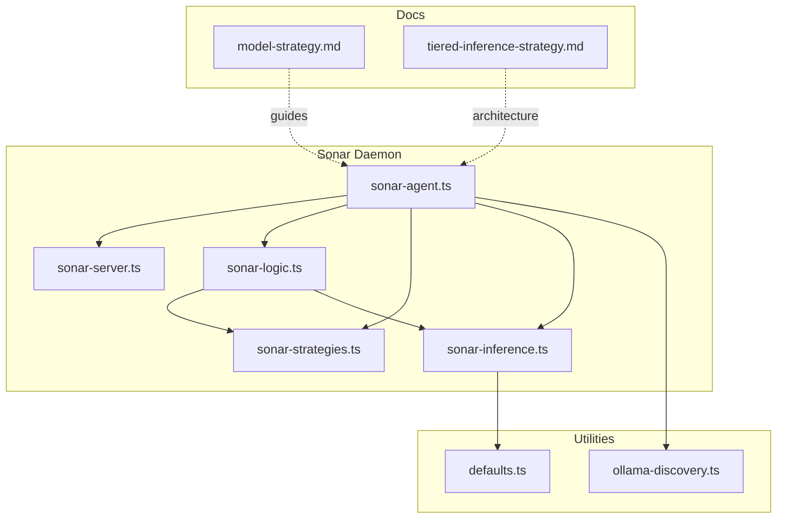
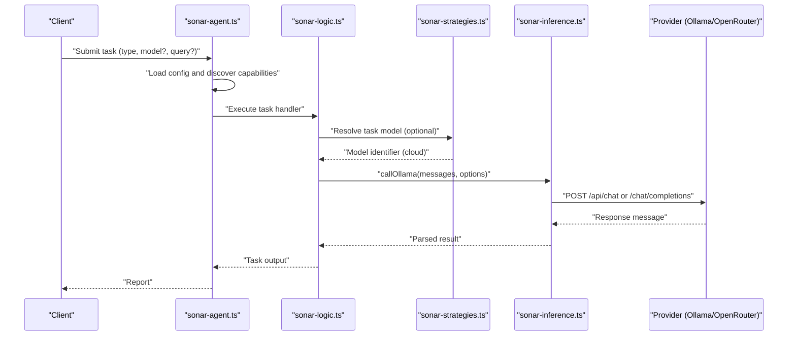
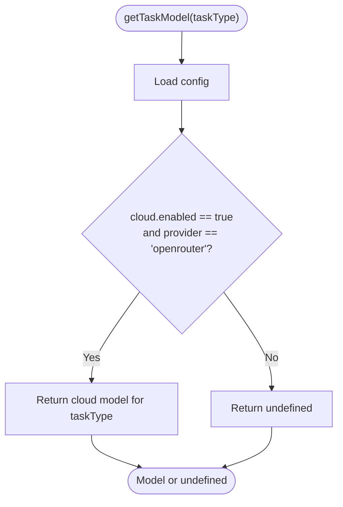
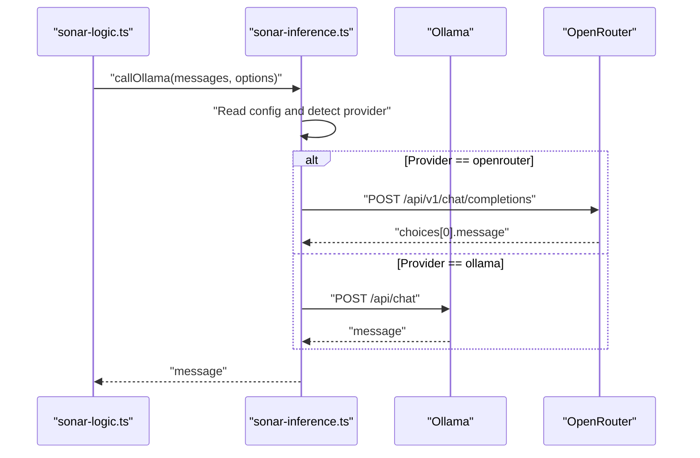
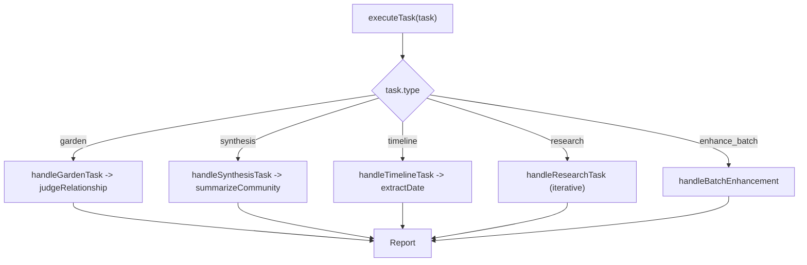
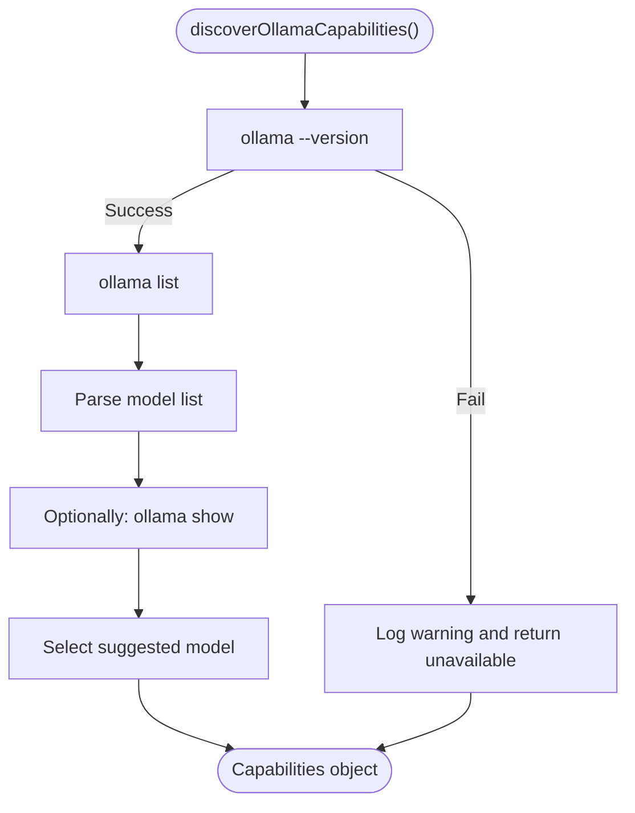
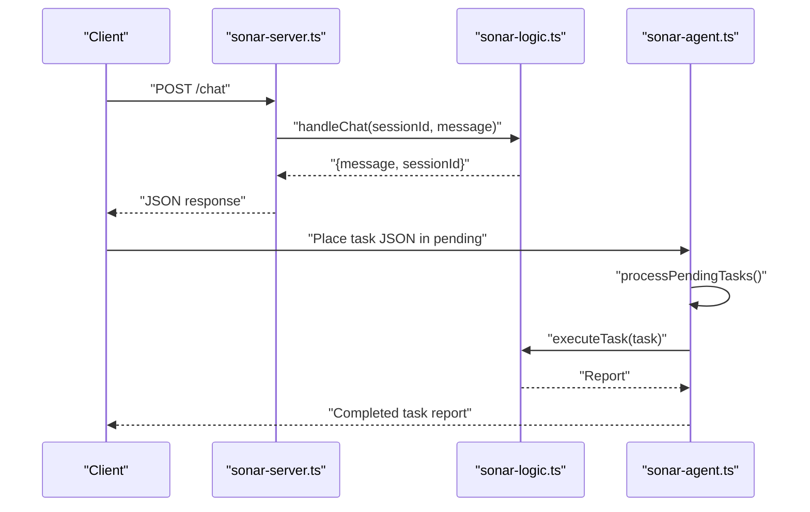
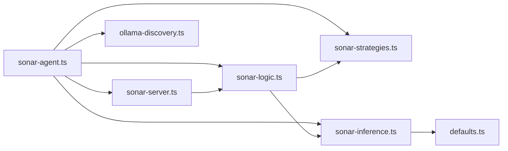

# Research Strategies

<cite>
**Referenced Files in This Document**
- [sonar-strategies.ts](file://src/daemon/sonar-strategies.ts)
- [sonar-inference.ts](file://src/daemon/sonar-inference.ts)
- [sonar-logic.ts](file://src/daemon/sonar-logic.ts)
- [sonar-agent.ts](file://src/daemon/sonar-agent.ts)
- [sonar-server.ts](file://src/daemon/sonar-server.ts)
- [sonar-types.ts](file://src/daemon/sonar-types.ts)
- [ollama-discovery.ts](file://src/utils/ollama-discovery.ts)
- [model-strategy.md](file://docs/guides/model-strategy.md)
- [tiered-inference-strategy.md](file://docs/architecture/tiered-inference-strategy.md)
- [defaults.ts](file://src/config/defaults.ts)
</cite>

## Table of Contents
1. [Introduction](#introduction)
2. [Project Structure](#project-structure)
3. [Core Components](#core-components)
4. [Architecture Overview](#architecture-overview)
5. [Detailed Component Analysis](#detailed-component-analysis)
6. [Dependency Analysis](#dependency-analysis)
7. [Performance Considerations](#performance-considerations)
8. [Troubleshooting Guide](#troubleshooting-guide)
9. [Conclusion](#conclusion)
10. [Appendices](#appendices)

## Introduction
This document explains the research strategies employed by the Sonar agent, focusing on strategy selection logic, model routing, and task-specific approach patterns. It details how the agent selects appropriate models for different task types, handles fallback scenarios, and optimizes for performance and accuracy. It also covers integration with inference providers (Ollama and cloud services), capability discovery mechanisms, and practical examples of strategy implementation. Guidance is included for configuration, debugging, and extending the strategy system.

## Project Structure
The Sonar subsystem is organized around a small set of focused modules:
- Strategy orchestration and task-specific strategies
- Inference routing and provider abstraction
- Task execution logic and API surface
- Capability discovery for local Ollama environments
- Configuration and documentation supporting tiered inference

**Diagram sources**
- [sonar-agent.ts](file://src/daemon/sonar-agent.ts#L1-L221)
- [sonar-server.ts](file://src/daemon/sonar-server.ts#L1-L134)
- [sonar-logic.ts](file://src/daemon/sonar-logic.ts#L1-L685)
- [sonar-strategies.ts](file://src/daemon/sonar-strategies.ts#L1-L187)
- [sonar-inference.ts](file://src/daemon/sonar-inference.ts#L1-L120)
- [ollama-discovery.ts](file://src/utils/ollama-discovery.ts#L1-L180)
- [defaults.ts](file://src/config/defaults.ts#L1-L143)
- [model-strategy.md](file://docs/guides/model-strategy.md#L1-L198)
- [tiered-inference-strategy.md](file://docs/architecture/tiered-inference-strategy.md#L1-L319)

**Section sources**
- [sonar-agent.ts](file://src/daemon/sonar-agent.ts#L1-L221)
- [sonar-server.ts](file://src/daemon/sonar-server.ts#L1-L134)
- [sonar-logic.ts](file://src/daemon/sonar-logic.ts#L1-L685)
- [sonar-strategies.ts](file://src/daemon/sonar-strategies.ts#L1-L187)
- [sonar-inference.ts](file://src/daemon/sonar-inference.ts#L1-L120)
- [ollama-discovery.ts](file://src/utils/ollama-discovery.ts#L1-L180)
- [defaults.ts](file://src/config/defaults.ts#L1-L143)
- [model-strategy.md](file://docs/guides/model-strategy.md#L1-L198)
- [tiered-inference-strategy.md](file://docs/architecture/tiered-inference-strategy.md#L1-L319)

## Core Components
- Strategy selection and task-specific strategies:
  - Task model resolution for cloud providers
  - Judge strategy for semantic relationship classification
  - Community synthesis strategy for summarizing clusters
  - Chronos strategy for extracting temporal anchors
- Inference routing and provider abstraction:
  - Unified call function supporting local Ollama and OpenRouter
  - Model priority chain and provider-specific headers
- Task execution and API:
  - Task routing by type, model injection, and report generation
  - HTTP endpoints for chat, metadata enhancement, and search utilities
- Capability discovery:
  - Ollama CLI-based discovery for model availability and selection
- Configuration:
  - Centralized settings loading and precedence rules

**Section sources**
- [sonar-strategies.ts](file://src/daemon/sonar-strategies.ts#L1-L187)
- [sonar-inference.ts](file://src/daemon/sonar-inference.ts#L1-L120)
- [sonar-logic.ts](file://src/daemon/sonar-logic.ts#L1-L685)
- [sonar-server.ts](file://src/daemon/sonar-server.ts#L1-L134)
- [sonar-agent.ts](file://src/daemon/sonar-agent.ts#L1-L221)
- [ollama-discovery.ts](file://src/utils/ollama-discovery.ts#L1-L180)
- [defaults.ts](file://src/config/defaults.ts#L1-L143)

## Architecture Overview
The Sonar agent implements a tiered inference strategy:
- Local-first operation with graceful fallback
- Optional cloud augmentation for higher-capability models
- Provider-agnostic inference calls routed through a single function
- Task-specific strategies orchestrated by the agent and logic modules

**Diagram sources**
- [sonar-agent.ts](file://src/daemon/sonar-agent.ts#L184-L217)
- [sonar-logic.ts](file://src/daemon/sonar-logic.ts#L323-L464)
- [sonar-strategies.ts](file://src/daemon/sonar-strategies.ts#L10-L28)
- [sonar-inference.ts](file://src/daemon/sonar-inference.ts#L19-L119)

## Detailed Component Analysis

### Strategy Selection Logic
- Cloud-enabled task model mapping:
  - When cloud is enabled and provider is OpenRouter, the agent resolves a cloud model per task type for research-oriented tasks.
  - The resolver returns undefined otherwise, deferring to local model selection.
- Model priority chain:
  - Per-request override takes precedence
  - Cloud model (when enabled) follows
  - Discovered local model (from capability discovery) follows
  - Config default follows
  - Hardcoded fallback completes the chain

**Diagram sources**
- [sonar-strategies.ts](file://src/daemon/sonar-strategies.ts#L10-L28)

**Section sources**
- [sonar-strategies.ts](file://src/daemon/sonar-strategies.ts#L10-L28)
- [sonar-inference.ts](file://src/daemon/sonar-inference.ts#L31-L38)
- [model-strategy.md](file://docs/guides/model-strategy.md#L101-L132)

### Model Routing and Provider Integration
- Unified inference call:
  - callOllama supports both local Ollama and OpenRouter
  - Provider selection is derived from configuration
  - Headers and endpoints differ by provider (OpenRouter requires referer/title headers)
- API key handling:
  - Prefers environment variable OPENROUTER_API_KEY over config
  - Logs presence/absence of keys for visibility
- Endpoint and payload differences:
  - Local Ollama: /api/chat with Ollama-native options
  - OpenRouter: /api/v1/chat/completions with OpenAI-compatible schema

**Diagram sources**
- [sonar-inference.ts](file://src/daemon/sonar-inference.ts#L19-L119)

**Section sources**
- [sonar-inference.ts](file://src/daemon/sonar-inference.ts#L19-L119)
- [tiered-inference-strategy.md](file://docs/architecture/tiered-inference-strategy.md#L88-L117)

### Task-Specific Approach Patterns
- Garden (relationship verification):
  - Uses Judge strategy to classify relationships between pairs of nodes
  - Applies throttling for free-tier providers
- Synthesis (community summarization):
  - Summarizes clusters of related nodes into canonical labels and concise syntheses
  - Optionally writes synthesis nodes to disk when autoApply is enabled
- Timeline (temporal anchoring):
  - Extracts primary dates from documents using regex heuristics and LLM fallback
  - Updates node metadata when autoApply is enabled
- Research (recursive discovery):
  - Iteratively decides actions (search/read/explore/finish) based on model guidance
  - Performs chain verification to ensure completeness
- Additional utilities:
  - Metadata enhancement, search analysis, reranking, and context extraction

**Diagram sources**
- [sonar-agent.ts](file://src/daemon/sonar-agent.ts#L184-L217)
- [sonar-logic.ts](file://src/daemon/sonar-logic.ts#L323-L464)
- [sonar-strategies.ts](file://src/daemon/sonar-strategies.ts#L34-L142)

**Section sources**
- [sonar-logic.ts](file://src/daemon/sonar-logic.ts#L323-L464)
- [sonar-strategies.ts](file://src/daemon/sonar-strategies.ts#L34-L142)
- [sonar-agent.ts](file://src/daemon/sonar-agent.ts#L184-L217)

### Capability Discovery Mechanisms
- Ollama CLI-based discovery:
  - Detects Ollama installation and lists available models
  - Parses model list and optional model info
  - Provides a suggested model for search tasks and maintains a list of all models
- Health checks:
  - Validates readiness via a quick CLI invocation
- Integration with agent startup:
  - Sets inferenceState.ollamaModel when available
  - Enables cloud mode fallback when local Ollama is unavailable

**Diagram sources**
- [ollama-discovery.ts](file://src/utils/ollama-discovery.ts#L83-L155)
- [sonar-agent.ts](file://src/daemon/sonar-agent.ts#L82-L96)

**Section sources**
- [ollama-discovery.ts](file://src/utils/ollama-discovery.ts#L83-L155)
- [sonar-agent.ts](file://src/daemon/sonar-agent.ts#L82-L96)

### API Surface and Task Execution
- HTTP endpoints:
  - Health check, chat, metadata enhancement, graph stats, search analysis, reranking, and context extraction
- Task execution:
  - Loads configuration, discovers capabilities, routes tasks by type, injects resolved models, executes handlers, and generates reports
- Session management:
  - Maintains chat sessions with system prompts and conversational history

**Diagram sources**
- [sonar-server.ts](file://src/daemon/sonar-server.ts#L58-L81)
- [sonar-logic.ts](file://src/daemon/sonar-logic.ts#L104-L179)
- [sonar-agent.ts](file://src/daemon/sonar-agent.ts#L138-L179)

**Section sources**
- [sonar-server.ts](file://src/daemon/sonar-server.ts#L1-L134)
- [sonar-logic.ts](file://src/daemon/sonar-logic.ts#L104-L179)
- [sonar-agent.ts](file://src/daemon/sonar-agent.ts#L138-L179)

## Dependency Analysis
- Module coupling:
  - sonar-logic depends on sonar-strategies and sonar-inference
  - sonar-agent orchestrates logic, strategies, inference, and server
  - sonar-server exposes HTTP endpoints backed by logic handlers
  - ollama-discovery feeds capability data into inference state
- External dependencies:
  - Ollama CLI for capability discovery
  - OpenRouter API for cloud inference (when enabled)
- Configuration:
  - Centralized settings via defaults.ts with strict schema validation

**Diagram sources**
- [sonar-agent.ts](file://src/daemon/sonar-agent.ts#L1-L221)
- [sonar-server.ts](file://src/daemon/sonar-server.ts#L1-L134)
- [sonar-logic.ts](file://src/daemon/sonar-logic.ts#L1-L685)
- [sonar-strategies.ts](file://src/daemon/sonar-strategies.ts#L1-L187)
- [sonar-inference.ts](file://src/daemon/sonar-inference.ts#L1-L120)
- [ollama-discovery.ts](file://src/utils/ollama-discovery.ts#L1-L180)
- [defaults.ts](file://src/config/defaults.ts#L1-L143)

**Section sources**
- [sonar-agent.ts](file://src/daemon/sonar-agent.ts#L1-L221)
- [sonar-server.ts](file://src/daemon/sonar-server.ts#L1-L134)
- [sonar-logic.ts](file://src/daemon/sonar-logic.ts#L1-L685)
- [sonar-strategies.ts](file://src/daemon/sonar-strategies.ts#L1-L187)
- [sonar-inference.ts](file://src/daemon/sonar-inference.ts#L1-L120)
- [ollama-discovery.ts](file://src/utils/ollama-discovery.ts#L1-L180)
- [defaults.ts](file://src/config/defaults.ts#L1-L143)

## Performance Considerations
- Model selection:
  - Prefer smaller models for routine tasks (e.g., qwen2.5:1.5b) to reduce latency
  - Reserve larger models for complex reasoning and synthesis
- Provider strategy:
  - Use local inference for frequent, low-latency operations
  - Use cloud inference for heavy tasks during development or when quality is critical
- Throttling:
  - Free-tier providers may require delays between requests
- Resource sizing:
  - Right-size hardware based on model and workload requirements
- Graceful degradation:
  - Fallbacks ensure operations continue even if model responses are malformed

[No sources needed since this section provides general guidance]

## Troubleshooting Guide
- Local Ollama not available:
  - Verify Ollama installation and that the CLI responds
  - Check capability discovery logs and inference state
- Cloud provider issues:
  - Confirm API key presence and validity
  - Inspect provider-specific headers and endpoints
- Malformed model responses:
  - Use safe JSON parsing helpers to recover from partial or wrapped JSON
- Task failures:
  - Review task reports and error logs generated during processing
- Health endpoint:
  - Use the health check to confirm provider and model selection

**Section sources**
- [sonar-agent.ts](file://src/daemon/sonar-agent.ts#L82-L96)
- [sonar-inference.ts](file://src/daemon/sonar-inference.ts#L44-L54)
- [sonar-logic.ts](file://src/daemon/sonar-logic.ts#L669-L684)
- [sonar-server.ts](file://src/daemon/sonar-server.ts#L40-L53)

## Conclusion
The Sonar agent’s research strategies combine a clear model routing policy with task-specific approaches and robust fallbacks. By leveraging local-first operation augmented by cloud providers, the system balances performance, privacy, and cost. The modular design enables easy extension of strategies, providers, and configuration, while documentation and discovery utilities support reliable operation across diverse environments.

[No sources needed since this section summarizes without analyzing specific files]

## Appendices

### Practical Examples
- Enabling cloud inference for research tasks:
  - Configure cloud provider and model, set API key in environment
  - Tasks will route to cloud models when enabled
- Overriding models per task:
  - Include a model field in the task JSON to force a specific model for that run
- Using local-only mode:
  - Disable cloud and rely on discovered local models for all tasks

**Section sources**
- [model-strategy.md](file://docs/guides/model-strategy.md#L32-L48)
- [sonar-agent.ts](file://src/daemon/sonar-agent.ts#L189-L191)
- [sonar-inference.ts](file://src/daemon/sonar-inference.ts#L31-L38)

### Strategy Configuration Checklist
- Enable/disable cloud and select provider
- Set cloud host and model
- Provide API key via environment
- Define local model and host
- Validate capability discovery and inference state

**Section sources**
- [defaults.ts](file://src/config/defaults.ts#L84-L139)
- [sonar-inference.ts](file://src/daemon/sonar-inference.ts#L23-L54)
- [model-strategy.md](file://docs/guides/model-strategy.md#L174-L194)