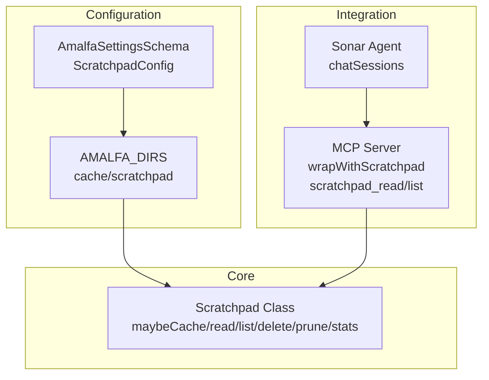
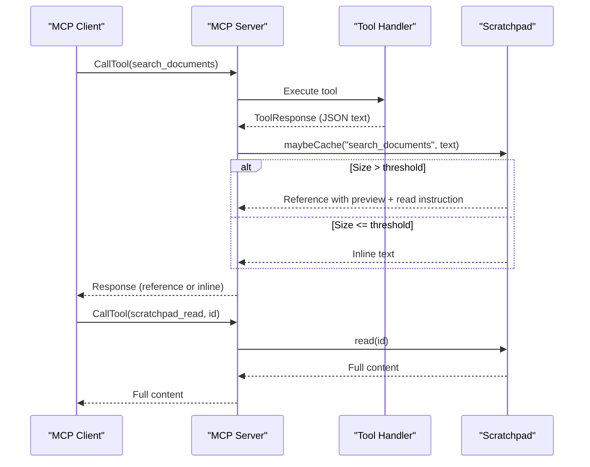
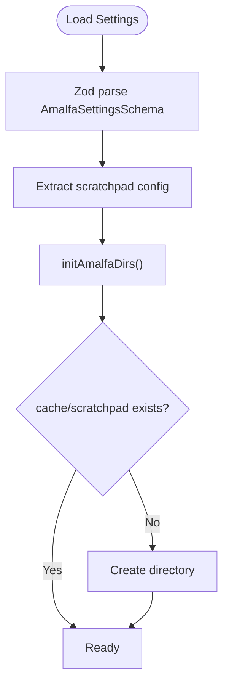
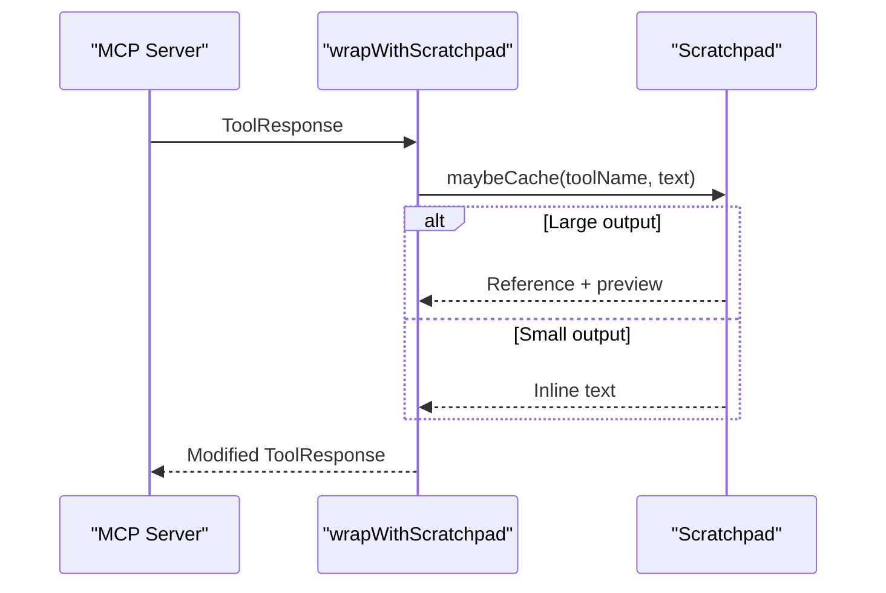
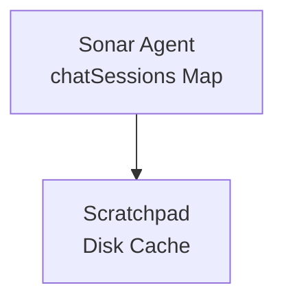
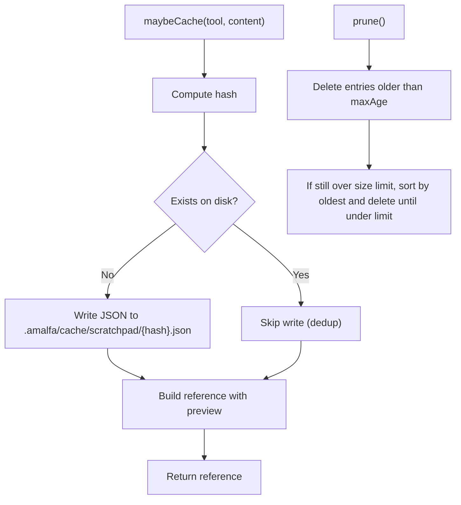

# Scratchpad System

<cite>
**Referenced Files in This Document**
- [Scratchpad.ts](file://src/utils/Scratchpad.ts)
- [schema.ts](file://src/config/schema.ts)
- [defaults.ts](file://src/config/defaults.ts)
- [index.ts](file://src/mcp/index.ts)
- [sonar-agent.ts](file://src/daemon/sonar-agent.ts)
- [sonar-types.ts](file://src/daemon/sonar-types.ts)
- [SCRATCHPAD-INNOVATION.md](file://docs/SCRATCHPAD-INNOVATION.md)
- [scratchpad.test.ts](file://tests/scratchpad.test.ts)
</cite>

## Table of Contents
1. [Introduction](#introduction)
2. [Project Structure](#project-structure)
3. [Core Components](#core-components)
4. [Architecture Overview](#architecture-overview)
5. [Detailed Component Analysis](#detailed-component-analysis)
6. [Dependency Analysis](#dependency-analysis)
7. [Performance Considerations](#performance-considerations)
8. [Troubleshooting Guide](#troubleshooting-guide)
9. [Conclusion](#conclusion)
10. [Appendices](#appendices)

## Introduction
The scratchpad system is Amalfa’s solution to the Model Context Protocol (MCP) context window problem. It intercepts large tool outputs, caches them to disk with a content-addressable identifier, and returns a compact reference with a preview instead of the full content. This enables agents to perform broad searches and multi-hop exploration without inflating context, while preserving access to the complete data on demand. The system is configured centrally, integrated into the MCP toolchain, and designed for persistence across sessions.

## Project Structure
The scratchpad lives in the utilities layer and integrates with configuration, MCP tooling, and the Sonar agent ecosystem. Key locations:
- Core implementation: src/utils/Scratchpad.ts
- Configuration schema and defaults: src/config/schema.ts, src/config/defaults.ts
- MCP integration: src/mcp/index.ts
- Agent session management: src/daemon/sonar-agent.ts, src/daemon/sonar-types.ts
- Documentation and innovation rationale: docs/SCRATCHPAD-INNOVATION.md
- Tests: tests/scratchpad.test.ts



**Diagram sources**
- [schema.ts](file://src/config/schema.ts#L110-L117)
- [defaults.ts](file://src/config/defaults.ts#L16-L40)
- [Scratchpad.ts](file://src/utils/Scratchpad.ts#L59-L75)
- [index.ts](file://src/mcp/index.ts#L68-L92)
- [sonar-agent.ts](file://src/daemon/sonar-agent.ts#L47)

**Section sources**
- [schema.ts](file://src/config/schema.ts#L110-L117)
- [defaults.ts](file://src/config/defaults.ts#L16-L40)
- [Scratchpad.ts](file://src/utils/Scratchpad.ts#L59-L75)
- [index.ts](file://src/mcp/index.ts#L68-L92)
- [sonar-agent.ts](file://src/daemon/sonar-agent.ts#L47)

## Core Components
- Scratchpad class: Provides caching, content-type detection, preview generation, deduplication, and lifecycle operations (read, list, delete, prune, clear, stats).
- Configuration: Centralized via AmalfaSettingsSchema with a dedicated scratchpad subsection and defaults.
- MCP integration: Wraps tool responses with maybeCache and exposes retrieval tools (scratchpad_read, scratchpad_list).
- Agent ecosystem: Sessions managed by the Sonar agent; scratchpad supports multi-turn conversations and cross-session persistence.

Key responsibilities:
- Reduce context usage for large outputs by returning references with previews.
- Preserve full fidelity: agents can retrieve the entire content later.
- Manage memory and disk usage with pruning and size limits.
- Support multi-session workflows with persistent storage.

**Section sources**
- [Scratchpad.ts](file://src/utils/Scratchpad.ts#L59-L405)
- [schema.ts](file://src/config/schema.ts#L243-L251)
- [index.ts](file://src/mcp/index.ts#L644-L671)
- [sonar-agent.ts](file://src/daemon/sonar-agent.ts#L47)

## Architecture Overview
The scratchpad operates as a middleware layer between tool execution and the MCP response. When a tool produces a large output, the MCP server serializes the response, checks its size against the configured threshold, and either returns the content inline or caches it and returns a reference with a preview. The agent can then request the full content by ID.



**Diagram sources**
- [index.ts](file://src/mcp/index.ts#L76-L92)
- [index.ts](file://src/mcp/index.ts#L495-L509)
- [index.ts](file://src/mcp/index.ts#L644-L657)
- [Scratchpad.ts](file://src/utils/Scratchpad.ts#L147-L190)
- [Scratchpad.ts](file://src/utils/Scratchpad.ts#L195-L210)

## Detailed Component Analysis

### Scratchpad Class
The Scratchpad class encapsulates the caching and retrieval logic:
- maybeCache: Computes a SHA256-based short hash, detects content type, generates a preview, writes to disk if not already cached, and returns a reference string with optional preview and read instruction.
- read/readContent: Loads a cached entry by ID and returns the full content or just the content string.
- list: Enumerates cached entries with metadata only (no content).
- delete: Removes a specific entry.
- prune: Removes expired entries and oldest entries to enforce max cache size.
- clear: Removes all entries.
- stats: Aggregates counts, sizes, and timestamps.

```mermaid
classDiagram
class Scratchpad {
-config : Required<ScratchpadConfig>
-dir : string
+constructor(config)
-hash(content) : string
-detectContentType(content) : "json"|"text"|"markdown"
-generatePreview(content, contentType) : string
-formatSize(bytes) : string
+maybeCache(tool, content) : string
+read(id) : ScratchpadEntry|null
+readContent(id) : string|null
+list() : Omit<ScratchpadEntry,"content">[]
+delete(id) : boolean
+prune() : {deleted, freedBytes}
+clear() : number
+stats() : Stats
}
class ScratchpadEntry {
+string id
+string tool
+string timestamp
+number sizeBytes
+string contentType
+string preview
+string content
}
Scratchpad --> ScratchpadEntry : "creates/reads"
```

**Diagram sources**
- [Scratchpad.ts](file://src/utils/Scratchpad.ts#L30-L46)
- [Scratchpad.ts](file://src/utils/Scratchpad.ts#L59-L405)

**Section sources**
- [Scratchpad.ts](file://src/utils/Scratchpad.ts#L59-L405)

### Configuration and Initialization
- The scratchpad configuration is part of AmalfaSettingsSchema and injected via Zod parsing. Defaults are enforced at the schema level.
- Directory initialization ensures .amalfa/cache/scratchpad exists before use.
- The MCP server constructs a scratchpad instance from the loaded configuration and wraps tool responses.



**Diagram sources**
- [schema.ts](file://src/config/schema.ts#L243-L251)
- [defaults.ts](file://src/config/defaults.ts#L43-L59)
- [index.ts](file://src/mcp/index.ts#L68-L73)

**Section sources**
- [schema.ts](file://src/config/schema.ts#L243-L251)
- [defaults.ts](file://src/config/defaults.ts#L43-L59)
- [index.ts](file://src/mcp/index.ts#L68-L73)

### MCP Integration
- wrapWithScratchpad: Serializes tool responses, checks size, and returns either the inline text or a reference generated by maybeCache.
- Tool handlers for search_documents, read_node_content, find_gaps, and others use wrapWithScratchpad to cache large outputs.
- Retrieval tools:
  - scratchpad_read(id): Returns the full cached content.
  - scratchpad_list(): Returns cached entries with metadata and cache stats.



**Diagram sources**
- [index.ts](file://src/mcp/index.ts#L76-L92)
- [index.ts](file://src/mcp/index.ts#L495-L509)
- [index.ts](file://src/mcp/index.ts#L644-L671)

**Section sources**
- [index.ts](file://src/mcp/index.ts#L76-L92)
- [index.ts](file://src/mcp/index.ts#L495-L509)
- [index.ts](file://src/mcp/index.ts#L644-L671)

### Agent Ecosystem Integration
- The Sonar agent maintains a Map of chat sessions, enabling multi-turn conversations. The scratchpad complements this by allowing agents to cache and revisit large outputs across turns without re-executing heavy tools.
- Sessions are scoped to the agent runtime; scratchpad entries persist on disk and are available across sessions.



**Diagram sources**
- [sonar-agent.ts](file://src/daemon/sonar-agent.ts#L47)
- [sonar-types.ts](file://src/daemon/sonar-types.ts#L10-L14)

**Section sources**
- [sonar-agent.ts](file://src/daemon/sonar-agent.ts#L47)
- [sonar-types.ts](file://src/daemon/sonar-types.ts#L10-L14)

### Storage Mechanism and Lifecycle
- Storage: Disk files named by a 12-character hash prefix of the SHA256 digest of the content, stored under .amalfa/cache/scratchpad.
- Deduplication: Identical content yields the same hash; cached once and reused.
- Lifecycle:
  - Creation: maybeCache writes JSON with metadata and content.
  - Access: read returns the full entry; readContent returns content only.
  - Listing: list returns metadata without content.
  - Cleanup: prune deletes by age then oldest to enforce size limits; clear removes all; delete removes a single entry.
  - Stats: aggregates counts, total size, and timestamps.



**Diagram sources**
- [Scratchpad.ts](file://src/utils/Scratchpad.ts#L156-L190)
- [Scratchpad.ts](file://src/utils/Scratchpad.ts#L272-L349)

**Section sources**
- [Scratchpad.ts](file://src/utils/Scratchpad.ts#L156-L190)
- [Scratchpad.ts](file://src/utils/Scratchpad.ts#L272-L349)

### Retrieval Patterns and Conversational Context
- Tiered retrieval: Agents receive a compact reference with a preview, then selectively call scratchpad_read to retrieve specific entries.
- Multi-turn conversations: Agents can reference cached IDs across turns, leveraging the persistent disk cache to maintain context across sessions.
- Content-type awareness: JSON arrays and objects are summarized differently to aid decision-making.

**Section sources**
- [SCRATCHPAD-INNOVATION.md](file://docs/SCRATCHPAD-INNOVATION.md#L109-L122)
- [index.ts](file://src/mcp/index.ts#L644-L657)
- [Scratchpad.ts](file://src/utils/Scratchpad.ts#L87-L129)

## Dependency Analysis
- Configuration dependency: Scratchpad depends on AmalfaSettingsSchema for its configuration, ensuring centralized defaults and validation.
- Directory dependency: Uses AMALFA_DIRS.scratchpad to resolve the cache directory.
- MCP dependency: The MCP server composes scratchpad into tool response wrapping and exposes retrieval tools.
- Agent dependency: The Sonar agent’s chatSessions enable multi-turn usage of cached outputs.


**Diagram sources**
- [schema.ts](file://src/config/schema.ts#L110-L117)
- [defaults.ts](file://src/config/defaults.ts#L16-L40)
- [Scratchpad.ts](file://src/utils/Scratchpad.ts#L63-L75)
- [index.ts](file://src/mcp/index.ts#L68-L73)
- [sonar-agent.ts](file://src/daemon/sonar-agent.ts#L47)

**Section sources**
- [schema.ts](file://src/config/schema.ts#L110-L117)
- [defaults.ts](file://src/config/defaults.ts#L16-L40)
- [Scratchpad.ts](file://src/utils/Scratchpad.ts#L63-L75)
- [index.ts](file://src/mcp/index.ts#L68-L73)
- [sonar-agent.ts](file://src/daemon/sonar-agent.ts#L47)

## Performance Considerations
- Context reduction: The scratchpad reduces context usage by orders of magnitude for large outputs, enabling broader searches and multi-hop exploration.
- Disk I/O overhead: Writes and reads are small JSON files; overhead is minimal compared to token costs saved.
- Memory optimization: Only previews and references are held in memory; full content is loaded on demand.
- Deduplication: Identical outputs share storage, reducing disk usage.
- Pruning: Automatic cleanup prevents cache bloat; configurable thresholds balance retention and space.
- Recommendations:
  - Tune thresholdBytes and maxCacheSizeBytes for workload characteristics.
  - Monitor stats() to track cache growth and adjust policies.
  - Prefer content-addressable storage for repeated results.

[No sources needed since this section provides general guidance]

## Troubleshooting Guide
Common issues and resolutions:
- Entry not found when reading by ID:
  - Verify the ID matches the 12-character hash prefix and the file exists under .amalfa/cache/scratchpad.
  - Use scratchpad_list to confirm presence and timestamps.
- Corrupted or unreadable entries:
  - The list operation skips malformed entries; prune or clear to remove problematic files.
- Excessive cache size:
  - Run prune to remove old and least-recently-used entries; adjust maxCacheSizeBytes.
- Preview not helpful:
  - Confirm includePreview and previewLength settings; content-type detection affects preview generation.
- Disk permissions:
  - Ensure the process has read/write access to .amalfa/cache/scratchpad.

Validation and behavior are covered by tests:
- maybeCache returns inline for small content and reference for large content.
- readContent retrieves the original content by ID.
- list returns metadata without content.
- delete and clear remove entries; prune enforces limits.
- stats aggregates counts and sizes.

**Section sources**
- [scratchpad.test.ts](file://tests/scratchpad.test.ts#L47-L165)
- [Scratchpad.ts](file://src/utils/Scratchpad.ts#L195-L210)
- [Scratchpad.ts](file://src/utils/Scratchpad.ts#L223-L247)
- [Scratchpad.ts](file://src/utils/Scratchpad.ts#L252-L267)
- [Scratchpad.ts](file://src/utils/Scratchpad.ts#L354-L373)
- [Scratchpad.ts](file://src/utils/Scratchpad.ts#L378-L404)

## Conclusion
The scratchpad system is a pragmatic, content-addressable solution that preserves full data fidelity while dramatically reducing context usage in MCP environments. It integrates seamlessly with Amalfa’s configuration, MCP tooling, and the Sonar agent ecosystem, enabling comprehensive search and multi-hop exploration without context anxiety. With pruning, deduplication, and human-readable cache entries, it balances performance, reliability, and transparency.

[No sources needed since this section summarizes without analyzing specific files]

## Appendices

### Practical Usage Patterns
- Caching large tool outputs:
  - Use maybeCache in tool wrappers to automatically cache large responses.
- Selective retrieval:
  - Provide agents with references and previews; agents call scratchpad_read only when needed.
- Managing cache:
  - Periodically call scratchpad_list and stats to monitor usage.
  - Trigger prune or clear when thresholds are exceeded.

**Section sources**
- [index.ts](file://src/mcp/index.ts#L76-L92)
- [index.ts](file://src/mcp/index.ts#L660-L671)
- [Scratchpad.ts](file://src/utils/Scratchpad.ts#L223-L247)
- [Scratchpad.ts](file://src/utils/Scratchpad.ts#L378-L404)