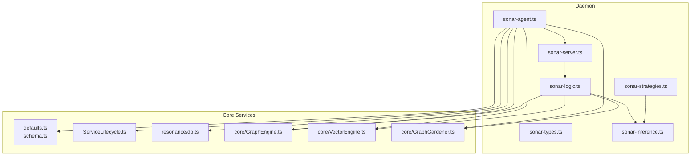
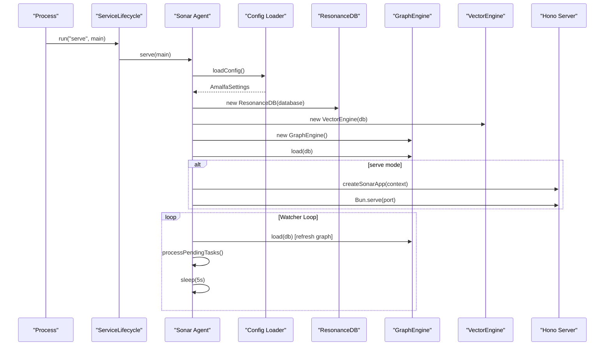
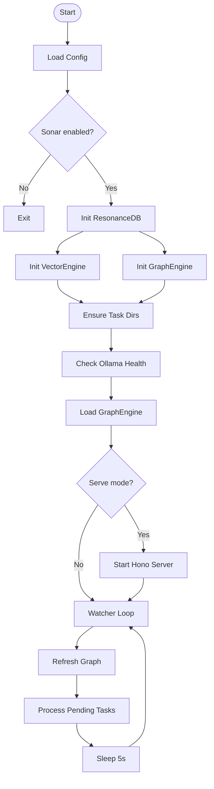
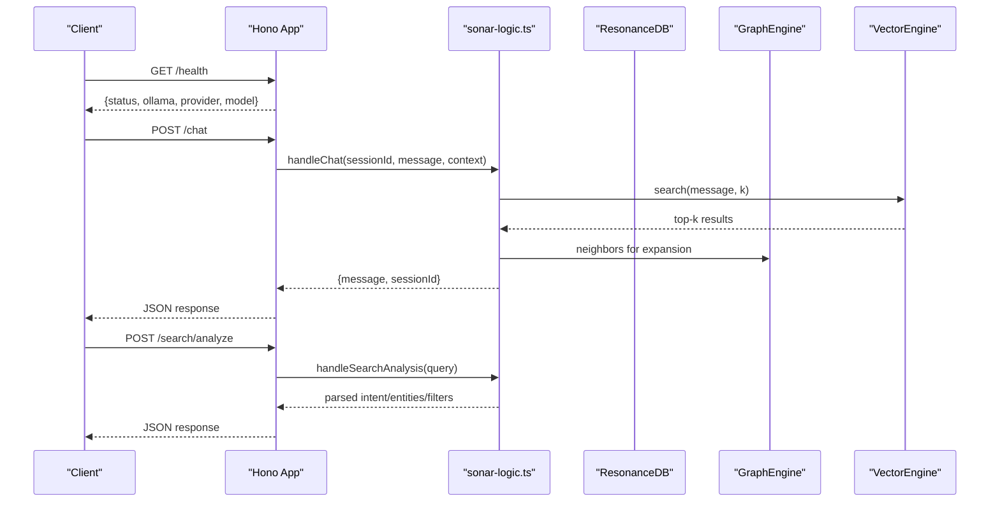
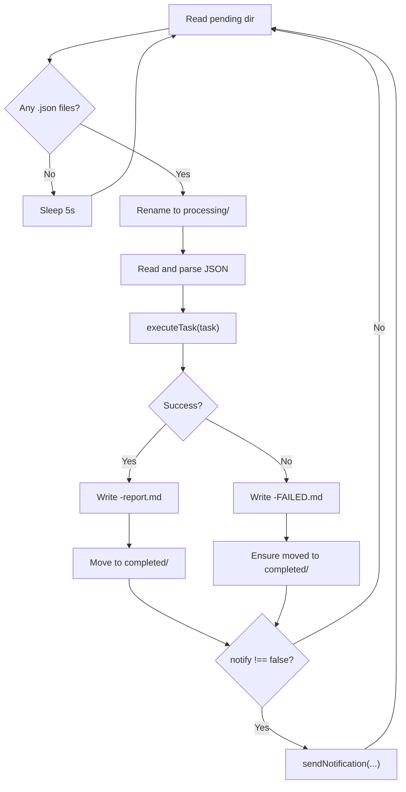
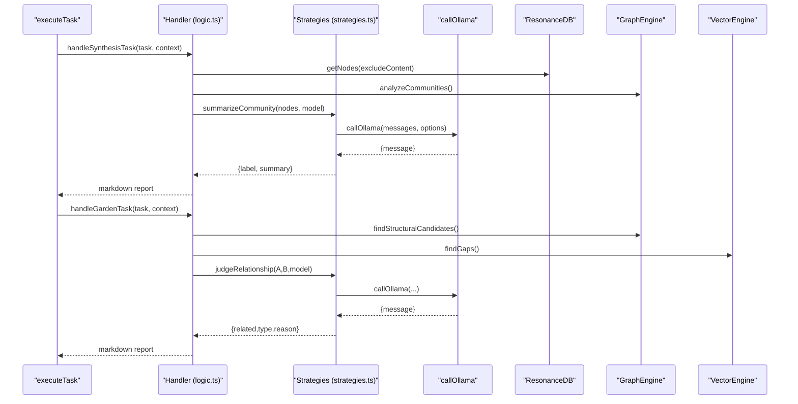
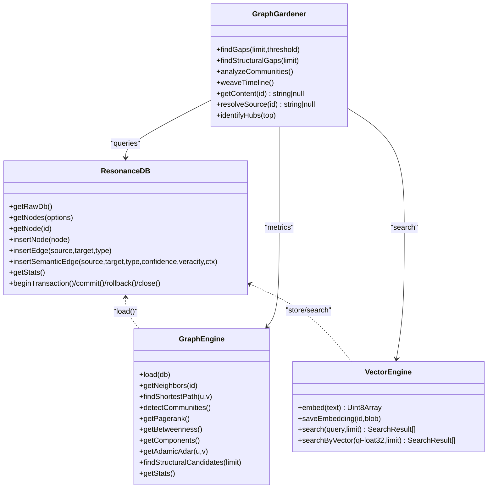
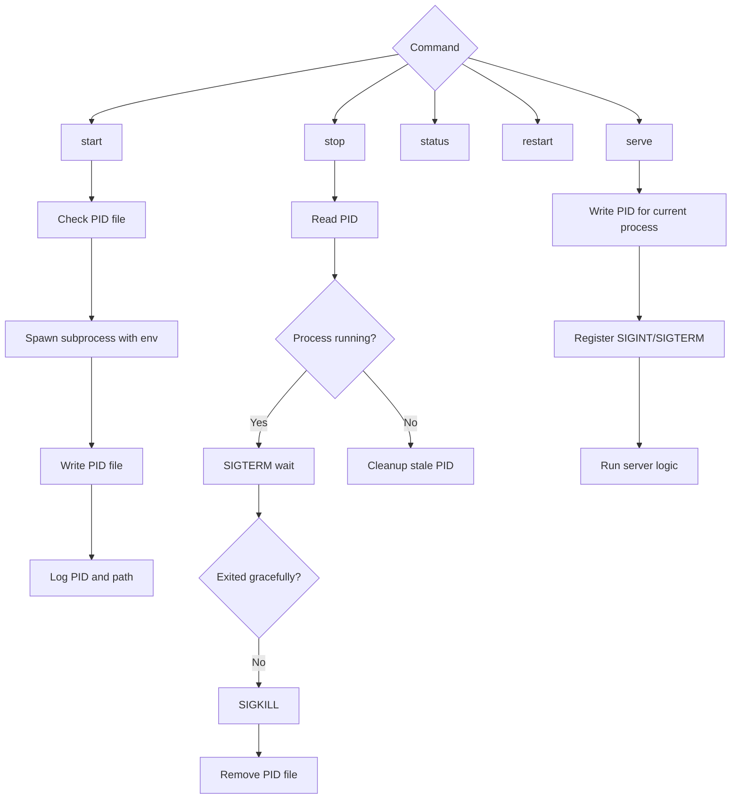
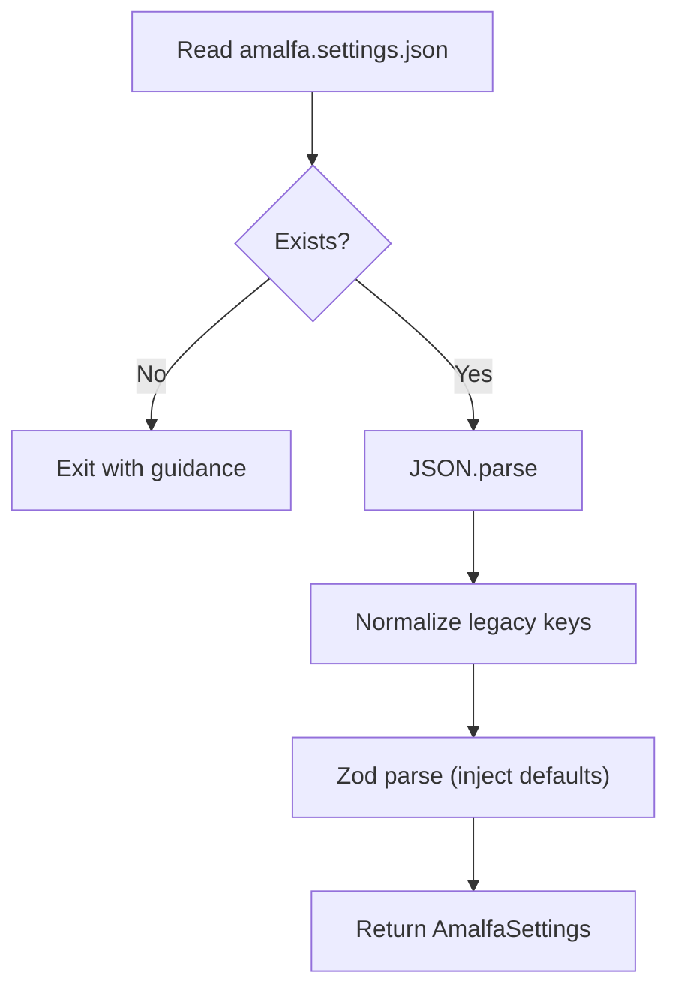
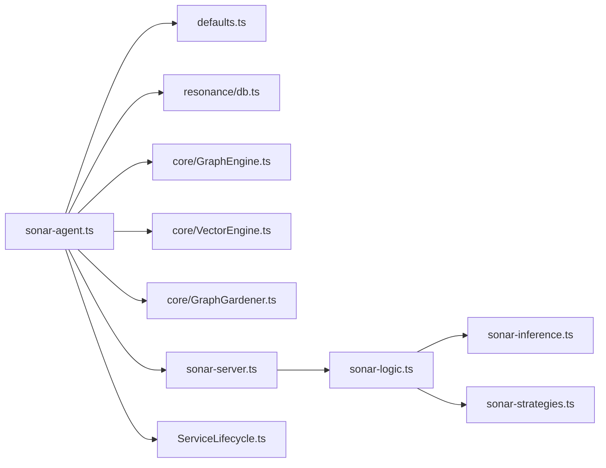

# Sonar Agent Architecture

<cite>
**Referenced Files in This Document**
- [sonar-agent.ts](file://src/daemon/sonar-agent.ts)
- [sonar-server.ts](file://src/daemon/sonar-server.ts)
- [sonar-logic.ts](file://src/daemon/sonar-logic.ts)
- [sonar-types.ts](file://src/daemon/sonar-types.ts)
- [sonar-strategies.ts](file://src/daemon/sonar-strategies.ts)
- [sonar-inference.ts](file://src/daemon/sonar-inference.ts)
- [ServiceLifecycle.ts](file://src/utils/ServiceLifecycle.ts)
- [defaults.ts](file://src/config/defaults.ts)
- [schema.ts](file://src/config/schema.ts)
- [db.ts](file://src/resonance/db.ts)
- [GraphEngine.ts](file://src/core/GraphEngine.ts)
- [VectorEngine.ts](file://src/core/VectorEngine.ts)
- [GraphGardener.ts](file://src/core/GraphGardener.ts)
</cite>

## Table of Contents
1. [Introduction](#introduction)
2. [Project Structure](#project-structure)
3. [Core Components](#core-components)
4. [Architecture Overview](#architecture-overview)
5. [Detailed Component Analysis](#detailed-component-analysis)
6. [Dependency Analysis](#dependency-analysis)
7. [Performance Considerations](#performance-considerations)
8. [Troubleshooting Guide](#troubleshooting-guide)
9. [Conclusion](#conclusion)

## Introduction
This document explains the Sonar Agent architecture: a multi-threaded, task-driven agent that orchestrates knowledge graph operations, integrates an HTTP server, and coordinates ResonanceDB, GraphEngine, and VectorEngine. It covers the main entry point, configuration loading, initialization sequence, the task processing loop, directory-based task queue management, error handling, and practical operational procedures such as health checks and graceful shutdown.

## Project Structure
The Sonar Agent lives under the daemon subsystem and composes core services:
- Entry point and orchestration: src/daemon/sonar-agent.ts
- HTTP server and routes: src/daemon/sonar-server.ts
- Business logic and task handlers: src/daemon/sonar-logic.ts
- Type definitions: src/daemon/sonar-types.ts
- Inference strategies and LLM calls: src/daemon/sonar-strategies.ts, src/daemon/sonar-inference.ts
- Service lifecycle manager: src/utils/ServiceLifecycle.ts
- Configuration: src/config/defaults.ts, src/config/schema.ts
- Data persistence and graph/vector engines: src/resonance/db.ts, src/core/GraphEngine.ts, src/core/VectorEngine.ts, src/core/GraphGardener.ts

**Diagram sources**
- [sonar-agent.ts](file://src/daemon/sonar-agent.ts#L1-L221)
- [sonar-server.ts](file://src/daemon/sonar-server.ts#L1-L134)
- [sonar-logic.ts](file://src/daemon/sonar-logic.ts#L1-L685)
- [sonar-types.ts](file://src/daemon/sonar-types.ts#L1-L69)
- [sonar-strategies.ts](file://src/daemon/sonar-strategies.ts#L1-L187)
- [sonar-inference.ts](file://src/daemon/sonar-inference.ts#L1-L120)
- [ServiceLifecycle.ts](file://src/utils/ServiceLifecycle.ts#L1-L209)
- [defaults.ts](file://src/config/defaults.ts#L1-L143)
- [schema.ts](file://src/config/schema.ts#L1-L298)
- [db.ts](file://src/resonance/db.ts#L1-L488)
- [GraphEngine.ts](file://src/core/GraphEngine.ts#L1-L314)
- [VectorEngine.ts](file://src/core/VectorEngine.ts#L1-L242)
- [GraphGardener.ts](file://src/core/GraphGardener.ts#L1-L270)

**Section sources**
- [sonar-agent.ts](file://src/daemon/sonar-agent.ts#L1-L221)
- [defaults.ts](file://src/config/defaults.ts#L1-L143)
- [schema.ts](file://src/config/schema.ts#L1-L298)

## Core Components
- Sonar Agent entry point: Initializes configuration, database, engines, HTTP server (optional), and the task watcher loop.
- HTTP server: Exposes health, chat, metadata enhancement, graph stats, search analysis, reranking, and context extraction endpoints.
- Logic handlers: Implement task-specific workflows (synthesis, timeline, garden, research, batch enhancement) and integrate with GraphEngine, VectorEngine, and ResonanceDB.
- Inference integration: Centralized LLM calls supporting local Ollama and cloud providers (OpenRouter).
- Lifecycle manager: Manages start/stop/status/serve with PID/log file handling and signal cleanup.
- Configuration: Loads and validates settings from a single source of truth with defaults injected by schema.

**Section sources**
- [sonar-agent.ts](file://src/daemon/sonar-agent.ts#L57-L116)
- [sonar-server.ts](file://src/daemon/sonar-server.ts#L24-L133)
- [sonar-logic.ts](file://src/daemon/sonar-logic.ts#L19-L685)
- [sonar-inference.ts](file://src/daemon/sonar-inference.ts#L19-L119)
- [ServiceLifecycle.ts](file://src/utils/ServiceLifecycle.ts#L12-L208)
- [defaults.ts](file://src/config/defaults.ts#L84-L142)
- [schema.ts](file://src/config/schema.ts#L54-L88)

## Architecture Overview
The Sonar Agent is a long-running process that:
- Loads configuration and ensures required directories exist.
- Establishes ResonanceDB, initializes GraphEngine in-memory graph, and prepares VectorEngine.
- Optionally starts an HTTP server exposing a Hono app with CORS and JSON endpoints.
- Runs a continuous task watcher loop that processes JSON task files from a directory queue.

**Diagram sources**
- [ServiceLifecycle.ts](file://src/utils/ServiceLifecycle.ts#L178-L207)
- [sonar-agent.ts](file://src/daemon/sonar-agent.ts#L60-L116)
- [defaults.ts](file://src/config/defaults.ts#L84-L142)
- [db.ts](file://src/resonance/db.ts#L25-L68)
- [GraphEngine.ts](file://src/core/GraphEngine.ts#L50-L100)
- [VectorEngine.ts](file://src/core/VectorEngine.ts#L76-L109)
- [sonar-server.ts](file://src/daemon/sonar-server.ts#L24-L133)

## Detailed Component Analysis

### Main Entry Point and Initialization
- Parses argv and selects command ("serve" by default).
- Loads configuration and validates Sonar enablement.
- Constructs ResonanceDB, VectorEngine, and GraphEngine.
- Ensures task directories exist for pending, processing, and completed queues.
- Performs initial health checks for local inference availability and capability discovery.
- Loads GraphEngine from the database.
- Starts HTTP server if configured.
- Enters the watcher loop to process tasks periodically.

**Diagram sources**
- [sonar-agent.ts](file://src/daemon/sonar-agent.ts#L60-L116)

**Section sources**
- [sonar-agent.ts](file://src/daemon/sonar-agent.ts#L36-L116)
- [defaults.ts](file://src/config/defaults.ts#L84-L142)
- [db.ts](file://src/resonance/db.ts#L25-L68)
- [GraphEngine.ts](file://src/core/GraphEngine.ts#L50-L100)
- [VectorEngine.ts](file://src/core/VectorEngine.ts#L76-L109)

### HTTP Server Integration
- Creates a Hono app with CORS middleware.
- Exposes endpoints:
  - GET /health: Reports status, provider, and model.
  - POST /chat: Chat with session management and graph-aware augmentation.
  - POST /metadata/enhance: Enhances node metadata via LLM.
  - GET /graph/stats: Returns graph statistics.
  - POST /search/analyze: Parses query intent.
  - POST /search/rerank: Re-ranks results with LLM.
  - POST /search/context: Extracts relevant snippet from a result.
- Uses a shared SonarContext containing ResonanceDB, GraphEngine, GraphGardener, and chat sessions.

**Diagram sources**
- [sonar-server.ts](file://src/daemon/sonar-server.ts#L24-L133)
- [sonar-logic.ts](file://src/daemon/sonar-logic.ts#L104-L218)
- [VectorEngine.ts](file://src/core/VectorEngine.ts#L227-L240)
- [GraphEngine.ts](file://src/core/GraphEngine.ts#L105-L108)

**Section sources**
- [sonar-server.ts](file://src/daemon/sonar-server.ts#L24-L133)
- [sonar-logic.ts](file://src/daemon/sonar-logic.ts#L104-L218)

### Task Processing Loop and Directory-Based Queue
- Watches a pending directory for .json task files.
- Moves each file atomically to processing, parses JSON, executes the appropriate handler, writes a markdown report, and moves to completed.
- On success: optional desktop notification.
- On failure: writes a FAILED report and ensures the file ends up in completed.
- The loop reloads the GraphEngine from the database before processing to reflect recent changes.

**Diagram sources**
- [sonar-agent.ts](file://src/daemon/sonar-agent.ts#L138-L179)

**Section sources**
- [sonar-agent.ts](file://src/daemon/sonar-agent.ts#L138-L179)

### Task Handlers and Strategies
- Execution routes by task.type:
  - synthesis: Summarize communities using LLM strategies.
  - timeline: Anchor nodes to dates using LLM strategies.
  - garden: Suggest semantic and structural gaps, optionally apply tags.
  - research: Autonomous recursive discovery with chain verification.
  - enhance_batch: Batch metadata enhancement with concurrency.
- Strategies:
  - Judge relationships with structured JSON output.
  - Community synthesis returning label and summary.
  - Chronos date extraction with regex fallback and LLM parsing.

**Diagram sources**
- [sonar-agent.ts](file://src/daemon/sonar-agent.ts#L184-L217)
- [sonar-logic.ts](file://src/daemon/sonar-logic.ts#L323-L465)
- [sonar-strategies.ts](file://src/daemon/sonar-strategies.ts#L34-L142)
- [sonar-inference.ts](file://src/daemon/sonar-inference.ts#L19-L119)

**Section sources**
- [sonar-agent.ts](file://src/daemon/sonar-agent.ts#L184-L217)
- [sonar-logic.ts](file://src/daemon/sonar-logic.ts#L323-L465)
- [sonar-strategies.ts](file://src/daemon/sonar-strategies.ts#L34-L142)
- [sonar-inference.ts](file://src/daemon/sonar-inference.ts#L19-L119)

### Integration with ResonanceDB, GraphEngine, and VectorEngine
- ResonanceDB: Provides typed accessors, transaction helpers, node/edge CRUD, and statistics. Enforces FAFCAS protocol for embeddings and WAL mode via DatabaseFactory.
- GraphEngine: Loads a hollow in-memory graph (no embeddings) for fast traversal and analytics (PageRank, Betweenness, Communities, shortest paths).
- VectorEngine: Embeds text with FastEmbed, normalizes to unit length (FAFCAS), stores as BLOB, and performs optimized dot-product search over raw BLOBs.
- GraphGardener: Bridges vector and graph perspectives to find gaps, suggest timelines, and identify hubs.

**Diagram sources**
- [db.ts](file://src/resonance/db.ts#L25-L431)
- [GraphEngine.ts](file://src/core/GraphEngine.ts#L39-L313)
- [VectorEngine.ts](file://src/core/VectorEngine.ts#L76-L241)
- [GraphGardener.ts](file://src/core/GraphGardener.ts#L27-L269)

**Section sources**
- [db.ts](file://src/resonance/db.ts#L25-L431)
- [GraphEngine.ts](file://src/core/GraphEngine.ts#L50-L100)
- [VectorEngine.ts](file://src/core/VectorEngine.ts#L115-L240)
- [GraphGardener.ts](file://src/core/GraphGardener.ts#L38-L195)

### Service Lifecycle Management
- Supports start/stop/status/restart/serve commands.
- Writes PID file and cleans up on exit/signals.
- Inherits environment variables for credentials and configuration.
- Provides robust signal handling (SIGINT/SIGTERM) and optional force kill.

**Diagram sources**
- [ServiceLifecycle.ts](file://src/utils/ServiceLifecycle.ts#L178-L207)

**Section sources**
- [ServiceLifecycle.ts](file://src/utils/ServiceLifecycle.ts#L27-L108)
- [ServiceLifecycle.ts](file://src/utils/ServiceLifecycle.ts#L130-L173)
- [ServiceLifecycle.ts](file://src/utils/ServiceLifecycle.ts#L178-L207)

### Configuration Loading and Validation
- Single Source of Truth: amalfa.settings.json validated against schema.
- loadSettings() reads, normalizes legacy keys, and merges with Zod defaults.
- AMALFA_DIRS centralizes directory paths including task queue directories.
- SonarConfig supports local Ollama and cloud providers with model selection and API keys.

**Diagram sources**
- [defaults.ts](file://src/config/defaults.ts#L84-L139)
- [schema.ts](file://src/config/schema.ts#L146-L266)

**Section sources**
- [defaults.ts](file://src/config/defaults.ts#L84-L142)
- [schema.ts](file://src/config/schema.ts#L54-L88)

### Practical Operations

#### Health Checks
- Endpoint: GET /health
- Returns status, inference availability, provider, and model in use.

**Section sources**
- [sonar-server.ts](file://src/daemon/sonar-server.ts#L40-L53)

#### Graceful Shutdown Procedures
- SIGINT/SIGTERM handlers registered by ServiceLifecycle clean PID file and exit cleanly.
- stop() sends SIGTERM and waits up to 1s; force kills with SIGKILL if needed.

**Section sources**
- [ServiceLifecycle.ts](file://src/utils/ServiceLifecycle.ts#L159-L170)
- [ServiceLifecycle.ts](file://src/utils/ServiceLifecycle.ts#L72-L108)

#### Agent Startup Sequences
- Command-line: bun run src/daemon/sonar-agent.ts serve
- Service mode: ServiceLifecycle.run("start") spawns background process and writes PID/log files.

**Section sources**
- [sonar-agent.ts](file://src/daemon/sonar-agent.ts#L36-L37)
- [ServiceLifecycle.ts](file://src/utils/ServiceLifecycle.ts#L48-L61)

## Dependency Analysis
- Sonar Agent depends on:
  - Configuration loader and schema for settings.
  - ResonanceDB for persistence and typed queries.
  - GraphEngine for in-memory graph operations.
  - VectorEngine for embeddings and similarity search.
  - GraphGardener for bridge suggestions and content resolution.
  - HTTP server built on Hono with CORS and JSON endpoints.
  - ServiceLifecycle for process management.

**Diagram sources**
- [sonar-agent.ts](file://src/daemon/sonar-agent.ts#L12-L34)
- [sonar-server.ts](file://src/daemon/sonar-server.ts#L1-L19)
- [sonar-logic.ts](file://src/daemon/sonar-logic.ts#L1-L15)
- [sonar-inference.ts](file://src/daemon/sonar-inference.ts#L1-L3)
- [sonar-strategies.ts](file://src/daemon/sonar-strategies.ts#L1-L3)
- [ServiceLifecycle.ts](file://src/utils/ServiceLifecycle.ts#L1-L9)
- [defaults.ts](file://src/config/defaults.ts#L1-L14)
- [db.ts](file://src/resonance/db.ts#L1-L7)
- [GraphEngine.ts](file://src/core/GraphEngine.ts#L1-L12)
- [VectorEngine.ts](file://src/core/VectorEngine.ts#L1-L2)
- [GraphGardener.ts](file://src/core/GraphGardener.ts#L1-L5)

**Section sources**
- [sonar-agent.ts](file://src/daemon/sonar-agent.ts#L12-L34)
- [sonar-server.ts](file://src/daemon/sonar-server.ts#L1-L19)
- [sonar-logic.ts](file://src/daemon/sonar-logic.ts#L1-L15)
- [sonar-inference.ts](file://src/daemon/sonar-inference.ts#L1-L3)
- [sonar-strategies.ts](file://src/daemon/sonar-strategies.ts#L1-L3)
- [ServiceLifecycle.ts](file://src/utils/ServiceLifecycle.ts#L1-L9)
- [defaults.ts](file://src/config/defaults.ts#L1-L14)
- [db.ts](file://src/resonance/db.ts#L1-L7)
- [GraphEngine.ts](file://src/core/GraphEngine.ts#L1-L12)
- [VectorEngine.ts](file://src/core/VectorEngine.ts#L1-L2)
- [GraphGardener.ts](file://src/core/GraphGardener.ts#L1-L5)

## Performance Considerations
- In-memory graph: GraphEngine loads a hollow representation (no embeddings) to minimize memory footprint and accelerate traversal.
- Vector search: VectorEngine uses FAFCAS normalization and dot products over raw BLOBs for speed; slim scan loads only IDs and embeddings.
- Concurrency: Batch metadata enhancement uses Promise.allSettled to process multiple nodes concurrently while tracking outcomes.
- I/O minimization: Graph refresh occurs before task processing to incorporate recent changes; task queue operations use atomic renames to avoid corruption.
- Memory management: Embeddings are Float32Array views over BLOB buffers; FAFCAS serialization avoids extra copies where possible.

[No sources needed since this section provides general guidance]

## Troubleshooting Guide
- Health endpoint: Use GET /health to confirm inference availability and provider/model.
- Task failures: Inspect <file>-FAILED.md in the completed directory for error details.
- PID/log cleanup: Use ServiceLifecycle status/start/stop to verify process state and clean stale PID files.
- Configuration issues: loadSettings() enforces schema validation and prints actionable errors if amalfa.settings.json is missing or invalid.

**Section sources**
- [sonar-server.ts](file://src/daemon/sonar-server.ts#L40-L53)
- [sonar-agent.ts](file://src/daemon/sonar-agent.ts#L167-L178)
- [ServiceLifecycle.ts](file://src/utils/ServiceLifecycle.ts#L113-L124)
- [defaults.ts](file://src/config/defaults.ts#L88-L105)

## Conclusion
The Sonar Agent is a cohesive, multi-threaded daemon that integrates configuration, persistence, graph analytics, and vector search with an HTTP API and a directory-based task queue. Its lifecycle management, robust error handling, and performance-conscious design enable reliable operation in diverse environments, from local Ollama to cloud providers.