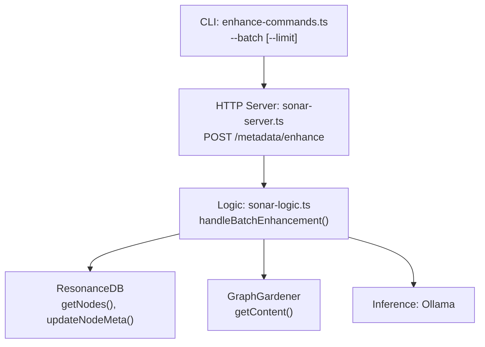
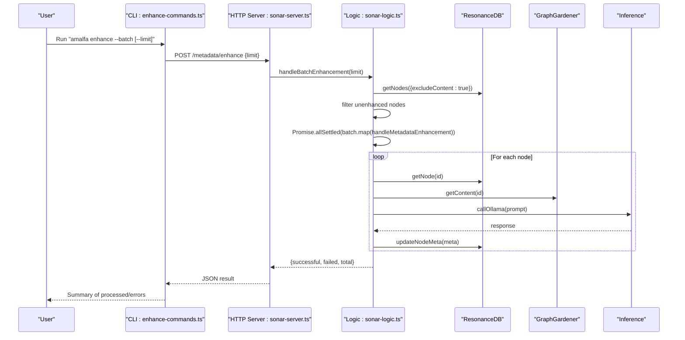
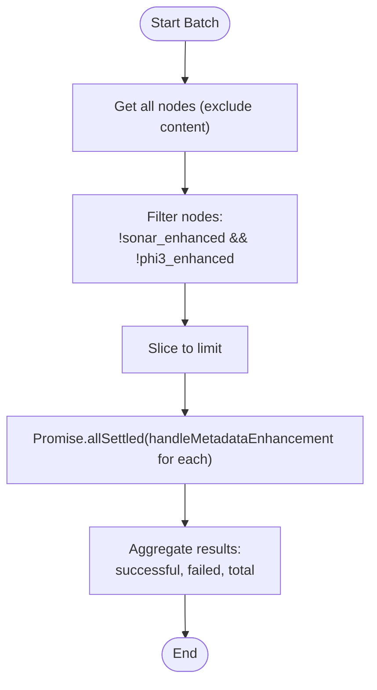
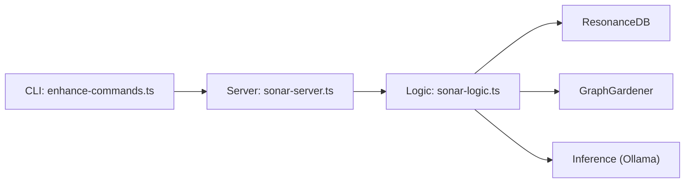

# Batch Enhancement

<cite>
**Referenced Files in This Document**
- [sonar-agent.ts](file://src/daemon/sonar-agent.ts)
- [sonar-logic.ts](file://src/daemon/sonar-logic.ts)
- [sonar-server.ts](file://src/daemon/sonar-server.ts)
- [enhance-commands.ts](file://src/cli/enhance-commands.ts)
</cite>

## Table of Contents
1. [Introduction](#introduction)
2. [Project Structure](#project-structure)
3. [Core Components](#core-components)
4. [Architecture Overview](#architecture-overview)
5. [Detailed Component Analysis](#detailed-component-analysis)
6. [Dependency Analysis](#dependency-analysis)
7. [Performance Considerations](#performance-considerations)
8. [Troubleshooting Guide](#troubleshooting-guide)
9. [Conclusion](#conclusion)

## Introduction
This document explains the batch enhancement workflow in the Sonar agent. It focuses on the bulk metadata enhancement process, the handleBatchEnhancement function, node filtering logic, and concurrent execution using Promise.allSettled. It also covers throughput optimization, error handling, resource management, progress tracking, and quality control for large-scale enhancement tasks.

## Project Structure
The batch enhancement feature spans the CLI, HTTP server, and core logic modules:
- CLI command parses user arguments and triggers batch enhancement via HTTP.
- HTTP server exposes endpoints for single and batch operations.
- Core logic orchestrates node discovery, filtering, and concurrent enhancement.

**Diagram sources**
- [enhance-commands.ts](file://src/cli/enhance-commands.ts#L6-L81)
- [sonar-server.ts](file://src/daemon/sonar-server.ts#L24-L133)
- [sonar-logic.ts](file://src/daemon/sonar-logic.ts#L69-L99)

**Section sources**
- [enhance-commands.ts](file://src/cli/enhance-commands.ts#L6-L81)
- [sonar-server.ts](file://src/daemon/sonar-server.ts#L24-L133)
- [sonar-logic.ts](file://src/daemon/sonar-logic.ts#L69-L99)

## Core Components
- CLI command: Parses --batch and optional --limit, sends a POST request to the Sonar HTTP server.
- HTTP server: Routes requests to the appropriate handler; currently exposes single-node enhancement and health/graph endpoints.
- Logic module: Implements handleBatchEnhancement to select unenhanced nodes, run concurrent enhancements, and return counts.

Key behaviors:
- Node selection excludes nodes already marked as enhanced by Sonar or another pipeline.
- Concurrency uses Promise.allSettled to avoid failing fast and collect all results.
- Returns counts for successful, failed, and total processed nodes.

**Section sources**
- [enhance-commands.ts](file://src/cli/enhance-commands.ts#L23-L54)
- [sonar-logic.ts](file://src/daemon/sonar-logic.ts#L69-L99)

## Architecture Overview
The batch enhancement flow integrates CLI, HTTP server, and logic layer. The CLI triggers a request to the server, which delegates to the logic module. The logic module queries the database for eligible nodes, concurrently enhances them, and updates metadata.

**Diagram sources**
- [enhance-commands.ts](file://src/cli/enhance-commands.ts#L34-L50)
- [sonar-server.ts](file://src/daemon/sonar-server.ts#L72-L81)
- [sonar-logic.ts](file://src/daemon/sonar-logic.ts#L69-L99)

## Detailed Component Analysis

### handleBatchEnhancement Function
Purpose:
- Select eligible nodes for metadata enhancement.
- Run enhancements concurrently.
- Aggregate results and return counts.

Processing logic:
- Retrieve all nodes (excluding content) from the database.
- Filter nodes that are not already enhanced by Sonar or another pipeline.
- Limit to the requested batch size.
- Execute handleMetadataEnhancement for each node concurrently using Promise.allSettled.
- Count fulfilled and rejected results.

Concurrency and resilience:
- Promise.allSettled ensures partial failures do not block the rest of the batch.
- Errors are logged per-node; the batch result reflects totals.

Quality control:
- Nodes are filtered by metadata flags to prevent redundant work.
- Each enhancement updates node metadata with keywords, summary, and timestamps.

**Section sources**
- [sonar-logic.ts](file://src/daemon/sonar-logic.ts#L69-L99)

### Node Filtering Logic
Behavior:
- Exclude nodes already marked as enhanced by Sonar or another pipeline.
- Build a small batch subset based on the limit argument.

Implementation highlights:
- Uses a simple metadata presence check to determine eligibility.
- Slices the filtered list to enforce the batch size.

**Diagram sources**
- [sonar-logic.ts](file://src/daemon/sonar-logic.ts#L74-L93)

**Section sources**
- [sonar-logic.ts](file://src/daemon/sonar-logic.ts#L74-L93)

### Concurrent Execution with Promise.allSettled
Pattern:
- Map each node ID to a call to handleMetadataEnhancement.
- Execute all promises concurrently with Promise.allSettled.
- Count successes and failures from the settled results.

Benefits:
- Prevents a single failure from blocking the entire batch.
- Provides deterministic counts for reporting.

**Section sources**
- [sonar-logic.ts](file://src/daemon/sonar-logic.ts#L89-L98)

### Practical Examples and Configuration
- CLI usage:
  - Start a batch with a default limit or override with --limit.
  - The CLI posts JSON { limit } to the server endpoint.

- Throughput optimization tips:
  - Adjust limit to balance memory and CPU usage.
  - Monitor Ollama availability and rate limits.
  - Consider staggering batches to avoid resource spikes.

- Error handling:
  - Per-node errors are caught and counted; the batch continues.
  - Logs include node IDs and error details for diagnostics.

**Section sources**
- [enhance-commands.ts](file://src/cli/enhance-commands.ts#L23-L54)
- [sonar-logic.ts](file://src/daemon/sonar-logic.ts#L62-L64)

### Resource Management and Progress Tracking
- Resource management:
  - Batch size controls concurrency and memory footprint.
  - Database queries exclude content to minimize memory usage.
  - Inference calls are executed per-node; throttle or limit concurrent calls if needed.

- Progress tracking:
  - The function returns counts for successful, failed, and total nodes.
  - The CLI prints processed and error counts after completion.

**Section sources**
- [sonar-logic.ts](file://src/daemon/sonar-logic.ts#L74-L99)
- [enhance-commands.ts](file://src/cli/enhance-commands.ts#L47-L49)

### Quality Control Mechanisms
- Metadata gating prevents duplicate enhancements.
- Each enhancement updates node metadata with structured fields and timestamps.
- Logging captures per-node failures for later inspection.

**Section sources**
- [sonar-logic.ts](file://src/daemon/sonar-logic.ts#L76-L83)
- [sonar-logic.ts](file://src/daemon/sonar-logic.ts#L54-L61)

## Dependency Analysis
The batch enhancement feature depends on:
- CLI to trigger the operation.
- HTTP server to route the request to the logic module.
- Logic module to orchestrate database access, content retrieval, and inference calls.
- Inference subsystem for LLM-based metadata extraction.

**Diagram sources**
- [enhance-commands.ts](file://src/cli/enhance-commands.ts#L6-L81)
- [sonar-server.ts](file://src/daemon/sonar-server.ts#L24-L133)
- [sonar-logic.ts](file://src/daemon/sonar-logic.ts#L1-L17)

**Section sources**
- [enhance-commands.ts](file://src/cli/enhance-commands.ts#L6-L81)
- [sonar-server.ts](file://src/daemon/sonar-server.ts#L24-L133)
- [sonar-logic.ts](file://src/daemon/sonar-logic.ts#L1-L17)

## Performance Considerations
- Concurrency tuning:
  - Increase or decrease the batch limit based on available CPU and memory.
  - Consider rate limits from the inference provider and adjust accordingly.

- Database efficiency:
  - Queries exclude content to reduce memory usage.
  - Ensure database is optimized for frequent reads and writes.

- I/O and network:
  - Minimize repeated inference calls by batching and avoiding redundant work.
  - Monitor latency and throughput of inference calls.

- Monitoring:
  - Track successful vs failed counts to identify bottlenecks or recurring errors.

[No sources needed since this section provides general guidance]

## Troubleshooting Guide
Common issues and resolutions:
- Sonar Agent not running:
  - Ensure the agent is started before invoking the CLI.
  - The CLI checks agent status and exits with guidance if not running.

- Endpoint mismatch:
  - The CLI attempts to call /metadata/batch, but the server currently exposes /metadata/enhance.
  - Align CLI or server to expose a consistent endpoint for batch operations.

- Inference unavailability:
  - If inference is not available, the logic short-circuits; verify provider health and configuration.

- Partial failures:
  - With Promise.allSettled, individual failures are captured; review logs for node-specific errors.

**Section sources**
- [enhance-commands.ts](file://src/cli/enhance-commands.ts#L10-L14)
- [enhance-commands.ts](file://src/cli/enhance-commands.ts#L34-L50)
- [sonar-logic.ts](file://src/daemon/sonar-logic.ts#L32-L33)

## Conclusion
The batch enhancement workflow in the Sonar agent provides a robust, concurrent mechanism to enrich metadata across many nodes. By filtering eligible nodes, leveraging Promise.allSettled for resilient concurrency, and returning actionable metrics, it supports large-scale operations with clear quality control and progress tracking. Aligning CLI and server endpoints and tuning batch sizes will optimize throughput and reliability for production use.