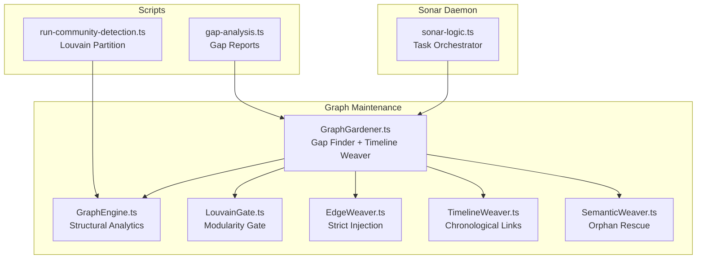
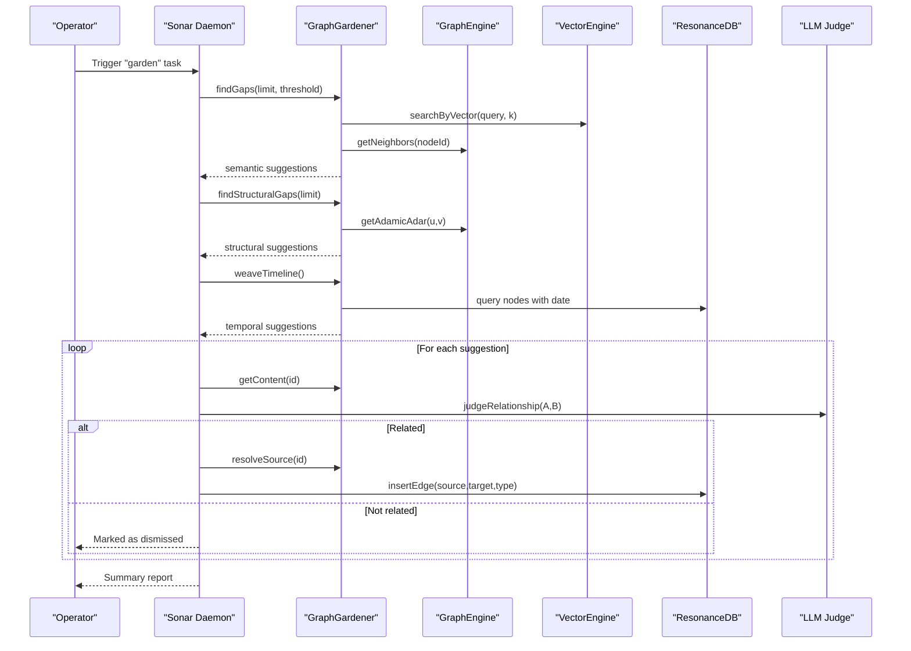
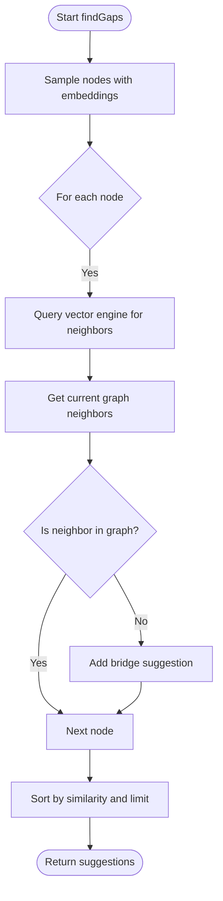
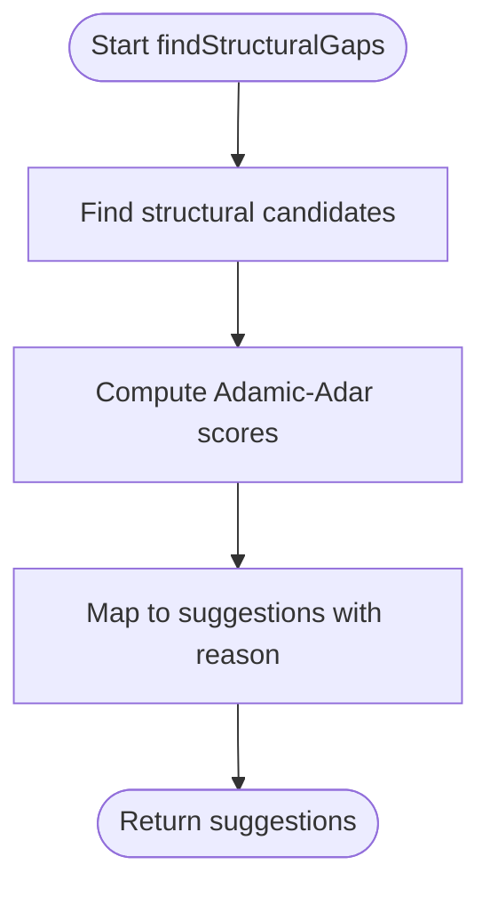
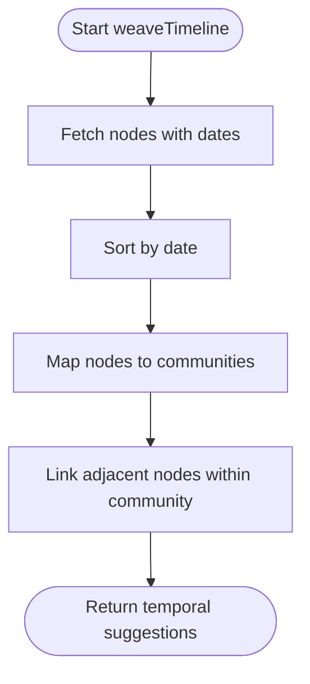
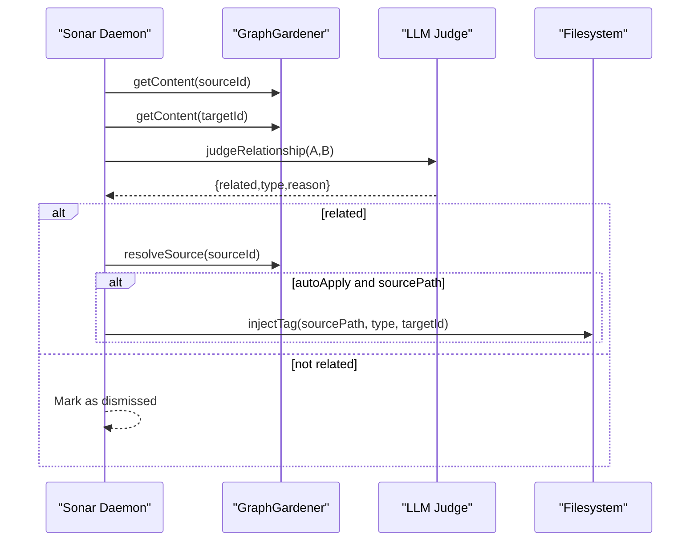
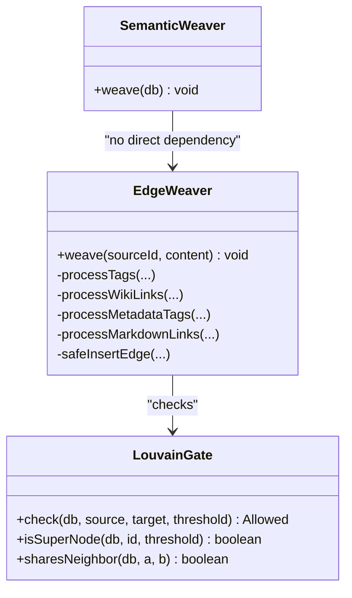
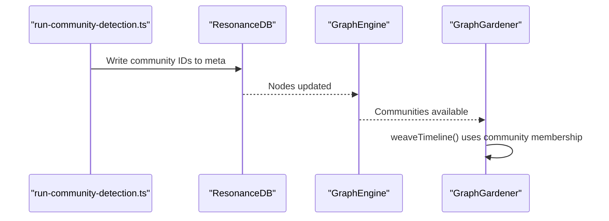
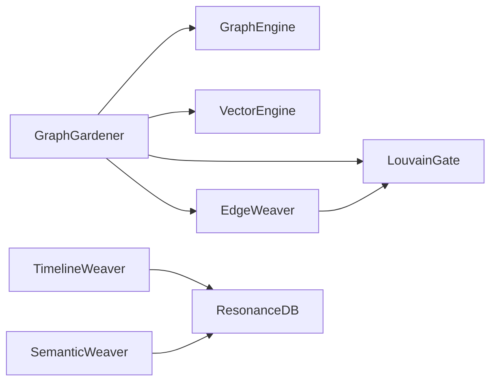

# Garden Tasks

<cite>
**Referenced Files in This Document**
- [GraphGardener.ts](file://src/core/GraphGardener.ts)
- [sonar-logic.ts](file://src/daemon/sonar-logic.ts)
- [GraphEngine.ts](file://src/core/GraphEngine.ts)
- [LouvainGate.ts](file://src/core/LouvainGate.ts)
- [EdgeWeaver.ts](file://src/core/EdgeWeaver.ts)
- [TimelineWeaver.ts](file://src/core/TimelineWeaver.ts)
- [SemanticWeaver.ts](file://src/core/SemanticWeaver.ts)
- [run-community-detection.ts](file://scripts/run-community-detection.ts)
- [2026-01-08-graph-gardening-phase2-3.md](file://debriefs/2026-01-08-graph-gardening-phase2-3.md)
- [2026-01-08-graph-gardening-phase1.md](file://debriefs/2026-01-08-graph-gardening-phase1.md)
- [graphology-playbook.md](file://public/docs/playbooks/graphology-playbook.md)
- [gap-analysis.ts](file://scripts/lab/gap-analysis.ts)
- [2026-01-07-code-audit-hardening-wrap-up.md](file://debriefs/2026-01-07-code-audit-hardening-wrap-up.md)
</cite>

## Table of Contents
1. [Introduction](#introduction)
2. [Project Structure](#project-structure)
3. [Core Components](#core-components)
4. [Architecture Overview](#architecture-overview)
5. [Detailed Component Analysis](#detailed-component-analysis)
6. [Dependency Analysis](#dependency-analysis)
7. [Performance Considerations](#performance-considerations)
8. [Troubleshooting Guide](#troubleshooting-guide)
9. [Conclusion](#conclusion)
10. [Appendices](#appendices)

## Introduction
This document explains the Sonar agent’s garden tasks: the automated workflows that maintain and improve the knowledge graph by detecting and filling gaps across semantic, structural, and temporal dimensions. It covers:
- Semantic gap detection via vector similarity
- Structural gap analysis using Adamic-Adar
- Temporal sequence weaving
- Relationship judgment and automatic tag injection
- Graph optimization strategies and integration with GraphGardener
- Community detection and long-term graph health maintenance

## Project Structure
The garden tasks are orchestrated by the Sonar daemon and implemented across several core modules:
- GraphGardener orchestrates gap detection and temporal weaving
- GraphEngine provides structural analytics and community detection
- EdgeWeaver performs strict, deterministic tag and link injection
- LouvainGate enforces modularity-aware edge gating
- TimelineWeaver and SemanticWeaver implement specialized weaving strategies
- Scripts support community detection and gap analysis

**Diagram sources**
- [sonar-logic.ts](file://src/daemon/sonar-logic.ts#L397-L465)
- [GraphGardener.ts](file://src/core/GraphGardener.ts#L27-L270)
- [GraphEngine.ts](file://src/core/GraphEngine.ts#L39-L200)
- [LouvainGate.ts](file://src/core/LouvainGate.ts#L3-L68)
- [EdgeWeaver.ts](file://src/core/EdgeWeaver.ts#L5-L194)
- [TimelineWeaver.ts](file://src/core/TimelineWeaver.ts#L3-L62)
- [SemanticWeaver.ts](file://src/core/SemanticWeaver.ts#L3-L97)
- [run-community-detection.ts](file://scripts/run-community-detection.ts#L24-L155)
- [gap-analysis.ts](file://scripts/lab/gap-analysis.ts#L196-L257)

**Section sources**
- [sonar-logic.ts](file://src/daemon/sonar-logic.ts#L397-L465)
- [GraphGardener.ts](file://src/core/GraphGardener.ts#L27-L270)
- [GraphEngine.ts](file://src/core/GraphEngine.ts#L39-L200)
- [run-community-detection.ts](file://scripts/run-community-detection.ts#L24-L155)

## Core Components
- GraphGardener: Central coordinator for semantic, structural, and temporal gap analysis; integrates with vector and graph engines; resolves content and sources for validation and injection.
- GraphEngine: In-memory graph with centrality, clustering, and Adamic-Adar utilities; powers community detection and structural gap scoring.
- EdgeWeaver: Strict, deterministic edge creation enforcing modularity constraints; supports explicit tags, wiki-links, and metadata blocks.
- LouvainGate: Prevents low-modularity edges to super-nodes by requiring triadic closure.
- TimelineWeaver: Creates temporal edges from content timestamps; SemanticWeaver rescues orphan nodes using vector similarity.

**Section sources**
- [GraphGardener.ts](file://src/core/GraphGardener.ts#L27-L270)
- [GraphEngine.ts](file://src/core/GraphEngine.ts#L39-L200)
- [EdgeWeaver.ts](file://src/core/EdgeWeaver.ts#L5-L194)
- [LouvainGate.ts](file://src/core/LouvainGate.ts#L3-L68)
- [TimelineWeaver.ts](file://src/core/TimelineWeaver.ts#L3-L62)
- [SemanticWeaver.ts](file://src/core/SemanticWeaver.ts#L3-L97)

## Architecture Overview
The garden task workflow combines three gap-finding strategies and validates relationships with a judge before applying deterministic injections.

**Diagram sources**
- [sonar-logic.ts](file://src/daemon/sonar-logic.ts#L397-L465)
- [GraphGardener.ts](file://src/core/GraphGardener.ts#L38-L195)
- [GraphEngine.ts](file://src/core/GraphEngine.ts#L178-L200)

## Detailed Component Analysis

### Semantic Gap Detection (Vector Similarity)
- Purpose: Identify pairs of nodes that are semantically similar (high vector similarity) but not structurally connected.
- Process:
  - Sample nodes with embeddings.
  - Query vector engine for nearest neighbors.
  - Compare with current graph neighbors; flag pairs where similarity exceeds threshold but no edge exists.
  - Deduplicate bidirectional suggestions.
- Validation: Content is fetched for both nodes and passed to the LLM judge; only confirmed relationships are injected.

**Diagram sources**
- [GraphGardener.ts](file://src/core/GraphGardener.ts#L38-L99)

**Section sources**
- [GraphGardener.ts](file://src/core/GraphGardener.ts#L38-L99)
- [sonar-logic.ts](file://src/daemon/sonar-logic.ts#L404-L430)

### Structural Gap Analysis (Adamic-Adar)
- Purpose: Predict missing ties using shared-context topology without embeddings.
- Process:
  - Compute Adamic-Adar scores between node pairs.
  - Return top candidates with scores and reasons.
- Integration: Used alongside semantic suggestions to propose structural bridges.

**Diagram sources**
- [GraphGardener.ts](file://src/core/GraphGardener.ts#L105-L115)
- [GraphEngine.ts](file://src/core/GraphEngine.ts#L178-L197)

**Section sources**
- [GraphGardener.ts](file://src/core/GraphGardener.ts#L105-L115)
- [GraphEngine.ts](file://src/core/GraphEngine.ts#L178-L197)

### Temporal Sequence Weaving
- Purpose: Anchor nodes with dates into a temporal order and propose FOLLOWS edges within communities.
- Process:
  - Select nodes with dates, sort chronologically.
  - Group by community membership.
  - For each community, connect consecutive nodes with FOLLOWS edges.
- Integration: Garden task also displays and optionally applies these suggestions.

**Diagram sources**
- [GraphGardener.ts](file://src/core/GraphGardener.ts#L155-L195)

**Section sources**
- [GraphGardener.ts](file://src/core/GraphGardener.ts#L155-L195)
- [2026-01-08-graph-gardening-phase2-3.md](file://debriefs/2026-01-08-graph-gardening-phase2-3.md#L19-L23)

### Relationship Judgment and Automatic Tag Injection
- Judgment: For each suggestion, fetch content for both sides and run the LLM judge to determine relatedness and type.
- Injection: If auto-apply is enabled and the source file is resolvable, inject a non-destructive tag block into the source file. Otherwise, present suggestions for manual review.
- Types: Commonly SEE_ALSO or FOLLOWS; custom types supported via judge output.

**Diagram sources**
- [sonar-logic.ts](file://src/daemon/sonar-logic.ts#L404-L464)
- [GraphGardener.ts](file://src/core/GraphGardener.ts#L205-L254)

**Section sources**
- [sonar-logic.ts](file://src/daemon/sonar-logic.ts#L404-L464)
- [GraphGardener.ts](file://src/core/GraphGardener.ts#L205-L254)

### Automatic Graph Enhancement Strategies
- Strict Edge Injection:
  - EdgeWeaver parses explicit tags, wiki-links, and metadata blocks to create precise edges.
  - Enforces modularity via LouvainGate to avoid destabilizing super-nodes.
- Community Synthesis:
  - Detect communities and synthesize higher-order understanding; optionally create synthesis artifacts.
- Orphan Rescue:
  - SemanticWeaver connects isolated nodes with vectors to experience nodes using dot-product thresholds.

**Diagram sources**
- [EdgeWeaver.ts](file://src/core/EdgeWeaver.ts#L5-L194)
- [LouvainGate.ts](file://src/core/LouvainGate.ts#L3-L68)
- [SemanticWeaver.ts](file://src/core/SemanticWeaver.ts#L3-L97)

**Section sources**
- [EdgeWeaver.ts](file://src/core/EdgeWeaver.ts#L54-L181)
- [LouvainGate.ts](file://src/core/LouvainGate.ts#L15-L36)
- [SemanticWeaver.ts](file://src/core/SemanticWeaver.ts#L4-L96)

### Integration with GraphGardener and Community Detection
- GraphGardener coordinates gap analysis and temporal weaving; it relies on GraphEngine for structural analytics and on community detection to constrain temporal linking.
- Community detection is performed externally and persisted into node metadata; the garden task reads community assignments to weave timelines.

**Diagram sources**
- [run-community-detection.ts](file://scripts/run-community-detection.ts#L80-L151)
- [GraphGardener.ts](file://src/core/GraphGardener.ts#L166-L194)

**Section sources**
- [run-community-detection.ts](file://scripts/run-community-detection.ts#L24-L155)
- [GraphGardener.ts](file://src/core/GraphGardener.ts#L166-L194)
- [graphology-playbook.md](file://public/docs/playbooks/graphology-playbook.md#L199-L231)

### Practical Examples

- Gap Analysis Configuration
  - Semantic threshold tuning: adjust similarity threshold in the semantic gap finder to trade off recall vs. precision.
  - Limit controls: reduce or increase the number of suggestions returned to manage review workload.
  - Structural scoring: use Adamic-Adar scores to prioritize high-confidence structural candidates.

- Relationship Validation
  - Review semantic and structural suggestions with content-based judgment; confirm or dismiss each pair.
  - For temporal suggestions, verify date accuracy and community membership before applying.

- Automatic Graph Enhancement
  - Enable auto-apply to inject tags directly into source files; otherwise, review and apply manually.
  - Use EdgeWeaver to enforce strict tag and link creation while respecting modularity constraints.

**Section sources**
- [GraphGardener.ts](file://src/core/GraphGardener.ts#L38-L115)
- [sonar-logic.ts](file://src/daemon/sonar-logic.ts#L404-L464)
- [EdgeWeaver.ts](file://src/core/EdgeWeaver.ts#L54-L181)
- [LouvainGate.ts](file://src/core/LouvainGate.ts#L15-L36)

## Dependency Analysis
- Coupling:
  - GraphGardener depends on GraphEngine for structural analytics and on VectorEngine for semantic search.
  - EdgeWeaver depends on LouvainGate to gate edges that could destabilize highly connected nodes.
- Cohesion:
  - Each module encapsulates a distinct responsibility: gap detection, structural analytics, injection, and validation.
- External Dependencies:
  - Graphology for graph algorithms and community detection.
  - SQLite via ResonanceDB for persistent storage and metadata.

**Diagram sources**
- [GraphGardener.ts](file://src/core/GraphGardener.ts#L28-L32)
- [EdgeWeaver.ts](file://src/core/EdgeWeaver.ts#L12-L22)
- [TimelineWeaver.ts](file://src/core/TimelineWeaver.ts#L3-L62)
- [SemanticWeaver.ts](file://src/core/SemanticWeaver.ts#L3-L97)

**Section sources**
- [GraphGardener.ts](file://src/core/GraphGardener.ts#L28-L32)
- [EdgeWeaver.ts](file://src/core/EdgeWeaver.ts#L12-L22)

## Performance Considerations
- Vector similarity queries: Limit candidate sampling and neighbor counts to balance recall and latency.
- Adamic-Adar computation: Prefer batched or indexed computations for large graphs; cache scores where appropriate.
- File I/O: Content fetching is I/O bound; cache frequently accessed content and avoid repeated disk reads.
- Community detection: Persist partitions to metadata to avoid recomputation; tune resolution to keep community counts cognitively manageable.
- Injection throughput: Batch writes and avoid frequent filesystem updates; ensure idempotent tag injection to prevent duplication.

[No sources needed since this section provides general guidance]

## Troubleshooting Guide
- Missing or stale embeddings:
  - Ensure nodes have valid embeddings before running semantic gap detection.
- Invalid source paths:
  - resolveSource returns null if meta.source is missing or invalid; verify node metadata.
- LLM judge timeouts or low-quality outputs:
  - Reduce concurrency or introduce throttling for free-tier models.
- Over-injection of edges:
  - Use LouvainGate to prevent edges to super-nodes without shared neighbors.
- Tag injection conflicts:
  - The inject_tags tool merges new tags into existing blocks; verify idempotency post-injection.

**Section sources**
- [GraphGardener.ts](file://src/core/GraphGardener.ts#L205-L254)
- [LouvainGate.ts](file://src/core/LouvainGate.ts#L15-L36)
- [2026-01-07-code-audit-hardening-wrap-up.md](file://debriefs/2026-01-07-code-audit-hardening-wrap-up.md#L16-L18)

## Conclusion
The garden tasks implement a robust, multi-modal approach to graph maintenance: semantic gap detection leverages vector similarity; structural gaps are predicted via Adamic-Adar; temporal sequences are woven using date metadata and community membership. The LLM judge ensures high-quality relationship validation, while strict injection and modularity gates preserve graph stability. Together, these strategies enable long-term graph health and continuous enhancement.

[No sources needed since this section summarizes without analyzing specific files]

## Appendices

### Appendix A: Gap Analysis Report Generation
- Use the lab script to generate structured gap reports across processes and integration domains, guiding targeted remediation efforts.

**Section sources**
- [gap-analysis.ts](file://scripts/lab/gap-analysis.ts#L196-L257)