# Research Tasks

<cite>
**Referenced Files in This Document**
- [sonar-agent.ts](file://src/daemon/sonar-agent.ts)
- [sonar-logic.ts](file://src/daemon/sonar-logic.ts)
- [sonar-strategies.ts](file://src/daemon/sonar-strategies.ts)
- [sonar-inference.ts](file://src/daemon/sonar-inference.ts)
- [sonar-types.ts](file://src/daemon/sonar-types.ts)
- [GraphEngine.ts](file://src/core/GraphEngine.ts)
- [GraphGardener.ts](file://src/core/GraphGardener.ts)
- [Historian.ts](file://src/utils/Historian.ts)
- [synthesis-500-autonomous-discovery-engine.md](file://docs/synthesis/synthesis-500-autonomous-discovery-engine.md)
- [brief-phase7-dynamic-discovery.md](file://briefs/pending/brief-phase7-dynamic-discovery.md)
- [debriefs/2026-01-09-autonomous-research-and-discovery.md](file://debriefs/2026-01-09-autonomous-research-and-discovery.md)
</cite>

## Table of Contents
1. [Introduction](#introduction)
2. [Project Structure](#project-structure)
3. [Core Components](#core-components)
4. [Architecture Overview](#architecture-overview)
5. [Detailed Component Analysis](#detailed-component-analysis)
6. [Dependency Analysis](#dependency-analysis)
7. [Performance Considerations](#performance-considerations)
8. [Troubleshooting Guide](#troubleshooting-guide)
9. [Conclusion](#conclusion)
10. [Appendices](#appendices)

## Introduction
This document explains the Sonar agent’s research tasks with a focus on the recursive discovery workflow, action decision-making (SEARCH, READ, EXPLORE, FINISH), chain verification, hub identification, narrative versus factual investigation modes, and automated research orchestration. It also covers practical examples, query formulation, multi-step investigation patterns, visited node tracking, and final conclusion synthesis with auditor verification.

## Project Structure
The research task pipeline is implemented as part of the Sonar agent daemon. Key modules include:
- Orchestrator and task watcher: [sonar-agent.ts](file://src/daemon/sonar-agent.ts)
- Task handlers and research loop: [sonar-logic.ts](file://src/daemon/sonar-logic.ts)
- Provider abstraction and inference routing: [sonar-inference.ts](file://src/daemon/sonar-inference.ts)
- Task model selection and strategies: [sonar-strategies.ts](file://src/daemon/sonar-strategies.ts)
- Graph analytics and hub identification: [GraphEngine.ts](file://src/core/GraphEngine.ts), [GraphGardener.ts](file://src/core/GraphGardener.ts)
- Session persistence and audit trail: [Historian.ts](file://src/utils/Historian.ts)
- Supporting documentation: [synthesis-500-autonomous-discovery-engine.md](file://docs/synthesis/synthesis-500-autonomous-discovery-engine.md), [brief-phase7-dynamic-discovery.md](file://briefs/pending/brief-phase7-dynamic-discovery.md), [debriefs/2026-01-09-autonomous-research-and-discovery.md](file://debriefs/2026-01-09-autonomous-research-and-discovery.md)

**Diagram sources**
- [sonar-agent.ts](file://src/daemon/sonar-agent.ts#L184-L217)
- [sonar-logic.ts](file://src/daemon/sonar-logic.ts#L470-L664)
- [sonar-inference.ts](file://src/daemon/sonar-inference.ts#L19-L119)
- [sonar-strategies.ts](file://src/daemon/sonar-strategies.ts#L10-L28)
- [GraphEngine.ts](file://src/core/GraphEngine.ts#L39-L100)
- [GraphGardener.ts](file://src/core/GraphGardener.ts#L27-L32)
- [Historian.ts](file://src/utils/Historian.ts#L31-L60)

**Section sources**
- [sonar-agent.ts](file://src/daemon/sonar-agent.ts#L1-L221)
- [sonar-logic.ts](file://src/daemon/sonar-logic.ts#L470-L664)
- [sonar-inference.ts](file://src/daemon/sonar-inference.ts#L1-L120)
- [sonar-strategies.ts](file://src/daemon/sonar-strategies.ts#L1-L187)
- [GraphEngine.ts](file://src/core/GraphEngine.ts#L1-L200)
- [GraphGardener.ts](file://src/core/GraphGardener.ts#L1-L270)
- [Historian.ts](file://src/utils/Historian.ts#L1-L136)

## Core Components
- Research task handler: orchestrates multi-step reasoning, action selection, and verification.
- Hub identification: computes structural hubs using PageRank and Betweenness Centrality.
- Narrative vs factual mode: toggled by query keywords to prioritize chronology.
- Chain verification: final auditor review to ensure completeness and accuracy.
- Automated orchestration: task watcher, model routing, throttling, and notifications.

**Section sources**
- [sonar-logic.ts](file://src/daemon/sonar-logic.ts#L470-L664)
- [GraphGardener.ts](file://src/core/GraphGardener.ts#L256-L268)
- [sonar-strategies.ts](file://src/daemon/sonar-strategies.ts#L10-L28)
- [sonar-agent.ts](file://src/daemon/sonar-agent.ts#L138-L179)

## Architecture Overview
The research task follows a recursive loop:
1. Initialize with query and structural hubs.
2. At each step, analyze current findings and decide the next action.
3. Execute action (SEARCH, READ, EXPLORE) and update findings.
4. After a fixed number of steps, synthesize a final conclusion and run auditor verification.

**Diagram sources**
- [sonar-agent.ts](file://src/daemon/sonar-agent.ts#L184-L217)
- [sonar-logic.ts](file://src/daemon/sonar-logic.ts#L496-L612)
- [GraphGardener.ts](file://src/core/GraphGardener.ts#L148-L150)
- [GraphEngine.ts](file://src/core/GraphEngine.ts#L105-L108)
- [sonar-inference.ts](file://src/daemon/sonar-inference.ts#L19-L119)
- [Historian.ts](file://src/utils/Historian.ts#L66-L96)

## Detailed Component Analysis

### Recursive Discovery Workflow
- Initialization: validates query, detects narrative mode, identifies top hubs, prepares findings accumulator, and initializes visited-node tracking.
- Loop mechanics:
  - Decision prompt includes graph context, hubs, and current findings.
  - Actions:
    - SEARCH: vector search via GraphGardener.
    - READ: content retrieval via GraphGardener.
    - EXPLORE: graph traversal via GraphEngine.
    - FINISH: terminate early with a synthesized answer.
  - Throttling: adds a delay for free-tier providers.
- Finalization:
  - Auto-inserts “Final Conclusion” if none was produced.
  - Calls an auditor to validate completeness and produce a polished answer.

```mermaid
flowchart TD
Start(["Start Research"]) --> Init["Validate query<br/>Detect narrative mode<br/>Identify hubs<br/>Init findings + visited"]
Init --> Loop{"Step 1..N"}
Loop --> Decision["Prompt LLM for next action"]
Decision --> Action{"Action"}
Action --> |SEARCH| DoSearch["Vector search via GraphGardener"]
Action --> |READ| DoRead["Read node content via GraphGardener"]
Action --> |EXPLORE| DoExplore["Get neighbors via GraphEngine"]
Action --> |FINISH| EndEarly["Write final conclusion"]
DoSearch --> UpdateFindings["Append search results"]
DoRead --> UpdateFindings
DoExplore --> UpdateFindings
UpdateFindings --> Loop
EndEarly --> Verify["Auditor verification"]
Loop --> Verify
Verify --> Report["Assemble final report"]
Report --> End(["End"])
```

**Diagram sources**
- [sonar-logic.ts](file://src/daemon/sonar-logic.ts#L470-L664)
- [GraphGardener.ts](file://src/core/GraphGardener.ts#L148-L150)
- [GraphEngine.ts](file://src/core/GraphEngine.ts#L105-L108)

**Section sources**
- [sonar-logic.ts](file://src/daemon/sonar-logic.ts#L470-L664)

### Action Decision Making: SEARCH, READ, EXPLORE, FINISH
- SEARCH: constructs a vector search query and retrieves top-k results with optional dates.
- READ: fetches content for a specific node ID, tracks visited nodes to avoid cycles.
- EXPLORE: traverses immediate neighbors to discover related concepts.
- FINISH: returns a final answer when sufficient evidence is gathered.

Practical tips:
- Use concise, focused queries for SEARCH to reduce noise.
- Prefer READ for dense content and EXPLORE for broad concept mapping.
- Use FINISH when the query can be comprehensively answered from gathered findings.

**Section sources**
- [sonar-logic.ts](file://src/daemon/sonar-logic.ts#L550-L603)

### Hub Identification System
- Hubs are computed as the sum of PageRank and Betweenness Centrality scores.
- The top hubs are injected into the initial context to guide the agent toward central, high-influence nodes.

**Diagram sources**
- [GraphGardener.ts](file://src/core/GraphGardener.ts#L256-L268)
- [GraphEngine.ts](file://src/core/GraphEngine.ts#L138-L147)

**Section sources**
- [GraphGardener.ts](file://src/core/GraphGardener.ts#L256-L268)
- [GraphEngine.ts](file://src/core/GraphEngine.ts#L138-L147)

### Narrative vs Factual Investigation Modes
- Mode detection: if the query contains “timeline”, “history”, or “how did”, the agent switches to narrative mode.
- Narrative mode prioritizes dates and chronological sequences in decision-making and synthesis.

**Section sources**
- [sonar-logic.ts](file://src/daemon/sonar-logic.ts#L483-L504)

### Automated Research Orchestration
- Task watcher: monitors a pending directory, moves tasks to processing, executes, writes a report, and notifies.
- Model routing: selects a cloud model for research tasks when configured.
- Health checks: verifies local Ollama availability and discovers capabilities.
- Throttling: introduces a 1-second delay for free-tier providers to respect quotas.

**Diagram sources**
- [sonar-agent.ts](file://src/daemon/sonar-agent.ts#L138-L179)
- [sonar-agent.ts](file://src/daemon/sonar-agent.ts#L184-L217)
- [sonar-inference.ts](file://src/daemon/sonar-inference.ts#L19-L119)

**Section sources**
- [sonar-agent.ts](file://src/daemon/sonar-agent.ts#L138-L179)
- [sonar-agent.ts](file://src/daemon/sonar-agent.ts#L184-L217)
- [sonar-strategies.ts](file://src/daemon/sonar-strategies.ts#L10-L28)

### Chain Verification and Auditor Role
- Post-loop, the agent constructs a verification prompt summarizing findings and asks an auditor to:
  - Confirm whether the query is fully answered.
  - Identify missing information.
  - Produce a final, polished answer based solely on findings.
- The auditor’s JSON response is parsed and appended to the report.

**Diagram sources**
- [sonar-logic.ts](file://src/daemon/sonar-logic.ts#L621-L661)
- [sonar-inference.ts](file://src/daemon/sonar-inference.ts#L19-L119)

**Section sources**
- [sonar-logic.ts](file://src/daemon/sonar-logic.ts#L614-L661)

### Practical Examples and Patterns
- Setup a research task:
  - Define a task type “research” with a query.
  - Optionally set model, notify, and limit fields.
- Query formulation:
  - For narrative tasks, include temporal cues (“timeline”, “history”, “how did”).
  - For factual tasks, use precise, domain-specific terms.
- Multi-step patterns:
  - Start with SEARCH to gather candidate nodes.
  - Use READ to dive deep into promising nodes.
  - Use EXPLORE to traverse related concepts.
  - Finish when the answer is coherent and verifiable.

**Section sources**
- [sonar-types.ts](file://src/daemon/sonar-types.ts#L16-L32)
- [sonar-logic.ts](file://src/daemon/sonar-logic.ts#L496-L523)
- [synthesis-500-autonomous-discovery-engine.md](file://docs/synthesis/synthesis-500-autonomous-discovery-engine.md#L32-L41)

### Visited Node Tracking and Cycle Prevention
- READ actions track visited node IDs.
- EXPLORE actions track visited node neighborhoods to avoid redundant traversals.
- This prevents infinite loops and redundant work.

**Section sources**
- [sonar-logic.ts](file://src/daemon/sonar-logic.ts#L564-L603)

### Session Persistence and Debugging
- The Historian protocol persists tool calls, results, and errors to JSONL files for recall and debugging.
- This supports the “Historian” protocol for durable, auditable reasoning.

**Section sources**
- [Historian.ts](file://src/utils/Historian.ts#L31-L126)
- [brief-phase7-dynamic-discovery.md](file://briefs/pending/brief-phase7-dynamic-discovery.md#L59-L76)

## Dependency Analysis
- sonar-agent.ts depends on:
  - sonar-logic.ts for task execution.
  - sonar-inference.ts for provider abstraction.
  - sonar-strategies.ts for model selection.
  - GraphEngine and GraphGardener for graph analytics.
- sonar-logic.ts depends on:
  - GraphGardener for content and related searches.
  - GraphEngine for graph traversal.
  - sonar-inference.ts for LLM calls.
  - Historian.ts for session persistence.

**Diagram sources**
- [sonar-agent.ts](file://src/daemon/sonar-agent.ts#L25-L34)
- [sonar-logic.ts](file://src/daemon/sonar-logic.ts#L1-L17)
- [GraphGardener.ts](file://src/core/GraphGardener.ts#L1-L7)
- [GraphEngine.ts](file://src/core/GraphEngine.ts#L1-L14)
- [Historian.ts](file://src/utils/Historian.ts#L1-L16)

**Section sources**
- [sonar-agent.ts](file://src/daemon/sonar-agent.ts#L25-L34)
- [sonar-logic.ts](file://src/daemon/sonar-logic.ts#L1-L17)

## Performance Considerations
- Throttling: free-tier providers are throttled to respect quotas without sacrificing responsiveness.
- Model routing: cloud models are selected for research tasks when configured, enabling higher-quality reasoning.
- Lightweight nodes: content remains external to the database, keeping the system fast and FAFCAS.

**Section sources**
- [sonar-logic.ts](file://src/daemon/sonar-logic.ts#L605-L607)
- [sonar-strategies.ts](file://src/daemon/sonar-strategies.ts#L17-L25)
- [synthesis-500-autonomous-discovery-engine.md](file://docs/synthesis/synthesis-500-autonomous-discovery-engine.md#L27-L30)

## Troubleshooting Guide
Common issues and resolutions:
- Research incomplete or missing context:
  - Ensure the query includes temporal cues for narrative mode.
  - Increase maxSteps or refine SEARCH queries.
- Noise hubs distracting exploration:
  - Filter out test/spec artifacts in centrality calculations.
- Free-tier throttling:
  - Expect 1-second delays; schedule tasks accordingly.
- Auditor verification failures:
  - Verify the final answer synthesizes only from gathered findings.
  - Re-run with clearer queries and more targeted READ/EXPLORE steps.

**Section sources**
- [debriefs/2026-01-09-autonomous-research-and-discovery.md](file://debriefs/2026-01-09-autonomous-research-and-discovery.md#L17-L28)
- [sonar-logic.ts](file://src/daemon/sonar-logic.ts#L605-L607)
- [sonar-logic.ts](file://src/daemon/sonar-logic.ts#L614-L661)

## Conclusion
The Sonar agent’s research tasks implement a robust, FAFCAS-style recursive discovery engine. By combining topological intelligence, narrative-aware reasoning, and strict chain verification, it delivers accurate, auditable results. The modular architecture, provider abstraction, and session persistence enable scalable, maintainable research workflows.

## Appendices
- Related milestones and playbooks:
  - Autonomous discovery milestone: [synthesis-500-autonomous-discovery-engine.md](file://docs/synthesis/synthesis-500-autonomous-discovery-engine.md#L1-L48)
  - Dynamic discovery brief: [brief-phase7-dynamic-discovery.md](file://briefs/pending/brief-phase7-dynamic-discovery.md#L1-L135)
  - Research debrief: [debriefs/2026-01-09-autonomous-research-and-discovery.md](file://debriefs/2026-01-09-autonomous-research-and-discovery.md#L1-L29)