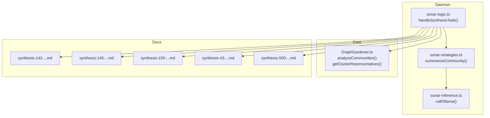
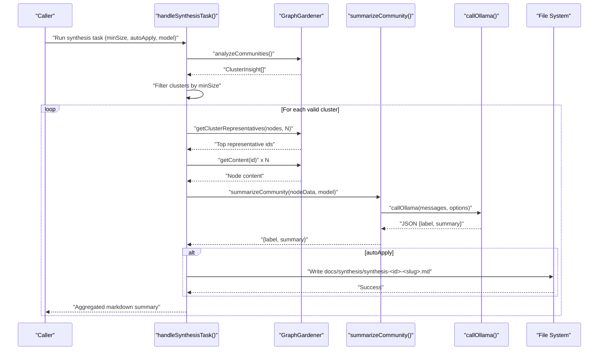
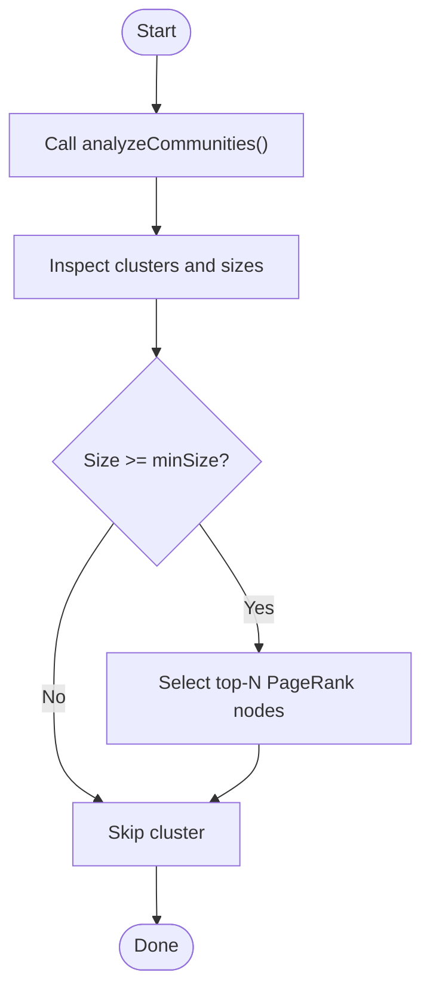
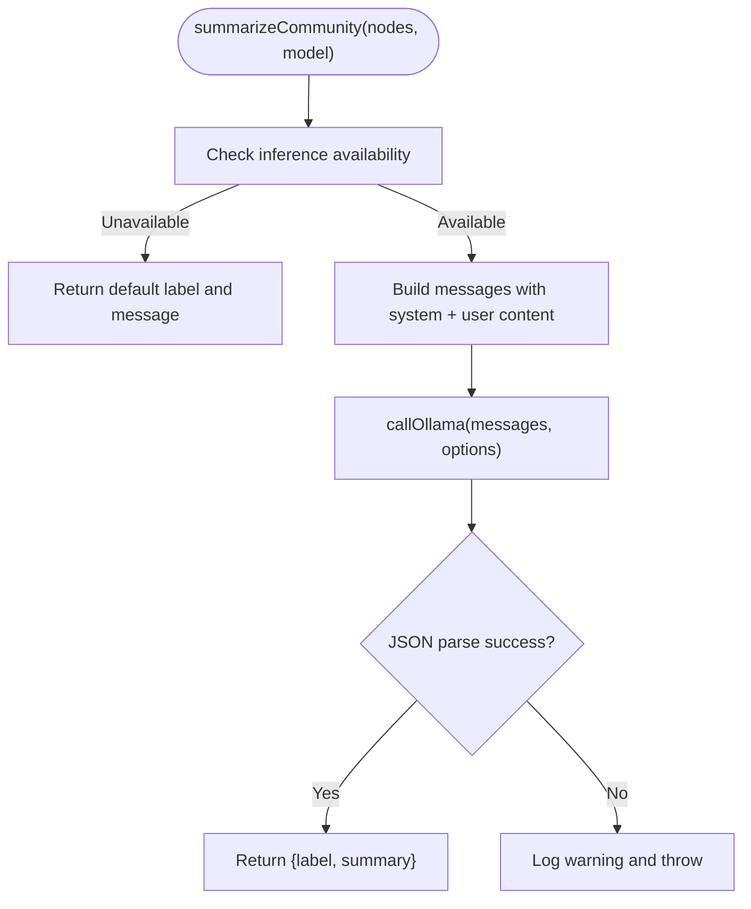
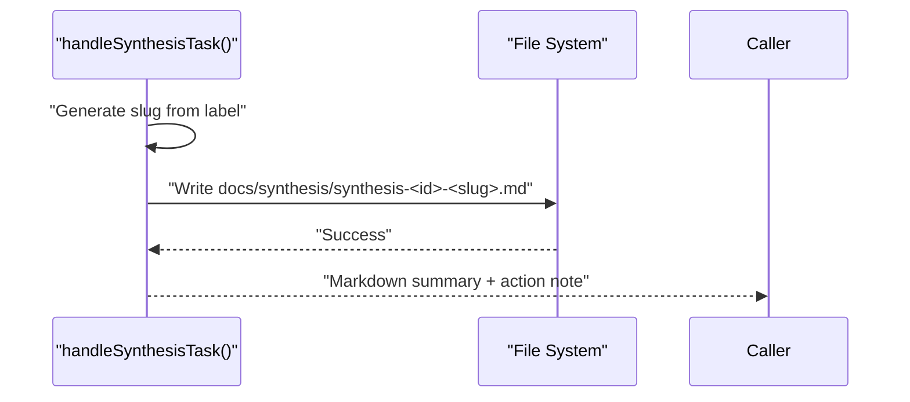
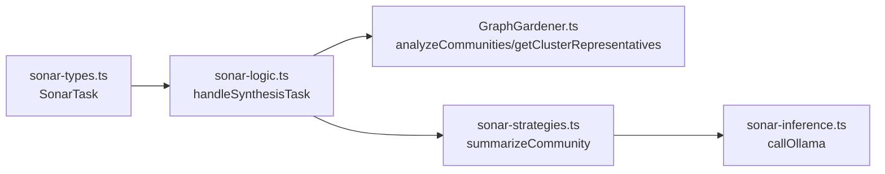

# Synthesis Tasks

<cite>
**Referenced Files in This Document**
- [sonar-strategies.ts](file://src/daemon/sonar-strategies.ts)
- [sonar-logic.ts](file://src/daemon/sonar-logic.ts)
- [GraphGardener.ts](file://src/core/GraphGardener.ts)
- [sonar-types.ts](file://src/daemon/sonar-types.ts)
- [sonar-inference.ts](file://src/daemon/sonar-inference.ts)
- [synthesis-142-amalfa-configuration-and-mcp-setup.md](file://docs/synthesis/synthesis-142-amalfa-configuration-and-mcp-setup.md)
- [synthesis-145-agent-driven-metadata-and-vocabulary-management.md](file://docs/synthesis/synthesis-145-agent-driven-metadata-and-vocabulary-management.md)
- [synthesis-155-configuration-and-script-management.md](file://docs/synthesis/synthesis-155-configuration-and-script-management.md)
- [synthesis-43-node-js-dependency-removal-for-bun-compatibility.md](file://docs/synthesis/synthesis-43-node-js-dependency-removal-for-bun-compatibility.md)
- [synthesis-500-autonomous-discovery-engine.md](file://docs/synthesis/synthesis-500-autonomous-discovery-engine.md)
</cite>

## Table of Contents
1. [Introduction](#introduction)
2. [Project Structure](#project-structure)
3. [Core Components](#core-components)
4. [Architecture Overview](#architecture-overview)
5. [Detailed Component Analysis](#detailed-component-analysis)
6. [Dependency Analysis](#dependency-analysis)
7. [Performance Considerations](#performance-considerations)
8. [Troubleshooting Guide](#troubleshooting-guide)
9. [Conclusion](#conclusion)
10. [Appendices](#appendices)

## Introduction
This document explains synthesis tasks in the Sonar agent, focusing on how the system discovers related content clusters, selects representative nodes, summarizes them, and optionally generates markdown synthesis nodes automatically. It covers the synthesis workflow end-to-end, including community analysis, representative node selection, content summarization via LLM, and file system integration for documentation generation. Practical examples demonstrate configuration, labeling, and output generation, along with synthesis strategies for different content types and auto-apply behavior.

## Project Structure
The synthesis workflow spans several modules:
- Task orchestration and synthesis logic live in the Sonar daemon logic.
- Community analysis and representative selection are provided by the Graph Gardener.
- LLM integration is handled by the Sonar inference bridge.
- Strategies define the summarization prompts and JSON parsing.
- Example synthesis markdown outputs exist under docs/synthesis.

**Diagram sources**
- [sonar-logic.ts](file://src/daemon/sonar-logic.ts#L323-L364)
- [sonar-strategies.ts](file://src/daemon/sonar-strategies.ts#L90-L142)
- [sonar-inference.ts](file://src/daemon/sonar-inference.ts#L19-L119)
- [GraphGardener.ts](file://src/core/GraphGardener.ts#L117-L143)
- [synthesis-142-amalfa-configuration-and-mcp-setup.md](file://docs/synthesis/synthesis-142-amalfa-configuration-and-mcp-setup.md#L1-L18)
- [synthesis-145-agent-driven-metadata-and-vocabulary-management.md](file://docs/synthesis/synthesis-145-agent-driven-metadata-and-vocabulary-management.md#L1-L46)
- [synthesis-155-configuration-and-script-management.md](file://docs/synthesis/synthesis-155-configuration-and-script-management.md#L1-L20)
- [synthesis-43-node-js-dependency-removal-for-bun-compatibility.md](file://docs/synthesis/synthesis-43-node-js-dependency-removal-for-bun-compatibility.md#L1-L23)
- [synthesis-500-autonomous-discovery-engine.md](file://docs/synthesis/synthesis-500-autonomous-discovery-engine.md#L1-L48)

**Section sources**
- [sonar-logic.ts](file://src/daemon/sonar-logic.ts#L323-L364)
- [GraphGardener.ts](file://src/core/GraphGardener.ts#L117-L143)
- [sonar-strategies.ts](file://src/daemon/sonar-strategies.ts#L90-L142)
- [sonar-inference.ts](file://src/daemon/sonar-inference.ts#L19-L119)
- [synthesis-142-amalfa-configuration-and-mcp-setup.md](file://docs/synthesis/synthesis-142-amalfa-configuration-and-mcp-setup.md#L1-L18)
- [synthesis-145-agent-driven-metadata-and-vocabulary-management.md](file://docs/synthesis/synthesis-145-agent-driven-metadata-and-vocabulary-management.md#L1-L46)
- [synthesis-155-configuration-and-script-management.md](file://docs/synthesis/synthesis-155-configuration-and-script-management.md#L1-L20)
- [synthesis-43-node-js-dependency-removal-for-bun-compatibility.md](file://docs/synthesis/synthesis-43-node-js-dependency-removal-for-bun-compatibility.md#L1-L23)
- [synthesis-500-autonomous-discovery-engine.md](file://docs/synthesis/synthesis-500-autonomous-discovery-engine.md#L1-L48)

## Core Components
- summarizeCommunity: Generates a canonical label and concise synthesis for a set of related nodes using an LLM, returning structured JSON.
- handleSynthesisTask: Orchestrates synthesis by detecting valid clusters, selecting representatives, summarizing, and optionally writing markdown synthesis nodes.
- GraphGardener: Provides community analysis and representative selection helpers used by synthesis.
- Sonar inference bridge: Handles local Ollama and OpenRouter cloud calls, including model selection and throttling considerations.

Key synthesis configuration fields:
- minSize: Minimum cluster size threshold for inclusion.
- autoApply: Whether to write synthesis markdown nodes to disk.
- model/taskModel: Optional model override for synthesis.

**Section sources**
- [sonar-strategies.ts](file://src/daemon/sonar-strategies.ts#L90-L142)
- [sonar-logic.ts](file://src/daemon/sonar-logic.ts#L323-L364)
- [GraphGardener.ts](file://src/core/GraphGardener.ts#L117-L143)
- [sonar-types.ts](file://src/daemon/sonar-types.ts#L16-L32)
- [sonar-inference.ts](file://src/daemon/sonar-inference.ts#L19-L119)

## Architecture Overview
The synthesis workflow integrates community detection, representative selection, and LLM summarization, with optional file system output.

**Diagram sources**
- [sonar-logic.ts](file://src/daemon/sonar-logic.ts#L323-L364)
- [GraphGardener.ts](file://src/core/GraphGardener.ts#L117-L143)
- [sonar-strategies.ts](file://src/daemon/sonar-strategies.ts#L90-L142)
- [sonar-inference.ts](file://src/daemon/sonar-inference.ts#L19-L119)

## Detailed Component Analysis

### Community Analysis and Representative Selection
- Community detection: The GraphGardener exposes analyzeCommunities to return per-cluster node lists.
- Representative selection: getClusterRepresentatives sorts nodes by PageRank within the cluster and returns the top-K.
- Thresholding: The synthesis task filters clusters by minSize before summarization.

**Diagram sources**
- [GraphGardener.ts](file://src/core/GraphGardener.ts#L117-L143)
- [sonar-logic.ts](file://src/daemon/sonar-logic.ts#L329-L332)

**Section sources**
- [GraphGardener.ts](file://src/core/GraphGardener.ts#L117-L143)
- [sonar-logic.ts](file://src/daemon/sonar-logic.ts#L329-L332)

### Summarization Strategy and Integration
- Prompting: The summarizeCommunity function sends a system prompt and a concatenated set of node excerpts to the LLM.
- Output parsing: Expects JSON with label and summary, tolerating fenced code blocks around JSON.
- Fallbacks: Graceful handling when LLM is unavailable or JSON parsing fails.

**Diagram sources**
- [sonar-strategies.ts](file://src/daemon/sonar-strategies.ts#L90-L142)
- [sonar-inference.ts](file://src/daemon/sonar-inference.ts#L19-L119)

**Section sources**
- [sonar-strategies.ts](file://src/daemon/sonar-strategies.ts#L90-L142)
- [sonar-inference.ts](file://src/daemon/sonar-inference.ts#L19-L119)

### Automatic Synthesis Node Creation
- When autoApply is true, the synthesis task writes a markdown file under docs/synthesis with frontmatter including title, type, and nodes.
- Filename pattern: synthesis-<clusterId>-<slug>.md where slug is derived from the generated label.
- Frontmatter includes a nodes list of member node IDs for traceability.

**Diagram sources**
- [sonar-logic.ts](file://src/daemon/sonar-logic.ts#L342-L360)

**Section sources**
- [sonar-logic.ts](file://src/daemon/sonar-logic.ts#L342-L360)

### Practical Examples and Configuration
- Minimal synthesis task: Configure type=synthesis with minSize=5 and autoApply=true to generate markdown nodes for clusters meeting the size threshold.
- Model override: Pass model or rely on getTaskModel to select a cloud model when configured.
- Example outputs: The docs/synthesis directory contains real synthesis markdown files demonstrating frontmatter and member listings.

Examples of synthesis outputs:
- [synthesis-142-amalfa-configuration-and-mcp-setup.md](file://docs/synthesis/synthesis-142-amalfa-configuration-and-mcp-setup.md#L1-L18)
- [synthesis-145-agent-driven-metadata-and-vocabulary-management.md](file://docs/synthesis/synthesis-145-agent-driven-metadata-and-vocabulary-management.md#L1-L46)
- [synthesis-155-configuration-and-script-management.md](file://docs/synthesis/synthesis-155-configuration-and-script-management.md#L1-L20)
- [synthesis-43-node-js-dependency-removal-for-bun-compatibility.md](file://docs/synthesis/synthesis-43-node-js-dependency-removal-for-bun-compatibility.md#L1-L23)
- [synthesis-500-autonomous-discovery-engine.md](file://docs/synthesis/synthesis-500-autonomous-discovery-engine.md#L1-L48)

**Section sources**
- [sonar-logic.ts](file://src/daemon/sonar-logic.ts#L323-L364)
- [sonar-types.ts](file://src/daemon/sonar-types.ts#L16-L32)
- [synthesis-142-amalfa-configuration-and-mcp-setup.md](file://docs/synthesis/synthesis-142-amalfa-configuration-and-mcp-setup.md#L1-L18)
- [synthesis-145-agent-driven-metadata-and-vocabulary-management.md](file://docs/synthesis/synthesis-145-agent-driven-metadata-and-vocabulary-management.md#L1-L46)
- [synthesis-155-configuration-and-script-management.md](file://docs/synthesis/synthesis-155-configuration-and-script-management.md#L1-L20)
- [synthesis-43-node-js-dependency-removal-for-bun-compatibility.md](file://docs/synthesis/synthesis-43-node-js-dependency-removal-for-bun-compatibility.md#L1-L23)
- [synthesis-500-autonomous-discovery-engine.md](file://docs/synthesis/synthesis-500-autonomous-discovery-engine.md#L1-L48)

### Synthesis Strategies Across Content Types
- Configuration and setup: Focus on operational and procedural topics; synthesis labels emphasize canonical topics and summaries.
- Metadata and vocabulary: Emphasizes agent-driven automation and governance; synthesis highlights cross-document themes.
- Refactoring and compatibility: Highlights migration and testing themes; synthesis anchors to specific tasks and outcomes.
- Discovery and autonomy: Treats synthesis as part of a broader research engine; synthesis supports narrative and topological exploration.

**Section sources**
- [synthesis-142-amalfa-configuration-and-mcp-setup.md](file://docs/synthesis/synthesis-142-amalfa-configuration-and-mcp-setup.md#L1-L18)
- [synthesis-145-agent-driven-metadata-and-vocabulary-management.md](file://docs/synthesis/synthesis-145-agent-driven-metadata-and-vocabulary-management.md#L1-L46)
- [synthesis-155-configuration-and-script-management.md](file://docs/synthesis/synthesis-155-configuration-and-script-management.md#L1-L20)
- [synthesis-43-node-js-dependency-removal-for-bun-compatibility.md](file://docs/synthesis/synthesis-43-node-js-dependency-removal-for-bun-compatibility.md#L1-L23)
- [synthesis-500-autonomous-discovery-engine.md](file://docs/synthesis/synthesis-500-autonomous-discovery-engine.md#L1-L48)

## Dependency Analysis
- handleSynthesisTask depends on GraphGardener for community insight and representative selection, and on summarizeCommunity for LLM-based summarization.
- summarizeCommunity depends on callOllama for inference and returns structured data consumed by the synthesis task.
- Inference routing supports both local Ollama and OpenRouter, enabling cloud-based synthesis when configured.

**Diagram sources**
- [sonar-types.ts](file://src/daemon/sonar-types.ts#L16-L32)
- [sonar-logic.ts](file://src/daemon/sonar-logic.ts#L323-L364)
- [GraphGardener.ts](file://src/core/GraphGardener.ts#L117-L143)
- [sonar-strategies.ts](file://src/daemon/sonar-strategies.ts#L90-L142)
- [sonar-inference.ts](file://src/daemon/sonar-inference.ts#L19-L119)

**Section sources**
- [sonar-logic.ts](file://src/daemon/sonar-logic.ts#L323-L364)
- [GraphGardener.ts](file://src/core/GraphGardener.ts#L117-L143)
- [sonar-strategies.ts](file://src/daemon/sonar-strategies.ts#L90-L142)
- [sonar-inference.ts](file://src/daemon/sonar-inference.ts#L19-L119)

## Performance Considerations
- Community size threshold: Use minSize to avoid summarizing tiny or noisy clusters, reducing unnecessary LLM calls.
- Representative sampling: Limit to top-K PageRank nodes per cluster to cap input size and cost while preserving centrality.
- Cloud throttling: When using OpenRouter free tier models, consider the built-in throttling behavior and model selection to balance latency and quota usage.
- Output I/O: Writing markdown nodes is synchronous; batching or concurrency controls may be considered for very large outputs.

[No sources needed since this section provides general guidance]

## Troubleshooting Guide
Common issues and resolutions:
- LLM not available: If inference is disabled or unreachable, summarizeCommunity returns a default label and message. Enable local Ollama or configure OpenRouter credentials.
- JSON parsing failures: The summarization logic extracts JSON from potential fenced blocks; ensure the model responds in JSON format or adjust the system prompt.
- Empty or partial content: getContent may return null for symbol nodes without summaries or missing file sources; ensure node metadata includes a valid source path.
- Auto-apply permissions: Ensure the working directory allows writing to docs/synthesis; create the directory if missing.

**Section sources**
- [sonar-strategies.ts](file://src/daemon/sonar-strategies.ts#L94-L95)
- [sonar-strategies.ts](file://src/daemon/sonar-strategies.ts#L123-L134)
- [GraphGardener.ts](file://src/core/GraphGardener.ts#L229-L254)
- [sonar-logic.ts](file://src/daemon/sonar-logic.ts#L353-L358)

## Conclusion
The Sonar agent’s synthesis workflow combines community detection, representative selection, and LLM-powered summarization to produce concise, labeled syntheses of related knowledge. With configurable thresholds and optional auto-apply behavior, it supports scalable documentation generation and cross-document theme surfacing. The included example synthesis outputs illustrate frontmatter patterns and member listings, enabling traceability and integration into broader documentation systems.

[No sources needed since this section summarizes without analyzing specific files]

## Appendices

### Appendix A: Configuration Reference
- type: "synthesis"
- minSize: number (default 5)
- autoApply: boolean (optional)
- model/taskModel: string (optional; overrides defaults)
- limit: number (ignored by synthesis; reserved for other tasks)

**Section sources**
- [sonar-types.ts](file://src/daemon/sonar-types.ts#L16-L32)
- [sonar-logic.ts](file://src/daemon/sonar-logic.ts#L323-L364)