# Task Processing Workflows

<cite>
**Referenced Files in This Document**
- [sonar-agent.ts](file://src/daemon/sonar-agent.ts)
- [sonar-logic.ts](file://src/daemon/sonar-logic.ts)
- [sonar-strategies.ts](file://src/daemon/sonar-strategies.ts)
- [sonar-server.ts](file://src/daemon/sonar-server.ts)
- [sonar-inference.ts](file://src/daemon/sonar-inference.ts)
- [sonar-types.ts](file://src/daemon/sonar-types.ts)
- [GraphEngine.ts](file://src/core/GraphEngine.ts)
- [GraphGardener.ts](file://src/core/GraphGardener.ts)
- [VectorEngine.ts](file://src/core/VectorEngine.ts)
- [db.ts](file://src/resonance/db.ts)
- [Notifications.ts](file://src/utils/Notifications.ts)
- [StatsTracker.ts](file://src/utils/StatsTracker.ts)
</cite>

## Table of Contents
1. [Introduction](#introduction)
2. [Project Structure](#project-structure)
3. [Core Components](#core-components)
4. [Architecture Overview](#architecture-overview)
5. [Detailed Component Analysis](#detailed-component-analysis)
6. [Dependency Analysis](#dependency-analysis)
7. [Performance Considerations](#performance-considerations)
8. [Troubleshooting Guide](#troubleshooting-guide)
9. [Conclusion](#conclusion)
10. [Appendices](#appendices)

## Introduction
This document explains the Sonar agent’s task processing workflows across five task types: synthesis, timeline, garden, research, and enhance_batch. It details the execution pipeline, context management, result reporting, and integrations with graph operations, vector search, and knowledge graph analysis. Practical examples, error handling, notifications, and performance monitoring are included to help operators configure, run, and observe tasks reliably.

## Project Structure
The Sonar agent is implemented as a Bun-based daemon with a clear separation of concerns:
- Orchestrator and task watcher: [sonar-agent.ts](file://src/daemon/sonar-agent.ts)
- Task logic and handlers: [sonar-logic.ts](file://src/daemon/sonar-logic.ts)
- LLM strategies and routing: [sonar-strategies.ts](file://src/daemon/sonar-strategies.ts), [sonar-inference.ts](file://src/daemon/sonar-inference.ts)
- HTTP API surface: [sonar-server.ts](file://src/daemon/sonar-server.ts)
- Core graph and vector engines: [GraphEngine.ts](file://src/core/GraphEngine.ts), [GraphGardener.ts](file://src/core/GraphGardener.ts), [VectorEngine.ts](file://src/core/VectorEngine.ts)
- Knowledge graph persistence: [db.ts](file://src/resonance/db.ts)
- Utilities: notifications and telemetry [Notifications.ts](file://src/utils/Notifications.ts), [StatsTracker.ts](file://src/utils/StatsTracker.ts)

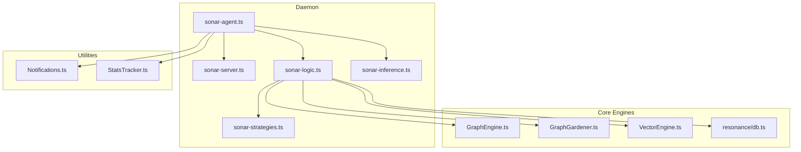

**Diagram sources**
- [sonar-agent.ts](file://src/daemon/sonar-agent.ts#L1-L221)
- [sonar-server.ts](file://src/daemon/sonar-server.ts#L1-L134)
- [sonar-logic.ts](file://src/daemon/sonar-logic.ts#L1-L685)
- [sonar-strategies.ts](file://src/daemon/sonar-strategies.ts#L1-L187)
- [sonar-inference.ts](file://src/daemon/sonar-inference.ts#L1-L120)
- [GraphEngine.ts](file://src/core/GraphEngine.ts#L1-L314)
- [GraphGardener.ts](file://src/core/GraphGardener.ts#L1-L200)
- [VectorEngine.ts](file://src/core/VectorEngine.ts#L1-L242)
- [db.ts](file://src/resonance/db.ts#L1-L488)
- [Notifications.ts](file://src/utils/Notifications.ts#L1-L66)
- [StatsTracker.ts](file://src/utils/StatsTracker.ts#L1-L218)

**Section sources**
- [sonar-agent.ts](file://src/daemon/sonar-agent.ts#L1-L221)
- [sonar-server.ts](file://src/daemon/sonar-server.ts#L1-L134)

## Core Components
- SonarTask type and request/response contracts define the shape of tasks and API calls.
- SonarContext carries the database, graph engine, gardener, and chat sessions across handlers.
- Inference routing supports local Ollama and cloud providers (OpenRouter) with model selection strategies.
- Strategies encapsulate reusable LLM prompts for judgment, synthesis, and temporal anchoring.

**Section sources**
- [sonar-types.ts](file://src/daemon/sonar-types.ts#L16-L32)
- [sonar-logic.ts](file://src/daemon/sonar-logic.ts#L19-L24)
- [sonar-inference.ts](file://src/daemon/sonar-inference.ts#L10-L38)
- [sonar-strategies.ts](file://src/daemon/sonar-strategies.ts#L10-L28)

## Architecture Overview
The Sonar agent operates as a persistent daemon that:
- Watches a task queue directory for pending JSON task files.
- Loads the graph into memory, initializes engines, and starts an HTTP server when configured.
- Executes tasks sequentially, generating human-readable reports and optionally notifying the operator.

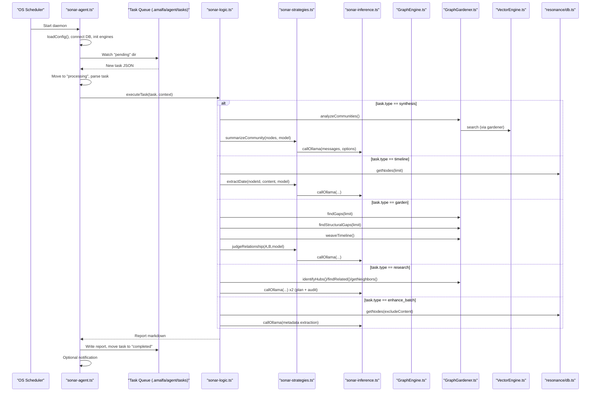

**Diagram sources**
- [sonar-agent.ts](file://src/daemon/sonar-agent.ts#L138-L179)
- [sonar-logic.ts](file://src/daemon/sonar-logic.ts#L323-L465)
- [sonar-strategies.ts](file://src/daemon/sonar-strategies.ts#L34-L84)
- [sonar-inference.ts](file://src/daemon/sonar-inference.ts#L19-L119)
- [GraphEngine.ts](file://src/core/GraphEngine.ts#L50-L100)
- [GraphGardener.ts](file://src/core/GraphGardener.ts#L38-L100)
- [VectorEngine.ts](file://src/core/VectorEngine.ts#L159-L200)
- [db.ts](file://src/resonance/db.ts#L194-L220)

## Detailed Component Analysis

### Task Types and Execution Logic

#### Synthesis
- Purpose: Identify cohesive clusters and produce canonical labels and summaries.
- Inputs: minSize threshold; optional autoApply to materialize synthesis outputs.
- Processing:
  - Analyze communities via the graph engine.
  - Select representative nodes per cluster.
  - Summarize using a community synthesis strategy with a routed model.
  - Optionally write synthesis artifacts to docs/synthesis.
- Outputs: Human-readable report with summaries and actions taken.

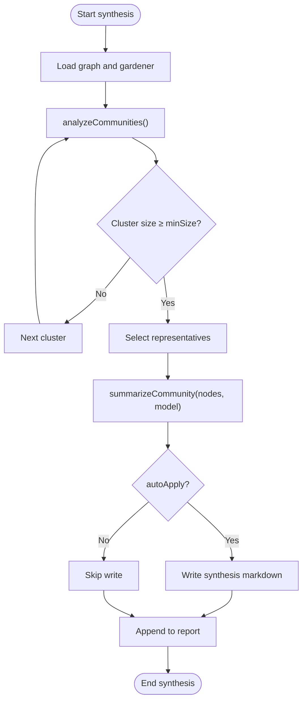

**Diagram sources**
- [sonar-logic.ts](file://src/daemon/sonar-logic.ts#L323-L364)
- [sonar-strategies.ts](file://src/daemon/sonar-strategies.ts#L90-L142)

**Section sources**
- [sonar-logic.ts](file://src/daemon/sonar-logic.ts#L323-L364)
- [sonar-strategies.ts](file://src/daemon/sonar-strategies.ts#L90-L142)

#### Timeline
- Purpose: Anchor nodes to temporal anchors using LLM extraction.
- Inputs: limit for processed nodes; optional autoApply to update node dates.
- Processing:
  - Fetch nodes (limit), skip those already dated.
  - Extract date via Chronos strategy; optionally persist date.
- Outputs: Count of updated nodes and a summary per node.

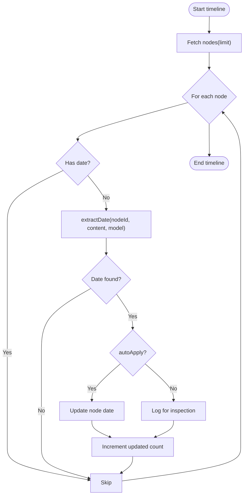

**Diagram sources**
- [sonar-logic.ts](file://src/daemon/sonar-logic.ts#L369-L391)
- [sonar-strategies.ts](file://src/daemon/sonar-strategies.ts#L148-L186)

**Section sources**
- [sonar-logic.ts](file://src/daemon/sonar-logic.ts#L369-L391)
- [sonar-strategies.ts](file://src/daemon/sonar-strategies.ts#L148-L186)

#### Garden
- Purpose: Discover and validate missing links using semantic and structural heuristics, plus temporal sequencing.
- Inputs: limit for suggestions; optional autoApply to inject tags.
- Processing:
  - Semantic gaps: vector similarity pairs with LLM judgment.
  - Structural gaps: Adamic-Adar scoring with LLM judgment.
  - Temporal: ordered pair suggestions with “FOLLOWS” tagging.
- Outputs: Actionable suggestions with reasons and optional auto-application.

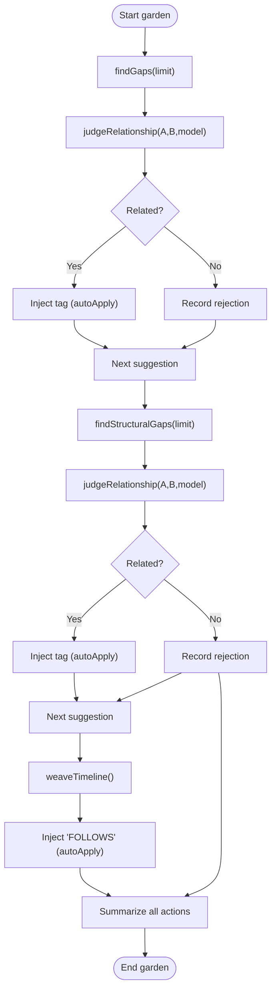

**Diagram sources**
- [sonar-logic.ts](file://src/daemon/sonar-logic.ts#L397-L465)
- [sonar-strategies.ts](file://src/daemon/sonar-strategies.ts#L34-L84)

**Section sources**
- [sonar-logic.ts](file://src/daemon/sonar-logic.ts#L397-L465)
- [sonar-strategies.ts](file://src/daemon/sonar-strategies.ts#L34-L84)

#### Research
- Purpose: Autonomous discovery guided by a chain-of-thought planner and auditor.
- Inputs: query; narrative detection influences mode; optional autoApply not applicable.
- Processing:
  - Iteratively decide SEARCH, READ, EXPLORE, or FINISH.
  - Use vector search, content reading, and graph traversal.
  - Final auditor validates completeness and produces a polished answer.
- Outputs: Stepwise findings, decisions, and a final conclusion.

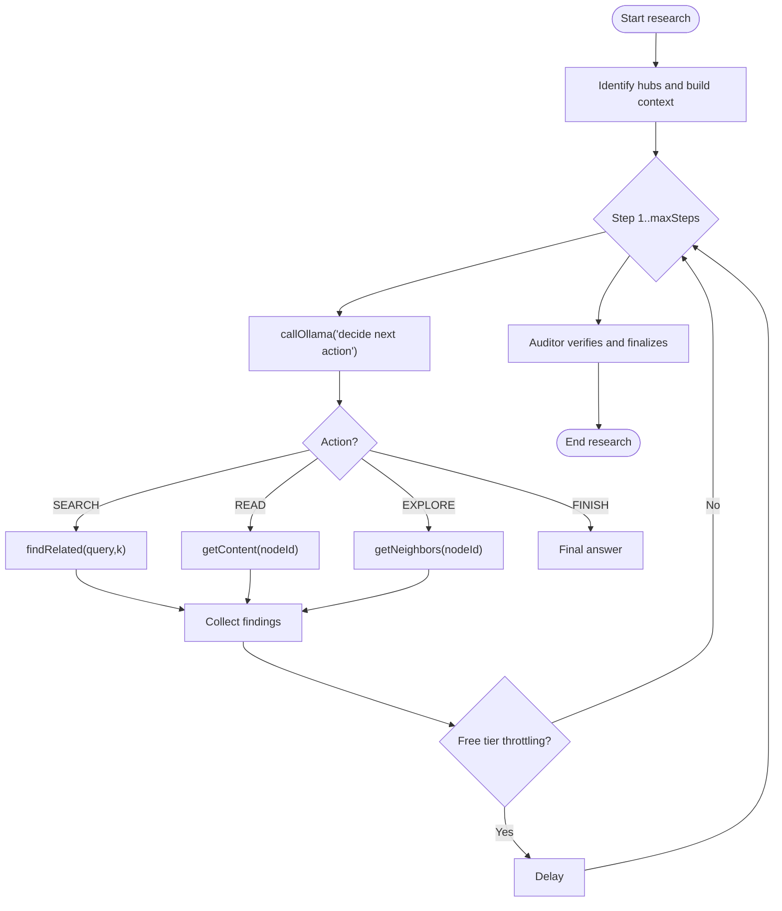

**Diagram sources**
- [sonar-logic.ts](file://src/daemon/sonar-logic.ts#L469-L664)

**Section sources**
- [sonar-logic.ts](file://src/daemon/sonar-logic.ts#L469-L664)

#### Enhance Batch
- Purpose: Bulk metadata enhancement for unprocessed nodes.
- Inputs: limit for batch size.
- Processing:
  - Select unenhanced nodes (filtered by metadata flags).
  - Parallelize metadata extraction via LLM and update node metadata.
- Outputs: Summary of successes, failures, and totals.

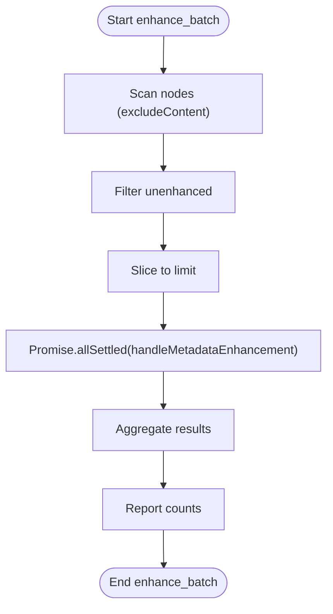

**Diagram sources**
- [sonar-logic.ts](file://src/daemon/sonar-logic.ts#L69-L99)

**Section sources**
- [sonar-logic.ts](file://src/daemon/sonar-logic.ts#L69-L99)

### Task Execution Pipeline
- Task parsing and routing:
  - Pending tasks are moved to processing, parsed, and executed by type-specific handlers.
  - A report is written to the completed directory, and the task file is also moved there.
- Context management:
  - SonarContext bundles the database, graph engine, gardener, and chat sessions for handler access.
- Result reporting:
  - Each handler appends a structured markdown report with timing and outcomes.

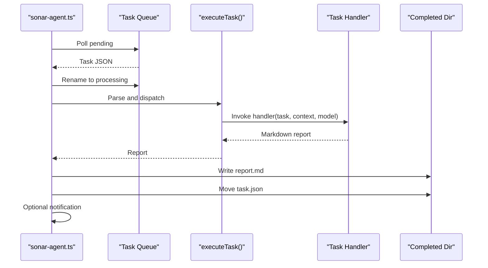

**Diagram sources**
- [sonar-agent.ts](file://src/daemon/sonar-agent.ts#L138-L179)
- [sonar-logic.ts](file://src/daemon/sonar-logic.ts#L184-L217)

**Section sources**
- [sonar-agent.ts](file://src/daemon/sonar-agent.ts#L138-L179)
- [sonar-logic.ts](file://src/daemon/sonar-logic.ts#L184-L217)

### Integration with Graph Operations, Vector Search, and Knowledge Graph Analysis
- GraphEngine loads a hollow representation of nodes and edges into memory for fast traversal and analytics.
- GraphGardener orchestrates:
  - Community analysis and representative selection for synthesis.
  - Gap detection using vector similarity and structural metrics (Adamic-Adar).
  - Timeline weaving and temporal ordering.
- VectorEngine provides:
  - Embedding generation and FAFCAS-compliant storage.
  - High-throughput similarity search over unit vectors.
- ResonanceDB persists nodes and edges, enabling durable graph operations and metadata updates.

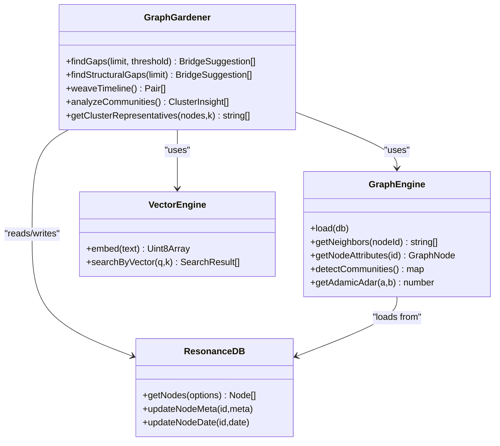

**Diagram sources**
- [GraphEngine.ts](file://src/core/GraphEngine.ts#L50-L200)
- [GraphGardener.ts](file://src/core/GraphGardener.ts#L38-L100)
- [VectorEngine.ts](file://src/core/VectorEngine.ts#L115-L200)
- [db.ts](file://src/resonance/db.ts#L194-L220)

**Section sources**
- [GraphEngine.ts](file://src/core/GraphEngine.ts#L50-L200)
- [GraphGardener.ts](file://src/core/GraphGardener.ts#L38-L100)
- [VectorEngine.ts](file://src/core/VectorEngine.ts#L115-L200)
- [db.ts](file://src/resonance/db.ts#L194-L220)

### Context Management and API Surface
- SonarContext is constructed in the daemon and passed to handlers for consistent access to engines and sessions.
- The HTTP server exposes endpoints for chat, metadata enhancement, search analysis, reranking, and context extraction, enabling external orchestration.

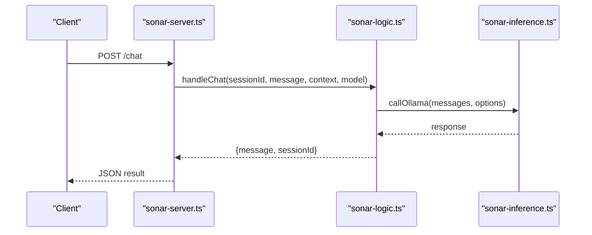

**Diagram sources**
- [sonar-server.ts](file://src/daemon/sonar-server.ts#L58-L67)
- [sonar-logic.ts](file://src/daemon/sonar-logic.ts#L104-L179)
- [sonar-inference.ts](file://src/daemon/sonar-inference.ts#L19-L119)

**Section sources**
- [sonar-server.ts](file://src/daemon/sonar-server.ts#L58-L67)
- [sonar-logic.ts](file://src/daemon/sonar-logic.ts#L104-L179)

### Practical Examples

- Creating a synthesis task:
  - Place a JSON file in the pending directory with type synthesis, optional minSize, and autoApply flags.
  - The handler analyzes communities, summarizes, and optionally writes synthesis artifacts.

- Creating a timeline task:
  - Place a JSON file with type timeline and limit.
  - The handler extracts dates and optionally updates node dates.

- Creating a garden task:
  - Place a JSON file with type garden and limit.
  - The handler suggests semantic, structural, and temporal links and can auto-apply tags.

- Creating a research task:
  - Place a JSON file with type research and a query.
  - The handler performs iterative search/read/explore until it can finalize an answer.

- Creating an enhance_batch task:
  - Place a JSON file with type enhance_batch and limit.
  - The handler enhances metadata for a batch of nodes and reports counts.

**Section sources**
- [sonar-logic.ts](file://src/daemon/sonar-logic.ts#L323-L364)
- [sonar-logic.ts](file://src/daemon/sonar-logic.ts#L369-L391)
- [sonar-logic.ts](file://src/daemon/sonar-logic.ts#L397-L465)
- [sonar-logic.ts](file://src/daemon/sonar-logic.ts#L469-L664)
- [sonar-logic.ts](file://src/daemon/sonar-logic.ts#L69-L99)

## Dependency Analysis
- Coupling:
  - Handlers depend on GraphEngine, GraphGardener, VectorEngine, ResonanceDB, and inference strategies.
  - Inference routing is centralized to support local/cloud providers.
- Cohesion:
  - Each handler encapsulates a single responsibility (synthesis, timeline, garden, research, enhance_batch).
- External dependencies:
  - Graphology for graph analytics.
  - fastembed for embeddings.
  - Drizzle for migrations.

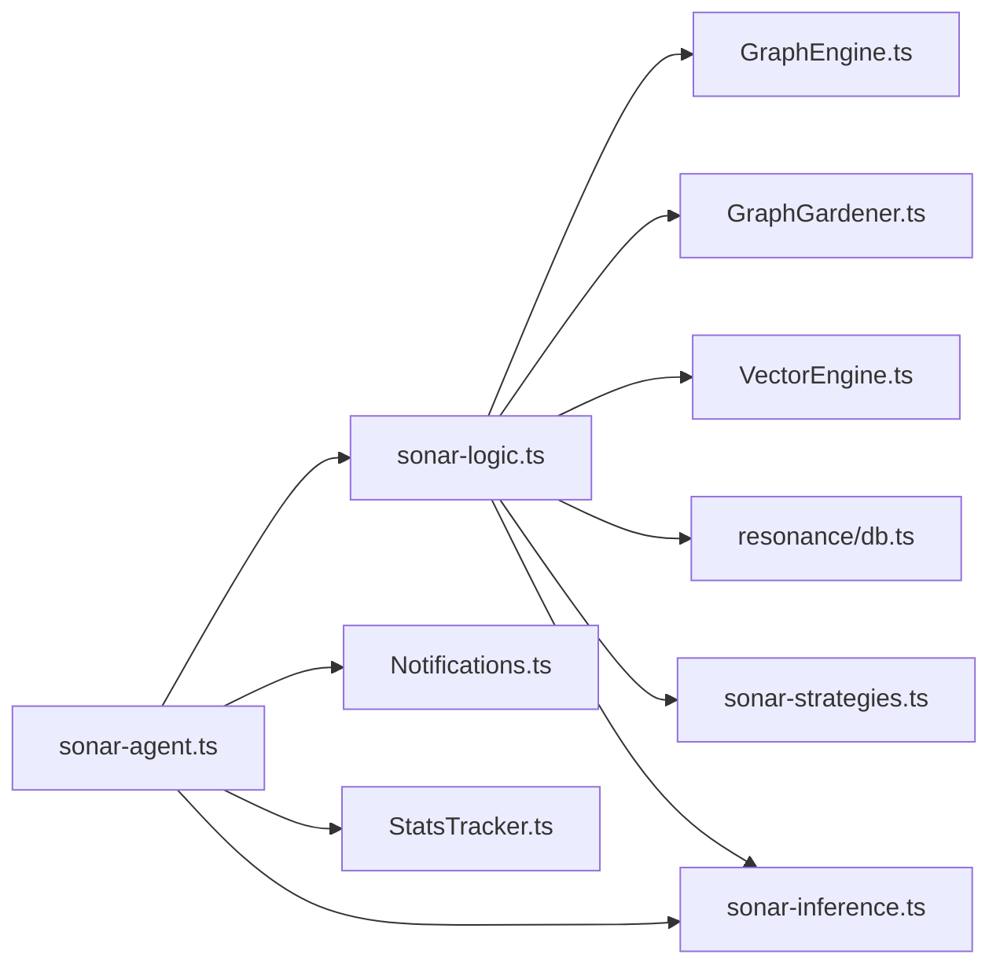

**Diagram sources**
- [sonar-logic.ts](file://src/daemon/sonar-logic.ts#L1-L685)
- [sonar-agent.ts](file://src/daemon/sonar-agent.ts#L1-L221)
- [sonar-inference.ts](file://src/daemon/sonar-inference.ts#L1-L120)
- [Notifications.ts](file://src/utils/Notifications.ts#L1-L66)
- [StatsTracker.ts](file://src/utils/StatsTracker.ts#L1-L218)

**Section sources**
- [sonar-logic.ts](file://src/daemon/sonar-logic.ts#L1-L685)
- [sonar-agent.ts](file://src/daemon/sonar-agent.ts#L1-L221)

## Performance Considerations
- Vector search uses FAFCAS normalization and pure dot products for speed; ensure embeddings are present for optimal recall.
- Graph loading is optimized by loading only structural metadata (“hollow nodes”) and recomputing on demand.
- Batch operations (e.g., enhance_batch) use parallelization to improve throughput.
- Free-tier cloud providers may require throttling delays to respect rate limits.

[No sources needed since this section provides general guidance]

## Troubleshooting Guide
- Task failed reports:
  - On handler errors, the agent writes a FAILED report and moves the task to completed for inspection.
- Notification system:
  - Desktop notifications are sent after task completion when enabled.
- Inference failures:
  - Inference routing logs endpoint/model and throws on HTTP errors; verify provider credentials and connectivity.
- Database and graph integrity:
  - Use StatsTracker to monitor node/edge counts and embedding coverage; investigate regressions promptly.

**Section sources**
- [sonar-agent.ts](file://src/daemon/sonar-agent.ts#L167-L177)
- [Notifications.ts](file://src/utils/Notifications.ts#L8-L30)
- [sonar-inference.ts](file://src/daemon/sonar-inference.ts#L87-L119)
- [StatsTracker.ts](file://src/utils/StatsTracker.ts#L113-L174)

## Conclusion
The Sonar agent’s task processing workflows combine robust graph and vector operations with LLM-driven strategies to automate knowledge graph curation. By separating concerns into handlers, strategies, and inference routing, the system remains extensible and observable. Operators can enqueue tasks, monitor progress, and rely on notifications and reports to validate outcomes.

[No sources needed since this section summarizes without analyzing specific files]

## Appendices

### Task Type Reference
- synthesis: Cluster analysis and labeling; optional auto-application of synthesis nodes.
- timeline: Date anchoring for nodes; optional auto-application of dates.
- garden: Semantic and structural gap detection with LLM judgment; optional auto-application of tags.
- research: Autonomous discovery with iterative planning and auditing.
- enhance_batch: Bulk metadata enhancement for nodes.

**Section sources**
- [sonar-types.ts](file://src/daemon/sonar-types.ts#L16-L32)
- [sonar-logic.ts](file://src/daemon/sonar-logic.ts#L323-L364)
- [sonar-logic.ts](file://src/daemon/sonar-logic.ts#L369-L391)
- [sonar-logic.ts](file://src/daemon/sonar-logic.ts#L397-L465)
- [sonar-logic.ts](file://src/daemon/sonar-logic.ts#L469-L664)
- [sonar-logic.ts](file://src/daemon/sonar-logic.ts#L69-L99)