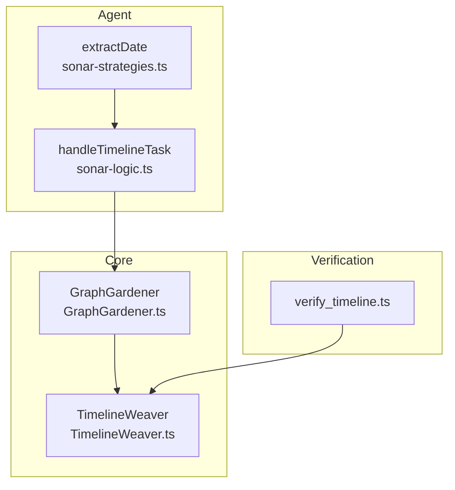
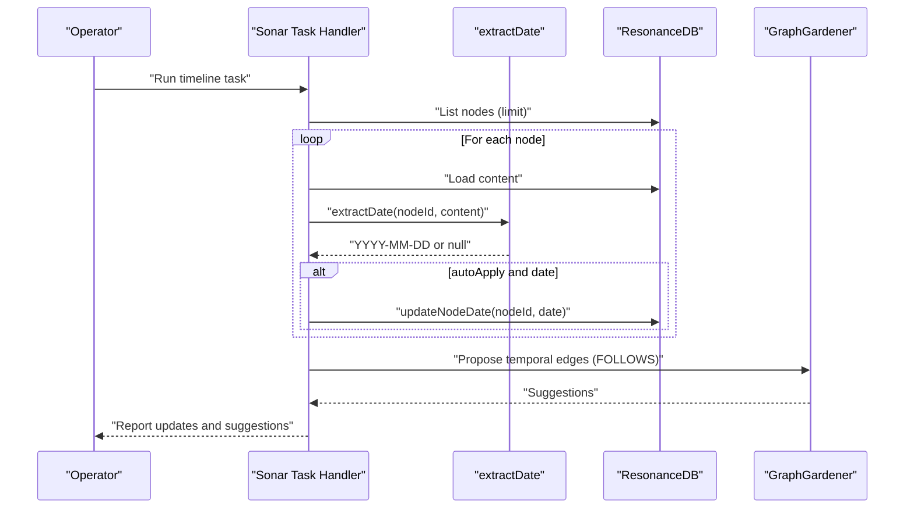
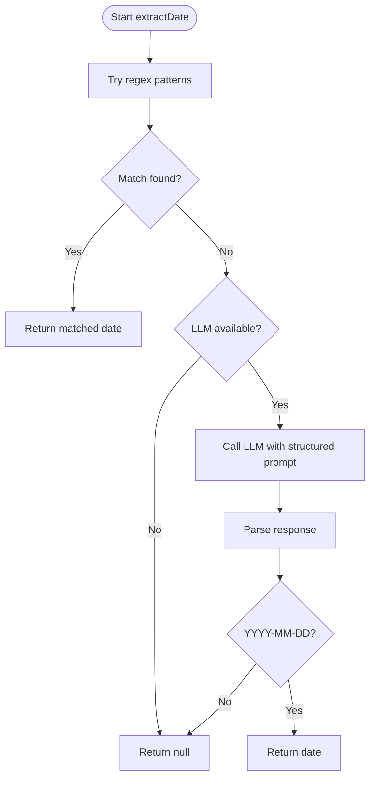
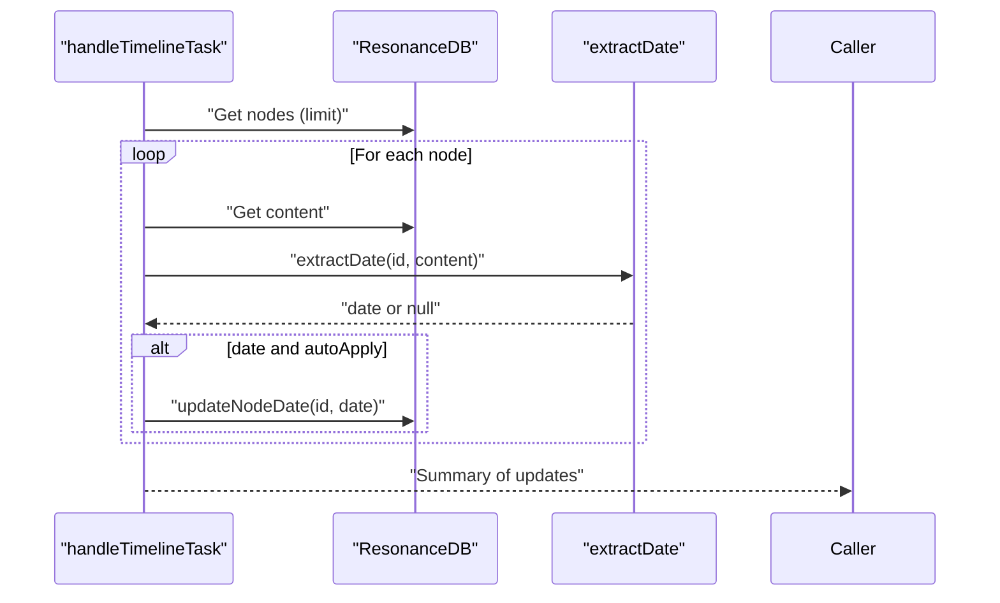
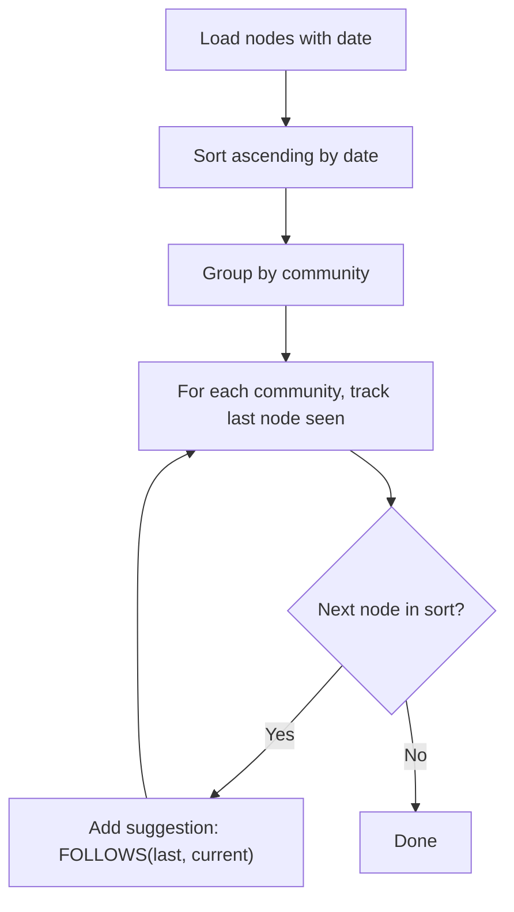
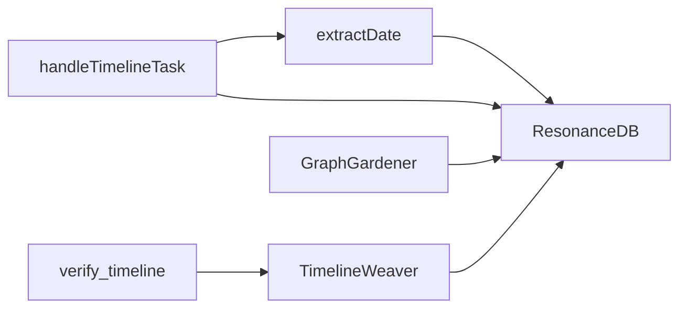

# Timeline Tasks

<cite>
**Referenced Files in This Document**
- [TimelineWeaver.ts](file://src/core/TimelineWeaver.ts)
- [sonar-strategies.ts](file://src/daemon/sonar-strategies.ts)
- [sonar-logic.ts](file://src/daemon/sonar-logic.ts)
- [GraphGardener.ts](file://src/core/GraphGardener.ts)
- [verify_timeline.ts](file://scripts/verify/verify_timeline.ts)
- [2026-01-08-graph-gardening-phase2-3.md](file://debriefs/2026-01-08-graph-gardening-phase2-3.md)
</cite>

## Table of Contents
1. [Introduction](#introduction)
2. [Project Structure](#project-structure)
3. [Core Components](#core-components)
4. [Architecture Overview](#architecture-overview)
5. [Detailed Component Analysis](#detailed-component-analysis)
6. [Dependency Analysis](#dependency-analysis)
7. [Performance Considerations](#performance-considerations)
8. [Troubleshooting Guide](#troubleshooting-guide)
9. [Conclusion](#conclusion)

## Introduction
This document explains timeline tasks in the Sonar agent, focusing on temporal anchoring, automatic timestamp assignment, and timeline coherence analysis. It covers how dates are extracted from document content, how the system assigns timestamps, how it validates and establishes temporal relationships, and how it integrates with broader temporal graph analysis. Practical examples illustrate configuration, accuracy expectations, and completeness checks, along with auto-apply behavior and integration with the temporal graph.

## Project Structure
The timeline capability spans several modules:
- A reusable core TimelineWeaver that builds a chronological chain from nodes with dates.
- An agent strategy extractDate that performs deterministic regex extraction and falls back to an LLM when needed.
- A Sonar task handler that orchestrates batch processing of nodes, invoking extractDate and optionally applying updates.
- A GraphGardener that proposes temporal edges based on date metadata and community structure.

**Diagram sources**
- [sonar-strategies.ts](file://src/daemon/sonar-strategies.ts#L148-L186)
- [sonar-logic.ts](file://src/daemon/sonar-logic.ts#L369-L392)
- [TimelineWeaver.ts](file://src/core/TimelineWeaver.ts#L1-L61)
- [GraphGardener.ts](file://src/core/GraphGardener.ts#L155-L195)
- [verify_timeline.ts](file://scripts/verify/verify_timeline.ts#L1-L26)

**Section sources**
- [sonar-strategies.ts](file://src/daemon/sonar-strategies.ts#L148-L186)
- [sonar-logic.ts](file://src/daemon/sonar-logic.ts#L369-L392)
- [TimelineWeaver.ts](file://src/core/TimelineWeaver.ts#L1-L61)
- [GraphGardener.ts](file://src/core/GraphGardener.ts#L155-L195)
- [verify_timeline.ts](file://scripts/verify/verify_timeline.ts#L1-L26)

## Core Components
- extractDate: Deterministic regex extraction of YYYY-MM-DD followed by optional LLM fallback when configured and available.
- handleTimelineTask: Batch processes nodes, fetches content, extracts dates, and optionally applies them to the database.
- TimelineWeaver: Builds a chronological chain among nodes of a specific type using date metadata and filenames as fallbacks.
- GraphGardener.weaveTimeline: Proposes temporal edges (FOLLOWS/PRECEDES) within communities based on sorted dates.

**Section sources**
- [sonar-strategies.ts](file://src/daemon/sonar-strategies.ts#L148-L186)
- [sonar-logic.ts](file://src/daemon/sonar-logic.ts#L369-L392)
- [TimelineWeaver.ts](file://src/core/TimelineWeaver.ts#L1-L61)
- [GraphGardener.ts](file://src/core/GraphGardener.ts#L155-L195)

## Architecture Overview
The timeline workflow integrates extraction, validation, and graph weaving:

**Diagram sources**
- [sonar-logic.ts](file://src/daemon/sonar-logic.ts#L369-L392)
- [sonar-strategies.ts](file://src/daemon/sonar-strategies.ts#L148-L186)
- [GraphGardener.ts](file://src/core/GraphGardener.ts#L155-L195)

## Detailed Component Analysis

### Temporal Anchoring Workflow
- Extraction precedence:
  - Regex-based capture of common date patterns in content.
  - LLM-based extraction with strict output validation (YYYY-MM-DD).
- Validation:
  - Rejects non-matching or null-like responses.
  - Requires deterministic extraction when possible.
- Application:
  - When autoApply is enabled, the task writes the date into the node’s metadata.

**Diagram sources**
- [sonar-strategies.ts](file://src/daemon/sonar-strategies.ts#L148-L186)

**Section sources**
- [sonar-strategies.ts](file://src/daemon/sonar-strategies.ts#L148-L186)

### Automatic Timestamp Assignment
- The timeline task iterates nodes up to a configurable limit.
- For each node without an existing date, it loads content and calls extractDate.
- If a valid date is returned and autoApply is enabled, it updates the node’s date field.

**Diagram sources**
- [sonar-logic.ts](file://src/daemon/sonar-logic.ts#L369-L392)
- [sonar-strategies.ts](file://src/daemon/sonar-strategies.ts#L148-L186)

**Section sources**
- [sonar-logic.ts](file://src/daemon/sonar-logic.ts#L369-L392)

### Timeline Coherence Analysis
- Within communities, GraphGardener sorts nodes by date and proposes temporal edges (FOLLOWS/PRECEDES) between consecutive items.
- Suggestions include reasons indicating the temporal sequence within a community.

**Diagram sources**
- [GraphGardener.ts](file://src/core/GraphGardener.ts#L155-L195)

**Section sources**
- [GraphGardener.ts](file://src/core/GraphGardener.ts#L155-L195)

### Batch Processing Capabilities
- The timeline task supports a configurable limit to constrain processing volume.
- It avoids reprocessing nodes that already have a date.
- It streams content per node and applies updates incrementally when autoApply is enabled.

**Section sources**
- [sonar-logic.ts](file://src/daemon/sonar-logic.ts#L369-L392)

### Date Validation Strategies
- Deterministic extraction uses anchored regex patterns for common date formats.
- LLM extraction enforces a strict output format and rejects non-conforming results.
- Fallbacks:
  - Filename-based extraction for nodes lacking explicit date metadata.
  - Core TimelineWeaver also derives dates from filenames when node metadata lacks a date.

**Section sources**
- [sonar-strategies.ts](file://src/daemon/sonar-strategies.ts#L148-L186)
- [TimelineWeaver.ts](file://src/core/TimelineWeaver.ts#L17-L37)

### Practical Examples

- Example: Timeline task configuration
  - Configure the task with a limit and enable autoApply to persist dates.
  - The task will iterate eligible nodes, extract dates, and apply them to the database.

- Example: Date extraction accuracy
  - Prefer explicit date markers in content for deterministic extraction.
  - When absent, rely on the LLM with a strict prompt; ensure the model responds with a single date in YYYY-MM-DD format.

- Example: Establishing temporal relationships
  - After anchoring, GraphGardener proposes FOLLOWS edges within communities based on sorted dates.
  - These suggestions can be auto-applied by injecting tags into the source documents.

- Example: Timeline completeness checking
  - Use the verification script to run the core TimelineWeaver and count resulting SUCCEEDS edges.
  - This provides a quick audit of chronological chaining across debrief nodes.

**Section sources**
- [sonar-logic.ts](file://src/daemon/sonar-logic.ts#L369-L392)
- [GraphGardener.ts](file://src/core/GraphGardener.ts#L155-L195)
- [verify_timeline.ts](file://scripts/verify/verify_timeline.ts#L1-L26)
- [2026-01-08-graph-gardening-phase2-3.md](file://debriefs/2026-01-08-graph-gardening-phase2-3.md#L19-L23)

### Integration with Temporal Graph Analysis
- The timeline task populates node date metadata.
- GraphGardener uses these dates to propose temporal edges and integrate them with semantic and structural gap analysis during the garden task.
- The broader temporal schema includes a dedicated date column for nodes, enabling robust chronological analysis.

**Section sources**
- [GraphGardener.ts](file://src/core/GraphGardener.ts#L155-L195)
- [2026-01-08-graph-gardening-phase2-3.md](file://debriefs/2026-01-08-graph-gardening-phase2-3.md#L19-L23)

## Dependency Analysis
- extractDate depends on inference availability and uses a structured prompt to constrain output.
- handleTimelineTask depends on extractDate and ResonanceDB for persistence.
- GraphGardener depends on community detection and date metadata to propose temporal edges.
- TimelineWeaver operates independently on debrief nodes and inserts SUCCEEDS edges.

**Diagram sources**
- [sonar-strategies.ts](file://src/daemon/sonar-strategies.ts#L148-L186)
- [sonar-logic.ts](file://src/daemon/sonar-logic.ts#L369-L392)
- [GraphGardener.ts](file://src/core/GraphGardener.ts#L155-L195)
- [TimelineWeaver.ts](file://src/core/TimelineWeaver.ts#L1-L61)
- [verify_timeline.ts](file://scripts/verify/verify_timeline.ts#L1-L26)

**Section sources**
- [sonar-strategies.ts](file://src/daemon/sonar-strategies.ts#L148-L186)
- [sonar-logic.ts](file://src/daemon/sonar-logic.ts#L369-L392)
- [GraphGardener.ts](file://src/core/GraphGardener.ts#L155-L195)
- [TimelineWeaver.ts](file://src/core/TimelineWeaver.ts#L1-L61)
- [verify_timeline.ts](file://scripts/verify/verify_timeline.ts#L1-L26)

## Performance Considerations
- Batch limits reduce memory pressure and IO overhead during content retrieval and date extraction.
- Auto-apply writes are incremental; consider batching writes at a higher level if needed.
- LLM calls are constrained to deterministic prompts and short content slices to maintain responsiveness.
- GraphGardener’s temporal proposal is linear in the number of dated nodes and community partitions.

## Troubleshooting Guide
- If extractDate returns null:
  - Confirm content contains a readable date pattern or that the LLM endpoint is reachable.
  - Verify inference state and model availability.

- If no temporal edges appear after running the timeline task:
  - Ensure nodes have dates applied (either via the task or filename fallback).
  - Confirm community detection yields partitions; otherwise, GraphGardener’s weaveTimeline will return empty suggestions.

- To verify chronological chaining:
  - Run the verification script to count SUCCEEDS edges produced by the core TimelineWeaver.

**Section sources**
- [sonar-strategies.ts](file://src/daemon/sonar-strategies.ts#L148-L186)
- [GraphGardener.ts](file://src/core/GraphGardener.ts#L155-L195)
- [verify_timeline.ts](file://scripts/verify/verify_timeline.ts#L1-L26)

## Conclusion
The timeline tasks in the Sonar agent combine deterministic regex extraction with LLM-backed validation to anchor nodes to precise dates. The handleTimelineTask orchestrates batch processing and optional persistence, while GraphGardener proposes temporal edges within communities. The core TimelineWeaver provides a complementary mechanism for chronological chaining among specific node types. Together, these components support robust temporal graph analysis, with straightforward verification and integration points for broader graph enhancement workflows.