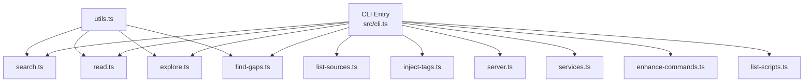
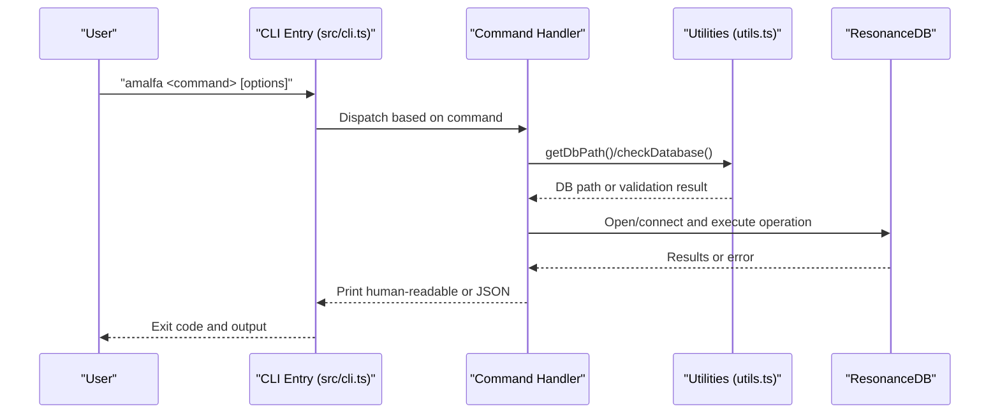
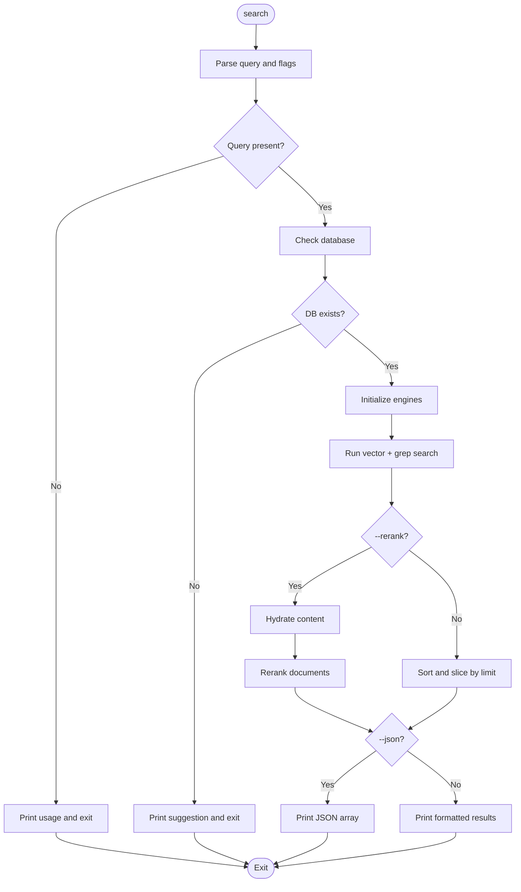
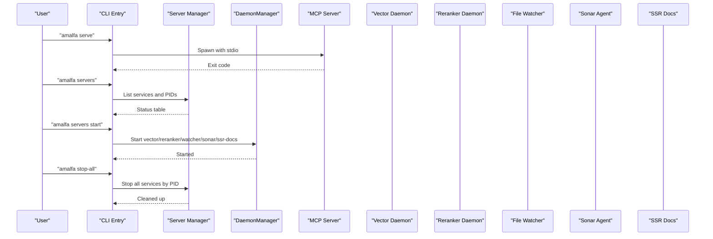
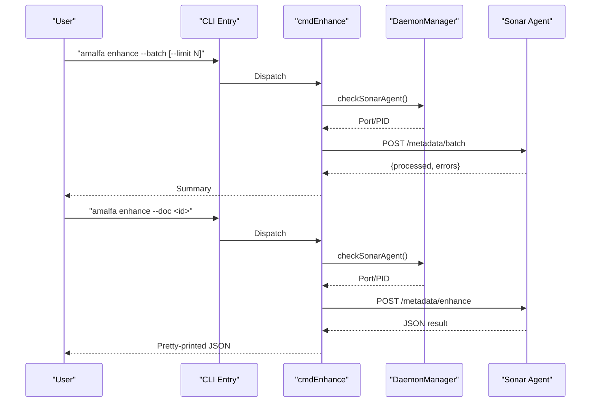
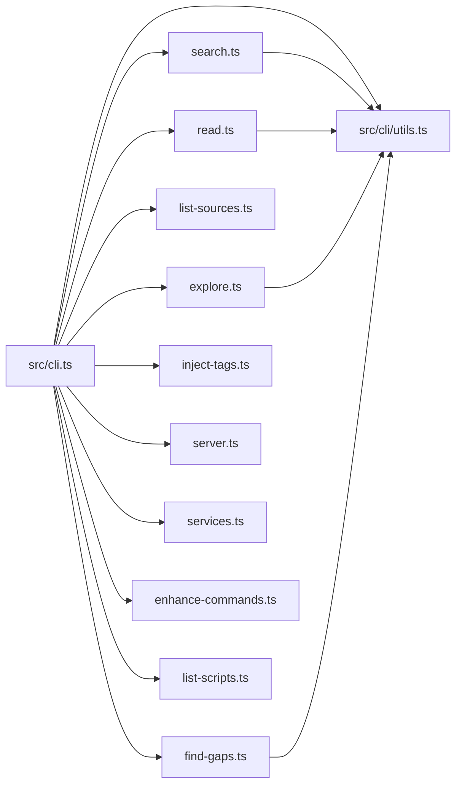

# CLI Interface

<cite>
**Referenced Files in This Document**
- [src/cli.ts](file://src/cli.ts)
- [src/cli/README.md](file://src/cli/README.md)
- [src/cli/commands/search.ts](file://src/cli/commands/search.ts)
- [src/cli/commands/read.ts](file://src/cli/commands/read.ts)
- [src/cli/commands/explore.ts](file://src/cli/commands/explore.ts)
- [src/cli/commands/list-sources.ts](file://src/cli/commands/list-sources.ts)
- [src/cli/commands/find-gaps.ts](file://src/cli/commands/find-gaps.ts)
- [src/cli/commands/inject-tags.ts](file://src/cli/commands/inject-tags.ts)
- [src/cli/commands/server.ts](file://src/cli/commands/server.ts)
- [src/cli/commands/services.ts](file://src/cli/commands/services.ts)
- [src/cli/enhance-commands.ts](file://src/cli/enhance-commands.ts)
- [src/cli/list-scripts.ts](file://src/cli/list-scripts.ts)
- [src/cli/utils.ts](file://src/cli/utils.ts)
</cite>

## Table of Contents
1. [Introduction](#introduction)
2. [Project Structure](#project-structure)
3. [Core Components](#core-components)
4. [Architecture Overview](#architecture-overview)
5. [Detailed Component Analysis](#detailed-component-analysis)
6. [Dependency Analysis](#dependency-analysis)
7. [Performance Considerations](#performance-considerations)
8. [Troubleshooting Guide](#troubleshooting-guide)
9. [Conclusion](#conclusion)
10. [Appendices](#appendices)

## Introduction
This document describes Amalfa’s command-line interface (CLI), covering all commands for search, reading, exploration, source listing, gap discovery, tag injection, and service management. It explains command structure, parameter options, output formats (including JSON for scripting), the script registry system, and how to extend CLI capabilities with the enhance-commands functionality. Practical workflows, batch processing, and CI/CD integration patterns are included, along with guidance for standalone usage and MCP server operation. Command-line argument parsing, error handling, and debugging techniques are also covered.

## Project Structure
The CLI is implemented as a modular command router with dedicated handlers for each command. The entry point parses arguments and dispatches to the appropriate handler. Utility modules centralize database path resolution and validation. Service management commands coordinate background daemons and the MCP server.

**Diagram sources**
- [src/cli.ts](file://src/cli.ts#L132-L268)
- [src/cli/commands/search.ts](file://src/cli/commands/search.ts#L19-L219)
- [src/cli/commands/read.ts](file://src/cli/commands/read.ts#L7-L116)
- [src/cli/commands/explore.ts](file://src/cli/commands/explore.ts#L9-L153)
- [src/cli/commands/list-sources.ts](file://src/cli/commands/list-sources.ts#L3-L36)
- [src/cli/commands/find-gaps.ts](file://src/cli/commands/find-gaps.ts#L85-L94)
- [src/cli/commands/inject-tags.ts](file://src/cli/commands/inject-tags.ts#L5-L133)
- [src/cli/commands/server.ts](file://src/cli/commands/server.ts#L7-L27)
- [src/cli/commands/services.ts](file://src/cli/commands/services.ts#L9-L343)
- [src/cli/enhance-commands.ts](file://src/cli/enhance-commands.ts#L6-L81)
- [src/cli/list-scripts.ts](file://src/cli/list-scripts.ts#L26-L67)
- [src/cli/utils.ts](file://src/cli/utils.ts#L7-L31)

**Section sources**
- [src/cli/README.md](file://src/cli/README.md#L1-L29)
- [src/cli.ts](file://src/cli.ts#L58-L111)

## Core Components
- CLI entry and dispatcher: Parses argv, handles help/version, routes to command handlers, and manages dynamic imports for optional features.
- Command handlers: Implement specific operations (search, read, explore, list-sources, find-gaps, inject-tags) with consistent error handling and JSON output support.
- Service management: Controls MCP server, vector/reranker daemons, file watcher, Sonar agent, SSR docs server, and Ember enrichment.
- Script registry: Lists user-available scripts with descriptions and categories, supporting both production and development modes.
- Utilities: Centralized database path resolution and validation shared across commands.

**Section sources**
- [src/cli.ts](file://src/cli.ts#L132-L268)
- [src/cli/utils.ts](file://src/cli/utils.ts#L7-L31)

## Architecture Overview
The CLI follows a command-router pattern. The entry point determines the command and delegates to a dedicated handler. Handlers may use shared utilities for database access and validation. Service commands orchestrate external daemons and the MCP server, while the enhance-commands feature integrates with the Sonar agent’s metadata enhancement endpoints.

**Diagram sources**
- [src/cli.ts](file://src/cli.ts#L132-L268)
- [src/cli/utils.ts](file://src/cli/utils.ts#L7-L31)
- [src/cli/commands/search.ts](file://src/cli/commands/search.ts#L75-L84)
- [src/cli/commands/read.ts](file://src/cli/commands/read.ts#L48-L56)
- [src/cli/commands/explore.ts](file://src/cli/commands/explore.ts#L64-L66)

## Detailed Component Analysis

### CLI Entry and Argument Parsing
- Determines command from argv[0].
- Handles help/version flags and prints usage.
- Routes to command-specific handlers.
- Supports dynamic imports for scripts and enhance-commands to reduce startup overhead.
- Special-case handling for system root CWD to locate project root.

**Section sources**
- [src/cli.ts](file://src/cli.ts#L37-L56)
- [src/cli.ts](file://src/cli.ts#L58-L111)
- [src/cli.ts](file://src/cli.ts#L132-L268)

### Search Command
- Arguments: query string (required), optional flags:
  - --limit N (supports both --limit=N and --limit N)
  - --rerank
  - --json
- Behavior:
  - Validates presence of query and database.
  - Executes hybrid search combining vector and grep engines.
  - Optionally reranks results and formats output as JSON for scripting.
- Output:
  - Human-readable with badges indicating exact matches.
  - JSON with fields id, score, preview, source, reranked.

**Diagram sources**
- [src/cli/commands/search.ts](file://src/cli/commands/search.ts#L19-L219)

**Section sources**
- [src/cli/commands/search.ts](file://src/cli/commands/search.ts#L19-L219)

### Read Command
- Arguments: node-id (required), optional --json.
- Behavior:
  - Validates node-id and database.
  - Loads graph engine and retrieves content via gardener.
- Output:
  - Human-readable with header and separator.
  - JSON with id and content.

**Section sources**
- [src/cli/commands/read.ts](file://src/cli/commands/read.ts#L7-L116)

### Explore Command
- Arguments: node-id (required), optional:
  - --relation=type or --relation type
  - --json
- Behavior:
  - Queries edges from the database for the given node.
  - Filters by relation type if provided.
- Output:
  - JSON array of targets and types.
  - Human-readable grouped by relation type with tips.

**Section sources**
- [src/cli/commands/explore.ts](file://src/cli/commands/explore.ts#L9-L153)

### List Sources Command
- Arguments: optional --json.
- Behavior:
  - Loads configuration and prints configured source directories.
- Output:
  - JSON object with sources array.
  - Human-readable list with explanatory note.

**Section sources**
- [src/cli/commands/list-sources.ts](file://src/cli/commands/list-sources.ts#L3-L36)

### Find Gaps Command
- Arguments: optional:
  - --limit N
  - --threshold T
- Behavior:
  - Runs a SQL query to find similar but unlinked nodes within the same domain.
  - Exports results to gaps.json in the database parent directory.
- Output:
  - Human-readable summary with counts and suggestions.
  - JSON export path printed.

**Section sources**
- [src/cli/commands/find-gaps.ts](file://src/cli/commands/find-gaps.ts#L85-L94)

### Inject Tags Command
- Arguments: file-path (required), one or more tags, optional --json.
- Behavior:
  - Validates file path, existence, and .md extension.
  - Injects each tag via TagInjector utility.
- Output:
  - JSON with success, file path, and count of injected tags.
  - Human-readable success message and tag list.

**Section sources**
- [src/cli/commands/inject-tags.ts](file://src/cli/commands/inject-tags.ts#L5-L133)

### Service Management Commands
- MCP Server:
  - serve: Spawns MCP server with stdio transport after validating database.
  - servers [--dot]: Shows status of all services and optionally renders a DOT diagram.
  - stop-all (kill): Stops all tracked services by PID and cleans PID files.
- Background Services:
  - vector, reranker, watcher, sonar, ssr-docs: Support start, stop, status, restart actions.
- Ember Enrichment:
  - ember scan [--dry-run]: Full sweep to generate sidecars.
  - ember squash: Merge sidecars into markdown.
  - ember status: Placeholder for pending sidecars.

**Diagram sources**
- [src/cli/commands/server.ts](file://src/cli/commands/server.ts#L7-L27)
- [src/cli/commands/server.ts](file://src/cli/commands/server.ts#L29-L211)
- [src/cli/commands/server.ts](file://src/cli/commands/server.ts#L266-L320)
- [src/cli/commands/services.ts](file://src/cli/commands/services.ts#L9-L343)

**Section sources**
- [src/cli/commands/server.ts](file://src/cli/commands/server.ts#L7-L27)
- [src/cli/commands/server.ts](file://src/cli/commands/server.ts#L29-L211)
- [src/cli/commands/server.ts](file://src/cli/commands/server.ts#L266-L320)
- [src/cli/commands/services.ts](file://src/cli/commands/services.ts#L9-L343)

### Enhance-Commands Functionality
- Requires Sonar Agent to be running.
- Modes:
  - --batch [--limit N]: Triggers batch metadata enhancement.
  - --doc <id>: Enhances a single document by ID.
- Output:
  - Human-readable summaries of processed and error counts.
  - JSON response from Sonar agent endpoints when enhancing a single document.

**Diagram sources**
- [src/cli/enhance-commands.ts](file://src/cli/enhance-commands.ts#L6-L81)

**Section sources**
- [src/cli/enhance-commands.ts](file://src/cli/enhance-commands.ts#L6-L81)

### Script Management System
- Listing scripts:
  - Reads a registry JSON file and groups entries by category.
  - In development mode (scripts directory present), shows both user and dev scripts.
  - In production mode, filters out dev scripts.
- Output:
  - Human-readable categorized list with command and description.

**Section sources**
- [src/cli/list-scripts.ts](file://src/cli/list-scripts.ts#L18-L67)

## Dependency Analysis
- The CLI entry depends on individual command modules and dynamically imports optional features.
- Commands depend on shared utilities for database path resolution and validation.
- Service commands rely on DaemonManager and configuration defaults for PID files and ports.
- Enhance-commands depends on Sonar Agent availability and communicates via HTTP.

**Diagram sources**
- [src/cli.ts](file://src/cli.ts#L1-L35)
- [src/cli/utils.ts](file://src/cli/utils.ts#L1-L32)

**Section sources**
- [src/cli.ts](file://src/cli.ts#L1-L35)
- [src/cli/utils.ts](file://src/cli/utils.ts#L1-L32)

## Performance Considerations
- Hybrid search uses parallel execution for vector and grep engines; consider increasing --limit cautiously when using --rerank to balance quality and latency.
- Reranking incurs additional compute; reserve for targeted queries.
- Service commands manage long-running daemons; ensure adequate system resources for vector and reranker daemons.
- Batch enhancement with --batch can process many documents; tune --limit to match system capacity.

## Troubleshooting Guide
- Database not found:
  - Use amalfa init to set up the knowledge graph.
  - Verify database path resolution via getDbPath().
- Unknown command:
  - Run amalfa help or amalfa --help for available commands.
- JSON output:
  - Pass --json to all applicable commands for machine-readable output suitable for scripting.
- Service status:
  - Use amalfa servers to check running status and ports.
  - Use amalfa servers --dot to generate a DOT diagram for visualization.
- MCP server:
  - Ensure database exists before starting amalfa serve.
  - Use amalfa stop-all to terminate all services if needed.
- Debugging:
  - Reproduce with verbose output and capture stderr.
  - For enhance-commands, confirm Sonar Agent is running and reachable on the reported port.

**Section sources**
- [src/cli/utils.ts](file://src/cli/utils.ts#L17-L31)
- [src/cli.ts](file://src/cli.ts#L256-L267)
- [src/cli/commands/server.ts](file://src/cli/commands/server.ts#L29-L211)

## Conclusion
Amalfa’s CLI provides a cohesive, extensible interface for knowledge graph operations, service management, and automation. Commands consistently support JSON output for scripting, while service commands enable robust MCP server and daemon orchestration. The enhance-commands feature integrates with the Sonar agent for scalable metadata enrichment. By leveraging the script registry and standardized argument patterns, teams can build reliable workflows and CI/CD integrations around Amalfa.

## Appendices

### Command Reference and Options
- search
  - Arguments: <query>, optional --limit N, --rerank, --json
  - Output: human-readable or JSON array
- read
  - Arguments: <node-id>, optional --json
  - Output: human-readable content or JSON object
- explore
  - Arguments: <node-id>, optional --relation=type, --json
  - Output: JSON array or grouped human-readable relations
- list-sources
  - Arguments: optional --json
  - Output: JSON object or human-readable list
- find-gaps
  - Arguments: optional --limit N, --threshold T
  - Output: human-readable summary and JSON export path
- inject-tags
  - Arguments: <file-path> <tag...>, optional --json
  - Output: JSON object or success summary
- serve
  - Arguments: none
  - Output: starts MCP server with stdio transport
- servers [--dot]
  - Arguments: optional start|stop|restart or --dot
  - Output: status table or DOT diagram
- stop-all (kill)
  - Arguments: none
  - Output: stops all services and cleans PID files
- vector|reranker|watcher|sonar|ssr-docs
  - Arguments: start|stop|status|restart
  - Output: status messages and logs
- ember
  - Arguments: scan [--dry-run], squash, status, help
  - Output: progress and results
- scripts list
  - Arguments: list
  - Output: categorized command registry
- enhance
  - Arguments: --batch [--limit N] or --doc <id>
  - Output: summary or JSON result

**Section sources**
- [src/cli.ts](file://src/cli.ts#L58-L111)
- [src/cli/commands/search.ts](file://src/cli/commands/search.ts#L34-L58)
- [src/cli/commands/read.ts](file://src/cli/commands/read.ts#L13-L31)
- [src/cli/commands/explore.ts](file://src/cli/commands/explore.ts#L27-L47)
- [src/cli/commands/list-sources.ts](file://src/cli/commands/list-sources.ts#L4-L21)
- [src/cli/commands/find-gaps.ts](file://src/cli/commands/find-gaps.ts#L86-L93)
- [src/cli/commands/inject-tags.ts](file://src/cli/commands/inject-tags.ts#L12-L48)
- [src/cli/commands/server.ts](file://src/cli/commands/server.ts#L29-L211)
- [src/cli/commands/services.ts](file://src/cli/commands/services.ts#L9-L343)
- [src/cli/enhance-commands.ts](file://src/cli/enhance-commands.ts#L6-L81)
- [src/cli/list-scripts.ts](file://src/cli/list-scripts.ts#L26-L67)

### Practical Workflows and Examples
- Standalone usage:
  - Initialize knowledge graph, search, read results, and explore relations.
  - Inject tags into markdown files and re-index.
- CI/CD integration:
  - Use --json for machine-readable outputs.
  - Run amalfa find-gaps periodically and export gaps.json for review.
  - Trigger amalfa enhance --batch for periodic metadata enrichment.
- MCP server operation:
  - Start amalfa serve for Claude Desktop integration.
  - Monitor with amalfa servers and stop with amalfa stop-all when needed.

[No sources needed since this section aggregates previously cited information]