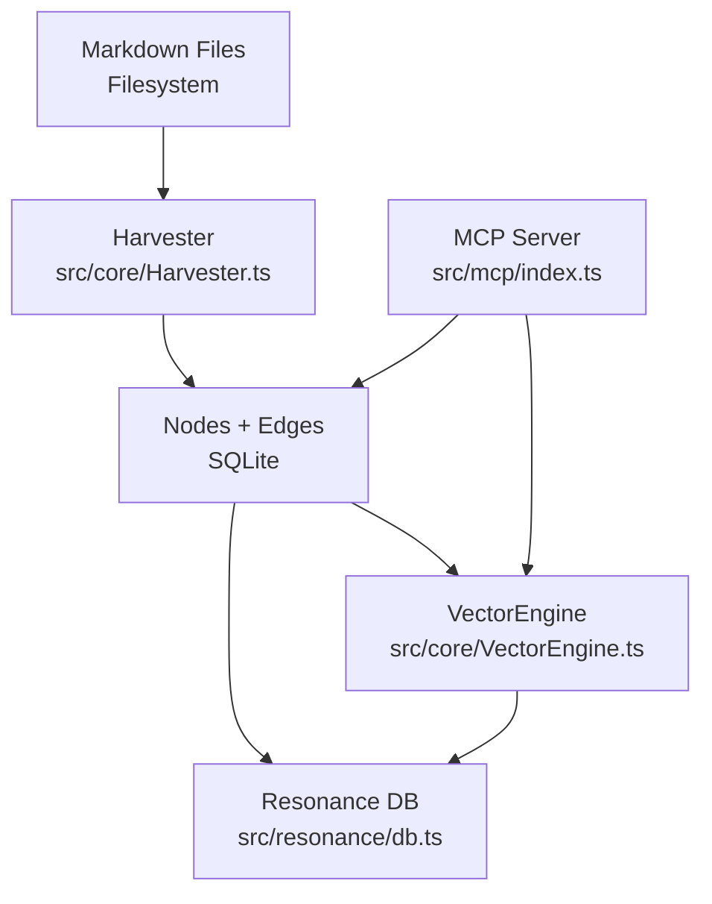
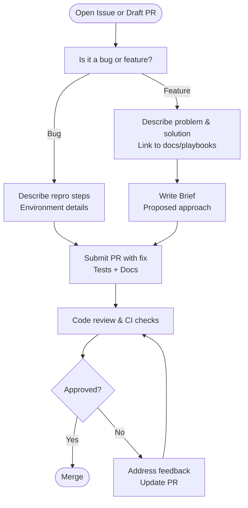
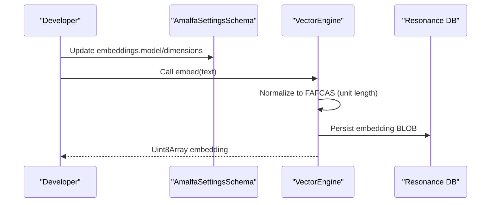
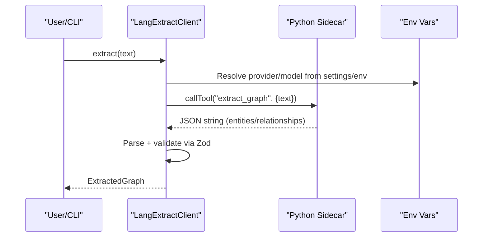
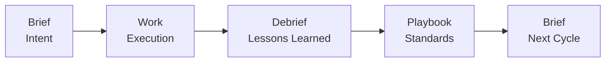
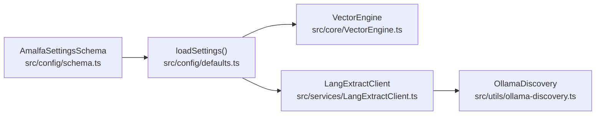

# Contributing and Extensions

<cite>
**Referenced Files in This Document**
- [README.md](file://README.md)
- [docs/COMMIT_GUIDELINES.md](file://docs/COMMIT_GUIDELINES.md)
- [docs/ARCHITECTURE.md](file://docs/ARCHITECTURE.md)
- [docs/VISION-AGENT-LEARNING.md](file://docs/VISION-AGENT-LEARNING.md)
- [docs/USER-MANUAL.md](file://docs/USER-MANUAL.md)
- [playbooks/README.md](file://playbooks/README.md)
- [briefs/README.md](file://briefs/README.md)
- [debriefs/2026-01-06-readme.md](file://debriefs/2026-01-06-readme.md)
- [src/config/defaults.ts](file://src/config/defaults.ts)
- [src/config/schema.ts](file://src/config/schema.ts)
- [src/core/VectorEngine.ts](file://src/core/VectorEngine.ts)
- [src/services/LangExtractClient.ts](file://src/services/LangExtractClient.ts)
- [src/utils/ollama-discovery.ts](file://src/utils/ollama-discovery.ts)
</cite>

## Table of Contents
1. [Introduction](#introduction)
2. [Project Structure](#project-structure)
3. [Core Components](#core-components)
4. [Architecture Overview](#architecture-overview)
5. [Detailed Component Analysis](#detailed-component-analysis)
6. [Dependency Analysis](#dependency-analysis)
7. [Performance Considerations](#performance-considerations)
8. [Troubleshooting Guide](#troubleshooting-guide)
9. [Conclusion](#conclusion)
10. [Appendices](#appendices)

## Introduction
This document is the definitive guide for contributing to Amalfa and developing extensions. It explains how to report issues, propose features, submit pull requests, and align your work with the project’s vision and roadmap. It also covers extension points for adding new embedding models, search providers, and service integrations, and outlines the Brief/Debrief/Playbook system that structures design decisions and lessons learned. Finally, it provides practical guidance on documentation quality, testing, code hygiene, governance, and community practices.

## Project Structure
Amalfa is organized around a clear separation of concerns:
- Core runtime and services under src/
- CLI commands under src/cli/
- Configuration and schema under src/config/
- Pipelines and ingestion under src/pipeline/
- Resonance database layer under src/resonance/
- MCP integration under src/mcp/
- Sidecars and external integrations under src/sidecars/
- Documentation, playbooks, and artifacts under docs/, playbooks/, briefs/, debriefs/

```mermaid
graph TB
subgraph "Core Runtime"
CFG["Configuration<br/>src/config/*"]
CORE["Core Engines<br/>src/core/*"]
RES["Resonance DB<br/>src/resonance/*"]
MCP["MCP Server<br/>src/mcp/*"]
end
subgraph "CLI"
CLI["CLI Commands<br/>src/cli/*"]
end
subgraph "Integration"
LEC["LangExtract Client<br/>src/services/LangExtractClient.ts"]
ODS["Ollama Discovery<br/>src/utils/ollama-discovery.ts"]
end
subgraph "Docs & Governance"
DOCS["Docs<br/>docs/*"]
PLAY["Playbooks<br/>playbooks/*"]
BRIF["Briefs<br/>briefs/*"]
DEBR["Debriefs<br/>debriefs/*"]
end
CLI --> CORE
CLI --> RES
CLI --> MCP
CORE --> RES
LEC --> CORE
ODS --> LEC
CFG --> CORE
CFG --> MCP
CFG --> LEC
DOCS --> BRIF
DOCS --> DEBR
PLAY --> CORE
```

**Diagram sources**
- [src/config/defaults.ts](file://src/config/defaults.ts#L84-L139)
- [src/core/VectorEngine.ts](file://src/core/VectorEngine.ts#L76-L241)
- [src/services/LangExtractClient.ts](file://src/services/LangExtractClient.ts#L31-L353)
- [src/utils/ollama-discovery.ts](file://src/utils/ollama-discovery.ts#L83-L155)
- [docs/ARCHITECTURE.md](file://docs/ARCHITECTURE.md#L223-L272)

**Section sources**
- [README.md](file://README.md#L357-L406)
- [docs/ARCHITECTURE.md](file://docs/ARCHITECTURE.md#L1-L60)

## Core Components
- Configuration and settings: Centralized in amalfa.settings.json with strict schema validation and defaults. See [loadSettings](file://src/config/defaults.ts#L84-L139) and [AmalfaSettingsSchema](file://src/config/schema.ts#L146-L266).
- Vector search engine: Implements FAFCAS protocol for fast similarity search using normalized embeddings. See [VectorEngine](file://src/core/VectorEngine.ts#L76-L241).
- Language extraction client: Connects to a Python sidecar via MCP stdio, supporting multiple providers (OpenRouter, Gemini, Ollama). See [LangExtractClient](file://src/services/LangExtractClient.ts#L31-L353).
- Ollama discovery: CLI-based capability detection and model selection for local inference. See [discoverOllamaCapabilities](file://src/utils/ollama-discovery.ts#L83-L155).

**Section sources**
- [src/config/defaults.ts](file://src/config/defaults.ts#L84-L139)
- [src/config/schema.ts](file://src/config/schema.ts#L146-L266)
- [src/core/VectorEngine.ts](file://src/core/VectorEngine.ts#L76-L241)
- [src/services/LangExtractClient.ts](file://src/services/LangExtractClient.ts#L31-L353)
- [src/utils/ollama-discovery.ts](file://src/utils/ollama-discovery.ts#L83-L155)

## Architecture Overview
Amalfa’s architecture emphasizes local-first operation, semantic search, and agent integration:
- Local-first: Hollow nodes store metadata; content is on the filesystem. See [Hollow Nodes](file://docs/ARCHITECTURE.md#L21-L67).
- FAFCAS protocol: Normalized vectors enable 10x faster similarity search. See [FAFCAS Protocol](file://docs/ARCHITECTURE.md#L68-L133).
- Micro-daemon mesh: Vector, reranker, and Sonar agents run as separate services. See [Micro-Daemon Mesh](file://docs/ARCHITECTURE.md#L134-L222).
- MCP integration: Tools expose semantic search, content hydration, and graph traversal. See [MCP Server](file://docs/ARCHITECTURE.md#L252-L272).



**Diagram sources**
- [docs/ARCHITECTURE.md](file://docs/ARCHITECTURE.md#L223-L272)
- [src/core/VectorEngine.ts](file://src/core/VectorEngine.ts#L76-L241)
- [src/resonance/db.ts](file://src/resonance/db.ts)

**Section sources**
- [docs/ARCHITECTURE.md](file://docs/ARCHITECTURE.md#L10-L60)

## Detailed Component Analysis

### Contribution Process
- Issue reporting: Use GitHub Issues to report bugs or request features. Provide reproduction steps, environment details, and desired outcomes.
- Feature requests: Open a GitHub Issue describing the problem, impact, and proposed solution. Link to relevant docs or playbooks.
- Pull requests: Align changes with the Brief/Debrief/Playbook cycle. Include tests, documentation updates, and adherence to commit guidelines.



**Section sources**
- [README.md](file://README.md#L660-L671)
- [docs/COMMIT_GUIDELINES.md](file://docs/COMMIT_GUIDELINES.md#L1-L368)

### Extension Points

#### Adding a New Embedding Model
- Current model: FastEmbed BGESmallENV15 (384-dim). See [VectorEngine constructor](file://src/core/VectorEngine.ts#L105-L109).
- Steps:
  - Choose a compatible FastEmbed model variant.
  - Update configuration schema to accept the new model and dimensions. See [AmalfaSettingsSchema.embeddings](file://src/config/schema.ts#L164-L168).
  - Ensure FAFCAS normalization is applied consistently. See [toFafcas](file://src/core/VectorEngine.ts#L17-L37).
  - Update CLI and ingestion logic to honor the new model. See [VectorEngine.embed](file://src/core/VectorEngine.ts#L115-L139).
  - Add tests validating embedding shape and FAFCAS compliance. See [VectorEngine.searchByVector](file://src/core/VectorEngine.ts#L159-L225).



**Diagram sources**
- [src/config/schema.ts](file://src/config/schema.ts#L164-L168)
- [src/core/VectorEngine.ts](file://src/core/VectorEngine.ts#L115-L139)
- [src/core/VectorEngine.ts](file://src/core/VectorEngine.ts#L144-L149)

**Section sources**
- [src/core/VectorEngine.ts](file://src/core/VectorEngine.ts#L105-L139)
- [src/config/schema.ts](file://src/config/schema.ts#L164-L168)

#### Adding a New Search Provider (LangExtract)
- Supported providers: OpenRouter, Gemini, Ollama, Ollama Cloud. See [ProviderEnum](file://src/config/schema.ts#L16-L21).
- Steps:
  - Extend [LangExtractConfigSchema](file://src/config/schema.ts#L97-L108) with provider-specific fields.
  - Implement provider selection and environment propagation in [LangExtractClient](file://src/services/LangExtractClient.ts#L62-L80).
  - Add provider-specific environment variables and defaults. See [transport env](file://src/services/LangExtractClient.ts#L226-L237).
  - Validate configuration and surface substrate errors. See [checkProviderConfig](file://src/services/LangExtractClient.ts#L86-L104) and [SubstrateError](file://src/config/schema.ts#L274-L282).
  - Add tests for extraction and error parsing. See [extract](file://src/services/LangExtractClient.ts#L248-L343).



**Diagram sources**
- [src/services/LangExtractClient.ts](file://src/services/LangExtractClient.ts#L188-L246)
- [src/services/LangExtractClient.ts](file://src/services/LangExtractClient.ts#L248-L343)
- [src/config/schema.ts](file://src/config/schema.ts#L97-L108)

**Section sources**
- [src/config/schema.ts](file://src/config/schema.ts#L16-L21)
- [src/services/LangExtractClient.ts](file://src/services/LangExtractClient.ts#L62-L80)
- [src/services/LangExtractClient.ts](file://src/services/LangExtractClient.ts#L226-L237)
- [src/services/LangExtractClient.ts](file://src/services/LangExtractClient.ts#L248-L343)

#### Integrating a New Service (e.g., a new daemon)
- Use the ServiceLifecycle pattern. See [ServiceLifecycle interface](file://docs/ARCHITECTURE.md#L204-L211).
- Implement start/stop/status/restart in a new module under src/resonance/services/.
- Register PID files and expose health/status via CLI. See [service management commands](file://docs/ARCHITECTURE.md#L213-L221).
- Add configuration under amalfa.settings.json. See [AmalfaSettingsSchema](file://src/config/schema.ts#L146-L266).

**Section sources**
- [docs/ARCHITECTURE.md](file://docs/ARCHITECTURE.md#L204-L221)
- [src/config/schema.ts](file://src/config/schema.ts#L146-L266)

### Brief/Debrief/Playbook System
- Brief: Tactical specification of intent. See [briefs/README.md](file://briefs/README.md#L1-L92).
- Debrief: Reflective capture of what worked, failed, and lessons learned. See [debriefs/2026-01-06-readme.md](file://debriefs/2026-01-06-readme.md#L1-L32).
- Playbook: Strategic codification of patterns and standards. See [playbooks/README.md](file://playbooks/README.md#L1-L67).
- Vision alignment: The cycle converts experience into explicit knowledge that agents can query and link. See [VISION-AGENT-LEARNING.md](file://docs/VISION-AGENT-LEARNING.md#L35-L63).



**Diagram sources**
- [briefs/README.md](file://briefs/README.md#L67-L91)
- [debriefs/2026-01-06-readme.md](file://debriefs/2026-01-06-readme.md#L18-L27)
- [playbooks/README.md](file://playbooks/README.md#L57-L67)

**Section sources**
- [briefs/README.md](file://briefs/README.md#L1-L92)
- [debriefs/2026-01-06-readme.md](file://debriefs/2026-01-06-readme.md#L1-L32)
- [playbooks/README.md](file://playbooks/README.md#L1-L67)
- [docs/VISION-AGENT-LEARNING.md](file://docs/VISION-AGENT-LEARNING.md#L35-L63)

### Guidelines for Documentation, Tests, and Code Quality
- Documentation: Keep docs in docs/, playbooks/, briefs/, debriefs/ and link them from the main README. See [README.md](file://README.md#L645-L658).
- Tests: Use Bun test runner and in-memory databases for speed and isolation. See [docs/ARCHITECTURE.md](file://docs/ARCHITECTURE.md#L434-L450).
- Code hygiene: Follow commit guidelines to avoid committing generated artifacts, secrets, or large binaries. See [COMMIT_GUIDELINES.md](file://docs/COMMIT_GUIDELINES.md#L1-L368).
- Formatting and linting: Use Biome via bun run check/format. See [README.md](file://README.md#L637-L641).

**Section sources**
- [README.md](file://README.md#L637-L658)
- [docs/COMMIT_GUIDELINES.md](file://docs/COMMIT_GUIDELINES.md#L173-L217)
- [docs/ARCHITECTURE.md](file://docs/ARCHITECTURE.md#L434-L450)

### Governance, Decision-Making, and Community Engagement
- Decision-making: Use the Brief/Debrief/Playbook cycle to formalize proposals, execution, and standards. See [briefs/README.md](file://briefs/README.md#L67-L91).
- Community: Engage via GitHub Issues and Discussions to align on roadmap and priorities. See [README.md](file://README.md#L660-L671).
- Licensing: MIT license applies. See [README.md](file://README.md#L673-L676).

**Section sources**
- [briefs/README.md](file://briefs/README.md#L67-L91)
- [README.md](file://README.md#L660-L676)

### Intellectual Property and Contributor Agreements
- License: MIT. See [README.md](file://README.md#L673-L676).
- No contributor agreement referenced in the repository. Contributors retain copyright; license is granted via MIT.

**Section sources**
- [README.md](file://README.md#L673-L676)

### Examples of Successful Contributions
- Adopting Remeda utilities across the codebase for safer, immutable transformations. See [briefs/README.md](file://briefs/README.md#L44-L66).
- Ollama capability discovery enabling reliable local inference. See [src/utils/ollama-discovery.ts](file://src/utils/ollama-discovery.ts#L83-L155).
- FAFCAS protocol implementation improving vector search performance. See [docs/ARCHITECTURE.md](file://docs/ARCHITECTURE.md#L68-L133).

**Section sources**
- [briefs/README.md](file://briefs/README.md#L44-L66)
- [src/utils/ollama-discovery.ts](file://src/utils/ollama-discovery.ts#L83-L155)
- [docs/ARCHITECTURE.md](file://docs/ARCHITECTURE.md#L68-L133)

## Dependency Analysis
Configuration drives most extension points. The schema defines supported providers and models, while the runtime enforces defaults and validates inputs.



**Diagram sources**
- [src/config/schema.ts](file://src/config/schema.ts#L146-L266)
- [src/config/defaults.ts](file://src/config/defaults.ts#L84-L139)
- [src/core/VectorEngine.ts](file://src/core/VectorEngine.ts#L76-L241)
- [src/services/LangExtractClient.ts](file://src/services/LangExtractClient.ts#L31-L353)
- [src/utils/ollama-discovery.ts](file://src/utils/ollama-discovery.ts#L83-L155)

**Section sources**
- [src/config/schema.ts](file://src/config/schema.ts#L146-L266)
- [src/config/defaults.ts](file://src/config/defaults.ts#L84-L139)

## Performance Considerations
- FAFCAS normalization eliminates costly division in cosine similarity, reducing latency for vector search. See [docs/ARCHITECTURE.md](file://docs/ARCHITECTURE.md#L120-L133).
- In-memory databases and zero-copy views minimize IO overhead in hot loops. See [VectorEngine.searchByVector](file://src/core/VectorEngine.ts#L159-L225).
- Micro-daemons offload heavy work from the main process, keeping latency low for MCP clients. See [docs/ARCHITECTURE.md](file://docs/ARCHITECTURE.md#L134-L222).

**Section sources**
- [docs/ARCHITECTURE.md](file://docs/ARCHITECTURE.md#L120-L133)
- [src/core/VectorEngine.ts](file://src/core/VectorEngine.ts#L159-L225)
- [docs/ARCHITECTURE.md](file://docs/ARCHITECTURE.md#L134-L222)

## Troubleshooting Guide
- Configuration validation failures: Ensure amalfa.settings.json conforms to the schema. See [loadSettings](file://src/config/defaults.ts#L84-L139).
- Missing API keys or invalid credentials: The substrate error parser surfaces actionable suggestions. See [parseSubstrateError](file://src/services/LangExtractClient.ts#L106-L186).
- Ollama not available: Use discovery utilities to check readiness and model availability. See [discoverOllamaCapabilities](file://src/utils/ollama-discovery.ts#L83-L155).
- Common gotchas (Bun vs npm, PATH issues): Refer to the user manual. See [USER-MANUAL.md](file://docs/USER-MANUAL.md#L234-L281).

**Section sources**
- [src/config/defaults.ts](file://src/config/defaults.ts#L84-L139)
- [src/services/LangExtractClient.ts](file://src/services/LangExtractClient.ts#L106-L186)
- [src/utils/ollama-discovery.ts](file://src/utils/ollama-discovery.ts#L83-L155)
- [docs/USER-MANUAL.md](file://docs/USER-MANUAL.md#L234-L281)

## Conclusion
Contributions to Amalfa should align with the Brief/Debrief/Playbook cycle, leverage the FAFCAS protocol and micro-daemon architecture, and adhere to strict configuration validation and documentation practices. Use the provided extension points to add new embedding models, search providers, and services, and engage with the community via Issues and Discussions to shape the roadmap.

## Appendices

### Quick Reference: Where to Look
- Configuration: [src/config/schema.ts](file://src/config/schema.ts#L146-L266), [src/config/defaults.ts](file://src/config/defaults.ts#L84-L139)
- Vector search: [src/core/VectorEngine.ts](file://src/core/VectorEngine.ts#L76-L241)
- LangExtract: [src/services/LangExtractClient.ts](file://src/services/LangExtractClient.ts#L31-L353)
- Ollama discovery: [src/utils/ollama-discovery.ts](file://src/utils/ollama-discovery.ts#L83-L155)
- Docs/playbooks/briefs/debriefs: [docs/README.md](file://docs/README.md), [playbooks/README.md](file://playbooks/README.md#L1-L67), [briefs/README.md](file://briefs/README.md#L1-L92), [debriefs/2026-01-06-readme.md](file://debriefs/2026-01-06-readme.md#L1-L32)