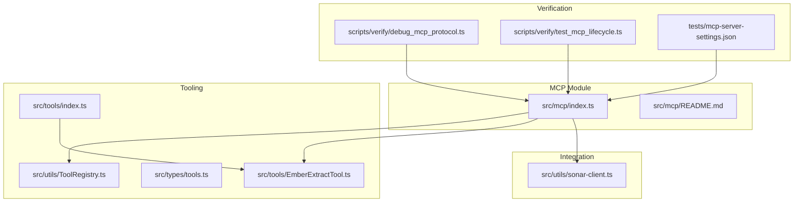
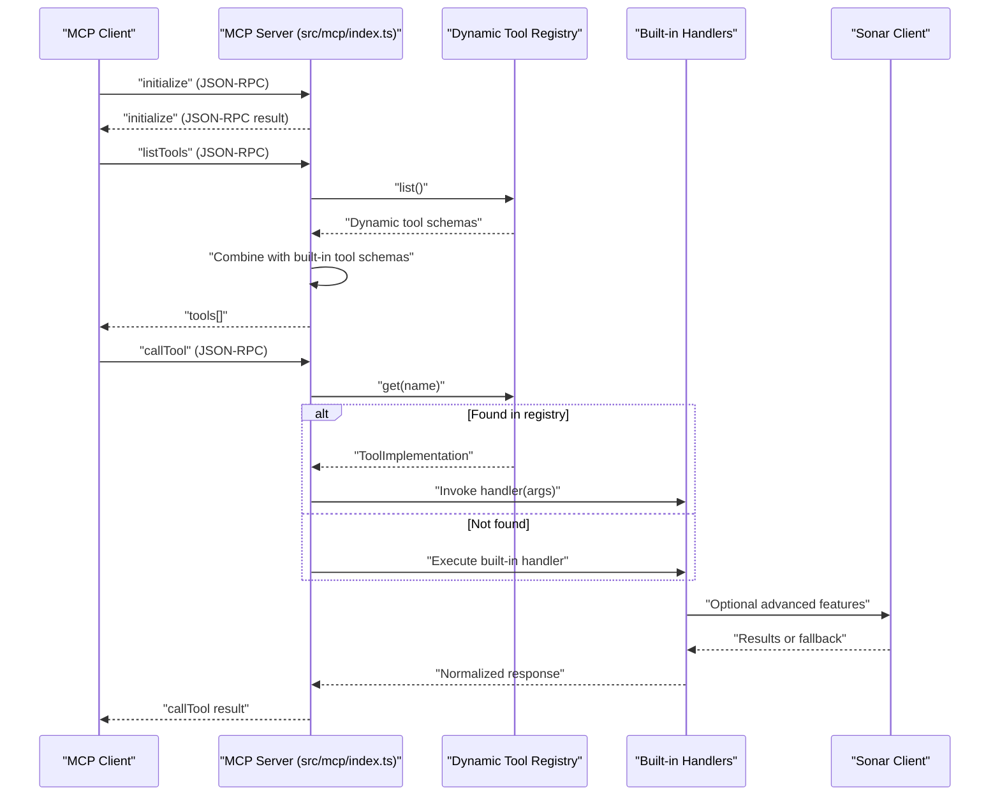
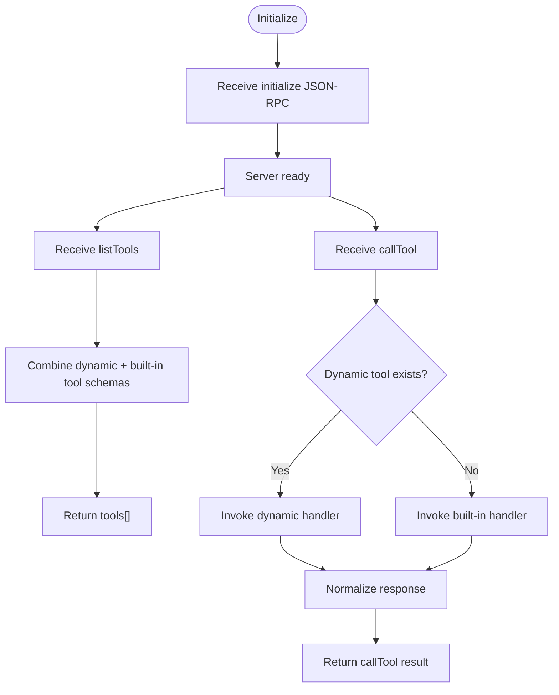
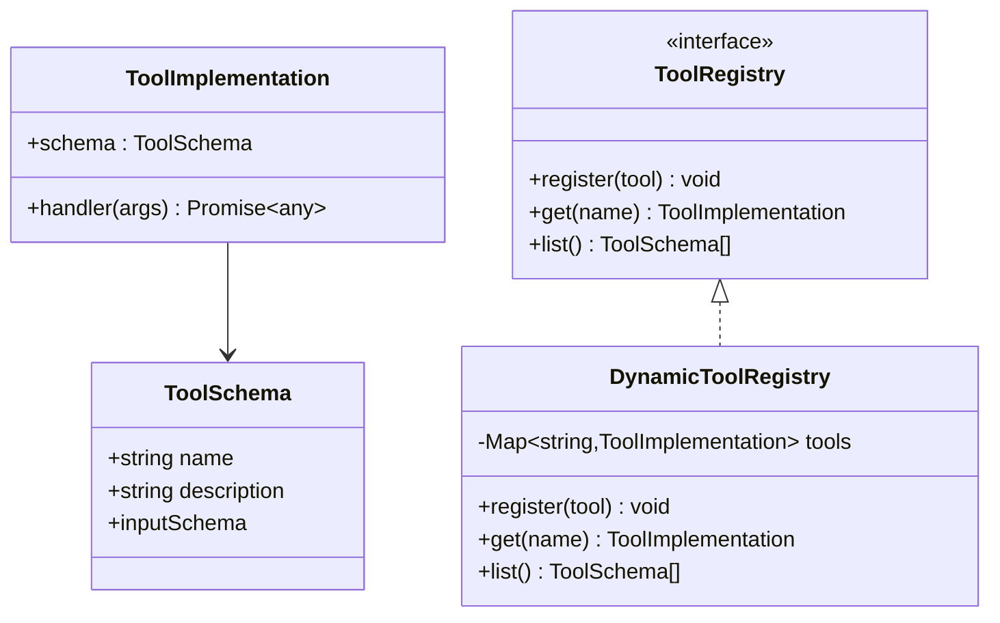
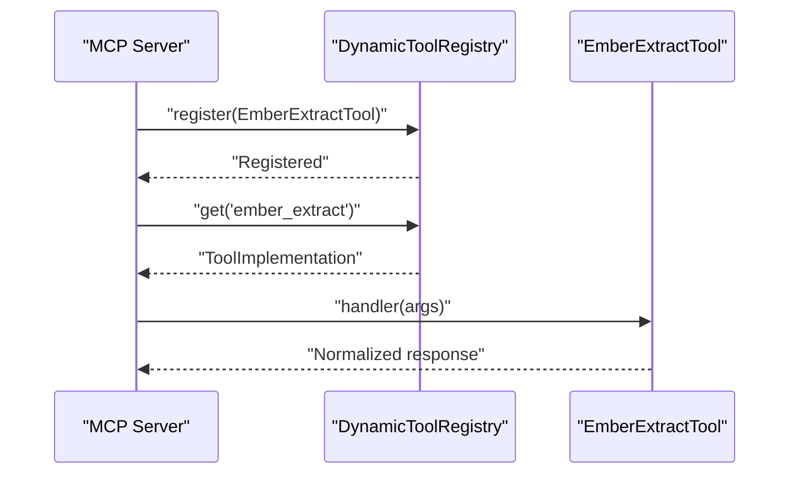
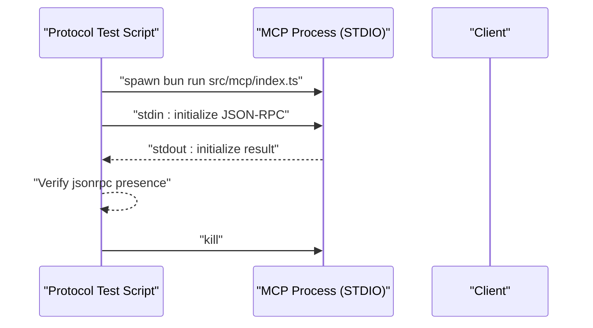
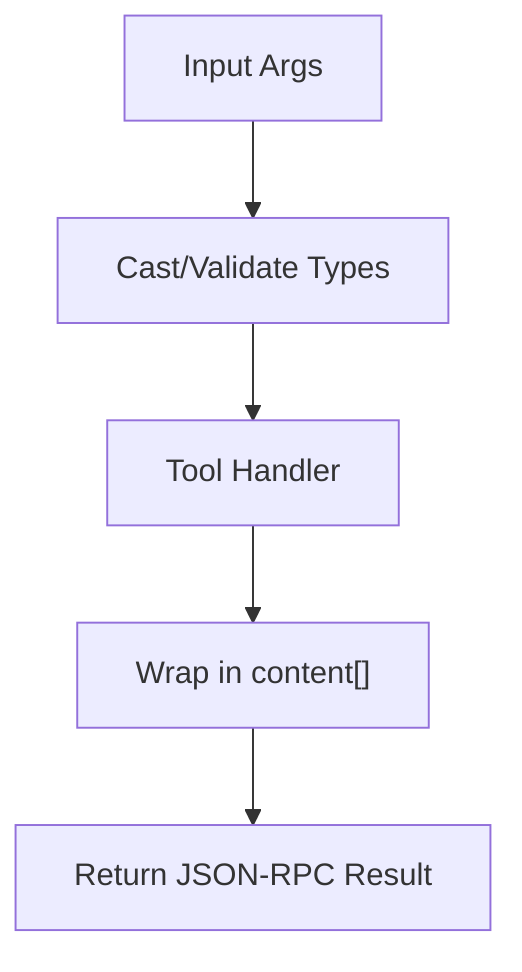
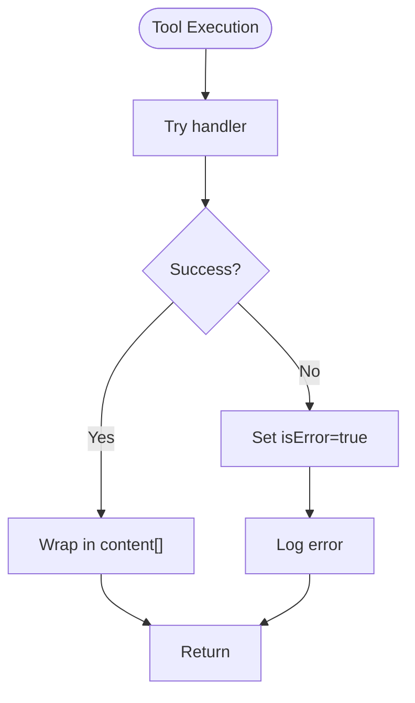
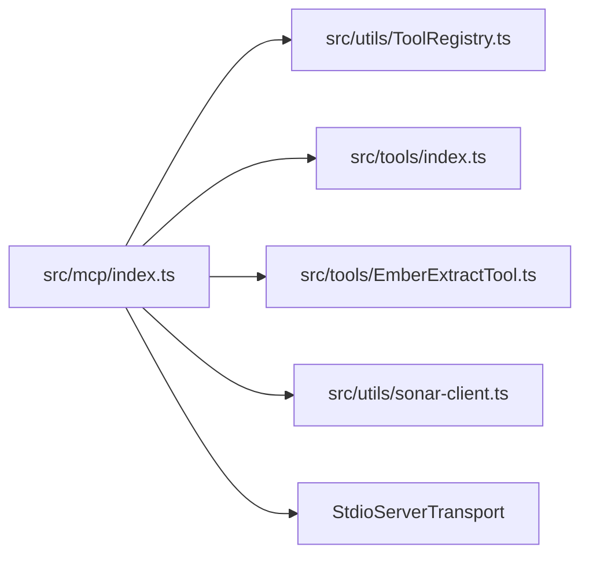

# Communication Protocols

<cite>
**Referenced Files in This Document**
- [src/mcp/index.ts](file://src/mcp/index.ts)
- [src/mcp/README.md](file://src/mcp/README.md)
- [src/utils/ToolRegistry.ts](file://src/utils/ToolRegistry.ts)
- [src/tools/index.ts](file://src/tools/index.ts)
- [src/tools/EmberExtractTool.ts](file://src/tools/EmberExtractTool.ts)
- [src/types/tools.ts](file://src/types/tools.ts)
- [src/utils/sonar-client.ts](file://src/utils/sonar-client.ts)
- [scripts/verify/debug_mcp_protocol.ts](file://scripts/verify/debug_mcp_protocol.ts)
- [scripts/verify/test_mcp_lifecycle.ts](file://scripts/verify/test_mcp_lifecycle.ts)
- [tests/mcp-server-settings.json](file://tests/mcp-server-settings.json)
- [docs/MCP-TOOLS.md](file://docs/MCP-TOOLS.md)
</cite>

## Table of Contents
1. [Introduction](#introduction)
2. [Project Structure](#project-structure)
3. [Core Components](#core-components)
4. [Architecture Overview](#architecture-overview)
5. [Detailed Component Analysis](#detailed-component-analysis)
6. [Dependency Analysis](#dependency-analysis)
7. [Performance Considerations](#performance-considerations)
8. [Troubleshooting Guide](#troubleshooting-guide)
9. [Conclusion](#conclusion)
10. [Appendices](#appendices)

## Introduction
This document explains the communication protocols used by Amalfa’s component interaction system with a focus on the Model Context Protocol (MCP) implementation. It covers request/response schemas, transport mechanisms, message formatting, the dynamic tool registry, STDIO transport for MCP server communication, standardized tool interfaces, parameter validation, response normalization, examples of protocol messages, error handling strategies, debugging techniques, and considerations for protocol versioning, backward compatibility, and migration paths.

## Project Structure
The MCP server implementation resides under the MCP module and integrates with the tool registry, dynamic tool handlers, and supporting utilities. The key files include the MCP entry point, tool registry, tool definitions, and protocol verification scripts.

**Diagram sources**
- [src/mcp/index.ts](file://src/mcp/index.ts#L1-L748)
- [src/mcp/README.md](file://src/mcp/README.md#L1-L15)
- [src/utils/ToolRegistry.ts](file://src/utils/ToolRegistry.ts#L1-L30)
- [src/tools/index.ts](file://src/tools/index.ts#L1-L7)
- [src/tools/EmberExtractTool.ts](file://src/tools/EmberExtractTool.ts#L1-L140)
- [src/types/tools.ts](file://src/types/tools.ts#L1-L21)
- [src/utils/sonar-client.ts](file://src/utils/sonar-client.ts#L1-L309)
- [scripts/verify/debug_mcp_protocol.ts](file://scripts/verify/debug_mcp_protocol.ts#L1-L47)
- [scripts/verify/test_mcp_lifecycle.ts](file://scripts/verify/test_mcp_lifecycle.ts#L1-L79)
- [tests/mcp-server-settings.json](file://tests/mcp-server-settings.json#L1-L9)

**Section sources**
- [src/mcp/index.ts](file://src/mcp/index.ts#L1-L748)
- [src/mcp/README.md](file://src/mcp/README.md#L1-L15)

## Core Components
- MCP Server: Implements the Model Context Protocol using the SDK server with STDIO transport, exposing tools and resources.
- Tool Registry: Provides a dynamic registry for tools with standardized schemas and handlers.
- Tool Implementations: Define tool schemas and handlers; dynamic tools are registered at server startup.
- Sonar Client: Optional integration for advanced search features (query analysis, reranking, context extraction).
- Protocol Verification Scripts: Validate STDIO transport handshakes and lifecycle stability.

Key responsibilities:
- Request routing to either dynamic tools or built-in handlers.
- Resource exposure for system statistics.
- Per-request database connections and service lifecycles.
- Logging, error handling, and crash logging.

**Section sources**
- [src/mcp/index.ts](file://src/mcp/index.ts#L146-L250)
- [src/utils/ToolRegistry.ts](file://src/utils/ToolRegistry.ts#L8-L30)
- [src/tools/index.ts](file://src/tools/index.ts#L4-L6)
- [src/tools/EmberExtractTool.ts](file://src/tools/EmberExtractTool.ts#L12-L33)
- [src/utils/sonar-client.ts](file://src/utils/sonar-client.ts#L54-L270)

## Architecture Overview
The MCP server initializes services, registers tools (both built-in and dynamic), sets up STDIO transport, and handles requests according to the MCP specification. Requests are routed to either the dynamic tool registry or built-in handlers. Responses are normalized to a standard content structure.

**Diagram sources**
- [src/mcp/index.ts](file://src/mcp/index.ts#L164-L250)
- [src/utils/ToolRegistry.ts](file://src/utils/ToolRegistry.ts#L20-L26)
- [src/utils/sonar-client.ts](file://src/utils/sonar-client.ts#L118-L203)

## Detailed Component Analysis

### Model Context Protocol (MCP) Implementation
- Protocol Versioning: Clients send initialize with protocolVersion "2024-11-05".
- Transport: STDIO transport is used for per-request connections.
- Request Handlers:
  - ListToolsRequestSchema: Returns combined schemas from dynamic registry and built-in tools.
  - CallToolRequestSchema: Routes to dynamic tool or built-in handler; normalizes responses to a standard content array.
  - ListResourcesRequestSchema and ReadResourceRequestSchema: Expose a system stats resource.
- Message Formatting: JSON-RPC 2.0 over STDIO; responses include content arrays with standardized types.

**Diagram sources**
- [src/mcp/index.ts](file://src/mcp/index.ts#L147-L250)
- [src/mcp/index.ts](file://src/mcp/index.ts#L690-L722)

**Section sources**
- [src/mcp/index.ts](file://src/mcp/index.ts#L147-L250)
- [src/mcp/index.ts](file://src/mcp/index.ts#L690-L722)
- [scripts/verify/test_mcp_lifecycle.ts](file://scripts/verify/test_mcp_lifecycle.ts#L48-L72)
- [scripts/verify/debug_mcp_protocol.ts](file://scripts/verify/debug_mcp_protocol.ts#L29-L45)

### Tool Registry System
- Purpose: Centralized registration and lookup of dynamic tools.
- Schema: ToolSchema defines name, description, and inputSchema; ToolImplementation adds handler.
- Operations:
  - register(tool): Overwrites existing tool with warning.
  - get(name): Retrieves tool by name.
  - list(): Returns schemas for all registered tools.

**Diagram sources**
- [src/types/tools.ts](file://src/types/tools.ts#L1-L21)
- [src/utils/ToolRegistry.ts](file://src/utils/ToolRegistry.ts#L8-L30)

**Section sources**
- [src/utils/ToolRegistry.ts](file://src/utils/ToolRegistry.ts#L8-L30)
- [src/types/tools.ts](file://src/types/tools.ts#L1-L21)

### Dynamic Tools Registration and Invocation
- Registration: registerAllTools() registers EmberExtractTool into the registry.
- Discovery: ListToolsRequestSchema returns both built-in and dynamic tool schemas.
- Invocation: CallToolRequestSchema first checks the registry; if not found, routes to built-in handlers.

**Diagram sources**
- [src/tools/index.ts](file://src/tools/index.ts#L4-L6)
- [src/tools/EmberExtractTool.ts](file://src/tools/EmberExtractTool.ts#L12-L33)
- [src/utils/ToolRegistry.ts](file://src/utils/ToolRegistry.ts#L20-L26)

**Section sources**
- [src/tools/index.ts](file://src/tools/index.ts#L4-L6)
- [src/tools/EmberExtractTool.ts](file://src/tools/EmberExtractTool.ts#L12-L33)
- [src/utils/ToolRegistry.ts](file://src/utils/ToolRegistry.ts#L20-L26)

### STDIO Transport Protocol
- Transport: StdioServerTransport connects the server to clients via STDIO.
- Handshake: Clients send initialize with protocolVersion "2024-11-05"; server responds with JSON-RPC result.
- Lifecycle: Scripts verify process stays alive and responds to handshake.

**Diagram sources**
- [scripts/verify/debug_mcp_protocol.ts](file://scripts/verify/debug_mcp_protocol.ts#L6-L45)
- [scripts/verify/test_mcp_lifecycle.ts](file://scripts/verify/test_mcp_lifecycle.ts#L9-L76)
- [src/mcp/index.ts](file://src/mcp/index.ts#L720-L722)

**Section sources**
- [src/mcp/index.ts](file://src/mcp/index.ts#L720-L722)
- [scripts/verify/debug_mcp_protocol.ts](file://scripts/verify/debug_mcp_protocol.ts#L6-L45)
- [scripts/verify/test_mcp_lifecycle.ts](file://scripts/verify/test_mcp_lifecycle.ts#L9-L76)

### Standardized Tool Interfaces, Parameter Validation, and Response Normalization
- Tool Schema: Enforces name, description, and inputSchema with properties and required fields.
- Parameter Validation: Built-in handlers cast and validate inputs (e.g., query to string, limit to number).
- Response Normalization: All tool responses include a content array with standardized types; error responses set isError flag.

**Diagram sources**
- [src/types/tools.ts](file://src/types/tools.ts#L1-L21)
- [src/mcp/index.ts](file://src/mcp/index.ts#L252-L688)

**Section sources**
- [src/types/tools.ts](file://src/types/tools.ts#L1-L21)
- [src/mcp/index.ts](file://src/mcp/index.ts#L252-L688)

### Example Protocol Messages
- Initialize Request: Sent by clients with protocolVersion "2024-11-05".
- ListTools Response: Returns combined tool schemas.
- CallTool Request/Response: Tool invocation with normalized content array.
- Resource Listing/Reading: ListResources and ReadResource for system stats.

References:
- [Initialize handshake and STDIO behavior](file://scripts/verify/debug_mcp_protocol.ts#L29-L45)
- [ListTools and CallTool handlers](file://src/mcp/index.ts#L164-L250)
- [Resource handlers](file://src/mcp/index.ts#L690-L717)

**Section sources**
- [scripts/verify/debug_mcp_protocol.ts](file://scripts/verify/debug_mcp_protocol.ts#L29-L45)
- [src/mcp/index.ts](file://src/mcp/index.ts#L164-L250)
- [src/mcp/index.ts](file://src/mcp/index.ts#L690-L717)

### Error Handling Strategies
- Built-in Error Responses: Tools return content with isError flag and error text.
- Global Crash Handling: Uncaught exceptions and unhandled rejections are logged and written to a crash log.
- Graceful Degradation: Optional Sonar features fall back when unavailable.

**Diagram sources**
- [src/mcp/index.ts](file://src/mcp/index.ts#L680-L687)
- [src/mcp/index.ts](file://src/mcp/index.ts#L727-L743)

**Section sources**
- [src/mcp/index.ts](file://src/mcp/index.ts#L680-L687)
- [src/mcp/index.ts](file://src/mcp/index.ts#L727-L743)

### Debugging Techniques
- Protocol Debug Script: Spawns MCP server and verifies JSON-RPC handshake on STDOUT.
- Lifecycle Test: Ensures process remains alive and responds to initialize.
- Configuration: Example mcpServers configuration for clients.

**Section sources**
- [scripts/verify/debug_mcp_protocol.ts](file://scripts/verify/debug_mcp_protocol.ts#L3-L47)
- [scripts/verify/test_mcp_lifecycle.ts](file://scripts/verify/test_mcp_lifecycle.ts#L6-L79)
- [tests/mcp-server-settings.json](file://tests/mcp-server-settings.json#L1-L9)

## Dependency Analysis
The MCP server depends on:
- Tool registry for dynamic tool discovery and invocation.
- Tool implementations for handler logic.
- Sonar client for optional advanced search features.
- STDIO transport for client communication.

**Diagram sources**
- [src/mcp/index.ts](file://src/mcp/index.ts#L1-L30)
- [src/utils/ToolRegistry.ts](file://src/utils/ToolRegistry.ts#L1-L30)
- [src/tools/index.ts](file://src/tools/index.ts#L1-L7)
- [src/tools/EmberExtractTool.ts](file://src/tools/EmberExtractTool.ts#L1-L140)
- [src/utils/sonar-client.ts](file://src/utils/sonar-client.ts#L1-L309)

**Section sources**
- [src/mcp/index.ts](file://src/mcp/index.ts#L1-L30)
- [src/utils/ToolRegistry.ts](file://src/utils/ToolRegistry.ts#L1-L30)
- [src/tools/index.ts](file://src/tools/index.ts#L1-L7)
- [src/tools/EmberExtractTool.ts](file://src/tools/EmberExtractTool.ts#L1-L140)
- [src/utils/sonar-client.ts](file://src/utils/sonar-client.ts#L1-L309)

## Performance Considerations
- Retrieval Pipeline: Vector search (bi-encoder) followed by cross-encoder reranking; optional Sonar LLM refinement.
- Parallelism: Vector and grep engines run concurrently for improved latency.
- Caching: Scratchpad caches large outputs to reduce repeated computation.
- Optional Features: Sonar availability is cached to minimize health checks.

**Section sources**
- [src/mcp/index.ts](file://src/mcp/index.ts#L312-L476)
- [src/utils/sonar-client.ts](file://src/utils/sonar-client.ts#L11-L14)

## Troubleshooting Guide
Common issues and resolutions:
- Node not found: Verify node ID from recent search results.
- Scratchpad entry not found: Use scratchpad_list() to find valid entries.
- Search errors: Check database connectivity or run initialization commands.
- Sonar unavailability: Confirm daemon health and configuration.

**Section sources**
- [docs/MCP-TOOLS.md](file://docs/MCP-TOOLS.md#L661-L688)

## Conclusion
Amalfa’s MCP implementation provides a robust, extensible framework for agent-server communication. The combination of standardized tool interfaces, dynamic tool registration, and STDIO transport enables seamless integration with external agents. Optional Sonar features enhance search quality while maintaining graceful fallbacks. The provided verification scripts and configuration examples facilitate reliable deployment and debugging.

## Appendices

### Protocol Versioning and Backward Compatibility
- Protocol Version: Clients specify protocolVersion "2024-11-05".
- Migration Paths: New tools can be added via the dynamic registry without changing built-in handlers; schema changes should be backward-compatible or versioned in tool names/descriptions.

**Section sources**
- [scripts/verify/test_mcp_lifecycle.ts](file://scripts/verify/test_mcp_lifecycle.ts#L53-L56)
- [src/mcp/index.ts](file://src/mcp/index.ts#L147-L150)

### Tool Catalog and Usage References
- Comprehensive tool reference and workflows are documented in the MCP tools guide.

**Section sources**
- [docs/MCP-TOOLS.md](file://docs/MCP-TOOLS.md#L1-L715)