# Component Interactions

<cite>
**Referenced Files in This Document**
- [src/mcp/index.ts](file://src/mcp/index.ts)
- [src/cli.ts](file://src/cli.ts)
- [src/daemon/index.ts](file://src/daemon/index.ts)
- [src/utils/ToolRegistry.ts](file://src/utils/ToolRegistry.ts)
- [src/tools/index.ts](file://src/tools/index.ts)
- [src/tools/EmberExtractTool.ts](file://src/tools/EmberExtractTool.ts)
- [src/utils/DaemonManager.ts](file://src/utils/DaemonManager.ts)
- [src/utils/ServiceLifecycle.ts](file://src/utils/ServiceLifecycle.ts)
- [src/resonance/services/vector-daemon.ts](file://src/resonance/services/vector-daemon.ts)
- [src/daemon/sonar-agent.ts](file://src/daemon/sonar-agent.ts)
- [api/server.ts](file://api/server.ts)
- [src/config/defaults.ts](file://src/config/defaults.ts)
- [scripts/verify/test_mcp_lifecycle.ts](file://scripts/verify/test_mcp_lifecycle.ts)
- [scripts/ensure-mcp.sh](file://scripts/ensure-mcp.sh)
- [src/components/archive/cloud-events-01.md](file://src/components/archive/cloud-events-01.md)
</cite>

## Table of Contents
1. [Introduction](#introduction)
2. [Project Structure](#project-structure)
3. [Core Components](#core-components)
4. [Architecture Overview](#architecture-overview)
5. [Detailed Component Analysis](#detailed-component-analysis)
6. [Dependency Analysis](#dependency-analysis)
7. [Performance Considerations](#performance-considerations)
8. [Troubleshooting Guide](#troubleshooting-guide)
9. [Conclusion](#conclusion)
10. [Appendices](#appendices)

## Introduction
This document explains how Amalfa’s CLI, MCP server, and background services coordinate to deliver a cohesive knowledge management and agent integration platform. It covers the tool registry system, MCP tool registration and invocation, the API gateway and SSE streaming, event-driven file watching and change propagation, message passing protocols, data serialization formats, inter-component communication channels, agent integration patterns, and security/access control considerations. Concrete examples illustrate typical workflows such as document ingestion and search operations.

## Project Structure
Amalfa organizes functionality by responsibility:
- CLI entrypoint and commands orchestrate services and operations.
- MCP server exposes tools and resources over stdio using the Model Context Protocol.
- Background daemons provide persistent services (file watching, vector generation, reranking, Sonar agent).
- Utilities encapsulate lifecycle management, tool registries, and configuration.
- An API server provides SSE endpoints for observability and optional UI integration.

```mermaid
graph TB
subgraph "CLI"
CLI["src/cli.ts"]
end
subgraph "MCP Server"
MCP["src/mcp/index.ts"]
REG["src/utils/ToolRegistry.ts"]
TOOLS_IDX["src/tools/index.ts"]
TOOL_EMBER["src/tools/EmberExtractTool.ts"]
end
subgraph "Background Daemons"
DAEMON["src/daemon/index.ts"]
VECDAEM["src/resonance/services/vector-daemon.ts"]
SONAR["src/daemon/sonar-agent.ts"]
DM["src/utils/DaemonManager.ts"]
SL["src/utils/ServiceLifecycle.ts"]
end
subgraph "API Gateway"
API["api/server.ts"]
end
subgraph "Config"
CFG["src/config/defaults.ts"]
end
CLI --> MCP
MCP --> REG
MCP --> TOOLS_IDX
TOOLS_IDX --> TOOL_EMBER
MCP --> DAEMON
MCP --> VECDAEM
MCP --> SONAR
DAEMON --> CFG
MCP --> CFG
VECDAEM --> CFG
SONAR --> CFG
API --> CFG
DM --> SL
DM --> DAEMON
DM --> VECDAEM
DM --> SONAR
```

**Diagram sources**
- [src/cli.ts](file://src/cli.ts#L1-L274)
- [src/mcp/index.ts](file://src/mcp/index.ts#L1-L748)
- [src/utils/ToolRegistry.ts](file://src/utils/ToolRegistry.ts#L1-L30)
- [src/tools/index.ts](file://src/tools/index.ts#L1-L7)
- [src/tools/EmberExtractTool.ts](file://src/tools/EmberExtractTool.ts#L1-L140)
- [src/daemon/index.ts](file://src/daemon/index.ts#L1-L293)
- [src/resonance/services/vector-daemon.ts](file://src/resonance/services/vector-daemon.ts#L1-L234)
- [src/daemon/sonar-agent.ts](file://src/daemon/sonar-agent.ts#L1-L221)
- [src/utils/DaemonManager.ts](file://src/utils/DaemonManager.ts#L1-L260)
- [src/utils/ServiceLifecycle.ts](file://src/utils/ServiceLifecycle.ts#L1-L209)
- [api/server.ts](file://api/server.ts#L1-L248)
- [src/config/defaults.ts](file://src/config/defaults.ts#L1-L143)

**Section sources**
- [src/cli.ts](file://src/cli.ts#L1-L274)
- [src/mcp/index.ts](file://src/mcp/index.ts#L1-L748)
- [src/daemon/index.ts](file://src/daemon/index.ts#L1-L293)
- [src/resonance/services/vector-daemon.ts](file://src/resonance/services/vector-daemon.ts#L1-L234)
- [src/daemon/sonar-agent.ts](file://src/daemon/sonar-agent.ts#L1-L221)
- [api/server.ts](file://api/server.ts#L1-L248)
- [src/config/defaults.ts](file://src/config/defaults.ts#L1-L143)

## Core Components
- CLI: Central command dispatcher that starts services, manages tools, and orchestrates operations.
- MCP Server: Exposes tools and resources over stdio using the Model Context Protocol; integrates with graph engines, vector engine, and optional Sonar agent.
- Background Daemons: File watcher for incremental ingestion, vector daemon for fast embeddings, Sonar agent for autonomous tasks.
- Tool Registry: Dynamic registry enabling MCP tools to be registered at runtime.
- API Gateway: SSE endpoint for real-time updates and JSON/HTML fragments for observability.
- Configuration: Centralized settings loader and directory initialization.

**Section sources**
- [src/cli.ts](file://src/cli.ts#L132-L268)
- [src/mcp/index.ts](file://src/mcp/index.ts#L62-L723)
- [src/utils/ToolRegistry.ts](file://src/utils/ToolRegistry.ts#L8-L29)
- [src/tools/index.ts](file://src/tools/index.ts#L4-L6)
- [api/server.ts](file://api/server.ts#L127-L247)
- [src/config/defaults.ts](file://src/config/defaults.ts#L84-L139)

## Architecture Overview
Amalfa follows a layered architecture:
- Presentation: CLI and MCP server expose commands and tools.
- Control: Service lifecycle manager starts/stops daemons; MCP initializes services per request.
- Processing: Graph engines, vector engine, and Sonar agent perform search, enrichment, and reasoning.
- Persistence: SQLite-backed ResonanceDB stores nodes, edges, and vectors.
- Observability: SSE endpoints stream stats and service status; file watcher triggers incremental updates.

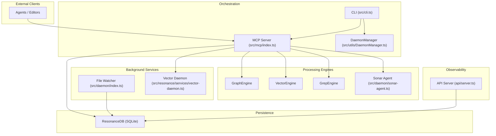

**Diagram sources**
- [src/cli.ts](file://src/cli.ts#L132-L268)
- [src/mcp/index.ts](file://src/mcp/index.ts#L62-L723)
- [src/utils/DaemonManager.ts](file://src/utils/DaemonManager.ts#L17-L51)
- [src/daemon/index.ts](file://src/daemon/index.ts#L52-L95)
- [src/resonance/services/vector-daemon.ts](file://src/resonance/services/vector-daemon.ts#L72-L230)
- [src/daemon/sonar-agent.ts](file://src/daemon/sonar-agent.ts#L60-L133)
- [api/server.ts](file://api/server.ts#L127-L247)

## Detailed Component Analysis

### CLI Command Dispatcher
- Parses arguments and dispatches to command modules.
- Provides commands to start/stop services, manage MCP, and run ingestion/enrichment tasks.
- Ensures project root context and delegates to service lifecycle manager for daemon control.

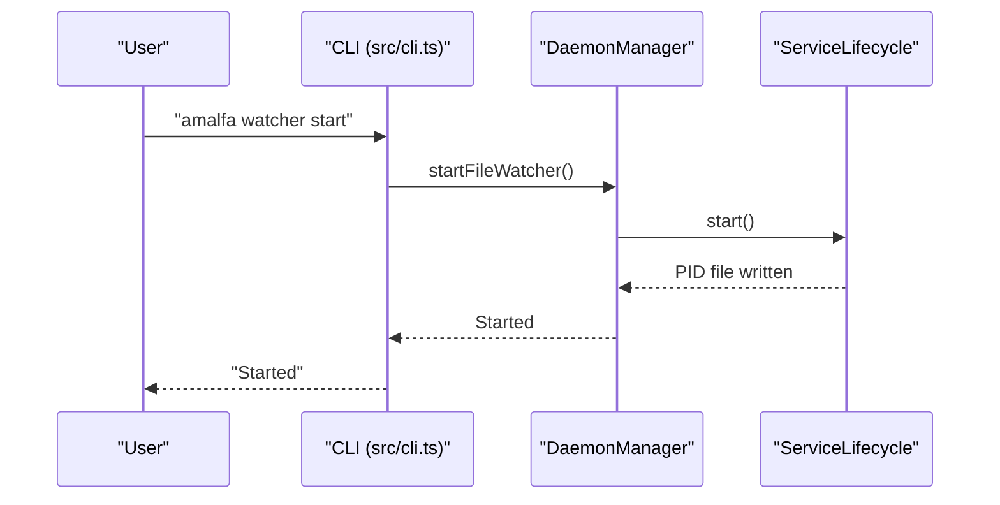

**Diagram sources**
- [src/cli.ts](file://src/cli.ts#L182-L184)
- [src/utils/DaemonManager.ts](file://src/utils/DaemonManager.ts#L170-L174)
- [src/utils/ServiceLifecycle.ts](file://src/utils/ServiceLifecycle.ts#L27-L67)

**Section sources**
- [src/cli.ts](file://src/cli.ts#L132-L268)
- [src/utils/DaemonManager.ts](file://src/utils/DaemonManager.ts#L170-L174)
- [src/utils/ServiceLifecycle.ts](file://src/utils/ServiceLifecycle.ts#L27-L67)

### MCP Server: Tool Discovery and Invocation
- Initializes ResonanceDB, vector and grep engines, and optional file watcher and vector daemon.
- Registers legacy tools and dynamic tools from the registry.
- Implements tool handlers for search, read, explore, list, gaps, scratchpad operations, and resource listing.
- Uses stdio transport and JSON-RPC-like messages for tool discovery and invocation.

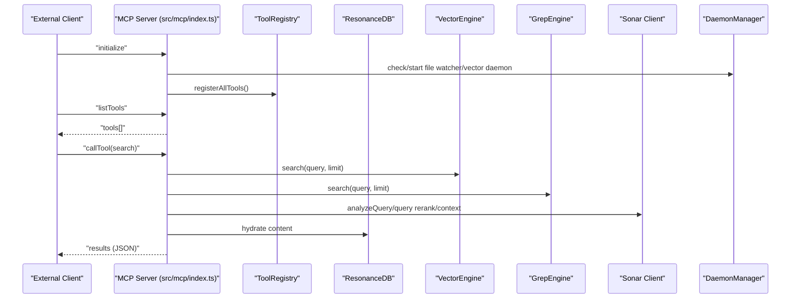

**Diagram sources**
- [src/mcp/index.ts](file://src/mcp/index.ts#L62-L723)
- [src/utils/ToolRegistry.ts](file://src/utils/ToolRegistry.ts#L8-L29)
- [src/tools/index.ts](file://src/tools/index.ts#L4-L6)
- [src/utils/DaemonManager.ts](file://src/utils/DaemonManager.ts#L94-L107)

**Section sources**
- [src/mcp/index.ts](file://src/mcp/index.ts#L146-L250)
- [src/mcp/index.ts](file://src/mcp/index.ts#L252-L688)
- [scripts/verify/test_mcp_lifecycle.ts](file://scripts/verify/test_mcp_lifecycle.ts#L6-L79)
- [scripts/ensure-mcp.sh](file://scripts/ensure-mcp.sh#L1-L10)

### Tool Registry System
- Dynamic registry maintains tool schemas and handlers.
- Tools are registered at server startup; lookup prioritizes dynamic tools first, then falls back to built-in tools.
- Enables extension of MCP capabilities without modifying server code.

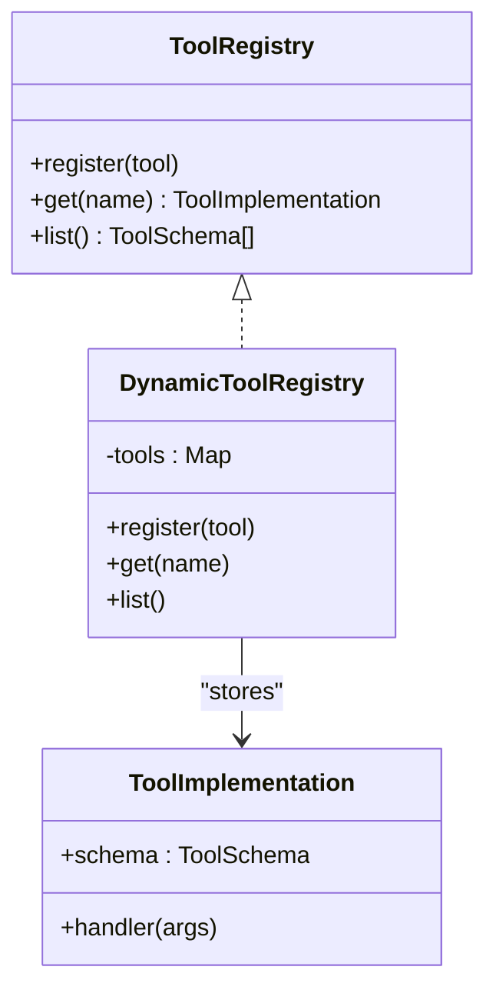

**Diagram sources**
- [src/utils/ToolRegistry.ts](file://src/utils/ToolRegistry.ts#L8-L29)
- [src/types/tools.ts](file://src/types/tools.ts#L1-L20)

**Section sources**
- [src/utils/ToolRegistry.ts](file://src/utils/ToolRegistry.ts#L8-L29)
- [src/tools/index.ts](file://src/tools/index.ts#L4-L6)
- [src/tools/EmberExtractTool.ts](file://src/tools/EmberExtractTool.ts#L12-L33)

### Background Services: File Watcher and Vector Daemon
- File Watcher: Recursively watches configured source directories, debounces changes, performs targeted ingestion, optionally invokes Ember enrichment, and retries transient failures.
- Vector Daemon: HTTP service exposing /embed and /rerank endpoints; keeps embedding model loaded for low-latency responses.

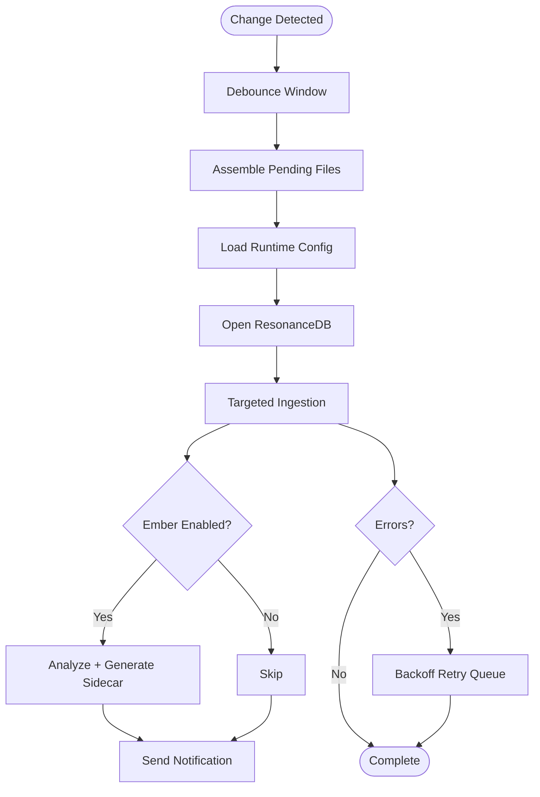

**Diagram sources**
- [src/daemon/index.ts](file://src/daemon/index.ts#L132-L289)

**Section sources**
- [src/daemon/index.ts](file://src/daemon/index.ts#L52-L95)
- [src/daemon/index.ts](file://src/daemon/index.ts#L132-L289)
- [src/resonance/services/vector-daemon.ts](file://src/resonance/services/vector-daemon.ts#L72-L230)

### API Gateway and SSE Streaming
- Provides SSE endpoint for real-time stats, service status, and runs log.
- Includes JSON endpoints and HTMX-style fragment endpoints for partial updates.
- Useful for dashboards and monitoring integrations.

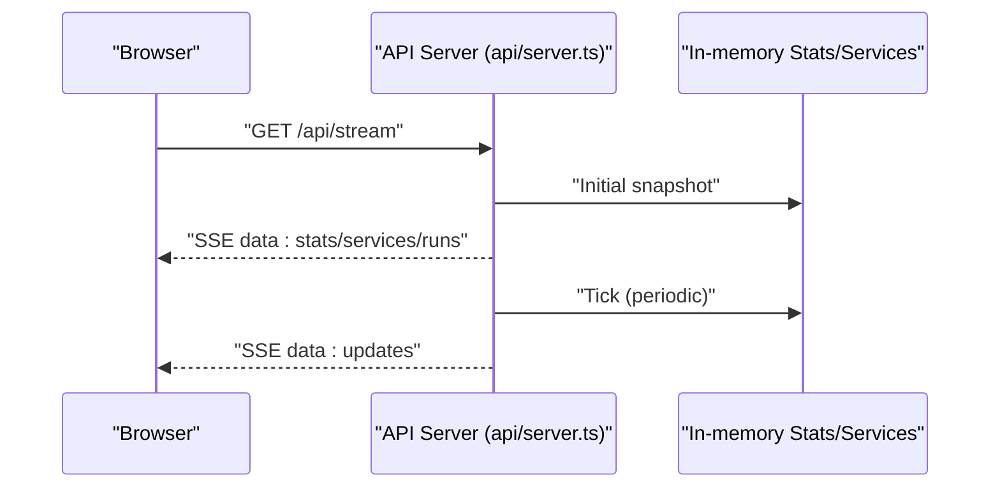

**Diagram sources**
- [api/server.ts](file://api/server.ts#L131-L178)
- [api/server.ts](file://api/server.ts#L181-L247)

**Section sources**
- [api/server.ts](file://api/server.ts#L127-L247)

### Event-Driven Architecture: File Watching and Change Propagation
- File watcher emits events for .md files; change propagation is handled by the daemon.
- Optional CloudEvents envelope pattern demonstrates standardized telemetry envelopes for change signals.

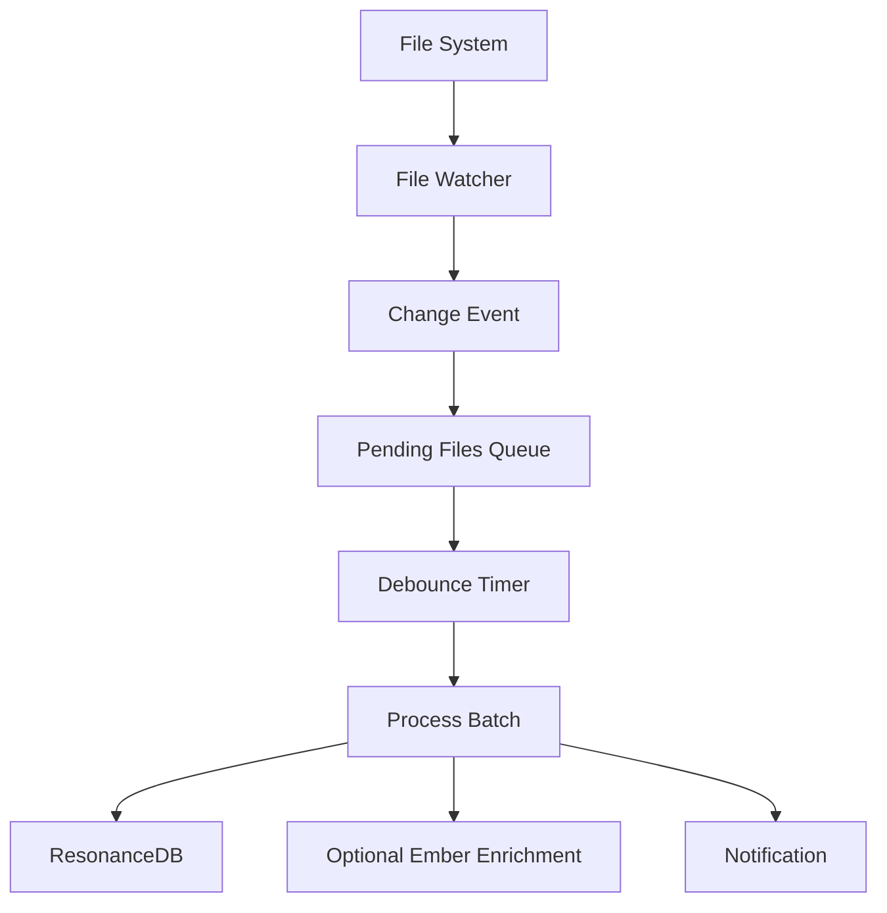

**Diagram sources**
- [src/daemon/index.ts](file://src/daemon/index.ts#L106-L127)
- [src/daemon/index.ts](file://src/daemon/index.ts#L132-L289)
- [src/components/archive/cloud-events-01.md](file://src/components/archive/cloud-events-01.md#L17-L40)

**Section sources**
- [src/daemon/index.ts](file://src/daemon/index.ts#L106-L127)
- [src/components/archive/cloud-events-01.md](file://src/components/archive/cloud-events-01.md#L1-L45)

### Message Passing Protocols and Serialization
- MCP uses stdio transport with JSON-like request/response messages for tool discovery and invocation.
- Vector daemon uses HTTP JSON APIs for embedding and reranking.
- SSE uses newline-delimited “data: ” frames for streaming updates.

**Section sources**
- [src/mcp/index.ts](file://src/mcp/index.ts#L720-L721)
- [src/resonance/services/vector-daemon.ts](file://src/resonance/services/vector-daemon.ts#L79-L224)
- [api/server.ts](file://api/server.ts#L135-L169)

### Agent Integration Patterns
- Sonar Agent runs as a separate daemon with HTTP API, processes tasks from filesystem queues, and coordinates with graph engines and vector engines.
- MCP integrates Sonar for query analysis, reranking, and context extraction.

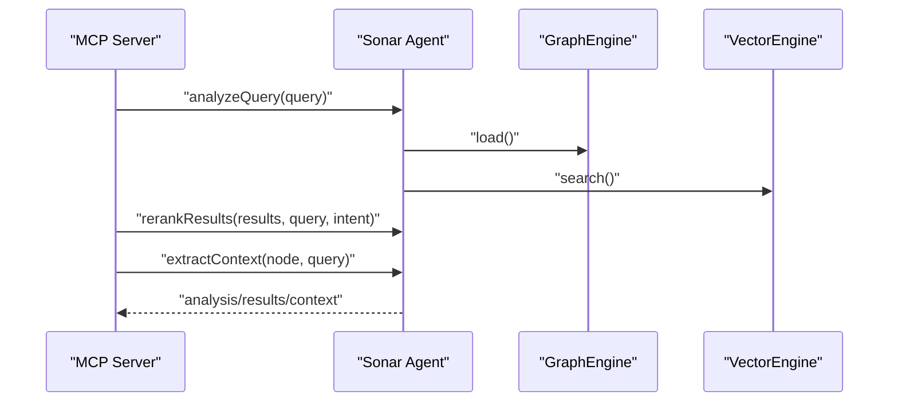

**Diagram sources**
- [src/mcp/index.ts](file://src/mcp/index.ts#L289-L429)
- [src/daemon/sonar-agent.ts](file://src/daemon/sonar-agent.ts#L60-L133)

**Section sources**
- [src/daemon/sonar-agent.ts](file://src/daemon/sonar-agent.ts#L60-L133)
- [src/mcp/index.ts](file://src/mcp/index.ts#L289-L429)

### Security, Authentication, and Access Control
- No explicit authentication or authorization mechanisms are present in the referenced files.
- Recommendations:
  - Restrict MCP server exposure to trusted environments.
  - Use local-only sockets or reverse proxies with authentication for external access.
  - Scope API endpoints to internal consumers and protect sensitive operations behind environment controls.

[No sources needed since this section provides general guidance]

## Dependency Analysis
Inter-component dependencies and coupling:
- MCP depends on ResonanceDB, vector/grep engines, Sonar client, and tool registry.
- CLI delegates to DaemonManager and ServiceLifecycle for daemon control.
- DaemonManager encapsulates lifecycle management for vector, reranker, file watcher, and Sonar.
- API server reads configuration and streams stats; it does not directly manipulate the knowledge graph.

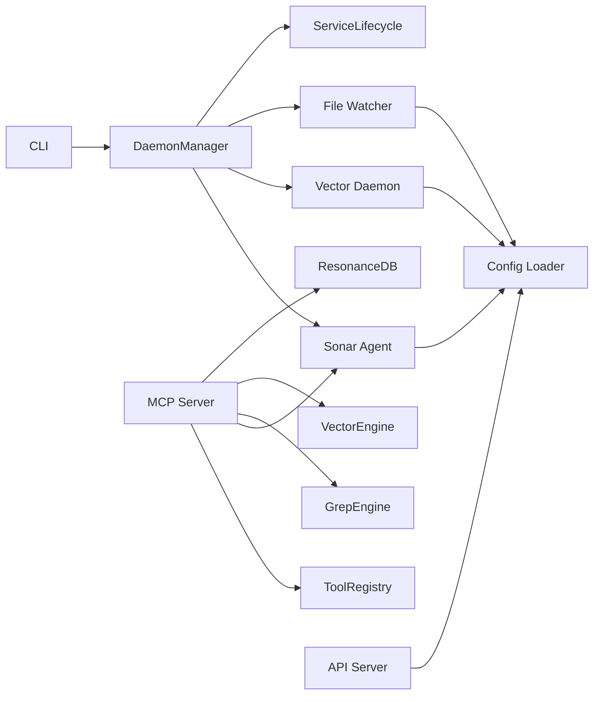

**Diagram sources**
- [src/cli.ts](file://src/cli.ts#L182-L214)
- [src/utils/DaemonManager.ts](file://src/utils/DaemonManager.ts#L17-L51)
- [src/utils/ServiceLifecycle.ts](file://src/utils/ServiceLifecycle.ts#L12-L209)
- [src/mcp/index.ts](file://src/mcp/index.ts#L62-L140)
- [api/server.ts](file://api/server.ts#L127-L178)

**Section sources**
- [src/utils/DaemonManager.ts](file://src/utils/DaemonManager.ts#L17-L51)
- [src/utils/ServiceLifecycle.ts](file://src/utils/ServiceLifecycle.ts#L12-L209)
- [src/mcp/index.ts](file://src/mcp/index.ts#L62-L140)
- [api/server.ts](file://api/server.ts#L127-L178)

## Performance Considerations
- Vector daemon keeps models loaded to minimize cold-start latency for embeddings and reranking.
- MCP parallelizes vector and grep retrieval, followed by cross-encoder reranking and optional LLM reranking.
- File watcher debouncing reduces ingestion frequency and improves throughput.
- Retry queue with exponential backoff prevents system overload during transient failures.

[No sources needed since this section provides general guidance]

## Troubleshooting Guide
- MCP lifecycle verification: automated test spawns MCP, sends initialize handshake, and validates response.
- MCP startup script ensures single instance and logs PID.
- ServiceLifecycle manages PID files, graceful shutdown, and cleanup on crashes.
- Vector daemon health endpoint indicates readiness and model status.

**Section sources**
- [scripts/verify/test_mcp_lifecycle.ts](file://scripts/verify/test_mcp_lifecycle.ts#L6-L79)
- [scripts/ensure-mcp.sh](file://scripts/ensure-mcp.sh#L1-L10)
- [src/utils/ServiceLifecycle.ts](file://src/utils/ServiceLifecycle.ts#L130-L173)
- [src/resonance/services/vector-daemon.ts](file://src/resonance/services/vector-daemon.ts#L82-L95)

## Conclusion
Amalfa integrates a CLI, MCP server, and background daemons around a shared knowledge graph and configuration system. The MCP server dynamically discovers tools, coordinates engines, and optionally leverages Sonar for advanced search and context extraction. The file watcher and vector daemon provide responsive ingestion and retrieval, while the API server offers SSE-based observability. While no explicit authentication is present, operational controls and lifecycle management support secure deployment in trusted environments.

[No sources needed since this section summarizes without analyzing specific files]

## Appendices

### Example Workflows

#### Document Ingestion Workflow
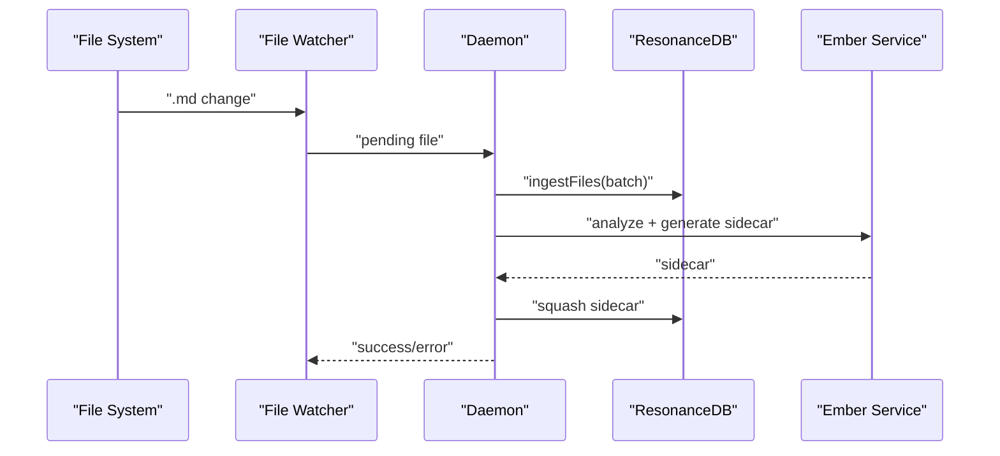

**Diagram sources**
- [src/daemon/index.ts](file://src/daemon/index.ts#L132-L289)

#### Search Operation Workflow
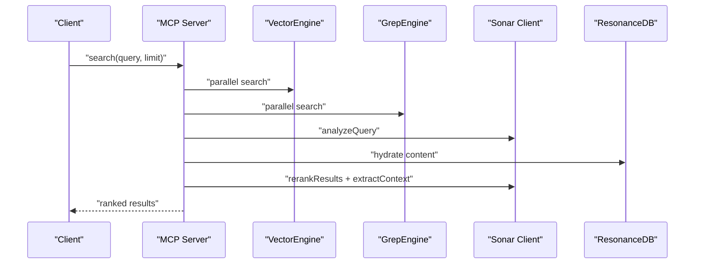

**Diagram sources**
- [src/mcp/index.ts](file://src/mcp/index.ts#L267-L476)