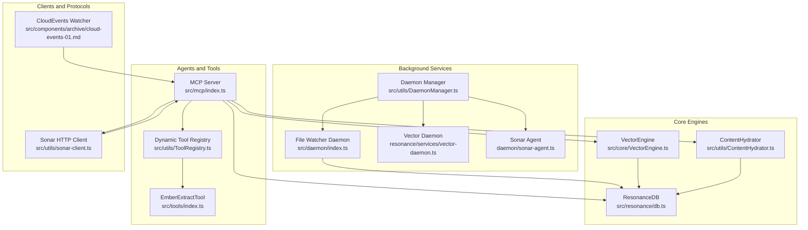
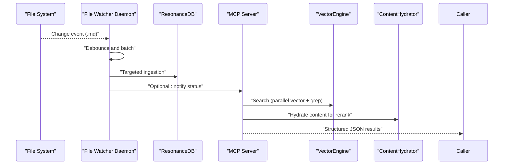
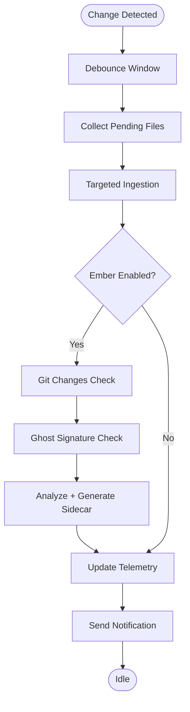
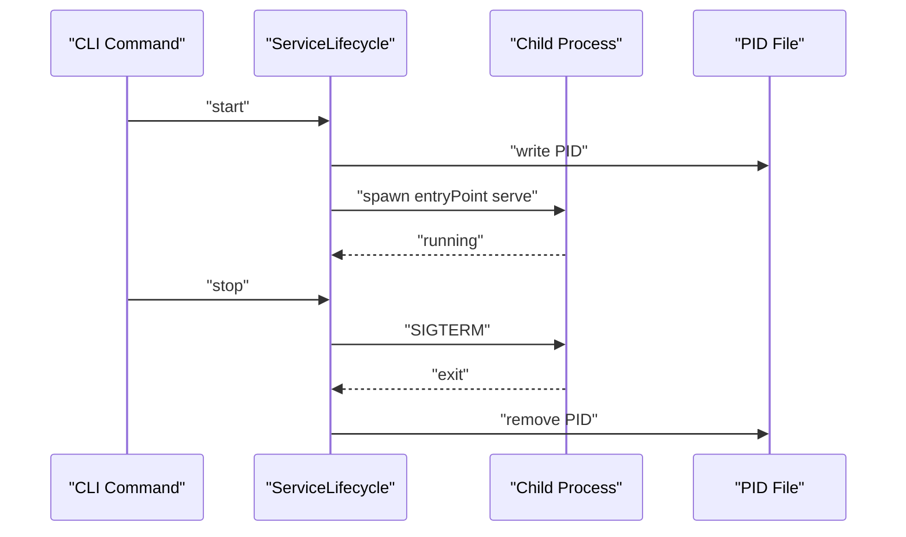
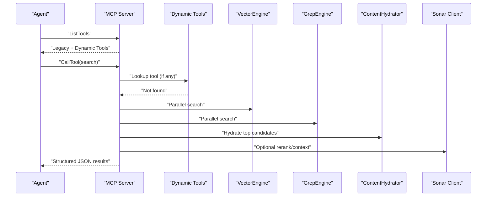
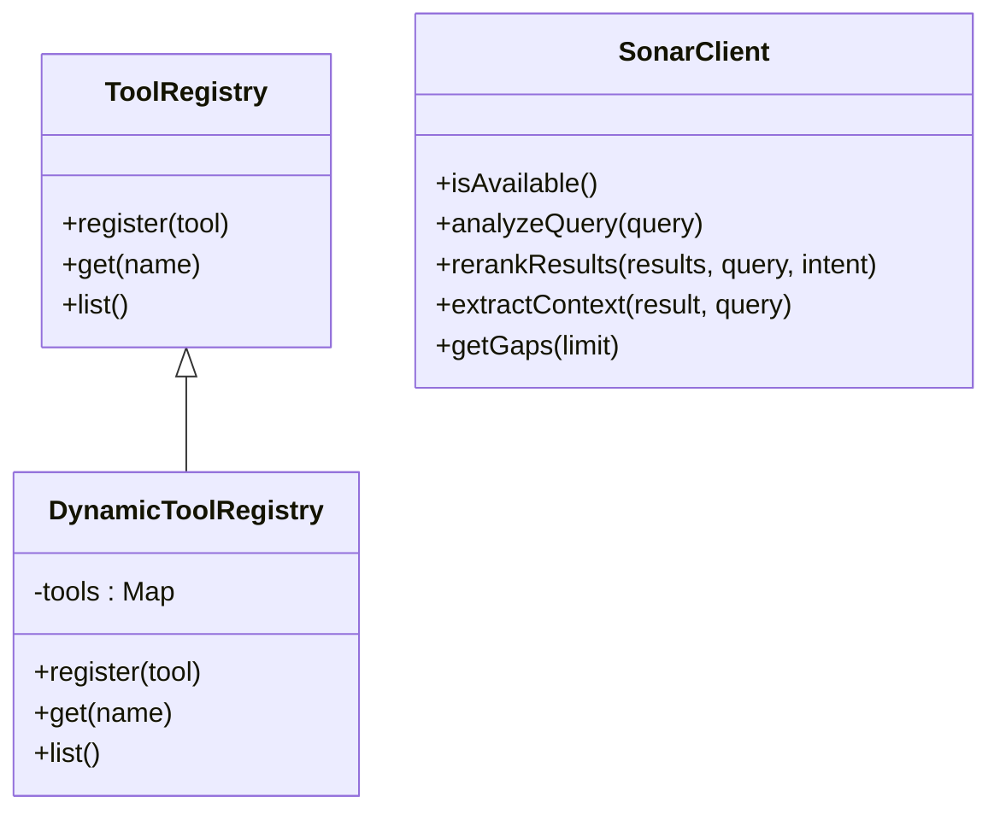
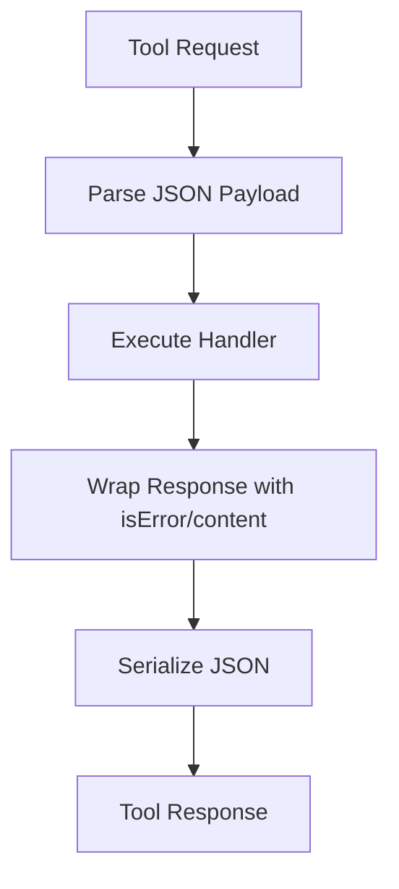
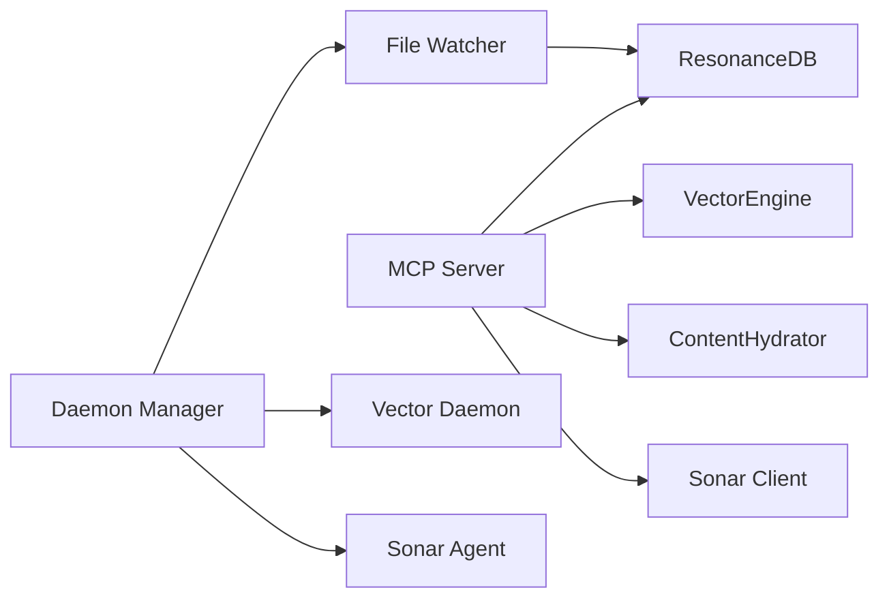
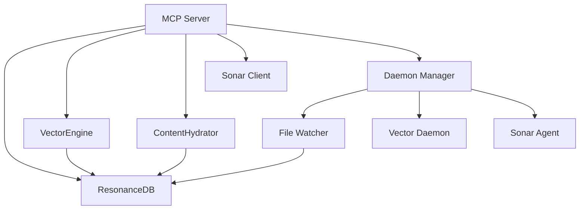

# Integration Patterns

<cite>
**Referenced Files in This Document**
- [src/mcp/index.ts](file://src/mcp/index.ts)
- [src/utils/ServiceLifecycle.ts](file://src/utils/ServiceLifecycle.ts)
- [src/daemon/index.ts](file://src/daemon/index.ts)
- [src/utils/DaemonManager.ts](file://src/utils/DaemonManager.ts)
- [src/utils/sonar-client.ts](file://src/utils/sonar-client.ts)
- [src/utils/ToolRegistry.ts](file://src/utils/ToolRegistry.ts)
- [src/tools/index.ts](file://src/tools/index.ts)
- [src/utils/ContentHydrator.ts](file://src/utils/ContentHydrator.ts)
- [src/core/VectorEngine.ts](file://src/core/VectorEngine.ts)
- [src/resonance/db.ts](file://src/resonance/db.ts)
- [src/components/archive/cloud-events-01.md](file://src/components/archive/cloud-events-01.md)
- [scripts/verify/test_mcp_lifecycle.ts](file://scripts/verify/test_mcp_lifecycle.ts)
- [WARP.md](file://WARP.md)
- [docs/MCP-TOOLS.md](file://docs/MCP-TOOLS.md)
</cite>

## Table of Contents
1. [Introduction](#introduction)
2. [Project Structure](#project-structure)
3. [Core Components](#core-components)
4. [Architecture Overview](#architecture-overview)
5. [Detailed Component Analysis](#detailed-component-analysis)
6. [Dependency Analysis](#dependency-analysis)
7. [Performance Considerations](#performance-considerations)
8. [Troubleshooting Guide](#troubleshooting-guide)
9. [Conclusion](#conclusion)

## Introduction
This document explains Amalfa’s integration patterns and architectural approaches across component interactions. It covers event-driven file watching and change propagation, service lifecycle management, the MCP-based API gateway bridging REST-like tools with core processing engines, agent integration patterns, message passing protocols, data serialization formats, and inter-component communication channels. Concrete examples illustrate typical workflows such as document ingestion, search operations, and background service coordination, along with error propagation, fallback mechanisms, and graceful degradation strategies.

## Project Structure
Amalfa organizes functionality around a modular architecture:
- MCP server and tooling for agent-driven operations
- Daemon services for background tasks (file watching, vector daemon, Sonar agent)
- Core engines for graph processing, vector search, and content hydration
- Resonance database layer with typed accessors and migrations
- Utilities for lifecycle management, tool registration, and client integrations

**Diagram sources**
- [src/mcp/index.ts](file://src/mcp/index.ts#L1-L748)
- [src/utils/ToolRegistry.ts](file://src/utils/ToolRegistry.ts#L1-L30)
- [src/tools/index.ts](file://src/tools/index.ts#L1-L7)
- [src/daemon/index.ts](file://src/daemon/index.ts#L1-L293)
- [src/utils/DaemonManager.ts](file://src/utils/DaemonManager.ts#L1-L260)
- [src/utils/sonar-client.ts](file://src/utils/sonar-client.ts#L1-L309)
- [src/utils/ContentHydrator.ts](file://src/utils/ContentHydrator.ts#L1-L39)
- [src/core/VectorEngine.ts](file://src/core/VectorEngine.ts#L1-L242)
- [src/resonance/db.ts](file://src/resonance/db.ts#L1-L488)
- [src/components/archive/cloud-events-01.md](file://src/components/archive/cloud-events-01.md#L1-L97)

**Section sources**
- [WARP.md](file://WARP.md#L218-L252)

## Core Components
- MCP Server: Implements Model Context Protocol (MCP) stdio transport, registers tools dynamically, orchestrates search, read, explore, and other knowledge graph operations, and coordinates background daemons.
- ServiceLifecycle: Provides unified lifecycle management for services (start, stop, status, restart, serve) with PID/log management and signal handling.
- Daemon Manager: Centralizes control of vector daemon, file watcher, Sonar agent, and reranker daemon, including health checks and status reporting.
- VectorEngine: Embedding generation and FAFCAS-compliant vector search using SQLite BLOB storage and pure dot products for speed.
- ResonanceDB: Typed database access with migrations, transaction helpers, and statistics.
- ContentHydrator: Loads content for search results using GraphGardener integration.
- Sonar Client: Optional HTTP client for advanced query analysis, reranking, context extraction, and gap discovery.
- Tool Registry: Dynamic registration and invocation of tools (e.g., EmberExtractTool).

**Section sources**
- [src/mcp/index.ts](file://src/mcp/index.ts#L1-L748)
- [src/utils/ServiceLifecycle.ts](file://src/utils/ServiceLifecycle.ts#L1-L209)
- [src/utils/DaemonManager.ts](file://src/utils/DaemonManager.ts#L1-L260)
- [src/core/VectorEngine.ts](file://src/core/VectorEngine.ts#L1-L242)
- [src/resonance/db.ts](file://src/resonance/db.ts#L1-L488)
- [src/utils/ContentHydrator.ts](file://src/utils/ContentHydrator.ts#L1-L39)
- [src/utils/sonar-client.ts](file://src/utils/sonar-client.ts#L1-L309)
- [src/utils/ToolRegistry.ts](file://src/utils/ToolRegistry.ts#L1-L30)
- [src/tools/index.ts](file://src/tools/index.ts#L1-L7)

## Architecture Overview
Amalfa employs an event-driven, agent-centric architecture:
- File watching triggers targeted ingestion and enrichment.
- MCP acts as the API gateway, exposing tools to agents and orchestrating core engines.
- Background daemons provide persistent services (vector daemon, Sonar agent) with health-checked availability.
- Data flows through ResonanceDB with FAFCAS vector normalization and efficient hydration.

**Diagram sources**
- [src/daemon/index.ts](file://src/daemon/index.ts#L100-L289)
- [src/mcp/index.ts](file://src/mcp/index.ts#L267-L513)
- [src/core/VectorEngine.ts](file://src/core/VectorEngine.ts#L227-L241)
- [src/utils/ContentHydrator.ts](file://src/utils/ContentHydrator.ts#L16-L37)
- [src/resonance/db.ts](file://src/resonance/db.ts#L305-L336)

## Detailed Component Analysis

### Event-Driven File Watching and Change Propagation
- The file watcher monitors configured directories recursively for Markdown changes, debounces bursts, and batches updates.
- On change, it triggers targeted ingestion into ResonanceDB and optional Ember enrichment gated by Git and content signature checks.
- Retry queues with exponential backoff ensure resilience against transient failures.
- Notifications are sent on completion or failure.

**Diagram sources**
- [src/daemon/index.ts](file://src/daemon/index.ts#L100-L289)

**Section sources**
- [src/daemon/index.ts](file://src/daemon/index.ts#L1-L293)

### Service Lifecycle Management
- ServiceLifecycle encapsulates process spawning, PID/log management, and signal handling for graceful shutdown.
- DaemonManager consolidates lifecycle operations for vector daemon, file watcher, Sonar agent, and reranker daemon, including health checks and concurrent status queries.

**Diagram sources**
- [src/utils/ServiceLifecycle.ts](file://src/utils/ServiceLifecycle.ts#L27-L108)
- [src/utils/DaemonManager.ts](file://src/utils/DaemonManager.ts#L84-L174)

**Section sources**
- [src/utils/ServiceLifecycle.ts](file://src/utils/ServiceLifecycle.ts#L1-L209)
- [src/utils/DaemonManager.ts](file://src/utils/DaemonManager.ts#L1-L260)
- [scripts/verify/test_mcp_lifecycle.ts](file://scripts/verify/test_mcp_lifecycle.ts#L1-L45)

### API Gateway: MCP Server and Tooling
- MCP server initializes ResonanceDB, scratchpad, and daemons, then exposes tools via stdio transport.
- Legacy tools include search, read, explore, list, gaps, and scratchpad utilities; dynamic tools are registered at runtime.
- Search workflow combines vector and grep engines, hydration, cross-encoder reranking, optional LLM reranking, and context extraction, with fallbacks and error propagation.

**Diagram sources**
- [src/mcp/index.ts](file://src/mcp/index.ts#L163-L250)
- [src/mcp/index.ts](file://src/mcp/index.ts#L252-L688)
- [src/utils/ToolRegistry.ts](file://src/utils/ToolRegistry.ts#L1-L30)
- [src/utils/ContentHydrator.ts](file://src/utils/ContentHydrator.ts#L16-L37)
- [src/utils/sonar-client.ts](file://src/utils/sonar-client.ts#L115-L269)

**Section sources**
- [src/mcp/index.ts](file://src/mcp/index.ts#L1-L748)
- [src/utils/ToolRegistry.ts](file://src/utils/ToolRegistry.ts#L1-L30)
- [src/tools/index.ts](file://src/tools/index.ts#L1-L7)
- [docs/MCP-TOOLS.md](file://docs/MCP-TOOLS.md#L490-L554)

### Agent Integration Patterns
- Dynamic tool registration enables agents to call tools like ember_extract with standardized schemas.
- The MCP server records tool calls and errors for observability and supports a scratchpad cache for large outputs.
- Sonar client provides optional advanced capabilities (query analysis, reranking, context extraction) with health checks and graceful fallbacks.

**Diagram sources**
- [src/utils/ToolRegistry.ts](file://src/utils/ToolRegistry.ts#L1-L30)
- [src/utils/sonar-client.ts](file://src/utils/sonar-client.ts#L19-L39)

**Section sources**
- [src/utils/ToolRegistry.ts](file://src/utils/ToolRegistry.ts#L1-L30)
- [src/utils/sonar-client.ts](file://src/utils/sonar-client.ts#L1-L309)
- [src/tools/index.ts](file://src/tools/index.ts#L1-L7)

### Message Passing Protocols and Serialization
- MCP uses stdio transport with JSON-RPC-like requests and responses.
- Tools return content arrays with a text field; errors are indicated via an isError flag.
- Search results are serialized as JSON with metadata for downstream consumption.
- CloudEvents protocol is documented for standardized event envelopes across processes.

**Diagram sources**
- [src/mcp/index.ts](file://src/mcp/index.ts#L57-L92)
- [src/mcp/index.ts](file://src/mcp/index.ts#L252-L688)
- [src/components/archive/cloud-events-01.md](file://src/components/archive/cloud-events-01.md#L1-L45)

**Section sources**
- [src/mcp/index.ts](file://src/mcp/index.ts#L57-L92)
- [src/mcp/index.ts](file://src/mcp/index.ts#L252-L688)
- [src/components/archive/cloud-events-01.md](file://src/components/archive/cloud-events-01.md#L1-L97)

### Inter-Component Communication Channels
- File watcher communicates with ingestion pipeline and optional Ember enrichment.
- MCP coordinates database access, vector engine, grep engine, and optional Sonar daemon.
- DaemonManager centralizes health checks and status reporting for background services.
- ContentHydrator bridges search results to full content via GraphGardener integration.

**Diagram sources**
- [src/daemon/index.ts](file://src/daemon/index.ts#L157-L217)
- [src/mcp/index.ts](file://src/mcp/index.ts#L94-L139)
- [src/utils/DaemonManager.ts](file://src/utils/DaemonManager.ts#L1-L260)
- [src/utils/ContentHydrator.ts](file://src/utils/ContentHydrator.ts#L1-L39)

**Section sources**
- [src/daemon/index.ts](file://src/daemon/index.ts#L1-L293)
- [src/mcp/index.ts](file://src/mcp/index.ts#L94-L139)
- [src/utils/DaemonManager.ts](file://src/utils/DaemonManager.ts#L1-L260)
- [src/utils/ContentHydrator.ts](file://src/utils/ContentHydrator.ts#L1-L39)

### Typical Workflows

#### Document Ingestion
- Detect file changes, debounce, and ingest only changed Markdown files.
- Optionally enrich with Ember using Git and content signature gates.
- Update telemetry and send notifications.

**Section sources**
- [src/daemon/index.ts](file://src/daemon/index.ts#L100-L289)

#### Search Operations
- Parallel vector and grep retrieval with candidate merging.
- Hydrate content for reranking, apply cross-encoder reranking, optionally re-rank with Sonar LLM, and extract context snippets.
- Return structured JSON with metadata and confidence scores.

**Section sources**
- [src/mcp/index.ts](file://src/mcp/index.ts#L267-L513)
- [src/utils/ContentHydrator.ts](file://src/utils/ContentHydrator.ts#L16-L37)
- [src/utils/sonar-client.ts](file://src/utils/sonar-client.ts#L115-L269)

#### Background Service Coordination
- MCP starts file watcher and vector daemon based on configuration.
- DaemonManager checks health and manages lifecycle of all daemons concurrently.

**Section sources**
- [src/mcp/index.ts](file://src/mcp/index.ts#L94-L139)
- [src/utils/DaemonManager.ts](file://src/utils/DaemonManager.ts#L233-L246)

### Error Propagation, Fallbacks, and Graceful Degradation
- Unhandled exceptions and rejections are logged and persisted to crash logs.
- Search falls back to error messages when engines fail; Sonar features degrade gracefully with cached availability and simple fallbacks.
- Retry queues with exponential backoff mitigate transient failures in ingestion.
- Health-checked daemons enable graceful degradation when optional services are unavailable.

**Section sources**
- [src/mcp/index.ts](file://src/mcp/index.ts#L725-L747)
- [src/utils/sonar-client.ts](file://src/utils/sonar-client.ts#L72-L113)
- [src/utils/sonar-client.ts](file://src/utils/sonar-client.ts#L163-L203)
- [src/daemon/index.ts](file://src/daemon/index.ts#L232-L287)

## Dependency Analysis

**Diagram sources**
- [src/mcp/index.ts](file://src/mcp/index.ts#L1-L748)
- [src/utils/DaemonManager.ts](file://src/utils/DaemonManager.ts#L1-L260)
- [src/daemon/index.ts](file://src/daemon/index.ts#L1-L293)
- [src/core/VectorEngine.ts](file://src/core/VectorEngine.ts#L1-L242)
- [src/resonance/db.ts](file://src/resonance/db.ts#L1-L488)
- [src/utils/ContentHydrator.ts](file://src/utils/ContentHydrator.ts#L1-L39)
- [src/utils/sonar-client.ts](file://src/utils/sonar-client.ts#L1-L309)

**Section sources**
- [src/mcp/index.ts](file://src/mcp/index.ts#L1-L748)
- [src/utils/DaemonManager.ts](file://src/utils/DaemonManager.ts#L1-L260)

## Performance Considerations
- VectorEngine leverages FAFCAS normalization and dot products for unit vectors, minimizing overhead and enabling high-throughput similarity search.
- Content hydration is limited to top-K results to reduce IO and memory usage.
- Parallel execution of vector and grep engines reduces latency for hybrid retrieval.
- Database operations use WAL mode and optimized prepared statements; transactions support batching for ingestion.

[No sources needed since this section provides general guidance]

## Troubleshooting Guide
- Verify MCP lifecycle stability using the lifecycle test script to ensure the process remains alive after startup.
- Inspect PID/log files managed by ServiceLifecycle for startup/shutdown diagnostics.
- Confirm daemon health via DaemonManager status checks and port availability.
- Review Sonar client health checks and fallback behavior when services are unreachable.
- Use MCP logging for tool execution errors and structured error responses.

**Section sources**
- [scripts/verify/test_mcp_lifecycle.ts](file://scripts/verify/test_mcp_lifecycle.ts#L1-L45)
- [src/utils/ServiceLifecycle.ts](file://src/utils/ServiceLifecycle.ts#L113-L124)
- [src/utils/DaemonManager.ts](file://src/utils/DaemonManager.ts#L84-L174)
- [src/utils/sonar-client.ts](file://src/utils/sonar-client.ts#L72-L113)
- [src/mcp/index.ts](file://src/mcp/index.ts#L725-L747)

## Conclusion
Amalfa integrates event-driven file watching, robust service lifecycle management, and an MCP-based API gateway to orchestrate search, ingestion, and enrichment workflows. The system emphasizes resilience through retry queues, health-checked daemons, and graceful degradation when optional services are unavailable. Standardized protocols (MCP, CloudEvents) and dynamic tooling enable extensible agent interactions, while FAFCAS-compliant vector processing ensures high-performance semantic search.