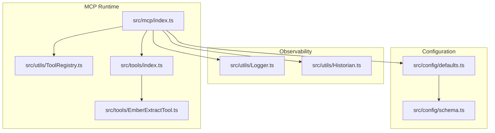
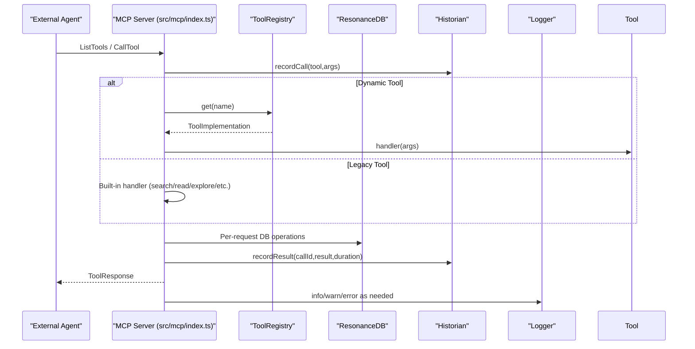
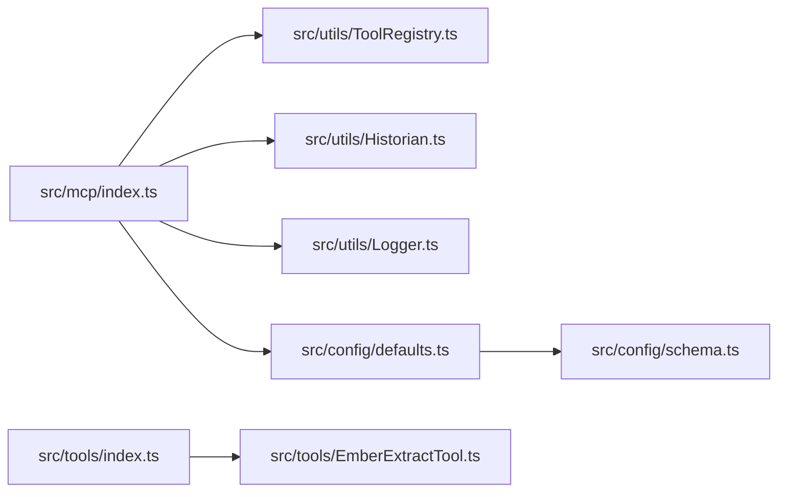

# Security and Access Control

<cite>
**Referenced Files in This Document**
- [src/mcp/index.ts](file://src/mcp/index.ts)
- [src/mcp/README.md](file://src/mcp/README.md)
- [src/utils/ToolRegistry.ts](file://src/utils/ToolRegistry.ts)
- [src/tools/index.ts](file://src/tools/index.ts)
- [src/tools/EmberExtractTool.ts](file://src/tools/EmberExtractTool.ts)
- [src/utils/Historian.ts](file://src/utils/Historian.ts)
- [src/utils/Logger.ts](file://src/utils/Logger.ts)
- [src/config/defaults.ts](file://src/config/defaults.ts)
- [src/config/schema.ts](file://src/config/schema.ts)
- [docs/API_KEYS.md](file://docs/API_KEYS.md)
- [public/docs/debriefs/2025-11-29-browser-capabilities.md](file://public/docs/debriefs/2025-11-29-browser-capabilities.md)
- [playbooks/harden-and-flense-protocol.md](file://playbooks/harden-and-flense-protocol.md)
- [docs/architecture/ARCHITECTURE-ANALYSIS.md](file://docs/architecture/ARCHITECTURE-ANALYSIS.md)
</cite>

## Table of Contents
1. [Introduction](#introduction)
2. [Project Structure](#project-structure)
3. [Core Components](#core-components)
4. [Architecture Overview](#architecture-overview)
5. [Detailed Component Analysis](#detailed-component-analysis)
6. [Dependency Analysis](#dependency-analysis)
7. [Performance Considerations](#performance-considerations)
8. [Troubleshooting Guide](#troubleshooting-guide)
9. [Conclusion](#conclusion)
10. [Appendices](#appendices)

## Introduction
This document focuses on security and access control in Amalfa’s component interaction system, with emphasis on MCP tool access, authentication and authorization patterns, credential management, permission scopes, logging and audit trails, security boundaries, sandboxing and isolation, error handling and information disclosure prevention, and secure configuration management. It synthesizes the current implementation and operational guidance to help maintain a robust, secure system while preserving the intended read-only MCP posture.

## Project Structure
Security-relevant components are primarily located under:
- src/mcp: MCP server entrypoint and tool handlers
- src/utils: Logging, auditing/history, and configuration helpers
- src/config: Centralized configuration loading and validation
- src/tools: Tool registration and dynamic tool implementations
- docs and playbooks: Operational guidance and security protocols

**Diagram sources**
- [src/mcp/index.ts](file://src/mcp/index.ts#L1-L748)
- [src/utils/ToolRegistry.ts](file://src/utils/ToolRegistry.ts#L1-L30)
- [src/tools/index.ts](file://src/tools/index.ts#L1-L7)
- [src/tools/EmberExtractTool.ts](file://src/tools/EmberExtractTool.ts#L1-L140)
- [src/utils/Logger.ts](file://src/utils/Logger.ts#L1-L23)
- [src/utils/Historian.ts](file://src/utils/Historian.ts#L1-L136)
- [src/config/defaults.ts](file://src/config/defaults.ts#L1-L143)
- [src/config/schema.ts](file://src/config/schema.ts#L1-L298)

**Section sources**
- [src/mcp/index.ts](file://src/mcp/index.ts#L1-L748)
- [src/mcp/README.md](file://src/mcp/README.md#L1-L15)

## Core Components
- MCP Server: Exposes read-only tools and resources via stdio transport, with per-request database connections and dynamic tool registry.
- Tool Registry: Central mechanism for registering and dispatching tools.
- Logger: Pino-based logger writing to stderr to avoid polluting stdout for machine-readable output.
- Historian: Records tool calls, results, and errors to disk for recall and debugging.
- Configuration: Single Source of Truth via Zod schema with explicit defaults and validation.
- Credentials: Stored in .env and referenced via environment variables; MCP does not implement authentication.

**Section sources**
- [src/mcp/index.ts](file://src/mcp/index.ts#L146-L250)
- [src/utils/ToolRegistry.ts](file://src/utils/ToolRegistry.ts#L8-L27)
- [src/utils/Logger.ts](file://src/utils/Logger.ts#L1-L23)
- [src/utils/Historian.ts](file://src/utils/Historian.ts#L31-L126)
- [src/config/defaults.ts](file://src/config/defaults.ts#L84-L139)
- [src/config/schema.ts](file://src/config/schema.ts#L146-L266)
- [docs/API_KEYS.md](file://docs/API_KEYS.md#L1-L74)

## Architecture Overview
The MCP server initializes services, registers tools, and handles requests. Tools are either legacy static handlers or dynamically registered via the ToolRegistry. Observability is achieved through structured logging and session-based history persisted to .amalfa/sessions.

**Diagram sources**
- [src/mcp/index.ts](file://src/mcp/index.ts#L252-L688)
- [src/utils/ToolRegistry.ts](file://src/utils/ToolRegistry.ts#L20-L26)
- [src/utils/Historian.ts](file://src/utils/Historian.ts#L66-L117)
- [src/utils/Logger.ts](file://src/utils/Logger.ts#L20-L22)

## Detailed Component Analysis

### Authentication and Authorization Patterns
- Authentication: Not implemented in the MCP server. Requests are processed without credential checks.
- Authorization: The MCP remains read-only by design; dynamic tool registration is centralized and controlled by the application.
- Permission Scopes: Not enforced at the MCP boundary; tools operate within the application’s configured capabilities.

Recommendations:
- Enforce transport-level authentication (e.g., stdio handshake tokens) if integrating with untrusted agents.
- Gate tool invocation behind a policy layer that validates caller identity and requested scope.
- Restrict dynamic tool registration to trusted modules only.

**Section sources**
- [src/mcp/index.ts](file://src/mcp/index.ts#L146-L250)
- [src/mcp/README.md](file://src/mcp/README.md#L1-L15)
- [docs/architecture/ARCHITECTURE-ANALYSIS.md](file://docs/architecture/ARCHITECTURE-ANALYSIS.md#L158-L219)

### Credential Management and Permission Scopes
- Credentials are stored in .env and referenced via environment variables.
- Providers and optional keys are configured via schema-defined fields (e.g., Sonar cloud API key).
- MCP server does not handle credentials; tools may use clients that rely on environment variables.

Best practices:
- Keep .env out of version control.
- Use least-privilege keys and rotate regularly.
- Avoid embedding secrets in tool schemas or responses.

**Section sources**
- [docs/API_KEYS.md](file://docs/API_KEYS.md#L1-L74)
- [src/config/schema.ts](file://src/config/schema.ts#L46-L88)
- [src/config/schema.ts](file://src/config/schema.ts#L198-L233)

### Logging and Audit Trail
- Logger: Pino configured to write to stderr, with component-scoped child loggers.
- Historian: Persisted session logs (.amalfa/sessions/session_{uuid}.jsonl) capturing calls, results, and errors with timing.
- MCP crash handling: Uncaught exceptions and unhandled rejections are logged and appended to a crash log file.

Operational guidance:
- Monitor logs via stderr for tool execution anomalies.
- Use Historian data for replay and debugging agent thought loops.
- Ensure logs do not contain sensitive data; sanitize outputs accordingly.

**Section sources**
- [src/utils/Logger.ts](file://src/utils/Logger.ts#L1-L23)
- [src/utils/Historian.ts](file://src/utils/Historian.ts#L31-L136)
- [src/mcp/index.ts](file://src/mcp/index.ts#L727-L743)

### Security Boundaries Between Internal Components and External Agents
- Transport: MCP uses stdio transport; ensure the parent process enforces transport-level isolation.
- Allowlist and Sandboxing: Browser sandboxing observations indicate that allowlists may not be hermetic; adapt behavior accordingly and verify capabilities before assuming isolation.
- Resource Isolation: Tools should avoid writing to arbitrary filesystem locations; current MCP tools are read-only or constrained to known paths.

Recommendations:
- Treat the environment as “leaky until proven sealed.”
- Implement explicit capability checks and fail closed.
- Limit tool capabilities to read-only operations unless explicit authorization is introduced.

**Section sources**
- [public/docs/debriefs/2025-11-29-browser-capabilities.md](file://public/docs/debriefs/2025-11-29-browser-capabilities.md#L1-L30)
- [src/mcp/index.ts](file://src/mcp/index.ts#L580-L588)

### Sandbox and Resource Isolation Strategies
- MCP tools are executed within the application process; isolation relies on configuration and tool design.
- Tool implementations should validate inputs, constrain filesystem access, and avoid executing untrusted commands.
- The “Harden and Flense” protocol emphasizes removing console noise, reducing inner loop work, and enforcing error boundaries—implying safer defaults and stricter validation.

**Section sources**
- [playbooks/harden-and-flense-protocol.md](file://playbooks/harden-and-flense-protocol.md#L1-L35)
- [src/tools/EmberExtractTool.ts](file://src/tools/EmberExtractTool.ts#L34-L138)

### Error Handling and Information Disclosure Prevention
- MCP wraps tool execution in try/catch and records errors with durations; returns standardized error responses.
- Crash handlers log fatal errors and append to a crash log file.
- Logger writes to stderr to avoid mixing logs with tool output.

Guidelines:
- Do not expose stack traces or raw internal errors to callers.
- Sanitize tool outputs; avoid returning sensitive data.
- Ensure stdout remains machine-readable for MCP/CLI pipelines.

**Section sources**
- [src/mcp/index.ts](file://src/mcp/index.ts#L680-L687)
- [src/mcp/index.ts](file://src/mcp/index.ts#L727-L743)
- [src/utils/Logger.ts](file://src/utils/Logger.ts#L11-L13)

### Tool Development Security Best Practices
- Input validation: Validate and sanitize all inputs, especially from stdin or external files.
- Output sanitization: Avoid echoing sensitive data; prefer structured, redacted responses.
- Least privilege: Restrict filesystem writes to known, safe locations.
- Idempotency and retries: Design tools to be resilient and safe under failure conditions.

**Section sources**
- [playbooks/harden-and-flense-protocol.md](file://playbooks/harden-and-flense-protocol.md#L21-L35)
- [src/tools/EmberExtractTool.ts](file://src/tools/EmberExtractTool.ts#L34-L138)

### Threat Modeling for Component Interactions
- Threats: Unauthenticated access, noisy stdout contamination, insufficient sandboxing, accidental data exposure, and unsafe tool behaviors.
- Mitigations: Introduce transport-level auth, enforce strict logging to stderr, adopt capability-based authorization, and apply the “Verify, Don’t Assume” principle for sandboxing.

**Section sources**
- [public/docs/debriefs/2025-11-29-browser-capabilities.md](file://public/docs/debriefs/2025-11-29-browser-capabilities.md#L13-L16)
- [src/mcp/index.ts](file://src/mcp/index.ts#L146-L250)

### Secure Communication Channels
- Current transport: stdio; ensure the parent process enforces channel integrity.
- If extending to network transports, use TLS and mutual authentication.
- Avoid transmitting secrets over unencrypted channels.

[No sources needed since this section provides general guidance]

### Protection Against Malicious Tool Requests
- Validate tool names and arguments against schemas.
- Reject unexpected or malformed inputs.
- Limit resource usage (timeouts, memory) to prevent abuse.

**Section sources**
- [src/utils/ToolRegistry.ts](file://src/utils/ToolRegistry.ts#L20-L26)
- [src/mcp/index.ts](file://src/mcp/index.ts#L252-L688)

### Secure Configuration Management and Environment Variable Handling
- Single Source of Truth: Zod schema defines defaults and validation; loadSettings exits on missing or invalid configuration.
- Environment variables: Used for credentials; do not hardcode secrets.
- Directory initialization: Ensures .amalfa directories exist for logs, runtime, cache, and sessions.

**Section sources**
- [src/config/defaults.ts](file://src/config/defaults.ts#L84-L139)
- [src/config/schema.ts](file://src/config/schema.ts#L146-L266)
- [docs/API_KEYS.md](file://docs/API_KEYS.md#L17-L29)

## Dependency Analysis

**Diagram sources**
- [src/mcp/index.ts](file://src/mcp/index.ts#L1-L748)
- [src/utils/ToolRegistry.ts](file://src/utils/ToolRegistry.ts#L1-L30)
- [src/utils/Historian.ts](file://src/utils/Historian.ts#L1-L136)
- [src/utils/Logger.ts](file://src/utils/Logger.ts#L1-L23)
- [src/config/defaults.ts](file://src/config/defaults.ts#L1-L143)
- [src/config/schema.ts](file://src/config/schema.ts#L1-L298)
- [src/tools/index.ts](file://src/tools/index.ts#L1-L7)
- [src/tools/EmberExtractTool.ts](file://src/tools/EmberExtractTool.ts#L1-L140)

**Section sources**
- [src/mcp/index.ts](file://src/mcp/index.ts#L1-L748)
- [src/utils/ToolRegistry.ts](file://src/utils/ToolRegistry.ts#L1-L30)
- [src/utils/Historian.ts](file://src/utils/Historian.ts#L1-L136)
- [src/utils/Logger.ts](file://src/utils/Logger.ts#L1-L23)
- [src/config/defaults.ts](file://src/config/defaults.ts#L1-L143)
- [src/config/schema.ts](file://src/config/schema.ts#L1-L298)
- [src/tools/index.ts](file://src/tools/index.ts#L1-L7)
- [src/tools/EmberExtractTool.ts](file://src/tools/EmberExtractTool.ts#L1-L140)

## Performance Considerations
- MCP tools should minimize IO and computation; leverage caching and streaming where appropriate.
- Logging and history persistence should be asynchronous or buffered to reduce overhead.
- Avoid unnecessary database connections; reuse per-request connections as implemented.

[No sources needed since this section provides general guidance]

## Troubleshooting Guide
- MCP crashes: Review crash logs appended to the crash log file and inspect structured logs for fatal errors.
- Tool failures: Use Historian session logs to correlate callId with recorded results and errors.
- Configuration issues: loadSettings will exit on missing or invalid configuration; validate schema compliance.

**Section sources**
- [src/mcp/index.ts](file://src/mcp/index.ts#L727-L743)
- [src/utils/Historian.ts](file://src/utils/Historian.ts#L66-L117)
- [src/config/defaults.ts](file://src/config/defaults.ts#L84-L139)

## Conclusion
Amalfa’s MCP server is intentionally read-only and relies on centralized configuration and observability for security. To strengthen access control, introduce transport-level authentication and capability-based authorization. Adopt strict input validation, output sanitization, and sandboxing practices. Continue to treat the environment as “leaky until proven sealed,” and maintain secure configuration and credential handling. These measures will preserve the system’s integrity while enabling safe, auditable interactions between internal components and external agents.

## Appendices

### MCP Tool Access Control Summary
- Current state: No authentication; read-only MCP posture.
- Recommended: Enforce transport auth, policy-based authorization, and least-privilege tool execution.

**Section sources**
- [src/mcp/README.md](file://src/mcp/README.md#L1-L15)
- [docs/architecture/ARCHITECTURE-ANALYSIS.md](file://docs/architecture/ARCHITECTURE-ANALYSIS.md#L158-L219)