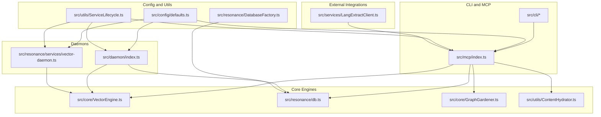
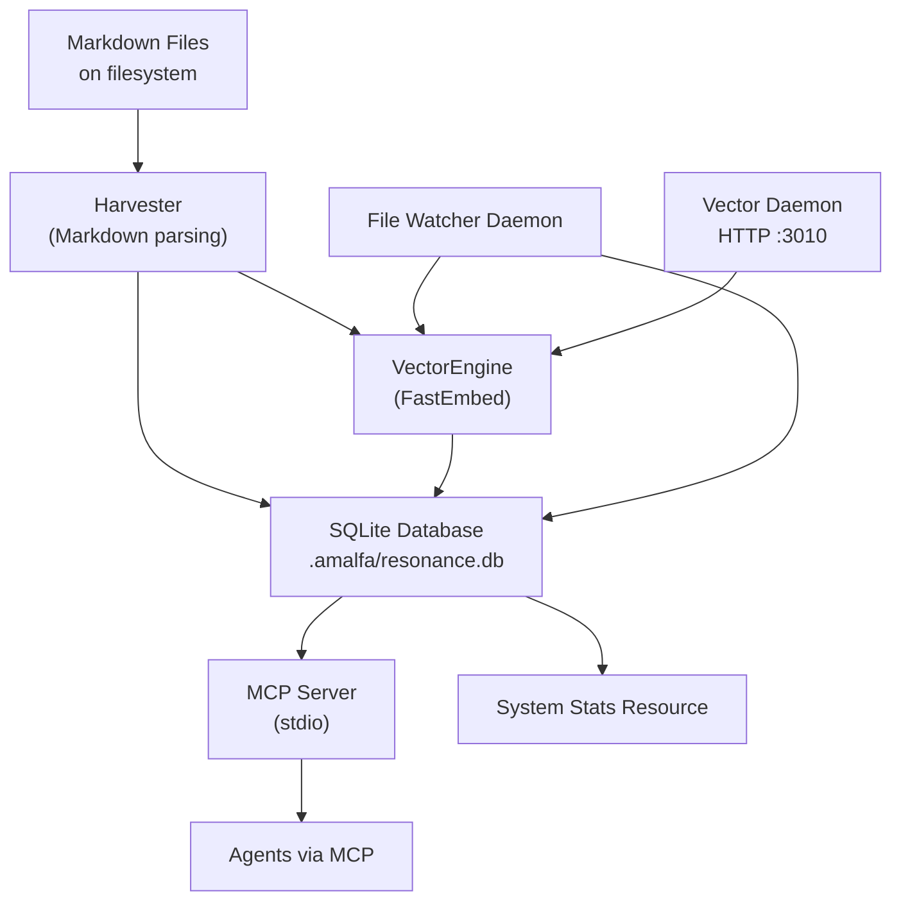
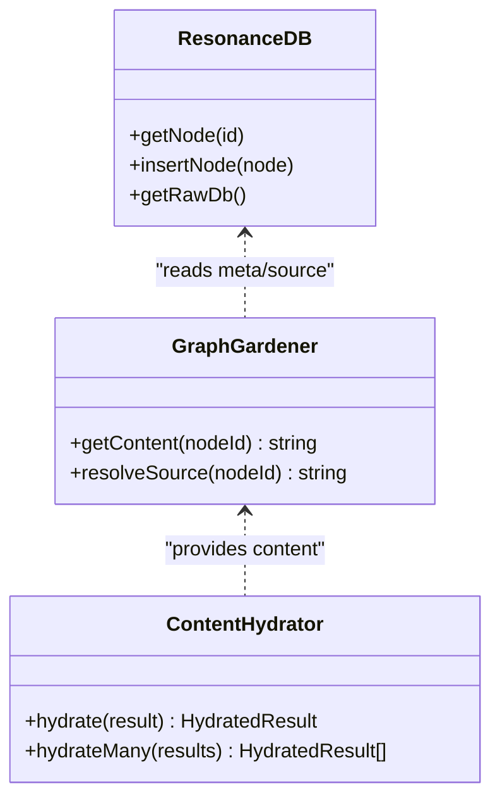
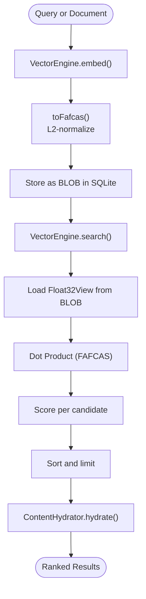
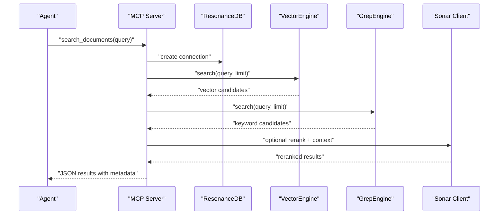
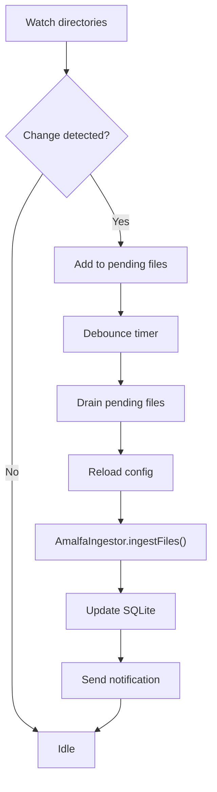
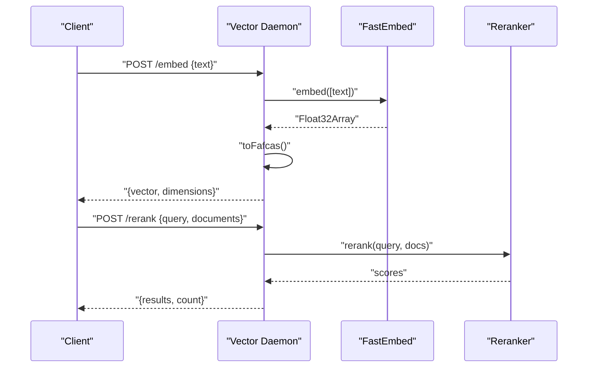
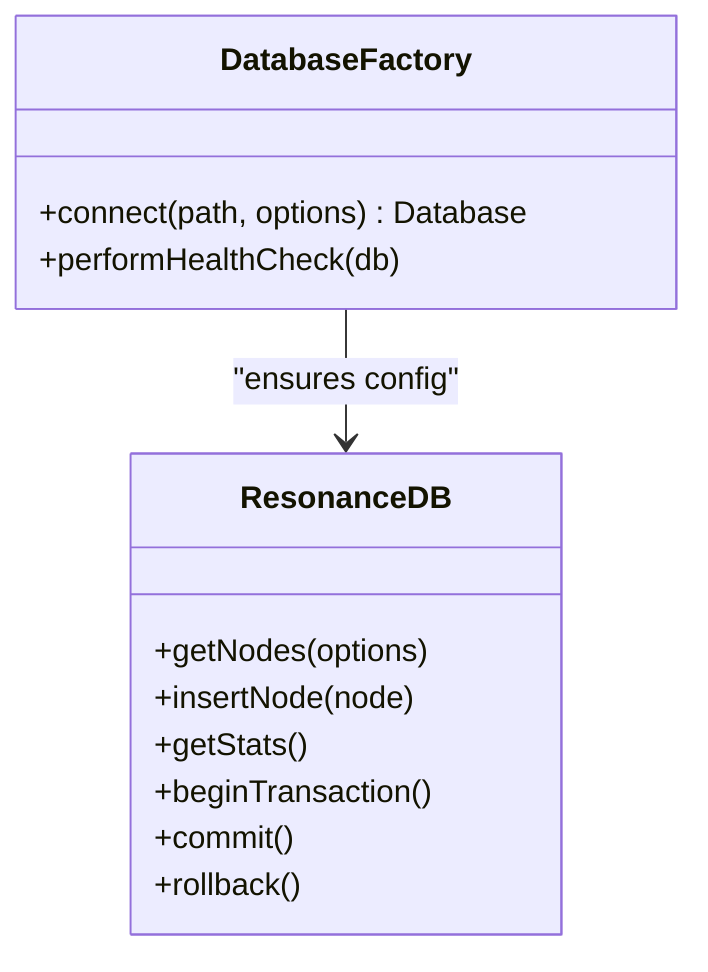
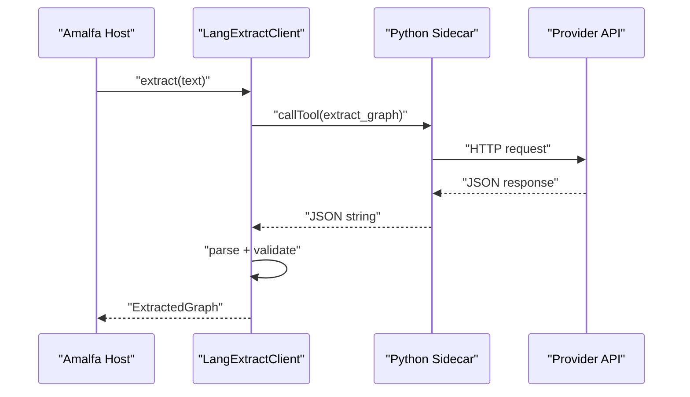
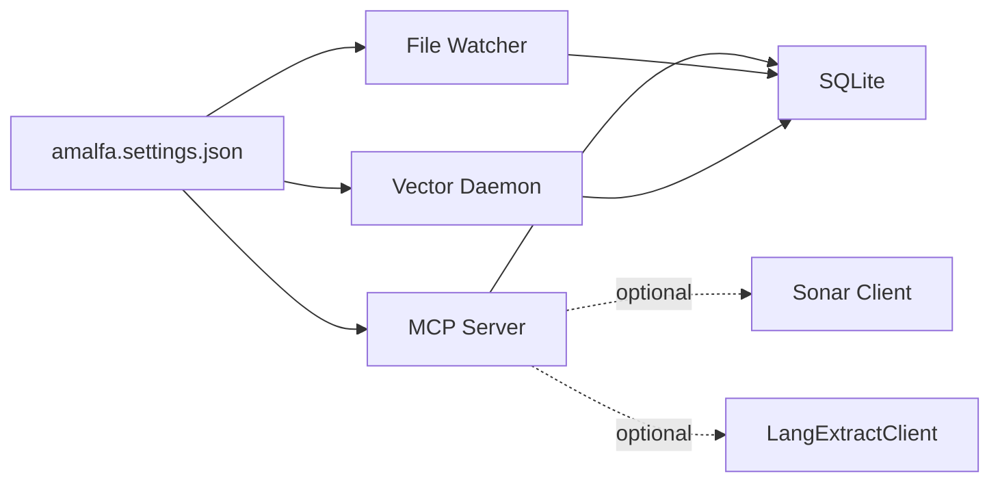

# Core Architecture

<cite>
**Referenced Files in This Document**
- [README.md](file://README.md)
- [ARCHITECTURE.md](file://docs/ARCHITECTURE.md)
- [SERVICE-ARCHITECTURE.md](file://docs/architecture/SERVICE-ARCHITECTURE.md)
- [thin-node.md](file://docs/architecture/thin-node.md)
- [daemon-operations.md](file://docs/architecture/daemon-operations.md)
- [BentoNormalizer.ts](file://src/core/BentoNormalizer.ts)
- [VectorEngine.ts](file://src/core/VectorEngine.ts)
- [db.ts](file://src/resonance/db.ts)
- [index.ts](file://src/daemon/index.ts)
- [index.ts](file://src/mcp/index.ts)
- [vector-daemon.ts](file://src/resonance/services/vector-daemon.ts)
- [defaults.ts](file://src/config/defaults.ts)
- [ServiceLifecycle.ts](file://src/utils/ServiceLifecycle.ts)
- [GraphGardener.ts](file://src/core/GraphGardener.ts)
- [ContentHydrator.ts](file://src/utils/ContentHydrator.ts)
- [DatabaseFactory.ts](file://src/resonance/DatabaseFactory.ts)
- [LangExtractClient.ts](file://src/services/LangExtractClient.ts)
</cite>

## Table of Contents
1. [Introduction](#introduction)
2. [Project Structure](#project-structure)
3. [Core Components](#core-components)
4. [Architecture Overview](#architecture-overview)
5. [Detailed Component Analysis](#detailed-component-analysis)
6. [Dependency Analysis](#dependency-analysis)
7. [Performance Considerations](#performance-considerations)
8. [Troubleshooting Guide](#troubleshooting-guide)
9. [Conclusion](#conclusion)
10. [Appendices](#appendices)

## Introduction
Amalfa is a local-first knowledge graph system that treats markdown as the source of truth, SQLite as a disposable cache, and the MCP protocol as the integration surface for agents. Its core design centers on:
- Markdown as source of truth with a disposable database pattern
- Hollow nodes: metadata in SQLite, content on the filesystem
- FAFCAS protocol for fast vector similarity search
- A micro-daemon mesh: MCP server, file watcher, vector daemon, and optional reranking services
- Integration with external inference providers (Gemini, OpenRouter, Ollama)

## Project Structure
High-level organization:
- CLI and MCP server under src/mcp and CLI commands under src/cli
- Core graph and vector engines under src/core
- Resonance database layer and services under src/resonance
- Daemon orchestration under src/daemon
- Utilities and lifecycle management under src/utils
- Configuration under src/config
- Documentation under docs and architecture playbooks under playbooks

**Diagram sources**
- [index.ts](file://src/mcp/index.ts#L1-L748)
- [index.ts](file://src/daemon/index.ts#L1-L293)
- [vector-daemon.ts](file://src/resonance/services/vector-daemon.ts#L1-L234)
- [VectorEngine.ts](file://src/core/VectorEngine.ts#L1-L242)
- [db.ts](file://src/resonance/db.ts#L1-L488)
- [GraphGardener.ts](file://src/core/GraphGardener.ts#L1-L270)
- [ContentHydrator.ts](file://src/utils/ContentHydrator.ts#L1-L39)
- [defaults.ts](file://src/config/defaults.ts#L1-L143)
- [ServiceLifecycle.ts](file://src/utils/ServiceLifecycle.ts#L1-L209)
- [DatabaseFactory.ts](file://src/resonance/DatabaseFactory.ts#L1-L103)
- [LangExtractClient.ts](file://src/services/LangExtractClient.ts#L1-L354)

**Section sources**
- [README.md](file://README.md#L320-L380)
- [ARCHITECTURE.md](file://docs/ARCHITECTURE.md#L10-L67)

## Core Components
- Hollow nodes: SQLite stores node metadata and vector embeddings; content is read from the filesystem via GraphGardener.
- FAFCAS protocol: Embeddings are pre-normalized to unit length for fast dot-product similarity.
- VectorEngine: Generates and searches FAFCAS vectors against SQLite-backed embeddings.
- MCP server: Provides agent tools over stdio using the Model Context Protocol.
- File Watcher daemon: Monitors markdown sources and triggers targeted ingestion.
- Vector Daemon: HTTP service that keeps FastEmbed loaded for low-latency embeddings.
- DatabaseFactory: Enforces SQLite standards and ensures consistent connections.
- ContentHydrator: Lazily loads content from disk for agent consumption.
- LangExtractClient: Optional sidecar integration for structured extraction using external providers.

**Section sources**
- [ARCHITECTURE.md](file://docs/ARCHITECTURE.md#L21-L67)
- [ARCHITECTURE.md](file://docs/ARCHITECTURE.md#L68-L133)
- [ARCHITECTURE.md](file://docs/ARCHITECTURE.md#L134-L222)
- [db.ts](file://src/resonance/db.ts#L25-L134)
- [VectorEngine.ts](file://src/core/VectorEngine.ts#L76-L242)
- [index.ts](file://src/mcp/index.ts#L1-L748)
- [index.ts](file://src/daemon/index.ts#L1-L293)
- [vector-daemon.ts](file://src/resonance/services/vector-daemon.ts#L1-L234)
- [DatabaseFactory.ts](file://src/resonance/DatabaseFactory.ts#L13-L66)
- [ContentHydrator.ts](file://src/utils/ContentHydrator.ts#L13-L38)
- [LangExtractClient.ts](file://src/services/LangExtractClient.ts#L31-L354)

## Architecture Overview
The system is designed around markdown as the source of truth and SQLite as a disposable cache. The MCP server exposes tools to agents; the file watcher keeps the graph synchronized; the vector daemon accelerates embedding generation; and optional services (reranking, Sonar) enhance precision and context.

**Diagram sources**
- [ARCHITECTURE.md](file://docs/ARCHITECTURE.md#L223-L272)
- [index.ts](file://src/mcp/index.ts#L62-L723)
- [index.ts](file://src/daemon/index.ts#L52-L95)
- [vector-daemon.ts](file://src/resonance/services/vector-daemon.ts#L72-L230)
- [db.ts](file://src/resonance/db.ts#L305-L336)

**Section sources**
- [README.md](file://README.md#L320-L380)
- [ARCHITECTURE.md](file://docs/ARCHITECTURE.md#L223-L272)

## Detailed Component Analysis

### Hollow Node Design Pattern
- Nodes store only metadata and vector embeddings in SQLite; content is read from the filesystem on demand.
- GraphGardener resolves source paths from node metadata and reads content lazily.
- ContentHydrator hydrates results with full content for agent consumption.

**Diagram sources**
- [db.ts](file://src/resonance/db.ts#L368-L431)
- [GraphGardener.ts](file://src/core/GraphGardener.ts#L204-L254)
- [ContentHydrator.ts](file://src/utils/ContentHydrator.ts#L13-L38)

**Section sources**
- [ARCHITECTURE.md](file://docs/ARCHITECTURE.md#L21-L67)
- [GraphGardener.ts](file://src/core/GraphGardener.ts#L204-L254)
- [ContentHydrator.ts](file://src/utils/ContentHydrator.ts#L13-L38)

### FAFCAS Protocol and Vector Search
- Embeddings are generated with FastEmbed and normalized to unit length (FAFCAS).
- VectorEngine performs dot-product similarity using stored Float32 arrays.
- Database schema stores embeddings as BLOBs; normalization is enforced at ingestion/search boundaries.

**Diagram sources**
- [VectorEngine.ts](file://src/core/VectorEngine.ts#L17-L139)
- [VectorEngine.ts](file://src/core/VectorEngine.ts#L159-L240)
- [db.ts](file://src/resonance/db.ts#L467-L487)

**Section sources**
- [ARCHITECTURE.md](file://docs/ARCHITECTURE.md#L68-L133)
- [VectorEngine.ts](file://src/core/VectorEngine.ts#L76-L242)
- [db.ts](file://src/resonance/db.ts#L467-L487)

### MCP Server and Agent Integration
- MCP server initializes database, vector engine, and grep engine per-request.
- Provides tools: search_documents, read_node_content, explore_links, list_directory_structure, inject_tags, find_gaps, scratchpad_read/list.
- Integrates optional Sonar client for query analysis, reranking, and context extraction.

**Diagram sources**
- [index.ts](file://src/mcp/index.ts#L252-L512)
- [index.ts](file://src/mcp/index.ts#L62-L141)

**Section sources**
- [index.ts](file://src/mcp/index.ts#L1-L748)
- [README.md](file://README.md#L140-L163)

### File Watcher Daemon and Incremental Ingestion
- Watches configured source directories recursively for .md changes.
- Debounces events and triggers targeted ingestion for changed files.
- Supports retry with exponential backoff and notifications.

**Diagram sources**
- [index.ts](file://src/daemon/index.ts#L100-L127)
- [index.ts](file://src/daemon/index.ts#L132-L289)

**Section sources**
- [index.ts](file://src/daemon/index.ts#L1-L293)
- [SERVICE-ARCHITECTURE.md](file://docs/architecture/SERVICE-ARCHITECTURE.md#L68-L101)

### Vector Daemon and Embedding Acceleration
- HTTP server on port 3010 providing /embed and /rerank endpoints.
- Keeps FastEmbed model loaded in memory for sub-100ms embeddings.
- Optional reranker service integrated for cross-encoder reranking.

**Diagram sources**
- [vector-daemon.ts](file://src/resonance/services/vector-daemon.ts#L77-L224)
- [db.ts](file://src/resonance/db.ts#L467-L487)

**Section sources**
- [vector-daemon.ts](file://src/resonance/services/vector-daemon.ts#L1-L234)
- [SERVICE-ARCHITECTURE.md](file://docs/architecture/SERVICE-ARCHITECTURE.md#L103-L163)

### Database Layer and Standards
- DatabaseFactory enforces WAL mode, busy_timeout, synchronous, and foreign keys.
- ResonanceDB encapsulates typed accessors, transaction helpers, and statistics.

**Diagram sources**
- [DatabaseFactory.ts](file://src/resonance/DatabaseFactory.ts#L13-L66)
- [db.ts](file://src/resonance/db.ts#L25-L134)

**Section sources**
- [DatabaseFactory.ts](file://src/resonance/DatabaseFactory.ts#L1-L103)
- [db.ts](file://src/resonance/db.ts#L25-L134)

### External Provider Integrations
- LangExtractClient integrates structured extraction via a Python sidecar using MCP stdio transport.
- Supports multiple providers (OpenRouter, Gemini, Ollama) with environment-based configuration.
- Validates API keys and parses substrate errors for actionable feedback.

**Diagram sources**
- [LangExtractClient.ts](file://src/services/LangExtractClient.ts#L188-L353)

**Section sources**
- [LangExtractClient.ts](file://src/services/LangExtractClient.ts#L1-L354)
- [README.md](file://README.md#L11-L111)

## Dependency Analysis
- Service independence: MCP server, file watcher, and vector daemon can run independently.
- Optional dependencies: Vector daemon improves latency; Sonar enhances precision.
- Configuration single source of truth: amalfa.settings.json drives all services.

**Diagram sources**
- [defaults.ts](file://src/config/defaults.ts#L84-L139)
- [index.ts](file://src/mcp/index.ts#L94-L139)
- [index.ts](file://src/daemon/index.ts#L52-L95)
- [vector-daemon.ts](file://src/resonance/services/vector-daemon.ts#L72-L230)

**Section sources**
- [SERVICE-ARCHITECTURE.md](file://docs/architecture/SERVICE-ARCHITECTURE.md#L196-L243)
- [defaults.ts](file://src/config/defaults.ts#L84-L139)

## Performance Considerations
- FAFCAS dot-product similarity eliminates costly division operations.
- SQLite WAL mode and tuned pragmas improve concurrency and durability.
- Vector daemon reduces cold-start latency by keeping models in memory.
- Content hydration is lazy: only hydrated when needed for reranking or context extraction.

[No sources needed since this section provides general guidance]

## Troubleshooting Guide
- Configuration validation: loadSettings() validates amalfa.settings.json and exits with clear messages on errors.
- Service lifecycle: ServiceLifecycle manages PID/log files and graceful shutdown.
- Database health: DatabaseFactory.performHealthCheck verifies WAL mode and related pragmas.
- MCP crashes: Centralized uncaughtException/unhandledRejection handlers write crash logs.

**Section sources**
- [defaults.ts](file://src/config/defaults.ts#L84-L139)
- [ServiceLifecycle.ts](file://src/utils/ServiceLifecycle.ts#L12-L209)
- [DatabaseFactory.ts](file://src/resonance/DatabaseFactory.ts#L72-L101)
- [index.ts](file://src/mcp/index.ts#L725-L747)

## Conclusion
Amalfa’s architecture balances simplicity and performance by treating markdown as the source of truth, using SQLite as a disposable cache, and applying FAFCAS normalization for fast vector search. The micro-daemon mesh enables flexible, optional enhancements, while MCP integration provides a robust agent interface. External provider integrations (Gemini, OpenRouter, Ollama) are supported through a structured sidecar pattern.

[No sources needed since this section summarizes without analyzing specific files]

## Appendices

### System Boundaries and Component Interactions
- Internal boundaries: MCP server, file watcher, vector daemon, and database layer.
- External boundaries: Agent clients (Claude Desktop), external inference providers, and filesystem.

**Section sources**
- [README.md](file://README.md#L357-L380)
- [SERVICE-ARCHITECTURE.md](file://docs/architecture/SERVICE-ARCHITECTURE.md#L1-L38)

### Deployment Topology
- Single-process MCP server per request
- Background daemons for file watching and vector acceleration
- Optional reranking daemon and Sonar agent for advanced scenarios

**Section sources**
- [SERVICE-ARCHITECTURE.md](file://docs/architecture/SERVICE-ARCHITECTURE.md#L41-L130)
- [daemon-operations.md](file://docs/architecture/daemon-operations.md#L1-L49)