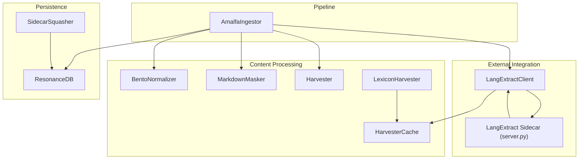
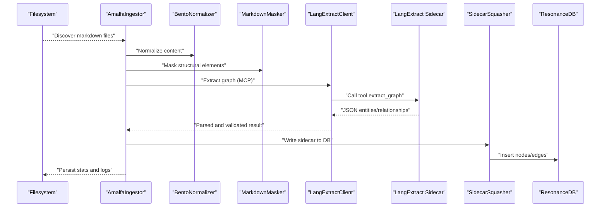
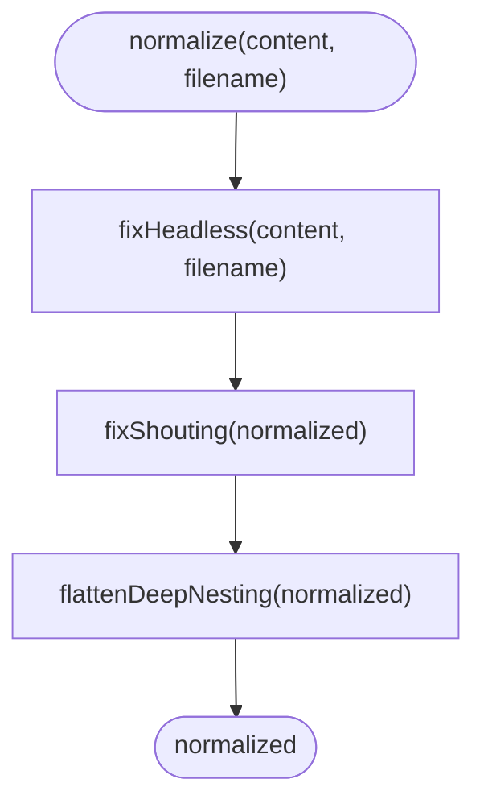
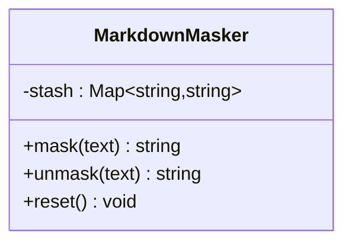
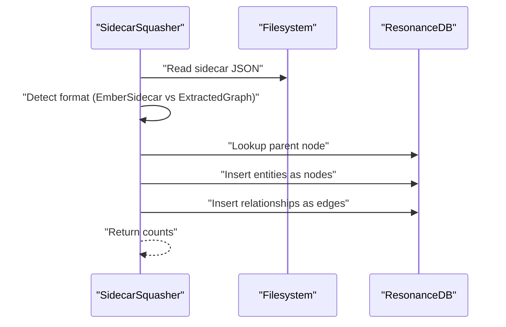
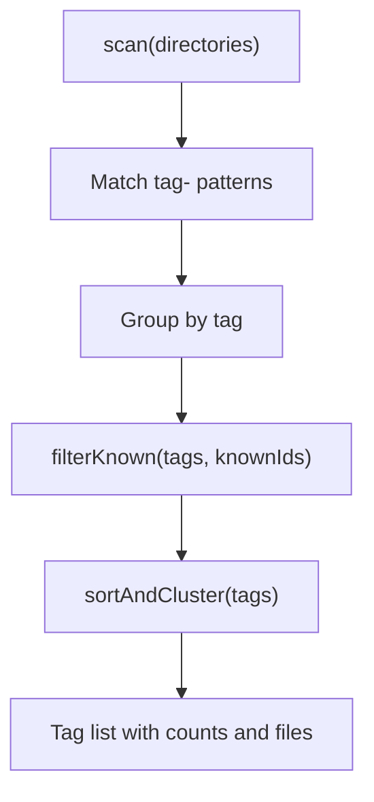
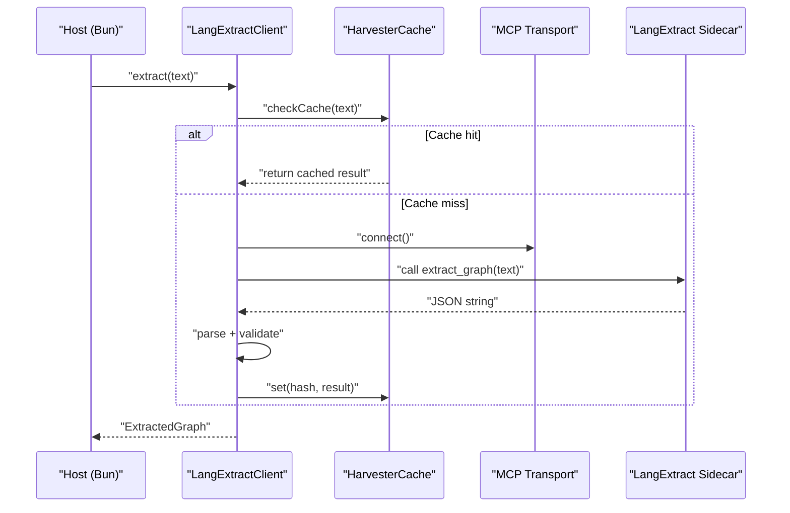
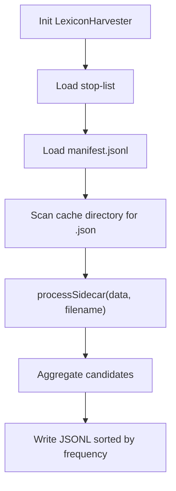
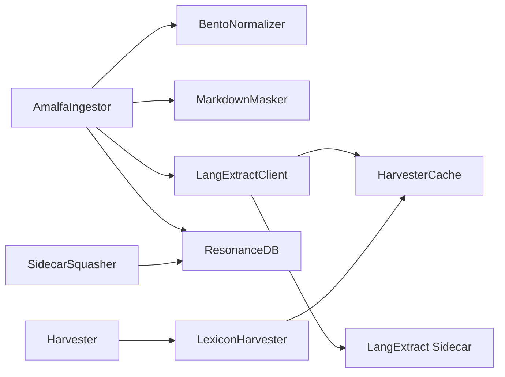

# Content Processing

<cite>
**Referenced Files in This Document**
- [BentoNormalizer.ts](file://src/core/BentoNormalizer.ts)
- [MarkdownMasker.ts](file://src/core/MarkdownMasker.ts)
- [SidecarSquasher.ts](file://src/core/SidecarSquasher.ts)
- [Harvester.ts](file://src/core/Harvester.ts)
- [HarvesterCache.ts](file://src/core/HarvesterCache.ts)
- [LangExtractClient.ts](file://src/services/LangExtractClient.ts)
- [server.py](file://src/sidecars/lang-extract/server.py)
- [AmalfaIngestor.ts](file://src/pipeline/AmalfaIngestor.ts)
- [LexiconHarvester.ts](file://src/core/LexiconHarvester.ts)
- [ContentHydrator.ts](file://src/utils/ContentHydrator.ts)
- [defaults.ts](file://src/config/defaults.ts)
- [sidecar.ts](file://src/types/sidecar.ts)
- [bento_normalizer.test.ts](file://tests/bento_normalizer.test.ts)
- [harvester.test.ts](file://tests/harvester.test.ts)
</cite>

## Table of Contents
1. [Introduction](#introduction)
2. [Project Structure](#project-structure)
3. [Core Components](#core-components)
4. [Architecture Overview](#architecture-overview)
5. [Detailed Component Analysis](#detailed-component-analysis)
6. [Dependency Analysis](#dependency-analysis)
7. [Performance Considerations](#performance-considerations)
8. [Troubleshooting Guide](#troubleshooting-guide)
9. [Conclusion](#conclusion)
10. [Appendices](#appendices)

## Introduction
This document explains Amalfa’s content processing components and their roles in transforming raw markdown documents into structured knowledge graph artifacts. It focuses on:
- Standardization and normalization of content chunks
- Extraction and processing of markdown content while preserving structure
- Integration with external sidecar services for advanced entity extraction
- Systematic harvesting of content and entities
- Transformation workflows, sanitization, validation, error handling, and fallbacks
- How these processors integrate into the broader ingestion pipeline

## Project Structure
The content processing layer spans core utilities, services, and pipeline orchestration:
- Core processors: BentoNormalizer, MarkdownMasker, SidecarSquasher, Harvester, LexiconHarvester
- Services: LangExtractClient (MCP-based sidecar integration)
- Pipeline: AmalfaIngestor orchestrates ingestion and edge weaving
- Utilities: ContentHydrator, HarvesterCache
- Types and configuration: sidecar types, defaults

**Diagram sources**
- [AmalfaIngestor.ts](file://src/pipeline/AmalfaIngestor.ts#L32-L441)
- [BentoNormalizer.ts](file://src/core/BentoNormalizer.ts#L1-L114)
- [MarkdownMasker.ts](file://src/core/MarkdownMasker.ts#L1-L50)
- [Harvester.ts](file://src/core/Harvester.ts#L1-L74)
- [LexiconHarvester.ts](file://src/core/LexiconHarvester.ts#L1-L176)
- [HarvesterCache.ts](file://src/core/HarvesterCache.ts#L1-L69)
- [LangExtractClient.ts](file://src/services/LangExtractClient.ts#L1-L354)
- [server.py](file://src/sidecars/lang-extract/server.py#L1-L226)
- [SidecarSquasher.ts](file://src/core/SidecarSquasher.ts#L1-L189)

**Section sources**
- [AmalfaIngestor.ts](file://src/pipeline/AmalfaIngestor.ts#L32-L441)
- [BentoNormalizer.ts](file://src/core/BentoNormalizer.ts#L1-L114)
- [MarkdownMasker.ts](file://src/core/MarkdownMasker.ts#L1-L50)
- [Harvester.ts](file://src/core/Harvester.ts#L1-L74)
- [LexiconHarvester.ts](file://src/core/LexiconHarvester.ts#L1-L176)
- [HarvesterCache.ts](file://src/core/HarvesterCache.ts#L1-L69)
- [LangExtractClient.ts](file://src/services/LangExtractClient.ts#L1-L354)
- [server.py](file://src/sidecars/lang-extract/server.py#L1-L226)
- [SidecarSquasher.ts](file://src/core/SidecarSquasher.ts#L1-L189)

## Core Components
- BentoNormalizer: Applies deterministic heuristics to standardize markdown headers, titles, and hierarchy.
- MarkdownMasker: Temporarily masks code blocks, inline code, and tables to preserve structure during downstream processing.
- SidecarSquasher: Loads sidecar JSON outputs and writes extracted entities/relationships into the graph database.
- Harvester: Scans markdown content for tags and filters known entities against a lexicon.
- LangExtractClient: Connects to a Python-based MCP sidecar to extract structured knowledge graphs and caches results.
- AmalfaIngestor: Orchestrates ingestion, embedding, and edge weaving; coordinates with sidecar extraction when available.

**Section sources**
- [BentoNormalizer.ts](file://src/core/BentoNormalizer.ts#L1-L114)
- [MarkdownMasker.ts](file://src/core/MarkdownMasker.ts#L1-L50)
- [SidecarSquasher.ts](file://src/core/SidecarSquasher.ts#L1-L189)
- [Harvester.ts](file://src/core/Harvester.ts#L1-L74)
- [LangExtractClient.ts](file://src/services/LangExtractClient.ts#L1-L354)
- [AmalfaIngestor.ts](file://src/pipeline/AmalfaIngestor.ts#L32-L441)

## Architecture Overview
The ingestion pipeline transforms markdown into a knowledge graph:
- Discovery: AmalfaIngestor discovers files and processes them in two passes (nodes, then edges).
- Normalization and masking: BentoNormalizer ensures consistent header structure; MarkdownMasker preserves structural elements during extraction.
- Extraction: LangExtractClient invokes a sidecar (via MCP) to produce structured entities/relationships; results are cached.
- Squashing: SidecarSquasher ingests sidecar outputs into the graph database.
- Lexicon building: LexiconHarvester aggregates sidecar candidates into a ranked lexicon.
- Hydration: ContentHydrator resolves content for search results.

**Diagram sources**
- [AmalfaIngestor.ts](file://src/pipeline/AmalfaIngestor.ts#L139-L309)
- [BentoNormalizer.ts](file://src/core/BentoNormalizer.ts#L100-L106)
- [MarkdownMasker.ts](file://src/core/MarkdownMasker.ts#L16-L28)
- [LangExtractClient.ts](file://src/services/LangExtractClient.ts#L248-L343)
- [server.py](file://src/sidecars/lang-extract/server.py#L198-L222)
- [SidecarSquasher.ts](file://src/core/SidecarSquasher.ts#L55-L187)

## Detailed Component Analysis

### BentoNormalizer
Purpose:
- Standardize content chunks for consistent processing by ensuring a proper title and flattening deep nesting.

Heuristics:
- Heuristic A (“Headless”): If no top-level heading exists, inject a title derived from the filename after frontmatter.
- Heuristic B (“Shouting”): If multiple top-level headings appear, demote subsequent ones to second-level headings.
- Heuristic C (“Deep Nesting”): Treat H4–H6 as emphasized content to simplify downstream processing.

Processing logic:
- Detect and skip frontmatter blocks.
- Insert title after frontmatter when applicable.
- Iterate lines to count and demote headings.
- Replace H4–H6 with bold emphasis.

**Diagram sources**
- [BentoNormalizer.ts](file://src/core/BentoNormalizer.ts#L100-L106)

Validation and tests:
- Unit tests confirm behavior for headless fixes, shouting demotion, and deep nesting flattening.

**Section sources**
- [BentoNormalizer.ts](file://src/core/BentoNormalizer.ts#L1-L114)
- [bento_normalizer.test.ts](file://tests/bento_normalizer.test.ts#L1-L41)

### MarkdownMasker
Purpose:
- Preserve structural elements (code blocks, inline code, tables) during extraction by temporarily replacing them with inert tokens.

Mechanics:
- Define regex patterns for fenced code blocks, inline code, and basic tables.
- Mask matches with unique tokens and stash originals.
- Unmask to restore content deterministically.

**Diagram sources**
- [MarkdownMasker.ts](file://src/core/MarkdownMasker.ts#L3-L49)

**Section sources**
- [MarkdownMasker.ts](file://src/core/MarkdownMasker.ts#L1-L50)

### SidecarSquasher
Purpose:
- Integrate sidecar outputs into the graph database by inserting nodes and edges.

Workflow:
- Glob for sidecar JSON files.
- Parse JSON, detect EmberSidecar vs raw ExtractedGraph format.
- Resolve parent node ID and verify existence.
- Insert entities as nodes with metadata and link to parent.
- Insert relationships as edges with confidence and provenance.
- Use transactions for atomicity.

**Diagram sources**
- [SidecarSquasher.ts](file://src/core/SidecarSquasher.ts#L18-L187)

**Section sources**
- [SidecarSquasher.ts](file://src/core/SidecarSquasher.ts#L1-L189)
- [sidecar.ts](file://src/types/sidecar.ts#L24-L29)

### Harvester
Purpose:
- Discover tags within markdown content and prepare them for lexicon enrichment.

Capabilities:
- Scan directories recursively for markdown files.
- Extract tag- tokens and group by tag.
- Filter known tags against a lexicon of known IDs.
- Sort by frequency for prioritization.

**Diagram sources**
- [Harvester.ts](file://src/core/Harvester.ts#L16-L72)

**Section sources**
- [Harvester.ts](file://src/core/Harvester.ts#L1-L74)
- [harvester.test.ts](file://tests/harvester.test.ts#L1-L34)

### LangExtractClient and Sidecar Integration
Purpose:
- Provide a robust extraction pipeline with caching, validation, and error handling.

Key behaviors:
- Provider selection precedence: environment variable > settings > default.
- Transport initialization via MCP stdio with uv-managed Python server.
- Extraction request with JSON parsing and Zod validation.
- Caching via HarvesterCache using content hash keys.
- Error parsing and user-friendly suggestions for API key, quota, and network issues.

**Diagram sources**
- [LangExtractClient.ts](file://src/services/LangExtractClient.ts#L49-L343)
- [HarvesterCache.ts](file://src/core/HarvesterCache.ts#L30-L63)
- [server.py](file://src/sidecars/lang-extract/server.py#L198-L222)

**Section sources**
- [LangExtractClient.ts](file://src/services/LangExtractClient.ts#L1-L354)
- [HarvesterCache.ts](file://src/core/HarvesterCache.ts#L1-L69)
- [server.py](file://src/sidecars/lang-extract/server.py#L1-L226)
- [defaults.ts](file://src/config/defaults.ts#L84-L143)

### LexiconHarvester
Purpose:
- Aggregate sidecar outputs into a ranked lexicon of candidate entities/concepts.

Workflow:
- Load stop-list and manifest (source mappings).
- Iterate sidecar JSON files, normalize terms, and track frequencies and sources.
- Write candidates to JSONL sorted by frequency.

**Diagram sources**
- [LexiconHarvester.ts](file://src/core/LexiconHarvester.ts#L83-L175)

**Section sources**
- [LexiconHarvester.ts](file://src/core/LexiconHarvester.ts#L1-L176)

### Content Hydrator
Purpose:
- Resolve content for search results by fetching from the graph gardener.

Usage:
- hydrate(result) adds content to a minimal result.
- hydrateMany(results) resolves multiple results concurrently.
- hydrateTop(results, limit) hydrates top K and leaves the rest unchanged.

**Section sources**
- [ContentHydrator.ts](file://src/utils/ContentHydrator.ts#L1-L39)

## Dependency Analysis
- AmalfaIngestor depends on:
  - BentoNormalizer and MarkdownMasker for preprocessing
  - LangExtractClient for advanced extraction
  - ResonanceDB for persistence and statistics
  - EdgeWeaver for post-processing edge creation
- LangExtractClient depends on:
  - MCP transport and Python sidecar
  - HarvesterCache for result caching
  - Zod schemas for structural validation
- SidecarSquasher depends on:
  - ResonanceDB for node/edge insertion
  - Project root utilities for path resolution
- Harvester and LexiconHarvester depend on:
  - Filesystem scanning and JSON processing
  - Stop-list and manifest for candidate filtering

**Diagram sources**
- [AmalfaIngestor.ts](file://src/pipeline/AmalfaIngestor.ts#L32-L441)
- [LangExtractClient.ts](file://src/services/LangExtractClient.ts#L1-L354)
- [HarvesterCache.ts](file://src/core/HarvesterCache.ts#L1-L69)
- [SidecarSquasher.ts](file://src/core/SidecarSquasher.ts#L1-L189)
- [LexiconHarvester.ts](file://src/core/LexiconHarvester.ts#L1-L176)
- [Harvester.ts](file://src/core/Harvester.ts#L1-L74)

**Section sources**
- [AmalfaIngestor.ts](file://src/pipeline/AmalfaIngestor.ts#L32-L441)
- [LangExtractClient.ts](file://src/services/LangExtractClient.ts#L1-L354)
- [HarvesterCache.ts](file://src/core/HarvesterCache.ts#L1-L69)
- [SidecarSquasher.ts](file://src/core/SidecarSquasher.ts#L1-L189)
- [LexiconHarvester.ts](file://src/core/LexiconHarvester.ts#L1-L176)
- [Harvester.ts](file://src/core/Harvester.ts#L1-L74)

## Performance Considerations
- Batch processing: AmalfaIngestor uses batch transactions to reduce database contention and WAL checkpoint overhead.
- Caching: HarvesterCache avoids redundant extractions by hashing content and storing JSON results.
- Minimal lock duration: Batch size tuned to prevent SQLITE_BUSY errors when external services are active.
- Streaming writes: SidecarSquasher uses prepared statements and transactions for efficient inserts.
- Tokenization and embedding: Lazy generation for short content to avoid unnecessary compute.

[No sources needed since this section provides general guidance]

## Troubleshooting Guide
Common issues and resolutions:
- Missing configuration:
  - Symptom: Startup failures due to missing settings file.
  - Resolution: Ensure amalfa.settings.json exists and conforms to schema.
- Sidecar not available:
  - Symptom: Advanced extraction disabled; logs indicate sidecar not detected.
  - Resolution: Confirm uv presence, sidecar directory, and server.py; set provider and API keys.
- API key errors:
  - Symptom: Substrate error indicating missing or invalid API key.
  - Resolution: Set appropriate environment variables per provider; review suggestions in logs.
- Network or quota errors:
  - Symptom: Provider timeouts or credit limits.
  - Resolution: Check connectivity, adjust provider/model, or switch provider.
- Malformed sidecar JSON:
  - Symptom: Invalid JSON or unknown format; warnings logged.
  - Resolution: Validate sidecar output; ensure JSON is parsable and matches expected schema.
- Parent node missing:
  - Symptom: Skipping squash when parent does not exist.
  - Resolution: Ensure parent node is ingested prior to squashing.

**Section sources**
- [defaults.ts](file://src/config/defaults.ts#L84-L143)
- [LangExtractClient.ts](file://src/services/LangExtractClient.ts#L106-L186)
- [SidecarSquasher.ts](file://src/core/SidecarSquasher.ts#L96-L104)

## Conclusion
Amalfa’s content processing stack combines deterministic normalization, structural preservation, and robust external integration to produce high-quality knowledge graph artifacts. BentoNormalizer and MarkdownMasker ensure consistent input; LangExtractClient and the Python sidecar deliver structured extraction with caching and validation; SidecarSquasher and AmalfaIngestor integrate results into the graph; Harvester and LexiconHarvester support discovery and lexicon enrichment. Together, these components form a resilient ingestion pipeline with strong error handling and performance-conscious design.

[No sources needed since this section summarizes without analyzing specific files]

## Appendices
- Provider configuration precedence and environment variables are documented in the sidecar README and LangExtractClient.
- Tests validate normalization behavior and tag filtering logic.

**Section sources**
- [server.py](file://src/sidecars/lang-extract/server.py#L1-L186)
- [bento_normalizer.test.ts](file://tests/bento_normalizer.test.ts#L1-L41)
- [harvester.test.ts](file://tests/harvester.test.ts#L1-L34)