# Data Flow and Processing

<cite>
**Referenced Files in This Document**
- [AmalfaIngestor.ts](file://src/pipeline/AmalfaIngestor.ts)
- [EdgeWeaver.ts](file://src/core/EdgeWeaver.ts)
- [VectorEngine.ts](file://src/core/VectorEngine.ts)
- [embedder.ts](file://src/resonance/services/embedder.ts)
- [db.ts](file://src/resonance/db.ts)
- [schema.ts](file://src/resonance/drizzle/schema.ts)
- [GraphEngine.ts](file://src/core/GraphEngine.ts)
- [GraphGardener.ts](file://src/core/GraphGardener.ts)
- [DatabaseFactory.ts](file://src/resonance/DatabaseFactory.ts)
- [JsonlUtils.ts](file://src/utils/JsonlUtils.ts)
- [PipelineTelemetry.ts](file://src/services/PipelineTelemetry.ts)
- [ingestion-pipeline.md](file://docs/architecture/ingestion-pipeline.md)
- [embeddings-and-fafcas-protocol-playbook.md](file://playbooks/embeddings-and-fafcas-protocol-playbook.md)
- [03-fafcas-fix.ts](file://src/pipeline/cross-domain/03-fafcas-fix.ts)
- [harvester.ts](file://src/core/Harvester.ts)
- [ContentHydrator.ts](file://src/utils/ContentHydrator.ts)
</cite>

## Table of Contents
1. [Introduction](#introduction)
2. [Project Structure](#project-structure)
3. [Core Components](#core-components)
4. [Architecture Overview](#architecture-overview)
5. [Detailed Component Analysis](#detailed-component-analysis)
6. [Dependency Analysis](#dependency-analysis)
7. [Performance Considerations](#performance-considerations)
8. [Troubleshooting Guide](#troubleshooting-guide)
9. [Conclusion](#conclusion)

## Introduction
This document explains Amalfa’s data flow architecture and processing pipelines for transforming raw markdown documents into a semantic knowledge graph. It covers:
- Two-pass ingestion: nodes first, then edges and relationships
- Hollow node design: metadata in SQLite, content in the filesystem
- FAFCAS protocol: vector normalization and in-memory search
- Transformation flows, intermediate representations, and state management
- Error handling, retries, and validation
- Performance characteristics, batching, and memory management

## Project Structure
The ingestion pipeline centers around a single orchestrator that discovers files, processes them in two passes, and integrates with vector and graph engines. Supporting components handle embedding generation, database operations, telemetry, and content hydration.

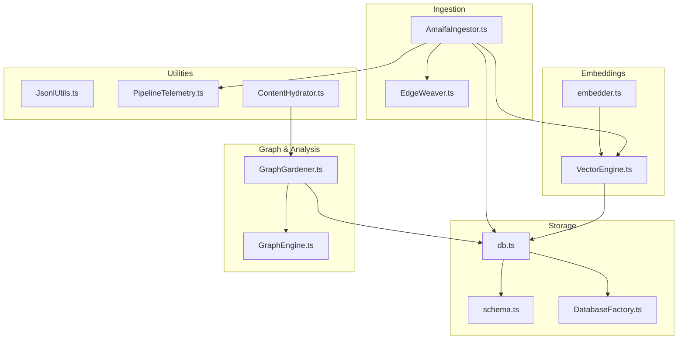

**Diagram sources**
- [AmalfaIngestor.ts](file://src/pipeline/AmalfaIngestor.ts#L1-L441)
- [EdgeWeaver.ts](file://src/core/EdgeWeaver.ts#L1-L194)
- [VectorEngine.ts](file://src/core/VectorEngine.ts#L1-L242)
- [embedder.ts](file://src/resonance/services/embedder.ts#L1-L126)
- [db.ts](file://src/resonance/db.ts#L66-L372)
- [schema.ts](file://src/resonance/drizzle/schema.ts#L1-L51)
- [GraphEngine.ts](file://src/core/GraphEngine.ts#L1-L314)
- [GraphGardener.ts](file://src/core/GraphGardener.ts#L1-L270)
- [DatabaseFactory.ts](file://src/resonance/DatabaseFactory.ts#L1-L103)
- [JsonlUtils.ts](file://src/utils/JsonlUtils.ts#L1-L101)
- [PipelineTelemetry.ts](file://src/services/PipelineTelemetry.ts#L1-L42)
- [ContentHydrator.ts](file://src/utils/ContentHydrator.ts#L1-L39)

**Section sources**
- [ingestion-pipeline.md](file://docs/architecture/ingestion-pipeline.md#L1-L226)

## Core Components
- AmalfaIngestor: Discovers markdown files, performs two-pass ingestion, manages transactions, and coordinates edge weaving.
- EdgeWeaver: Extracts explicit relationships from content and inserts edges into the database.
- VectorEngine: Generates FAFCAS-compliant embeddings and performs fast dot-product similarity search.
- Embedder: Chooses between remote daemon and local model for embedding generation.
- ResonanceDB: Manages SQLite storage with hollow nodes and FAFCAS vector blobs.
- GraphEngine: Loads graph from database for in-memory analysis and metrics.
- GraphGardener: Bridges semantic similarity and structural topology to suggest missing edges.
- DatabaseFactory: Enforces SQLite standards and concurrency settings.
- Utilities: Telemetry, JSONL streaming, and content hydration.

**Section sources**
- [AmalfaIngestor.ts](file://src/pipeline/AmalfaIngestor.ts#L32-L309)
- [EdgeWeaver.ts](file://src/core/EdgeWeaver.ts#L5-L59)
- [VectorEngine.ts](file://src/core/VectorEngine.ts#L76-L242)
- [embedder.ts](file://src/resonance/services/embedder.ts#L9-L126)
- [db.ts](file://src/resonance/db.ts#L83-L103)
- [GraphEngine.ts](file://src/core/GraphEngine.ts#L39-L100)
- [GraphGardener.ts](file://src/core/GraphGardener.ts#L27-L150)
- [DatabaseFactory.ts](file://src/resonance/DatabaseFactory.ts#L13-L66)
- [PipelineTelemetry.ts](file://src/services/PipelineTelemetry.ts#L17-L42)

## Architecture Overview
The ingestion pipeline follows a deterministic, transactional flow:
- Discovery: Glob-based scanning of source directories with exclusion filters
- Pass 1 (Nodes): For each file, parse frontmatter, compute hash, generate embedding if content is long enough, extract tokens, and insert node
- Pass 2 (Edges): Build lexicon from existing nodes and weave explicit relationships
- Finalization: WAL checkpoint and statistics reporting

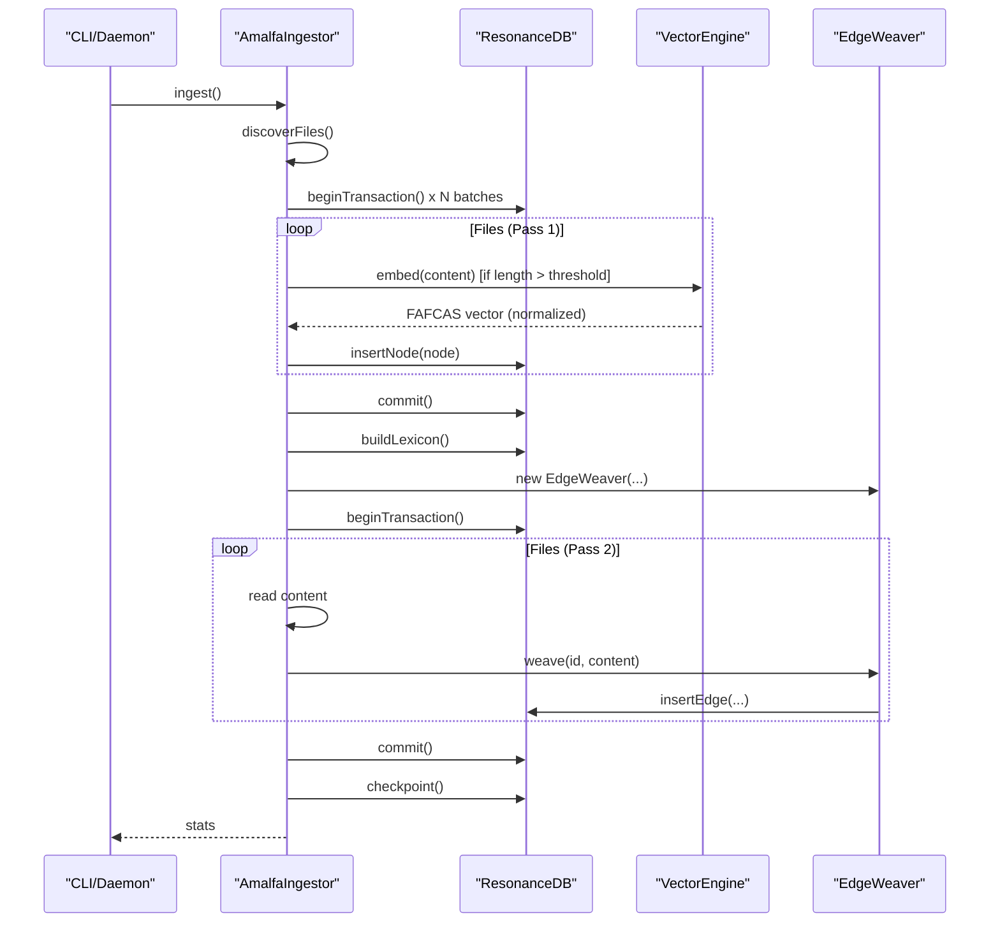

**Diagram sources**
- [AmalfaIngestor.ts](file://src/pipeline/AmalfaIngestor.ts#L139-L309)
- [EdgeWeaver.ts](file://src/core/EdgeWeaver.ts#L54-L59)
- [VectorEngine.ts](file://src/core/VectorEngine.ts#L115-L139)
- [db.ts](file://src/resonance/db.ts#L349-L367)

**Section sources**
- [ingestion-pipeline.md](file://docs/architecture/ingestion-pipeline.md#L34-L58)

## Detailed Component Analysis

### Two-Pass Ingestion Strategy
- Pass 1 (Nodes): All nodes are inserted without edges to ensure the lexicon is fully populated before relationship discovery.
- Pass 2 (Edges): Relationships are woven using the lexicon built from nodes. Transactions are used to maintain atomicity and reduce contention.

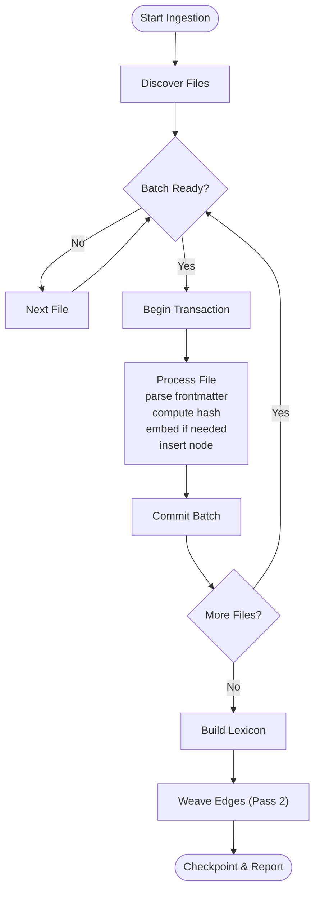

**Diagram sources**
- [AmalfaIngestor.ts](file://src/pipeline/AmalfaIngestor.ts#L182-L253)

**Section sources**
- [AmalfaIngestor.ts](file://src/pipeline/AmalfaIngestor.ts#L182-L253)

### Hollow Node Design Pattern
- Nodes store metadata and FAFCAS vectors in SQLite; content is stored on disk and hydrated on demand.
- The database schema reflects the “hollow” nature by excluding content from the nodes table.
- GraphGardener resolves source paths from metadata and reads content from the filesystem.

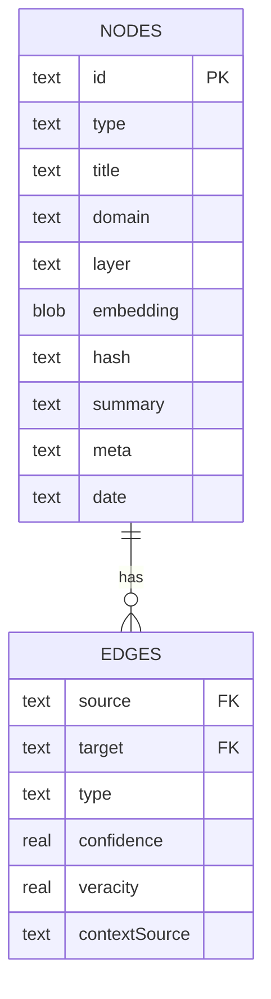

**Diagram sources**
- [schema.ts](file://src/resonance/drizzle/schema.ts#L16-L51)
- [db.ts](file://src/resonance/db.ts#L88-L91)
- [GraphGardener.ts](file://src/core/GraphGardener.ts#L229-L254)

**Section sources**
- [db.ts](file://src/resonance/db.ts#L83-L103)
- [schema.ts](file://src/resonance/drizzle/schema.ts#L16-L28)
- [GraphGardener.ts](file://src/core/GraphGardener.ts#L229-L254)

### FAFCAS Protocol Implementation
- Vectors are generated and normalized to unit length before storage.
- Stored as raw byte blobs in SQLite; similarity is computed via dot product in-memory.
- A dedicated script validates and normalizes existing vectors to FAFCAS compliance.

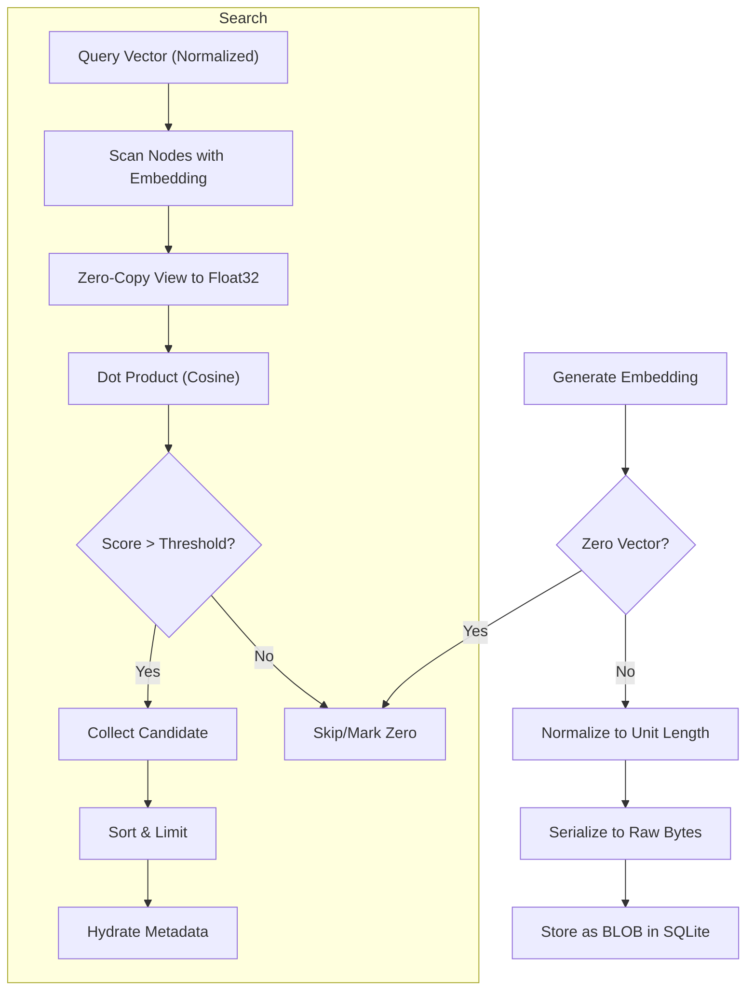

**Diagram sources**
- [embedder.ts](file://src/resonance/services/embedder.ts#L97-L100)
- [VectorEngine.ts](file://src/core/VectorEngine.ts#L17-L37)
- [VectorEngine.ts](file://src/core/VectorEngine.ts#L159-L240)
- [embeddings-and-fafcas-protocol-playbook.md](file://playbooks/embeddings-and-fafcas-protocol-playbook.md#L18-L140)
- [03-fafcas-fix.ts](file://src/pipeline/cross-domain/03-fafcas-fix.ts#L43-L93)

**Section sources**
- [embeddings-and-fafcas-protocol-playbook.md](file://playbooks/embeddings-and-fafcas-protocol-playbook.md#L18-L140)
- [VectorEngine.ts](file://src/core/VectorEngine.ts#L17-L37)
- [VectorEngine.ts](file://src/core/VectorEngine.ts#L159-L240)
- [03-fafcas-fix.ts](file://src/pipeline/cross-domain/03-fafcas-fix.ts#L43-L93)

### Content Extraction, Enrichment, and Graph Construction
- Extraction: Frontmatter parsing, semantic token extraction, and markdown link/wikilink discovery.
- Enrichment: Embedding generation, optional sidecar extraction, and metadata augmentation.
- Graph construction: Node insertion and explicit edge weaving with LouvainGate filtering.

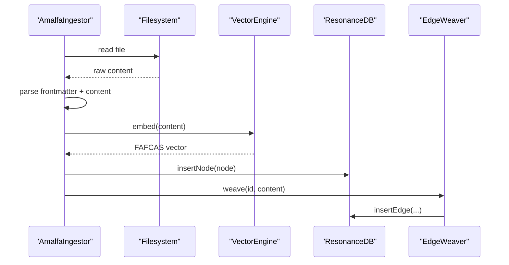

**Diagram sources**
- [AmalfaIngestor.ts](file://src/pipeline/AmalfaIngestor.ts#L375-L439)
- [EdgeWeaver.ts](file://src/core/EdgeWeaver.ts#L54-L59)
- [VectorEngine.ts](file://src/core/VectorEngine.ts#L115-L139)

**Section sources**
- [AmalfaIngestor.ts](file://src/pipeline/AmalfaIngestor.ts#L375-L439)
- [EdgeWeaver.ts](file://src/core/EdgeWeaver.ts#L54-L59)

### Relationship Discovery and Edge Weaving
- Explicit relationships: wiki-links, markdown links, and metadata tags.
- Lexicon-driven resolution: slugification and ID mapping enable robust linking.
- Safety gate: LouvainGate prevents super-node collapse by rejecting high-degree edges.

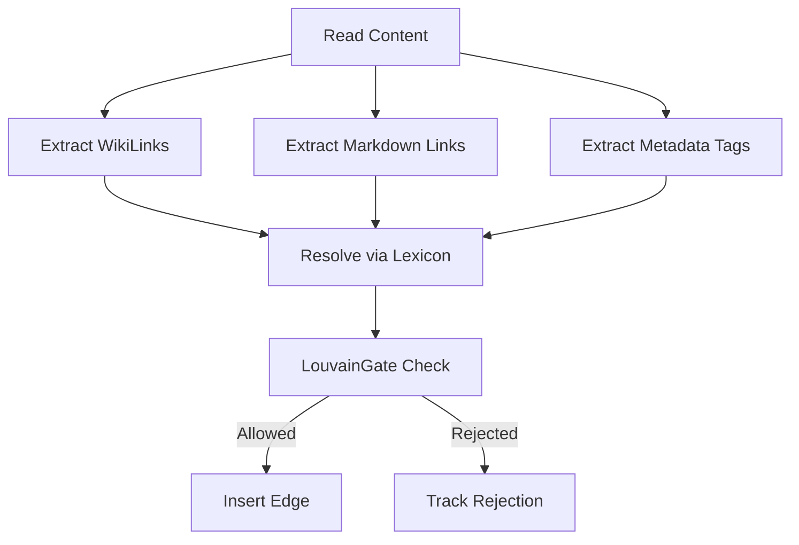

**Diagram sources**
- [EdgeWeaver.ts](file://src/core/EdgeWeaver.ts#L122-L166)
- [EdgeWeaver.ts](file://src/core/EdgeWeaver.ts#L168-L181)

**Section sources**
- [EdgeWeaver.ts](file://src/core/EdgeWeaver.ts#L54-L59)
- [EdgeWeaver.ts](file://src/core/EdgeWeaver.ts#L122-L166)
- [EdgeWeaver.ts](file://src/core/EdgeWeaver.ts#L168-L181)

### State Management and Transactions
- Batched transactions minimize lock contention and improve throughput.
- WAL checkpoint ensures durability and integrity checks verify file presence and size.

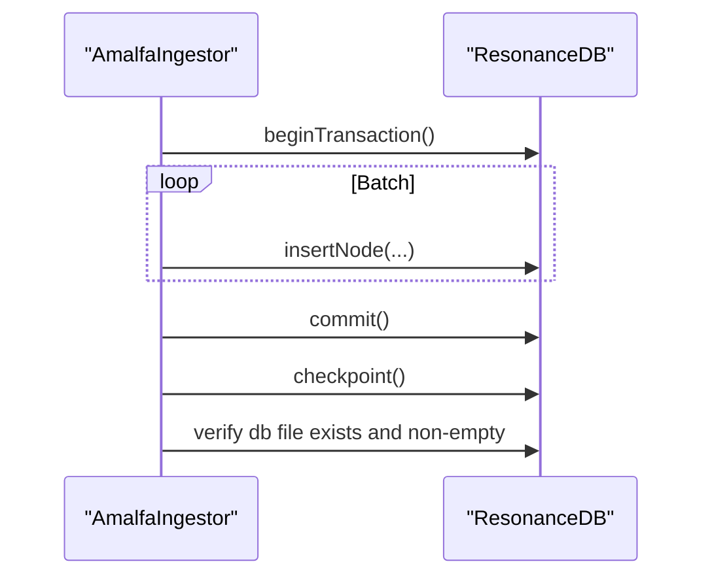

**Diagram sources**
- [AmalfaIngestor.ts](file://src/pipeline/AmalfaIngestor.ts#L196-L220)
- [AmalfaIngestor.ts](file://src/pipeline/AmalfaIngestor.ts#L251-L270)
- [db.ts](file://src/resonance/db.ts#L349-L367)

**Section sources**
- [AmalfaIngestor.ts](file://src/pipeline/AmalfaIngestor.ts#L186-L220)
- [AmalfaIngestor.ts](file://src/pipeline/AmalfaIngestor.ts#L251-L270)
- [db.ts](file://src/resonance/db.ts#L349-L367)

### Data Transformation Flows and Intermediate Representations
- Raw content → parsed frontmatter + body
- Content → embedding (Float32Array) → FAFCAS blob (Uint8Array)
- Nodes: id, type, label, domain, layer, embedding, hash, meta
- Edges: composite primary key (source, target, type) with confidence and veracity
- Telemetry: stage metrics for discovery, sync, embedding, weaving, enrichment

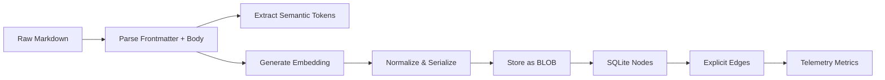

**Diagram sources**
- [AmalfaIngestor.ts](file://src/pipeline/AmalfaIngestor.ts#L400-L430)
- [VectorEngine.ts](file://src/core/VectorEngine.ts#L115-L139)
- [embedder.ts](file://src/resonance/services/embedder.ts#L97-L100)
- [schema.ts](file://src/resonance/drizzle/schema.ts#L16-L51)
- [PipelineTelemetry.ts](file://src/services/PipelineTelemetry.ts#L27-L38)

**Section sources**
- [AmalfaIngestor.ts](file://src/pipeline/AmalfaIngestor.ts#L400-L430)
- [VectorEngine.ts](file://src/core/VectorEngine.ts#L115-L139)
- [embedder.ts](file://src/resonance/services/embedder.ts#L97-L100)
- [schema.ts](file://src/resonance/drizzle/schema.ts#L16-L51)
- [PipelineTelemetry.ts](file://src/services/PipelineTelemetry.ts#L27-L38)

### Content Hydration and Search Hydration
- ContentHydrator reads content from filesystem via GraphGardener for display or downstream processing.
- VectorEngine hydrates metadata for top-K results without loading full content.

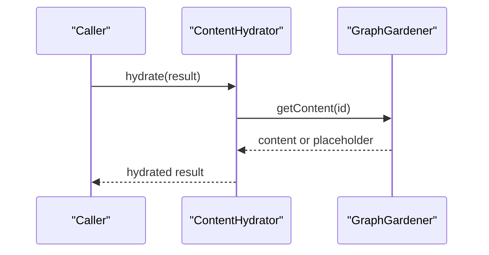

**Diagram sources**
- [ContentHydrator.ts](file://src/utils/ContentHydrator.ts#L16-L26)
- [GraphGardener.ts](file://src/core/GraphGardener.ts#L229-L254)

**Section sources**
- [ContentHydrator.ts](file://src/utils/ContentHydrator.ts#L16-L26)
- [GraphGardener.ts](file://src/core/GraphGardener.ts#L229-L254)

## Dependency Analysis
- AmalfaIngestor depends on Embedder for vectors, EdgeWeaver for relationships, and ResonanceDB for persistence.
- VectorEngine depends on fastembed and stores FAFCAS-compliant vectors.
- GraphEngine loads from ResonanceDB for in-memory analytics.
- GraphGardener bridges vector search and graph topology to propose missing edges.
- DatabaseFactory enforces SQLite configuration for concurrency and integrity.

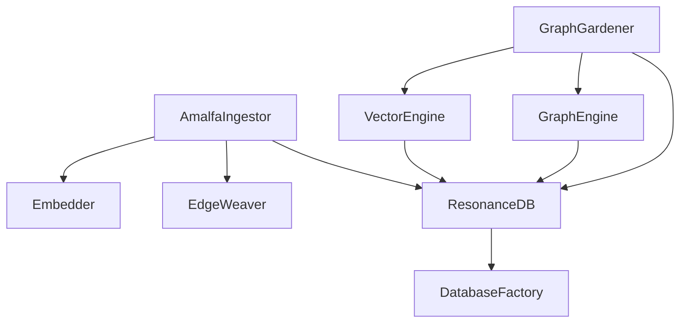

**Diagram sources**
- [AmalfaIngestor.ts](file://src/pipeline/AmalfaIngestor.ts#L36-L39)
- [embedder.ts](file://src/resonance/services/embedder.ts#L9-L126)
- [EdgeWeaver.ts](file://src/core/EdgeWeaver.ts#L1-L10)
- [db.ts](file://src/resonance/db.ts#L66-L81)
- [GraphEngine.ts](file://src/core/GraphEngine.ts#L50-L100)
- [GraphGardener.ts](file://src/core/GraphGardener.ts#L27-L32)
- [DatabaseFactory.ts](file://src/resonance/DatabaseFactory.ts#L13-L66)

**Section sources**
- [AmalfaIngestor.ts](file://src/pipeline/AmalfaIngestor.ts#L36-L39)
- [embedder.ts](file://src/resonance/services/embedder.ts#L9-L126)
- [EdgeWeaver.ts](file://src/core/EdgeWeaver.ts#L1-L10)
- [db.ts](file://src/resonance/db.ts#L66-L81)
- [GraphEngine.ts](file://src/core/GraphEngine.ts#L50-L100)
- [GraphGardener.ts](file://src/core/GraphGardener.ts#L27-L32)
- [DatabaseFactory.ts](file://src/resonance/DatabaseFactory.ts#L13-L66)

## Performance Considerations
- Two-pass ingestion reduces edge conflicts and improves correctness.
- Batched transactions (size tuned to avoid SQLITE_BUSY) improve throughput.
- FAFCAS dot-product search avoids sqrt/div operations and minimizes IO by loading only IDs and embeddings.
- SQLite WAL mode, busy_timeout, and synchronous settings are enforced for concurrency and durability.
- Embedding generation prioritizes daemon fallback to reduce local overhead.

Recommendations:
- Keep BATCH_SIZE tuned to concurrent access patterns.
- Prefer daemon embedding for large-scale ingestion.
- Use FAFCAS normalization to ensure unit vectors and fast similarity.
- Monitor telemetry stages to identify bottlenecks.

**Section sources**
- [AmalfaIngestor.ts](file://src/pipeline/AmalfaIngestor.ts#L186-L220)
- [VectorEngine.ts](file://src/core/VectorEngine.ts#L159-L240)
- [DatabaseFactory.ts](file://src/resonance/DatabaseFactory.ts#L44-L66)
- [PipelineTelemetry.ts](file://src/services/PipelineTelemetry.ts#L27-L38)

## Troubleshooting Guide
Common issues and mitigations:
- Missing or empty database file after checkpoint: integrity check verifies existence and non-zero size.
- SQLITE_BUSY errors: reduced batch size and transaction boundaries help.
- Vector normalization anomalies: run the FAFCAS fix script to normalize existing vectors.
- JSONL parsing errors: use JsonlUtils helpers to safely stream and parse records.
- Content hydration failures: GraphGardener resolves absolute paths from root-relative metadata.

Actions:
- Verify WAL checkpoint completion and database file health.
- Re-run FAFCAS normalization if similarity scores appear inconsistent.
- Use JsonlUtils to validate and process JSONL artifacts.
- Confirm root-relative paths are correctly converted to absolute for content reads.

**Section sources**
- [AmalfaIngestor.ts](file://src/pipeline/AmalfaIngestor.ts#L255-L270)
- [03-fafcas-fix.ts](file://src/pipeline/cross-domain/03-fafcas-fix.ts#L43-L93)
- [JsonlUtils.ts](file://src/utils/JsonlUtils.ts#L55-L75)
- [GraphGardener.ts](file://src/core/GraphGardener.ts#L205-L222)

## Conclusion
Amalfa’s ingestion pipeline is a robust, transactional, and scalable system that:
- Ensures correctness via two-pass ingestion and explicit lexicon-driven edge weaving
- Maintains performance with FAFCAS vectors and in-memory search
- Preserves flexibility with hollow nodes and filesystem-backed content
- Enforces reliability through standardized SQLite configuration, telemetry, and integrity checks