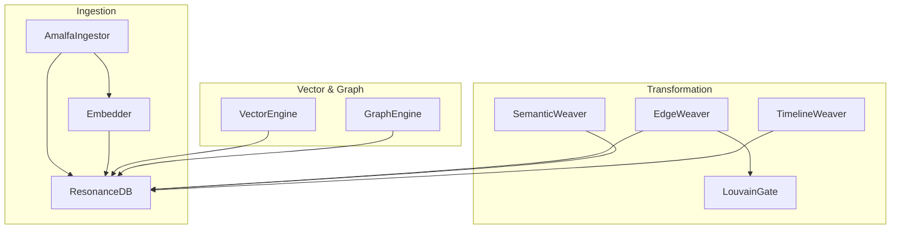
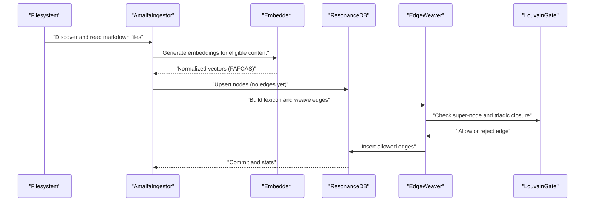
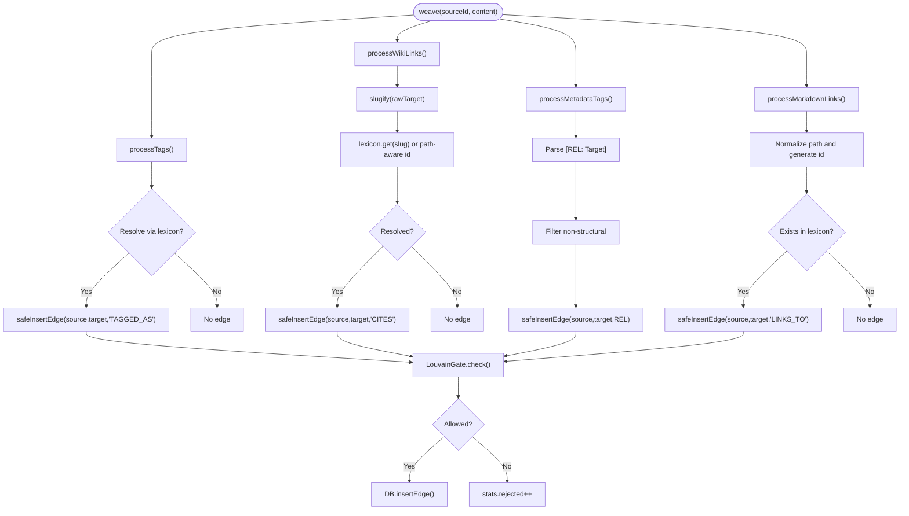
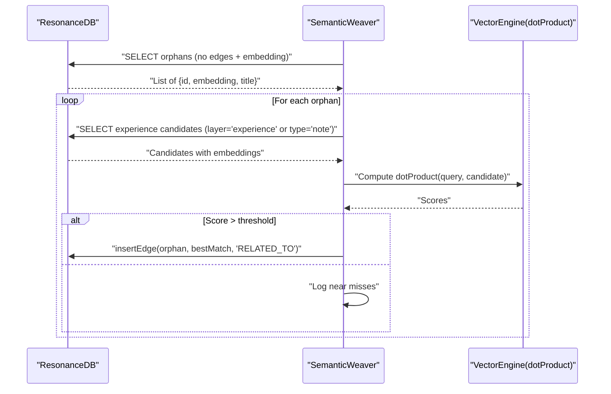
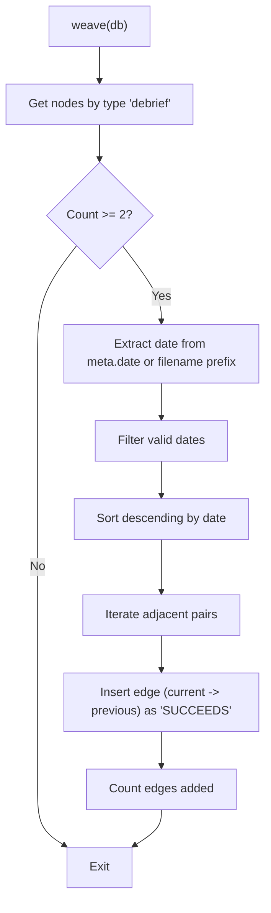
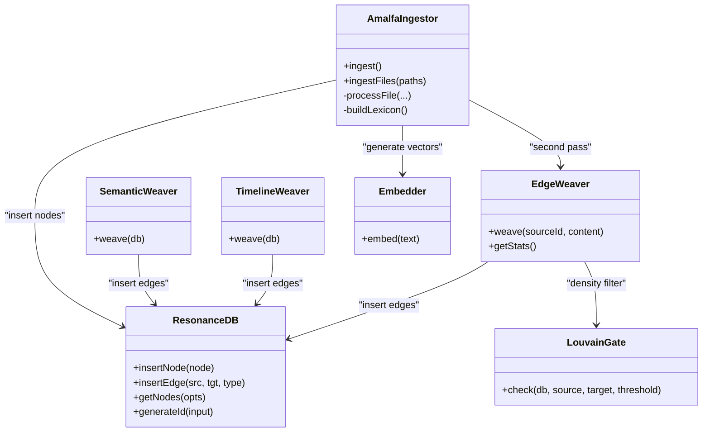
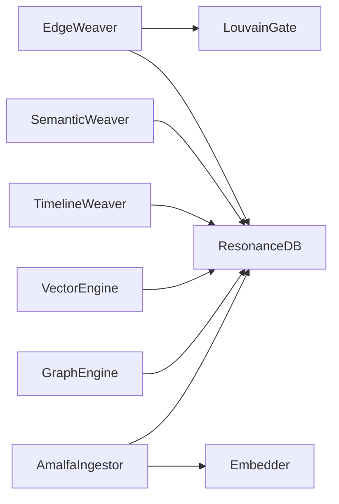
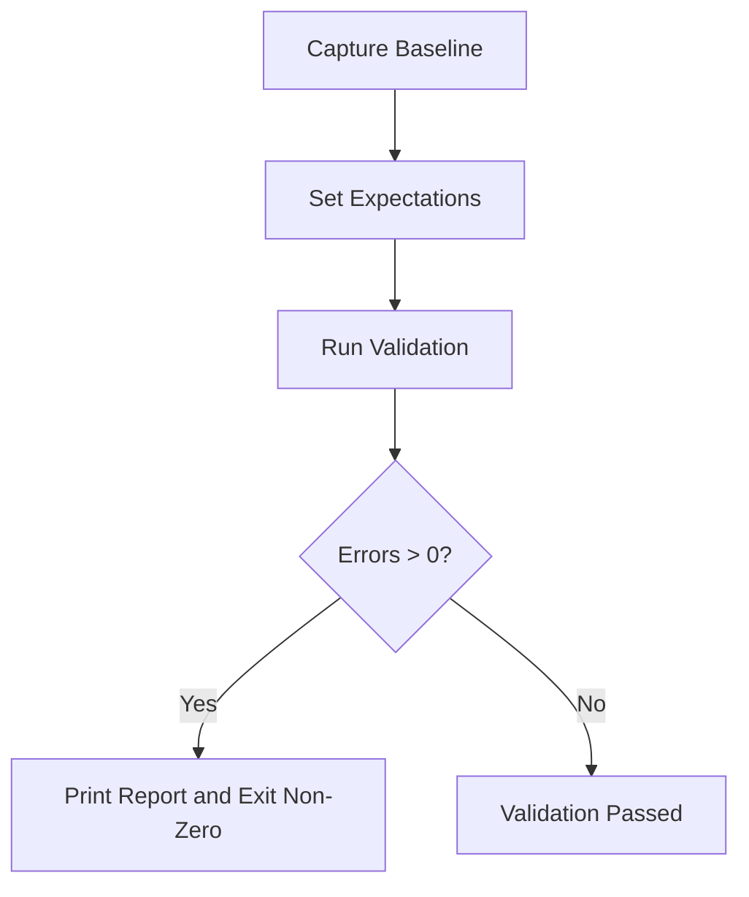

# Data Transformation

<cite>
**Referenced Files in This Document**
- [EdgeWeaver.ts](file://src/core/EdgeWeaver.ts)
- [SemanticWeaver.ts](file://src/core/SemanticWeaver.ts)
- [TimelineWeaver.ts](file://src/core/TimelineWeaver.ts)
- [FractureLogic.ts](file://src/core/FractureLogic.ts)
- [LouvainGate.ts](file://src/core/LouvainGate.ts)
- [VectorEngine.ts](file://src/core/VectorEngine.ts)
- [GraphEngine.ts](file://src/core/GraphEngine.ts)
- [db.ts](file://src/resonance/db.ts)
- [AmalfaIngestor.ts](file://src/pipeline/AmalfaIngestor.ts)
- [the-weavers-handbook.md](file://playbooks/the-weavers-handbook.md)
- [validator.ts](file://src/utils/validator.ts)
- [validate_db.ts](file://scripts/verify/validate_db.ts)
- [verify_timeline.ts](file://scripts/verify/verify_timeline.ts)
- [verify_graph_integrity.ts](file://scripts/verify/verify_graph_integrity.ts)
- [embedder.ts](file://src/resonance/services/embedder.ts)
- [enriched-cda.ts](file://src/resonance/types/enriched-cda.ts)
</cite>

## Table of Contents
1. [Introduction](#introduction)
2. [Project Structure](#project-structure)
3. [Core Components](#core-components)
4. [Architecture Overview](#architecture-overview)
5. [Detailed Component Analysis](#detailed-component-analysis)
6. [Dependency Analysis](#dependency-analysis)
7. [Performance Considerations](#performance-considerations)
8. [Troubleshooting Guide](#troubleshooting-guide)
9. [Conclusion](#conclusion)
10. [Appendices](#appendices)

## Introduction
This document explains Amalfa’s data transformation processes with a focus on four key “Weavers” and their workflows:
- EdgeWeaver: Discovers and establishes semantic relationships between content chunks using explicit markup, wiki-links, and metadata blocks.
- SemanticWeaver: Rescues orphan nodes by connecting them to semantically similar “experience” nodes using vector similarity.
- TimelineWeaver: Chronologically orders debriefs by extracting dates and linking them with a successor relationship.
- FractureLogic: Provides fragmentation and recombination strategies for content chunking using regex heuristics.

It also covers transformation workflows, data mapping, quality metrics, validation, consistency checks, error propagation, and how transformed data preserves referential integrity while enabling efficient querying.

## Project Structure
The transformation pipeline spans ingestion, edge weaving, semantic rescue, timeline stitching, and validation. The following diagram maps major components and their interactions.

**Diagram sources**
- [AmalfaIngestor.ts](file://src/pipeline/AmalfaIngestor.ts#L32-L309)
- [db.ts](file://src/resonance/db.ts#L25-L431)
- [EdgeWeaver.ts](file://src/core/EdgeWeaver.ts#L5-L194)
- [SemanticWeaver.ts](file://src/core/SemanticWeaver.ts#L3-L97)
- [TimelineWeaver.ts](file://src/core/TimelineWeaver.ts#L3-L62)
- [LouvainGate.ts](file://src/core/LouvainGate.ts#L3-L68)
- [VectorEngine.ts](file://src/core/VectorEngine.ts#L76-L242)
- [GraphEngine.ts](file://src/core/GraphEngine.ts#L39-L314)

**Section sources**
- [AmalfaIngestor.ts](file://src/pipeline/AmalfaIngestor.ts#L32-L309)
- [db.ts](file://src/resonance/db.ts#L25-L431)

## Core Components
- EdgeWeaver: Scans content for explicit tags, wiki-links, metadata blocks, and markdown links, resolves targets via a lexicon, and inserts edges subject to LouvainGate filtering.
- SemanticWeaver: Finds orphan nodes (no incoming/outgoing edges with available embeddings) and connects them to similar “experience” nodes using cosine similarity on FAFCAS-normalized vectors.
- TimelineWeaver: Identifies debrief nodes, extracts temporal anchors from metadata or filenames, sorts chronologically, and adds successor edges.
- FractureLogic: Supplies regex patterns to fragment content into meaningful chunks based on structural pivots, enumerations, digressions, and sentence boundaries.

**Section sources**
- [EdgeWeaver.ts](file://src/core/EdgeWeaver.ts#L5-L194)
- [SemanticWeaver.ts](file://src/core/SemanticWeaver.ts#L3-L97)
- [TimelineWeaver.ts](file://src/core/TimelineWeaver.ts#L3-L62)
- [FractureLogic.ts](file://src/core/FractureLogic.ts#L1-L23)

## Architecture Overview
The transformation architecture integrates ingestion, edge creation, semantic rescue, and timeline ordering. It enforces structural and density constraints via LouvainGate and validates outcomes using dedicated scripts and a pipeline validator.

**Diagram sources**
- [AmalfaIngestor.ts](file://src/pipeline/AmalfaIngestor.ts#L139-L309)
- [embedder.ts](file://src/resonance/services/embedder.ts#L80-L124)
- [db.ts](file://src/resonance/db.ts#L83-L184)
- [EdgeWeaver.ts](file://src/core/EdgeWeaver.ts#L54-L194)
- [LouvainGate.ts](file://src/core/LouvainGate.ts#L15-L36)

## Detailed Component Analysis

### EdgeWeaver: Discovery and Establishment of Semantic Relationships
EdgeWeaver performs strict, explicit discovery:
- Explicit tags: Parses [tag: Concept] syntax and maps to concept IDs via a slugified lexicon.
- Legacy tags: Warns on tag-slug format and converts to exemplification edges.
- Metadata blocks: Processes HTML comment blocks containing relation tuples and filters out non-structural tags.
- Wiki-links: Converts [[Target]] to edges, using path-aware ID generation when needed.
- Markdown links: Converts internal [text](relative.md) links to edges, excluding absolute URLs.

It uses LouvainGate to filter edges to prevent excessive clustering around high-degree nodes.

**Diagram sources**
- [EdgeWeaver.ts](file://src/core/EdgeWeaver.ts#L54-L194)
- [LouvainGate.ts](file://src/core/LouvainGate.ts#L15-L36)
- [db.ts](file://src/resonance/db.ts#L140-L159)

**Section sources**
- [EdgeWeaver.ts](file://src/core/EdgeWeaver.ts#L5-L194)
- [LouvainGate.ts](file://src/core/LouvainGate.ts#L3-L68)
- [db.ts](file://src/resonance/db.ts#L140-L159)

### SemanticWeaver: Semantic Rescue of Orphans
SemanticWeaver rescues nodes with no edges and available embeddings by linking them to semantically similar “experience” nodes using FAFCAS-normalized vectors and cosine similarity.

**Diagram sources**
- [SemanticWeaver.ts](file://src/core/SemanticWeaver.ts#L4-L96)
- [db.ts](file://src/resonance/db.ts#L448-L464)
- [VectorEngine.ts](file://src/core/VectorEngine.ts#L58-L74)

**Section sources**
- [SemanticWeaver.ts](file://src/core/SemanticWeaver.ts#L3-L97)
- [db.ts](file://src/resonance/db.ts#L448-L464)
- [VectorEngine.ts](file://src/core/VectorEngine.ts#L58-L74)

### TimelineWeaver: Temporal Ordering
TimelineWeaver identifies debrief nodes, extracts dates from metadata or filename prefixes, sorts chronologically, and links them with a successor relationship.

**Diagram sources**
- [TimelineWeaver.ts](file://src/core/TimelineWeaver.ts#L4-L61)

**Section sources**
- [TimelineWeaver.ts](file://src/core/TimelineWeaver.ts#L3-L62)

### FractureLogic: Content Fragmentation and Recombination
FractureLogic defines regex heuristics for splitting text into coherent chunks:
- Structural pivots: Transition words at sentence starts.
- Enumerations: Numbered/lettered lists and bullet points.
- Digressions: Notes, edits, updates.
- Sentence boundaries: Periods, question marks, exclamation points.

These patterns guide chunking strategies to preserve meaning and narrative flow.

**Section sources**
- [FractureLogic.ts](file://src/core/FractureLogic.ts#L1-L23)

### Data Mapping and Transformation Workflows
- Ingestion to graph: AmalfaIngestor reads files, computes embeddings, and inserts nodes. Edges are created in a second pass after the lexicon is populated.
- Edge mapping: EdgeWeaver maps explicit markup to typed edges and enforces density constraints.
- Semantic mapping: SemanticWeaver maps orphan nodes to experience nodes using vector similarity.
- Timeline mapping: TimelineWeaver maps temporal order to successor edges.
- Vector normalization: FAFCAS normalization ensures unit vectors for fast dot-product similarity.

**Diagram sources**
- [AmalfaIngestor.ts](file://src/pipeline/AmalfaIngestor.ts#L32-L309)
- [db.ts](file://src/resonance/db.ts#L25-L431)
- [EdgeWeaver.ts](file://src/core/EdgeWeaver.ts#L5-L194)
- [SemanticWeaver.ts](file://src/core/SemanticWeaver.ts#L3-L97)
- [TimelineWeaver.ts](file://src/core/TimelineWeaver.ts#L3-L62)
- [LouvainGate.ts](file://src/core/LouvainGate.ts#L3-L68)
- [embedder.ts](file://src/resonance/services/embedder.ts#L9-L124)

**Section sources**
- [AmalfaIngestor.ts](file://src/pipeline/AmalfaIngestor.ts#L139-L309)
- [db.ts](file://src/resonance/db.ts#L83-L184)
- [EdgeWeaver.ts](file://src/core/EdgeWeaver.ts#L54-L194)
- [SemanticWeaver.ts](file://src/core/SemanticWeaver.ts#L4-L96)
- [TimelineWeaver.ts](file://src/core/TimelineWeaver.ts#L4-L61)
- [embedder.ts](file://src/resonance/services/embedder.ts#L80-L124)

## Dependency Analysis
Key dependencies and coupling:
- EdgeWeaver depends on ResonanceDB for ID generation and edge insertion, and on LouvainGate for density control.
- SemanticWeaver depends on ResonanceDB for node queries and dotProduct for similarity.
- TimelineWeaver depends on ResonanceDB for node retrieval and metadata parsing.
- VectorEngine provides FAFCAS-normalized vectors and dotProduct for similarity.
- GraphEngine loads the graph from ResonanceDB for analytics and integrity checks.

**Diagram sources**
- [EdgeWeaver.ts](file://src/core/EdgeWeaver.ts#L5-L194)
- [LouvainGate.ts](file://src/core/LouvainGate.ts#L3-L68)
- [SemanticWeaver.ts](file://src/core/SemanticWeaver.ts#L3-L97)
- [TimelineWeaver.ts](file://src/core/TimelineWeaver.ts#L3-L62)
- [VectorEngine.ts](file://src/core/VectorEngine.ts#L76-L242)
- [GraphEngine.ts](file://src/core/GraphEngine.ts#L39-L314)
- [AmalfaIngestor.ts](file://src/pipeline/AmalfaIngestor.ts#L32-L309)
- [db.ts](file://src/resonance/db.ts#L25-L431)
- [embedder.ts](file://src/resonance/services/embedder.ts#L9-L124)

**Section sources**
- [EdgeWeaver.ts](file://src/core/EdgeWeaver.ts#L5-L194)
- [SemanticWeaver.ts](file://src/core/SemanticWeaver.ts#L3-L97)
- [TimelineWeaver.ts](file://src/core/TimelineWeaver.ts#L3-L62)
- [VectorEngine.ts](file://src/core/VectorEngine.ts#L76-L242)
- [GraphEngine.ts](file://src/core/GraphEngine.ts#L39-L314)
- [AmalfaIngestor.ts](file://src/pipeline/AmalfaIngestor.ts#L32-L309)
- [db.ts](file://src/resonance/db.ts#L25-L431)
- [embedder.ts](file://src/resonance/services/embedder.ts#L9-L124)

## Performance Considerations
- Vector similarity: FAFCAS normalization and dot product enable fast, unit-vector similarity comparisons.
- Memory efficiency: GraphEngine loads “hollow nodes” (metadata only) to reduce memory overhead for analytics.
- Batched ingestion: AmalfaIngestor batches writes and commits to minimize contention and improve throughput.
- Density control: LouvainGate prevents excessive clustering around hubs, reducing downstream traversal costs.
- WAL checkpointing: Forced checkpoints ensure durability and integrity after large writes.

[No sources needed since this section provides general guidance]

## Troubleshooting Guide
Common validation and integrity checks:
- Database validation: Captures baseline counts and compares against expectations; prints a structured report.
- Timeline verification: Confirms presence of successor edges after weaving.
- Graph integrity: Simulates a “super node” scenario and verifies edge growth under LouvainGate constraints.
- Pipeline health: The Weaver’s Handbook outlines qualitative and quantitative metrics for graph health.

**Diagram sources**
- [validator.ts](file://src/utils/validator.ts#L32-L203)

**Section sources**
- [validator.ts](file://src/utils/validator.ts#L32-L203)
- [validate_db.ts](file://scripts/verify/validate_db.ts#L1-L27)
- [verify_timeline.ts](file://scripts/verify/verify_timeline.ts#L1-L27)
- [verify_graph_integrity.ts](file://scripts/verify/verify_graph_integrity.ts#L31-L107)
- [the-weavers-handbook.md](file://playbooks/the-weavers-handbook.md#L55-L70)

## Conclusion
Amalfa’s transformation pipeline integrates explicit edge discovery, semantic rescue, temporal ordering, and robust validation. EdgeWeaver, SemanticWeaver, TimelineWeaver, and FractureLogic collaborate to produce a coherent, temporally grounded, and semantically dense knowledge graph. Built-in density controls, FAFCAS-normalized vectors, and integrity checks ensure scalability and reliability.

[No sources needed since this section summarizes without analyzing specific files]

## Appendices

### Quality Metrics and Validation
- Quantitative health: Density, connected components, and giant component coverage.
- Qualitative narrative test: Traversing successor edges to assess historical coherence.
- Pipeline validator: Baseline capture, expectation setting, and structured reporting with errors/warnings.

**Section sources**
- [the-weavers-handbook.md](file://playbooks/the-weavers-handbook.md#L55-L70)
- [validator.ts](file://src/utils/validator.ts#L32-L203)
- [validate_db.ts](file://scripts/verify/validate_db.ts#L1-L27)

### Referential Integrity and Efficient Querying
- Referential integrity: Edges are inserted with ON CONFLICT semantics and validated via graph analytics and integrity checks.
- Efficient querying: Hollow nodes for analytics, FAFCAS vectors for fast similarity, and indexed metadata enable targeted queries.

**Section sources**
- [db.ts](file://src/resonance/db.ts#L165-L184)
- [GraphEngine.ts](file://src/core/GraphEngine.ts#L50-L100)
- [VectorEngine.ts](file://src/core/VectorEngine.ts#L159-L242)

### Relationship Typing and Enrichment
- Candidate relationships: Structured intermediate schema for typed, confidence-weighted edges.
- Enrichment pipeline: Supports both explicit and inferred relationships prior to ingestion.

**Section sources**
- [enriched-cda.ts](file://src/resonance/types/enriched-cda.ts#L8-L60)