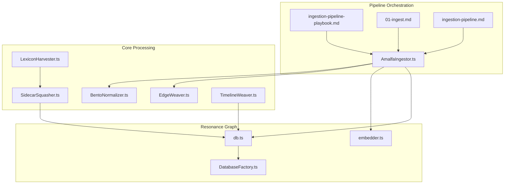
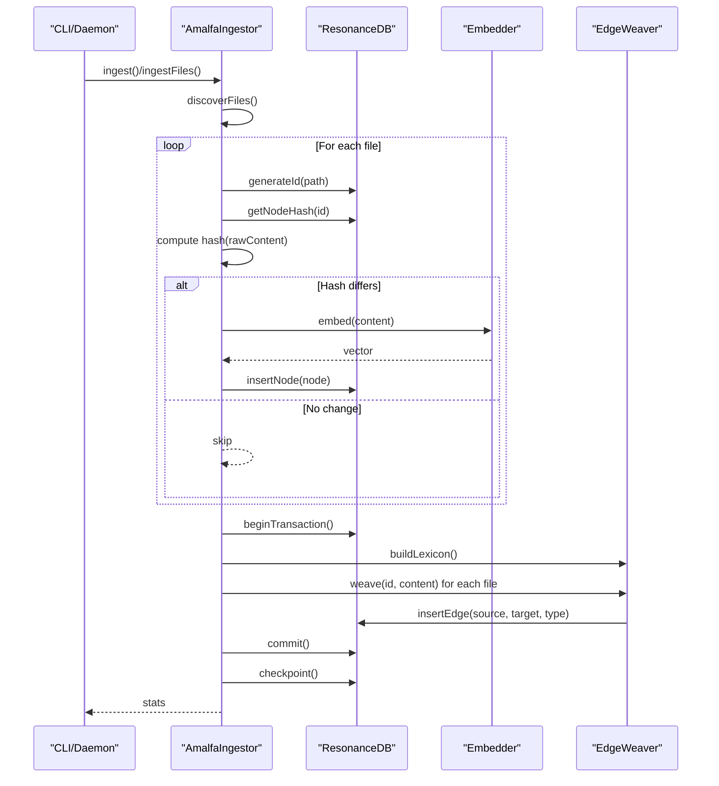
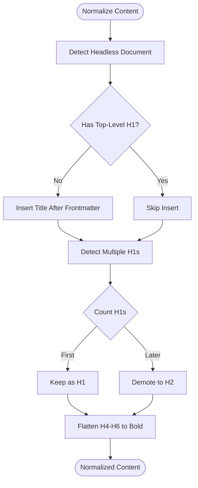
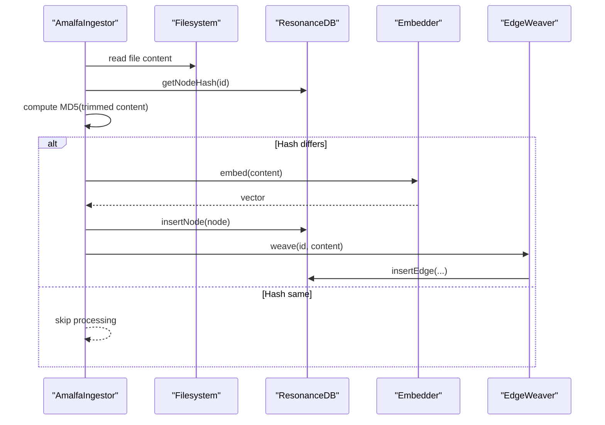
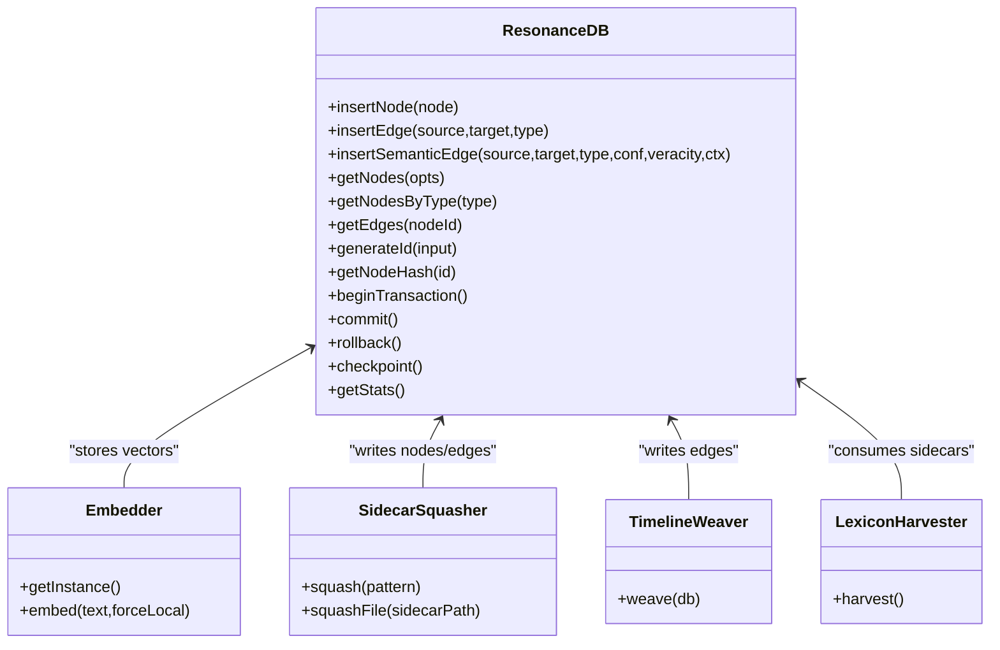
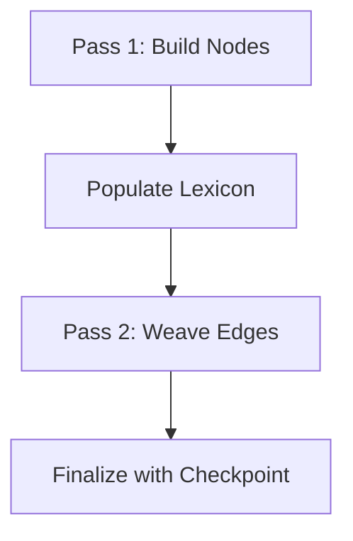
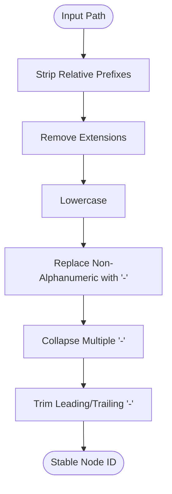
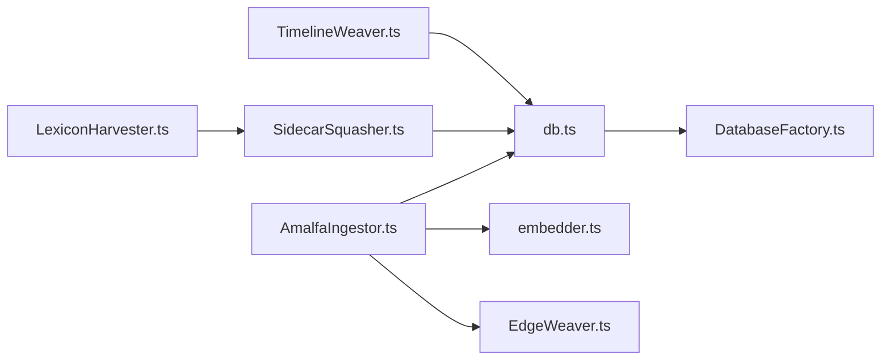

# Ingestion Pipeline

<cite>
**Referenced Files in This Document**
- [AmalfaIngestor.ts](file://src/pipeline/AmalfaIngestor.ts)
- [README.md](file://src/pipeline/README.md)
- [ingestion-pipeline-playbook.md](file://playbooks/ingestion-pipeline-playbook.md)
- [01-ingest.md](file://docs/architecture/01-ingest.md)
- [ingestion-pipeline.md](file://docs/architecture/ingestion-pipeline.md)
- [BentoNormalizer.ts](file://src/core/BentoNormalizer.ts)
- [EdgeWeaver.ts](file://src/core/EdgeWeaver.ts)
- [embedder.ts](file://src/resonance/services/embedder.ts)
- [DatabaseFactory.ts](file://src/resonance/DatabaseFactory.ts)
- [db.ts](file://src/resonance/db.ts)
- [SidecarSquasher.ts](file://src/core/SidecarSquasher.ts)
- [TimelineWeaver.ts](file://src/core/TimelineWeaver.ts)
- [LexiconHarvester.ts](file://src/core/LexiconHarvester.ts)
</cite>

## Table of Contents
1. [Introduction](#introduction)
2. [Project Structure](#project-structure)
3. [Core Components](#core-components)
4. [Architecture Overview](#architecture-overview)
5. [Detailed Component Analysis](#detailed-component-analysis)
6. [Dependency Analysis](#dependency-analysis)
7. [Performance Considerations](#performance-considerations)
8. [Troubleshooting Guide](#troubleshooting-guide)
9. [Conclusion](#conclusion)

## Introduction
This document explains Amalfa’s ingestion pipeline architecture and operational flow. The pipeline transforms raw markdown files into a knowledge graph with three stages:
- Factory: deterministic text normalization and preparation
- Bridge: ETL operations including hashing, embedding, and semantic edge weaving
- Brain: semantic storage and graph enrichment

It also covers the boxing process that converts raw markdown into bento-boxed chunks with locus tags, the delta-checking mechanism using cryptographic hashes, the two-pass ingestion strategy, the bento ledger system for ID minting and tracking, and the bridge script’s role in scanning boxed files, performing hash comparisons, generating embeddings, and weaving semantic relationships. Error handling, retry mechanisms, and performance optimization strategies are documented to support robust, incremental ingestion.

## Project Structure
The ingestion pipeline spans several modules:
- Pipeline orchestration and triggers
- Core processing utilities (normalization, edge weaving, sidecar squashing)
- Resonance graph database and services (embedding, ID generation)
- Documentation and playbooks that define architecture and safety protocols

**Diagram sources**
- [AmalfaIngestor.ts](file://src/pipeline/AmalfaIngestor.ts#L1-L441)
- [ingestion-pipeline-playbook.md](file://playbooks/ingestion-pipeline-playbook.md#L1-L56)
- [01-ingest.md](file://docs/architecture/01-ingest.md#L1-L63)
- [ingestion-pipeline.md](file://docs/architecture/ingestion-pipeline.md#L1-L226)
- [BentoNormalizer.ts](file://src/core/BentoNormalizer.ts#L1-L114)
- [EdgeWeaver.ts](file://src/core/EdgeWeaver.ts#L1-L194)
- [SidecarSquasher.ts](file://src/core/SidecarSquasher.ts#L1-L189)
- [TimelineWeaver.ts](file://src/core/TimelineWeaver.ts#L1-L62)
- [LexiconHarvester.ts](file://src/core/LexiconHarvester.ts#L1-L176)
- [DatabaseFactory.ts](file://src/resonance/DatabaseFactory.ts#L1-L103)
- [db.ts](file://src/resonance/db.ts#L1-L488)
- [embedder.ts](file://src/resonance/services/embedder.ts#L1-L126)

**Section sources**
- [README.md](file://src/pipeline/README.md#L1-L8)
- [ingestion-pipeline-playbook.md](file://playbooks/ingestion-pipeline-playbook.md#L1-L56)
- [01-ingest.md](file://docs/architecture/01-ingest.md#L1-L63)
- [ingestion-pipeline.md](file://docs/architecture/ingestion-pipeline.md#L1-L226)

## Core Components
- AmalfaIngestor orchestrates discovery, two-pass processing, hashing, embedding, and edge weaving. It supports both full ingestion and incremental ingestion triggered by file changes.
- BentoNormalizer performs deterministic text normalization heuristics to ensure consistent structure and semantics.
- EdgeWeaver extracts and creates semantic relationships from explicit tags, wiki-links, metadata blocks, and markdown links, with safety filtering.
- ResonanceDB provides transactional graph operations, ID generation, hashing, and statistics.
- Embedder manages remote and local embedding generation with fallback and FAFCAS normalization.
- SidecarSquasher integrates structured sidecar outputs into the graph as nodes and edges.
- TimelineWeaver chronologically links debrief nodes to form a temporal chain.
- LexiconHarvester aggregates sidecar-derived entities and concepts into a lexicon candidate list.

**Section sources**
- [AmalfaIngestor.ts](file://src/pipeline/AmalfaIngestor.ts#L32-L441)
- [BentoNormalizer.ts](file://src/core/BentoNormalizer.ts#L1-L114)
- [EdgeWeaver.ts](file://src/core/EdgeWeaver.ts#L1-L194)
- [db.ts](file://src/resonance/db.ts#L25-L431)
- [embedder.ts](file://src/resonance/services/embedder.ts#L1-L126)
- [SidecarSquasher.ts](file://src/core/SidecarSquasher.ts#L1-L189)
- [TimelineWeaver.ts](file://src/core/TimelineWeaver.ts#L1-L62)
- [LexiconHarvester.ts](file://src/core/LexiconHarvester.ts#L1-L176)

## Architecture Overview
The ingestion pipeline follows a deterministic, idempotent, and observable flow:
- Discovery: Locate markdown/ts/js files from configured sources, excluding patterns.
- Factory: Normalize content deterministically to ensure consistent structure.
- Bridge: Compute cryptographic hash, compare against stored hash, embed content if needed, and insert nodes.
- Two-pass weaving: Build lexicon from nodes, then weave edges across all files.
- Finalization: Force WAL checkpoint and return statistics.

**Diagram sources**
- [AmalfaIngestor.ts](file://src/pipeline/AmalfaIngestor.ts#L139-L309)
- [db.ts](file://src/resonance/db.ts#L83-L159)
- [embedder.ts](file://src/resonance/services/embedder.ts#L80-L124)
- [EdgeWeaver.ts](file://src/core/EdgeWeaver.ts#L54-L181)

## Detailed Component Analysis

### Factory Stage: Deterministic Text Processing
The Factory stage ensures that raw markdown is normalized consistently before ingestion. It applies heuristics to address common structural issues:
- Headless documents: inserts a top-level title derived from filename if none exists
- Shouting documents: keeps the first H1 and demotes subsequent H1s to H2s
- Deep nesting: flattens H4–H6 into bolded content

These transformations produce a canonical representation suitable for downstream processing and embedding.

**Diagram sources**
- [BentoNormalizer.ts](file://src/core/BentoNormalizer.ts#L6-L106)

**Section sources**
- [BentoNormalizer.ts](file://src/core/BentoNormalizer.ts#L1-L114)

### Bridge Stage: ETL Operations and Delta Checking
The Bridge stage performs:
- Hash computation: computes MD5 over trimmed content and compares with stored hash
- Embedding: generates vectors via Embedder (remote daemon or local fallback)
- Node insertion: writes nodes with metadata, hash, and optional embedding
- Edge weaving: constructs semantic relationships using explicit tags, wiki-links, metadata blocks, and markdown links

Delta checking prevents redundant work by skipping unchanged files. The two-pass strategy ensures all nodes exist before creating edges, preventing dangling references.

**Diagram sources**
- [AmalfaIngestor.ts](file://src/pipeline/AmalfaIngestor.ts#L375-L439)
- [db.ts](file://src/resonance/db.ts#L298-L303)
- [embedder.ts](file://src/resonance/services/embedder.ts#L80-L124)
- [EdgeWeaver.ts](file://src/core/EdgeWeaver.ts#L54-L181)

**Section sources**
- [AmalfaIngestor.ts](file://src/pipeline/AmalfaIngestor.ts#L182-L253)
- [db.ts](file://src/resonance/db.ts#L298-L303)
- [embedder.ts](file://src/resonance/services/embedder.ts#L1-L126)
- [EdgeWeaver.ts](file://src/core/EdgeWeaver.ts#L1-L194)

### Brain Stage: Semantic Storage and Graph Enrichment
The Brain stage focuses on persistent storage and enrichment:
- ResonanceDB stores nodes and edges with transactional guarantees, WAL checkpointing, and statistics
- Embedder provides normalized vectors via FAFCAS protocol
- SidecarSquasher integrates structured sidecar outputs into the graph
- TimelineWeaver links debrief nodes chronologically
- LexiconHarvester aggregates sidecar-derived entities/concepts into a lexicon candidate list

**Diagram sources**
- [db.ts](file://src/resonance/db.ts#L25-L431)
- [embedder.ts](file://src/resonance/services/embedder.ts#L1-L126)
- [SidecarSquasher.ts](file://src/core/SidecarSquasher.ts#L1-L189)
- [TimelineWeaver.ts](file://src/core/TimelineWeaver.ts#L1-L62)
- [LexiconHarvester.ts](file://src/core/LexiconHarvester.ts#L1-L176)

**Section sources**
- [db.ts](file://src/resonance/db.ts#L1-L488)
- [embedder.ts](file://src/resonance/services/embedder.ts#L1-L126)
- [SidecarSquasher.ts](file://src/core/SidecarSquasher.ts#L1-L189)
- [TimelineWeaver.ts](file://src/core/TimelineWeaver.ts#L1-L62)
- [LexiconHarvester.ts](file://src/core/LexiconHarvester.ts#L1-L176)

### Boxing Process and Locus Tags
While “boxing” is not explicitly named in the analyzed files, the ingestion pipeline normalizes content deterministically and assigns stable IDs via the bento ledger (ResonanceDB.generateId). The normalized content and metadata serve as the boxed unit for downstream processing. Locus tags are represented implicitly by:
- Stable node IDs derived from file paths
- Metadata fields capturing source and semantic tokens
- Explicit tagging syntax ([tag: Concept]) and wiki-links ([[Target]]) used during edge weaving

This approach ensures each chunk has a unique, path-aware identity and rich semantic anchors for relationship extraction.

**Section sources**
- [AmalfaIngestor.ts](file://src/pipeline/AmalfaIngestor.ts#L348-L354)
- [db.ts](file://src/resonance/db.ts#L378-L391)
- [EdgeWeaver.ts](file://src/core/EdgeWeaver.ts#L61-L166)

### Two-Pass Ingestion Strategy
The pipeline processes files in two passes:
- Pass 1: Build nodes only (no edges) to populate the lexicon
- Pass 2: Weave edges using the fully populated lexicon

This ordering prevents dangling references and ensures all targets exist before creating edges.

**Diagram sources**
- [AmalfaIngestor.ts](file://src/pipeline/AmalfaIngestor.ts#L182-L253)

**Section sources**
- [AmalfaIngestor.ts](file://src/pipeline/AmalfaIngestor.ts#L182-L253)

### Bento Ledger System: ID Minting and Tracking
The bento ledger is implemented by ResonanceDB.generateId, which:
- Strips relative prefixes and extensions
- Normalizes to lowercase
- Replaces non-alphanumeric characters with dashes
- Collapses multiple slashes and trims leading/trailing separators

This produces stable, path-aware IDs that track the source file and enable consistent semantic relationships.

**Diagram sources**
- [db.ts](file://src/resonance/db.ts#L378-L391)

**Section sources**
- [db.ts](file://src/resonance/db.ts#L378-L391)

### Bridge Script Role: Scanning, Hash Comparisons, Embeddings, and Relationship Weaving
The bridge script orchestrates:
- Scanning boxed files (normalized markdown)
- Performing hash comparisons to detect changes
- Generating embeddings via Embedder
- Weaving semantic relationships using EdgeWeaver

It operates within the two-pass framework, committing nodes first and then edges, ensuring referential integrity.

**Section sources**
- [AmalfaIngestor.ts](file://src/pipeline/AmalfaIngestor.ts#L182-L253)
- [embedder.ts](file://src/resonance/services/embedder.ts#L80-L124)
- [EdgeWeaver.ts](file://src/core/EdgeWeaver.ts#L54-L181)

## Dependency Analysis
The ingestion pipeline exhibits clear separation of concerns:
- AmalfaIngestor depends on ResonanceDB for persistence, Embedder for vectors, and EdgeWeaver for relationships
- ResonanceDB relies on DatabaseFactory for compliant SQLite configuration
- SidecarSquasher, TimelineWeaver, and LexiconHarvester integrate external artifacts into the graph

**Diagram sources**
- [AmalfaIngestor.ts](file://src/pipeline/AmalfaIngestor.ts#L1-L441)
- [db.ts](file://src/resonance/db.ts#L1-L488)
- [embedder.ts](file://src/resonance/services/embedder.ts#L1-L126)
- [EdgeWeaver.ts](file://src/core/EdgeWeaver.ts#L1-L194)
- [DatabaseFactory.ts](file://src/resonance/DatabaseFactory.ts#L1-L103)
- [SidecarSquasher.ts](file://src/core/SidecarSquasher.ts#L1-L189)
- [TimelineWeaver.ts](file://src/core/TimelineWeaver.ts#L1-L62)
- [LexiconHarvester.ts](file://src/core/LexiconHarvester.ts#L1-L176)

**Section sources**
- [AmalfaIngestor.ts](file://src/pipeline/AmalfaIngestor.ts#L1-L441)
- [db.ts](file://src/resonance/db.ts#L1-L488)
- [embedder.ts](file://src/resonance/services/embedder.ts#L1-L126)
- [EdgeWeaver.ts](file://src/core/EdgeWeaver.ts#L1-L194)
- [DatabaseFactory.ts](file://src/resonance/DatabaseFactory.ts#L1-L103)
- [SidecarSquasher.ts](file://src/core/SidecarSquasher.ts#L1-L189)
- [TimelineWeaver.ts](file://src/core/TimelineWeaver.ts#L1-L62)
- [LexiconHarvester.ts](file://src/core/LexiconHarvester.ts#L1-L176)

## Performance Considerations
- Hash checking: Skips unchanged files, minimizing embedding and DB overhead
- Batched transactions: Commits every N files to reduce lock contention and improve throughput
- WAL checkpointing: Ensures durability and reduces journal overhead
- Embedding fallback: Uses remote daemon with short timeout, falls back to local FastEmbed
- FAFCAS normalization: Guarantees unit vectors for accurate similarity comparisons
- Safety checks: OH-104 pinch check validates database file existence and non-zero size after checkpoint

**Section sources**
- [AmalfaIngestor.ts](file://src/pipeline/AmalfaIngestor.ts#L182-L270)
- [embedder.ts](file://src/resonance/services/embedder.ts#L80-L124)
- [db.ts](file://src/resonance/db.ts#L255-L269)

## Troubleshooting Guide
Common issues and remedies:
- Missing embeddings: Ensure the embedding model is configured and the daemon is reachable or local model is cached
- Data loss: Verify the database path in settings and confirm checkpoint completion
- Edge weaving failures: Confirm that nodes exist for all targets and that the lexicon is built before weaving
- File locks: Use the retry queue with exponential backoff for transient file system issues
- SQLite configuration: Validate WAL mode, busy_timeout, and foreign keys via health checks

Operational references:
- Pipeline dashboard and telemetry for real-time status
- Logs and warnings emitted during ingestion and sidecar processing
- Pinch check to ensure database integrity post-checkpoint

**Section sources**
- [ingestion-pipeline-playbook.md](file://playbooks/ingestion-pipeline-playbook.md#L43-L56)
- [01-ingest.md](file://docs/architecture/01-ingest.md#L58-L63)
- [AmalfaIngestor.ts](file://src/pipeline/AmalfaIngestor.ts#L255-L269)
- [db.ts](file://src/resonance/db.ts#L72-L101)

## Conclusion
Amalfa’s ingestion pipeline combines deterministic normalization, robust delta checking, and a two-pass edge-weaving strategy to produce a reliable, scalable knowledge graph. The bento ledger ensures stable, path-aware IDs, while the bridge script coordinates hashing, embeddings, and semantic relationships. With transactional graph operations, FAFCAS normalization, and safety checks, the system balances performance, correctness, and observability.