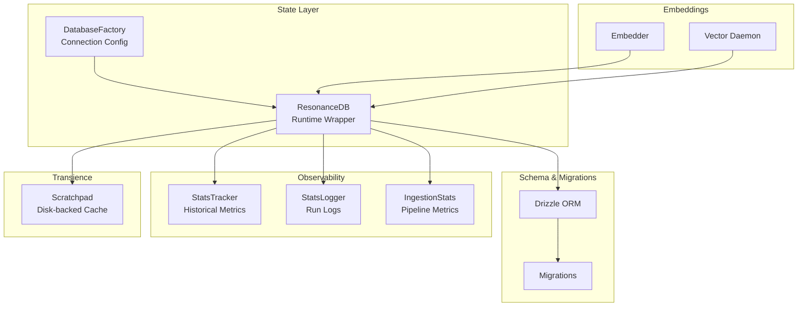
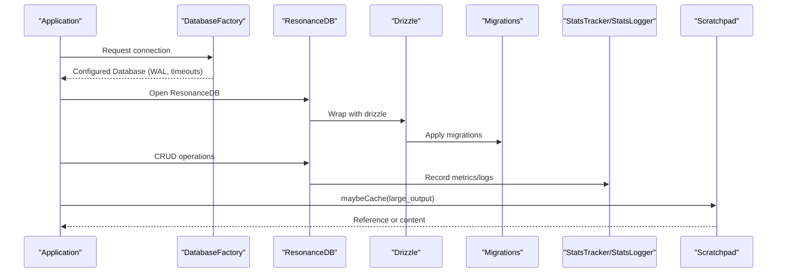
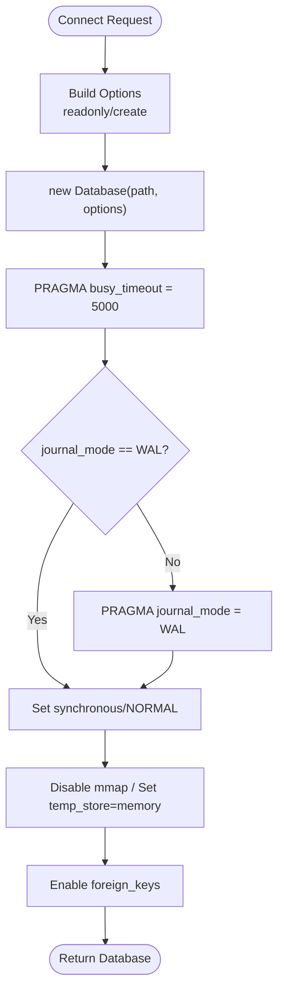
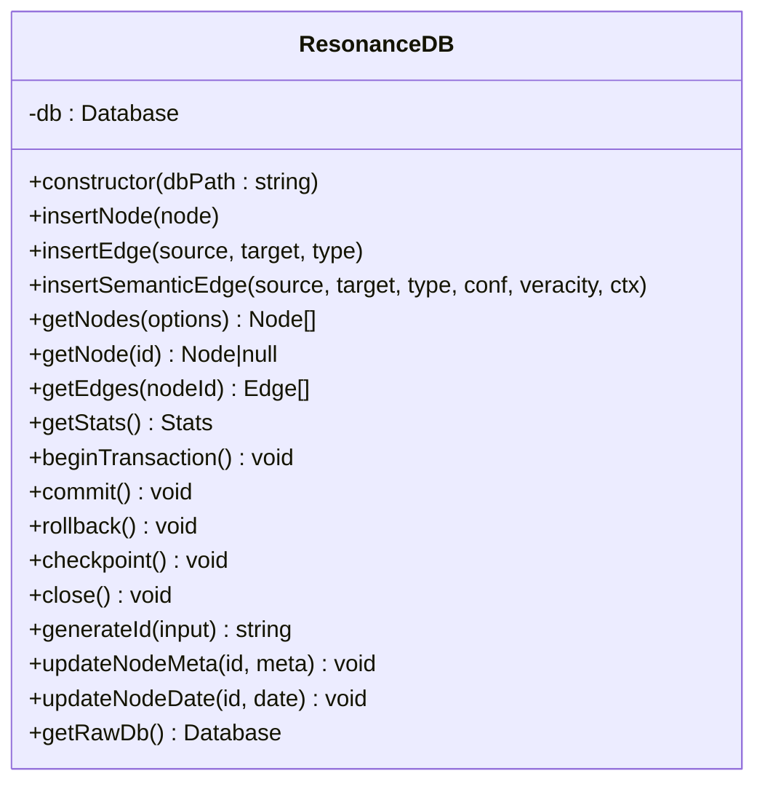
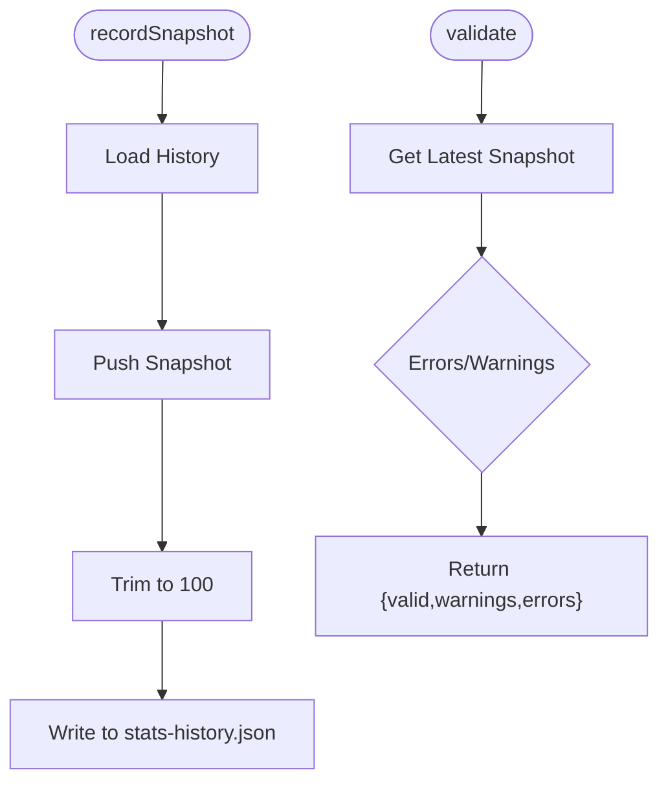
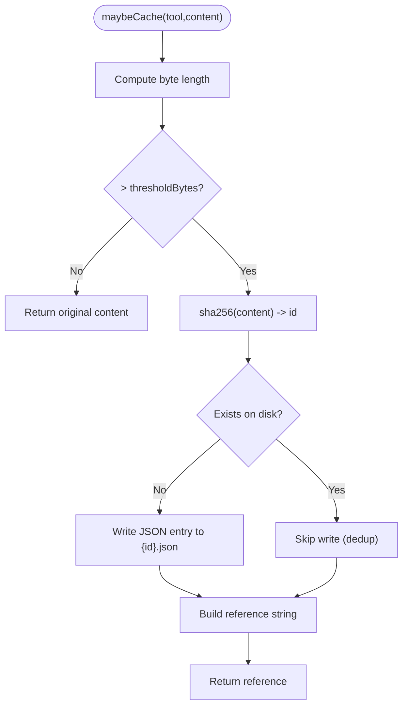
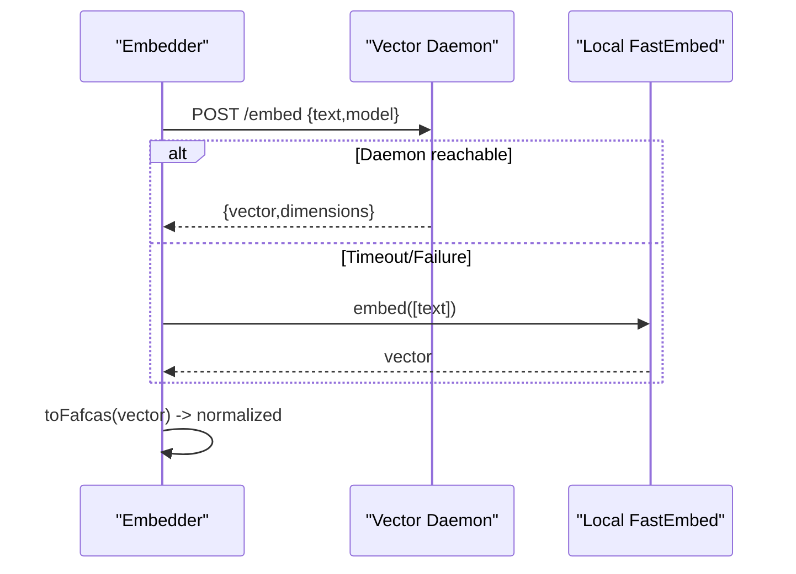
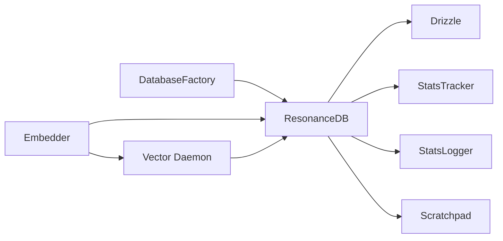

# State Management

<cite>
**Referenced Files in This Document**
- [DatabaseFactory.ts](file://src/resonance/DatabaseFactory.ts)
- [db.ts](file://src/resonance/db.ts)
- [DATABASE-PROCEDURES.md](file://src/resonance/DATABASE-PROCEDURES.md)
- [StatsTracker.ts](file://src/utils/StatsTracker.ts)
- [StatsLogger.ts](file://src/utils/StatsLogger.ts)
- [Scratchpad.ts](file://src/utils/Scratchpad.ts)
- [schema.ts](file://src/config/schema.ts)
- [embedder.ts](file://src/resonance/services/embedder.ts)
- [vector-daemon.ts](file://src/resonance/services/vector-daemon.ts)
- [stats.ts](file://src/resonance/services/stats.ts)
</cite>

## Table of Contents
1. [Introduction](#introduction)
2. [Project Structure](#project-structure)
3. [Core Components](#core-components)
4. [Architecture Overview](#architecture-overview)
5. [Detailed Component Analysis](#detailed-component-analysis)
6. [Dependency Analysis](#dependency-analysis)
7. [Performance Considerations](#performance-considerations)
8. [Troubleshooting Guide](#troubleshooting-guide)
9. [Conclusion](#conclusion)

## Introduction
This document explains Amalfa’s state management architecture with a focus on:
- Centralized database connection management and lifecycle via DatabaseFactory and ResonanceDB
- Consistent state across concurrent operations using SQLite WAL mode and strict pragmas
- Monitoring and metrics collection via StatsTracker and StatsLogger
- Temporary storage and context preservation via Scratchpad
- State synchronization strategies, transaction management, and rollback procedures
- Validation, integrity checks, and recovery mechanisms
- Concurrent access patterns, locking strategies, and performance optimizations
- The relationship between in-memory state and persistent storage

## Project Structure
The state management stack spans several modules:
- Database factory and runtime wrapper for SQLite
- Drizzle-based schema and migrations
- Metrics and logging utilities
- Transient scratchpad for large tool outputs
- Vector engine and daemon for embeddings

**Diagram sources**
- [DatabaseFactory.ts](file://src/resonance/DatabaseFactory.ts#L1-L103)
- [db.ts](file://src/resonance/db.ts#L25-L81)
- [DATABASE-PROCEDURES.md](file://src/resonance/DATABASE-PROCEDURES.md#L46-L100)
- [StatsTracker.ts](file://src/utils/StatsTracker.ts#L25-L90)
- [StatsLogger.ts](file://src/utils/StatsLogger.ts#L19-L82)
- [Scratchpad.ts](file://src/utils/Scratchpad.ts#L59-L75)
- [embedder.ts](file://src/resonance/services/embedder.ts#L9-L64)
- [vector-daemon.ts](file://src/resonance/services/vector-daemon.ts#L1-L234)

**Section sources**
- [DatabaseFactory.ts](file://src/resonance/DatabaseFactory.ts#L1-L103)
- [db.ts](file://src/resonance/db.ts#L25-L81)
- [DATABASE-PROCEDURES.md](file://src/resonance/DATABASE-PROCEDURES.md#L14-L44)

## Core Components
- DatabaseFactory: Centralized, standards-compliant SQLite connection initializer with WAL, busy_timeout, synchronous, and integrity settings.
- ResonanceDB: High-performance runtime wrapper around SQLite with typed accessors, transactions, and FAFCAS-compatible vector handling.
- StatsTracker: Persistent metrics history recorder and validator for database health and growth.
- StatsLogger: Lightweight run logs for pipeline operations.
- Scratchpad: Disk-backed cache for large tool outputs with deduplication, pruning, and previews.
- IngestionStats: Pipeline-stage observability with baseline verification.
- Embedder and Vector Daemon: Vector generation service with FAFCAS normalization and optional remote/local fallback.

**Section sources**
- [DatabaseFactory.ts](file://src/resonance/DatabaseFactory.ts#L13-L66)
- [db.ts](file://src/resonance/db.ts#L25-L431)
- [StatsTracker.ts](file://src/utils/StatsTracker.ts#L25-L217)
- [StatsLogger.ts](file://src/utils/StatsLogger.ts#L19-L82)
- [Scratchpad.ts](file://src/utils/Scratchpad.ts#L59-L405)
- [stats.ts](file://src/resonance/services/stats.ts#L64-L327)
- [embedder.ts](file://src/resonance/services/embedder.ts#L9-L125)
- [vector-daemon.ts](file://src/resonance/services/vector-daemon.ts#L1-L234)

## Architecture Overview
The state management architecture enforces:
- Single source of truth for database connections and configuration
- Strict WAL mode and timeouts for concurrency and resilience
- Drizzle-driven schema evolution with automated migrations
- Typed, low-level access to SQLite for performance
- Metrics and logs for observability
- Transient caching for large outputs to preserve in-memory context windows
- Vector normalization and efficient storage via FAFCAS

**Diagram sources**
- [DatabaseFactory.ts](file://src/resonance/DatabaseFactory.ts#L27-L66)
- [db.ts](file://src/resonance/db.ts#L32-L81)
- [DATABASE-PROCEDURES.md](file://src/resonance/DATABASE-PROCEDURES.md#L46-L86)
- [StatsTracker.ts](file://src/utils/StatsTracker.ts#L72-L89)
- [StatsLogger.ts](file://src/utils/StatsLogger.ts#L23-L36)
- [Scratchpad.ts](file://src/utils/Scratchpad.ts#L147-L190)

## Detailed Component Analysis

### DatabaseFactory: Centralized Connection Management
- Enforces SQLite standards: WAL journal mode, busy_timeout, synchronous, foreign_keys, temp_store, mmap disabled for stability.
- Provides connect and connectToResonance helpers with explicit readonly/create options.
- Performs health checks to validate pragma compliance and performs a basic write/read test.

**Diagram sources**
- [DatabaseFactory.ts](file://src/resonance/DatabaseFactory.ts#L27-L66)

**Section sources**
- [DatabaseFactory.ts](file://src/resonance/DatabaseFactory.ts#L13-L103)

### ResonanceDB: Runtime State and Transactions
- Initializes with DatabaseFactory, applies Drizzle migrations, and exposes typed CRUD methods.
- Embeddings stored as raw BLOBs (FAFCAS) to avoid serialization overhead.
- Provides transactions (begin, commit, rollback) and WAL checkpoint.
- Includes history logging for mutations and safe retrieval methods with optional exclusion of large BLOBs.

**Diagram sources**
- [db.ts](file://src/resonance/db.ts#L25-L431)

**Section sources**
- [db.ts](file://src/resonance/db.ts#L25-L431)
- [DATABASE-PROCEDURES.md](file://src/resonance/DATABASE-PROCEDURES.md#L160-L194)

### StatsTracker: Historical Metrics and Validation
- Records snapshots with nodes, edges, embeddings, db size, and optional metadata.
- Validates current state against history (empty database, low growth, low edge density, embedding coverage).
- Summarizes growth trends and persists to stats-history.json.

**Diagram sources**
- [StatsTracker.ts](file://src/utils/StatsTracker.ts#L72-L174)

**Section sources**
- [StatsTracker.ts](file://src/utils/StatsTracker.ts#L25-L217)

### StatsLogger: Run Logs for Operations
- Logs pipeline runs (harvest, init, squash) with timestamps, counts, durations, and estimated costs.
- Uses JSONL for append-only persistence.

**Section sources**
- [StatsLogger.ts](file://src/utils/StatsLogger.ts#L19-L82)

### Scratchpad: Temporary Storage and Context Preservation
- Intercepts large tool outputs, hashes content for deduplication, writes to disk, and returns a compact reference.
- Supports preview inclusion, listing metadata, reading content, pruning by age/size, and deletion.
- Configuration driven by AmalfaSettings.scratchpad.

**Diagram sources**
- [Scratchpad.ts](file://src/utils/Scratchpad.ts#L147-L190)

**Section sources**
- [Scratchpad.ts](file://src/utils/Scratchpad.ts#L59-L405)
- [schema.ts](file://src/config/schema.ts#L243-L251)

### IngestionStats: Pipeline Observability and Baseline Verification
- Tracks nodes, edges, vectors, and semantic tokens per domain.
- Loads baseline JSON and compares actual metrics against expected values with tolerance.
- Generates summaries and markdown reports.

**Section sources**
- [stats.ts](file://src/resonance/services/stats.ts#L64-L327)

### Embedder and Vector Daemon: Normalized Embeddings
- Embedder supports remote daemon (Vector Daemon) with fast fallback to local FastEmbed.
- Vector Daemon serves /embed and /rerank endpoints, normalizes vectors using FAFCAS, and keeps models loaded in memory.

**Diagram sources**
- [embedder.ts](file://src/resonance/services/embedder.ts#L80-L124)
- [vector-daemon.ts](file://src/resonance/services/vector-daemon.ts#L162-L219)

**Section sources**
- [embedder.ts](file://src/resonance/services/embedder.ts#L9-L125)
- [vector-daemon.ts](file://src/resonance/services/vector-daemon.ts#L1-L234)

## Dependency Analysis
- DatabaseFactory depends on Bun’s SQLite driver and enforces canonical pragmas.
- ResonanceDB depends on DatabaseFactory and Drizzle for migrations; it uses raw SQL for performance.
- StatsTracker and StatsLogger persist to .amalfa directories; StatsTracker reads/writes stats-history.json.
- Scratchpad depends on AmalfaSettings.scratchpad configuration and writes to .amalfa/cache/scratchpad.
- Embedder depends on Vector Daemon and FastEmbed; Vector Daemon depends on FAFCAS normalization.

**Diagram sources**
- [DatabaseFactory.ts](file://src/resonance/DatabaseFactory.ts#L1-L103)
- [db.ts](file://src/resonance/db.ts#L1-L8)
- [StatsTracker.ts](file://src/utils/StatsTracker.ts#L1-L3)
- [StatsLogger.ts](file://src/utils/StatsLogger.ts#L1-L3)
- [Scratchpad.ts](file://src/utils/Scratchpad.ts#L15-L26)
- [embedder.ts](file://src/resonance/services/embedder.ts#L1-L3)
- [vector-daemon.ts](file://src/resonance/services/vector-daemon.ts#L1-L16)

**Section sources**
- [DATABASE-PROCEDURES.md](file://src/resonance/DATABASE-PROCEDURES.md#L46-L86)
- [schema.ts](file://src/config/schema.ts#L243-L251)

## Performance Considerations
- SQLite WAL mode and busy_timeout reduce contention and lock waits during concurrent access.
- Disabling mmap prioritizes stability over raw IO throughput.
- Embeddings stored as raw BLOBs minimize serialization overhead; FAFCAS normalization ensures consistent similarity comparisons.
- Prepared statements and typed accessors avoid dynamic SQL overhead.
- Scratchpad reduces in-memory footprint by caching large outputs to disk with previews.
- Vector Daemon keeps models loaded in memory for sub-100ms response times.

[No sources needed since this section provides general guidance]

## Troubleshooting Guide
- Database locked: Check for rogue processes and restart services; ensure WAL is used consistently.
- Table does not exist: Run Drizzle migrations to align schema.
- Schema mismatch: Regenerate and review migration SQL; restore from backup if necessary.
- Health warnings: Validate busy_timeout, journal_mode, and mmap settings; perform a health check write/read.
- Vector daemon unreachable: Confirm daemon is running and port configuration; fallback to local embedding.

**Section sources**
- [DATABASE-PROCEDURES.md](file://src/resonance/DATABASE-PROCEDURES.md#L234-L275)
- [DatabaseFactory.ts](file://src/resonance/DatabaseFactory.ts#L72-L101)

## Conclusion
Amalfa’s state management architecture centers on a strict, standards-compliant SQLite runtime (DatabaseFactory and ResonanceDB), robust observability (StatsTracker, StatsLogger, IngestionStats), transient caching (Scratchpad), and efficient vector processing (Embedder/Vector Daemon). Together, these components ensure resilient, observable, and performant state handling across concurrent operations, while maintaining clear separation between in-memory context and persistent storage.