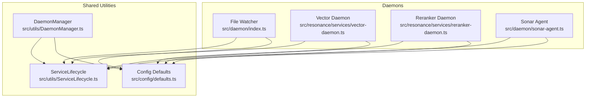
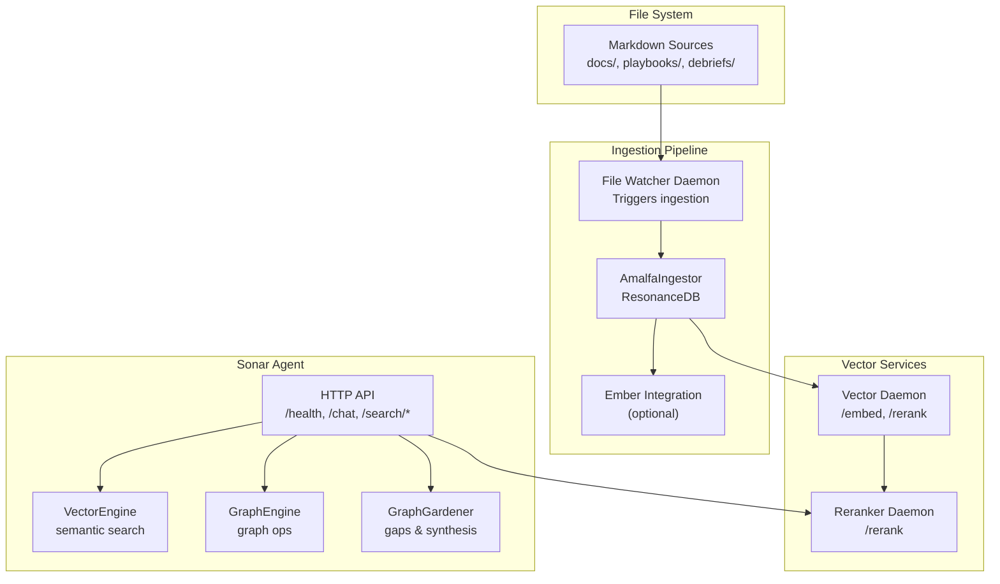
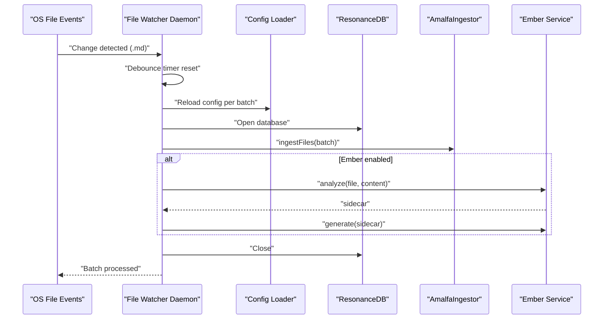
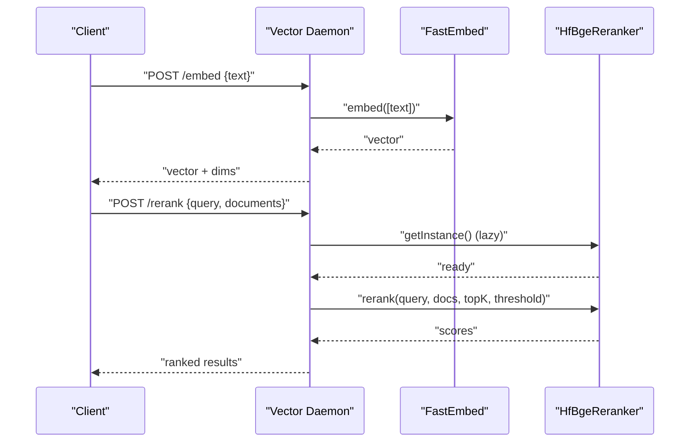
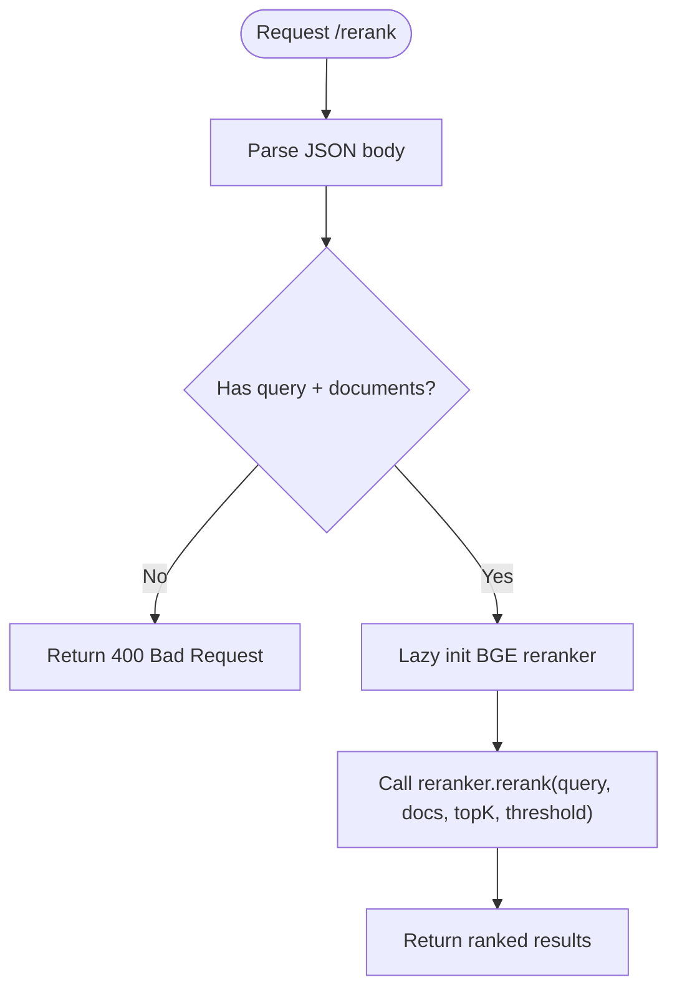
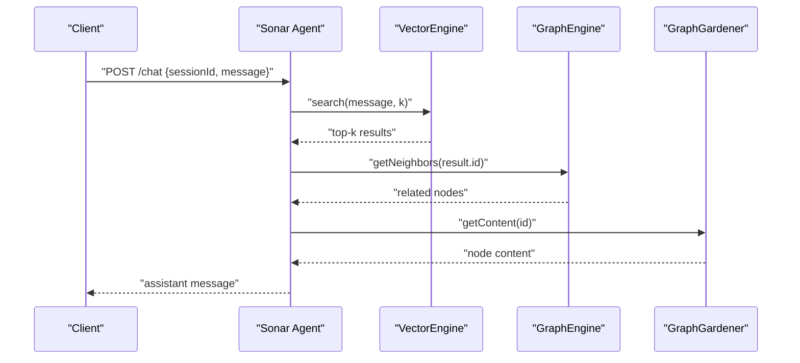
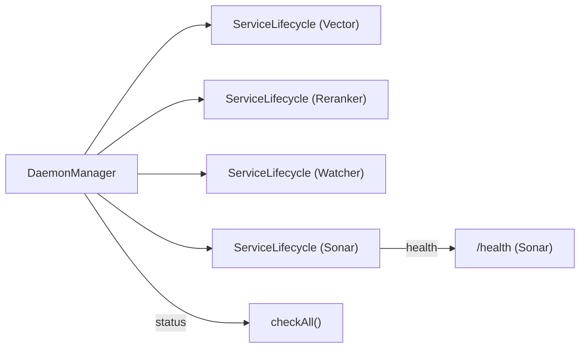

# Daemon Types and Responsibilities

<cite>
**Referenced Files in This Document**
- [src/daemon/index.ts](file://src/daemon/index.ts)
- [src/resonance/services/vector-daemon.ts](file://src/resonance/services/vector-daemon.ts)
- [src/resonance/services/reranker-daemon.ts](file://src/resonance/services/reranker-daemon.ts)
- [src/daemon/sonar-agent.ts](file://src/daemon/sonar-agent.ts)
- [src/daemon/sonar-server.ts](file://src/daemon/sonar-server.ts)
- [src/daemon/sonar-logic.ts](file://src/daemon/sonar-logic.ts)
- [src/daemon/sonar-strategies.ts](file://src/daemon/sonar-strategies.ts)
- [src/daemon/sonar-types.ts](file://src/daemon/sonar-types.ts)
- [src/utils/DaemonManager.ts](file://src/utils/DaemonManager.ts)
- [src/utils/ServiceLifecycle.ts](file://src/utils/ServiceLifecycle.ts)
- [src/config/defaults.ts](file://src/config/defaults.ts)
- [docs/audits/DAEMON-CONFIG-ROOT-CAUSE.md](file://docs/audits/DAEMON-CONFIG-ROOT-CAUSE.md)
- [debriefs/2026-01-17-daemon-file-watcher-naming-investigation.md](file://debriefs/2026-01-17-daemon-file-watcher-naming-investigation.md)
</cite>

## Table of Contents
1. [Introduction](#introduction)
2. [Project Structure](#project-structure)
3. [Core Components](#core-components)
4. [Architecture Overview](#architecture-overview)
5. [Detailed Component Analysis](#detailed-component-analysis)
6. [Dependency Analysis](#dependency-analysis)
7. [Performance Considerations](#performance-considerations)
8. [Troubleshooting Guide](#troubleshooting-guide)
9. [Conclusion](#conclusion)

## Introduction
This document explains Amalfa’s daemon ecosystem and the responsibilities of each daemon. It covers:
- The file watcher daemon that monitors file system changes and triggers ingestion pipelines
- The vector daemon that generates and serves vector embeddings for semantic search
- The reranker daemon that optimizes search results using cross-encoder models
- The Sonar AI agent daemon that provides enhanced search capabilities and research assistance

It also documents entry points, initialization, resource requirements, communication protocols, configuration options, logging strategies, health monitoring, and operational challenges.

## Project Structure
Daemons are implemented as standalone Bun entry points with lifecycle management and shared configuration utilities:
- File watcher daemon: [src/daemon/index.ts](file://src/daemon/index.ts)
- Vector daemon: [src/resonance/services/vector-daemon.ts](file://src/resonance/services/vector-daemon.ts)
- Reranker daemon: [src/resonance/services/reranker-daemon.ts](file://src/resonance/services/reranker-daemon.ts)
- Sonar agent: [src/daemon/sonar-agent.ts](file://src/daemon/sonar-agent.ts) with HTTP server and task orchestration
- Shared management: [src/utils/DaemonManager.ts](file://src/utils/DaemonManager.ts)
- Lifecycle and PID/log management: [src/utils/ServiceLifecycle.ts](file://src/utils/ServiceLifecycle.ts)
- Configuration SSoT and directory layout: [src/config/defaults.ts](file://src/config/defaults.ts)

**Diagram sources**
- [src/daemon/index.ts](file://src/daemon/index.ts#L1-L293)
- [src/resonance/services/vector-daemon.ts](file://src/resonance/services/vector-daemon.ts#L1-L234)
- [src/resonance/services/reranker-daemon.ts](file://src/resonance/services/reranker-daemon.ts#L1-L145)
- [src/daemon/sonar-agent.ts](file://src/daemon/sonar-agent.ts#L1-L221)
- [src/utils/DaemonManager.ts](file://src/utils/DaemonManager.ts#L1-L260)
- [src/utils/ServiceLifecycle.ts](file://src/utils/ServiceLifecycle.ts#L1-L209)
- [src/config/defaults.ts](file://src/config/defaults.ts#L1-L143)

**Section sources**
- [src/daemon/index.ts](file://src/daemon/index.ts#L1-L293)
- [src/resonance/services/vector-daemon.ts](file://src/resonance/services/vector-daemon.ts#L1-L234)
- [src/resonance/services/reranker-daemon.ts](file://src/resonance/services/reranker-daemon.ts#L1-L145)
- [src/daemon/sonar-agent.ts](file://src/daemon/sonar-agent.ts#L1-L221)
- [src/utils/DaemonManager.ts](file://src/utils/DaemonManager.ts#L1-L260)
- [src/utils/ServiceLifecycle.ts](file://src/utils/ServiceLifecycle.ts#L1-L209)
- [src/config/defaults.ts](file://src/config/defaults.ts#L1-L143)

## Core Components
- File Watcher Daemon
  - Watches configured Markdown sources recursively
  - Debounces file events and triggers ingestion pipelines
  - Integrates optional Ember enrichment and notifications
  - PID/log path: [.amalfa/runtime/daemon.pid](file://src/config/defaults.ts#L16-L40), [.amalfa/logs/daemon.log](file://src/config/defaults.ts#L16-L40)
  - Entry point: [src/daemon/index.ts](file://src/daemon/index.ts#L1-L293)

- Vector Daemon
  - HTTP server on port 3010
  - Loads a FastEmbed model once at startup for low-latency embeddings
  - Provides /embed and /rerank endpoints (lazy-loads reranker on first request)
  - PID/log path: [.amalfa/runtime/vector-daemon.pid](file://src/config/defaults.ts#L16-L40), [.amalfa/logs/vector-daemon.log](file://src/config/defaults.ts#L16-L40)
  - Entry point: [src/resonance/services/vector-daemon.ts](file://src/resonance/services/vector-daemon.ts#L1-L234)

- Reranker Daemon
  - HTTP server on port 3011
  - Dedicated BGE reranker service (no FastEmbed dependency)
  - Provides /health and /rerank endpoints
  - PID/log path: [.amalfa/runtime/reranker-daemon.pid](file://src/config/defaults.ts#L16-L40), [.amalfa/logs/reranker-daemon.log](file://src/config/defaults.ts#L16-L40)
  - Entry point: [src/resonance/services/reranker-daemon.ts](file://src/resonance/services/reranker-daemon.ts#L1-L145)

- Sonar Agent Daemon
  - HTTP server on port 3012 (via [src/daemon/sonar-server.ts](file://src/daemon/sonar-server.ts#L1-L134))
  - Orchestrates tasks from .amalfa/agent/tasks/{pending,processing,completed}
  - Supports chat, metadata enhancement, search analysis, reranking, context extraction, and multi-phase research
  - PID/log path: [.amalfa/runtime/sonar.pid](file://src/config/defaults.ts#L16-L40), [.amalfa/logs/sonar.log](file://src/config/defaults.ts#L16-L40)
  - Entry point: [src/daemon/sonar-agent.ts](file://src/daemon/sonar-agent.ts#L1-L221)

**Section sources**
- [src/daemon/index.ts](file://src/daemon/index.ts#L1-L293)
- [src/resonance/services/vector-daemon.ts](file://src/resonance/services/vector-daemon.ts#L1-L234)
- [src/resonance/services/reranker-daemon.ts](file://src/resonance/services/reranker-daemon.ts#L1-L145)
- [src/daemon/sonar-agent.ts](file://src/daemon/sonar-agent.ts#L1-L221)
- [src/daemon/sonar-server.ts](file://src/daemon/sonar-server.ts#L1-L134)
- [src/config/defaults.ts](file://src/config/defaults.ts#L16-L40)

## Architecture Overview
High-level daemon orchestration and inter-service communication:

**Diagram sources**
- [src/daemon/index.ts](file://src/daemon/index.ts#L1-L293)
- [src/resonance/services/vector-daemon.ts](file://src/resonance/services/vector-daemon.ts#L1-L234)
- [src/resonance/services/reranker-daemon.ts](file://src/resonance/services/reranker-daemon.ts#L1-L145)
- [src/daemon/sonar-agent.ts](file://src/daemon/sonar-agent.ts#L1-L221)
- [src/daemon/sonar-server.ts](file://src/daemon/sonar-server.ts#L1-L134)

## Detailed Component Analysis

### File Watcher Daemon
Responsibilities:
- Monitor configured Markdown sources recursively
- Debounce rapid file changes and batch-process updates
- Trigger ingestion pipeline and optional Ember enrichment
- Persist notifications and manage retries with exponential backoff
- Graceful shutdown on SIGTERM/SIGINT

Entry point and lifecycle:
- Entry: [src/daemon/index.ts](file://src/daemon/index.ts#L1-L293)
- Lifecycle: [src/utils/ServiceLifecycle.ts](file://src/utils/ServiceLifecycle.ts#L1-L209)
- PID/log: [.amalfa/runtime/daemon.pid](file://src/config/defaults.ts#L16-L40), [.amalfa/logs/daemon.log](file://src/config/defaults.ts#L16-L40)

Key behaviors:
- Watches directories at startup; adding new sources requires restart
- Reloads configuration per batch to reflect runtime changes (except sources)
- Integrates with ResonanceDB and optional Ember enrichment
- Sends desktop notifications on completion/failure

**Diagram sources**
- [src/daemon/index.ts](file://src/daemon/index.ts#L100-L289)
- [src/config/defaults.ts](file://src/config/defaults.ts#L84-L143)

Operational notes:
- Debounce window is configurable; default is loaded from config
- Retry queue with capped attempts and backoff prevents data loss
- Notifications can be disabled in config

**Section sources**
- [src/daemon/index.ts](file://src/daemon/index.ts#L1-L293)
- [src/utils/ServiceLifecycle.ts](file://src/utils/ServiceLifecycle.ts#L1-L209)
- [src/config/defaults.ts](file://src/config/defaults.ts#L16-L40)
- [docs/audits/DAEMON-CONFIG-ROOT-CAUSE.md](file://docs/audits/DAEMON-CONFIG-ROOT-CAUSE.md#L48-L161)

### Vector Daemon
Responsibilities:
- Serve low-latency embeddings via HTTP
- Provide reranking endpoint backed by a cross-encoder model
- Keep embedding model loaded in memory for fast response times
- Lazy-load reranker on first request

Endpoints:
- GET /health: returns status, model, and readiness flags
- POST /embed: returns normalized vector for input text
- POST /rerank: reranks candidate documents against a query

Entry point and lifecycle:
- Entry: [src/resonance/services/vector-daemon.ts](file://src/resonance/services/vector-daemon.ts#L1-L234)
- Lifecycle: [src/utils/ServiceLifecycle.ts](file://src/utils/ServiceLifecycle.ts#L1-L209)
- PID/log: [.amalfa/runtime/vector-daemon.pid](file://src/config/defaults.ts#L16-L40), [.amalfa/logs/vector-daemon.log](file://src/config/defaults.ts#L16-L40)

Resource requirements:
- FastEmbed model cached under .amalfa/cache
- Memory footprint dominated by loaded embedding model
- Optional reranker model loaded on demand

**Diagram sources**
- [src/resonance/services/vector-daemon.ts](file://src/resonance/services/vector-daemon.ts#L72-L230)

**Section sources**
- [src/resonance/services/vector-daemon.ts](file://src/resonance/services/vector-daemon.ts#L1-L234)
- [src/utils/ServiceLifecycle.ts](file://src/utils/ServiceLifecycle.ts#L1-L209)
- [src/config/defaults.ts](file://src/config/defaults.ts#L16-L40)

### Reranker Daemon
Responsibilities:
- Dedicated reranking service for cross-encoder scoring
- Lightweight HTTP server focused solely on reranking
- Lazy-initializes BGE reranker model

Endpoints:
- GET /health: returns status and model readiness
- POST /rerank: reranks documents with optional topK and threshold

Entry point and lifecycle:
- Entry: [src/resonance/services/reranker-daemon.ts](file://src/resonance/services/reranker-daemon.ts#L1-L145)
- Lifecycle: [src/utils/ServiceLifecycle.ts](file://src/utils/ServiceLifecycle.ts#L1-L209)
- PID/log: [.amalfa/runtime/reranker-daemon.pid](file://src/config/defaults.ts#L16-L40), [.amalfa/logs/reranker-daemon.log](file://src/config/defaults.ts#L16-L40)

**Diagram sources**
- [src/resonance/services/reranker-daemon.ts](file://src/resonance/services/reranker-daemon.ts#L43-L141)

**Section sources**
- [src/resonance/services/reranker-daemon.ts](file://src/resonance/services/reranker-daemon.ts#L1-L145)
- [src/utils/ServiceLifecycle.ts](file://src/utils/ServiceLifecycle.ts#L1-L209)
- [src/config/defaults.ts](file://src/config/defaults.ts#L16-L40)

### Sonar Agent Daemon
Responsibilities:
- HTTP API for chat, metadata enhancement, search analysis, reranking, and context extraction
- Task orchestration from filesystem-based queues
- Multi-phase research workflows with iterative discovery and verification
- Optional integration with local Ollama or cloud providers

Entry point and lifecycle:
- Entry: [src/daemon/sonar-agent.ts](file://src/daemon/sonar-agent.ts#L1-L221)
- Lifecycle: [src/utils/ServiceLifecycle.ts](file://src/utils/ServiceLifecycle.ts#L1-L209)
- PID/log: [.amalfa/runtime/sonar.pid](file://src/config/defaults.ts#L16-L40), [.amalfa/logs/sonar.log](file://src/config/defaults.ts#L16-L40)

HTTP API surface:
- GET /health: returns provider, model, and availability
- POST /chat: conversational retrieval augmented chat
- POST /metadata/enhance: enhance node metadata
- GET /graph/stats: graph statistics
- POST /search/analyze: extract intent/entities/filters
- POST /search/rerank: LLM-based reranking
- POST /search/context: extract relevant snippet

Task queue:
- Watches .amalfa/agent/tasks/pending and moves to processing/completed
- Supported task types: synthesis, timeline, enhance_batch, garden, research, chat

**Diagram sources**
- [src/daemon/sonar-agent.ts](file://src/daemon/sonar-agent.ts#L102-L133)
- [src/daemon/sonar-logic.ts](file://src/daemon/sonar-logic.ts#L104-L179)

**Section sources**
- [src/daemon/sonar-agent.ts](file://src/daemon/sonar-agent.ts#L1-L221)
- [src/daemon/sonar-server.ts](file://src/daemon/sonar-server.ts#L1-L134)
- [src/daemon/sonar-logic.ts](file://src/daemon/sonar-logic.ts#L1-L685)
- [src/daemon/sonar-strategies.ts](file://src/daemon/sonar-strategies.ts#L1-L187)
- [src/daemon/sonar-types.ts](file://src/daemon/sonar-types.ts#L1-L69)
- [src/utils/ServiceLifecycle.ts](file://src/utils/ServiceLifecycle.ts#L1-L209)
- [src/config/defaults.ts](file://src/config/defaults.ts#L16-L40)

## Dependency Analysis
Unified management and status reporting:
- DaemonManager coordinates all daemons via ServiceLifecycle
- Provides status checks and stop/start operations
- Sonar health probe queries internal /health endpoint

**Diagram sources**
- [src/utils/DaemonManager.ts](file://src/utils/DaemonManager.ts#L1-L260)
- [src/utils/ServiceLifecycle.ts](file://src/utils/ServiceLifecycle.ts#L1-L209)
- [src/daemon/sonar-server.ts](file://src/daemon/sonar-server.ts#L40-L53)

**Section sources**
- [src/utils/DaemonManager.ts](file://src/utils/DaemonManager.ts#L1-L260)
- [src/utils/ServiceLifecycle.ts](file://src/utils/ServiceLifecycle.ts#L1-L209)
- [src/daemon/sonar-server.ts](file://src/daemon/sonar-server.ts#L40-L53)

## Performance Considerations
- File Watcher
  - Debounce reduces I/O pressure; tune watch.debounce for your workload
  - Per-batch config reload ensures minimal disruption without polling
  - Retry queue avoids data loss with backoff

- Vector Daemon
  - Embedding model loaded once; keep warm for sub-100ms latency
  - Lazy reranker reduces cold-start cost for reranking
  - FAFCAS normalization ensures vector compatibility

- Reranker Daemon
  - Dedicated service isolates reranking cost from embedding
  - Minimal footprint; ideal for high-throughput reranking

- Sonar Agent
  - Uses VectorEngine for efficient semantic search
  - GraphEngine and GraphGardener enable fast neighborhood traversal
  - Task queue decouples heavy operations from request latency

[No sources needed since this section provides general guidance]

## Troubleshooting Guide
Common issues and remedies:
- Daemon not watching new directories
  - Cause: Watchers are set at startup; adding to sources requires restart
  - Evidence: Logs show startup sources; adding directories later does not take effect until restart
  - Action: Restart the daemon after updating sources

- Health checks
  - Vector daemon: GET /health on port 3010
  - Reranker daemon: GET /health on port 3011
  - Sonar agent: GET /health on port 3012

- Logging locations
  - File Watcher: [.amalfa/logs/daemon.log](file://src/config/defaults.ts#L16-L40)
  - Vector Daemon: [.amalfa/logs/vector-daemon.log](file://src/config/defaults.ts#L16-L40)
  - Reranker Daemon: [.amalfa/logs/reranker-daemon.log](file://src/config/defaults.ts#L16-L40)
  - Sonar Agent: [.amalfa/logs/sonar.log](file://src/config/defaults.ts#L16-L40)

- PID files and lifecycle
  - Use ServiceLifecycle to start/stop/status daemons
  - PID files stored under [.amalfa/runtime/](file://src/config/defaults.ts#L16-L40)

- Naming confusion
  - The file watcher is implemented in [src/daemon/index.ts](file://src/daemon/index.ts#L1-L293) but referred to as “File-Watcher” in management code
  - CLI output shows “File Watcher: Running”

**Section sources**
- [docs/audits/DAEMON-CONFIG-ROOT-CAUSE.md](file://docs/audits/DAEMON-CONFIG-ROOT-CAUSE.md#L48-L161)
- [debriefs/2026-01-17-daemon-file-watcher-naming-investigation.md](file://debriefs/2026-01-17-daemon-file-watcher-naming-investigation.md#L1-L68)
- [src/utils/ServiceLifecycle.ts](file://src/utils/ServiceLifecycle.ts#L1-L209)
- [src/config/defaults.ts](file://src/config/defaults.ts#L16-L40)

## Conclusion
Amalfa’s daemon ecosystem balances real-time ingestion, fast embeddings, dedicated reranking, and intelligent agent orchestration. Each daemon is independently managed with clear lifecycles, health endpoints, and logs. Operational best practices include restarting the file watcher after changing sources, monitoring per-service logs, and leveraging the unified DaemonManager for status and control.