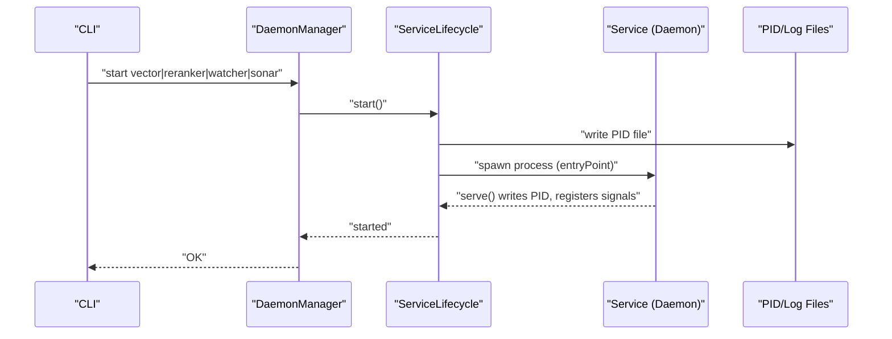
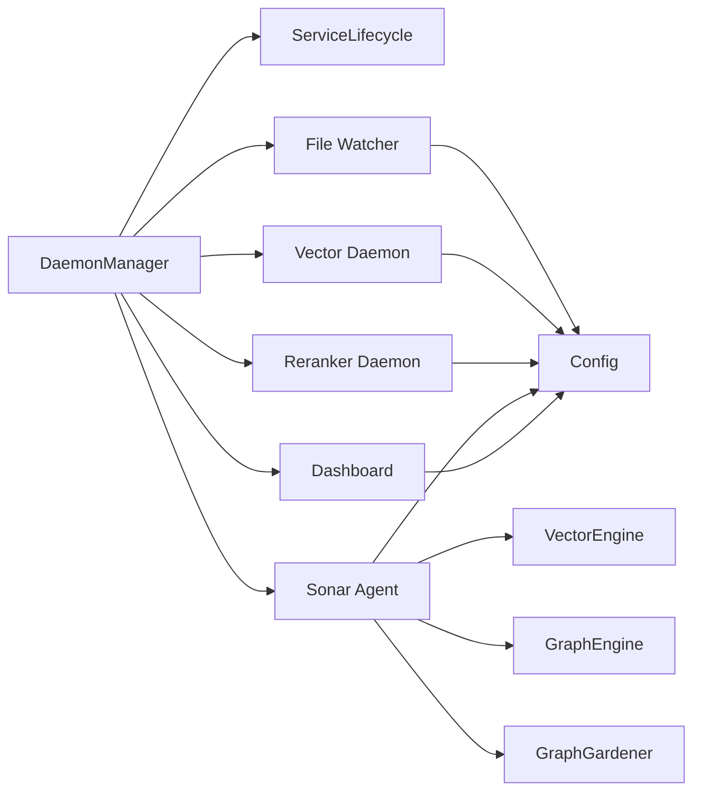

# Service Architecture

<cite>
**Referenced Files in This Document**
- [DaemonManager.ts](file://src/utils/DaemonManager.ts)
- [ServiceLifecycle.ts](file://src/utils/ServiceLifecycle.ts)
- [daemon/index.ts](file://src/daemon/index.ts)
- [resonance/services/vector-daemon.ts](file://src/resonance/services/vector-daemon.ts)
- [resonance/services/reranker-daemon.ts](file://src/resonance/services/reranker-daemon.ts)
- [daemon/sonar-agent.ts](file://src/daemon/sonar-agent.ts)
- [daemon/sonar-server.ts](file://src/daemon/sonar-server.ts)
- [daemon/sonar-logic.ts](file://src/daemon/sonar-logic.ts)
- [services/reranker-hf.ts](file://src/services/reranker-hf.ts)
- [services/dashboard-daemon.ts](file://src/services/dashboard-daemon.ts)
- [services/LangExtractClient.ts](file://src/services/LangExtractClient.ts)
- [config/defaults.ts](file://src/config/defaults.ts)
- [cli.ts](file://src/cli.ts)
- [utils/Logger.ts](file://src/utils/Logger.ts)
</cite>

## Table of Contents
1. [Introduction](#introduction)
2. [Project Structure](#project-structure)
3. [Core Components](#core-components)
4. [Architecture Overview](#architecture-overview)
5. [Detailed Component Analysis](#detailed-component-analysis)
6. [Dependency Analysis](#dependency-analysis)
7. [Performance Considerations](#performance-considerations)
8. [Troubleshooting Guide](#troubleshooting-guide)
9. [Conclusion](#conclusion)

## Introduction
This document explains Amalfa’s service architecture and daemon management system. It focuses on the service daemon pattern that powers persistent background processing for file watching, vector generation, reranking, and AI agent orchestration. It documents the DaemonManager’s lifecycle orchestration, the lifecycle management abstraction, and the behavior of each major service. It also covers inter-process coordination, health monitoring, logging, error recovery, and dynamic configuration.

## Project Structure
Amalfa organizes services around a unified lifecycle manager and a shared configuration system:
- DaemonManager coordinates multiple daemons and exposes status and control APIs.
- ServiceLifecycle encapsulates start/stop/status/restart logic with PID/log file management.
- Individual services (file watcher, vector daemon, reranker daemon, Sonar agent) are self-contained HTTP daemons with health endpoints.
- A dashboard daemon provides a UI and SSE-based telemetry for service management.
- Configuration is centralized in a settings file with a typed schema and helpers.

```mermaid
graph TB
subgraph "CLI"
CLI["CLI Entrypoint<br/>src/cli.ts"]
end
subgraph "Management"
DM["DaemonManager<br/>src/utils/DaemonManager.ts"]
SL["ServiceLifecycle<br/>src/utils/ServiceLifecycle.ts"]
end
subgraph "Daemons"
FW["File Watcher<br/>src/daemon/index.ts"]
VD["Vector Daemon<br/>src/resonance/services/vector-daemon.ts"]
RD["Reranker Daemon<br/>src/resonance/services/reranker-daemon.ts"]
SA["Sonar Agent<br/>src/daemon/sonar-agent.ts"]
DASH["Dashboard Daemon<br/>src/services/dashboard-daemon.ts"]
end
subgraph "Core Engines"
VE["VectorEngine"]
GE["GraphEngine"]
GG["GraphGardener"]
end
subgraph "Config & Logging"
CFG["Config Loader<br/>src/config/defaults.ts"]
LOG["Logger<br/>src/utils/Logger.ts"]
end
CLI --> DM
DM --> SL
DM --> FW
DM --> VD
DM --> RD
DM --> SA
DM --> DASH
FW --> CFG
VD --> CFG
RD --> CFG
SA --> CFG
DASH --> CFG
FW --> LOG
VD --> LOG
RD --> LOG
SA --> LOG
DASH --> LOG
SA --> VE
SA --> GE
SA --> GG
```

**Diagram sources**
- [DaemonManager.ts](file://src/utils/DaemonManager.ts#L17-L51)
- [ServiceLifecycle.ts](file://src/utils/ServiceLifecycle.ts#L12-L209)
- [daemon/index.ts](file://src/daemon/index.ts#L25-L95)
- [resonance/services/vector-daemon.ts](file://src/resonance/services/vector-daemon.ts#L20-L75)
- [resonance/services/reranker-daemon.ts](file://src/resonance/services/reranker-daemon.ts#L18-L45)
- [daemon/sonar-agent.ts](file://src/daemon/sonar-agent.ts#L49-L116)
- [services/dashboard-daemon.ts](file://src/services/dashboard-daemon.ts#L25-L32)
- [config/defaults.ts](file://src/config/defaults.ts#L15-L59)
- [utils/Logger.ts](file://src/utils/Logger.ts#L1-L23)

**Section sources**
- [DaemonManager.ts](file://src/utils/DaemonManager.ts#L17-L51)
- [ServiceLifecycle.ts](file://src/utils/ServiceLifecycle.ts#L12-L209)
- [daemon/index.ts](file://src/daemon/index.ts#L25-L95)
- [resonance/services/vector-daemon.ts](file://src/resonance/services/vector-daemon.ts#L20-L75)
- [resonance/services/reranker-daemon.ts](file://src/resonance/services/reranker-daemon.ts#L18-L45)
- [daemon/sonar-agent.ts](file://src/daemon/sonar-agent.ts#L49-L116)
- [services/dashboard-daemon.ts](file://src/services/dashboard-daemon.ts#L25-L32)
- [config/defaults.ts](file://src/config/defaults.ts#L15-L59)
- [utils/Logger.ts](file://src/utils/Logger.ts#L1-L23)

## Core Components
- DaemonManager: Central coordinator for four daemons (vector, reranker, file watcher, Sonar). Provides status checks, start/stop, and bulk operations.
- ServiceLifecycle: Abstraction for daemon lifecycle with PID/log file management, graceful stop, and serve mode.
- File Watcher Daemon: Monitors source directories for Markdown changes, batches updates, and triggers ingestion and optional enrichment.
- Vector Daemon: HTTP server exposing embedding and reranking endpoints with a warm model in memory.
- Reranker Daemon: Dedicated reranking service with a warm model instance.
- Sonar Agent: Multi-purpose AI agent with HTTP API, task processing, and orchestration of graph and vector engines.
- Dashboard Daemon: Web UI and SSE telemetry for service management and monitoring.
- Configuration and Logging: Centralized settings loader and structured logging.

**Section sources**
- [DaemonManager.ts](file://src/utils/DaemonManager.ts#L17-L51)
- [ServiceLifecycle.ts](file://src/utils/ServiceLifecycle.ts#L12-L209)
- [daemon/index.ts](file://src/daemon/index.ts#L52-L95)
- [resonance/services/vector-daemon.ts](file://src/resonance/services/vector-daemon.ts#L72-L230)
- [resonance/services/reranker-daemon.ts](file://src/resonance/services/reranker-daemon.ts#L43-L141)
- [daemon/sonar-agent.ts](file://src/daemon/sonar-agent.ts#L60-L116)
- [services/dashboard-daemon.ts](file://src/services/dashboard-daemon.ts#L423-L445)
- [config/defaults.ts](file://src/config/defaults.ts#L84-L139)
- [utils/Logger.ts](file://src/utils/Logger.ts#L1-L23)

## Architecture Overview
The system follows a daemon pattern where each service runs as a long-lived process with:
- Lifecycle management via ServiceLifecycle (PID/log files, signals).
- Health endpoints for monitoring.
- Optional embedded models for low-latency inference.
- Inter-service coordination via HTTP and filesystem-based task queues.



**Diagram sources**
- [DaemonManager.ts](file://src/utils/DaemonManager.ts#L103-L107)
- [ServiceLifecycle.ts](file://src/utils/ServiceLifecycle.ts#L27-L67)
- [daemon/index.ts](file://src/daemon/index.ts#L29-L35)
- [resonance/services/vector-daemon.ts](file://src/resonance/services/vector-daemon.ts#L20-L26)
- [resonance/services/reranker-daemon.ts](file://src/resonance/services/reranker-daemon.ts#L18-L24)
- [daemon/sonar-agent.ts](file://src/daemon/sonar-agent.ts#L49-L55)

## Detailed Component Analysis

### DaemonManager
Responsibilities:
- Manages four daemons: vector, reranker, file watcher, Sonar.
- Provides per-service status checks, start/stop, and bulk operations.
- Reads PID files and checks process liveness; returns structured status including ports and active model info where applicable.

Key behaviors:
- Status checks read PID files and verify liveness.
- Starts/stops use ServiceLifecycle wrappers with short initialization waits.
- Sonar status queries its health endpoint to detect active model.

Operational notes:
- Uses AMALFA_DIRS.runtime for PID files and AMALFA_DIRS.logs for logs.
- Exposes checkAll and stopAll for orchestration.

**Section sources**
- [DaemonManager.ts](file://src/utils/DaemonManager.ts#L17-L51)
- [DaemonManager.ts](file://src/utils/DaemonManager.ts#L84-L98)
- [DaemonManager.ts](file://src/utils/DaemonManager.ts#L103-L107)
- [DaemonManager.ts](file://src/utils/DaemonManager.ts#L119-L133)
- [DaemonManager.ts](file://src/utils/DaemonManager.ts#L138-L142)
- [DaemonManager.ts](file://src/utils/DaemonManager.ts#L154-L165)
- [DaemonManager.ts](file://src/utils/DaemonManager.ts#L170-L174)
- [DaemonManager.ts](file://src/utils/DaemonManager.ts#L186-L212)
- [DaemonManager.ts](file://src/utils/DaemonManager.ts#L217-L221)
- [DaemonManager.ts](file://src/utils/DaemonManager.ts#L233-L246)
- [DaemonManager.ts](file://src/utils/DaemonManager.ts#L251-L258)

### ServiceLifecycle
Responsibilities:
- Encapsulates daemon lifecycle across start/stop/status/restart/serve.
- Writes/reads PID files, truncates logs, spawns detached processes.
- Graceful stop with SIGTERM and fallback SIGKILL after timeout.
- Serve mode writes PID, registers signal handlers, cleans up on exit.

Key behaviors:
- start: ensures directories, clears stale PID, spawns with inherited env, writes PID.
- stop: sends SIGTERM, waits up to 1s, kills if needed, removes PID file.
- serve: writes PID, registers SIGINT/SIGTERM handlers, cleans up on exit.
- run: CLI dispatcher for start/stop/status/restart/serve.

**Section sources**
- [ServiceLifecycle.ts](file://src/utils/ServiceLifecycle.ts#L12-L209)

### File Watcher Daemon
Purpose:
- Real-time incremental ingestion of Markdown files from configured sources.
- Debounces rapid changes, batches updates, and triggers ingestion and optional enrichment.

Processing logic:
- Watches directories recursively for .md files.
- Debounces events and drains pending files into batches.
- Loads config per batch to reflect runtime changes.
- Opens ResonanceDB, creates AmalfaIngestor, and ingests batch.
- Optional Ember enrichment gated by git changes and content signature checks.
- Emits notifications on completion/failure.
- Implements retry queue with exponential backoff for transient failures.

Health and monitoring:
- Runs indefinitely until signaled.
- Logs info/warn/error depending on outcome.

**Section sources**
- [daemon/index.ts](file://src/daemon/index.ts#L52-L95)
- [daemon/index.ts](file://src/daemon/index.ts#L100-L127)
- [daemon/index.ts](file://src/daemon/index.ts#L132-L289)
- [daemon/index.ts](file://src/daemon/index.ts#L291-L293)

### Vector Daemon
Purpose:
- HTTP server for embedding generation and reranking with warm models.
- Exposes /embed and /rerank endpoints.

Initialization:
- Initializes embedding model on first use with cache directory setup.
- Lazy-loads reranker singleton on first rerank request.

Endpoints:
- /health: returns status, model, readiness flags.
- /embed: generates normalized vector via FAFCAS normalization.
- /rerank: reranks candidate documents using BGE-M3.

Error handling:
- Validates inputs and returns structured JSON errors.
- Logs failures and returns 500 responses.

**Section sources**
- [resonance/services/vector-daemon.ts](file://src/resonance/services/vector-daemon.ts#L36-L75)
- [resonance/services/vector-daemon.ts](file://src/resonance/services/vector-daemon.ts#L77-L230)
- [services/reranker-hf.ts](file://src/services/reranker-hf.ts#L22-L130)

### Reranker Daemon
Purpose:
- Dedicated reranking service without embedding dependency.
- Exposes /health and /rerank endpoints.

Initialization:
- Lazy-loads BGE reranker singleton on first request.

Endpoints:
- /health: returns status and model readiness.
- /rerank: reranks documents with optional topK/threshold.

**Section sources**
- [resonance/services/reranker-daemon.ts](file://src/resonance/services/reranker-daemon.ts#L32-L45)
- [resonance/services/reranker-daemon.ts](file://src/resonance/services/reranker-daemon.ts#L46-L141)
- [services/reranker-hf.ts](file://src/services/reranker-hf.ts#L22-L130)

### Sonar Agent
Purpose:
- Multi-purpose AI agent with HTTP API and task processing.
- Orchestrates graph and vector engines, manages chat sessions, and executes tasks.

Core flows:
- Startup loads config, initializes DB, vector engine, graph gardener, and task directories.
- Health checks Ollama availability and discovers capabilities; falls back to cloud if configured.
- HTTP API via Hono exposes:
  - /health: provider/model status.
  - /chat: contextual chat with retrieval augmentation.
  - /metadata/enhance: metadata enhancement for nodes.
  - /graph/stats: graph statistics.
  - /search/analyze, /search/rerank, /search/context: search enhancement endpoints.
- Task processing loop watches pending tasks, moves to processing, executes via sonar-logic, writes reports, and notifies.

Task types:
- synthesis: community synthesis with optional auto-apply.
- timeline: date anchoring with optional auto-apply.
- garden: gap detection and relationship suggestions with auto-apply.
- research: recursive discovery with chain-of-thought planning.
- enhance_batch: batch metadata enhancement.

**Section sources**
- [daemon/sonar-agent.ts](file://src/daemon/sonar-agent.ts#L60-L116)
- [daemon/sonar-server.ts](file://src/daemon/sonar-server.ts#L24-L133)
- [daemon/sonar-logic.ts](file://src/daemon/sonar-logic.ts#L29-L99)
- [daemon/sonar-logic.ts](file://src/daemon/sonar-logic.ts#L104-L179)
- [daemon/sonar-logic.ts](file://src/daemon/sonar-logic.ts#L184-L218)
- [daemon/sonar-logic.ts](file://src/daemon/sonar-logic.ts#L223-L276)
- [daemon/sonar-logic.ts](file://src/daemon/sonar-logic.ts#L323-L364)
- [daemon/sonar-logic.ts](file://src/daemon/sonar-logic.ts#L369-L392)
- [daemon/sonar-logic.ts](file://src/daemon/sonar-logic.ts#L397-L465)
- [daemon/sonar-logic.ts](file://src/daemon/sonar-logic.ts#L470-L664)

### Dashboard Daemon
Purpose:
- Web UI and SSE telemetry for monitoring and managing services.
- Serves static assets and exposes REST endpoints for service control.

Key routes:
- Static: PolyVis UI and legacy assets.
- API: /api/services/:name/:action (start/stop/restart), /api/stats, /api/services, /api/harvest, /api/runs, /api/stream (SSE), /api/cli (proxy).
- Health: /health.
- Datastar SSE: periodic updates for UI fragments.

Inter-process coordination:
- Proxies service actions to CLI commands.
- Streams live stats, service statuses, and logs.

**Section sources**
- [services/dashboard-daemon.ts](file://src/services/dashboard-daemon.ts#L34-L314)
- [services/dashboard-daemon.ts](file://src/services/dashboard-daemon.ts#L423-L445)
- [services/dashboard-daemon.ts](file://src/services/dashboard-daemon.ts#L447-L467)
- [services/dashboard-daemon.ts](file://src/services/dashboard-daemon.ts#L469-L484)

### Configuration System
- Single Source of Truth: amalfa.settings.json validated by a Zod schema.
- loadSettings normalizes legacy keys and merges with schema defaults.
- AMALFA_DIRS centralizes paths for logs, runtime, cache, agent tasks.
- loadConfig is an alias for loadSettings.

**Section sources**
- [config/defaults.ts](file://src/config/defaults.ts#L84-L139)
- [config/defaults.ts](file://src/config/defaults.ts#L15-L59)

### Logging Strategy
- Structured logging via pino with ISO timestamps and component-scoped child loggers.
- Default stderr to avoid interfering with CLI/MCP stdout.
- Components bind a component label for traceability.

**Section sources**
- [utils/Logger.ts](file://src/utils/Logger.ts#L1-L23)

### Service Communication Patterns
- HTTP APIs: Vector, Reranker, Sonar, Dashboard expose REST endpoints.
- IPC/stdio: LangExtractClient uses MCP stdio transport to communicate with a Python sidecar.
- Filesystem coordination: Sonar task queue uses pending/processing/completed directories.

**Section sources**
- [resonance/services/vector-daemon.ts](file://src/resonance/services/vector-daemon.ts#L77-L230)
- [resonance/services/reranker-daemon.ts](file://src/resonance/services/reranker-daemon.ts#L45-L141)
- [daemon/sonar-server.ts](file://src/daemon/sonar-server.ts#L24-L133)
- [services/LangExtractClient.ts](file://src/services/LangExtractClient.ts#L188-L246)

### Resource Management
- PID/log files: Managed centrally by ServiceLifecycle and per-service PID files.
- Model caching: Vector daemon caches FastEmbed models; reranker daemon caches BGE model.
- Retry/backoff: File watcher implements retry queue with exponential backoff for transient failures.
- Graceful shutdown: SIGINT/SIGTERM handled across daemons; PID cleanup performed.

**Section sources**
- [ServiceLifecycle.ts](file://src/utils/ServiceLifecycle.ts#L72-L108)
- [daemon/index.ts](file://src/daemon/index.ts#L232-L287)
- [resonance/services/vector-daemon.ts](file://src/resonance/services/vector-daemon.ts#L36-L75)
- [resonance/services/reranker-daemon.ts](file://src/resonance/services/reranker-daemon.ts#L32-L38)

## Dependency Analysis
High-level dependencies:
- DaemonManager depends on ServiceLifecycle and per-service entry points.
- Individual daemons depend on configuration, logging, and engines where applicable.
- Sonar Agent orchestrates VectorEngine, GraphEngine, and GraphGardener.
- Dashboard depends on CLI for service control and telemetry.



**Diagram sources**
- [DaemonManager.ts](file://src/utils/DaemonManager.ts#L17-L51)
- [daemon/sonar-agent.ts](file://src/daemon/sonar-agent.ts#L68-L70)

**Section sources**
- [DaemonManager.ts](file://src/utils/DaemonManager.ts#L17-L51)
- [daemon/sonar-agent.ts](file://src/daemon/sonar-agent.ts#L68-L70)

## Performance Considerations
- Warm models: Vector and reranker daemons keep models in memory to reduce latency.
- Debouncing: File watcher batches rapid changes to avoid overload.
- Lazy initialization: Reranker models are loaded on first use to minimize cold-start impact.
- Streaming telemetry: Dashboard uses SSE to push updates efficiently.
- Retry/backoff: Transient ingestion failures are retried with exponential backoff.

[No sources needed since this section provides general guidance]

## Troubleshooting Guide
Common issues and recovery:
- Stuck PID files: ServiceLifecycle cleans stale PIDs on start; stop uses SIGTERM then SIGKILL if needed.
- Missing configuration: loadSettings enforces presence of SSoT and exits with guidance if absent or invalid.
- Model initialization failures: Vector/Reranker daemons log errors and return 500; check logs and cache directories.
- Sonar availability: Health endpoints indicate provider/model status; fallback to cloud supported when configured.
- Dashboard port conflicts: Dashboard checks PID file and warns if already running.

**Section sources**
- [ServiceLifecycle.ts](file://src/utils/ServiceLifecycle.ts#L32-L42)
- [ServiceLifecycle.ts](file://src/utils/ServiceLifecycle.ts#L72-L108)
- [config/defaults.ts](file://src/config/defaults.ts#L84-L139)
- [resonance/services/vector-daemon.ts](file://src/resonance/services/vector-daemon.ts#L148-L159)
- [daemon/sonar-server.ts](file://src/daemon/sonar-server.ts#L40-L53)
- [services/dashboard-daemon.ts](file://src/services/dashboard-daemon.ts#L429-L433)

## Conclusion
Amalfa’s service architecture leverages a robust daemon pattern with lifecycle management, health monitoring, and structured logging. The DaemonManager provides unified control over file watching, vector generation, reranking, and AI agent orchestration. Inter-service coordination occurs over HTTP and filesystem queues, while configuration and logging are centralized for consistency. The design supports graceful operation, recovery, and observability across persistent background services.