# Service Coordination and Communication

<cite>
**Referenced Files in This Document**
- [src/daemon/index.ts](file://src/daemon/index.ts)
- [src/daemon/sonar-agent.ts](file://src/daemon/sonar-agent.ts)
- [src/resonance/services/vector-daemon.ts](file://src/resonance/services/vector-daemon.ts)
- [src/mcp/index.ts](file://src/mcp/index.ts)
- [src/utils/ServiceLifecycle.ts](file://src/utils/ServiceLifecycle.ts)
- [src/utils/DaemonManager.ts](file://src/utils/DaemonManager.ts)
- [src/utils/sonar-client.ts](file://src/utils/sonar-client.ts)
- [src/config/defaults.ts](file://src/config/defaults.ts)
- [src/utils/Logger.ts](file://src/utils/Logger.ts)
- [src/services/PipelineTelemetry.ts](file://src/services/PipelineTelemetry.ts)
- [docs/architecture/SERVICE-ARCHITECTURE.md](file://docs/architecture/SERVICE-ARCHITECTURE.md)
- [docs/architecture/ARCHITECTURE-ANALYSIS.md](file://docs/architecture/ARCHITECTURE-ANALYSIS.md)
- [debriefs/2026-01-07-amalfa-directory-reorganization.md](file://debriefs/2026-01-07-amalfa-directory-reorganization.md)
- [briefs/archive/2026-01-07-daemon-mcp-integration.md](file://briefs/archive/2026-01-07-daemon-mcp-integration.md)
- [scripts/verify/test_mcp_lifecycle.ts](file://scripts/verify/test_mcp_lifecycle.ts)
</cite>

## Table of Contents
1. [Introduction](#introduction)
2. [Project Structure](#project-structure)
3. [Core Components](#core-components)
4. [Architecture Overview](#architecture-overview)
5. [Detailed Component Analysis](#detailed-component-analysis)
6. [Dependency Analysis](#dependency-analysis)
7. [Performance Considerations](#performance-considerations)
8. [Troubleshooting Guide](#troubleshooting-guide)
9. [Conclusion](#conclusion)
10. [Appendices](#appendices)

## Introduction
This document explains how Amalfa’s daemons coordinate and communicate across process boundaries. It covers filesystem-based state, network APIs, and process signaling; details the coordination between the file watcher daemon and the ingestion pipeline, the vector daemon and the search engine, and the Sonar agent with the broader system; and documents health checks, heartbeats, failure propagation, graceful degradation, configuration sharing, dynamic reconfiguration, service discovery, and observability.

## Project Structure
Amalfa organizes services around a small set of cooperating daemons and a read-only MCP server:
- File Watcher Daemon: monitors filesystem changes and triggers ingestion.
- Vector Daemon: provides fast embedding and reranking over HTTP.
- MCP Server: exposes a standardized tool interface and orchestrates search and auxiliary tools.
- Sonar Agent: optional sub-agent for advanced reasoning, enrichment, and task execution.
- Shared filesystem state: PID files, logs, runtime artifacts, and task queues.
- Configuration: centralized in a single settings file with strict schema validation.

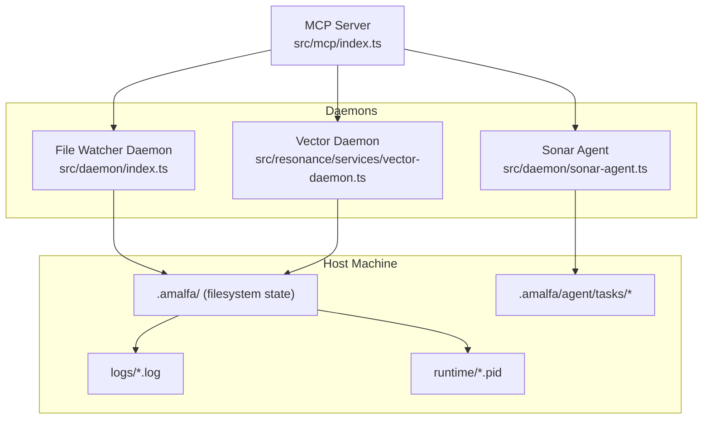

**Diagram sources**
- [src/daemon/index.ts](file://src/daemon/index.ts#L1-L293)
- [src/resonance/services/vector-daemon.ts](file://src/resonance/services/vector-daemon.ts#L1-L234)
- [src/daemon/sonar-agent.ts](file://src/daemon/sonar-agent.ts#L1-L221)
- [src/mcp/index.ts](file://src/mcp/index.ts#L1-L748)
- [src/config/defaults.ts](file://src/config/defaults.ts#L15-L59)

**Section sources**
- [src/config/defaults.ts](file://src/config/defaults.ts#L15-L59)
- [docs/architecture/SERVICE-ARCHITECTURE.md](file://docs/architecture/SERVICE-ARCHITECTURE.md#L281-L383)

## Core Components
- ServiceLifecycle: a unified lifecycle manager that starts/stops daemons, writes PID files, and registers signal handlers for clean shutdown.
- DaemonManager: aggregates management of multiple daemons (vector, reranker, file watcher, Sonar) with status checks and coordinated start/stop.
- MCP Server: loads configuration, auto-starts required daemons, exposes tools, and integrates optional Sonar capabilities.
- File Watcher Daemon: watches configured directories recursively, debounces changes, and triggers ingestion with retry/backoff.
- Vector Daemon: serves HTTP endpoints for embedding and reranking with lazy model initialization and health checks.
- Sonar Agent: optional HTTP server and task queue consumer for advanced reasoning and enrichment.

**Section sources**
- [src/utils/ServiceLifecycle.ts](file://src/utils/ServiceLifecycle.ts#L12-L209)
- [src/utils/DaemonManager.ts](file://src/utils/DaemonManager.ts#L17-L260)
- [src/mcp/index.ts](file://src/mcp/index.ts#L62-L723)
- [src/daemon/index.ts](file://src/daemon/index.ts#L52-L293)
- [src/resonance/services/vector-daemon.ts](file://src/resonance/services/vector-daemon.ts#L72-L230)
- [src/daemon/sonar-agent.ts](file://src/daemon/sonar-agent.ts#L60-L221)

## Architecture Overview
The system follows a loosely coupled, process-per-role architecture with explicit IPC channels:
- Filesystem state: PID files and logs enable external monitoring and lifecycle control.
- Network APIs: Vector Daemon and Sonar Agent expose HTTP endpoints; MCP uses stdio transport to integrate with clients.
- Process signaling: SIGTERM/SIGINT handled uniformly for graceful shutdown.
- Health and heartbeat: periodic readiness checks and lightweight status endpoints.
- Failure propagation: retries with exponential backoff, fallback to local models, and degraded operation modes.

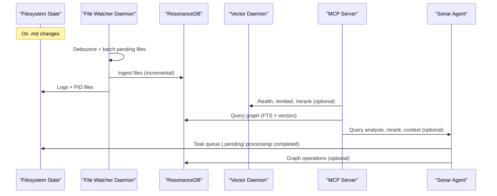

**Diagram sources**
- [src/daemon/index.ts](file://src/daemon/index.ts#L106-L289)
- [src/resonance/services/vector-daemon.ts](file://src/resonance/services/vector-daemon.ts#L77-L224)
- [src/mcp/index.ts](file://src/mcp/index.ts#L267-L513)
- [src/daemon/sonar-agent.ts](file://src/daemon/sonar-agent.ts#L138-L179)

**Section sources**
- [docs/architecture/SERVICE-ARCHITECTURE.md](file://docs/architecture/SERVICE-ARCHITECTURE.md#L300-L383)
- [docs/architecture/ARCHITECTURE-ANALYSIS.md](file://docs/architecture/ARCHITECTURE-ANALYSIS.md#L336-L386)

## Detailed Component Analysis

### File Watcher Daemon and Ingestion Pipeline
The File Watcher Daemon coordinates incremental ingestion triggered by filesystem events:
- Watches configured directories recursively for .md files.
- Debounces bursts of changes and batches them for efficient processing.
- Loads configuration per batch to support runtime changes.
- Opens a database connection, runs ingestion, optionally invokes Ember enrichment, and closes the DB.
- Implements retry/backoff for failed files with bounded attempts and scheduling.
- Emits notifications on success/failure.

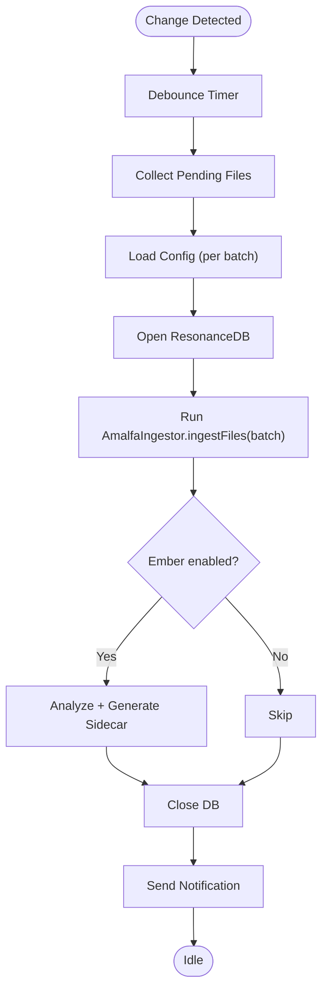

**Diagram sources**
- [src/daemon/index.ts](file://src/daemon/index.ts#L106-L289)

**Section sources**
- [src/daemon/index.ts](file://src/daemon/index.ts#L52-L293)
- [src/services/PipelineTelemetry.ts](file://src/services/PipelineTelemetry.ts#L17-L42)

### Vector Daemon and Search Engine Integration
The Vector Daemon provides low-latency embedding and reranking:
- Initializes the embedding model on first request and keeps it in memory.
- Exposes /health, /embed, and /rerank endpoints.
- Integrates with the MCP server for hybrid retrieval and reranking.
- Supports lazy initialization of the reranker model.

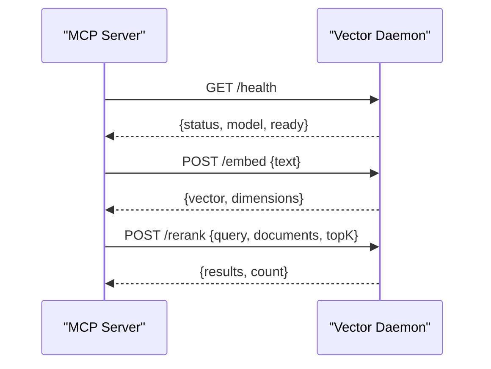

**Diagram sources**
- [src/resonance/services/vector-daemon.ts](file://src/resonance/services/vector-daemon.ts#L77-L224)
- [src/mcp/index.ts](file://src/mcp/index.ts#L316-L430)

**Section sources**
- [src/resonance/services/vector-daemon.ts](file://src/resonance/services/vector-daemon.ts#L28-L67)
- [src/mcp/index.ts](file://src/mcp/index.ts#L267-L513)

### Sonar Agent and Broader System
The Sonar Agent is an optional sub-agent that:
- Manages task queues for synthesis, research, timeline, and gardening tasks.
- Performs health checks for local inference availability and capability discovery.
- Optionally integrates with MCP via a client wrapper for query analysis, reranking, and context extraction.
- Provides an HTTP server for direct control and inspection.

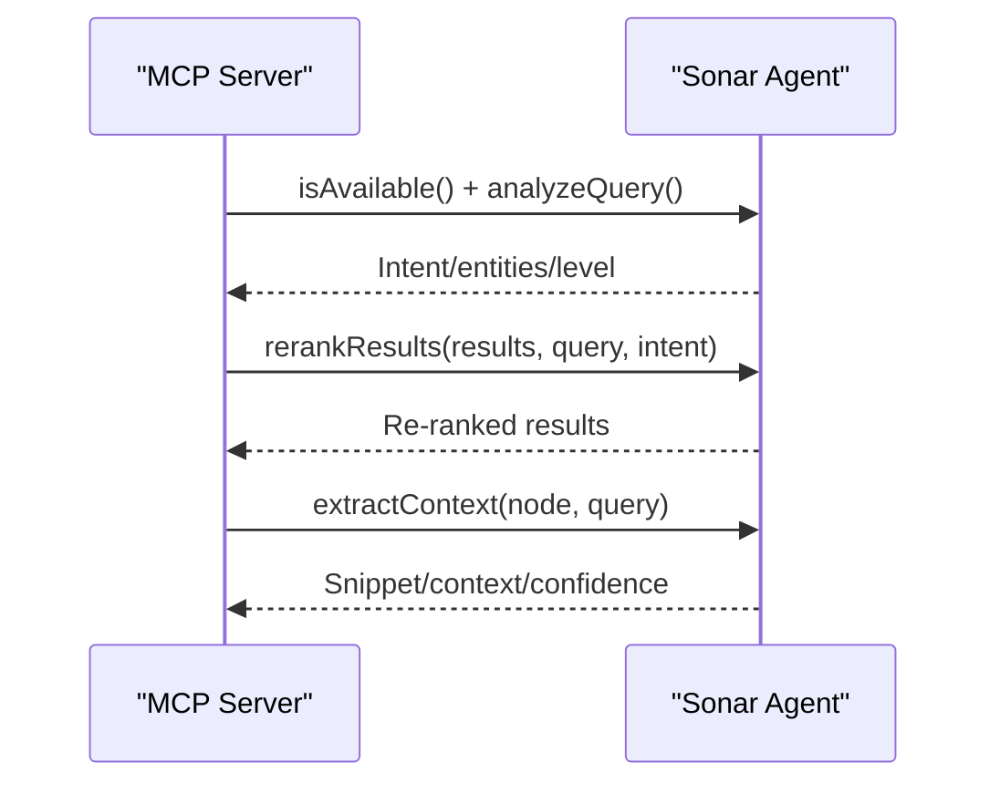

**Diagram sources**
- [src/utils/sonar-client.ts](file://src/utils/sonar-client.ts#L54-L98)
- [src/mcp/index.ts](file://src/mcp/index.ts#L289-L476)
- [src/daemon/sonar-agent.ts](file://src/daemon/sonar-agent.ts#L184-L217)

**Section sources**
- [src/daemon/sonar-agent.ts](file://src/daemon/sonar-agent.ts#L60-L116)
- [src/utils/sonar-client.ts](file://src/utils/sonar-client.ts#L51-L98)
- [src/mcp/index.ts](file://src/mcp/index.ts#L289-L476)

### Service Lifecycle and Process Signaling
All daemons use a shared lifecycle manager:
- Starts daemons in detached mode, writing PID files and truncating logs.
- Stops daemons by sending SIGTERM and force-killing if needed.
- Writes PID files in the serving process for accurate status reporting.
- Registers signal handlers to clean up PID files on exit or crash.

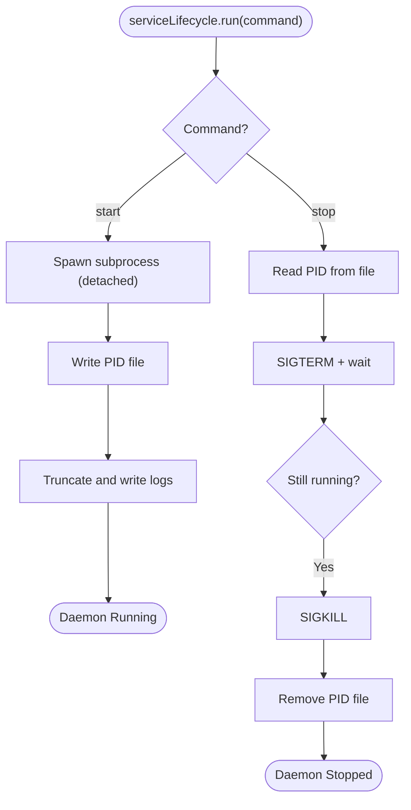

**Diagram sources**
- [src/utils/ServiceLifecycle.ts](file://src/utils/ServiceLifecycle.ts#L27-L108)
- [src/utils/DaemonManager.ts](file://src/utils/DaemonManager.ts#L17-L51)

**Section sources**
- [src/utils/ServiceLifecycle.ts](file://src/utils/ServiceLifecycle.ts#L12-L209)
- [src/utils/DaemonManager.ts](file://src/utils/DaemonManager.ts#L53-L165)
- [debriefs/2026-01-07-amalfa-directory-reorganization.md](file://debriefs/2026-01-07-amalfa-directory-reorganization.md#L83-L114)

### Health Checks and Heartbeats
- Vector Daemon: /health endpoint returns readiness and model info.
- Sonar Agent: client performs periodic health checks with short timeouts and caches results.
- MCP Server: auto-starts daemons and logs their status; uses per-request connections.

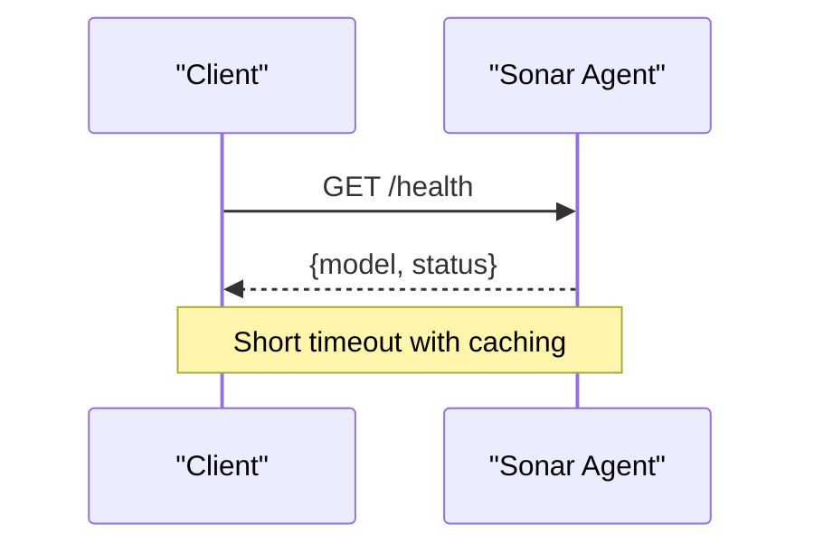

**Diagram sources**
- [src/resonance/services/vector-daemon.ts](file://src/resonance/services/vector-daemon.ts#L82-L95)
- [src/utils/sonar-client.ts](file://src/utils/sonar-client.ts#L83-L98)

**Section sources**
- [src/resonance/services/vector-daemon.ts](file://src/resonance/services/vector-daemon.ts#L82-L95)
- [src/utils/sonar-client.ts](file://src/utils/sonar-client.ts#L51-L98)
- [src/mcp/index.ts](file://src/mcp/index.ts#L121-L139)

### Failure Propagation and Graceful Degradation
- File Watcher: retries failed files with exponential backoff; notifies on abandon.
- Vector Daemon: optional; MCP falls back to slower operations when unavailable.
- Sonar Agent: optional; MCP proceeds with reduced capabilities if unavailable.
- MCP: wraps tool execution with error handling and crash logging.

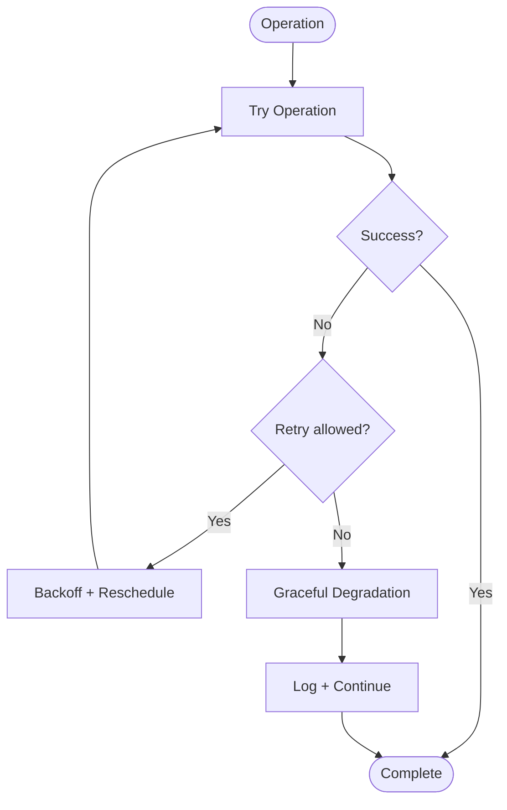

**Diagram sources**
- [src/daemon/index.ts](file://src/daemon/index.ts#L232-L287)
- [src/mcp/index.ts](file://src/mcp/index.ts#L121-L139)

**Section sources**
- [src/daemon/index.ts](file://src/daemon/index.ts#L232-L287)
- [src/mcp/index.ts](file://src/mcp/index.ts#L121-L139)
- [docs/architecture/SERVICE-ARCHITECTURE.md](file://docs/architecture/SERVICE-ARCHITECTURE.md#L305-L318)

### Configuration Sharing and Dynamic Reconfiguration
- Centralized configuration: amalfa.settings.json validated by schema.
- Runtime config reload: ingestion batches reload configuration to reflect changes.
- MCP auto-starts daemons based on config and logs status.
- Directory initialization: all services rely on a shared directory initializer.

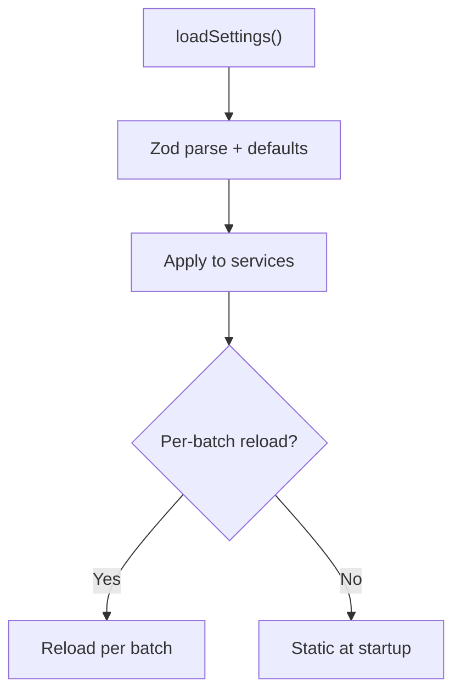

**Diagram sources**
- [src/config/defaults.ts](file://src/config/defaults.ts#L84-L142)
- [src/daemon/index.ts](file://src/daemon/index.ts#L147-L151)
- [src/mcp/index.ts](file://src/mcp/index.ts#L63-L74)

**Section sources**
- [src/config/defaults.ts](file://src/config/defaults.ts#L84-L142)
- [src/daemon/index.ts](file://src/daemon/index.ts#L147-L151)
- [briefs/archive/2026-01-07-daemon-mcp-integration.md](file://briefs/archive/2026-01-07-daemon-mcp-integration.md#L120-L169)

### Service Discovery and Tool Registration
- MCP discovers daemons and starts them if needed.
- Tool registration supports both static and dynamic tools.
- Resource endpoints provide system statistics.

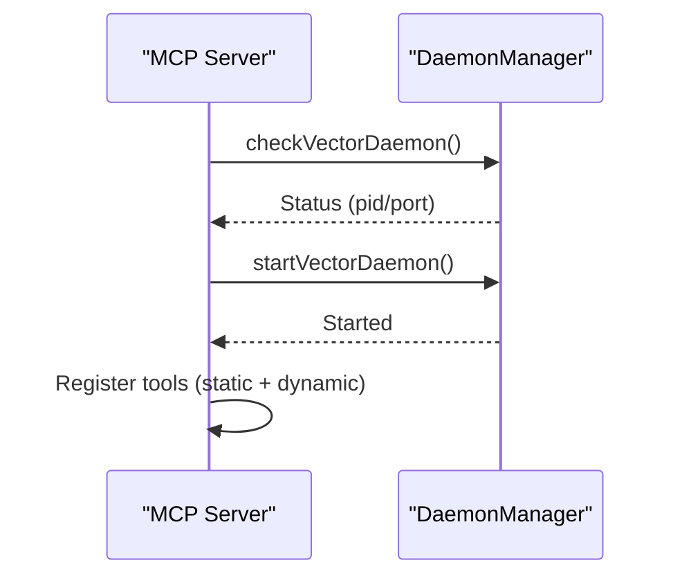

**Diagram sources**
- [src/mcp/index.ts](file://src/mcp/index.ts#L95-L140)
- [src/utils/DaemonManager.ts](file://src/utils/DaemonManager.ts#L103-L114)

**Section sources**
- [src/mcp/index.ts](file://src/mcp/index.ts#L94-L140)
- [src/utils/DaemonManager.ts](file://src/utils/DaemonManager.ts#L17-L51)

### Observability and Monitoring
- Logging: structured logs via pino to stderr; child loggers per component.
- Telemetry: ingestion stage metrics with status and counters.
- Crash handling: uncaught exceptions and unhandled rejections are logged and persisted to a crash log.
- Status endpoints: vector daemon health; MCP resource endpoints for stats.

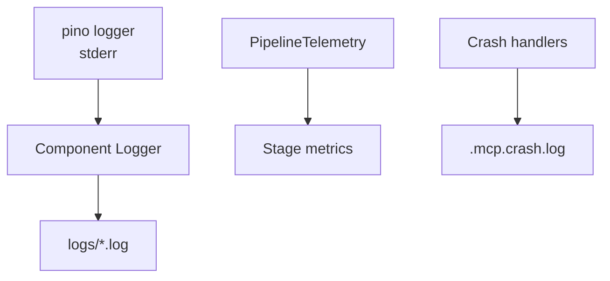

**Diagram sources**
- [src/utils/Logger.ts](file://src/utils/Logger.ts#L4-L23)
- [src/services/PipelineTelemetry.ts](file://src/services/PipelineTelemetry.ts#L17-L42)
- [src/mcp/index.ts](file://src/mcp/index.ts#L727-L743)

**Section sources**
- [src/utils/Logger.ts](file://src/utils/Logger.ts#L4-L23)
- [src/services/PipelineTelemetry.ts](file://src/services/PipelineTelemetry.ts#L17-L42)
- [src/mcp/index.ts](file://src/mcp/index.ts#L727-L743)

## Dependency Analysis
The following diagram shows key dependencies among components and their IPC channels:

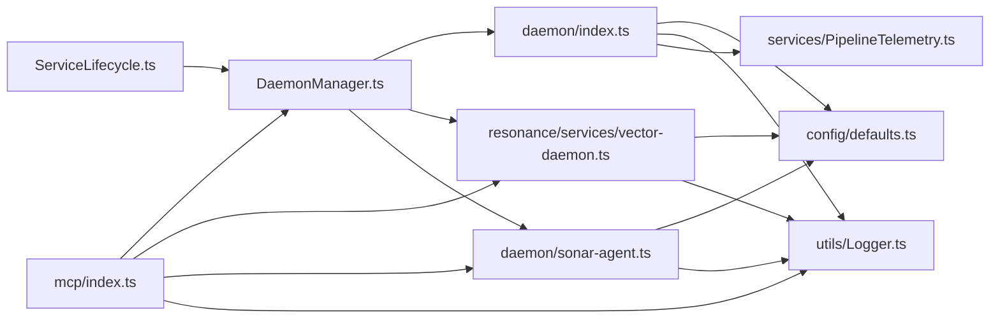

**Diagram sources**
- [src/utils/ServiceLifecycle.ts](file://src/utils/ServiceLifecycle.ts#L12-L209)
- [src/utils/DaemonManager.ts](file://src/utils/DaemonManager.ts#L17-L51)
- [src/daemon/index.ts](file://src/daemon/index.ts#L1-L293)
- [src/resonance/services/vector-daemon.ts](file://src/resonance/services/vector-daemon.ts#L1-L234)
- [src/daemon/sonar-agent.ts](file://src/daemon/sonar-agent.ts#L1-L221)
- [src/mcp/index.ts](file://src/mcp/index.ts#L1-L748)
- [src/config/defaults.ts](file://src/config/defaults.ts#L1-L143)
- [src/utils/Logger.ts](file://src/utils/Logger.ts#L1-L23)
- [src/services/PipelineTelemetry.ts](file://src/services/PipelineTelemetry.ts#L1-L42)

**Section sources**
- [src/utils/ServiceLifecycle.ts](file://src/utils/ServiceLifecycle.ts#L12-L209)
- [src/utils/DaemonManager.ts](file://src/utils/DaemonManager.ts#L17-L51)
- [src/mcp/index.ts](file://src/mcp/index.ts#L94-L140)

## Performance Considerations
- Cold start vs hot start: vector daemon reduces ingestion and query latency by keeping models loaded.
- Parallelism: MCP runs vector and grep search concurrently, then merges and reranks.
- Backpressure: debouncing and batching reduce I/O pressure; retries avoid blocking on transient failures.
- Optional optimization: vector daemon is optional; MCP degrades gracefully without it.

[No sources needed since this section provides general guidance]

## Troubleshooting Guide
Common issues and remedies:
- Missing configuration: ensure the Single Source of Truth file exists and is valid; the system will exit with guidance if missing.
- PID file problems: lifecycle manager clears stale PID files and writes reliable PID entries; verify permissions and paths.
- Daemon startup failures: MCP warns and continues without optional daemons; check logs and restart daemons.
- Health check timeouts: vector and Sonar clients use short timeouts and caching; verify service availability and ports.
- Crash logs: unhandled errors are logged and appended to a crash log for post-mortem analysis.

**Section sources**
- [src/config/defaults.ts](file://src/config/defaults.ts#L84-L139)
- [src/utils/ServiceLifecycle.ts](file://src/utils/ServiceLifecycle.ts#L31-L42)
- [src/mcp/index.ts](file://src/mcp/index.ts#L105-L133)
- [src/utils/sonar-client.ts](file://src/utils/sonar-client.ts#L83-L98)
- [src/mcp/index.ts](file://src/mcp/index.ts#L727-L743)

## Conclusion
Amalfa’s service coordination relies on explicit, process-per-role daemons with shared filesystem state, network APIs, and consistent lifecycle management. The MCP server orchestrates optional capabilities, enabling graceful degradation and robust fallbacks. Health checks, retries, and structured logging provide strong observability for cross-service debugging and performance analysis.

## Appendices

### Message Passing Protocols
- Filesystem: PID files, logs, task queues (.pending/.processing/.completed).
- HTTP: Vector Daemon (/health, /embed, /rerank), Sonar Agent (HTTP server).
- MCP: stdio transport for tool invocation and resource access.

**Section sources**
- [src/resonance/services/vector-daemon.ts](file://src/resonance/services/vector-daemon.ts#L77-L224)
- [src/daemon/sonar-agent.ts](file://src/daemon/sonar-agent.ts#L123-L133)
- [src/mcp/index.ts](file://src/mcp/index.ts#L720-L723)

### Synchronization Primitives
- PID files and signals for lifecycle control.
- Debouncing timers and retry queues for event coalescing and fault tolerance.
- HTTP endpoints for coordination points between services.

**Section sources**
- [src/utils/ServiceLifecycle.ts](file://src/utils/ServiceLifecycle.ts#L56-L98)
- [src/daemon/index.ts](file://src/daemon/index.ts#L132-L289)

### Dynamic Reconfiguration and Service Discovery
- Per-batch config reload in ingestion.
- MCP auto-starts daemons and registers tools dynamically.
- Directory initialization ensures consistent runtime state.

**Section sources**
- [src/daemon/index.ts](file://src/daemon/index.ts#L147-L151)
- [src/mcp/index.ts](file://src/mcp/index.ts#L94-L140)
- [src/config/defaults.ts](file://src/config/defaults.ts#L42-L59)

### Health and Heartbeat Mechanisms
- Vector Daemon /health endpoint.
- Sonar client health checks with caching and timeouts.
- MCP resource endpoints for system stats.

**Section sources**
- [src/resonance/services/vector-daemon.ts](file://src/resonance/services/vector-daemon.ts#L82-L95)
- [src/utils/sonar-client.ts](file://src/utils/sonar-client.ts#L83-L98)
- [src/mcp/index.ts](file://src/mcp/index.ts#L702-L717)

### Example: MCP Handshake and Lifecycle Test
A test verifies the MCP server lifecycle and handshake behavior.

**Section sources**
- [scripts/verify/test_mcp_lifecycle.ts](file://scripts/verify/test_mcp_lifecycle.ts#L45-L79)