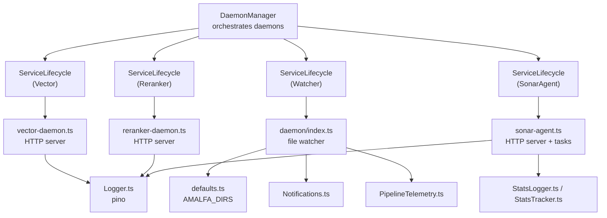
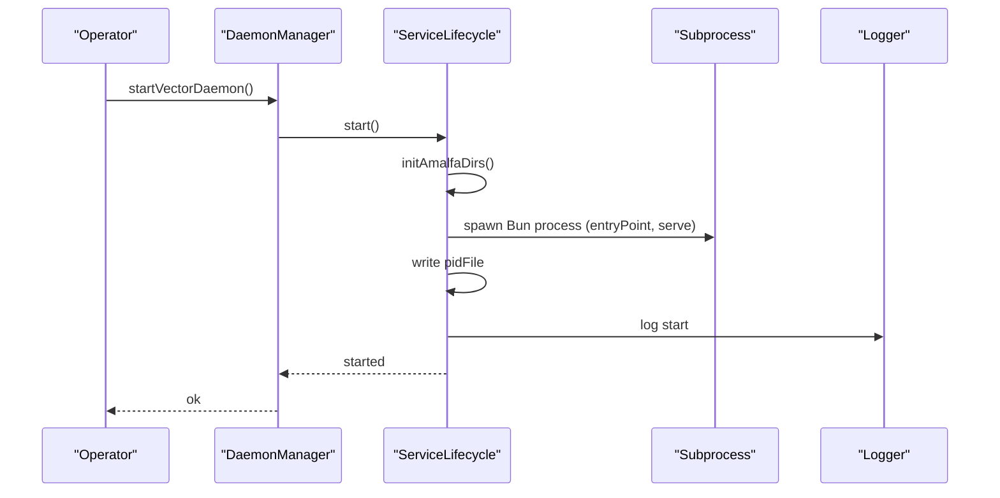
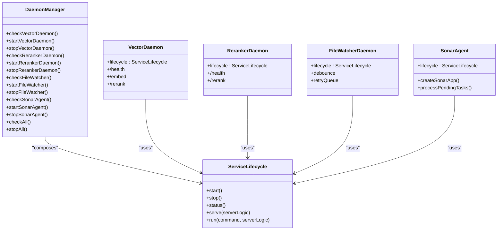

# Service Lifecycle Management

<cite>
**Referenced Files in This Document**
- [DaemonManager.ts](file://src/utils/DaemonManager.ts)
- [ServiceLifecycle.ts](file://src/utils/ServiceLifecycle.ts)
- [vector-daemon.ts](file://src/resonance/services/vector-daemon.ts)
- [reranker-daemon.ts](file://src/resonance/services/reranker-daemon.ts)
- [index.ts](file://src/daemon/index.ts)
- [sonar-agent.ts](file://src/daemon/sonar-agent.ts)
- [sonar-server.ts](file://src/daemon/sonar-server.ts)
- [Logger.ts](file://src/utils/Logger.ts)
- [defaults.ts](file://src/config/defaults.ts)
- [Notifications.ts](file://src/utils/Notifications.ts)
- [PipelineTelemetry.ts](file://src/services/PipelineTelemetry.ts)
- [StatsLogger.ts](file://src/utils/StatsLogger.ts)
- [StatsTracker.ts](file://src/utils/StatsTracker.ts)
</cite>

## Table of Contents
1. [Introduction](#introduction)
2. [Project Structure](#project-structure)
3. [Core Components](#core-components)
4. [Architecture Overview](#architecture-overview)
5. [Detailed Component Analysis](#detailed-component-analysis)
6. [Dependency Analysis](#dependency-analysis)
7. [Performance Considerations](#performance-considerations)
8. [Troubleshooting Guide](#troubleshooting-guide)
9. [Conclusion](#conclusion)

## Introduction
This document describes Amalfa’s service lifecycle management system, focusing on the DaemonManager orchestrator and the ServiceLifecycle abstraction. It explains how multiple daemon processes are coordinated—startup sequencing, health monitoring, graceful shutdown—and how individual services manage their own lifecycle phases, including process spawning, PID file management, and automatic restart logic. It also covers health checking mechanisms, process state tracking, error recovery strategies, unified logging, resource allocation patterns, inter-daemon communication coordination, lifecycle hooks, dependency management, failover scenarios, monitoring and alerting integration, performance metrics collection, and operational visibility features.

## Project Structure
The lifecycle management spans several modules:
- Orchestrator: DaemonManager coordinates multiple daemons
- Lifecycle engine: ServiceLifecycle encapsulates start/stop/status/serve and PID/log management
- Daemons: Vector, Reranker, File Watcher, and Sonar Agent
- Utilities: Logging, configuration, notifications, telemetry, and stats

**Diagram sources**
- [DaemonManager.ts](file://src/utils/DaemonManager.ts#L17-L51)
- [ServiceLifecycle.ts](file://src/utils/ServiceLifecycle.ts#L12-L209)
- [vector-daemon.ts](file://src/resonance/services/vector-daemon.ts#L21-L26)
- [reranker-daemon.ts](file://src/resonance/services/reranker-daemon.ts#L19-L24)
- [index.ts](file://src/daemon/index.ts#L29-L35)
- [sonar-agent.ts](file://src/daemon/sonar-agent.ts#L49-L55)
- [Logger.ts](file://src/utils/Logger.ts#L1-L23)
- [defaults.ts](file://src/config/defaults.ts#L16-L59)
- [Notifications.ts](file://src/utils/Notifications.ts#L1-L66)
- [PipelineTelemetry.ts](file://src/services/PipelineTelemetry.ts#L1-L42)
- [StatsLogger.ts](file://src/utils/StatsLogger.ts#L1-L84)
- [StatsTracker.ts](file://src/utils/StatsTracker.ts#L1-L218)

**Section sources**
- [DaemonManager.ts](file://src/utils/DaemonManager.ts#L1-L260)
- [ServiceLifecycle.ts](file://src/utils/ServiceLifecycle.ts#L1-L209)
- [vector-daemon.ts](file://src/resonance/services/vector-daemon.ts#L1-L234)
- [reranker-daemon.ts](file://src/resonance/services/reranker-daemon.ts#L1-L145)
- [index.ts](file://src/daemon/index.ts#L1-L293)
- [sonar-agent.ts](file://src/daemon/sonar-agent.ts#L1-L221)
- [Logger.ts](file://src/utils/Logger.ts#L1-L23)
- [defaults.ts](file://src/config/defaults.ts#L1-L143)
- [Notifications.ts](file://src/utils/Notifications.ts#L1-L66)
- [PipelineTelemetry.ts](file://src/services/PipelineTelemetry.ts#L1-L42)
- [StatsLogger.ts](file://src/utils/StatsLogger.ts#L1-L84)
- [StatsTracker.ts](file://src/utils/StatsTracker.ts#L1-L218)

## Core Components
- DaemonManager: Central coordinator managing four daemons (Vector, Reranker, File Watcher, Sonar Agent). Provides status checks, start/stop orchestration, and safe shutdown sequences.
- ServiceLifecycle: Abstraction that manages a single service lifecycle, including PID/log file handling, process spawning, graceful stop with SIGTERM/SIGKILL fallback, and serve-mode lifecycle hooks.

Key responsibilities:
- Startup sequencing: DaemonManager starts daemons with short delays to allow initialization.
- Health monitoring: Per-daemon status checks and HTTP health endpoints.
- Graceful shutdown: SIGTERM handling with fallback to SIGKILL; PID file cleanup.
- Automatic restart logic: ServiceLifecycle supports restart command and can be invoked by DaemonManager.
- Inter-daemon coordination: DaemonManager exposes unified status and stop-all for operational control.

**Section sources**
- [DaemonManager.ts](file://src/utils/DaemonManager.ts#L17-L51)
- [ServiceLifecycle.ts](file://src/utils/ServiceLifecycle.ts#L27-L108)

## Architecture Overview
The system uses a modular lifecycle pattern:
- Each daemon defines its own ServiceLifecycle configuration and entry point.
- DaemonManager composes these lifecycles and exposes a unified interface.
- Health checks are implemented via HTTP endpoints in daemons and via PID checks in DaemonManager.
- Logging is centralized through pino with component-scoped loggers.
- Notifications integrate with OS-specific mechanisms for non-critical alerts.
- Telemetry and stats capture operational insights for monitoring and diagnostics.

**Diagram sources**
- [DaemonManager.ts](file://src/utils/DaemonManager.ts#L103-L107)
- [ServiceLifecycle.ts](file://src/utils/ServiceLifecycle.ts#L27-L67)
- [Logger.ts](file://src/utils/Logger.ts#L1-L23)

**Section sources**
- [DaemonManager.ts](file://src/utils/DaemonManager.ts#L103-L107)
- [ServiceLifecycle.ts](file://src/utils/ServiceLifecycle.ts#L27-L67)

## Detailed Component Analysis

### DaemonManager
Responsibilities:
- Compose four ServiceLifecycle instances with distinct configurations (names, PID/log paths, entry points).
- Provide per-daemon status checks using PID file inspection and process signaling.
- Expose start/stop methods with small initialization delays to allow daemons to become ready.
- Offer unified stopAll and checkAll for operational control.

Health monitoring:
- Vector/Reranker: status includes running flag, PID, and port.
- File Watcher: status includes running flag and PID.
- Sonar Agent: status includes running flag, PID, port, and active model from /health.

Graceful shutdown:
- DaemonManager.stopAll invokes ServiceLifecycle.stop on all daemons concurrently.

Startup sequencing:
- DaemonManager.start* methods pause briefly after invoking ServiceLifecycle.start to allow daemons to initialize.

Inter-daemon coordination:
- DaemonManager.checkAll returns a consolidated status map for observability.

**Section sources**
- [DaemonManager.ts](file://src/utils/DaemonManager.ts#L17-L51)
- [DaemonManager.ts](file://src/utils/DaemonManager.ts#L84-L98)
- [DaemonManager.ts](file://src/utils/DaemonManager.ts#L119-L133)
- [DaemonManager.ts](file://src/utils/DaemonManager.ts#L154-L165)
- [DaemonManager.ts](file://src/utils/DaemonManager.ts#L186-L212)
- [DaemonManager.ts](file://src/utils/DaemonManager.ts#L233-L246)
- [DaemonManager.ts](file://src/utils/DaemonManager.ts#L251-L258)

### ServiceLifecycle
Responsibilities:
- Encapsulate lifecycle commands: start, stop, status, restart, serve.
- Manage PID files and log files for each service.
- Spawn detached subprocesses with explicit environment inheritance.
- Provide serve-mode lifecycle hooks with signal handling and PID file cleanup.

Lifecycle phases:
- start: Ensure directories, detect stale PID, truncate logs, spawn process, write PID, detach.
- stop: Read PID, send SIGTERM, wait up to 1s, fall back to SIGKILL, remove PID file.
- status: Print running/stopped/stale PID status.
- serve: Write PID, register cleanup handlers for signals and exit, run provided server logic.
- run: Dispatch to appropriate command handler.

Automatic restart logic:
- restart executes stop, waits, then start.

Error recovery:
- Stale PID detection and cleanup.
- Non-blocking cleanup on exit with truncation to mark stale state.

Resource allocation:
- Uses initAmalfaDirs to ensure .amalfa/{logs,runtime,cache,agent} exist.
- Writes logs to configured log files.

**Section sources**
- [ServiceLifecycle.ts](file://src/utils/ServiceLifecycle.ts#L12-L209)
- [ServiceLifecycle.ts](file://src/utils/ServiceLifecycle.ts#L27-L67)
- [ServiceLifecycle.ts](file://src/utils/ServiceLifecycle.ts#L72-L108)
- [ServiceLifecycle.ts](file://src/utils/ServiceLifecycle.ts#L113-L124)
- [ServiceLifecycle.ts](file://src/utils/ServiceLifecycle.ts#L130-L173)
- [ServiceLifecycle.ts](file://src/utils/ServiceLifecycle.ts#L178-L207)

### Vector Daemon
Role:
- HTTP server for embedding generation and reranking.
- Maintains models in memory for low-latency responses.

Lifecycle:
- Wrapped with ServiceLifecycle for start/stop/status/serve.

Health endpoint:
- /health returns status, model, readiness flags.

Endpoints:
- /embed: generates normalized embeddings using FAFCAS protocol.
- /rerank: reranks documents using BGE-M3.

Initialization:
- Lazy model loading with progress reporting.
- Ensures cache directory exists.

Logging:
- Component-scoped logger with structured fields.

**Section sources**
- [vector-daemon.ts](file://src/resonance/services/vector-daemon.ts#L21-L26)
- [vector-daemon.ts](file://src/resonance/services/vector-daemon.ts#L36-L56)
- [vector-daemon.ts](file://src/resonance/services/vector-daemon.ts#L61-L67)
- [vector-daemon.ts](file://src/resonance/services/vector-daemon.ts#L72-L230)
- [vector-daemon.ts](file://src/resonance/services/vector-daemon.ts#L82-L95)
- [vector-daemon.ts](file://src/resonance/services/vector-daemon.ts#L162-L219)
- [vector-daemon.ts](file://src/resonance/services/vector-daemon.ts#L232-L234)

### Reranker Daemon
Role:
- Dedicated reranking service without embedding dependencies.

Lifecycle:
- Wrapped with ServiceLifecycle for lifecycle management.

Health endpoint:
- /health returns status and model readiness.

Endpoints:
- /rerank: reranks documents with configurable topK and threshold.

Initialization:
- Lazy model loading on first request.

**Section sources**
- [reranker-daemon.ts](file://src/resonance/services/reranker-daemon.ts#L19-L24)
- [reranker-daemon.ts](file://src/resonance/services/reranker-daemon.ts#L32-L38)
- [reranker-daemon.ts](file://src/resonance/services/reranker-daemon.ts#L43-L141)
- [reranker-daemon.ts](file://src/resonance/services/reranker-daemon.ts#L50-L62)
- [reranker-daemon.ts](file://src/resonance/services/reranker-daemon.ts#L64-L127)
- [reranker-daemon.ts](file://src/resonance/services/reranker-daemon.ts#L143-L145)

### File Watcher Daemon
Role:
- Monitors source directories for Markdown changes and triggers ingestion.

Lifecycle:
- Wrapped with ServiceLifecycle for lifecycle management.

Debouncing and batching:
- Pending files tracked in a Set; ingestion triggered after a configurable debounce interval.

Retry logic:
- Failed files re-queued with exponential backoff and capped retries.

Ember integration:
- Optional enrichment pipeline gated by Git changes and content signature checks.

Notifications:
- Sends desktop notifications on successful and failed updates.

Telemetry:
- Updates PipelineTelemetry with enrichment status.

**Section sources**
- [index.ts](file://src/daemon/index.ts#L29-L35)
- [index.ts](file://src/daemon/index.ts#L52-L95)
- [index.ts](file://src/daemon/index.ts#L100-L127)
- [index.ts](file://src/daemon/index.ts#L132-L289)
- [index.ts](file://src/daemon/index.ts#L162-L214)
- [index.ts](file://src/daemon/index.ts#L225-L231)
- [index.ts](file://src/daemon/index.ts#L281-L287)
- [PipelineTelemetry.ts](file://src/services/PipelineTelemetry.ts#L17-L38)

### Sonar Agent
Role:
- Multi-purpose agent with HTTP API, task processing, and inference orchestration.

Lifecycle:
- Wrapped with ServiceLifecycle for lifecycle management.

HTTP API:
- SonarServer exposes /health, /chat, /metadata/enhance, /graph/stats, /search/* endpoints.

Task processing:
- Watches .amalfa/agent/tasks/pending and moves items through processing/completed directories.
- Executes tasks (synthesis, timeline, garden, research, enhance_batch) with reporting.

Inference state:
- Checks Ollama availability and discovers model capabilities; falls back to cloud if configured.

**Section sources**
- [sonar-agent.ts](file://src/daemon/sonar-agent.ts#L49-L55)
- [sonar-agent.ts](file://src/daemon/sonar-agent.ts#L60-L116)
- [sonar-agent.ts](file://src/daemon/sonar-agent.ts#L118-L133)
- [sonar-agent.ts](file://src/daemon/sonar-agent.ts#L138-L179)
- [sonar-agent.ts](file://src/daemon/sonar-agent.ts#L184-L217)
- [sonar-server.ts](file://src/daemon/sonar-server.ts#L24-L133)

### Unified Logging System
- pino-based logger configured with ISO timestamps and component-scoped child loggers.
- Root logger writes to stderr to avoid interfering with CLI/MCP output streams.
- Used consistently across daemons and utilities.

**Section sources**
- [Logger.ts](file://src/utils/Logger.ts#L1-L23)
- [vector-daemon.ts](file://src/resonance/services/vector-daemon.ts#L17-L17)
- [reranker-daemon.ts](file://src/resonance/services/reranker-daemon.ts#L15-L15)
- [index.ts](file://src/daemon/index.ts#L27-L27)
- [sonar-agent.ts](file://src/daemon/sonar-agent.ts#L38-L38)

### Resource Allocation Patterns
- initAmalfaDirs ensures presence of .amalfa subdirectories for logs, runtime, cache, scratchpad, and agent task queues.
- PID/log files stored under .amalfa/runtime and .amalfa/logs for isolation and easy cleanup.
- Model caches stored under .amalfa/cache to persist downloads and reduce cold-start latency.

**Section sources**
- [defaults.ts](file://src/config/defaults.ts#L42-L59)
- [ServiceLifecycle.ts](file://src/utils/ServiceLifecycle.ts#L28-L45)
- [vector-daemon.ts](file://src/resonance/services/vector-daemon.ts#L41-L47)

### Inter-Daemon Communication Coordination
- DaemonManager provides a unified interface to coordinate multiple daemons.
- Sonar Agent exposes an HTTP API for external clients; Vector/Reranker daemons expose HTTP endpoints for embedding and reranking.
- Notifications integrate with OS-specific mechanisms for non-critical alerts.

**Section sources**
- [DaemonManager.ts](file://src/utils/DaemonManager.ts#L233-L246)
- [sonar-server.ts](file://src/daemon/sonar-server.ts#L24-L133)
- [vector-daemon.ts](file://src/resonance/services/vector-daemon.ts#L77-L224)
- [reranker-daemon.ts](file://src/resonance/services/reranker-daemon.ts#L45-L132)
- [Notifications.ts](file://src/utils/Notifications.ts#L8-L30)

### Lifecycle Hooks and Dependency Management
- DaemonManager.start* methods introduce small delays to allow daemons to initialize before subsequent starts.
- ServiceLifecycle.serve registers signal handlers and cleanup routines to ensure PID file removal on exit or crash.
- File Watcher integrates with Ember pipeline and telemetry updates for enrichment stages.

**Section sources**
- [DaemonManager.ts](file://src/utils/DaemonManager.ts#L105-L106)
- [DaemonManager.ts](file://src/utils/DaemonManager.ts#L140-L141)
- [DaemonManager.ts](file://src/utils/DaemonManager.ts#L172-L173)
- [DaemonManager.ts](file://src/utils/DaemonManager.ts#L219-L220)
- [ServiceLifecycle.ts](file://src/utils/ServiceLifecycle.ts#L139-L170)
- [index.ts](file://src/daemon/index.ts#L162-L214)

### Failover Scenarios
- Sonar Agent can operate with cloud providers if local Ollama is unavailable and cloud is enabled.
- Reranker daemon operates independently without FastEmbed dependency, enabling partial functionality if primary vector daemon fails.
- File Watcher continues operating and retries failed files with backoff.

**Section sources**
- [sonar-agent.ts](file://src/daemon/sonar-agent.ts#L91-L96)
- [reranker-daemon.ts](file://src/resonance/services/reranker-daemon.ts#L1-L6)

### Monitoring and Alerting Integration
- Health endpoints (/health) in Vector, Reranker, and Sonar Agent provide readiness and model status.
- DaemonManager.check* methods aggregate per-daemon status for operational dashboards.
- Notifications module sends desktop notifications on successful and failed updates.
- PipelineTelemetry tracks enrichment stage metrics.
- StatsLogger and StatsTracker maintain run histories and database snapshots for trend analysis.

**Section sources**
- [vector-daemon.ts](file://src/resonance/services/vector-daemon.ts#L82-L95)
- [reranker-daemon.ts](file://src/resonance/services/reranker-daemon.ts#L50-L62)
- [sonar-server.ts](file://src/daemon/sonar-server.ts#L40-L53)
- [DaemonManager.ts](file://src/utils/DaemonManager.ts#L233-L246)
- [Notifications.ts](file://src/utils/Notifications.ts#L8-L30)
- [PipelineTelemetry.ts](file://src/services/PipelineTelemetry.ts#L17-L38)
- [StatsLogger.ts](file://src/utils/StatsLogger.ts#L19-L83)
- [StatsTracker.ts](file://src/utils/StatsTracker.ts#L25-L218)

## Dependency Analysis

**Diagram sources**
- [DaemonManager.ts](file://src/utils/DaemonManager.ts#L17-L51)
- [ServiceLifecycle.ts](file://src/utils/ServiceLifecycle.ts#L12-L209)
- [vector-daemon.ts](file://src/resonance/services/vector-daemon.ts#L21-L26)
- [reranker-daemon.ts](file://src/resonance/services/reranker-daemon.ts#L19-L24)
- [index.ts](file://src/daemon/index.ts#L29-L35)
- [sonar-agent.ts](file://src/daemon/sonar-agent.ts#L49-L55)

**Section sources**
- [DaemonManager.ts](file://src/utils/DaemonManager.ts#L17-L51)
- [ServiceLifecycle.ts](file://src/utils/ServiceLifecycle.ts#L12-L209)

## Performance Considerations
- Model warm-up: Vector and Reranker daemons lazy-load models on first request; initial latency occurs once per daemon restart.
- Debouncing: File Watcher batches rapid changes to reduce ingestion overhead.
- Retry backoff: Failed ingestion attempts are retried with exponential backoff to avoid thundering herd.
- PID/log file I/O: Node fs is used for PID file writes to mitigate Bun.write synchronization issues.
- Telemetry and stats: Structured metrics enable trend analysis and capacity planning.

[No sources needed since this section provides general guidance]

## Troubleshooting Guide
Common issues and resolutions:
- Stale PID file: ServiceLifecycle detects stale PIDs and cleans them up during start.
- Daemon not responding: Use DaemonManager.check* to confirm running state and port; consult logs in .amalfa/logs.
- Graceful shutdown failures: ServiceLifecycle sends SIGTERM and falls back to SIGKILL after a timeout; PID file is removed on exit.
- File Watcher failures: Review retry queue and backoff behavior; ensure source directories exist and are readable.
- Notifications not appearing: Notifications rely on platform-specific tools; failures are non-critical and logged silently.

**Section sources**
- [ServiceLifecycle.ts](file://src/utils/ServiceLifecycle.ts#L32-L42)
- [ServiceLifecycle.ts](file://src/utils/ServiceLifecycle.ts#L84-L94)
- [ServiceLifecycle.ts](file://src/utils/ServiceLifecycle.ts#L161-L170)
- [index.ts](file://src/daemon/index.ts#L132-L289)
- [Notifications.ts](file://src/utils/Notifications.ts#L26-L29)

## Conclusion
Amalfa’s service lifecycle management combines a robust orchestration layer (DaemonManager) with a reusable lifecycle abstraction (ServiceLifecycle). Together, they provide deterministic startup sequencing, reliable health monitoring, graceful shutdown procedures, and operational visibility through logging, telemetry, and notifications. The modular design enables independent scaling and failover strategies across daemons while maintaining consistent resource allocation and error recovery patterns.