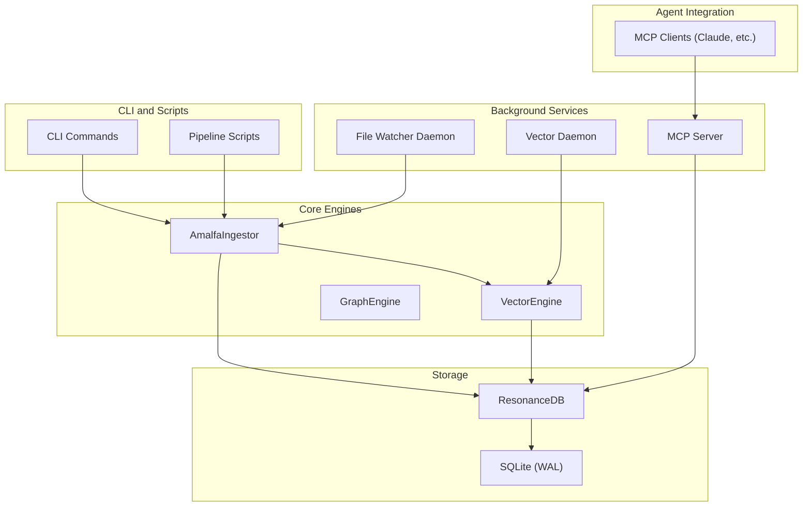
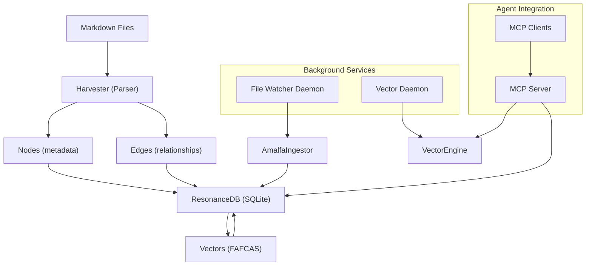
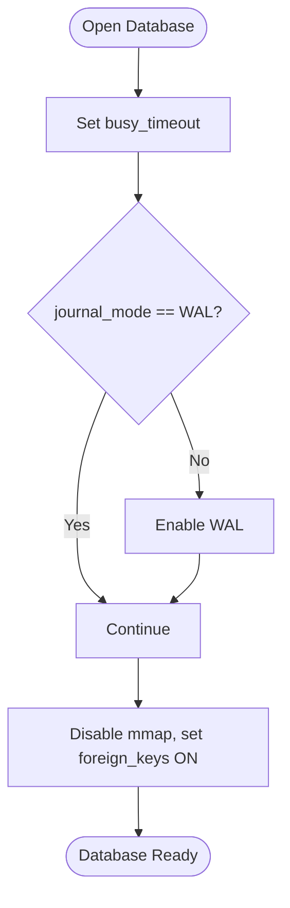
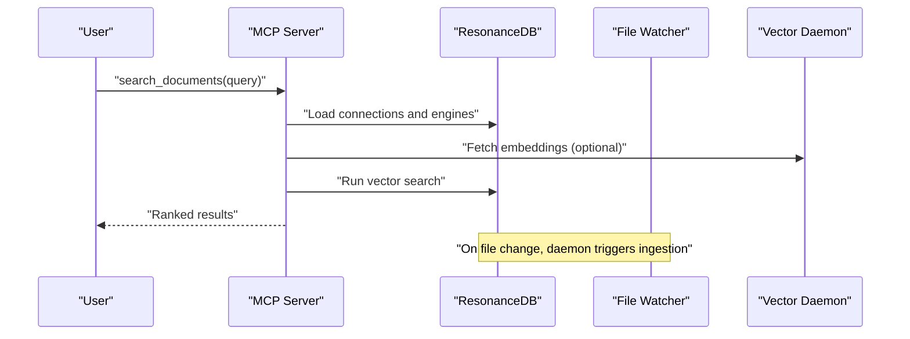
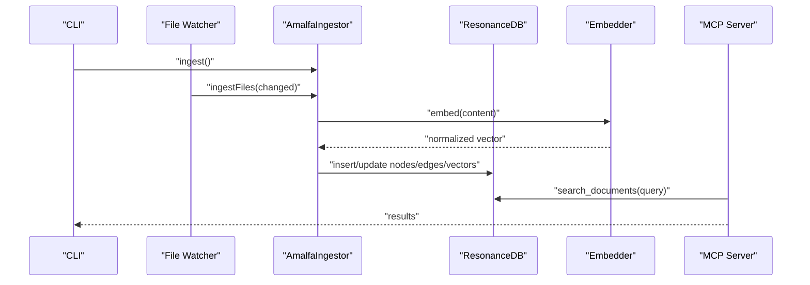
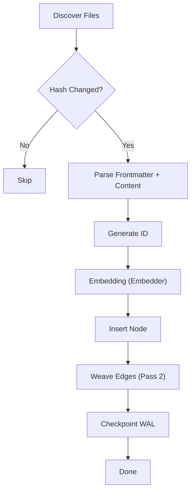
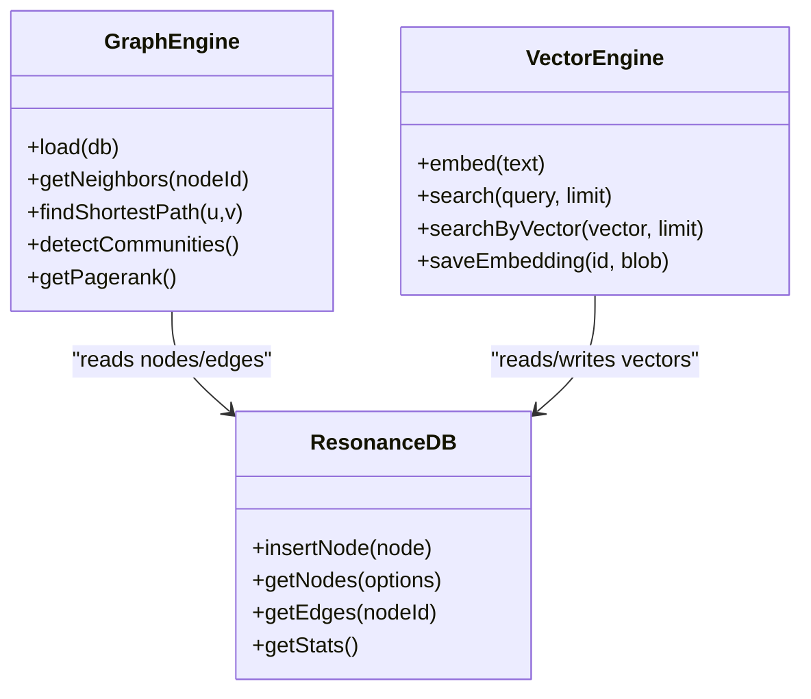
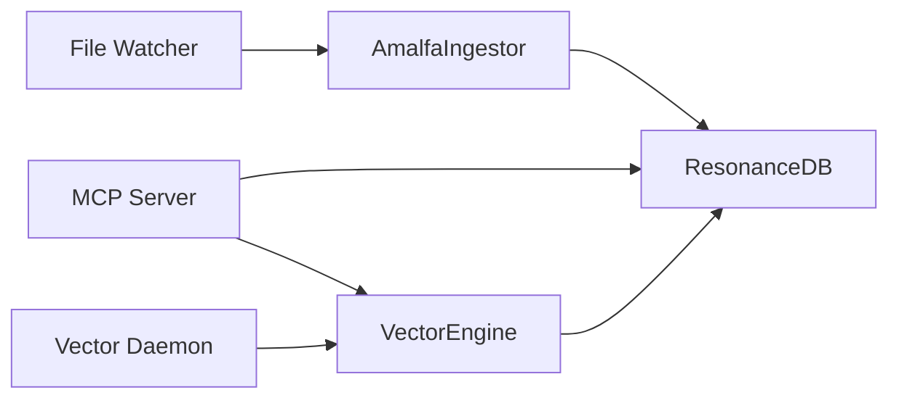

# System Overview

<cite>
**Referenced Files in This Document**
- [docs/ARCHITECTURE.md](file://docs/ARCHITECTURE.md)
- [docs/ARCHITECTURAL_OVERVIEW.md](file://docs/ARCHITECTURAL_OVERVIEW.md)
- [docs/architecture/SERVICE-ARCHITECTURE.md](file://docs/architecture/SERVICE-ARCHITECTURE.md)
- [docs/architecture/daemon-operations.md](file://docs/architecture/daemon-operations.md)
- [docs/architecture/ingestion-pipeline.md](file://docs/architecture/ingestion-pipeline.md)
- [docs/architecture/pipeline.md](file://docs/architecture/pipeline.md)
- [docs/references/Graph and Vector Database Best Practices.md](file://docs/references/Graph and Vector Database Best Practices.md)
- [docs/references/hardened-sqlite.md](file://docs/references/hardened-sqlite.md)
- [src/resonance/db.ts](file://src/resonance/db.ts)
- [src/resonance/DatabaseFactory.ts](file://src/resonance/DatabaseFactory.ts)
- [src/resonance/services/vector-daemon.ts](file://src/resonance/services/vector-daemon.ts)
- [src/resonance/services/embedder.ts](file://src/resonance/services/embedder.ts)
- [src/core/VectorEngine.ts](file://src/core/VectorEngine.ts)
- [src/core/GraphEngine.ts](file://src/core/GraphEngine.ts)
- [src/daemon/index.ts](file://src/daemon/index.ts)
- [src/mcp/index.ts](file://src/mcp/index.ts)
- [src/utils/ServiceLifecycle.ts](file://src/utils/ServiceLifecycle.ts)
- [src/pipeline/AmalfaIngestor.ts](file://src/pipeline/AmalfaIngestor.ts)
</cite>

## Table of Contents
1. [Introduction](#introduction)
2. [Project Structure](#project-structure)
3. [Core Components](#core-components)
4. [Architecture Overview](#architecture-overview)
5. [Detailed Component Analysis](#detailed-component-analysis)
6. [Dependency Analysis](#dependency-analysis)
7. [Performance Considerations](#performance-considerations)
8. [Troubleshooting Guide](#troubleshooting-guide)
9. [Conclusion](#conclusion)

## Introduction
Amalfa is a local-first knowledge graph system that treats markdown as the single source of truth. This philosophy underpins the ingestion pipeline, graph storage, and retrieval mechanisms. The system emphasizes determinism, auditability, and seamless integration with AI agents via the Model Context Protocol (MCP). Persistent background services (daemons) enable continuous synchronization and on-demand vector generation, while SQLite with WAL mode provides robust, concurrency-safe storage.

## Project Structure
At a high level, Amalfa separates concerns across:
- Ingestion and graph construction (pipeline and core modules)
- Persistent storage (ResonanceDB and SQLite)
- Background services (file watcher, vector daemon, MCP server)
- Agent integration (MCP protocol)

**Diagram sources**
- [src/daemon/index.ts](file://src/daemon/index.ts#L1-L293)
- [src/resonance/services/vector-daemon.ts](file://src/resonance/services/vector-daemon.ts#L1-L234)
- [src/mcp/index.ts](file://src/mcp/index.ts#L1-L748)
- [src/pipeline/AmalfaIngestor.ts](file://src/pipeline/AmalfaIngestor.ts#L1-L441)
- [src/core/VectorEngine.ts](file://src/core/VectorEngine.ts#L1-L242)
- [src/core/GraphEngine.ts](file://src/core/GraphEngine.ts#L1-L314)
- [src/resonance/db.ts](file://src/resonance/db.ts#L1-L488)

**Section sources**
- [docs/ARCHITECTURE.md](file://docs/ARCHITECTURE.md#L10-L18)
- [docs/ARCHITECTURAL_OVERVIEW.md](file://docs/ARCHITECTURAL_OVERVIEW.md#L1-L125)

## Core Components
- Hollow nodes: Nodes store only metadata; content is read from the filesystem on demand. This reduces database size and improves Git friendliness.
- FAFCAS protocol: Vectors are pre-normalized to unit length for fast dot-product similarity and efficient storage.
- Disposable database pattern: SQLite with WAL mode and strict configuration ensures concurrency, durability, and simplified deployment.
- Service daemon mesh: Independent services (MCP server, file watcher, vector daemon) coordinate via a shared database and optional HTTP endpoints.
- CLI, MCP, and background services: The same ingestion pipeline serves both CLI-triggered and daemon-triggered updates, ensuring consistency.

**Section sources**
- [docs/ARCHITECTURE.md](file://docs/ARCHITECTURE.md#L21-L133)
- [docs/architecture/SERVICE-ARCHITECTURE.md](file://docs/architecture/SERVICE-ARCHITECTURE.md#L1-L383)
- [docs/architecture/ingestion-pipeline.md](file://docs/architecture/ingestion-pipeline.md#L1-L226)
- [docs/references/hardened-sqlite.md](file://docs/references/hardened-sqlite.md#L1-L85)

## Architecture Overview
Amalfa’s architecture centers on treating markdown as the canonical source of truth. The ingestion pipeline transforms markdown into a knowledge graph, storing only metadata in SQLite while keeping content on disk. Vector embeddings are generated and stored in a normalized form for fast similarity search. Background daemons keep the graph synchronized and provide on-demand vector generation. MCP enables agents to query the graph and receive structured results.

**Diagram sources**
- [docs/ARCHITECTURE.md](file://docs/ARCHITECTURE.md#L224-L272)
- [src/daemon/index.ts](file://src/daemon/index.ts#L1-L293)
- [src/resonance/services/vector-daemon.ts](file://src/resonance/services/vector-daemon.ts#L1-L234)
- [src/mcp/index.ts](file://src/mcp/index.ts#L1-L748)
- [src/pipeline/AmalfaIngestor.ts](file://src/pipeline/AmalfaIngestor.ts#L1-L441)
- [src/core/VectorEngine.ts](file://src/core/VectorEngine.ts#L1-L242)

## Detailed Component Analysis

### Disposable Database Pattern and SQLite with WAL Mode
- Single-file SQLite database with WAL mode enables concurrency and durability without external dependencies.
- Strict configuration (busy_timeout, synchronous, mmap_size, foreign_keys) ensures stability and predictable behavior across processes.
- Health checks and enforced pragmas reduce race conditions and improve operational reliability.

**Diagram sources**
- [src/resonance/DatabaseFactory.ts](file://src/resonance/DatabaseFactory.ts#L27-L66)
- [docs/references/hardened-sqlite.md](file://docs/references/hardened-sqlite.md#L21-L60)

**Section sources**
- [docs/references/hardened-sqlite.md](file://docs/references/hardened-sqlite.md#L1-L85)
- [src/resonance/DatabaseFactory.ts](file://src/resonance/DatabaseFactory.ts#L1-L103)
- [src/resonance/db.ts](file://src/resonance/db.ts#L44-L68)

### Service Daemon Architecture
- MCP Server: Stateless, read-only server exposing tools to agents via stdio. Starts and manages background daemons as needed.
- File Watcher Daemon: Monitors configured directories for markdown changes, debounces updates, and triggers ingestion.
- Vector Daemon: HTTP server providing fast embedding generation and reranking endpoints.

**Diagram sources**
- [docs/architecture/SERVICE-ARCHITECTURE.md](file://docs/architecture/SERVICE-ARCHITECTURE.md#L41-L211)
- [src/mcp/index.ts](file://src/mcp/index.ts#L94-L139)
- [src/daemon/index.ts](file://src/daemon/index.ts#L132-L289)
- [src/resonance/services/vector-daemon.ts](file://src/resonance/services/vector-daemon.ts#L77-L230)

**Section sources**
- [docs/architecture/SERVICE-ARCHITECTURE.md](file://docs/architecture/SERVICE-ARCHITECTURE.md#L1-L383)
- [src/utils/ServiceLifecycle.ts](file://src/utils/ServiceLifecycle.ts#L1-L209)
- [src/mcp/index.ts](file://src/mcp/index.ts#L1-L748)

### CLI Operations, MCP Integration, and Background Services
- CLI triggers the ingestion pipeline, which mirrors the daemon’s behavior for consistency.
- MCP integrates with background services: the MCP server can start daemons if needed and coordinates vector generation and retrieval.
- The embedder strategy uses the vector daemon when available, otherwise falls back to local FastEmbed.

**Diagram sources**
- [docs/architecture/ingestion-pipeline.md](file://docs/architecture/ingestion-pipeline.md#L1-L226)
- [src/pipeline/AmalfaIngestor.ts](file://src/pipeline/AmalfaIngestor.ts#L45-L134)
- [src/resonance/services/embedder.ts](file://src/resonance/services/embedder.ts#L80-L124)
- [src/mcp/index.ts](file://src/mcp/index.ts#L267-L513)

**Section sources**
- [docs/architecture/ingestion-pipeline.md](file://docs/architecture/ingestion-pipeline.md#L1-L226)
- [src/pipeline/AmalfaIngestor.ts](file://src/pipeline/AmalfaIngestor.ts#L1-L441)
- [src/resonance/services/embedder.ts](file://src/resonance/services/embedder.ts#L1-L126)
- [src/mcp/index.ts](file://src/mcp/index.ts#L1-L748)

### Ingestion Pipeline
- Two-pass processing: create nodes first, then weave edges using a lexicon.
- Hash checking ensures only changed files are reprocessed.
- Embedding generation uses the embedder strategy (remote daemon or local fallback).
- WAL checkpoint finalizes writes and ensures persistence.

**Diagram sources**
- [src/pipeline/AmalfaIngestor.ts](file://src/pipeline/AmalfaIngestor.ts#L139-L309)
- [src/resonance/services/embedder.ts](file://src/resonance/services/embedder.ts#L80-L124)

**Section sources**
- [docs/architecture/ingestion-pipeline.md](file://docs/architecture/ingestion-pipeline.md#L34-L116)
- [src/pipeline/AmalfaIngestor.ts](file://src/pipeline/AmalfaIngestor.ts#L1-L441)

### Graph Engine and Vector Search
- GraphEngine loads nodes and edges into an in-memory graph for traversal and analysis.
- VectorEngine performs FAFCAS-optimized similarity search using dot products on normalized vectors.
- Content hydration retrieves markdown content from the filesystem for agent consumption.

**Diagram sources**
- [src/core/GraphEngine.ts](file://src/core/GraphEngine.ts#L39-L314)
- [src/core/VectorEngine.ts](file://src/core/VectorEngine.ts#L76-L242)
- [src/resonance/db.ts](file://src/resonance/db.ts#L25-L431)

**Section sources**
- [src/core/GraphEngine.ts](file://src/core/GraphEngine.ts#L1-L314)
- [src/core/VectorEngine.ts](file://src/core/VectorEngine.ts#L1-L242)
- [src/resonance/db.ts](file://src/resonance/db.ts#L1-L488)

### Design Rationale and System Boundaries
- Markdown as source of truth: Ensures deterministic rebuilds, Git-friendly content, and separation of concerns between metadata and content.
- FAFCAS protocol: Eliminates costly normalization and division operations, enabling fast similarity search.
- SQLite with WAL: Single-file, concurrency-safe, and portable; combined with strict pragmas for stability.
- Service independence: Each daemon can run standalone, degrade gracefully, and be managed independently.
- MCP integration: Enables agents to query the graph and receive structured results, with optional LLM-powered re-ranking and context extraction.

**Section sources**
- [docs/ARCHITECTURE.md](file://docs/ARCHITECTURE.md#L68-L133)
- [docs/architecture/SERVICE-ARCHITECTURE.md](file://docs/architecture/SERVICE-ARCHITECTURE.md#L300-L383)
- [docs/references/Graph and Vector Database Best Practices.md](file://docs/references/Graph and Vector Database Best Practices.md#L1-L112)

## Dependency Analysis
The system exhibits loose coupling around the shared ResonanceDB, with clear boundaries between ingestion, storage, and agent-facing services.

**Diagram sources**
- [src/pipeline/AmalfaIngestor.ts](file://src/pipeline/AmalfaIngestor.ts#L1-L441)
- [src/core/VectorEngine.ts](file://src/core/VectorEngine.ts#L1-L242)
- [src/mcp/index.ts](file://src/mcp/index.ts#L1-L748)
- [src/daemon/index.ts](file://src/daemon/index.ts#L1-L293)
- [src/resonance/services/vector-daemon.ts](file://src/resonance/services/vector-daemon.ts#L1-L234)
- [src/resonance/db.ts](file://src/resonance/db.ts#L1-L488)

**Section sources**
- [src/resonance/db.ts](file://src/resonance/db.ts#L1-L488)
- [src/mcp/index.ts](file://src/mcp/index.ts#L1-L748)

## Performance Considerations
- Vector search leverages FAFCAS normalization for near real-time similarity scoring.
- Embedding generation benefits from keeping the model in memory via the vector daemon.
- Database operations are optimized with appropriate indexing and WAL checkpointing.
- The ingestion pipeline minimizes lock contention by batching and using hash checking to skip unchanged files.

[No sources needed since this section provides general guidance]

## Troubleshooting Guide
- Database connectivity and health: Use the database factory’s health check and ensure WAL mode is active.
- Service lifecycle: Use the service lifecycle manager to start, stop, and check status of daemons and MCP server.
- Vector daemon availability: Confirm the daemon is running and responding to health checks; fallback to local embedding if unavailable.
- MCP server crashes: Review crash logs and ensure proper signal handling for clean PID file cleanup.

**Section sources**
- [src/resonance/DatabaseFactory.ts](file://src/resonance/DatabaseFactory.ts#L72-L102)
- [src/utils/ServiceLifecycle.ts](file://src/utils/ServiceLifecycle.ts#L1-L209)
- [src/resonance/services/vector-daemon.ts](file://src/resonance/services/vector-daemon.ts#L82-L95)
- [src/mcp/index.ts](file://src/mcp/index.ts#L727-L743)

## Conclusion
Amalfa’s architecture embraces markdown as the source of truth, SQLite with WAL for durable storage, and FAFCAS-normalized vectors for fast retrieval. The micro-daemon mesh enables persistent, background processing, while MCP integration provides a clean interface for agents. This design yields a local-first, deterministic, and extensible knowledge graph system suitable for both development and production use.