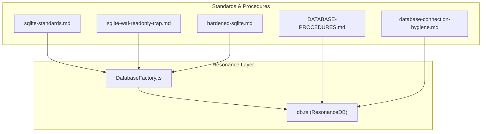
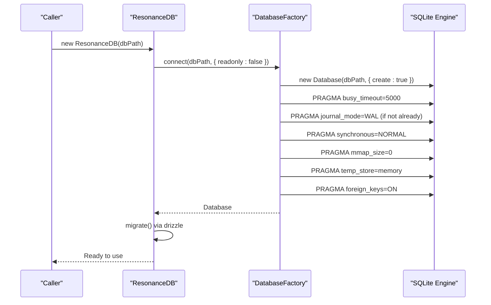
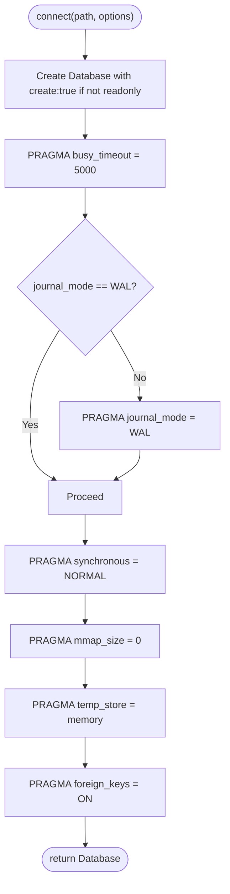
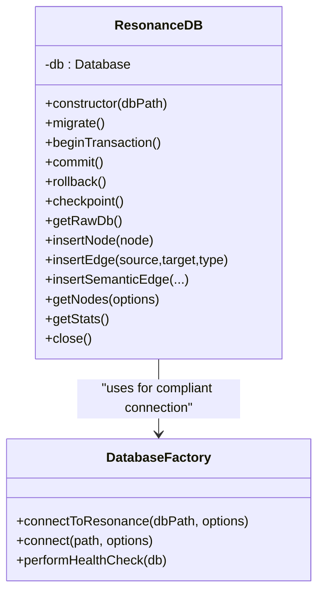
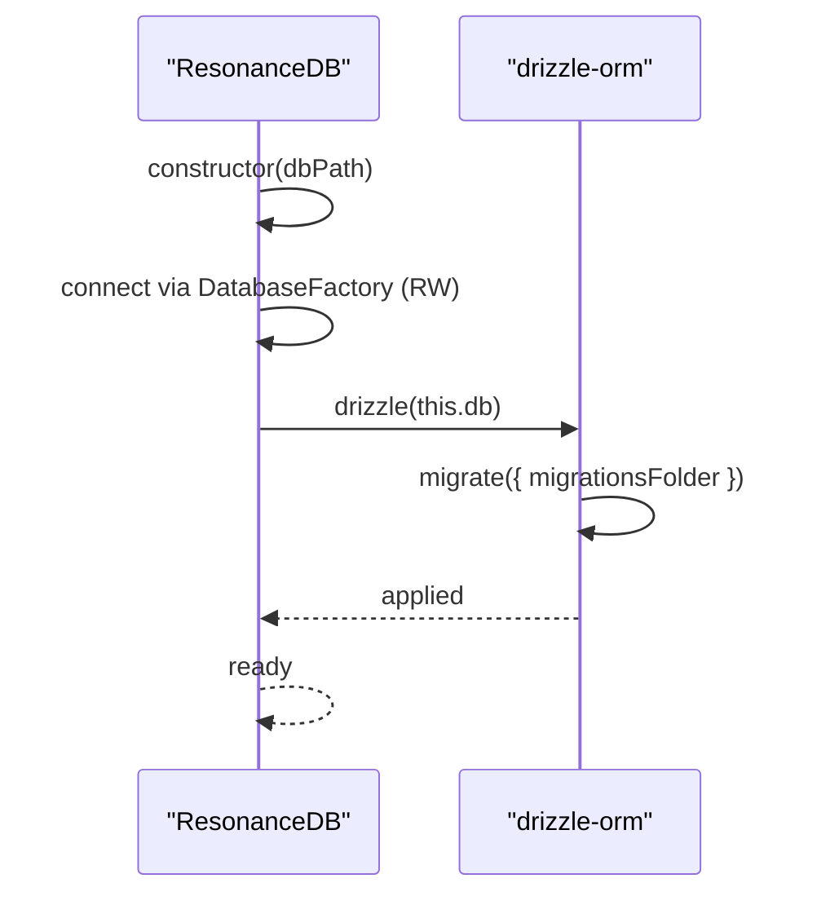
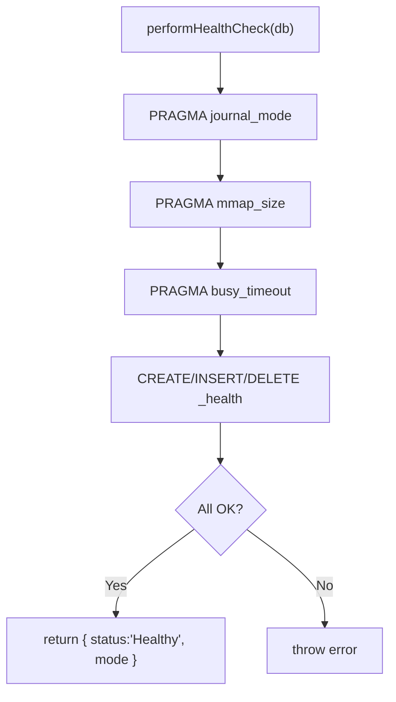
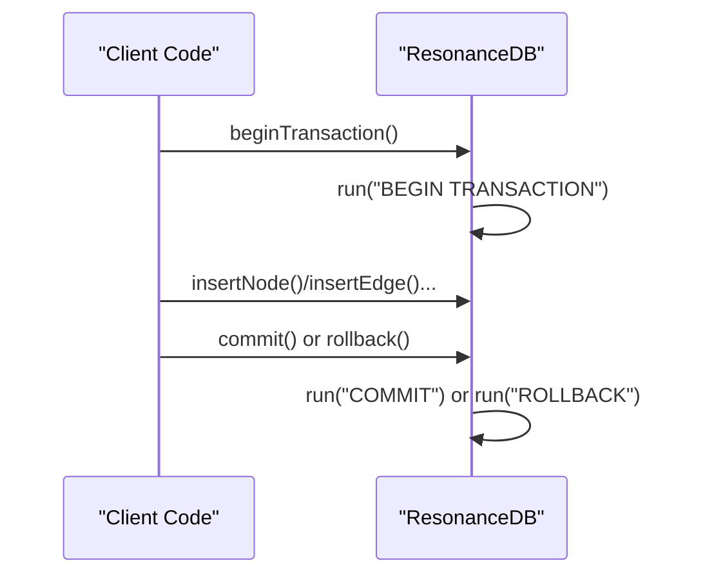
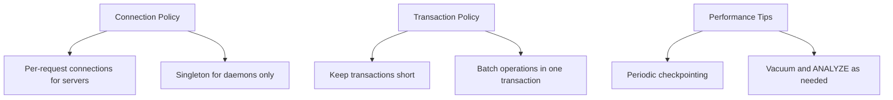
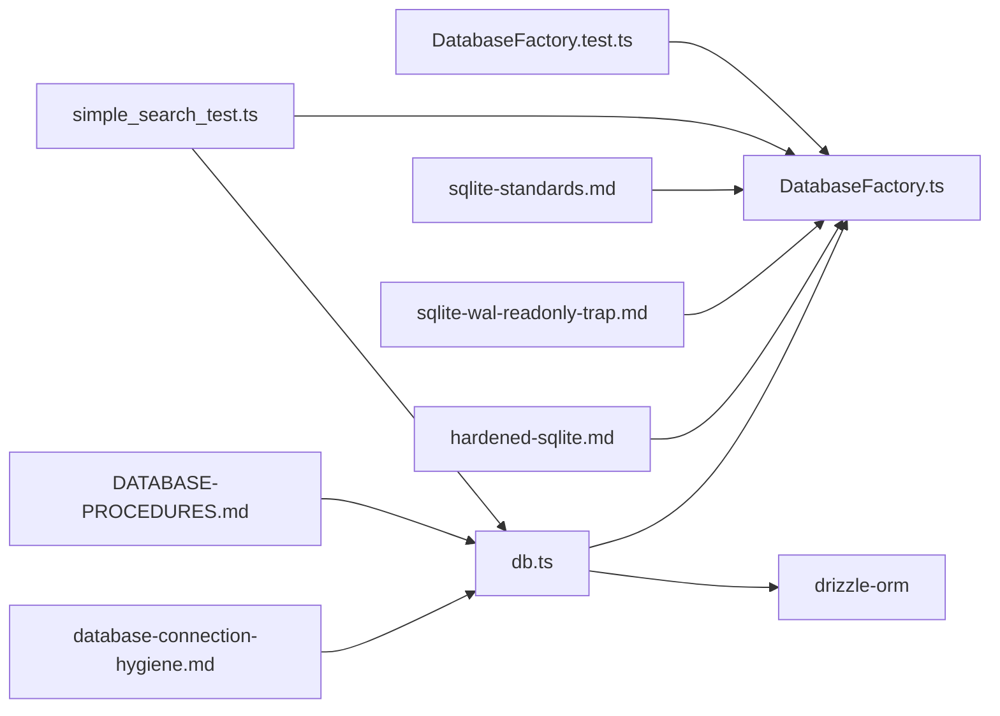

# Connection Management

<cite>
**Referenced Files in This Document**
- [DatabaseFactory.ts](file://src/resonance/DatabaseFactory.ts)
- [db.ts](file://src/resonance/db.ts)
- [sqlite-standards.md](file://playbooks/sqlite-standards.md)
- [DATABASE-PROCEDURES.md](file://src/resonance/DATABASE-PROCEDURES.md)
- [sqlite-wal-readonly-trap.md](file://docs/references/sqlite-wal-readonly-trap.md)
- [hardened-sqlite.md](file://docs/references/hardened-sqlite.md)
- [database-connection-hygiene.md](file://playbooks/database-connection-hygiene.md)
- [DatabaseFactory.test.ts](file://tests/DatabaseFactory.test.ts)
- [checkpoint.ts](file://scripts/pipeline/checkpoint.ts)
- [simple_search_test.ts](file://scripts/verify/simple_search_test.ts)
</cite>

## Table of Contents
1. [Introduction](#introduction)
2. [Project Structure](#project-structure)
3. [Core Components](#core-components)
4. [Architecture Overview](#architecture-overview)
5. [Detailed Component Analysis](#detailed-component-analysis)
6. [Dependency Analysis](#dependency-analysis)
7. [Performance Considerations](#performance-considerations)
8. [Troubleshooting Guide](#troubleshooting-guide)
9. [Conclusion](#conclusion)

## Introduction
This document explains how Amalfa manages database connections for its Resonance Graph using a hardened SQLite configuration with WAL mode, robust health checks, and safe lifecycle practices. It covers the DatabaseFactory’s role in enforcing compliant connections, the ResonanceDB class’s transaction and migration handling, and operational guidelines for concurrency, error handling, and performance optimization.

## Project Structure
The database connection management spans a small set of focused modules:
- A factory module that ensures consistent, compliant SQLite connections
- A high-level wrapper class that orchestrates migrations, transactions, and access patterns
- Playbooks and references that codify standards, hygiene, and WAL pitfalls

**Diagram sources**
- [DatabaseFactory.ts](file://src/resonance/DatabaseFactory.ts#L1-L103)
- [db.ts](file://src/resonance/db.ts#L1-L488)
- [sqlite-standards.md](file://playbooks/sqlite-standards.md#L1-L78)
- [DATABASE-PROCEDURES.md](file://src/resonance/DATABASE-PROCEDURES.md#L1-L348)
- [sqlite-wal-readonly-trap.md](file://docs/references/sqlite-wal-readonly-trap.md#L1-L229)
- [hardened-sqlite.md](file://docs/references/hardened-sqlite.md#L1-L16)
- [database-connection-hygiene.md](file://playbooks/database-connection-hygiene.md#L1-L278)

**Section sources**
- [DatabaseFactory.ts](file://src/resonance/DatabaseFactory.ts#L1-L103)
- [db.ts](file://src/resonance/db.ts#L1-L488)
- [sqlite-standards.md](file://playbooks/sqlite-standards.md#L1-L78)
- [DATABASE-PROCEDURES.md](file://src/resonance/DATABASE-PROCEDURES.md#L1-L348)
- [sqlite-wal-readonly-trap.md](file://docs/references/sqlite-wal-readonly-trap.md#L1-L229)
- [hardened-sqlite.md](file://docs/references/hardened-sqlite.md#L1-L16)
- [database-connection-hygiene.md](file://playbooks/database-connection-hygiene.md#L1-L278)

## Core Components
- DatabaseFactory: Ensures every connection is compliant with WAL mode, busy timeouts, and integrity settings. It also performs health checks and enforces that readers operate with read-write access to support SHM coordination.
- ResonanceDB: Encapsulates the Resonance Graph access patterns, applies migrations via Drizzle, exposes transaction helpers, and provides utilities for statistics and checkpointing.

Key responsibilities:
- Enforce WAL + busy_timeout + synchronous + foreign_keys + temp_store + mmap=0
- Validate configuration via health checks
- Open connections in read-write mode for WAL compatibility
- Apply migrations on construction
- Provide transaction helpers (BEGIN/COMMIT/ROLLBACK)
- Offer checkpointing and connection lifecycle guidance

**Section sources**
- [DatabaseFactory.ts](file://src/resonance/DatabaseFactory.ts#L13-L103)
- [db.ts](file://src/resonance/db.ts#L25-L81)
- [sqlite-standards.md](file://playbooks/sqlite-standards.md#L14-L25)
- [DATABASE-PROCEDURES.md](file://src/resonance/DATABASE-PROCEDURES.md#L46-L100)

## Architecture Overview
The connection architecture centers on a factory that standardizes configuration and a wrapper class that coordinates migrations and transactions.

**Diagram sources**
- [db.ts](file://src/resonance/db.ts#L44-L68)
- [DatabaseFactory.ts](file://src/resonance/DatabaseFactory.ts#L27-L66)
- [sqlite-standards.md](file://playbooks/sqlite-standards.md#L18-L24)

## Detailed Component Analysis

### DatabaseFactory: Compliant Connection Enforcer
Responsibilities:
- Configure every connection with WAL, busy_timeout, synchronous, mmap, temp_store, and foreign_keys
- Enforce read-write access for all connections to satisfy SHM requirements
- Provide a health check that validates configuration and performs a basic write/read test
- Support specialized entry points for Resonance Graph connections

Implementation highlights:
- Sets busy_timeout before other pragmas to avoid startup races
- Checks current journal mode and switches to WAL if needed
- Disables mmap for stability and sets temp_store to memory
- Validates configuration and runs a minimal health table operation

**Diagram sources**
- [DatabaseFactory.ts](file://src/resonance/DatabaseFactory.ts#L27-L66)

**Section sources**
- [DatabaseFactory.ts](file://src/resonance/DatabaseFactory.ts#L13-L103)
- [sqlite-standards.md](file://playbooks/sqlite-standards.md#L18-L24)
- [sqlite-wal-readonly-trap.md](file://docs/references/sqlite-wal-readonly-trap.md#L3-L16)

### ResonanceDB: Migration, Transactions, and Access Patterns
Responsibilities:
- Validate database path existence
- Construct a compliant connection via DatabaseFactory
- Apply migrations using Drizzle
- Expose transaction helpers (begin/commit/rollback)
- Provide read/write accessors and statistics
- Offer checkpointing and connection lifecycle hooks

Initialization and migration:
- On construction, verifies the database path and opens a read-write connection
- Applies Drizzle migrations from a dedicated folder
- Logs migration outcomes and propagates errors

Transactions:
- beginTransaction(), commit(), rollback() wrap standard SQLite statements
- Encourage wrapping bulk operations in transactions for performance

**Diagram sources**
- [db.ts](file://src/resonance/db.ts#L25-L431)
- [DatabaseFactory.ts](file://src/resonance/DatabaseFactory.ts#L13-L103)

**Section sources**
- [db.ts](file://src/resonance/db.ts#L25-L81)
- [DATABASE-PROCEDURES.md](file://src/resonance/DATABASE-PROCEDURES.md#L46-L100)

### WAL Mode, Read-Write Requirement, and SHM Implications
- WAL mode requires all connections to be able to write to the -shm file, even readers. Using readonly: true leads to disk I/O errors and corruption.
- The factory and ResonanceDB enforce read-write access to satisfy SHM coordination.
- The project documents and references explain the WAL architecture and the “readonly trap.”

Operational implications:
- Shared memory files (-shm) must be writable by all readers
- The -wal file requires read/write for writers and read for readers
- Directory permissions must allow creation/deletion of temporary files

**Section sources**
- [sqlite-wal-readonly-trap.md](file://docs/references/sqlite-wal-readonly-trap.md#L1-L229)
- [db.ts](file://src/resonance/db.ts#L38-L43)
- [hardened-sqlite.md](file://docs/references/hardened-sqlite.md#L7-L16)

### Migration Checking During Initialization
- ResonanceDB constructor triggers migration application immediately after opening the connection.
- Migrations are generated and applied via Drizzle, ensuring schema consistency across environments.
- The procedure document outlines the migration workflow and emergency rollback steps.

**Diagram sources**
- [db.ts](file://src/resonance/db.ts#L70-L81)
- [DATABASE-PROCEDURES.md](file://src/resonance/DATABASE-PROCEDURES.md#L46-L100)

**Section sources**
- [db.ts](file://src/resonance/db.ts#L70-L81)
- [DATABASE-PROCEDURES.md](file://src/resonance/DATABASE-PROCEDURES.md#L46-L100)

### Connection Validation, Health Checks, and Automatic Recovery
- Health checks verify journal_mode, mmap_size, and busy_timeout, and perform a simple write/read test against a transient health table.
- Automatic recovery is achieved by ensuring correct pragmas are set on every connection and by applying migrations on startup.
- Tests confirm that the factory enforces the required configuration.

**Diagram sources**
- [DatabaseFactory.ts](file://src/resonance/DatabaseFactory.ts#L72-L101)
- [DatabaseFactory.test.ts](file://tests/DatabaseFactory.test.ts#L9-L36)

**Section sources**
- [DatabaseFactory.ts](file://src/resonance/DatabaseFactory.ts#L72-L101)
- [DatabaseFactory.test.ts](file://tests/DatabaseFactory.test.ts#L1-L53)

### Transaction Management and Integration with ResonanceDB
- ResonanceDB exposes beginTransaction(), commit(), and rollback() to wrap operations atomically.
- Bulk operations should be grouped in transactions to improve throughput and reduce commit overhead.
- The class also integrates with Drizzle for schema migrations.

**Diagram sources**
- [db.ts](file://src/resonance/db.ts#L349-L359)
- [sqlite-standards.md](file://playbooks/sqlite-standards.md#L64-L72)

**Section sources**
- [db.ts](file://src/resonance/db.ts#L349-L359)
- [sqlite-standards.md](file://playbooks/sqlite-standards.md#L64-L72)

### Concurrent Access Patterns, Deadlock Prevention, and Performance Optimization
- Use per-request connections for servers; avoid singleton persistent connections to prevent blocking writers.
- Keep transactions short; long-running transactions block readers/writers and risk exceeding busy_timeout.
- Prefer wrapping bulk inserts/updates in a single transaction to reduce commit overhead.
- Use checkpointing to truncate WAL and move content back to the main database when appropriate.

**Diagram sources**
- [database-connection-hygiene.md](file://playbooks/database-connection-hygiene.md#L51-L73)
- [database-connection-hygiene.md](file://playbooks/database-connection-hygiene.md#L249-L258)
- [sqlite-standards.md](file://playbooks/sqlite-standards.md#L64-L72)
- [checkpoint.ts](file://scripts/pipeline/checkpoint.ts#L1-L7)

**Section sources**
- [database-connection-hygiene.md](file://playbooks/database-connection-hygiene.md#L1-L278)
- [sqlite-standards.md](file://playbooks/sqlite-standards.md#L74-L78)
- [checkpoint.ts](file://scripts/pipeline/checkpoint.ts#L1-L7)

## Dependency Analysis
The ResonanceDB class depends on DatabaseFactory for compliant connections and on Drizzle for migrations. The factory depends on the SQLite engine and enforces standards. Tests and scripts validate configuration and demonstrate usage.

**Diagram sources**
- [DatabaseFactory.test.ts](file://tests/DatabaseFactory.test.ts#L1-L53)
- [simple_search_test.ts](file://scripts/verify/simple_search_test.ts#L1-L30)
- [db.ts](file://src/resonance/db.ts#L1-L488)
- [DatabaseFactory.ts](file://src/resonance/DatabaseFactory.ts#L1-L103)
- [DATABASE-PROCEDURES.md](file://src/resonance/DATABASE-PROCEDURES.md#L1-L348)
- [sqlite-standards.md](file://playbooks/sqlite-standards.md#L1-L78)
- [sqlite-wal-readonly-trap.md](file://docs/references/sqlite-wal-readonly-trap.md#L1-L229)
- [hardened-sqlite.md](file://docs/references/hardened-sqlite.md#L1-L16)
- [database-connection-hygiene.md](file://playbooks/database-connection-hygiene.md#L1-L278)

**Section sources**
- [DatabaseFactory.test.ts](file://tests/DatabaseFactory.test.ts#L1-L53)
- [simple_search_test.ts](file://scripts/verify/simple_search_test.ts#L1-L30)
- [db.ts](file://src/resonance/db.ts#L1-L488)
- [DatabaseFactory.ts](file://src/resonance/DatabaseFactory.ts#L1-L103)
- [DATABASE-PROCEDURES.md](file://src/resonance/DATABASE-PROCEDURES.md#L1-L348)
- [sqlite-standards.md](file://playbooks/sqlite-standards.md#L1-L78)
- [sqlite-wal-readonly-trap.md](file://docs/references/sqlite-wal-readonly-trap.md#L1-L229)
- [hardened-sqlite.md](file://docs/references/hardened-sqlite.md#L1-L16)
- [database-connection-hygiene.md](file://playbooks/database-connection-hygiene.md#L1-L278)

## Performance Considerations
- Bulk operations: Group inserts/updates in a single transaction to achieve significant throughput improvements.
- Busy timeout: 5-second wait reduces SQLITE_BUSY occurrences under contention.
- WAL mode: Enables concurrent readers and writers; ensure all connections are read-write to maintain SHM access.
- Memory temp storage: Keeps temporary structures in memory for speed.
- Vacuum and ANALYZE: Periodically reclaim space and refresh query plans.
- Checkpointing: Use periodic truncation to move WAL content back to the main database when appropriate.

[No sources needed since this section provides general guidance]

## Troubleshooting Guide
Common issues and resolutions:
- “Database is locked” or SQLITE_BUSY: Indicates long-held transactions or insufficient busy_timeout. Reduce transaction duration and ensure proper timeout configuration.
- Schema mismatch: Apply migrations using Drizzle or restore from backup and re-apply migrations.
- WAL readonly trap symptoms: Disk I/O errors or SQLITE_IOERR when using readonly: true. Switch to read-write connections and rely on application-level read-only policies if needed.
- Connection leaks: Ensure every connection is closed in a finally block.

**Section sources**
- [DATABASE-PROCEDURES.md](file://src/resonance/DATABASE-PROCEDURES.md#L234-L278)
- [sqlite-wal-readonly-trap.md](file://docs/references/sqlite-wal-readonly-trap.md#L163-L181)
- [database-connection-hygiene.md](file://playbooks/database-connection-hygiene.md#L271-L278)

## Conclusion
Amalfa’s connection management relies on a hardened, standardized configuration enforced by DatabaseFactory and orchestrated by ResonanceDB. WAL mode, busy_timeout, and read-write access are mandatory for concurrency and stability. Migrations are applied automatically via Drizzle, and health checks ensure compliance. Following the hygiene and performance guidelines helps prevent deadlocks, optimize throughput, and maintain reliability in concurrent environments.