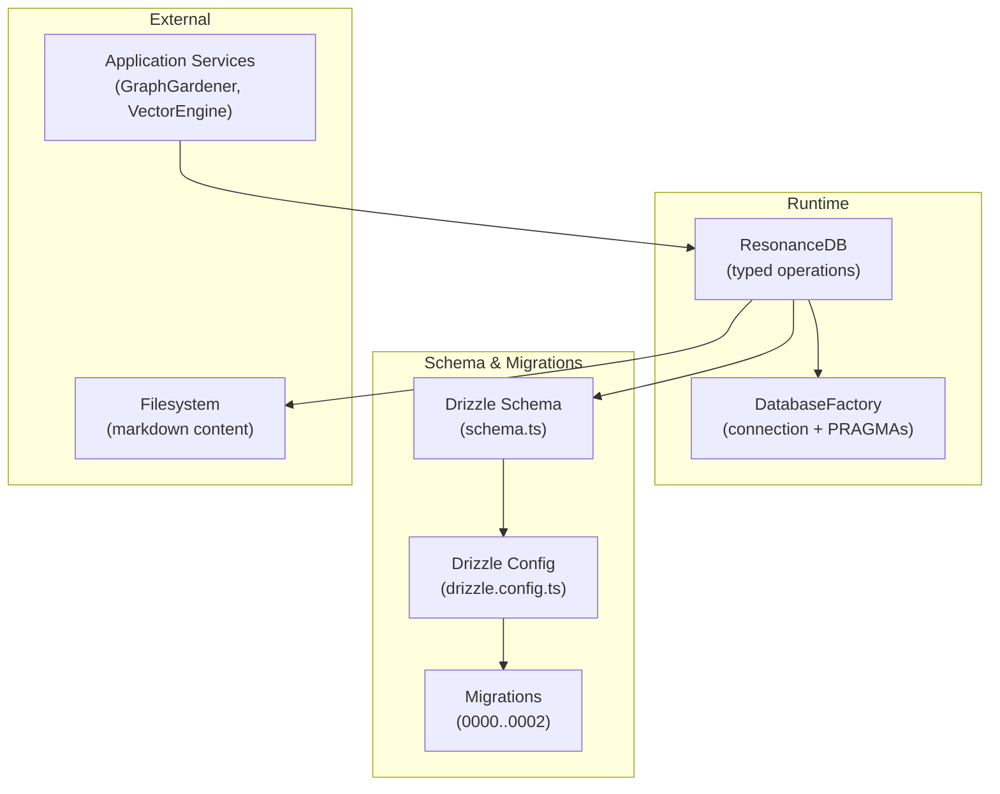
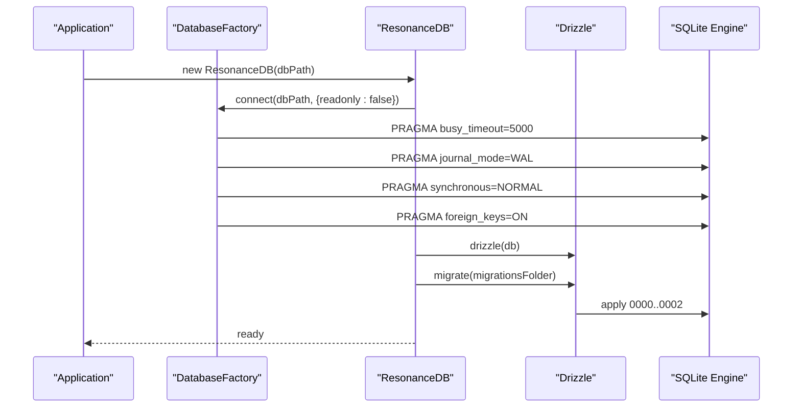
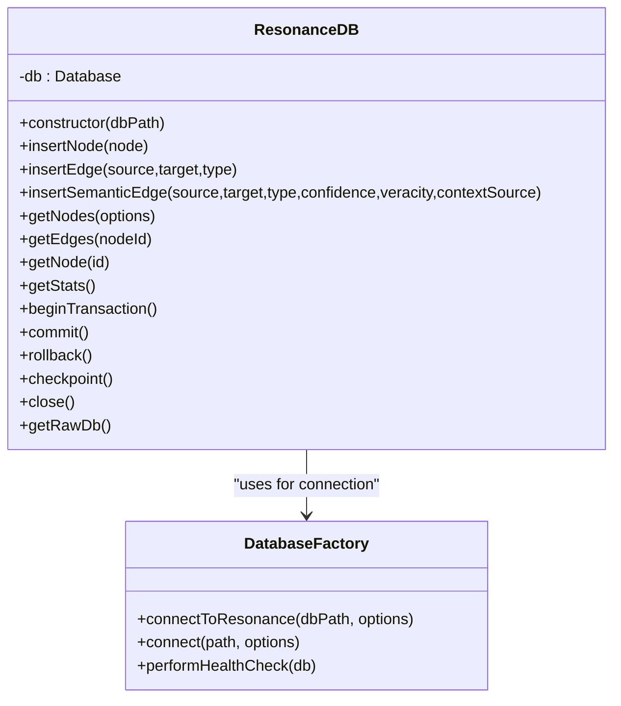
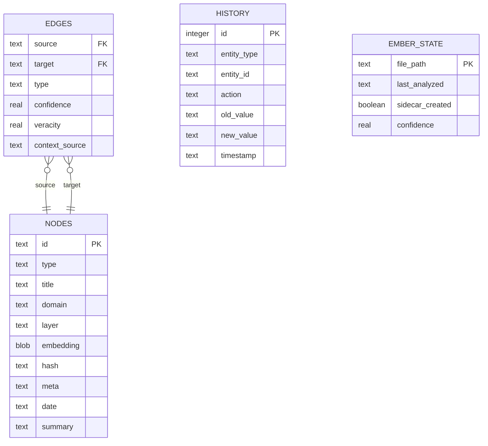
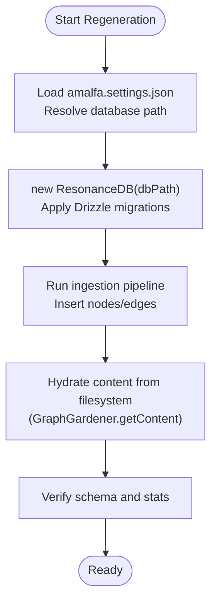
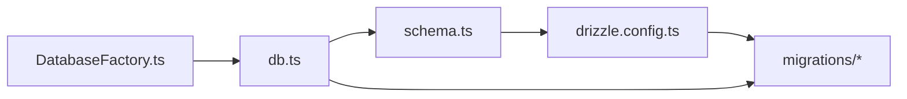

# Database Architecture

<cite>
**Referenced Files in This Document**
- [DatabaseFactory.ts](file://src/resonance/DatabaseFactory.ts)
- [db.ts](file://src/resonance/db.ts)
- [schema.ts](file://src/resonance/drizzle/schema.ts)
- [drizzle.config.ts](file://drizzle.config.ts)
- [0000_happy_thaddeus_ross.sql](file://src/resonance/drizzle/migrations/0000_happy_thaddeus_ross.sql)
- [0001_happy_serpent_society.sql](file://src/resonance/drizzle/migrations/0001_happy_serpent_society.sql)
- [0002_curly_fat_cobra.sql](file://src/resonance/drizzle/migrations/0002_curly_fat_cobra.sql)
- [DATABASE-PROCEDURES.md](file://src/resonance/DATABASE-PROCEDURES.md)
- [sqlite-standards.md](file://playbooks/sqlite-standards.md)
- [database-connection-hygiene.md](file://playbooks/database-connection-hygiene.md)
- [check_oh125.ts](file://scripts/verify/check_oh125.ts)
- [utils.ts](file://src/cli/utils.ts)
</cite>

## Table of Contents
1. [Introduction](#introduction)
2. [Project Structure](#project-structure)
3. [Core Components](#core-components)
4. [Architecture Overview](#architecture-overview)
5. [Detailed Component Analysis](#detailed-component-analysis)
6. [Dependency Analysis](#dependency-analysis)
7. [Performance Considerations](#performance-considerations)
8. [Troubleshooting Guide](#troubleshooting-guide)
9. [Conclusion](#conclusion)
10. [Appendices](#appendices)

## Introduction
This document describes Amalfa’s SQLite-based knowledge graph database architecture. The system employs a “hollow nodes” pattern: metadata and vector embeddings reside in the database, while document content is stored on the filesystem and hydrated at query time. Drizzle ORM defines and migrates the schema, ensuring a single source of truth. The DatabaseFactory enforces hardened SQLite configurations for concurrency, integrity, and performance. WAL mode is configured for concurrent access, and the system supports safe regeneration of the database from markdown sources.

## Project Structure
The database layer centers around:
- ResonanceDB: high-performance wrapper for SQLite with typed operations and FAFCAS vector handling
- DatabaseFactory: connection factory enforcing WAL, busy timeouts, and integrity
- Drizzle schema and migrations: declarative schema and migration lifecycle
- Operational playbooks: standards, hygiene, and maintenance procedures

**Diagram sources**
- [db.ts](file://src/resonance/db.ts#L25-L81)
- [DatabaseFactory.ts](file://src/resonance/DatabaseFactory.ts#L13-L66)
- [schema.ts](file://src/resonance/drizzle/schema.ts#L16-L76)
- [drizzle.config.ts](file://drizzle.config.ts#L3-L10)
- [0000_happy_thaddeus_ross.sql](file://src/resonance/drizzle/migrations/0000_happy_thaddeus_ross.sql#L1-L31)
- [0001_happy_serpent_society.sql](file://src/resonance/drizzle/migrations/0001_happy_serpent_society.sql#L1-L10)
- [0002_curly_fat_cobra.sql](file://src/resonance/drizzle/migrations/0002_curly_fat_cobra.sql#L1-L1)

**Section sources**
- [db.ts](file://src/resonance/db.ts#L25-L81)
- [DatabaseFactory.ts](file://src/resonance/DatabaseFactory.ts#L13-L66)
- [schema.ts](file://src/resonance/drizzle/schema.ts#L16-L76)
- [drizzle.config.ts](file://drizzle.config.ts#L3-L10)

## Core Components
- DatabaseFactory: ensures WAL mode, busy_timeout, synchronous, foreign_keys, and mmap safety; returns a configured Database instance
- ResonanceDB: typed CRUD for nodes and edges, transaction helpers, stats, and history logging; integrates Drizzle migrations on initialization
- Drizzle schema: nodes, edges, ember_state, and history tables; composite primary key on edges; indices on edges source/target
- Drizzle config: schema path, migration output folder, and database URL credential for Drizzle Kit

Key behaviors:
- Hollow nodes: content is not stored in the database; content hydration occurs via filesystem reads
- FAFCAS vectors: embeddings stored as raw BLOB bytes; normalization handled upstream
- Transactions: begin/commit/rollback helpers for atomicity and throughput
- WAL enforcement: all connections configured with WAL and busy_timeout; readers still require write access to -shm

**Section sources**
- [DatabaseFactory.ts](file://src/resonance/DatabaseFactory.ts#L13-L103)
- [db.ts](file://src/resonance/db.ts#L25-L431)
- [schema.ts](file://src/resonance/drizzle/schema.ts#L16-L76)
- [drizzle.config.ts](file://drizzle.config.ts#L3-L10)

## Architecture Overview
The runtime database architecture enforces:
- Single source of truth for schema via Drizzle
- Hardened SQLite configuration via DatabaseFactory
- Hollow nodes: metadata and vectors in DB; content on disk
- WAL mode for concurrency; busy_timeout to avoid SQLITE_BUSY
- Drizzle migrations applied automatically on ResonanceDB initialization

**Diagram sources**
- [DatabaseFactory.ts](file://src/resonance/DatabaseFactory.ts#L27-L66)
- [db.ts](file://src/resonance/db.ts#L54-L81)
- [drizzle.config.ts](file://drizzle.config.ts#L3-L10)
- [0000_happy_thaddeus_ross.sql](file://src/resonance/drizzle/migrations/0000_happy_thaddeus_ross.sql#L1-L31)
- [0001_happy_serpent_society.sql](file://src/resonance/drizzle/migrations/0001_happy_serpent_society.sql#L1-L10)
- [0002_curly_fat_cobra.sql](file://src/resonance/drizzle/migrations/0002_curly_fat_cobra.sql#L1-L1)

## Detailed Component Analysis

### DatabaseFactory
Responsibilities:
- Configure SQLite pragmas for concurrency and safety
- Enforce WAL mode, busy_timeout, synchronous, foreign_keys, and mmap behavior
- Return a Database instance suitable for all runtime operations

Operational guarantees:
- All connections use WAL mode
- Readers connect with read-write to support SHM updates
- Busy timeout prevents SQLITE_BUSY under contention
- Foreign keys enabled for referential integrity

**Section sources**
- [DatabaseFactory.ts](file://src/resonance/DatabaseFactory.ts#L13-L103)
- [sqlite-standards.md](file://playbooks/sqlite-standards.md#L14-L25)

### ResonanceDB
Responsibilities:
- Typed node and edge operations
- Transaction management (begin/commit/rollback)
- Statistics and history logging
- Drizzle migration application on initialization
- FAFCAS vector handling (embedding BLOB serialization)

Notable behaviors:
- insertNode stores metadata and embedding as BLOB; content is intentionally omitted
- getNodes supports filtering by domain/type and optional exclusion of large BLOBs
- getEdges retrieves outbound edges for a node
- getStats computes counts and DB size via PRAGMA
- checkpoint triggers WAL truncation

**Diagram sources**
- [db.ts](file://src/resonance/db.ts#L25-L431)
- [DatabaseFactory.ts](file://src/resonance/DatabaseFactory.ts#L13-L66)

**Section sources**
- [db.ts](file://src/resonance/db.ts#L25-L431)

### Drizzle Schema and Migrations
Schema tables:
- nodes: metadata and vector embedding BLOB
- edges: relationship graph with composite primary key and indices on source/target
- ember_state: pilot table for automated enrichment state
- history: audit trail for graph mutations

Migrations:
- 0000: initial schema (nodes, edges, ember_state)
- 0001: adds history table
- 0002: adds summary column to nodes

**Diagram sources**
- [schema.ts](file://src/resonance/drizzle/schema.ts#L16-L76)
- [0000_happy_thaddeus_ross.sql](file://src/resonance/drizzle/migrations/0000_happy_thaddeus_ross.sql#L1-L31)
- [0001_happy_serpent_society.sql](file://src/resonance/drizzle/migrations/0001_happy_serpent_society.sql#L1-L10)
- [0002_curly_fat_cobra.sql](file://src/resonance/drizzle/migrations/0002_curly_fat_cobra.sql#L1-L1)

**Section sources**
- [schema.ts](file://src/resonance/drizzle/schema.ts#L16-L76)
- [0000_happy_thaddeus_ross.sql](file://src/resonance/drizzle/migrations/0000_happy_thaddeus_ross.sql#L1-L31)
- [0001_happy_serpent_society.sql](file://src/resonance/drizzle/migrations/0001_happy_serpent_society.sql#L1-L10)
- [0002_curly_fat_cobra.sql](file://src/resonance/drizzle/migrations/0002_curly_fat_cobra.sql#L1-L1)

### Disposable Database Pattern and Regeneration
- The database is designed to be disposable: regenerate from markdown sources without loss of fidelity
- Content is not stored in the database; regeneration rehydrates content from filesystem
- Drizzle migrations define schema evolution; ResonanceDB applies them on initialization
- CLI utilities resolve database path from configuration, enabling portable regeneration

**Diagram sources**
- [db.ts](file://src/resonance/db.ts#L32-L81)
- [drizzle.config.ts](file://drizzle.config.ts#L3-L10)
- [utils.ts](file://src/cli/utils.ts#L7-L15)

**Section sources**
- [DATABASE-PROCEDURES.md](file://src/resonance/DATABASE-PROCEDURES.md#L196-L231)
- [db.ts](file://src/resonance/db.ts#L32-L81)
- [utils.ts](file://src/cli/utils.ts#L7-L15)

## Dependency Analysis
- ResonanceDB depends on DatabaseFactory for connection configuration and on Drizzle for migrations
- Drizzle schema is the single source of truth; migrations are generated and applied via Drizzle Kit
- Edges reference nodes via foreign keys; edges table uses composite primary key and indices for traversal

**Diagram sources**
- [DatabaseFactory.ts](file://src/resonance/DatabaseFactory.ts#L13-L66)
- [db.ts](file://src/resonance/db.ts#L54-L81)
- [schema.ts](file://src/resonance/drizzle/schema.ts#L16-L76)
- [drizzle.config.ts](file://drizzle.config.ts#L3-L10)

**Section sources**
- [DatabaseFactory.ts](file://src/resonance/DatabaseFactory.ts#L13-L66)
- [db.ts](file://src/resonance/db.ts#L54-L81)
- [schema.ts](file://src/resonance/drizzle/schema.ts#L16-L76)

## Performance Considerations
- WAL mode and busy_timeout enable concurrent readers and writers without SQLITE_BUSY
- Synchronous set to NORMAL balances durability and performance in WAL mode
- mmap disabled for stability; foreign_keys enabled for integrity
- Embeddings stored as raw BLOBs to avoid serialization overhead
- Transactions batch operations for throughput; keep durations under half of busy_timeout
- Prefer selective queries and exclude large BLOBs when scanning metadata

Optimization techniques:
- Use getNodes with excludeContent=true for metadata-only scans
- Wrap bulk inserts in transactions
- Use indices on edges source/target for traversal
- Periodically vacuum and analyze for maintenance

**Section sources**
- [DatabaseFactory.ts](file://src/resonance/DatabaseFactory.ts#L44-L64)
- [sqlite-standards.md](file://playbooks/sqlite-standards.md#L14-L25)
- [database-connection-hygiene.md](file://playbooks/database-connection-hygiene.md#L64-L72)
- [db.ts](file://src/resonance/db.ts#L194-L239)

## Troubleshooting Guide
Common issues and resolutions:
- Database is locked: verify no stale processes, restart services, and confirm batch sizes appropriate for concurrent access
- Table does not exist: run Drizzle migration to apply missing schema
- Schema mismatch: generate and review migration, then apply or restore from backup
- Content anomalies: confirm content is not stored in DB; use filesystem hydration

Diagnostic steps:
- Check running processes and locks
- Verify busy_timeout and WAL mode
- Confirm Drizzle migrations applied
- Validate node hydration workflow

**Section sources**
- [DATABASE-PROCEDURES.md](file://src/resonance/DATABASE-PROCEDURES.md#L234-L275)
- [database-connection-hygiene.md](file://playbooks/database-connection-hygiene.md#L271-L321)
- [DatabaseFactory.ts](file://src/resonance/DatabaseFactory.ts#L72-L101)
- [check_oh125.ts](file://scripts/verify/check_oh125.ts#L1-L21)

## Conclusion
Amalfa’s database architecture combines a hardened SQLite runtime with a declarative Drizzle schema and migrations. The hollow nodes pattern separates content from metadata, enabling portable, disposable databases regenerated from markdown sources. DatabaseFactory enforces concurrency-friendly settings, while ResonanceDB provides typed operations and transaction support. Adhering to the documented procedures ensures reliable evolution, maintenance, and scaling of the knowledge graph.

## Appendices

### Data Validation Rules
- Nodes: id is primary key; embedding stored as BLOB; meta stored as JSON text; date as ISO string
- Edges: composite primary key (source, target, type); indices on source and target for traversal
- History: audit trail with timestamps; old/new values stored as JSON text
- ember_state: file_path primary key; sidecar_created stored as boolean

**Section sources**
- [schema.ts](file://src/resonance/drizzle/schema.ts#L16-L76)

### Transaction Handling
- Begin/commit/rollback helpers wrap DML operations
- Keep transaction durations under half of busy_timeout
- Batch operations to improve throughput

**Section sources**
- [db.ts](file://src/resonance/db.ts#L349-L363)
- [database-connection-hygiene.md](file://playbooks/database-connection-hygiene.md#L75-L95)

### WAL Mode and Backup Strategies
- WAL mode enabled with busy_timeout; readers require write access to -shm
- Backups recommended before schema changes; retention and automation planned
- Vacuum and analyze for maintenance; checkpoint truncates WAL

**Section sources**
- [DatabaseFactory.ts](file://src/resonance/DatabaseFactory.ts#L44-L56)
- [DATABASE-PROCEDURES.md](file://src/resonance/DATABASE-PROCEDURES.md#L207-L231)

### Scaling Considerations
- Hollow nodes reduce DB size and improve concurrency
- Prefer metadata-only queries for large scans
- Use transactions and appropriate batch sizes
- Monitor lock wait times and adjust ingestion rates

**Section sources**
- [database-connection-hygiene.md](file://playbooks/database-connection-hygiene.md#L108-L147)
- [db.ts](file://src/resonance/db.ts#L194-L239)