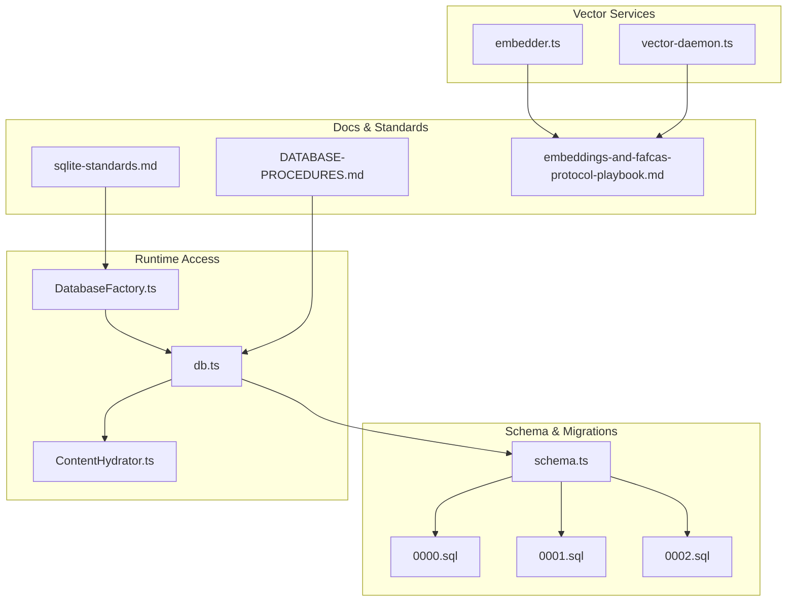
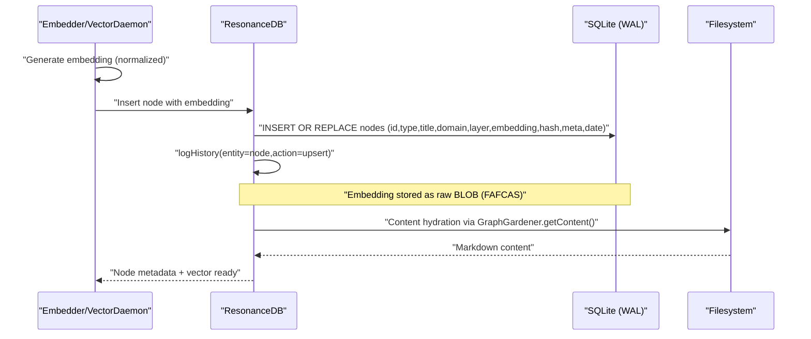
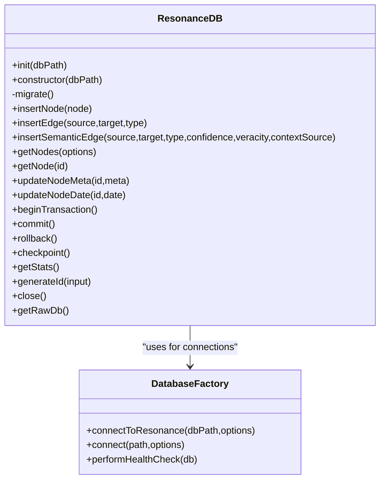
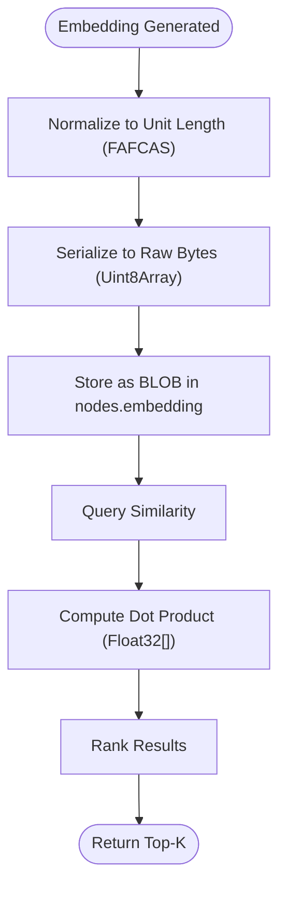
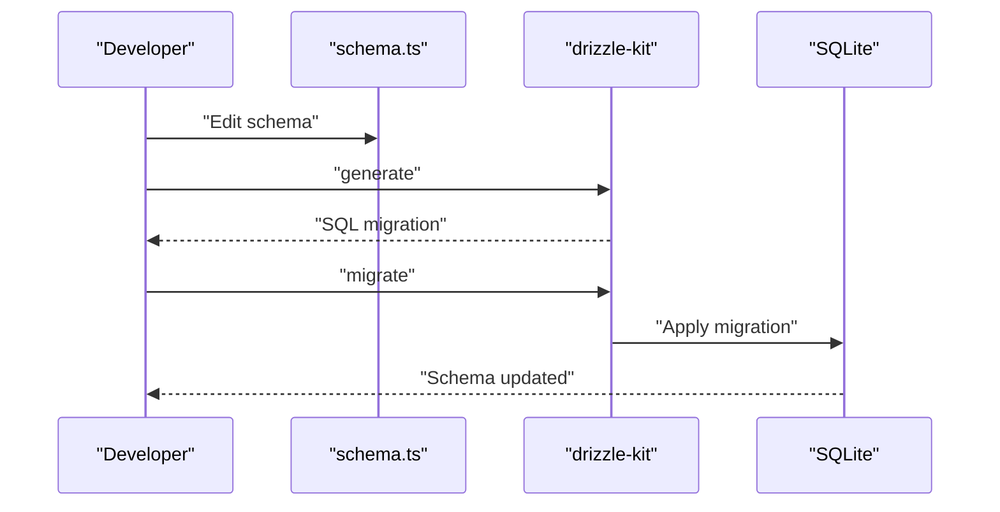
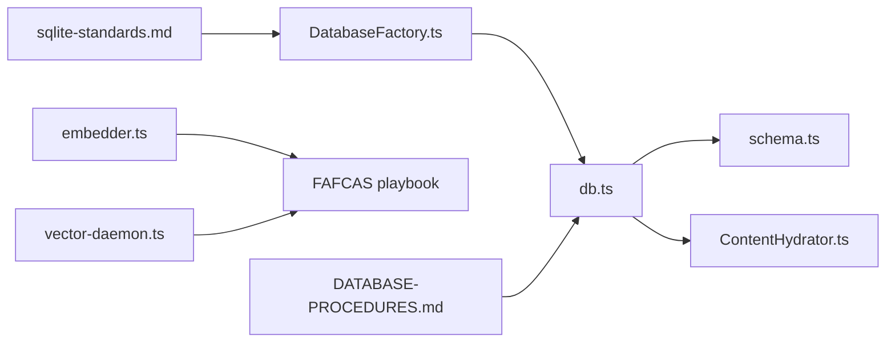

# Database Schema Design

<cite>
**Referenced Files in This Document**
- [db.ts](file://src/resonance/db.ts)
- [DatabaseFactory.ts](file://src/resonance/DatabaseFactory.ts)
- [schema.ts](file://src/resonance/drizzle/schema.ts)
- [0000_happy_thaddeus_ross.sql](file://src/resonance/drizzle/migrations/0000_happy_thaddeus_ross.sql)
- [0001_happy_serpent_society.sql](file://src/resonance/drizzle/migrations/0001_happy_serpent_society.sql)
- [0002_curly_fat_cobra.sql](file://src/resonance/drizzle/migrations/0002_curly_fat_cobra.sql)
- [DATABASE-PROCEDURES.md](file://src/resonance/DATABASE-PROCEDURES.md)
- [sqlite-standards.md](file://playbooks/sqlite-standards.md)
- [embeddings-and-fafcas-protocol-playbook.md](file://playbooks/embeddings-and-fafcas-protocol-playbook.md)
- [embedder.ts](file://src/resonance/services/embedder.ts)
- [vector-daemon.ts](file://src/resonance/services/vector-daemon.ts)
- [ContentHydrator.ts](file://src/utils/ContentHydrator.ts)
- [check_oh125.ts](file://scripts/verify/check_oh125.ts)
- [2026-01-13-drizzle-migration-completion.md](file://debriefs/2026-01-13-drizzle-migration-completion.md)
</cite>

## Table of Contents
1. [Introduction](#introduction)
2. [Project Structure](#project-structure)
3. [Core Components](#core-components)
4. [Architecture Overview](#architecture-overview)
5. [Detailed Component Analysis](#detailed-component-analysis)
6. [Dependency Analysis](#dependency-analysis)
7. [Performance Considerations](#performance-considerations)
8. [Troubleshooting Guide](#troubleshooting-guide)
9. [Conclusion](#conclusion)
10. [Appendices](#appendices)

## Introduction
This document describes Amalfa's database schema design centered on a hollow nodes pattern: metadata is stored in SQLite while content remains on the filesystem. The system uses Drizzle ORM for schema definition and migrations, with a strict operational model that enforces WAL mode, busy timeouts, and foreign key constraints. Vector embeddings are stored as raw binary blobs following the FAFCAS protocol and searched using dot products on normalized vectors. The schema supports semantic edges with confidence and veracity metadata, and includes a pipeline history table for auditability. The disposable database philosophy allows regeneration from markdown sources without loss of fidelity.

## Project Structure
The database layer is organized around a small set of cohesive modules:
- Drizzle schema and migrations define the canonical structure
- ResonanceDB provides high-performance access with FAFCAS optimizations
- DatabaseFactory enforces hardened SQLite configuration
- Vector services integrate FAFCAS embeddings into the graph
- Content hydration utilities ensure content is read from disk, not the database



**Diagram sources**
- [schema.ts](file://src/resonance/drizzle/schema.ts#L1-L77)
- [0000_happy_thaddeus_ross.sql](file://src/resonance/drizzle/migrations/0000_happy_thaddeus_ross.sql#L1-L31)
- [0001_happy_serpent_society.sql](file://src/resonance/drizzle/migrations/0001_happy_serpent_society.sql#L1-L10)
- [0002_curly_fat_cobra.sql](file://src/resonance/drizzle/migrations/0002_curly_fat_cobra.sql#L1-L1)
- [DatabaseFactory.ts](file://src/resonance/DatabaseFactory.ts#L1-L103)
- [db.ts](file://src/resonance/db.ts#L1-L488)
- [ContentHydrator.ts](file://src/utils/ContentHydrator.ts#L1-L38)
- [embedder.ts](file://src/resonance/services/embedder.ts#L1-L126)
- [vector-daemon.ts](file://src/resonance/services/vector-daemon.ts#L1-L234)
- [DATABASE-PROCEDURES.md](file://src/resonance/DATABASE-PROCEDURES.md#L1-L348)
- [sqlite-standards.md](file://playbooks/sqlite-standards.md#L1-L78)
- [embeddings-and-fafcas-protocol-playbook.md](file://playbooks/embeddings-and-fafcas-protocol-playbook.md#L1-L168)

**Section sources**
- [schema.ts](file://src/resonance/drizzle/schema.ts#L1-L77)
- [db.ts](file://src/resonance/db.ts#L1-L488)
- [DatabaseFactory.ts](file://src/resonance/DatabaseFactory.ts#L1-L103)
- [DATABASE-PROCEDURES.md](file://src/resonance/DATABASE-PROCEDURES.md#L1-L348)

## Core Components
- Nodes table: stores node identity, classification, hierarchy, summaries, embeddings, hashes, flexible metadata, and temporal anchors. Content is intentionally omitted to maintain the hollow node pattern.
- Edges table: defines relationships with composite primary key and optional semantic metadata (confidence, veracity, context source).
- History table: audit trail for graph mutations.
- DatabaseFactory: enforces WAL mode, busy timeouts, foreign keys, and other hardened pragmas.
- ResonanceDB: high-level API for inserts, updates, queries, transactions, and vector operations, with FAFCAS-aware embedding handling.
- Vector services: embedder and vector daemon produce normalized embeddings compatible with FAFCAS storage and search.

**Section sources**
- [schema.ts](file://src/resonance/drizzle/schema.ts#L12-L77)
- [db.ts](file://src/resonance/db.ts#L11-L134)
- [DatabaseFactory.ts](file://src/resonance/DatabaseFactory.ts#L13-L103)
- [embedder.ts](file://src/resonance/services/embedder.ts#L1-L126)
- [vector-daemon.ts](file://src/resonance/services/vector-daemon.ts#L1-L234)

## Architecture Overview
The database architecture separates concerns cleanly:
- Storage: SQLite with WAL for concurrency and durability
- Schema: Drizzle-defined, migrated via generated SQL
- Content: filesystem-based; database holds only metadata and embeddings
- Vectors: FAFCAS protocol ensures normalized, compact binary storage and efficient similarity computation
- Audit: history table records all mutations



**Diagram sources**
- [db.ts](file://src/resonance/db.ts#L83-L134)
- [embedder.ts](file://src/resonance/services/embedder.ts#L80-L124)
- [vector-daemon.ts](file://src/resonance/services/vector-daemon.ts#L162-L223)
- [DATABASE-PROCEDURES.md](file://src/resonance/DATABASE-PROCEDURES.md#L180-L193)

## Detailed Component Analysis

### Nodes Table
- Purpose: Store node metadata and embeddings; content is excluded to maintain the hollow node pattern.
- Fields:
  - id: text, primary key
  - type: text
  - title: text (formerly labeled "label")
  - domain: text
  - layer: text
  - embedding: blob (Float32 bytes, FAFCAS)
  - hash: text (content fingerprint)
  - summary: text (lead summary)
  - meta: text (JSON string)
  - date: text (ISO-like temporal anchor)
- Constraints and notes:
  - id is the sole primary key
  - embedding is stored as raw bytes; ResonanceDB writes a typed array slice to avoid copying underlying buffers unnecessarily
  - meta is stored as JSON text; consumers parse when hydrating
  - content is not present in schema; content hydration occurs from filesystem

**Section sources**
- [schema.ts](file://src/resonance/drizzle/schema.ts#L16-L28)
- [db.ts](file://src/resonance/db.ts#L88-L116)
- [DATABASE-PROCEDURES.md](file://src/resonance/DATABASE-PROCEDURES.md#L18-L30)

### Edges Table
- Purpose: Define relationships between nodes with optional semantic metadata.
- Fields:
  - source: text, not null
  - target: text, not null
  - type: text, not null
  - confidence: real, default 1.0
  - veracity: real, default 1.0
  - context_source: text
- Constraints and indices:
  - Composite primary key (source, target, type)
  - Indices on source and target for traversal performance
- Semantic edges:
  - insertSemanticEdge supports upsert with confidence and veracity updates

```mermaid
erDiagram
NODES {
text id PK
text type
text title
text domain
text layer
blob embedding
text hash
text summary
text meta
text date
}
EDGES {
text source NN
text target NN
text type NN
real confidence
real veracity
text context_source
}
NODES ||--o{ EDGES : "source"
NODES ||--o{ EDGES : "target"
```

**Diagram sources**
- [schema.ts](file://src/resonance/drizzle/schema.ts#L34-L51)

**Section sources**
- [schema.ts](file://src/resonance/drizzle/schema.ts#L34-L51)
- [db.ts](file://src/resonance/db.ts#L140-L184)

### History Table
- Purpose: Audit trail for graph mutations.
- Fields:
  - id: integer, primary key, autoincrement
  - entity_type: text, not null
  - entity_id: text, not null
  - action: text, not null
  - old_value: text
  - new_value: text
  - timestamp: text, default current timestamp
- Usage: ResonanceDB logs mutations to this table for traceability.

**Section sources**
- [schema.ts](file://src/resonance/drizzle/schema.ts#L68-L76)
- [db.ts](file://src/resonance/db.ts#L402-L421)

### DatabaseFactory and Connection Hardening
- Enforces WAL mode, busy_timeout, foreign keys, synchronous, mmap, and temp_store settings.
- All connections must be created via the factory to ensure compliance.
- Health checks validate configuration and perform basic read/write verification.

**Section sources**
- [DatabaseFactory.ts](file://src/resonance/DatabaseFactory.ts#L13-L103)
- [sqlite-standards.md](file://playbooks/sqlite-standards.md#L14-L26)

### ResonanceDB: High-Performance Access
- Migration management: Drizzle migrations applied automatically on initialization.
- Node operations:
  - insertNode: inserts or replaces node metadata and embedding (FAFCAS blob)
  - getNode/getNodes: retrieve metadata with optional exclusion of large columns
  - updateNodeMeta/updateNodeDate: targeted updates with history logging
- Edge operations:
  - insertEdge: insert if not exists
  - insertSemanticEdge: upsert with confidence and veracity
- Transactions: beginTransaction/commit/rollback for bulk operations
- Statistics: getStats provides counts and DB size
- Content hydration: getContent is accessed via GraphGardener (filesystem), not the database



**Diagram sources**
- [db.ts](file://src/resonance/db.ts#L25-L431)
- [DatabaseFactory.ts](file://src/resonance/DatabaseFactory.ts#L13-L103)

**Section sources**
- [db.ts](file://src/resonance/db.ts#L25-L431)
- [DATABASE-PROCEDURES.md](file://src/resonance/DATABASE-PROCEDURES.md#L160-L193)

### FAFCAS Protocol Integration
- Embeddings are normalized to unit length before storage and stored as raw Float32 bytes.
- Similarity is computed via dot product (cosine when vectors are normalized).
- Embedder and VectorDaemon both produce FAFCAS-compatible vectors; ResonanceDB writes them as BLOBs.



**Diagram sources**
- [embeddings-and-fafcas-protocol-playbook.md](file://playbooks/embeddings-and-fafcas-protocol-playbook.md#L29-L36)
- [embedder.ts](file://src/resonance/services/embedder.ts#L97-L124)
- [vector-daemon.ts](file://src/resonance/services/vector-daemon.ts#L191-L206)
- [db.ts](file://src/resonance/db.ts#L94-L103)

**Section sources**
- [embeddings-and-fafcas-protocol-playbook.md](file://playbooks/embeddings-and-fafcas-protocol-playbook.md#L1-L168)
- [embedder.ts](file://src/resonance/services/embedder.ts#L1-L126)
- [vector-daemon.ts](file://src/resonance/services/vector-daemon.ts#L1-L234)
- [db.ts](file://src/resonance/db.ts#L94-L103)

### Schema Evolution Through Migrations
- Single source of truth: schema.ts
- Workflow:
  - Edit schema.ts
  - bunx drizzle-kit generate
  - Review generated SQL
  - bunx drizzle-kit migrate
- Historical transition: custom migration array replaced with Drizzle; existing databases marked as applied and migrated forward.



**Diagram sources**
- [DATABASE-PROCEDURES.md](file://src/resonance/DATABASE-PROCEDURES.md#L46-L86)
- [2026-01-13-drizzle-migration-completion.md](file://debriefs/2026-01-13-drizzle-migration-completion.md#L18-L30)

**Section sources**
- [DATABASE-PROCEDURES.md](file://src/resonance/DATABASE-PROCEDURES.md#L46-L100)
- [2026-01-13-drizzle-migration-completion.md](file://debriefs/2026-01-13-drizzle-migration-completion.md#L1-L168)

### Disposable Database Pattern and Content Hydration
- The database is designed to be regenerated from markdown sources without losing information.
- Content is never stored in the database; it is read from the filesystem via GraphGardener.getContent().
- ContentHydrator provides utilities to hydrate search results with content on demand.

**Section sources**
- [DATABASE-PROCEDURES.md](file://src/resonance/DATABASE-PROCEDURES.md#L180-L193)
- [ContentHydrator.ts](file://src/utils/ContentHydrator.ts#L1-L38)
- [check_oh125.ts](file://scripts/verify/check_oh125.ts#L1-L21)

### Relationship Between Nodes and Edges, Constraints, and Indexing
- Primary keys:
  - nodes.id
  - edges (source, target, type) composite primary key
- Foreign keys: disabled by design; Amalfa relies on application-level integrity and the hollow node pattern.
- Indices:
  - edges.idx_edges_source on source
  - edges.idx_edges_target on target
- These indices support efficient traversal and filtering.

**Section sources**
- [schema.ts](file://src/resonance/drizzle/schema.ts#L44-L51)
- [0000_happy_thaddeus_ross.sql](file://src/resonance/drizzle/migrations/0000_happy_thaddeus_ross.sql#L1-L31)

### JSON Metadata Field Usage
- nodes.meta is stored as JSON text and parsed when hydrating node data.
- Flexible metadata supports arbitrary attributes (e.g., aliases, categories) without schema churn.
- ResonanceDB.updateNodeMeta persists updated metadata and logs changes to history.

**Section sources**
- [schema.ts](file://src/resonance/drizzle/schema.ts#L26-L27)
- [db.ts](file://src/resonance/db.ts#L393-L400)

### Schema Validation Rules and Data Integrity
- WAL mode and busy_timeout ensure concurrency safety.
- Foreign keys are disabled; integrity is maintained through application logic and the hollow node contract.
- Health checks validate configuration and perform basic read/write tests.
- Drizzle enforces schema changes; direct SQL edits are prohibited.

**Section sources**
- [DatabaseFactory.ts](file://src/resonance/DatabaseFactory.ts#L44-L66)
- [sqlite-standards.md](file://playbooks/sqlite-standards.md#L18-L25)
- [DATABASE-PROCEDURES.md](file://src/resonance/DATABASE-PROCEDURES.md#L31-L43)

### Transition from Content Storage to Filesystem-Based Content Management
- The content column was removed from nodes (schema v9 equivalent) to enforce the hollow node pattern.
- All content is now read from the filesystem; placeholders were eliminated to prevent silent failures.
- Migration workflow standardized to Drizzle to prevent schema drift.

**Section sources**
- [db.ts](file://src/resonance/db.ts#L86-L87)
- [2026-01-13-drizzle-migration-completion.md](file://debriefs/2026-01-13-drizzle-migration-completion.md#L11-L16)
- [check_oh125.ts](file://scripts/verify/check_oh125.ts#L13-L18)

## Dependency Analysis
The following diagram shows module-level dependencies among core database components:



**Diagram sources**
- [DatabaseFactory.ts](file://src/resonance/DatabaseFactory.ts#L1-L103)
- [db.ts](file://src/resonance/db.ts#L1-L488)
- [schema.ts](file://src/resonance/drizzle/schema.ts#L1-L77)
- [ContentHydrator.ts](file://src/utils/ContentHydrator.ts#L1-L38)
- [embedder.ts](file://src/resonance/services/embedder.ts#L1-L126)
- [vector-daemon.ts](file://src/resonance/services/vector-daemon.ts#L1-L234)
- [DATABASE-PROCEDURES.md](file://src/resonance/DATABASE-PROCEDURES.md#L1-L348)
- [sqlite-standards.md](file://playbooks/sqlite-standards.md#L1-L78)
- [embeddings-and-fafcas-protocol-playbook.md](file://playbooks/embeddings-and-fafcas-protocol-playbook.md#L1-L168)

**Section sources**
- [db.ts](file://src/resonance/db.ts#L1-L488)
- [schema.ts](file://src/resonance/drizzle/schema.ts#L1-L77)
- [DatabaseFactory.ts](file://src/resonance/DatabaseFactory.ts#L1-L103)

## Performance Considerations
- WAL mode and busy_timeout enable concurrency without locking errors.
- Embeddings stored as raw BLOBs eliminate serialization overhead; FAFCAS normalization removes costly sqrt/div operations during similarity scoring.
- Indices on edges.source and edges.target accelerate traversal.
- Transactions dramatically improve bulk operation throughput.
- Vacuum and analyze help maintain query performance over time.

[No sources needed since this section provides general guidance]

## Troubleshooting Guide
Common issues and resolutions:
- Database is locked: check for rogue processes and restart services; ensure WAL mode is active.
- Table does not exist: run drizzle-kit migrate to apply pending migrations.
- Schema mismatch: regenerate migration from schema.ts, review SQL, and apply if correct.
- Content appears as "[object Object]": indicates legacy content field usage; switch to explicit hydration via GraphGardener.getContent().

**Section sources**
- [DATABASE-PROCEDURES.md](file://src/resonance/DATABASE-PROCEDURES.md#L234-L277)
- [check_oh125.ts](file://scripts/verify/check_oh125.ts#L13-L18)

## Conclusion
Amalfa’s database design embraces a hollow nodes architecture with metadata-only persistence and filesystem-backed content. Drizzle governs schema evolution, while DatabaseFactory hardens SQLite for concurrency and reliability. FAFCAS protocol optimizes vector storage and search performance. The disposable database philosophy enables regeneration from markdown sources, and the history table preserves auditability. Together, these patterns deliver a robust, portable, and high-performance knowledge graph engine.

[No sources needed since this section summarizes without analyzing specific files]

## Appendices

### Appendix A: Migration History Snapshot
- Initial schema (0000): nodes, edges, ember_state
- History table (0001): pipeline mutation audit
- Summary field (0002): lead summary for nodes

**Section sources**
- [0000_happy_thaddeus_ross.sql](file://src/resonance/drizzle/migrations/0000_happy_thaddeus_ross.sql#L1-L31)
- [0001_happy_serpent_society.sql](file://src/resonance/drizzle/migrations/0001_happy_serpent_society.sql#L1-L10)
- [0002_curly_fat_cobra.sql](file://src/resonance/drizzle/migrations/0002_curly_fat_cobra.sql#L1-L1)