# Migration Strategies

<cite>
**Referenced Files in This Document**
- [drizzle.config.ts](file://drizzle.config.ts)
- [schema.ts](file://src/resonance/drizzle/schema.ts)
- [db.ts](file://src/resonance/db.ts)
- [DatabaseFactory.ts](file://src/resonance/DatabaseFactory.ts)
- [DATABASE-PROCEDURES.md](file://src/resonance/DATABASE-PROCEDURES.md)
- [add_fts.ts](file://scripts/migrations/add_fts.ts)
- [checkpoint.ts](file://scripts/pipeline/checkpoint.ts)
- [hardened-sqlite.md](file://docs/references/hardened-sqlite.md)
- [database-connection-hygiene.md](file://playbooks/database-connection-hygiene.md)
- [2026-01-13-drizzle-migration-completion.md](file://debriefs/2026-01-13-drizzle-migration-completion.md)
- [2026-01-13-disposable-database-philosophy.md](file://debriefs/2026-01-13-disposable-database-philosophy.md)
- [2026-01-15-database-connection-hygiene.md](file://debriefs/2026-01-15-database-connection-hygiene.md)
- [0000_happy_thaddeus_ross.sql](file://src/resonance/drizzle/migrations/0000_happy_thaddeus_ross.sql)
- [0001_happy_serpent_society.sql](file://src/resonance/drizzle/migrations/0001_happy_serpent_society.sql)
- [0002_curly_fat_cobra.sql](file://src/resonance/drizzle/migrations/0002_curly_fat_cobra.sql)
</cite>

## Table of Contents
1. [Introduction](#introduction)
2. [Project Structure](#project-structure)
3. [Core Components](#core-components)
4. [Architecture Overview](#architecture-overview)
5. [Detailed Component Analysis](#detailed-component-analysis)
6. [Dependency Analysis](#dependency-analysis)
7. [Performance Considerations](#performance-considerations)
8. [Troubleshooting Guide](#troubleshooting-guide)
9. [Conclusion](#conclusion)
10. [Appendices](#appendices)

## Introduction
This document provides comprehensive guidance for database migration strategies in Amalfa. It covers Drizzle ORM integration for schema migrations, the migration folder structure with timestamp-based filenames, automatic migration checking during database initialization, safe application of migrations with SQLite’s WAL and busy_timeout protections, rollback procedures, and version management. It also explains the schema evolution toward the “hollow nodes” pattern, impact on existing databases, testing and backup strategies, conflict resolution, propagation across environments, and performance considerations for zero-downtime deployments.

## Project Structure
Amalfa’s migration system centers around Drizzle Kit and a dedicated migrations folder. The configuration defines schema location, output directory, dialect, and database URL. Drizzle-generated SQL migrations are stored under the migrations directory and are automatically applied during database initialization.

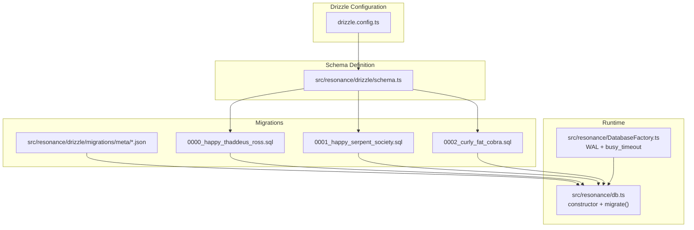

**Diagram sources**
- [drizzle.config.ts](file://drizzle.config.ts#L1-L11)
- [schema.ts](file://src/resonance/drizzle/schema.ts#L1-L77)
- [db.ts](file://src/resonance/db.ts#L70-L81)
- [DatabaseFactory.ts](file://src/resonance/DatabaseFactory.ts#L44-L66)
- [0000_happy_thaddeus_ross.sql](file://src/resonance/drizzle/migrations/0000_happy_thaddeus_ross.sql#L1-L31)
- [0001_happy_serpent_society.sql](file://src/resonance/drizzle/migrations/0001_happy_serpent_society.sql#L1-L10)
- [0002_curly_fat_cobra.sql](file://src/resonance/drizzle/migrations/0002_curly_fat_cobra.sql#L1-L1)

**Section sources**
- [drizzle.config.ts](file://drizzle.config.ts#L1-L11)
- [schema.ts](file://src/resonance/drizzle/schema.ts#L1-L77)
- [db.ts](file://src/resonance/db.ts#L70-L81)
- [DatabaseFactory.ts](file://src/resonance/DatabaseFactory.ts#L44-L66)

## Core Components
- Drizzle configuration: Defines schema path, migrations output, dialect, and database URL.
- Drizzle schema: Centralized schema definition for nodes, edges, ember_state, and history tables.
- Migrations: Generated SQL files under migrations with deterministic filenames and snapshots.
- Database initialization: On construction, the runtime applies migrations automatically.
- DatabaseFactory: Ensures WAL mode, busy_timeout, and integrity settings for safe concurrent access.

**Section sources**
- [drizzle.config.ts](file://drizzle.config.ts#L1-L11)
- [schema.ts](file://src/resonance/drizzle/schema.ts#L1-L77)
- [db.ts](file://src/resonance/db.ts#L70-L81)
- [DatabaseFactory.ts](file://src/resonance/DatabaseFactory.ts#L44-L66)

## Architecture Overview
Amalfa uses SQLite as a high-performance runtime storage engine with FAFCAS-aligned constraints. Drizzle is used exclusively for schema definition and migration generation/execution. Runtime queries use raw SQL via bun:sqlite for performance. The database is configured with WAL mode and busy_timeout to minimize contention and improve concurrency.

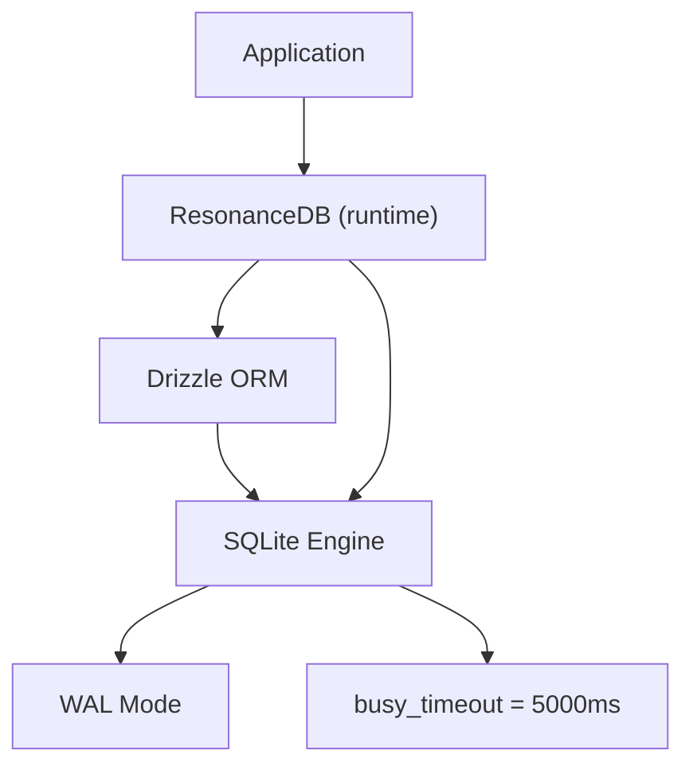

**Diagram sources**
- [DATABASE-PROCEDURES.md](file://src/resonance/DATABASE-PROCEDURES.md#L14-L43)
- [DatabaseFactory.ts](file://src/resonance/DatabaseFactory.ts#L44-L66)
- [db.ts](file://src/resonance/db.ts#L70-L81)

## Detailed Component Analysis

### Drizzle ORM Integration and Migration Workflow
- Schema definition resides in a single source of truth and is consumed by Drizzle Kit to generate SQL migrations.
- Generated migrations are stored under migrations with deterministic filenames and snapshot metadata.
- During ResonanceDB initialization, migrations are applied automatically via Drizzle’s migrator.

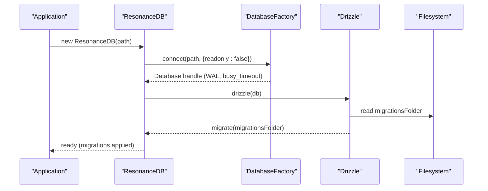

**Diagram sources**
- [db.ts](file://src/resonance/db.ts#L44-L81)
- [DatabaseFactory.ts](file://src/resonance/DatabaseFactory.ts#L44-L66)
- [drizzle.config.ts](file://drizzle.config.ts#L3-L10)

**Section sources**
- [DATABASE-PROCEDURES.md](file://src/resonance/DATABASE-PROCEDURES.md#L46-L86)
- [db.ts](file://src/resonance/db.ts#L70-L81)
- [drizzle.config.ts](file://drizzle.config.ts#L1-L11)

### Migration Folder Structure and Filenames
- Migrations are stored under migrations with deterministic filenames and snapshot metadata.
- Filenames follow a pattern indicating order and human-readable labels.
- Snapshot files capture the expected schema state for each migration.

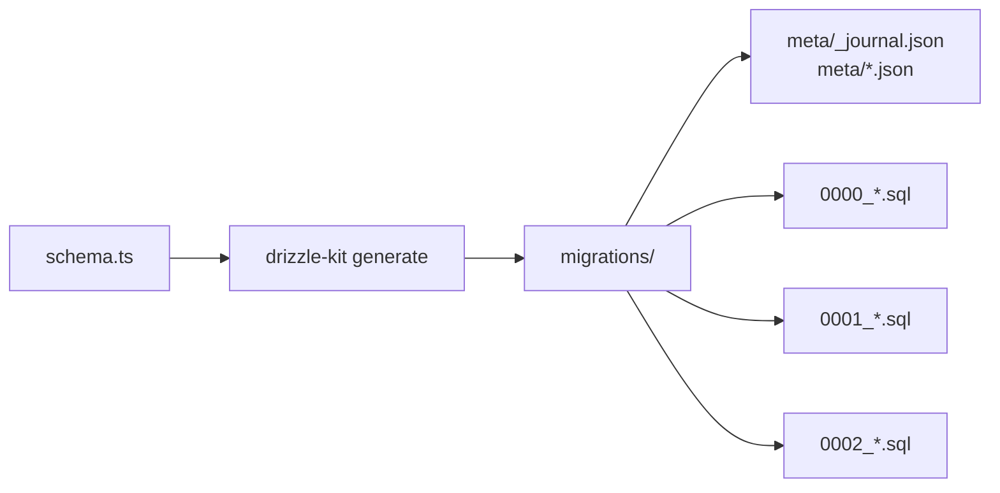

**Diagram sources**
- [schema.ts](file://src/resonance/drizzle/schema.ts#L1-L77)
- [0000_happy_thaddeus_ross.sql](file://src/resonance/drizzle/migrations/0000_happy_thaddeus_ross.sql#L1-L31)
- [0001_happy_serpent_society.sql](file://src/resonance/drizzle/migrations/0001_happy_serpent_society.sql#L1-L10)
- [0002_curly_fat_cobra.sql](file://src/resonance/drizzle/migrations/0002_curly_fat_cobra.sql#L1-L1)

**Section sources**
- [DATABASE-PROCEDURES.md](file://src/resonance/DATABASE-PROCEDURES.md#L46-L86)
- [0000_happy_thaddeus_ross.sql](file://src/resonance/drizzle/migrations/0000_happy_thaddeus_ross.sql#L1-L31)
- [0001_happy_serpent_society.sql](file://src/resonance/drizzle/migrations/0001_happy_serpent_society.sql#L1-L10)
- [0002_curly_fat_cobra.sql](file://src/resonance/drizzle/migrations/0002_curly_fat_cobra.sql#L1-L1)

### Automatic Migration Checking During Initialization
- ResonanceDB constructor ensures a compliant connection and then invokes migrate(), which applies pending migrations.
- This guarantees schema consistency on startup without manual intervention.

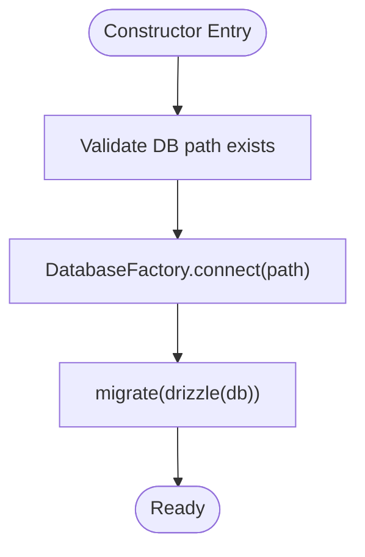

**Diagram sources**
- [db.ts](file://src/resonance/db.ts#L44-L81)
- [DatabaseFactory.ts](file://src/resonance/DatabaseFactory.ts#L44-L66)

**Section sources**
- [db.ts](file://src/resonance/db.ts#L44-L81)

### Safe Application with WAL and Busy Timeout
- WAL mode allows concurrent readers and writers, reducing contention.
- busy_timeout sets a maximum wait time for acquiring locks, preventing immediate failures under contention.
- Integrity settings (foreign_keys) and performance settings (synchronous, temp_store) are applied consistently.

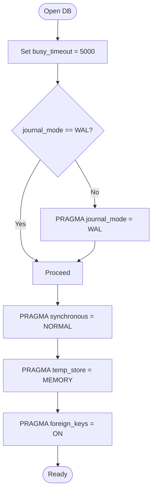

**Diagram sources**
- [DatabaseFactory.ts](file://src/resonance/DatabaseFactory.ts#L44-L66)
- [hardened-sqlite.md](file://docs/references/hardened-sqlite.md#L17-L63)

**Section sources**
- [DatabaseFactory.ts](file://src/resonance/DatabaseFactory.ts#L44-L66)
- [hardened-sqlite.md](file://docs/references/hardened-sqlite.md#L17-L63)

### Migration Rollback Procedures and Version Management
- Emergency rollback involves restoring from a pre-migration backup, dropping Drizzle state, and re-applying migrations from scratch.
- Version management is handled by Drizzle’s migration tracking; for existing databases, migrations can be marked as applied without re-execution.

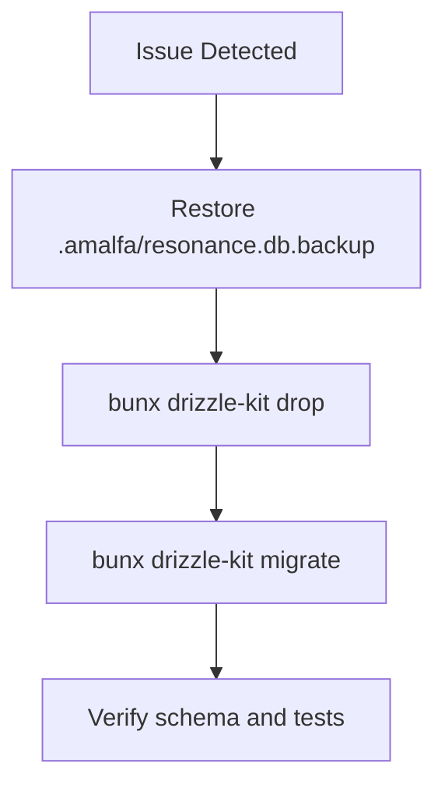

**Diagram sources**
- [DATABASE-PROCEDURES.md](file://src/resonance/DATABASE-PROCEDURES.md#L88-L99)
- [2026-01-13-drizzle-migration-completion.md](file://debriefs/2026-01-13-drizzle-migration-completion.md#L282-L305)

**Section sources**
- [DATABASE-PROCEDURES.md](file://src/resonance/DATABASE-PROCEDURES.md#L88-L99)
- [2026-01-13-drizzle-migration-completion.md](file://debriefs/2026-01-13-drizzle-migration-completion.md#L282-L305)

### Schema Evolution: From Content Storage to Hollow Nodes
- The schema evolved to remove the content column from nodes, enforcing a “hollow nodes” pattern where content is stored on the filesystem and metadata in the database.
- This change was implemented in a dedicated migration and reflected across the codebase, including updates to the MCP layer and content hydration utilities.

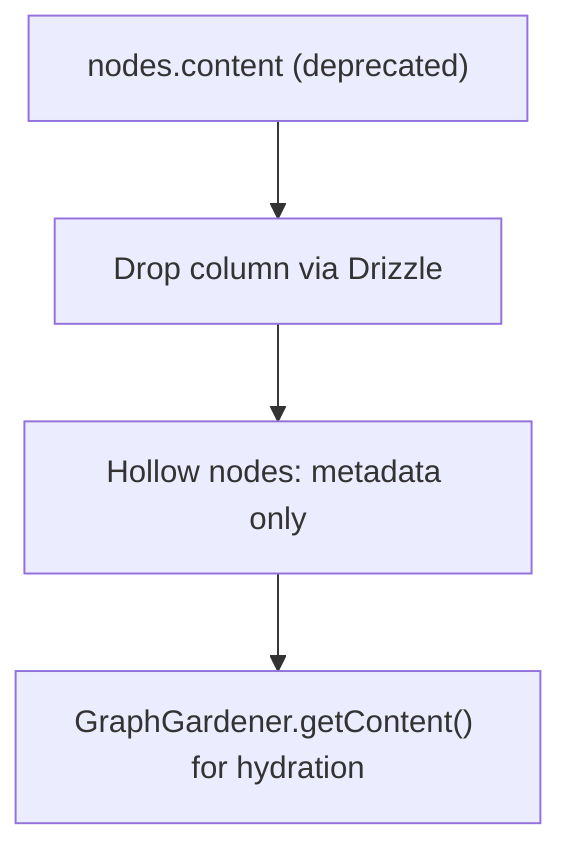

**Diagram sources**
- [2026-01-13-drizzle-migration-completion.md](file://debriefs/2026-01-13-drizzle-migration-completion.md#L11-L16)
- [0002_curly_fat_cobra.sql](file://src/resonance/drizzle/migrations/0002_curly_fat_cobra.sql#L1-L1)

**Section sources**
- [2026-01-13-drizzle-migration-completion.md](file://debriefs/2026-01-13-drizzle-migration-completion.md#L11-L16)
- [0002_curly_fat_cobra.sql](file://src/resonance/drizzle/migrations/0002_curly_fat_cobra.sql#L1-L1)

### Migration Testing Procedures
- After generating migrations, review the generated SQL, apply to a development database, verify schema, run tests, and commit both schema.ts and the migration.
- For FTS additions, use the dedicated migration script to create FTS5 virtual tables and sync triggers.

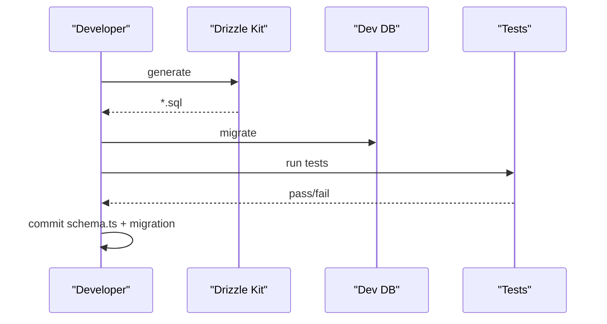

**Diagram sources**
- [DATABASE-PROCEDURES.md](file://src/resonance/DATABASE-PROCEDURES.md#L62-L86)
- [add_fts.ts](file://scripts/migrations/add_fts.ts#L12-L98)

**Section sources**
- [DATABASE-PROCEDURES.md](file://src/resonance/DATABASE-PROCEDURES.md#L62-L86)
- [add_fts.ts](file://scripts/migrations/add_fts.ts#L12-L98)

### Backup Strategies and Rollback Recovery
- Pre-migration backups are recommended and can be automated.
- Rollback recovery follows the emergency procedure: restore from backup, reset Drizzle state, and re-apply migrations.

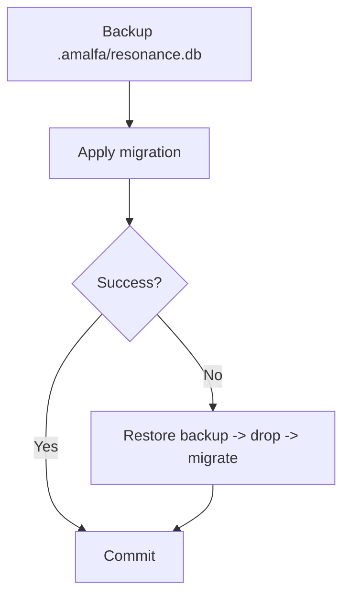

**Diagram sources**
- [DATABASE-PROCEDURES.md](file://src/resonance/DATABASE-PROCEDURES.md#L207-L230)
- [DATABASE-PROCEDURES.md](file://src/resonance/DATABASE-PROCEDURES.md#L88-L99)

**Section sources**
- [DATABASE-PROCEDURES.md](file://src/resonance/DATABASE-PROCEDURES.md#L207-L230)
- [DATABASE-PROCEDURES.md](file://src/resonance/DATABASE-PROCEDURES.md#L88-L99)

### Migration Conflict Resolution and Environment Propagation
- To avoid conflicts, always edit schema.ts, generate, review, and apply via Drizzle.
- For existing databases, mark Drizzle migrations as applied without re-execution and remove legacy migration code.
- Propagation across environments is ensured by committing schema.ts and migrations, and by applying migrations automatically on initialization.

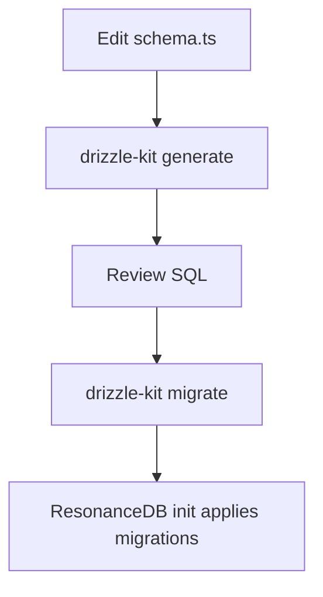

**Diagram sources**
- [DATABASE-PROCEDURES.md](file://src/resonance/DATABASE-PROCEDURES.md#L46-L86)
- [db.ts](file://src/resonance/db.ts#L70-L81)
- [2026-01-13-drizzle-migration-completion.md](file://debriefs/2026-01-13-drizzle-migration-completion.md#L282-L305)

**Section sources**
- [DATABASE-PROCEDURES.md](file://src/resonance/DATABASE-PROCEDURES.md#L46-L86)
- [db.ts](file://src/resonance/db.ts#L70-L81)
- [2026-01-13-drizzle-migration-completion.md](file://debriefs/2026-01-13-drizzle-migration-completion.md#L282-L305)

## Dependency Analysis
The migration system depends on Drizzle for schema definition and migration generation, and on SQLite’s WAL and busy_timeout for safe concurrent access. The ResonanceDB runtime depends on DatabaseFactory for connection configuration and applies migrations automatically.

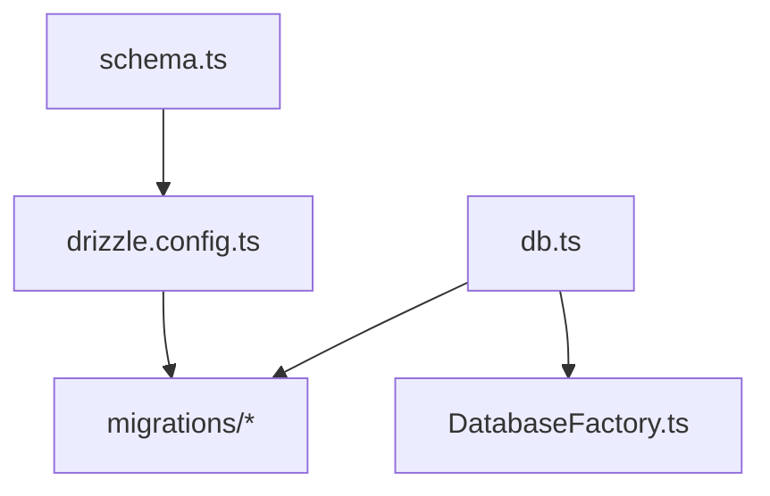

**Diagram sources**
- [schema.ts](file://src/resonance/drizzle/schema.ts#L1-L77)
- [drizzle.config.ts](file://drizzle.config.ts#L1-L11)
- [db.ts](file://src/resonance/db.ts#L70-L81)
- [DatabaseFactory.ts](file://src/resonance/DatabaseFactory.ts#L44-L66)

**Section sources**
- [schema.ts](file://src/resonance/drizzle/schema.ts#L1-L77)
- [drizzle.config.ts](file://drizzle.config.ts#L1-L11)
- [db.ts](file://src/resonance/db.ts#L70-L81)
- [DatabaseFactory.ts](file://src/resonance/DatabaseFactory.ts#L44-L66)

## Performance Considerations
- WAL mode and busy_timeout reduce contention and improve throughput for concurrent readers/writers.
- Transaction boundaries should remain short to minimize lock duration; batch sizes should be tuned to stay within busy_timeout.
- Checkpointing can be used to truncate WAL and reclaim space when appropriate.

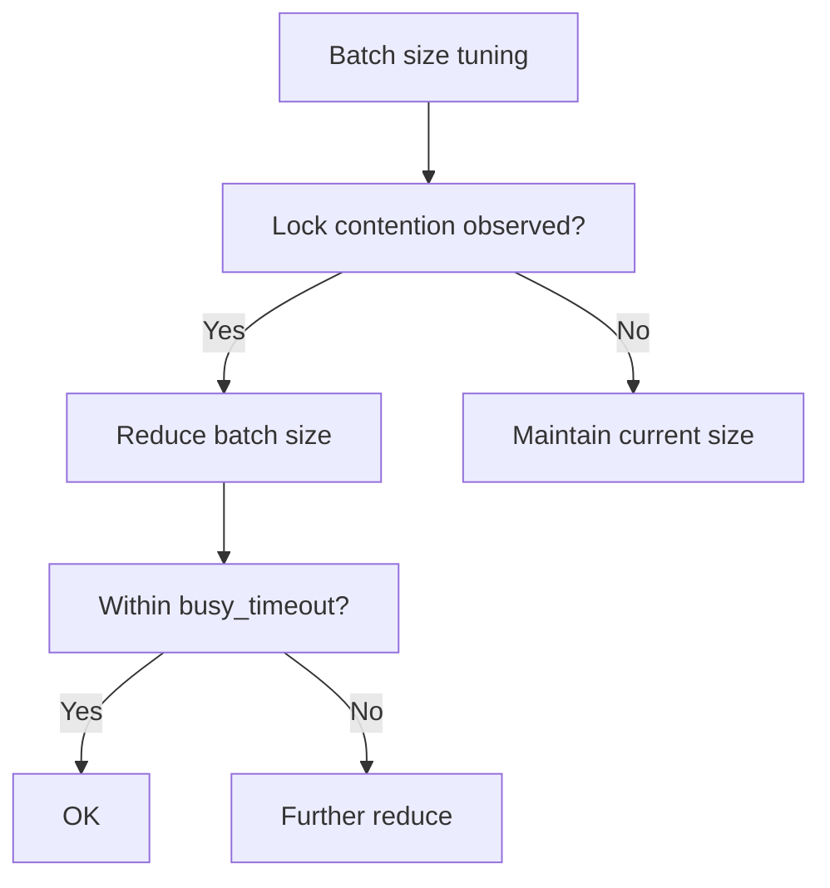

**Diagram sources**
- [2026-01-15-database-connection-hygiene.md](file://debriefs/2026-01-15-database-connection-hygiene.md#L120-L125)
- [DatabaseFactory.ts](file://src/resonance/DatabaseFactory.ts#L44-L66)
- [checkpoint.ts](file://scripts/pipeline/checkpoint.ts#L1-L7)

**Section sources**
- [2026-01-15-database-connection-hygiene.md](file://debriefs/2026-01-15-database-connection-hygiene.md#L120-L125)
- [DatabaseFactory.ts](file://src/resonance/DatabaseFactory.ts#L44-L66)
- [checkpoint.ts](file://scripts/pipeline/checkpoint.ts#L1-L7)

## Troubleshooting Guide
Common issues and resolutions:
- “Database is locked”: Check for rogue processes, stop daemons, and restart.
- “Table does not exist”: Apply migrations using Drizzle.
- “Schema mismatch”: Regenerate migration from current schema, review, and apply if correct; otherwise restore from backup.

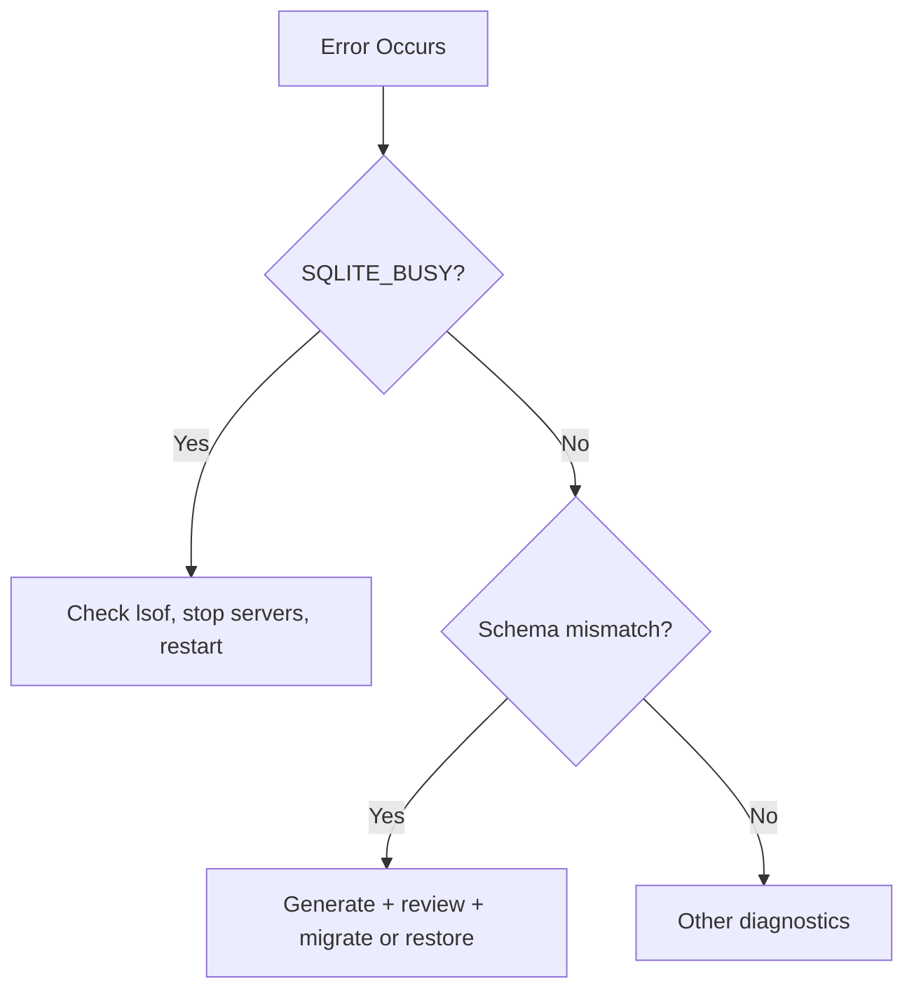

**Diagram sources**
- [DATABASE-PROCEDURES.md](file://src/resonance/DATABASE-PROCEDURES.md#L234-L274)
- [database-connection-hygiene.md](file://playbooks/database-connection-hygiene.md#L271-L278)

**Section sources**
- [DATABASE-PROCEDURES.md](file://src/resonance/DATABASE-PROCEDURES.md#L234-L274)
- [database-connection-hygiene.md](file://playbooks/database-connection-hygiene.md#L271-L278)

## Conclusion
Amalfa’s migration strategy centers on a single, canonical schema definition, deterministic migrations, and automatic application at startup. WAL and busy_timeout ensure safe concurrency, while clear procedures govern testing, backups, rollbacks, and environment propagation. The “hollow nodes” evolution exemplifies disciplined schema evolution aligned with the overall architecture.

## Appendices

### Migration Protocol Checklist
- Backup database before changes.
- Edit schema.ts.
- Generate migration and review SQL.
- Apply migration to development database.
- Verify schema and run tests.
- Commit schema.ts and migration.

**Section sources**
- [DATABASE-PROCEDURES.md](file://src/resonance/DATABASE-PROCEDURES.md#L62-L86)

### Disposable Database Philosophy
- Treat the database as a cache; regenerate quickly from immutable documents.
- Avoid theatrical migration complexity; favor simplicity aligned with architecture.

**Section sources**
- [2026-01-13-disposable-database-philosophy.md](file://debriefs/2026-01-13-disposable-database-philosophy.md#L106-L112)