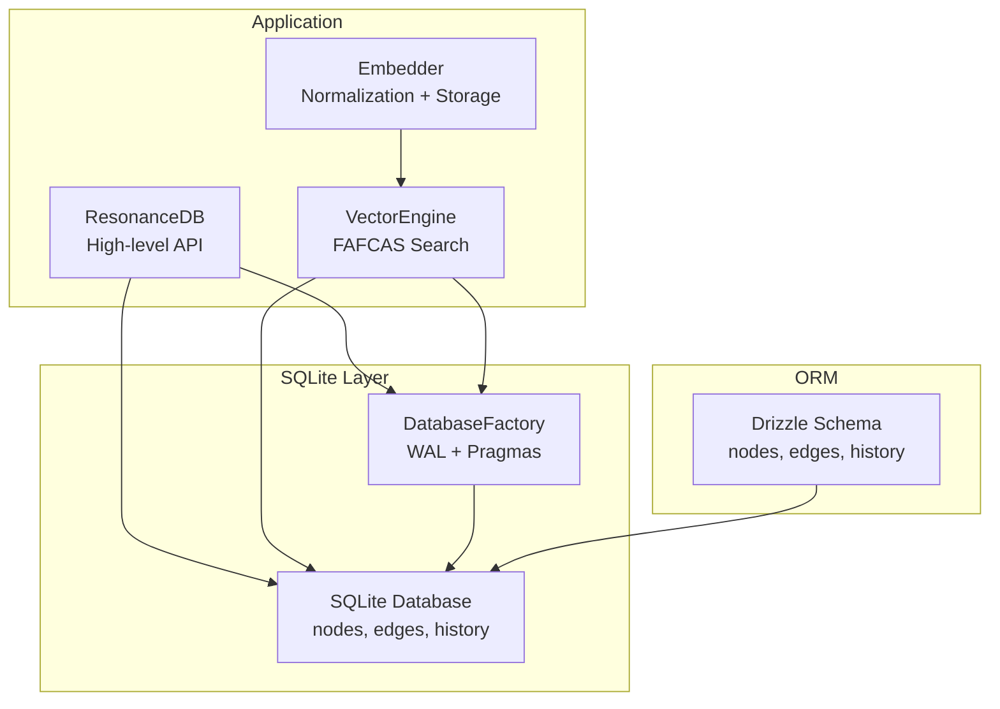
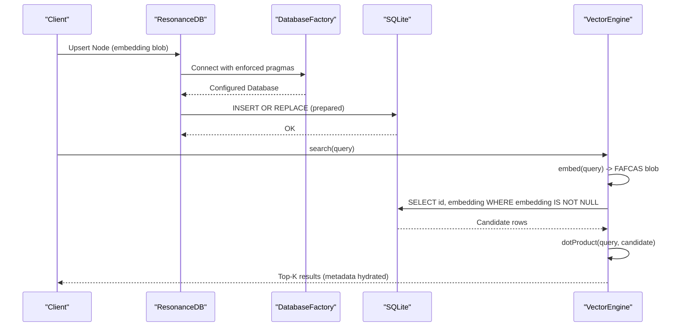
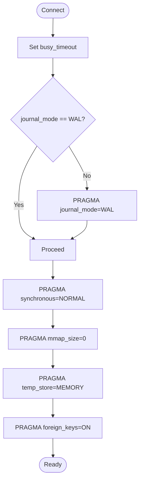
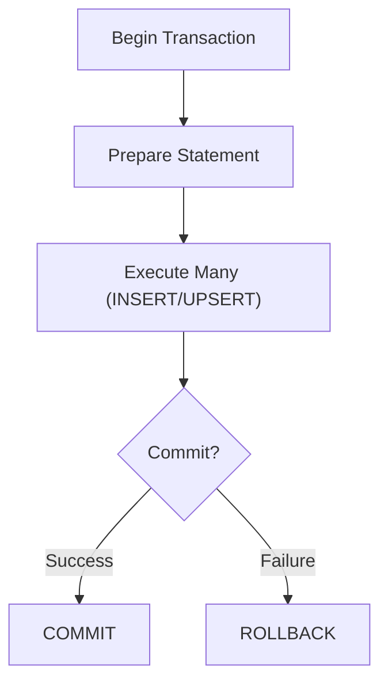
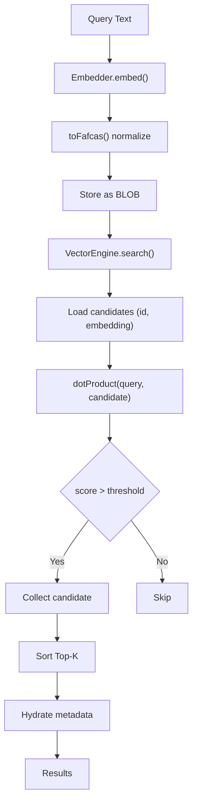
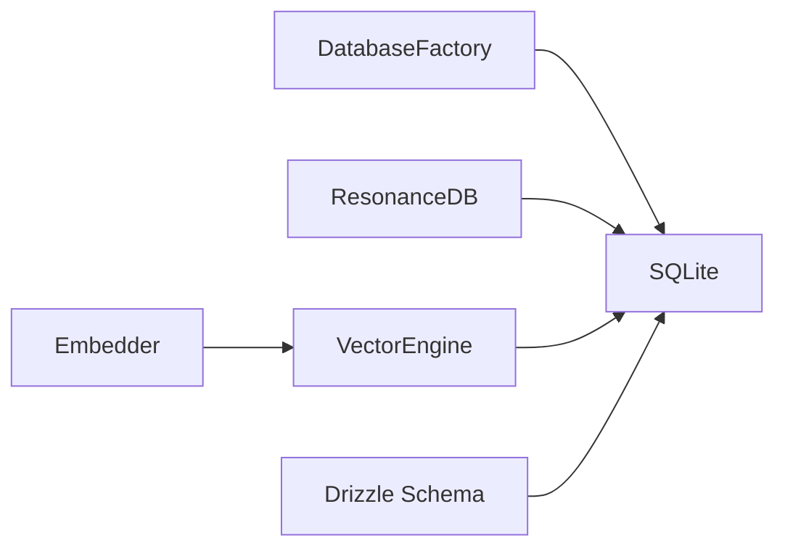

# Performance Optimization

<cite>
**Referenced Files in This Document**
- [src/resonance/db.ts](file://src/resonance/db.ts)
- [src/resonance/DatabaseFactory.ts](file://src/resonance/DatabaseFactory.ts)
- [src/resonance/DATABASE-PROCEDURES.md](file://src/resonance/DATABASE-PROCEDURES.md)
- [src/resonance/drizzle/schema.ts](file://src/resonance/drizzle/schema.ts)
- [playbooks/sqlite-standards.md](file://playbooks/sqlite-standards.md)
- [playbooks/embeddings-and-fafcas-protocol-playbook.md](file://playbooks/embeddings-and-fafcas-protocol-playbook.md)
- [src/core/VectorEngine.ts](file://src/core/VectorEngine.ts)
- [src/resonance/services/embedder.ts](file://src/resonance/services/embedder.ts)
- [scripts/lab/debug-vector-recall.ts](file://scripts/lab/debug-vector-recall.ts)
- [scripts/profile_memory.ts](file://scripts/profile_memory.ts)
- [scripts/verify/test_queries.ts](file://scripts/verify/test_queries.ts)
</cite>

## Table of Contents
1. [Introduction](#introduction)
2. [Project Structure](#project-structure)
3. [Core Components](#core-components)
4. [Architecture Overview](#architecture-overview)
5. [Detailed Component Analysis](#detailed-component-analysis)
6. [Dependency Analysis](#dependency-analysis)
7. [Performance Considerations](#performance-considerations)
8. [Troubleshooting Guide](#troubleshooting-guide)
9. [Conclusion](#conclusion)
10. [Appendices](#appendices)

## Introduction
This document provides a comprehensive guide to optimizing database performance in Amalfa with a focus on SQLite configuration, indexing, query optimization, memory management, FAFCAS protocol efficiency, and operational procedures. It synthesizes the repository’s canonical standards and implementation to deliver actionable guidance for developers and operators maintaining the Resonance Graph.

## Project Structure
Amalfa’s database layer centers around a SQLite-backed graph store with strict configuration enforcement and FAFCAS vector semantics. The key modules involved in performance optimization are:
- DatabaseFactory: Enforces WAL mode, busy timeouts, synchronous settings, and foreign key integrity.
- ResonanceDB: High-performance wrapper for nodes and edges with transaction support and PRAGMA-based stats.
- Drizzle schema: Declares nodes, edges, and history tables with composite primary keys and traversal indices.
- VectorEngine and Embedder: Implement FAFCAS normalization and dot-product similarity search.
- Playbooks: Canonical standards for SQLite configuration and FAFCAS protocol.



**Diagram sources**
- [src/resonance/db.ts](file://src/resonance/db.ts#L25-L81)
- [src/resonance/DatabaseFactory.ts](file://src/resonance/DatabaseFactory.ts#L13-L66)
- [src/resonance/drizzle/schema.ts](file://src/resonance/drizzle/schema.ts#L16-L51)
- [src/core/VectorEngine.ts](file://src/core/VectorEngine.ts#L76-L109)
- [src/resonance/services/embedder.ts](file://src/resonance/services/embedder.ts#L9-L21)

**Section sources**
- [src/resonance/db.ts](file://src/resonance/db.ts#L25-L81)
- [src/resonance/DatabaseFactory.ts](file://src/resonance/DatabaseFactory.ts#L13-L66)
- [src/resonance/drizzle/schema.ts](file://src/resonance/drizzle/schema.ts#L16-L51)
- [playbooks/sqlite-standards.md](file://playbooks/sqlite-standards.md#L14-L25)

## Core Components
- DatabaseFactory enforces WAL mode, busy_timeout, synchronous, mmap, and foreign keys. It ensures all connections adhere to the “Hardened” standard for concurrency and stability.
- ResonanceDB encapsulates CRUD operations for nodes and edges, uses prepared statements, supports transactions, and exposes PRAGMA-based stats for monitoring.
- Drizzle schema defines nodes (primary key id), edges (composite primary key source/target/type with traversal indices), and history tables.
- VectorEngine implements FAFCAS search using dot products on normalized vectors, minimizing overhead and maximizing throughput.
- Embedder integrates FAFCAS normalization at generation time and coordinates remote/local vector generation.

**Section sources**
- [src/resonance/DatabaseFactory.ts](file://src/resonance/DatabaseFactory.ts#L44-L66)
- [src/resonance/db.ts](file://src/resonance/db.ts#L83-L134)
- [src/resonance/drizzle/schema.ts](file://src/resonance/drizzle/schema.ts#L16-L51)
- [src/core/VectorEngine.ts](file://src/core/VectorEngine.ts#L58-L74)
- [src/resonance/services/embedder.ts](file://src/resonance/services/embedder.ts#L99-L124)

## Architecture Overview
The performance-critical path leverages FAFCAS to store normalized vectors as raw BLOBs and compute cosine similarity via dot products in-process. SQLite is configured for concurrency and durability, while Drizzle manages schema evolution safely.



**Diagram sources**
- [src/resonance/db.ts](file://src/resonance/db.ts#L83-L134)
- [src/resonance/DatabaseFactory.ts](file://src/resonance/DatabaseFactory.ts#L27-L66)
- [src/core/VectorEngine.ts](file://src/core/VectorEngine.ts#L159-L240)

## Detailed Component Analysis

### SQLite Configuration and WAL Mode
- WAL mode is mandatory and enforced at connection time. WAL enables concurrent readers and writers with reduced contention.
- Busy timeout is set to mitigate transient lock waits during heavy ingestion.
- Synchronous is set to NORMAL for WAL mode, balancing durability and performance.
- mmap is disabled for stability; temp_store is set to MEMORY to reduce disk I/O.
- Foreign keys are enabled for referential integrity.



**Diagram sources**
- [src/resonance/DatabaseFactory.ts](file://src/resonance/DatabaseFactory.ts#L44-L66)
- [playbooks/sqlite-standards.md](file://playbooks/sqlite-standards.md#L18-L25)

**Section sources**
- [src/resonance/DatabaseFactory.ts](file://src/resonance/DatabaseFactory.ts#L44-L66)
- [playbooks/sqlite-standards.md](file://playbooks/sqlite-standards.md#L18-L25)

### Indexing Strategies for Nodes and Edges
- Nodes table: Primary key on id; consider adding domain/type/title/hash/meta/date indexes if frequent filtering by these fields becomes a bottleneck.
- Edges table: Composite primary key on (source, target, type) with separate indices on source and target for traversal-heavy queries. These indices accelerate neighbor discovery and graph walks.

```mermaid
erDiagram
NODES {
text id PK
text type
text title
text domain
text layer
blob embedding
text hash
text summary
text meta
text date
}
EDGES {
text source NN FK
text target NN FK
text type NN
real confidence
real veracity
text context_source
}
NODES ||--o{ EDGES : "referenced by"
```

**Diagram sources**
- [src/resonance/drizzle/schema.ts](file://src/resonance/drizzle/schema.ts#L16-L51)

**Section sources**
- [src/resonance/drizzle/schema.ts](file://src/resonance/drizzle/schema.ts#L44-L51)

### Query Optimization Techniques
- Prepared statements: ResonanceDB uses db.prepare for inserts and typed getters, avoiding repeated parsing and enabling reuse of compiled VMs.
- Parameter binding: Named parameters ($id, $type) and positional parameters (?, ?, ?) minimize overhead and improve readability.
- Batch operations: Transactions wrap bulk writes to dramatically increase throughput. Use ResonanceDB.beginTransaction/commit/rollback for multi-statement batches.
- Selective hydration: Exclude embedding and content columns when scanning metadata; hydrate embeddings only when needed.



**Diagram sources**
- [src/resonance/db.ts](file://src/resonance/db.ts#L349-L363)

**Section sources**
- [src/resonance/db.ts](file://src/resonance/db.ts#L83-L134)
- [src/resonance/db.ts](file://src/resonance/db.ts#L349-L363)

### Memory Management and Garbage Collection
- Embeddings are stored as raw BLOBs; FAFCAS normalization occurs at ingestion time to avoid repeated computation.
- VectorEngine loads only id and embedding for candidate scoring, then hydrates metadata for top-K results to minimize memory footprint.
- Profile memory growth during vector search to detect leaks; ensure long-lived connections are closed gracefully to checkpoint WAL.

**Section sources**
- [src/core/VectorEngine.ts](file://src/core/VectorEngine.ts#L165-L225)
- [scripts/profile_memory.ts](file://scripts/profile_memory.ts#L71-L93)

### FAFCAS Protocol Optimization for Vector Similarity
- Vectors are normalized to unit length prior to storage, enabling cosine similarity via dot product.
- Dot product is computed in a tight loop; zero-magnitude vectors are filtered out to avoid false positives.
- Embedder normalizes vectors at generation boundary, ensuring consistency across ingestion and search paths.



**Diagram sources**
- [playbooks/embeddings-and-fafcas-protocol-playbook.md](file://playbooks/embeddings-and-fafcas-protocol-playbook.md#L29-L36)
- [src/core/VectorEngine.ts](file://src/core/VectorEngine.ts#L58-L74)
- [src/resonance/services/embedder.ts](file://src/resonance/services/embedder.ts#L99-L124)

**Section sources**
- [playbooks/embeddings-and-fafcas-protocol-playbook.md](file://playbooks/embeddings-and-fafcas-protocol-playbook.md#L29-L36)
- [src/core/VectorEngine.ts](file://src/core/VectorEngine.ts#L58-L74)
- [src/resonance/services/embedder.ts](file://src/resonance/services/embedder.ts#L99-L124)

### Performance Monitoring Using PRAGMA and Statistics
- Use PRAGMA page_count and page_size to compute database size.
- Use COUNT(*) for nodes, edges, and vectors; use pattern matching to estimate semantic tokens.
- Periodically run ANALYZE to update query planner statistics; use integrity_check for integrity verification.

**Section sources**
- [src/resonance/db.ts](file://src/resonance/db.ts#L305-L336)
- [src/resonance/DATABASE-PROCEDURES.md](file://src/resonance/DATABASE-PROCEDURES.md#L219-L230)

### Scalability, Partitioning, and Maintenance
- Hollow nodes: Content is stored externally; database remains compact and fast for graph operations.
- Traversal indices: Ensure sourceIdx and targetIdx are present on edges for efficient graph walks.
- Maintenance: VACUUM to reclaim space after large deletions; ANALYZE to refresh stats; integrity_check for safety.
- Migration: Use Drizzle for schema changes; maintain backups before applying migrations.

**Section sources**
- [src/resonance/DATABASE-PROCEDURES.md](file://src/resonance/DATABASE-PROCEDURES.md#L14-L43)
- [src/resonance/drizzle/schema.ts](file://src/resonance/drizzle/schema.ts#L44-L51)
- [src/resonance/DATABASE-PROCEDURES.md](file://src/resonance/DATABASE-PROCEDURES.md#L219-L230)

### Benchmarking and Regression Testing
- Vector recall and latency: Use scripts to measure search performance and target document recall.
- Memory profiling: Track RSS and heap growth across ingestion, graph building, model loading, and search phases.
- Query verification: Validate graph connectivity and approximate full-text search behavior using LIKE against content.

**Section sources**
- [scripts/lab/debug-vector-recall.ts](file://scripts/lab/debug-vector-recall.ts#L50-L139)
- [scripts/profile_memory.ts](file://scripts/profile_memory.ts#L71-L93)
- [scripts/verify/test_queries.ts](file://scripts/verify/test_queries.ts#L61-L81)

## Dependency Analysis
The ResonanceDB class depends on DatabaseFactory for connection configuration and uses Drizzle for schema definitions. VectorEngine depends on the database connection and FastEmbed for normalization. Embedder coordinates vector generation and FAFCAS normalization.



**Diagram sources**
- [src/resonance/DatabaseFactory.ts](file://src/resonance/DatabaseFactory.ts#L13-L66)
- [src/resonance/db.ts](file://src/resonance/db.ts#L25-L81)
- [src/core/VectorEngine.ts](file://src/core/VectorEngine.ts#L76-L109)
- [src/resonance/services/embedder.ts](file://src/resonance/services/embedder.ts#L9-L21)
- [src/resonance/drizzle/schema.ts](file://src/resonance/drizzle/schema.ts#L16-L51)

**Section sources**
- [src/resonance/DatabaseFactory.ts](file://src/resonance/DatabaseFactory.ts#L13-L66)
- [src/resonance/db.ts](file://src/resonance/db.ts#L25-L81)
- [src/core/VectorEngine.ts](file://src/core/VectorEngine.ts#L76-L109)
- [src/resonance/services/embedder.ts](file://src/resonance/services/embedder.ts#L9-L21)
- [src/resonance/drizzle/schema.ts](file://src/resonance/drizzle/schema.ts#L16-L51)

## Performance Considerations
- Prefer WAL mode with busy_timeout for concurrent workloads.
- Use transactions for bulk operations to achieve orders-of-magnitude throughput improvements.
- Minimize BLOB transfer by excluding embedding/content columns in metadata scans.
- Normalize vectors once at ingestion time to eliminate repeated sqrt/div operations at query time.
- Monitor database size and query statistics regularly; vacuum and analyze as part of routine maintenance.

[No sources needed since this section provides general guidance]

## Troubleshooting Guide
- Database locked: Confirm single writer plus reader access to SHM; restart services if stale locks persist.
- Schema mismatch: Re-apply Drizzle migrations; ensure backups are restored if necessary.
- Slow queries: Add targeted indexes on edges (source/target) and nodes (domain/type/hash/meta/date) as needed; run ANALYZE.

**Section sources**
- [src/resonance/DATABASE-PROCEDURES.md](file://src/resonance/DATABASE-PROCEDURES.md#L234-L275)

## Conclusion
Amalfa’s performance hinges on strict SQLite configuration (WAL, busy_timeout, synchronous), FAFCAS vector normalization and dot-product similarity, and careful indexing and query patterns. Adhering to the canonical standards and leveraging transactions, selective hydration, and regular maintenance yields predictable, scalable performance for large knowledge bases.

[No sources needed since this section summarizes without analyzing specific files]

## Appendices

### SQLite PRAGMA Reference
- journal_mode=WAL
- busy_timeout=5000
- synchronous=NORMAL
- mmap_size=0
- temp_store=MEMORY
- foreign_keys=ON

**Section sources**
- [src/resonance/DatabaseFactory.ts](file://src/resonance/DatabaseFactory.ts#L44-L66)
- [playbooks/sqlite-standards.md](file://playbooks/sqlite-standards.md#L18-L25)