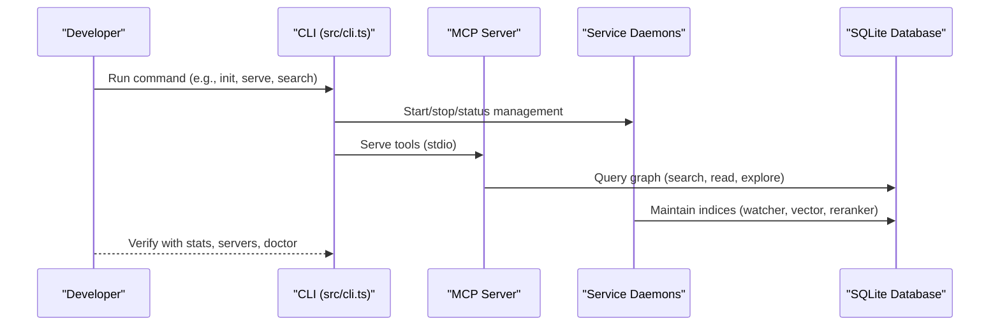
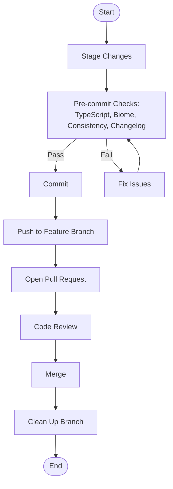
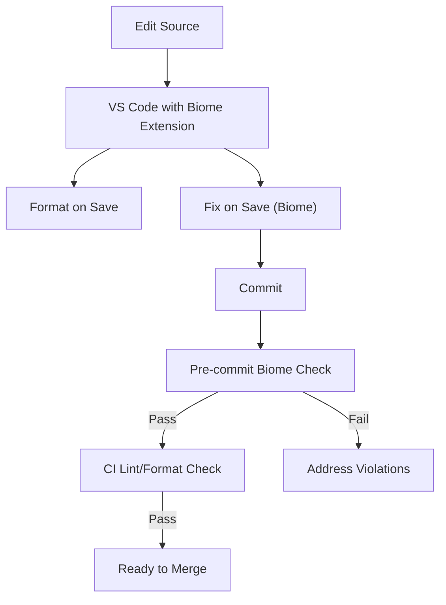
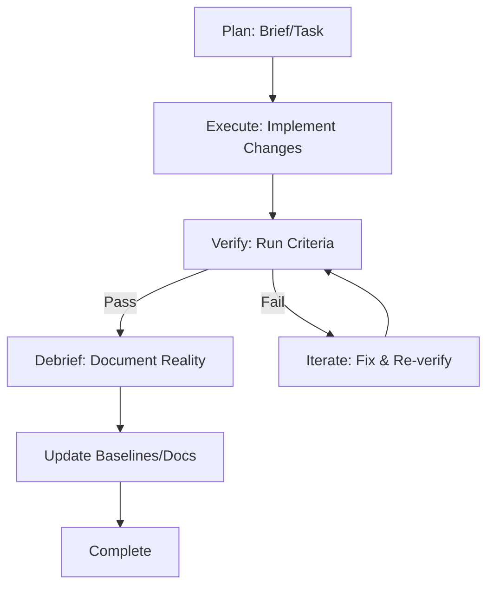
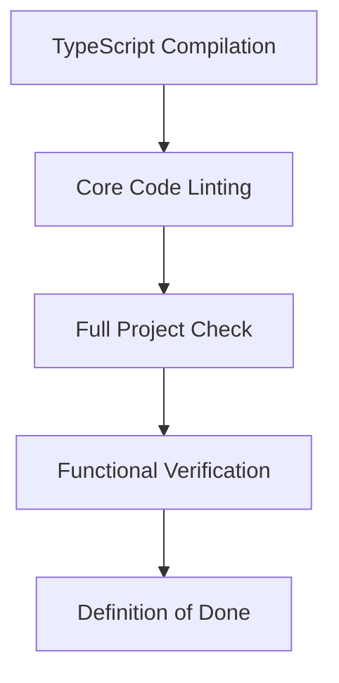
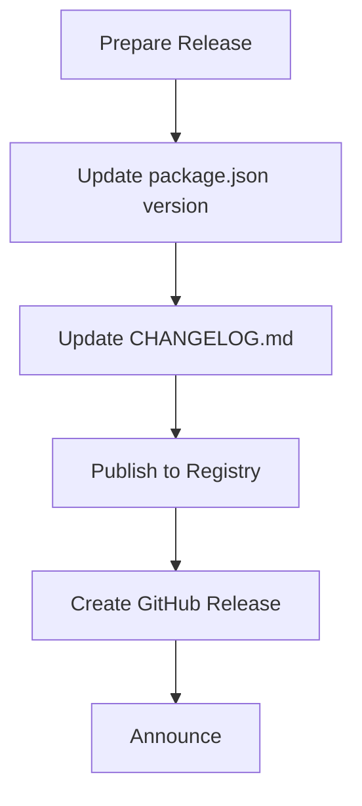
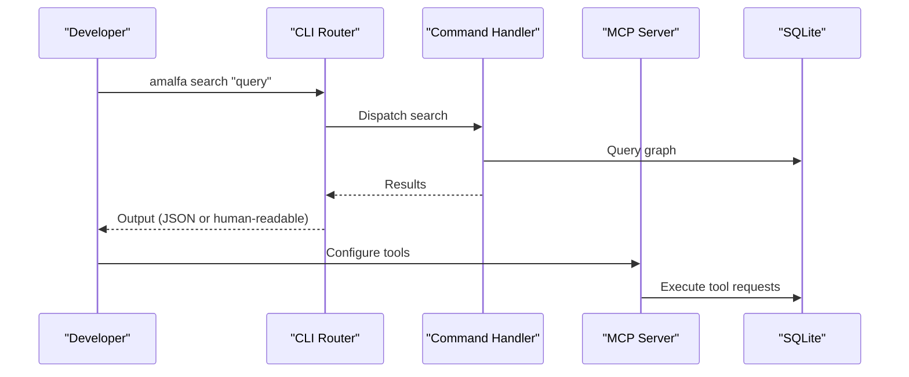
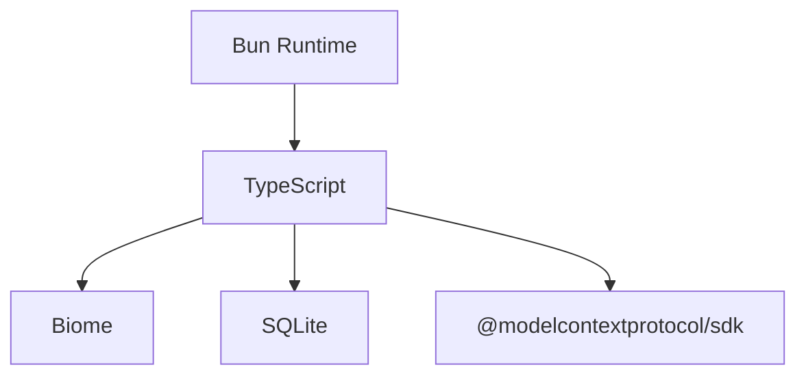

# Development Workflow

<cite>
**Referenced Files in This Document**
- [README.md](file://README.md)
- [docs/COMMIT_GUIDELINES.md](file://docs/COMMIT_GUIDELINES.md)
- [playbooks/development-workflow-playbook.md](file://playbooks/development-workflow-playbook.md)
- [playbooks/change-management-protocol.md](file://playbooks/change-management-protocol.md)
- [biome.config.json](file://biome.config.json)
- [package.json](file://package.json)
- [.gitignore](file://.gitignore)
- [tsconfig.json](file://tsconfig.json)
- [docs/setup/SETUP.md](file://docs/setup/SETUP.md)
- [playbooks/biome-playbook.md](file://playbooks/biome-playbook.md)
- [scripts/maintenance/pre-commit.ts](file://scripts/maintenance/pre-commit.ts)
- [tests/tsconfig.json](file://tests/tsconfig.json)
- [playbooks/definition-of-done-playbook.md](file://playbooks/definition-of-done-playbook.md)
- [docs/MCP-TOOLS.md](file://docs/MCP-TOOLS.md)
- [src/cli.ts](file://src/cli.ts)
</cite>

## Table of Contents
1. [Introduction](#introduction)
2. [Project Structure](#project-structure)
3. [Core Components](#core-components)
4. [Architecture Overview](#architecture-overview)
5. [Detailed Component Analysis](#detailed-component-analysis)
6. [Dependency Analysis](#dependency-analysis)
7. [Performance Considerations](#performance-considerations)
8. [Troubleshooting Guide](#troubleshooting-guide)
9. [Conclusion](#conclusion)
10. [Appendices](#appendices)

## Introduction
This document defines Amalfa’s development workflow and contribution guidelines. It covers environment setup, Git and branching discipline, code standards enforced by Biome, change management, documentation and testing expectations, release and deployment practices, code review and debugging strategies, and contribution touchpoints across CLI, MCP integration, and service components.

## Project Structure
Amalfa is a Bun-native TypeScript project with a modular architecture centered around:
- CLI entrypoint and command routing
- MCP server exposing tools to agents
- Service daemons (file watcher, vector engine, reranker, Sonar agent)
- Resonance engine (SQLite-backed knowledge graph)
- SSR documentation server
- Playbooks and scripts for development, testing, and maintenance

```mermaid
graph TB
subgraph "CLI"
CLI["src/cli.ts"]
CMDS["CLI Commands<br/>init, serve, search, read, explore,<br/>list-sources, find-gaps, inject-tags,<br/>stats, doctor, verify, validate,<br/>setup-mcp, setup-python, watcher,<br/>vector, reranker, sonar, ember,<br/>squash, harvest, harvest-lexicon,<br/>dashboard, servers, stop-all, ssr-docs"]
end
subgraph "MCP Integration"
MCP["src/mcp/index.ts"]
TOOLS["MCP Tools<br/>search_documents, read_node_content,<br/>explore_links, list_directory_structure,<br/>find_gaps, inject_tags, scratchpad_*"]
end
subgraph "Services"
WATCHER["File Watcher Daemon"]
VECTOR["Vector Daemon"]
RERANKER["Reranker Daemon"]
SONAR["Sonar Agent"]
EMBER["Ember Enrichment"]
end
subgraph "Resonance Engine"
DB["SQLite Database<br/>.amalfa/resonance.db"]
GRAPH["Graph Index"]
end
subgraph "SSR Docs"
SSR["website/ssr-docs/server.ts"]
end
CLI --> CMDS
CMDS --> MCP
CMDS --> WATCHER
CMDS --> VECTOR
CMDS --> RERANKER
CMDS --> SONAR
CMDS --> EMBER
CMDS --> DB
MCP --> TOOLS
TOOLS --> DB
SSR --> DB
```

**Diagram sources**
- [src/cli.ts](file://src/cli.ts#L132-L268)
- [docs/MCP-TOOLS.md](file://docs/MCP-TOOLS.md#L67-L447)

**Section sources**
- [README.md](file://README.md#L576-L642)
- [src/cli.ts](file://src/cli.ts#L1-L274)

## Core Components
- CLI entrypoint and command router: centralizes all developer and operator commands, including service management and tool invocation.
- MCP server: stdio-based Model Context Protocol server exposing semantic search and graph tools to agents.
- Service daemons: background processes for file watching, vector embedding, reranking, and Sonar agent orchestration.
- Resonance engine: SQLite-backed knowledge graph with hollow nodes and FAFCAS-normalized vectors.
- SSR documentation server: local HTTP server for browsing system docs and dashboards.

**Section sources**
- [src/cli.ts](file://src/cli.ts#L132-L268)
- [docs/MCP-TOOLS.md](file://docs/MCP-TOOLS.md#L67-L447)
- [README.md](file://README.md#L500-L518)

## Architecture Overview
The development workflow emphasizes:
- Local-first operation with Bun for fast startup and native TypeScript execution
- Strict separation of concerns: source files (markdown) → ingestion pipeline → SQLite cache → MCP tools
- Developer-centric tooling: Biome for formatting/linting/type checks, pre-commit enforcement, and consistent scripts



**Diagram sources**
- [src/cli.ts](file://src/cli.ts#L132-L268)
- [README.md](file://README.md#L576-L642)

## Detailed Component Analysis

### Development Environment Setup
- Bun runtime: required for native TypeScript execution and optimal MCP performance.
- Environment variables: configure API keys and provider settings; keep secrets out of version control.
- Optional MCP setup: generate configuration and integrate with Claude Desktop or other MCP clients.
- SSR docs server: run locally for documentation and dashboard inspection.

Practical steps:
- Install Bun and clone the repository.
- Install dependencies with Bun.
- Configure environment variables and provider settings.
- Initialize the knowledge graph and start services as needed.

**Section sources**
- [README.md](file://README.md#L576-L642)
- [README.md](file://README.md#L469-L498)
- [README.md](file://README.md#L500-L518)
- [docs/setup/SETUP.md](file://docs/setup/SETUP.md#L14-L76)

### Git Workflow, Branching, and Pull Requests
- Commit hygiene: avoid committing generated artifacts, caches, logs, or secrets; prefer examples/templates over live configs.
- Pre-commit enforcement: TypeScript compilation, Biome lint/format, consistency audit, and changelog verification.
- Contribution flow: fork, branch, implement, test, push, open PR, address feedback, merge.



**Diagram sources**
- [scripts/maintenance/pre-commit.ts](file://scripts/maintenance/pre-commit.ts#L20-L194)
- [docs/COMMIT_GUIDELINES.md](file://docs/COMMIT_GUIDELINES.md#L190-L205)

**Section sources**
- [docs/COMMIT_GUIDELINES.md](file://docs/COMMIT_GUIDELINES.md#L1-L368)
- [scripts/maintenance/pre-commit.ts](file://scripts/maintenance/pre-commit.ts#L1-L200)

### Code Standards Enforced by Biome
- Single tool for formatting, linting, and import organization.
- Configuration supports VCS integration, ignores build artifacts, and enforces consistent style.
- IDE integration recommended for on-save fixes and import organization.



**Diagram sources**
- [playbooks/biome-playbook.md](file://playbooks/biome-playbook.md#L56-L84)
- [biome.config.json](file://biome.config.json#L1-L13)

**Section sources**
- [playbooks/biome-playbook.md](file://playbooks/biome-playbook.md#L1-L90)
- [biome.config.json](file://biome.config.json#L1-L13)
- [package.json](file://package.json#L57-L84)

### Change Management Protocol
- Plan → Execute → Verify → Debrief cycle ensures documented outcomes and verifiable results.
- Mandatory verification prevents “completion without verification” anti-patterns.
- Templates and verification commands standardize outcomes across contributors.



**Diagram sources**
- [playbooks/change-management-protocol.md](file://playbooks/change-management-protocol.md#L34-L158)

**Section sources**
- [playbooks/change-management-protocol.md](file://playbooks/change-management-protocol.md#L1-L331)

### Writing Documentation
- Keep the repository lean: commit only what can be regenerated or derived from committed files.
- Prefer hand-written docs and playbooks; avoid committing auto-generated API docs.
- Use examples and templates (e.g., .env.example) to guide configuration without embedding secrets.

**Section sources**
- [docs/COMMIT_GUIDELINES.md](file://docs/COMMIT_GUIDELINES.md#L208-L216)
- [docs/COMMIT_GUIDELINES.md](file://docs/COMMIT_GUIDELINES.md#L190-L205)

### Creating Tests and Maintaining Quality
- TypeScript strictness and type safety are mandatory gates.
- Biome linting and formatting are enforced at pre-commit and CI.
- Functional verification: run the actual code paths affected by changes.
- Test configuration extends project tsconfig with Bun types for test execution.



**Diagram sources**
- [playbooks/definition-of-done-playbook.md](file://playbooks/definition-of-done-playbook.md#L15-L55)
- [tests/tsconfig.json](file://tests/tsconfig.json#L1-L10)

**Section sources**
- [playbooks/definition-of-done-playbook.md](file://playbooks/definition-of-done-playbook.md#L1-L153)
- [tests/tsconfig.json](file://tests/tsconfig.json#L1-L10)

### Release Process, Versioning, and Deployment
- Versioning follows semantic versioning; update package.json and ensure changelog entry matches the version.
- Publishing checklist includes verifying email privacy settings, enabling 2FA, and reserving package names.
- Deployment is primarily via Bun runtime and MCP server distribution; ensure Bun version constraints are met.



**Diagram sources**
- [docs/setup/SETUP.md](file://docs/setup/SETUP.md#L314-L340)

**Section sources**
- [docs/setup/SETUP.md](file://docs/setup/SETUP.md#L314-L340)
- [package.json](file://package.json#L3-L4)

### Code Review Processes
- Use the Definition of Done playbook to ensure gates are met before review.
- Pre-commit hook prevents committing violations; reviewers focus on correctness and design.
- Maintain backward compatibility: avoid breaking changes to MCP tools and CLI signatures without deprecation and migration paths.

**Section sources**
- [playbooks/definition-of-done-playbook.md](file://playbooks/definition-of-done-playbook.md#L1-L153)
- [scripts/maintenance/pre-commit.ts](file://scripts/maintenance/pre-commit.ts#L1-L200)

### Debugging Techniques
- Use CLI commands for diagnostics: stats, doctor, servers, verify.
- Tail service logs under .amalfa/logs/<service>.log.
- For MCP issues, validate configuration and restart the MCP server.
- For database issues, run doctor or reinitialize the knowledge graph.

**Section sources**
- [README.md](file://README.md#L599-L641)
- [playbooks/development-workflow-playbook.md](file://playbooks/development-workflow-playbook.md#L145-L158)

### Contributing to CLI, MCP Integration, and Services
- CLI: extend command routing in src/cli.ts and add handlers under src/cli/commands/.
- MCP: implement tool handlers and ensure compatibility with the SDK; document tool behavior and limitations.
- Services: use the ServiceLifecycle API for consistent start/stop/status/restart semantics; manage PID/log files under .amalfa/.



**Diagram sources**
- [src/cli.ts](file://src/cli.ts#L132-L268)
- [docs/MCP-TOOLS.md](file://docs/MCP-TOOLS.md#L67-L447)

**Section sources**
- [src/cli.ts](file://src/cli.ts#L1-L274)
- [docs/MCP-TOOLS.md](file://docs/MCP-TOOLS.md#L67-L447)
- [playbooks/development-workflow-playbook.md](file://playbooks/development-workflow-playbook.md#L46-L163)

## Dependency Analysis
- Bun runtime and native TypeScript execution replace Node toolchains for faster startup and better MCP performance.
- SQLite with hollow nodes and FAFCAS normalization enables deterministic, rebuildable knowledge graphs.
- Biome consolidates formatting, linting, and import organization into a single toolchain.
- Path aliases in tsconfig.json enforce strict import policies and improve refactor safety.



**Diagram sources**
- [README.md](file://README.md#L357-L380)
- [package.json](file://package.json#L44-L46)
- [tsconfig.json](file://tsconfig.json#L28-L33)

**Section sources**
- [README.md](file://README.md#L357-L380)
- [package.json](file://package.json#L44-L46)
- [tsconfig.json](file://tsconfig.json#L28-L33)

## Performance Considerations
- Prefer vector search with BGE reranking for high-precision retrieval; leverage Sonar refinement when available.
- Use CLI for one-shot queries to avoid MCP overhead; use MCP for agent-native tool calling and scratchpad caching.
- Keep the repository lean to minimize clone and fetch times; avoid committing large binaries or generated artifacts.

[No sources needed since this section provides general guidance]

## Troubleshooting Guide
Common issues and resolutions:
- “amalfa command not found”: ensure ~/.bun/bin is in PATH and reload shell profile.
- “Cannot uninstall amalfa”: use the same package manager used for installation (Bun).
- “Database files committed by mistake”: remove from staging or history and clean up with provided scripts.
- “Large files detected”: reduce file sizes or externalize via links; avoid committing large binaries.

**Section sources**
- [README.md](file://README.md#L443-L464)
- [docs/COMMIT_GUIDELINES.md](file://docs/COMMIT_GUIDELINES.md#L281-L305)

## Conclusion
Amalfa’s development workflow emphasizes local-first operation, strict code quality, and rigorous verification. By adhering to Biome standards, the Change Management Protocol, and the Definition of Done, contributors can ship reliable features across CLI, MCP integration, and service components while maintaining backward compatibility and operational simplicity.

[No sources needed since this section summarizes without analyzing specific files]

## Appendices

### Appendix A: Environment and Secrets
- Copy .env.example to .env and fill in API keys for Gemini, OpenRouter, and Mistral.
- Ollama uses device keys managed by the Ollama CLI; sign in once to enable remote model access.
- Never commit .env or any secrets; use examples/templates only.

**Section sources**
- [README.md](file://README.md#L5-L110)

### Appendix B: Ignoring Artifacts
- .gitignore excludes dependencies, build artifacts, logs, environment files, and generated databases.
- Keep the repository lean and fast to clone.

**Section sources**
- [.gitignore](file://.gitignore#L1-L121)

### Appendix C: Path Aliases and Strict Imports
- Use @src, @scripts, @resonance aliases to avoid brittle relative imports.
- Enforce strict TypeScript settings for safer refactors.

**Section sources**
- [tsconfig.json](file://tsconfig.json#L28-L33)
- [playbooks/development-workflow-playbook.md](file://playbooks/development-workflow-playbook.md#L20-L31)