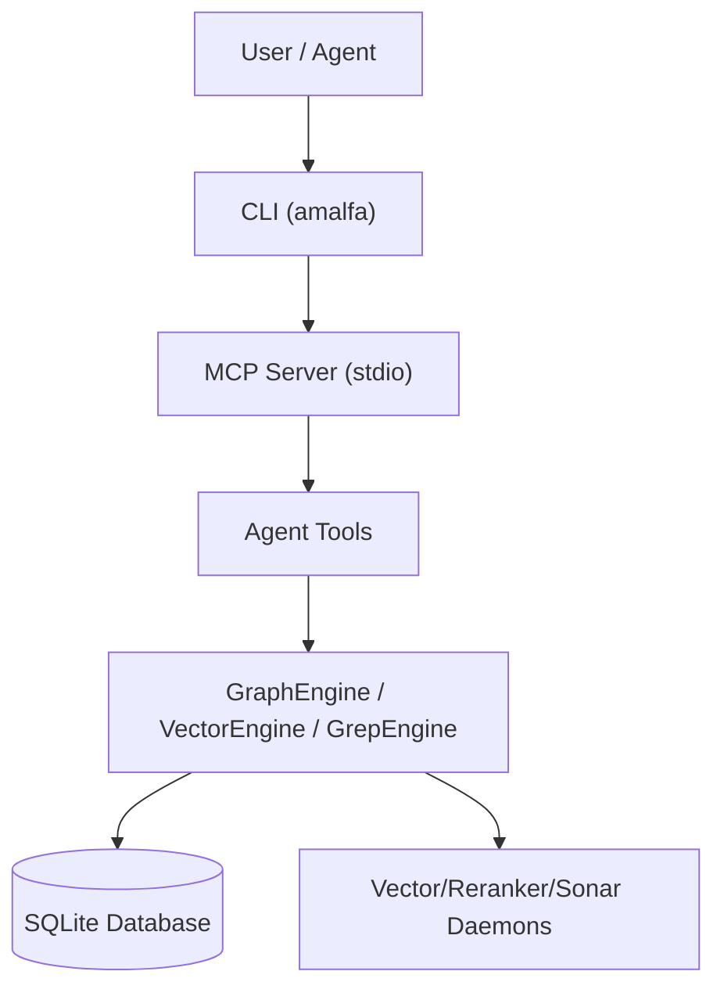
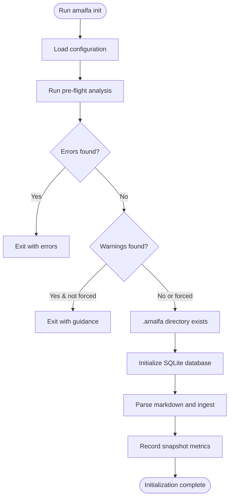
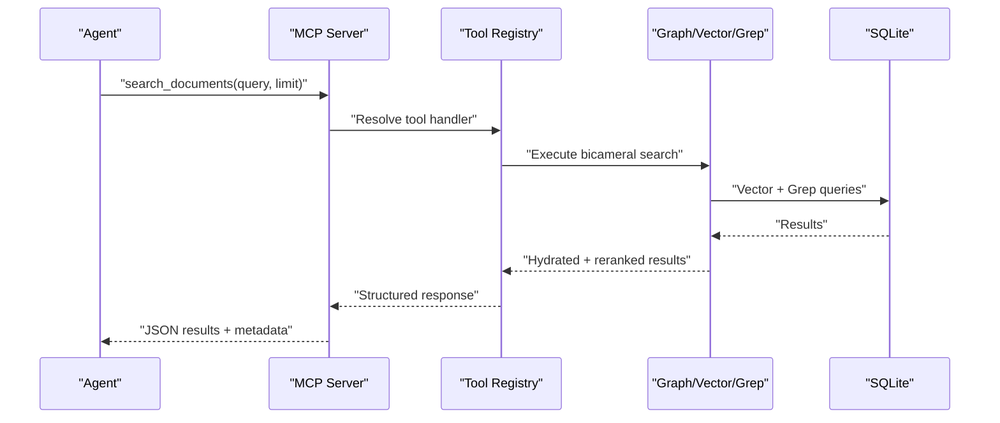
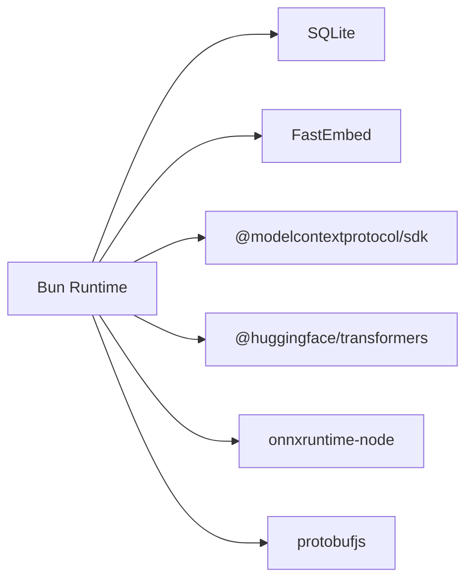

# Getting Started

<cite>
**Referenced Files in This Document**
- [README.md](file://README.md)
- [package.json](file://package.json)
- [src/cli.ts](file://src/cli.ts)
- [src/mcp/index.ts](file://src/mcp/index.ts)
- [.env.example](file://.env.example)
- [docs/API_KEYS.md](file://docs/API_KEYS.md)
- [docs/setup/MCP_SETUP.md](file://docs/setup/MCP_SETUP.md)
- [docs/setup/QUICK_START_MCP.md](file://docs/setup/QUICK_START_MCP.md)
- [docs/MCP-TOOLS.md](file://docs/MCP-TOOLS.md)
- [docs/USER-MANUAL.md](file://docs/USER-MANUAL.md)
- [src/cli/commands/init.ts](file://src/cli/commands/init.ts)
- [amalfa.settings.example.json](file://amalfa.settings.example.json)
</cite>

## Table of Contents
1. [Introduction](#introduction)
2. [Project Structure](#project-structure)
3. [Core Components](#core-components)
4. [Architecture Overview](#architecture-overview)
5. [Detailed Component Analysis](#detailed-component-analysis)
6. [Dependency Analysis](#dependency-analysis)
7. [Performance Considerations](#performance-considerations)
8. [Troubleshooting Guide](#troubleshooting-guide)
9. [Conclusion](#conclusion)
10. [Appendices](#appendices)

## Introduction
Amalfa is an AI knowledge graph engine that transforms your markdown documentation into a searchable, persistent memory layer for agents. It provides:
- Semantic search across your knowledge base
- Graph traversal to explore relationships
- MCP server integration for Claude Desktop and other agents
- Optional enhancement via Sonar (LLM-powered reasoning)
- Local-first architecture with SQLite and FastEmbed

Amalfa’s core value is enabling agents to remember and reuse insights across sessions, reducing repetition and accelerating problem-solving.

## Project Structure
At a high level, Amalfa consists of:
- CLI entrypoint and command routing
- MCP server for agent tool integration
- Ingestion pipeline to parse markdown and build the knowledge graph
- Configuration and environment management
- Optional services (vector daemon, reranker daemon, Sonar agent)

```mermaid
graph TD
    subgraph "CLI"
        CLI["src/cli.ts"]
    end
    subgraph "MCP Server"
        MCP["src/mcp/index.ts"]
    end
    subgraph "Core Engines"
        Graph["GraphEngine"]
        Vector["VectorEngine"]
        Grep["GrepEngine"]
    end
    subgraph "Persistence"
        DB["SQLite Database<br/>.amalfa/resonance.db"]
    end
    CLI --> MCP
    MCP --> Graph
    MCP --> Vector
    MCP --> Grep
    Graph --> DB
    Vector --> DB
    Grep --> DB
```

**Diagram sources**
- [src/cli.ts](file://src/cli.ts#L132-L268)
- [src/mcp/index.ts](file://src/mcp/index.ts#L46-L55)
- [src/mcp/index.ts](file://src/mcp/index.ts#L268-L513)

**Section sources**
- [README.md](file://README.md#L357-L380)
- [src/cli.ts](file://src/cli.ts#L132-L268)
- [src/mcp/index.ts](file://src/mcp/index.ts#L46-L55)

## Core Components
- CLI: Central command router exposing commands for initialization, search, MCP server, and service management.
- MCP Server: Provides agent tools (search, read, explore, list, find-gaps, tags, scratchpad).
- Ingestion: Parses markdown, generates nodes/edges, computes embeddings, and writes to SQLite.
- Configuration: Uses environment variables and JSON settings for providers, sources, and services.

Key CLI commands (examples):
- Initialize database: amalfa init
- Serve MCP: amalfa serve
- Search: amalfa search "<query>"
- Read content: amalfa read <node-id>
- Explore relationships: amalfa explore <node-id>
- List sources: amalfa list-sources
- Discover gaps: amalfa find-gaps
- Inject tags: amalfa inject-tags <path> <tags...>
- Manage services: amalfa watcher|vector|reranker|sonar|ember <action>

**Section sources**
- [README.md](file://README.md#L599-L641)
- [src/cli.ts](file://src/cli.ts#L58-L111)
- [src/cli.ts](file://src/cli.ts#L132-L268)
- [docs/MCP-TOOLS.md](file://docs/MCP-TOOLS.md#L67-L77)

## Architecture Overview
Amalfa’s runtime architecture integrates:
- Bun as the TypeScript runtime
- SQLite for local-first persistence
- FastEmbed for embeddings
- Model Context Protocol (MCP) for agent tooling
- Optional Sonar agent for advanced reasoning and gap detection



**Diagram sources**
- [README.md](file://README.md#L357-L380)
- [src/mcp/index.ts](file://src/mcp/index.ts#L147-L150)
- [src/mcp/index.ts](file://src/mcp/index.ts#L252-L688)

## Detailed Component Analysis

### Installation and Setup
- Bun requirement: Install via Bun only (not npm/yarn/pnpm). The package declares Bun >=1.3.8.
- Global installation: bun install -g amalfa
- From source (development): git clone, bun install, then use bun run scripts or CLI commands.

Common gotchas:
- PATH issues: Ensure ~/.bun/bin is in $PATH.
- Package manager isolation: Bun and npm maintain separate registries; use the same package manager for install/remove.
- trustedDependencies: Native build scripts are whitelisted; trust if needed.

**Section sources**
- [README.md](file://README.md#L381-L406)
- [README.md](file://README.md#L414-L464)
- [package.json](file://package.json#L44-L46)
- [package.json](file://package.json#L96-L99)
- [docs/USER-MANUAL.md](file://docs/USER-MANUAL.md#L24-L55)

### Prerequisites and API Keys
- Environment configuration: Copy .env.example to .env and add API keys for providers.
- Required providers:
  - Gemini: GEMINI_API_KEY
  - OpenRouter: OPENROUTER_API_KEY
  - Mistral: MISTRAL_API_KEY
- Ollama device keys: Managed by Ollama CLI; no .env configuration required.
- Security best practices:
  - Never commit .env
  - Use unique keys per environment
  - Rotate keys regularly
  - Monitor usage and costs

**Section sources**
- [.env.example](file://.env.example#L1-L83)
- [docs/API_KEYS.md](file://docs/API_KEYS.md#L9-L443)

### MCP Server Configuration
Steps:
1. Configure sources in amalfa.settings.json (or amalfa.config.json) and set database path.
2. Initialize the knowledge graph: amalfa init
3. Generate MCP config: amalfa setup-mcp
4. Add the generated JSON to your MCP client (e.g., Claude Desktop).
5. Restart the client and test with a search query.

Notes:
- Absolute paths in MCP configs are machine-specific; regenerate if moving the project.
- Logs for MCP server are written to .amalfa/.

**Section sources**
- [docs/setup/MCP_SETUP.md](file://docs/setup/MCP_SETUP.md#L1-L318)
- [docs/setup/QUICK_START_MCP.md](file://docs/setup/QUICK_START_MCP.md#L1-L169)
- [amalfa.settings.example.json](file://amalfa.settings.example.json#L1-L56)

### Initial Ingestion
- The init command scans configured sources, validates files, and builds the graph.
- Creates .amalfa directory and initializes the SQLite database.
- Records snapshots of nodes, edges, and embeddings for tracking.



**Diagram sources**
- [src/cli/commands/init.ts](file://src/cli/commands/init.ts#L12-L131)

**Section sources**
- [src/cli/commands/init.ts](file://src/cli/commands/init.ts#L12-L131)

### MCP Tools Reference
Core tools available to agents:
- search_documents(query, limit?)
- read_node_content(id)
- explore_links(id, relation?)
- list_directory_structure()
- find_gaps(limit?, threshold?)
- inject_tags(file_path, tags[])
- scratchpad_read(id)
- scratchpad_list()



**Diagram sources**
- [src/mcp/index.ts](file://src/mcp/index.ts#L252-L688)
- [docs/MCP-TOOLS.md](file://docs/MCP-TOOLS.md#L67-L77)

**Section sources**
- [docs/MCP-TOOLS.md](file://docs/MCP-TOOLS.md#L67-L715)
- [src/mcp/index.ts](file://src/mcp/index.ts#L152-L250)
- [src/mcp/index.ts](file://src/mcp/index.ts#L268-L513)

### Quick Start Examples
- Search: amalfa search "oauth patterns" --limit 10
- Read: amalfa read docs/auth-guide.md
- Explore: amalfa explore docs/auth-guide.md --relation references
- List sources: amalfa list-sources
- Find gaps: amalfa find-gaps --limit 5 --threshold 0.7
- Inject tags: amalfa inject-tags docs/auth.md "authentication" "security"
- JSON output: amalfa search "auth" --json | jq '.[0].id'

**Section sources**
- [README.md](file://README.md#L166-L228)

### Security Best Practices
- API keys:
  - Gemini, OpenRouter, Mistral: set via environment variables
  - Ollama device keys: managed by Ollama CLI, not in .env
- Protect .env:
  - Never commit to version control
  - Use different keys per environment
  - Rotate periodically
  - Monitor usage and costs
- Ollama:
  - Sign in once to enable device keys
  - Use local or remote models via localhost:11434

**Section sources**
- [docs/API_KEYS.md](file://docs/API_KEYS.md#L9-L443)
- [.env.example](file://.env.example#L1-L83)

## Dependency Analysis
- Runtime: Bun (TypeScript, stdio MCP transport)
- Database: SQLite with hollow nodes (content on filesystem, metadata in DB)
- Embeddings: FastEmbed (bge-small-en-v1.5)
- MCP SDK: Model Context Protocol
- Optional: Hugging Face Transformers, ONNX runtimes for reranking and sidecars



**Diagram sources**
- [package.json](file://package.json#L79-L95)
- [package.json](file://package.json#L96-L99)

**Section sources**
- [README.md](file://README.md#L357-L380)
- [package.json](file://package.json#L79-L95)

## Performance Considerations
- Search pipeline:
  - Vector search (FastEmbed bi-encoder): fast recall
  - BGE cross-encoder reranking: improves precision
  - Optional Sonar LLM refinement: intent-aware reranking and context extraction
- Recommendations:
  - Use targeted queries for better results
  - Leverage graph traversal to reduce repeated searches
  - Cache awareness: use scratchpad_list and scratchpad_read to reuse prior outputs

[No sources needed since this section provides general guidance]

## Troubleshooting Guide
Common issues and resolutions:
- Command not found after install:
  - Ensure ~/.bun/bin is in PATH and reload shell profile.
- Bun vs npm confusion:
  - Use bun remove -g amalfa to uninstall; npm cannot remove Bun-installed packages.
- MCP server not connecting:
  - Verify Bun path in MCP client config matches system; check logs in .amalfa/.
  - Confirm database exists and is readable.
- No results from search:
  - Ensure ingestion completed; verify node count and embeddings in the database.
- Absolute path errors in MCP config:
  - Regenerate MCP config with amalfa setup-mcp and update client config.

**Section sources**
- [README.md](file://README.md#L443-L464)
- [docs/USER-MANUAL.md](file://docs/USER-MANUAL.md#L234-L281)
- [docs/setup/MCP_SETUP.md](file://docs/setup/MCP_SETUP.md#L206-L258)

## Conclusion
Amalfa delivers persistent, semantic knowledge for agents with a straightforward setup:
- Install via Bun
- Configure API keys and Ollama device keys
- Define sources and initialize the knowledge graph
- Optionally integrate via MCP for agents
- Use CLI or MCP tools for search, reading, and graph exploration

[No sources needed since this section summarizes without analyzing specific files]

## Appendices

### Appendix A: Installation Cheatsheet
- Install: bun install -g amalfa
- Uninstall: bun remove -g amalfa
- Initialize: amalfa init
- Serve: amalfa serve
- Search: amalfa search "<query>" --limit 10
- Read: amalfa read <node-id>
- Explore: amalfa explore <node-id> --relation references
- List sources: amalfa list-sources
- Find gaps: amalfa find-gaps --limit 5 --threshold 0.7
- Inject tags: amalfa inject-tags <path> <tags...>
- Setup MCP: amalfa setup-mcp

**Section sources**
- [README.md](file://README.md#L381-L406)
- [README.md](file://README.md#L599-L641)
- [README.md](file://README.md#L166-L228)