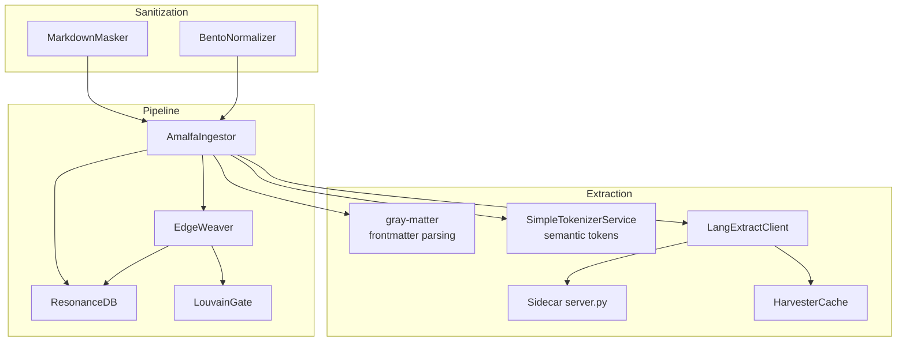
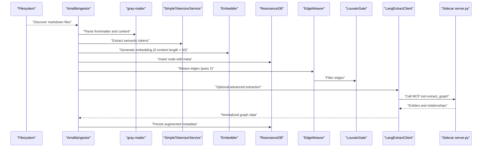
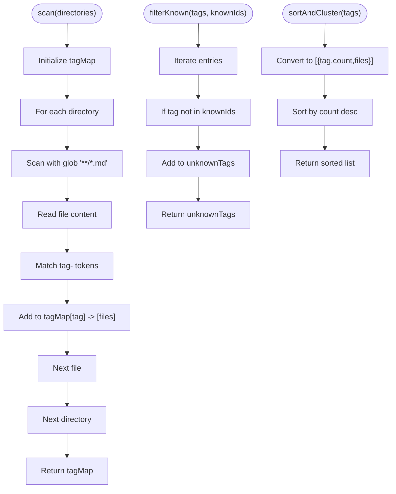
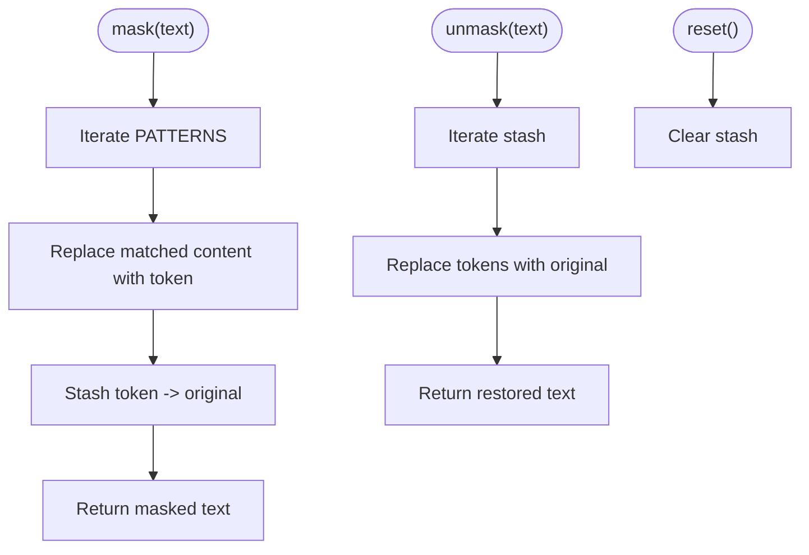
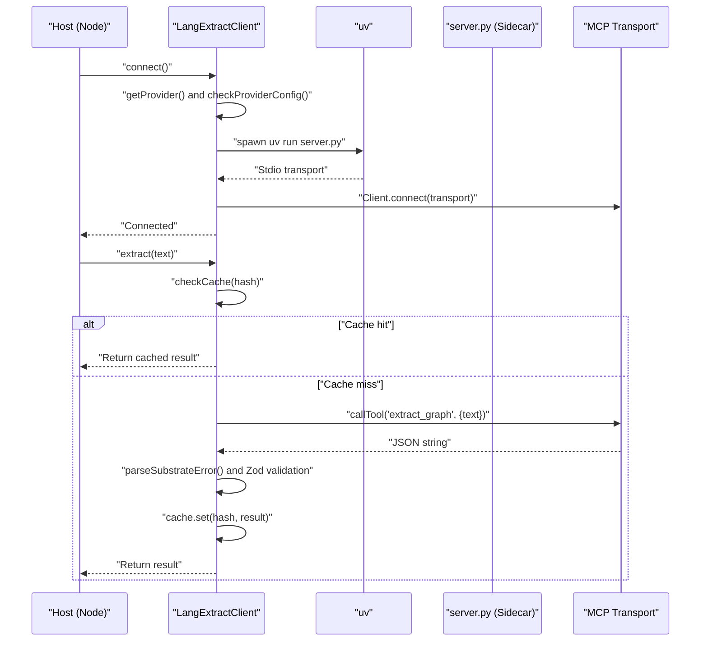
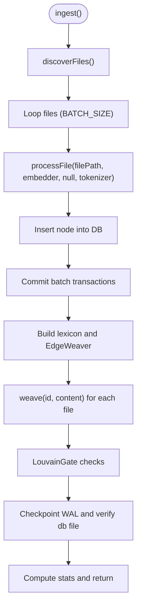
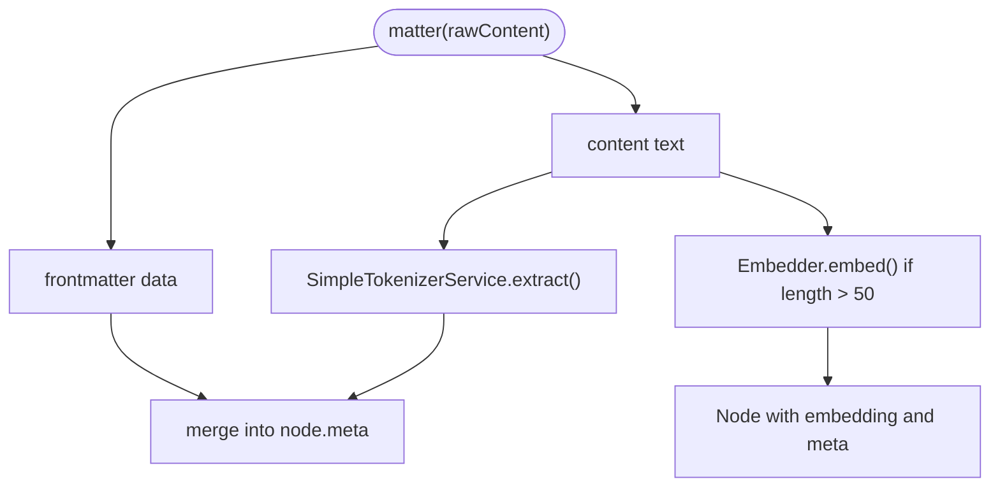
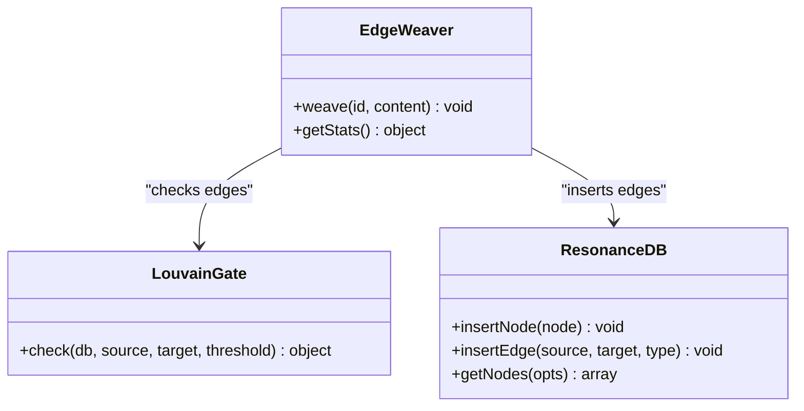
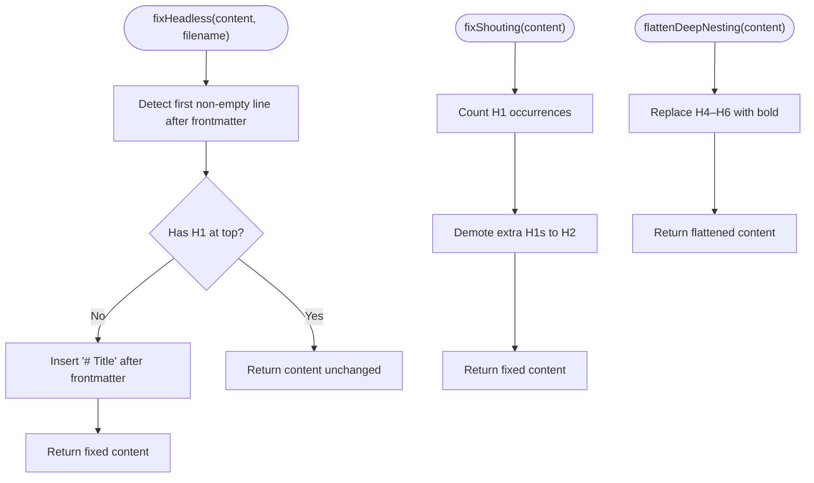
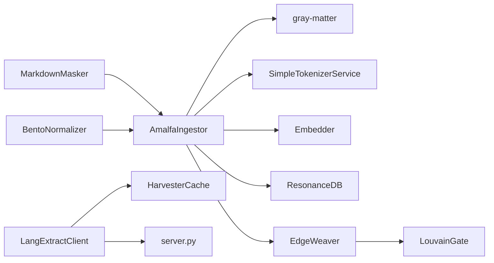

# Content Harvesting and Processing

<cite>
**Referenced Files in This Document**
- [Harvester.ts](file://src/core/Harvester.ts)
- [MarkdownMasker.ts](file://src/core/MarkdownMasker.ts)
- [LangExtractClient.ts](file://src/services/LangExtractClient.ts)
- [server.py](file://src/sidecars/lang-extract/server.py)
- [HarvesterCache.ts](file://src/core/HarvesterCache.ts)
- [AmalfaIngestor.ts](file://src/pipeline/AmalfaIngestor.ts)
- [db.ts](file://src/resonance/db.ts)
- [schema.ts](file://src/resonance/drizzle/schema.ts)
- [EdgeWeaver.ts](file://src/core/EdgeWeaver.ts)
- [LouvainGate.ts](file://src/core/LouvainGate.ts)
- [simpleTokenizer.ts](file://src/resonance/services/simpleTokenizer.ts)
- [BentoNormalizer.ts](file://src/core/BentoNormalizer.ts)
- [TagInjector.ts](file://src/utils/TagInjector.ts)
- [markdown-hygiene-playbook.md](file://playbooks/markdown-hygiene-playbook.md)
- [ingest_test.md](file://tests/fixtures/ingest_test.md)
- [tagged_test.md](file://tests/fixtures/tagged_test.md)
</cite>

## Table of Contents
1. [Introduction](#introduction)
2. [Project Structure](#project-structure)
3. [Core Components](#core-components)
4. [Architecture Overview](#architecture-overview)
5. [Detailed Component Analysis](#detailed-component-analysis)
6. [Dependency Analysis](#dependency-analysis)
7. [Performance Considerations](#performance-considerations)
8. [Troubleshooting Guide](#troubleshooting-guide)
9. [Conclusion](#conclusion)
10. [Appendices](#appendices)

## Introduction
This document explains Amalfa’s content harvesting and processing pipeline, focusing on how raw markdown is transformed into structured, enriched knowledge ready for graph insertion. It covers:
- Extraction of structured content from markdown files, including frontmatter parsing with gray-matter, semantic token extraction, and metadata enrichment
- Content sanitization and formatting via the MarkdownMasker
- Advanced entity extraction and relationships discovery via the LangExtractClient and its Python sidecar
- The two-pass ingestion pipeline that builds nodes first, then weaves edges
- Examples of custom extraction rules, handling of different markdown formats, and troubleshooting parsing issues

## Project Structure
The content harvesting and processing capabilities span several modules:
- Core ingestion and orchestration: AmalfaIngestor
- Content parsing and normalization: gray-matter frontmatter parsing, BentoNormalizer heuristics
- Semantic tokenization: SimpleTokenizerService
- Advanced extraction: LangExtractClient and sidecar server.py
- Graph insertion and edge weaving: ResonanceDB schema, EdgeWeaver, LouvainGate
- Content sanitization: MarkdownMasker
- Utilities: TagInjector, BentoNormalizer helpers

**Diagram sources**
- [AmalfaIngestor.ts](file://src/pipeline/AmalfaIngestor.ts#L1-L441)
- [db.ts](file://src/resonance/db.ts#L105-L188)
- [schema.ts](file://src/resonance/drizzle/schema.ts#L1-L51)
- [EdgeWeaver.ts](file://src/core/EdgeWeaver.ts#L162-L193)
- [LouvainGate.ts](file://src/core/LouvainGate.ts#L1-L2132)
- [LangExtractClient.ts](file://src/services/LangExtractClient.ts#L1-L354)
- [server.py](file://src/sidecars/lang-extract/server.py#L1-L226)
- [HarvesterCache.ts](file://src/core/HarvesterCache.ts#L1-L69)
- [MarkdownMasker.ts](file://src/core/MarkdownMasker.ts#L1-L50)
- [BentoNormalizer.ts](file://src/core/BentoNormalizer.ts#L1-L85)

**Section sources**
- [AmalfaIngestor.ts](file://src/pipeline/AmalfaIngestor.ts#L1-L441)
- [LangExtractClient.ts](file://src/services/LangExtractClient.ts#L1-L354)
- [server.py](file://src/sidecars/lang-extract/server.py#L1-L226)
- [HarvesterCache.ts](file://src/core/HarvesterCache.ts#L1-L69)
- [MarkdownMasker.ts](file://src/core/MarkdownMasker.ts#L1-L50)
- [BentoNormalizer.ts](file://src/core/BentoNormalizer.ts#L1-L85)
- [db.ts](file://src/resonance/db.ts#L105-L188)
- [schema.ts](file://src/resonance/drizzle/schema.ts#L1-L51)
- [EdgeWeaver.ts](file://src/core/EdgeWeaver.ts#L162-L193)

## Core Components
- Harvester: Scans directories for tag- tokens, filters known tags, and sorts by frequency for prioritization.
- MarkdownMasker: Temporarily masks “No-Fly Zones” (code blocks, inline code, tables) to preserve atomicity during processing.
- LangExtractClient: Connects to a Model Context Protocol (MCP) sidecar, extracts entities and relationships, validates and caches results.
- AmalfaIngestor: Two-pass ingestion pipeline that parses frontmatter, generates embeddings, extracts semantic tokens, inserts nodes, then weaves edges.
- ResonanceDB and schema: Stores nodes and edges with typed metadata and indices for efficient traversal.
- EdgeWeaver and LouvainGate: Creates edges between nodes and guards against super-node collapse.
- SimpleTokenizerService: Lightweight semantic token extraction using vocabulary matching.
- BentoNormalizer: Applies markdown hygiene heuristics to enforce consistent structure.
- TagInjector: Adds semantic tags to markdown files for downstream harvesting.

**Section sources**
- [Harvester.ts](file://src/core/Harvester.ts#L1-L74)
- [MarkdownMasker.ts](file://src/core/MarkdownMasker.ts#L1-L50)
- [LangExtractClient.ts](file://src/services/LangExtractClient.ts#L1-L354)
- [AmalfaIngestor.ts](file://src/pipeline/AmalfaIngestor.ts#L1-L441)
- [db.ts](file://src/resonance/db.ts#L105-L188)
- [schema.ts](file://src/resonance/drizzle/schema.ts#L1-L51)
- [EdgeWeaver.ts](file://src/core/EdgeWeaver.ts#L162-L193)
- [LouvainGate.ts](file://src/core/LouvainGate.ts#L1-L2132)
- [simpleTokenizer.ts](file://src/resonance/services/simpleTokenizer.ts#L1-L54)
- [BentoNormalizer.ts](file://src/core/BentoNormalizer.ts#L1-L85)
- [TagInjector.ts](file://src/utils/TagInjector.ts#L1-L44)

## Architecture Overview
The ingestion pipeline transforms markdown into a knowledge graph:
1. Discovery: Find markdown files across configured sources.
2. Parsing: Use gray-matter to separate frontmatter from content.
3. Normalization: Apply BentoNormalizer heuristics and optional MarkdownMasker masking.
4. Enrichment: Generate embeddings and extract semantic tokens.
5. Insertion: Persist nodes to ResonanceDB with metadata.
6. Edge Weaving: Build edges between nodes using lexical and semantic signals, filtered by LouvainGate.
7. Advanced Extraction: Optionally call LangExtractClient to augment entities and relationships, caching results.

**Diagram sources**
- [AmalfaIngestor.ts](file://src/pipeline/AmalfaIngestor.ts#L139-L309)
- [LangExtractClient.ts](file://src/services/LangExtractClient.ts#L248-L343)
- [server.py](file://src/sidecars/lang-extract/server.py#L198-L222)
- [db.ts](file://src/resonance/db.ts#L105-L188)
- [EdgeWeaver.ts](file://src/core/EdgeWeaver.ts#L162-L193)
- [LouvainGate.ts](file://src/core/LouvainGate.ts#L1-L2132)

## Detailed Component Analysis

### Harvester
Harvester scans directories recursively for tag- tokens, filters known tags against a lexicon, and sorts by frequency for prioritization. It supports:
- Directory scanning with glob patterns
- Tag extraction from content
- Known tag filtering using a set of known IDs
- Sorting by occurrence count

**Diagram sources**
- [Harvester.ts](file://src/core/Harvester.ts#L16-L72)

**Section sources**
- [Harvester.ts](file://src/core/Harvester.ts#L1-L74)

### MarkdownMasker
MarkdownMasker temporarily replaces “No-Fly Zones” (code blocks, inline code, tables) with inert tokens, stashing originals for restoration. It ensures atomicity of sensitive content during processing and supports reset to free memory.

**Diagram sources**
- [MarkdownMasker.ts](file://src/core/MarkdownMasker.ts#L16-L48)

**Section sources**
- [MarkdownMasker.ts](file://src/core/MarkdownMasker.ts#L1-L50)

### LangExtractClient and Sidecar
LangExtractClient manages connectivity to a Python MCP sidecar that performs knowledge graph extraction. It:
- Validates provider configuration precedence (env > settings > default)
- Spawns the sidecar via uv and connects via stdio transport
- Calls the extract_graph tool with sanitized text
- Parses and validates JSON responses, normalizing errors
- Caches results using HarvesterCache keyed by content hash

**Diagram sources**
- [LangExtractClient.ts](file://src/services/LangExtractClient.ts#L188-L343)
- [server.py](file://src/sidecars/lang-extract/server.py#L198-L222)
- [HarvesterCache.ts](file://src/core/HarvesterCache.ts#L20-L67)

**Section sources**
- [LangExtractClient.ts](file://src/services/LangExtractClient.ts#L1-L354)
- [server.py](file://src/sidecars/lang-extract/server.py#L1-L226)
- [HarvesterCache.ts](file://src/core/HarvesterCache.ts#L1-L69)

### AmalfaIngestor: Two-Pass Ingestion Pipeline
AmalfaIngestor orchestrates the ingestion pipeline:
- Discovers files across configured sources
- Pass 1: Processes files to create nodes (no edges)
- Pass 2: Builds edges using a lexicon and applies LouvainGate filtering
- Inserts nodes with embeddings and semantic tokens
- Persists to ResonanceDB with typed schema and indices

**Diagram sources**
- [AmalfaIngestor.ts](file://src/pipeline/AmalfaIngestor.ts#L139-L309)
- [db.ts](file://src/resonance/db.ts#L105-L188)
- [schema.ts](file://src/resonance/drizzle/schema.ts#L1-L51)
- [EdgeWeaver.ts](file://src/core/EdgeWeaver.ts#L162-L193)

**Section sources**
- [AmalfaIngestor.ts](file://src/pipeline/AmalfaIngestor.ts#L1-L441)
- [db.ts](file://src/resonance/db.ts#L105-L188)
- [schema.ts](file://src/resonance/drizzle/schema.ts#L1-L51)
- [EdgeWeaver.ts](file://src/core/EdgeWeaver.ts#L162-L193)

### Semantic Tokenization and Metadata Enrichment
- gray-matter separates frontmatter from content for structured metadata extraction.
- SimpleTokenizerService extracts semantic tags (people, places, organizations, topics, money) using vocabulary matching.
- Embeddings are generated when content length exceeds a threshold.
- Node metadata includes frontmatter, source path, and semantic tokens.

**Diagram sources**
- [AmalfaIngestor.ts](file://src/pipeline/AmalfaIngestor.ts#L375-L439)
- [simpleTokenizer.ts](file://src/resonance/services/simpleTokenizer.ts#L36-L54)

**Section sources**
- [AmalfaIngestor.ts](file://src/pipeline/AmalfaIngestor.ts#L375-L439)
- [simpleTokenizer.ts](file://src/resonance/services/simpleTokenizer.ts#L1-L54)

### Edge Weaving and Graph Integrity
- EdgeWeaver constructs edges between nodes using a lexicon built from existing nodes.
- LouvainGate filters edges to prevent super-node collapse and maintain graph stability.
- ResonanceDB schema defines nodes and edges with typed metadata and indices.

**Diagram sources**
- [EdgeWeaver.ts](file://src/core/EdgeWeaver.ts#L162-L193)
- [LouvainGate.ts](file://src/core/LouvainGate.ts#L1-L2132)
- [db.ts](file://src/resonance/db.ts#L105-L188)

**Section sources**
- [EdgeWeaver.ts](file://src/core/EdgeWeaver.ts#L162-L193)
- [LouvainGate.ts](file://src/core/LouvainGate.ts#L1-L2132)
- [db.ts](file://src/resonance/db.ts#L105-L188)
- [schema.ts](file://src/resonance/drizzle/schema.ts#L1-L51)

### Content Sanitization and Formatting
- BentoNormalizer applies heuristics to enforce consistent markdown structure:
  - Headless fix: Insert a top-level title if missing
  - Shouting fix: Demote repeated H1s to H2
  - Deep nesting flattening: Treat H4–H6 as bold content
- TagInjector adds semantic tags to markdown files, either appending to frontmatter or inserting a tag block after frontmatter.

**Diagram sources**
- [BentoNormalizer.ts](file://src/core/BentoNormalizer.ts#L6-L85)
- [TagInjector.ts](file://src/utils/TagInjector.ts#L11-L44)

**Section sources**
- [BentoNormalizer.ts](file://src/core/BentoNormalizer.ts#L1-L85)
- [TagInjector.ts](file://src/utils/TagInjector.ts#L1-L44)

## Dependency Analysis
Key dependencies and relationships:
- AmalfaIngestor depends on gray-matter for frontmatter parsing, SimpleTokenizerService for semantic tokens, Embedder for embeddings, and ResonanceDB for persistence.
- LangExtractClient depends on HarvesterCache and the MCP sidecar server.py.
- EdgeWeaver depends on ResonanceDB and LouvainGate to maintain graph integrity.
- MarkdownMasker and BentoNormalizer support ingestion hygiene and atomicity.

**Diagram sources**
- [AmalfaIngestor.ts](file://src/pipeline/AmalfaIngestor.ts#L1-L441)
- [LangExtractClient.ts](file://src/services/LangExtractClient.ts#L1-L354)
- [HarvesterCache.ts](file://src/core/HarvesterCache.ts#L1-L69)
- [server.py](file://src/sidecars/lang-extract/server.py#L1-L226)
- [db.ts](file://src/resonance/db.ts#L105-L188)
- [EdgeWeaver.ts](file://src/core/EdgeWeaver.ts#L162-L193)
- [LouvainGate.ts](file://src/core/LouvainGate.ts#L1-L2132)
- [MarkdownMasker.ts](file://src/core/MarkdownMasker.ts#L1-L50)
- [BentoNormalizer.ts](file://src/core/BentoNormalizer.ts#L1-L85)

**Section sources**
- [AmalfaIngestor.ts](file://src/pipeline/AmalfaIngestor.ts#L1-L441)
- [LangExtractClient.ts](file://src/services/LangExtractClient.ts#L1-L354)
- [HarvesterCache.ts](file://src/core/HarvesterCache.ts#L1-L69)
- [server.py](file://src/sidecars/lang-extract/server.py#L1-L226)
- [db.ts](file://src/resonance/db.ts#L105-L188)
- [EdgeWeaver.ts](file://src/core/EdgeWeaver.ts#L162-L193)
- [LouvainGate.ts](file://src/core/LouvainGate.ts#L1-L2132)
- [MarkdownMasker.ts](file://src/core/MarkdownMasker.ts#L1-L50)
- [BentoNormalizer.ts](file://src/core/BentoNormalizer.ts#L1-L85)

## Performance Considerations
- Batch transactions: AmalfaIngestor uses a reduced batch size to minimize lock contention and prevent SQLITE_BUSY errors when daemons or MCP server are active.
- WAL checkpoint: After ingestion, a forced checkpoint ensures durability and verifies the database file integrity.
- Caching: HarvesterCache avoids redundant sidecar calls by hashing content and storing results on disk.
- Tokenization: SimpleTokenizerService avoids heavy NLP libraries, relying on vocabulary matching for speed.
- Edge filtering: LouvainGate prevents excessive edge density that could destabilize communities.

[No sources needed since this section provides general guidance]

## Troubleshooting Guide
Common issues and resolutions:
- Gray-matter frontmatter parsing failures
  - Symptoms: Missing or malformed frontmatter causing parsing errors.
  - Resolution: Ensure YAML frontmatter is properly delimited and valid; BentoNormalizer can help enforce structure.
  - Section sources
    - [AmalfaIngestor.ts](file://src/pipeline/AmalfaIngestor.ts#L384-L386)
    - [BentoNormalizer.ts](file://src/core/BentoNormalizer.ts#L6-L55)

- LangExtractClient provider misconfiguration
  - Symptoms: Missing API keys or invalid provider selection.
  - Resolution: Set environment variables (e.g., OPENROUTER_API_KEY, GEMINI_API_KEY) or configure provider in settings; LangExtractClient validates provider config and surfaces actionable errors.
  - Section sources
    - [LangExtractClient.ts](file://src/services/LangExtractClient.ts#L82-L104)
    - [LangExtractClient.ts](file://src/services/LangExtractClient.ts#L188-L246)

- Sidecar connectivity issues
  - Symptoms: Sidecar not detected or extraction fails.
  - Resolution: Verify uv installation, sidecar path, and server.py presence; ensure provider environment variables are passed correctly.
  - Section sources
    - [LangExtractClient.ts](file://src/services/LangExtractClient.ts#L49-L57)
    - [LangExtractClient.ts](file://src/services/LangExtractClient.ts#L222-L238)

- MarkdownMasker masking artifacts
  - Symptoms: Unexpected token retention or restoration issues.
  - Resolution: Ensure reset() is called after processing each file to free memory; confirm stash is cleared.
  - Section sources
    - [MarkdownMasker.ts](file://src/core/MarkdownMasker.ts#L46-L48)

- Edge weaving rejects edges
  - Symptoms: Fewer edges than expected.
  - Resolution: Review LouvainGate statistics and thresholds; adjust if necessary to balance graph density and stability.
  - Section sources
    - [EdgeWeaver.ts](file://src/core/EdgeWeaver.ts#L168-L181)

- Database integrity checks
  - Symptoms: Missing or empty database file after checkpoint.
  - Resolution: The pipeline performs a pinch check to verify file existence and non-zero size after checkpoint.
  - Section sources
    - [AmalfaIngestor.ts](file://src/pipeline/AmalfaIngestor.ts#L255-L269)

- Markdown hygiene and sanitization
  - Use the markdown hygiene playbook to enforce consistent formatting and emergency recovery procedures.
  - Section sources
    - [markdown-hygiene-playbook.md](file://playbooks/markdown-hygiene-playbook.md#L1-L26)

**Section sources**
- [AmalfaIngestor.ts](file://src/pipeline/AmalfaIngestor.ts#L255-L269)
- [LangExtractClient.ts](file://src/services/LangExtractClient.ts#L49-L57)
- [LangExtractClient.ts](file://src/services/LangExtractClient.ts#L188-L246)
- [MarkdownMasker.ts](file://src/core/MarkdownMasker.ts#L46-L48)
- [EdgeWeaver.ts](file://src/core/EdgeWeaver.ts#L168-L181)
- [markdown-hygiene-playbook.md](file://playbooks/markdown-hygiene-playbook.md#L1-L26)

## Conclusion
Amalfa’s content harvesting and processing pipeline integrates robust parsing, sanitization, enrichment, and graph construction. By combining gray-matter frontmatter parsing, lightweight semantic tokenization, optional advanced extraction via a MCP sidecar, and careful edge weaving with integrity checks, the system reliably transforms markdown into a structured knowledge graph suitable for downstream analytics and retrieval.

[No sources needed since this section summarizes without analyzing specific files]

## Appendices

### Example: Custom Extraction Rules and Formats
- Tag-based harvesting: Use tag- tokens to identify candidate documents for further processing.
  - Section sources
    - [Harvester.ts](file://src/core/Harvester.ts#L16-L36)
    - [ingest_test.md](file://tests/fixtures/ingest_test.md#L7-L12)

- Markdown hygiene: Apply BentoNormalizer heuristics to enforce consistent structure and prevent parsing ambiguity.
  - Section sources
    - [BentoNormalizer.ts](file://src/core/BentoNormalizer.ts#L6-L85)

- Tag injection: Add semantic tags to markdown files for downstream harvesting.
  - Section sources
    - [TagInjector.ts](file://src/utils/TagInjector.ts#L11-L44)

- Sanitization testing: Validate masking behavior with tagged_test.md to ensure code blocks and tables remain atomic.
  - Section sources
    - [tagged_test.md](file://tests/fixtures/tagged_test.md#L20-L39)