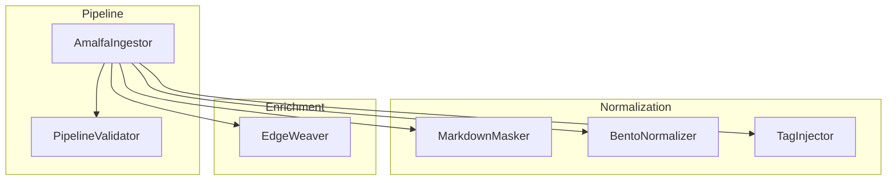
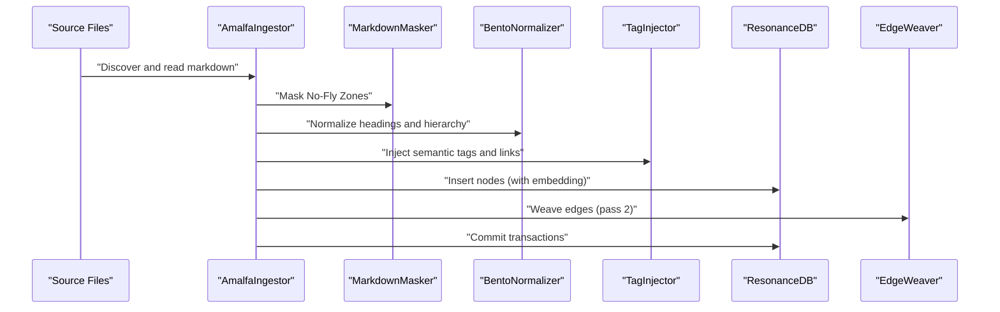
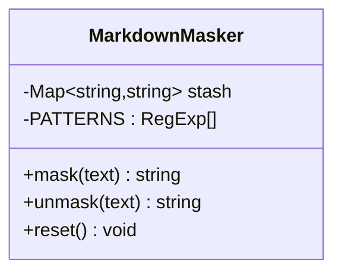
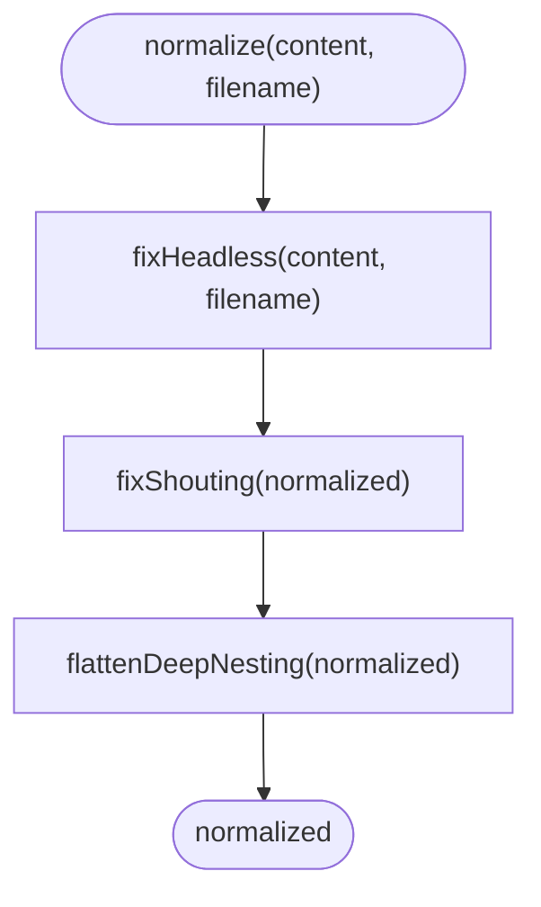
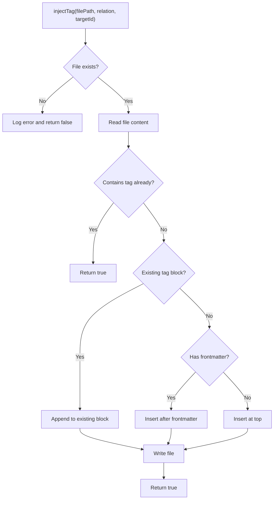
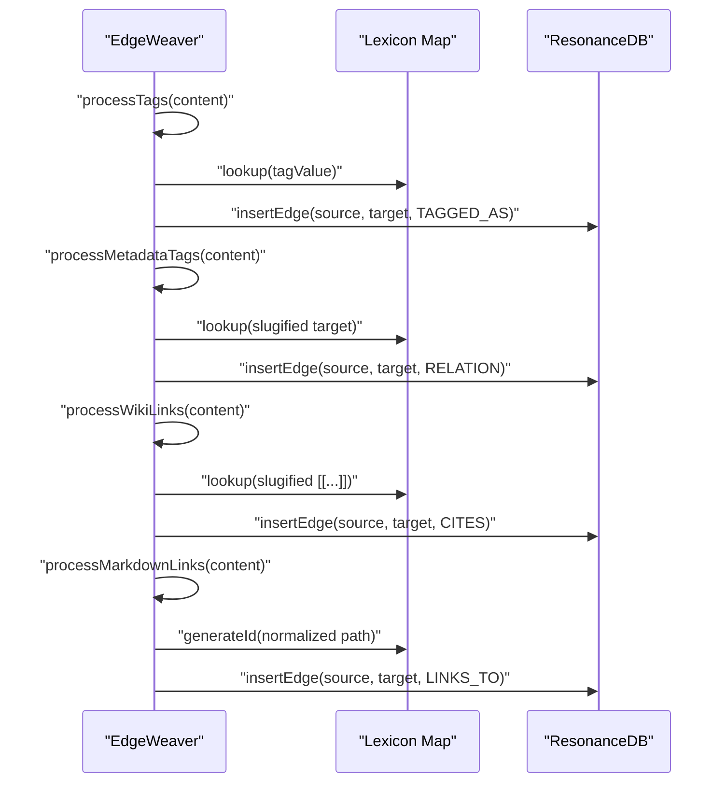
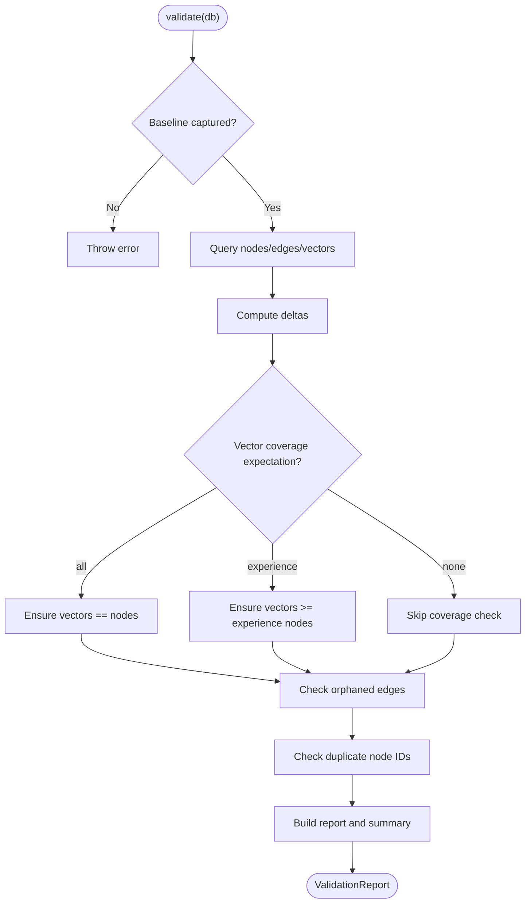
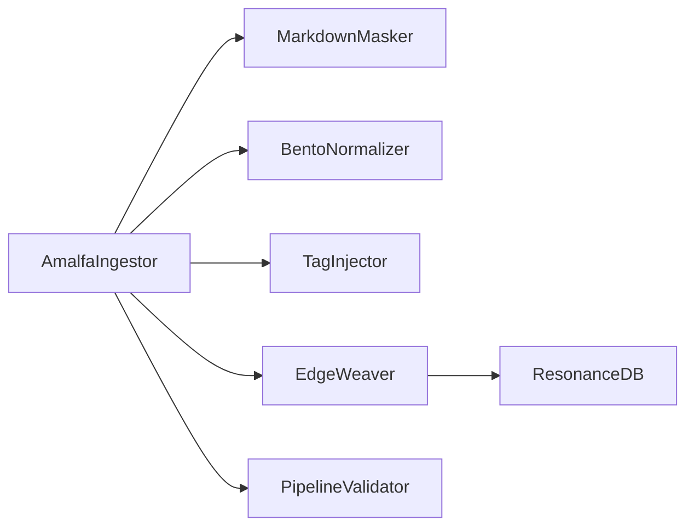

# Content Normalization and Enrichment

<cite>
**Referenced Files in This Document**
- [MarkdownMasker.ts](file://src/core/MarkdownMasker.ts)
- [BentoNormalizer.ts](file://src/core/BentoNormalizer.ts)
- [TagInjector.ts](file://src/utils/TagInjector.ts)
- [validator.ts](file://src/utils/validator.ts)
- [AmalfaIngestor.ts](file://src/pipeline/AmalfaIngestor.ts)
- [EdgeWeaver.ts](file://src/core/EdgeWeaver.ts)
- [bento_normalizer.test.ts](file://tests/bento_normalizer.test.ts)
- [tagged_test.md](file://tests/fixtures/tagged_test.md)
- [safety_test.md](file://tests/fixtures/safety_test.md)
- [remeda-jsonl-streamer.md](file://playbooks/remeda-jsonl-streamer.md)
- [database-connection-hygiene.md](file://playbooks/database-connection-hygiene.md)
</cite>

## Table of Contents
1. [Introduction](#introduction)
2. [Project Structure](#project-structure)
3. [Core Components](#core-components)
4. [Architecture Overview](#architecture-overview)
5. [Detailed Component Analysis](#detailed-component-analysis)
6. [Dependency Analysis](#dependency-analysis)
7. [Performance Considerations](#performance-considerations)
8. [Troubleshooting Guide](#troubleshooting-guide)
9. [Conclusion](#conclusion)
10. [Appendices](#appendices)

## Introduction
This document explains Amalfa’s content normalization and enrichment pipeline with a focus on:
- MarkdownMasker: sanitization and formatting of extracted content by masking “No-Fly Zones” (code blocks, inline code, and basic tables).
- BentoNormalizer: structural normalization for optimal graph insertion via heuristic fixes for headings and hierarchy.
- TagInjector: semantic tagging and metadata injection into markdown documents.
- Validation and quality assurance: database-level checks for integrity, duplicates, and vector coverage.
- Workflows, custom rules, edge-case handling, and performance optimization for batch processing and memory management.

## Project Structure
The normalization and enrichment logic spans core utilities, pipeline orchestration, and validation utilities:
- Core normalization utilities: MarkdownMasker, BentoNormalizer, TagInjector
- Graph enrichment: EdgeWeaver (semantic linking) integrated into ingestion
- Validation: PipelineValidator (database integrity checks)
- Ingestion pipeline: AmalfaIngestor orchestrates discovery, normalization, embedding, and edge weaving

**Diagram sources**
- [AmalfaIngestor.ts](file://src/pipeline/AmalfaIngestor.ts#L32-L441)
- [MarkdownMasker.ts](file://src/core/MarkdownMasker.ts#L3-L49)
- [BentoNormalizer.ts](file://src/core/BentoNormalizer.ts#L100-L114)
- [TagInjector.ts](file://src/utils/TagInjector.ts#L11-L85)
- [EdgeWeaver.ts](file://src/core/EdgeWeaver.ts#L54-L59)
- [validator.ts](file://src/utils/validator.ts#L32-L265)

**Section sources**
- [AmalfaIngestor.ts](file://src/pipeline/AmalfaIngestor.ts#L32-L441)
- [MarkdownMasker.ts](file://src/core/MarkdownMasker.ts#L3-L49)
- [BentoNormalizer.ts](file://src/core/BentoNormalizer.ts#L100-L114)
- [TagInjector.ts](file://src/utils/TagInjector.ts#L11-L85)
- [EdgeWeaver.ts](file://src/core/EdgeWeaver.ts#L54-L59)
- [validator.ts](file://src/utils/validator.ts#L32-L265)

## Core Components
- MarkdownMasker: Masks fenced code blocks, inline code, and basic GFM tables to preserve atomicity during downstream processing. Uses a token stash to restore content deterministically.
- BentoNormalizer: Applies three heuristics to normalize document structure:
  - Heuristic A (“Headless”): Adds a top-level title derived from filename if missing.
  - Heuristic B (“Shouting”): Demotes repeated H1 headings to H2.
  - Heuristic C (“Deep Nesting”): Flattens H4–H6 to bold emphasis for graph-friendly hierarchy.
- TagInjector: Injects semantic tags into markdown frontmatter or a dedicated tag block, and appends WikiLinks at the end of documents.
- PipelineValidator: Validates database state against baselines and expectations, reporting errors/warnings for orphaned edges, duplicates, and vector coverage.

**Section sources**
- [MarkdownMasker.ts](file://src/core/MarkdownMasker.ts#L3-L49)
- [BentoNormalizer.ts](file://src/core/BentoNormalizer.ts#L6-L114)
- [TagInjector.ts](file://src/utils/TagInjector.ts#L11-L85)
- [validator.ts](file://src/utils/validator.ts#L32-L265)

## Architecture Overview
The ingestion pipeline integrates normalization and enrichment:

**Diagram sources**
- [AmalfaIngestor.ts](file://src/pipeline/AmalfaIngestor.ts#L186-L253)
- [MarkdownMasker.ts](file://src/core/MarkdownMasker.ts#L16-L28)
- [BentoNormalizer.ts](file://src/core/BentoNormalizer.ts#L100-L106)
- [TagInjector.ts](file://src/utils/TagInjector.ts#L11-L85)
- [EdgeWeaver.ts](file://src/core/EdgeWeaver.ts#L54-L59)

## Detailed Component Analysis

### MarkdownMasker
Purpose:
- Sanitize content by masking code blocks, inline code, and basic tables to maintain atomicity during processing.
- Preserve original content via a token stash and deterministic restoration.

Key behaviors:
- Masking replaces matched regions with unique tokens and stores originals in an in-memory stash.
- Unmasking restores content by replacing tokens with stored values.
- Reset clears the stash to free memory after processing.

**Diagram sources**
- [MarkdownMasker.ts](file://src/core/MarkdownMasker.ts#L3-L49)

**Section sources**
- [MarkdownMasker.ts](file://src/core/MarkdownMasker.ts#L3-L49)

### BentoNormalizer
Purpose:
- Normalize markdown structure to ensure consistent graph insertion and readability.

Heuristics:
- Heuristic A (“Headless”): Detects content starting without H1 and inserts a title derived from filename after frontmatter or at top.
- Heuristic B (“Shouting”): Converts repeated H1 headings to H2 to avoid dominance.
- Heuristic C (“Deep Nesting”): Flattens H4–H6 to bold emphasis for simplified hierarchy.

**Diagram sources**
- [BentoNormalizer.ts](file://src/core/BentoNormalizer.ts#L100-L114)

**Section sources**
- [BentoNormalizer.ts](file://src/core/BentoNormalizer.ts#L6-L114)
- [bento_normalizer.test.ts](file://tests/bento_normalizer.test.ts#L4-L40)

### TagInjector
Purpose:
- Inject semantic tags and metadata into markdown documents for downstream enrichment.

Capabilities:
- Inject tag relations into a dedicated tag block after frontmatter or at top.
- Avoid duplicates by checking existing tag strings.
- Append WikiLinks at the end of documents with optional labels.

**Diagram sources**
- [TagInjector.ts](file://src/utils/TagInjector.ts#L11-L85)

**Section sources**
- [TagInjector.ts](file://src/utils/TagInjector.ts#L11-L85)

### EdgeWeaver (Graph Enrichment)
Purpose:
- Enrich normalized content by weaving semantic edges based on explicit tags, metadata blocks, WikiLinks, and markdown links.

Strict-mode processing:
- Explicit tags: [tag: Concept] mapped to concept IDs.
- Metadata tags: <!-- tags: [RELATION: Target] --> filtered to structural relations.
- WikiLinks: [[Target]] resolved via slugified lexicon or path-aware IDs.
- Markdown links: [Text](file.md) mapped to internal IDs, excluding external URLs.

**Diagram sources**
- [EdgeWeaver.ts](file://src/core/EdgeWeaver.ts#L54-L166)

**Section sources**
- [EdgeWeaver.ts](file://src/core/EdgeWeaver.ts#L54-L166)

### PipelineValidator (Quality Assurance)
Purpose:
- Validate database state against a captured baseline and expectations.

Checks:
- Vector coverage: all nodes covered, experience nodes covered, or none required.
- Orphaned edges: edges pointing to non-existent nodes.
- Duplicate node IDs: presence of duplicates.
- Summary and console reporting.

**Diagram sources**
- [validator.ts](file://src/utils/validator.ts#L91-L203)

**Section sources**
- [validator.ts](file://src/utils/validator.ts#L32-L265)

## Dependency Analysis
- AmalfaIngestor orchestrates normalization and enrichment, invoking MarkdownMasker, BentoNormalizer, TagInjector, and EdgeWeaver.
- EdgeWeaver depends on a lexicon built from existing nodes and uses ResonanceDB for safe edge insertion.
- PipelineValidator operates independently on the database to enforce quality gates.

**Diagram sources**
- [AmalfaIngestor.ts](file://src/pipeline/AmalfaIngestor.ts#L32-L441)
- [EdgeWeaver.ts](file://src/core/EdgeWeaver.ts#L5-L45)

**Section sources**
- [AmalfaIngestor.ts](file://src/pipeline/AmalfaIngestor.ts#L32-L441)
- [EdgeWeaver.ts](file://src/core/EdgeWeaver.ts#L5-L45)

## Performance Considerations
- Batch processing and transaction hygiene:
  - Ingestion uses small batches to keep transaction durations under SQLite busy_timeout thresholds, enabling safe concurrent operation with daemons.
  - Batch size guidelines balance throughput and safety; default is 10 for production concurrency safety.
- Memory management:
  - MarkdownMasker’s stash is cleared after processing to free memory.
  - JSONL streaming patterns reduce peak memory usage for large datasets.
- WAL checkpointing:
  - Forced checkpoints ensure durability and detect physical corruption post-commit.

Practical tips:
- Keep batch sizes aligned with daemon activity; increase cautiously for single-user initialization.
- Use streaming JSONL converters to avoid loading large payloads into memory.
- Reset masker stashes per file and close database connections promptly.

**Section sources**
- [AmalfaIngestor.ts](file://src/pipeline/AmalfaIngestor.ts#L186-L253)
- [MarkdownMasker.ts](file://src/core/MarkdownMasker.ts#L43-L48)
- [remeda-jsonl-streamer.md](file://playbooks/remeda-jsonl-streamer.md#L15-L63)
- [database-connection-hygiene.md](file://playbooks/database-connection-hygiene.md#L75-L138)

## Troubleshooting Guide
Common issues and resolutions:
- Duplicate node IDs:
  - Detected by validator; indicates schema or deduplication logic anomalies. Investigate upstream ID generation and dedupe rules.
- Orphaned edges:
  - Indicates broken references; reconcile missing targets or reprocess source content.
- Low vector coverage:
  - If “all” coverage is required, ensure embedding generation succeeds for all nodes; if “experience” coverage is required, confirm embedding counts for experience domain nodes.
- Tag injection failures:
  - Verify file existence and permissions; ensure tag block syntax is recognized.
- Masked content not restored:
  - Confirm unmask is called after transformations and stash is intact; reset stash after processing.

**Section sources**
- [validator.ts](file://src/utils/validator.ts#L159-L189)
- [TagInjector.ts](file://src/utils/TagInjector.ts#L16-L19)
- [MarkdownMasker.ts](file://src/core/MarkdownMasker.ts#L33-L41)

## Conclusion
Amalfa’s normalization and enrichment pipeline combines robust sanitization, structural normalization, semantic tagging, and strict graph enrichment with comprehensive validation. The design emphasizes safety (transaction hygiene, duplicate and orphan checks), scalability (small batches, streaming), and clarity (explicit tag syntax, deterministic masking). Together, these components produce high-quality, graph-ready content with strong quality assurance.

## Appendices

### Example Workflows

- MarkdownMasker + BentoNormalizer + TagInjector + EdgeWeaver
  - Read markdown, mask No-Fly Zones, normalize headings, inject tags, append WikiLinks, then weave edges and persist nodes/edges.
  - See [AmalfaIngestor.ts](file://src/pipeline/AmalfaIngestor.ts#L186-L253), [MarkdownMasker.ts](file://src/core/MarkdownMasker.ts#L16-L41), [BentoNormalizer.ts](file://src/core/BentoNormalizer.ts#L100-L114), [TagInjector.ts](file://src/utils/TagInjector.ts#L11-L85), [EdgeWeaver.ts](file://src/core/EdgeWeaver.ts#L54-L166).

- Validation workflow
  - Capture baseline, process content, then validate against expectations and report discrepancies.
  - See [validator.ts](file://src/utils/validator.ts#L41-L203).

- Edge-case handling
  - Markdown fixtures demonstrate masked code blocks and tag blocks for testing.
  - See [tagged_test.md](file://tests/fixtures/tagged_test.md#L1-L49), [safety_test.md](file://tests/fixtures/safety_test.md#L1-L46).

**Section sources**
- [AmalfaIngestor.ts](file://src/pipeline/AmalfaIngestor.ts#L186-L253)
- [MarkdownMasker.ts](file://src/core/MarkdownMasker.ts#L16-L41)
- [BentoNormalizer.ts](file://src/core/BentoNormalizer.ts#L100-L114)
- [TagInjector.ts](file://src/utils/TagInjector.ts#L11-L85)
- [EdgeWeaver.ts](file://src/core/EdgeWeaver.ts#L54-L166)
- [validator.ts](file://src/utils/validator.ts#L41-L203)
- [tagged_test.md](file://tests/fixtures/tagged_test.md#L1-L49)
- [safety_test.md](file://tests/fixtures/safety_test.md#L1-L46)