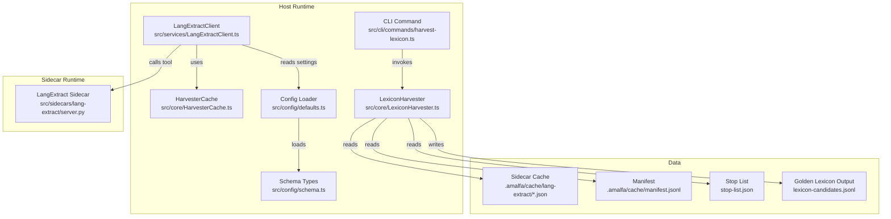
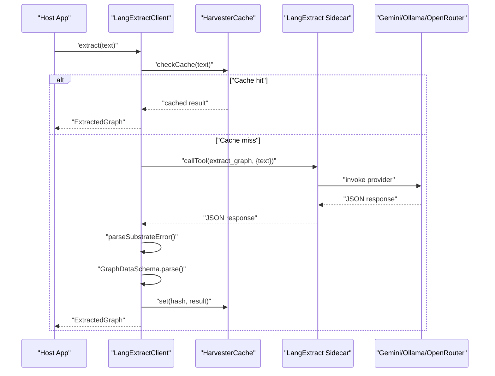
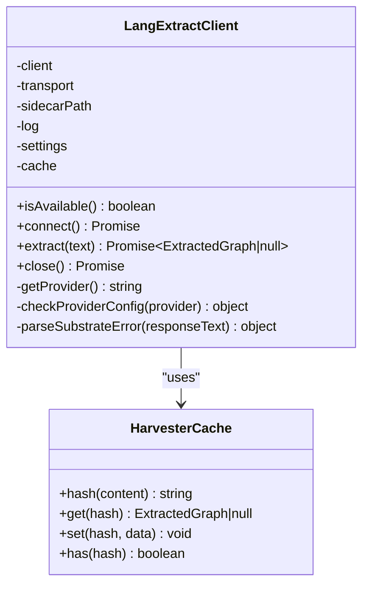
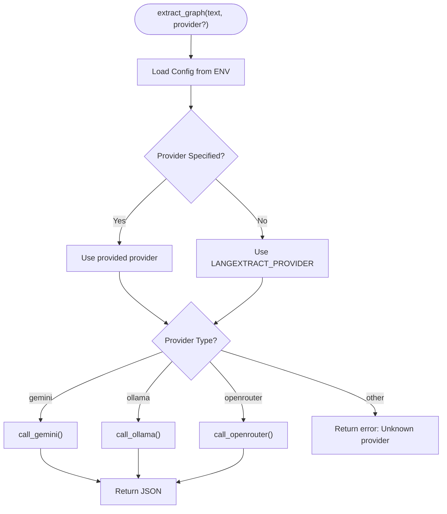
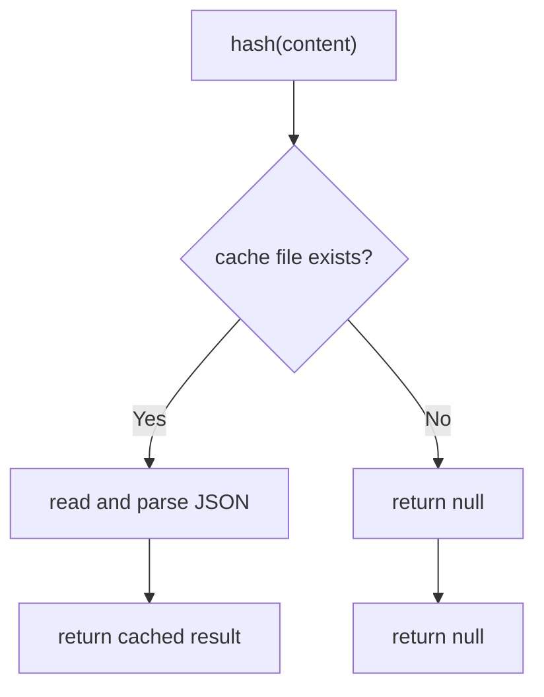
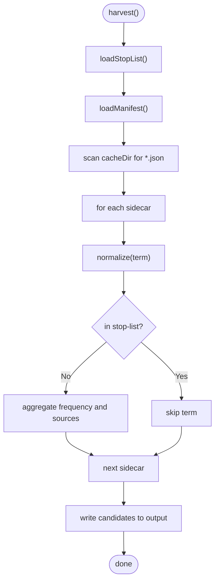
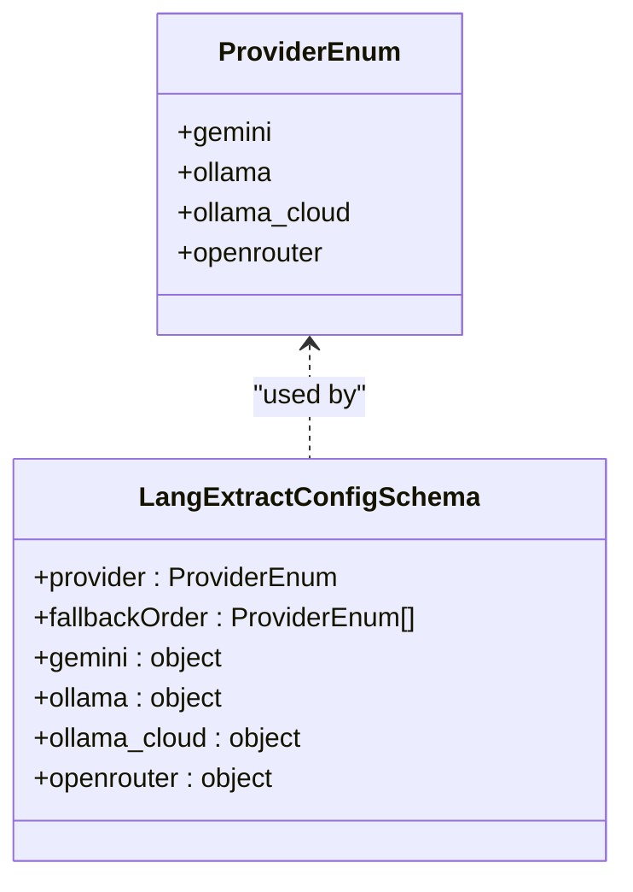
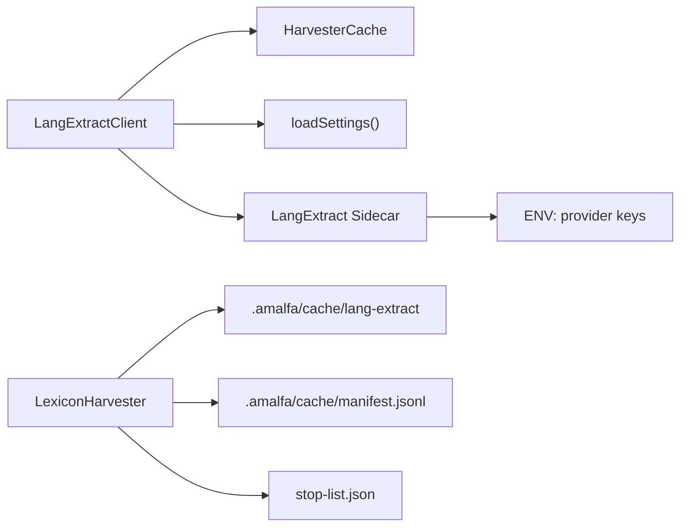
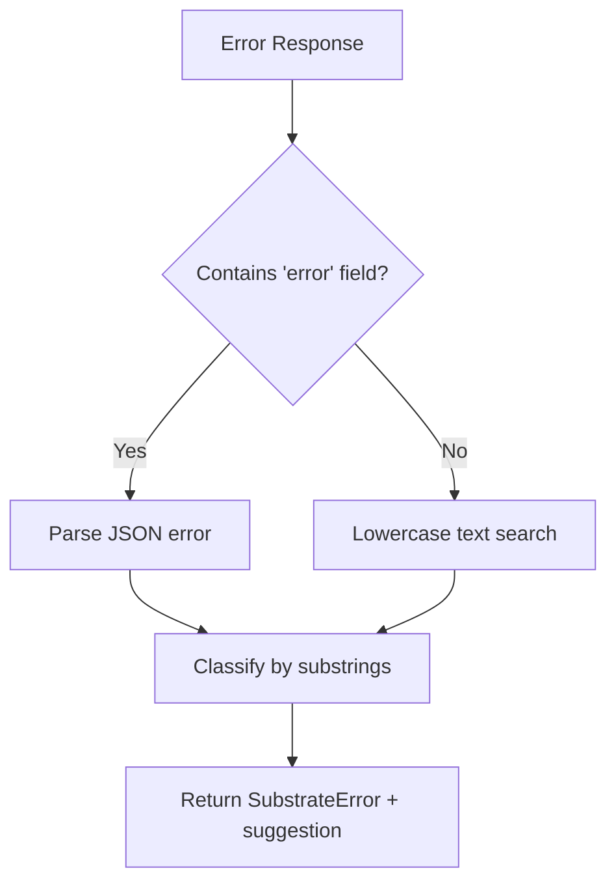

# Entity Extraction and Enhancement

<cite>
**Referenced Files in This Document**
- [LangExtractClient.ts](file://src/services/LangExtractClient.ts)
- [server.py](file://src/sidecars/lang-extract/server.py)
- [schema.ts](file://src/config/schema.ts)
- [defaults.ts](file://src/config/defaults.ts)
- [HarvesterCache.ts](file://src/core/HarvesterCache.ts)
- [LexiconHarvester.ts](file://src/core/LexiconHarvester.ts)
- [sidecar.ts](file://src/types/sidecar.ts)
- [harvest-lexicon.ts](file://src/cli/commands/harvest-lexicon.ts)
- [README.md](file://tests/langextract-results/README.md)
- [test-providers.ts](file://tests/ollama/test-providers.ts)
- [test-models.ts](file://tests/langextract-comparison/test-models.ts)
- [simpleTokenizer.ts](file://src/resonance/services/simpleTokenizer.ts)
- [2026-01-28-substrate-testing.md](file://debriefs/2026-01-28-substrate-testing.md)
- [2026-01-31-lexicon-harvester.md](file://debriefs/2026-01-31-lexicon-harvester.md)
- [Graph and Vector Database Best Practices.md.bak](file://docs/references/Graph and Vector Database Best Practices.md.bak)
</cite>

## Table of Contents
1. [Introduction](#introduction)
2. [Project Structure](#project-structure)
3. [Core Components](#core-components)
4. [Architecture Overview](#architecture-overview)
5. [Detailed Component Analysis](#detailed-component-analysis)
6. [Dependency Analysis](#dependency-analysis)
7. [Performance Considerations](#performance-considerations)
8. [Troubleshooting Guide](#troubleshooting-guide)
9. [Conclusion](#conclusion)
10. [Appendices](#appendices)

## Introduction
This document explains Amalfa’s entity extraction and enhancement capabilities with a focus on:
- LangExtractClient integration for advanced entity recognition and relationship discovery from processed content
- LexiconHarvester’s role in building and maintaining the conceptual lexicon from extracted entities
- Multi-provider architecture for language extraction services and fallback strategies
- Entity normalization, disambiguation, and relationship mapping techniques
- Configuration options, performance tuning, error handling, quality assessment, and validation

## Project Structure
The entity extraction and enhancement pipeline spans TypeScript services, a Python MCP sidecar, configuration schemas, caching, and harvesting utilities. The following diagram maps the primary components and their relationships.

**Diagram sources**
- [LangExtractClient.ts](file://src/services/LangExtractClient.ts#L31-L354)
- [HarvesterCache.ts](file://src/core/HarvesterCache.ts#L10-L69)
- [LexiconHarvester.ts](file://src/core/LexiconHarvester.ts#L25-L176)
- [harvest-lexicon.ts](file://src/cli/commands/harvest-lexicon.ts#L1-L28)
- [defaults.ts](file://src/config/defaults.ts#L84-L139)
- [schema.ts](file://src/config/schema.ts#L97-L108)
- [server.py](file://src/sidecars/lang-extract/server.py#L198-L222)

**Section sources**
- [LangExtractClient.ts](file://src/services/LangExtractClient.ts#L31-L354)
- [server.py](file://src/sidecars/lang-extract/server.py#L198-L222)
- [schema.ts](file://src/config/schema.ts#L97-L108)
- [defaults.ts](file://src/config/defaults.ts#L84-L139)
- [HarvesterCache.ts](file://src/core/HarvesterCache.ts#L10-L69)
- [LexiconHarvester.ts](file://src/core/LexiconHarvester.ts#L25-L176)
- [harvest-lexicon.ts](file://src/cli/commands/harvest-lexicon.ts#L1-L28)

## Core Components
- LangExtractClient: Orchestrates extraction via an MCP sidecar, validates and parses results, caches outcomes, and surfaces provider-specific errors.
- LangExtract Sidecar: Implements provider-specific extraction logic for Gemini, Ollama, and OpenRouter, returning structured JSON.
- HarvesterCache: Provides deterministic content hashing and atomic caching for extraction results.
- LexiconHarvester: Aggregates sidecar outputs into a ranked candidate list, applying stop-list filtering and normalization.
- Configuration: Centralized schema defines providers, models, and fallback ordering.

**Section sources**
- [LangExtractClient.ts](file://src/services/LangExtractClient.ts#L31-L354)
- [server.py](file://src/sidecars/lang-extract/server.py#L31-L47)
- [HarvesterCache.ts](file://src/core/HarvesterCache.ts#L10-L69)
- [LexiconHarvester.ts](file://src/core/LexiconHarvester.ts#L25-L176)
- [schema.ts](file://src/config/schema.ts#L97-L108)

## Architecture Overview
The extraction pipeline integrates a TypeScript client with a Python MCP sidecar. The client resolves provider configuration, connects to the sidecar, invokes the extraction tool, validates and parses the response, and caches results. The harvested sidecars feed the LexiconHarvester to produce a curated candidate list for the conceptual lexicon.

**Diagram sources**
- [LangExtractClient.ts](file://src/services/LangExtractClient.ts#L248-L343)
- [server.py](file://src/sidecars/lang-extract/server.py#L198-L222)
- [HarvesterCache.ts](file://src/core/HarvesterCache.ts#L30-L63)

**Section sources**
- [LangExtractClient.ts](file://src/services/LangExtractClient.ts#L248-L343)
- [server.py](file://src/sidecars/lang-extract/server.py#L198-L222)
- [HarvesterCache.ts](file://src/core/HarvesterCache.ts#L30-L63)

## Detailed Component Analysis

### LangExtractClient
Responsibilities:
- Provider selection precedence: environment override > settings > default
- Transport initialization via MCP stdio with provider-specific environment variables
- Extraction tool invocation, response parsing, and error classification
- Structural validation using Zod schemas
- Caching of results keyed by content hash

Key behaviors:
- Provider resolution and configuration checks
- Error parsing and mapping to SubstrateError categories
- Atomic caching and deterministic hashing

**Diagram sources**
- [LangExtractClient.ts](file://src/services/LangExtractClient.ts#L31-L354)
- [HarvesterCache.ts](file://src/core/HarvesterCache.ts#L10-L69)

**Section sources**
- [LangExtractClient.ts](file://src/services/LangExtractClient.ts#L59-L80)
- [LangExtractClient.ts](file://src/services/LangExtractClient.ts#L82-L104)
- [LangExtractClient.ts](file://src/services/LangExtractClient.ts#L106-L186)
- [LangExtractClient.ts](file://src/services/LangExtractClient.ts#L188-L246)
- [LangExtractClient.ts](file://src/services/LangExtractClient.ts#L248-L343)
- [HarvesterCache.ts](file://src/core/HarvesterCache.ts#L20-L63)

### LangExtract Sidecar
Responsibilities:
- Loads provider configuration from environment variables
- Implements provider-specific extraction functions
- Returns structured JSON via MCP tool

Supported providers:
- Gemini: Requires API key and model
- Ollama: Supports local/remote via configurable host and model
- OpenRouter: Requires API key and model

**Diagram sources**
- [server.py](file://src/sidecars/lang-extract/server.py#L198-L222)
- [server.py](file://src/sidecars/lang-extract/server.py#L31-L47)
- [server.py](file://src/sidecars/lang-extract/server.py#L50-L88)
- [server.py](file://src/sidecars/lang-extract/server.py#L90-L140)
- [server.py](file://src/sidecars/lang-extract/server.py#L142-L196)

**Section sources**
- [server.py](file://src/sidecars/lang-extract/server.py#L31-L47)
- [server.py](file://src/sidecars/lang-extract/server.py#L50-L88)
- [server.py](file://src/sidecars/lang-extract/server.py#L90-L140)
- [server.py](file://src/sidecars/lang-extract/server.py#L142-L196)
- [server.py](file://src/sidecars/lang-extract/server.py#L198-L222)

### HarvesterCache
Responsibilities:
- Deterministic hashing of input content
- Atomic file-based caching with temporary file and rename
- Robustness against corrupt cache entries

**Diagram sources**
- [HarvesterCache.ts](file://src/core/HarvesterCache.ts#L20-L63)

**Section sources**
- [HarvesterCache.ts](file://src/core/HarvesterCache.ts#L20-L63)

### LexiconHarvester
Responsibilities:
- Reads sidecar cache and manifest
- Normalizes terms and aggregates frequencies
- Applies stop-list filtering
- Writes ranked candidates to output

**Diagram sources**
- [LexiconHarvester.ts](file://src/core/LexiconHarvester.ts#L83-L111)
- [LexiconHarvester.ts](file://src/core/LexiconHarvester.ts#L113-L154)
- [LexiconHarvester.ts](file://src/core/LexiconHarvester.ts#L156-L174)

**Section sources**
- [LexiconHarvester.ts](file://src/core/LexiconHarvester.ts#L35-L52)
- [LexiconHarvester.ts](file://src/core/LexiconHarvester.ts#L57-L74)
- [LexiconHarvester.ts](file://src/core/LexiconHarvester.ts#L83-L111)
- [LexiconHarvester.ts](file://src/core/LexiconHarvester.ts#L113-L154)
- [LexiconHarvester.ts](file://src/core/LexiconHarvester.ts#L156-L174)

### Configuration and Multi-Provider Strategy
- Provider enum supports: gemini, ollama, ollama_cloud, openrouter
- Provider selection precedence: environment > settings > default
- Fallback order optional in settings
- Provider-specific model and host overrides supported

**Diagram sources**
- [schema.ts](file://src/config/schema.ts#L16-L21)
- [schema.ts](file://src/config/schema.ts#L97-L108)

**Section sources**
- [schema.ts](file://src/config/schema.ts#L16-L21)
- [schema.ts](file://src/config/schema.ts#L97-L108)
- [defaults.ts](file://src/config/defaults.ts#L84-L139)

## Dependency Analysis
- LangExtractClient depends on:
  - Configuration loader for settings
  - HarvesterCache for content hashing and caching
  - MCP transport to communicate with the sidecar
- Sidecar depends on environment variables for provider configuration
- LexiconHarvester depends on:
  - Sidecar cache directory for input
  - Manifest for source mapping
  - Stop-list for filtering

**Diagram sources**
- [LangExtractClient.ts](file://src/services/LangExtractClient.ts#L39-L43)
- [defaults.ts](file://src/config/defaults.ts#L84-L139)
- [server.py](file://src/sidecars/lang-extract/server.py#L31-L47)
- [LexiconHarvester.ts](file://src/core/LexiconHarvester.ts#L57-L74)

**Section sources**
- [LangExtractClient.ts](file://src/services/LangExtractClient.ts#L39-L43)
- [server.py](file://src/sidecars/lang-extract/server.py#L31-L47)
- [LexiconHarvester.ts](file://src/core/LexiconHarvester.ts#L57-L74)

## Performance Considerations
- Caching: Content hashing and atomic file writes reduce repeated extractions and improve throughput.
- Provider selection: Environment override avoids expensive discovery in hot path.
- Streaming and batching: Consider streaming sidecar outputs and batching requests for large-scale ingestion.
- Model selection: Prefer smaller models for rapid iteration and larger models for higher accuracy in production.
- Network timeouts: Configure appropriate timeouts for cloud providers to avoid long blocking calls.

[No sources needed since this section provides general guidance]

## Troubleshooting Guide
Common failure modes and resolutions:
- Missing API key: Ensure provider-specific API keys are set in environment variables.
- Invalid API key: Verify credentials and permissions.
- Out of credit/quota: Check billing status and adjust provider or plan.
- Network error/timeout: Confirm connectivity and provider availability.
- Unknown error: Inspect provider documentation and logs.

**Diagram sources**
- [LangExtractClient.ts](file://src/services/LangExtractClient.ts#L106-L186)

**Section sources**
- [LangExtractClient.ts](file://src/services/LangExtractClient.ts#L106-L186)
- [2026-01-28-substrate-testing.md](file://debriefs/2026-01-28-substrate-testing.md#L53-L114)

## Conclusion
Amalfa’s entity extraction and enhancement pipeline combines a robust TypeScript client with a flexible Python MCP sidecar, a deterministic caching layer, and a triage-driven lexicon harvester. The multi-provider architecture enables controlled experimentation and fallback strategies, while configuration schemas enforce consistency and extensibility. Together, these components support high-quality, explainable entity recognition and relationship discovery suitable for knowledge graph construction.

[No sources needed since this section summarizes without analyzing specific files]

## Appendices

### Configuration Options for Extraction Providers
- Provider selection: gemini, ollama, ollama_cloud, openrouter
- Environment variables:
  - GEMINI_API_KEY, GEMINI_MODEL
  - OLLAMA_HOST, OLLAMA_MODEL
  - OPENROUTER_API_KEY, OPENROUTER_MODEL
- Settings keys:
  - langExtract.provider
  - langExtract.fallbackOrder
  - langExtract.gemini.model
  - langExtract.ollama.host, langExtract.ollama.model
  - langExtract.ollama_cloud.host, langExtract.ollama_cloud.model
  - langExtract.openrouter.model

**Section sources**
- [schema.ts](file://src/config/schema.ts#L97-L108)
- [server.py](file://src/sidecars/lang-extract/server.py#L31-L47)
- [LangExtractClient.ts](file://src/services/LangExtractClient.ts#L62-L80)

### Entity Normalization and Disambiguation
- Normalization: Lowercase and trim terms during aggregation.
- Stop-list filtering: Exclude noise terms globally.
- Similarity grouping: Use embeddings to group synonyms for curation decisions.

**Section sources**
- [LexiconHarvester.ts](file://src/core/LexiconHarvester.ts#L76-L78)
- [LexiconHarvester.ts](file://src/core/LexiconHarvester.ts#L35-L52)
- [2026-01-31-lexicon-harvester.md](file://debriefs/2026-01-31-lexicon-harvester.md#L38-L41)

### Relationship Mapping Techniques
- Explicit tags: Parse structured tags to derive typed relationships.
- Confidence scoring: Assign confidence to relationships based on explicitness or model certainty.
- Contextual weighting: Weight primary concepts higher in sidecar outputs.

**Section sources**
- [scripts/lab/cda.ts](file://scripts/lab/cda.ts#L127-L179)

### Quality Assessment and Validation
- Automatic metrics: Entity count, relationship count, latency, success rate.
- Manual assessment: Accuracy, completeness, relevance, format.
- Persistent results: Store extraction outputs in JSONL for reproducibility and comparison.

**Section sources**
- [README.md](file://tests/langextract-results/README.md#L149-L188)
- [README.md](file://tests/langextract-results/README.md#L25-L56)

### Examples of Workflows
- Provider comparison: Test cloud vs. local models and compare results.
- Extraction workflow: Load settings, initialize client, call extract, validate schema, cache result.

**Section sources**
- [test-providers.ts](file://tests/ollama/test-providers.ts#L144-L200)
- [test-models.ts](file://tests/langextract-comparison/test-models.ts#L138-L163)
- [LangExtractClient.ts](file://src/services/LangExtractClient.ts#L248-L343)

### Integration with External NLP Services
- Gemini: Use Google Generative AI with JSON response format.
- Ollama: Query local/remote chat endpoint with JSON format.
- OpenRouter: Send chat completions with required headers and JSON format.

**Section sources**
- [server.py](file://src/sidecars/lang-extract/server.py#L50-L88)
- [server.py](file://src/sidecars/lang-extract/server.py#L90-L140)
- [server.py](file://src/sidecars/lang-extract/server.py#L142-L196)

### Tokenization and Concept Building
- Tokenizer vocabulary tagging: Protocol, Concept, Organization for downstream categorization.
- Concept enrichment: Title-case labels and metadata for presentation fidelity.

**Section sources**
- [simpleTokenizer.ts](file://src/resonance/services/simpleTokenizer.ts#L56-L90)

### Knowledge Graph Construction Notes
- Density management: Apply Louvain constraints to manage edge density and improve traversal performance.
- Agent-based validation: Establish the knowledge graph as authoritative ground truth.

**Section sources**
- [Graph and Vector Database Best Practices.md.bak](file://docs/references/Graph and Vector Database Best Practices.md.bak#L129-L212)