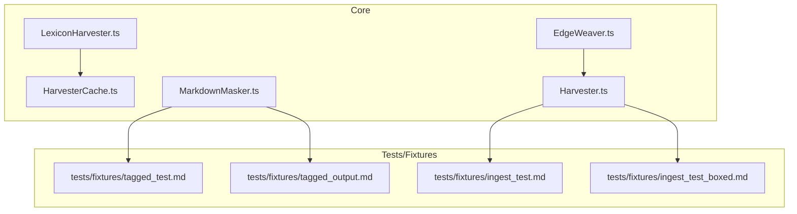
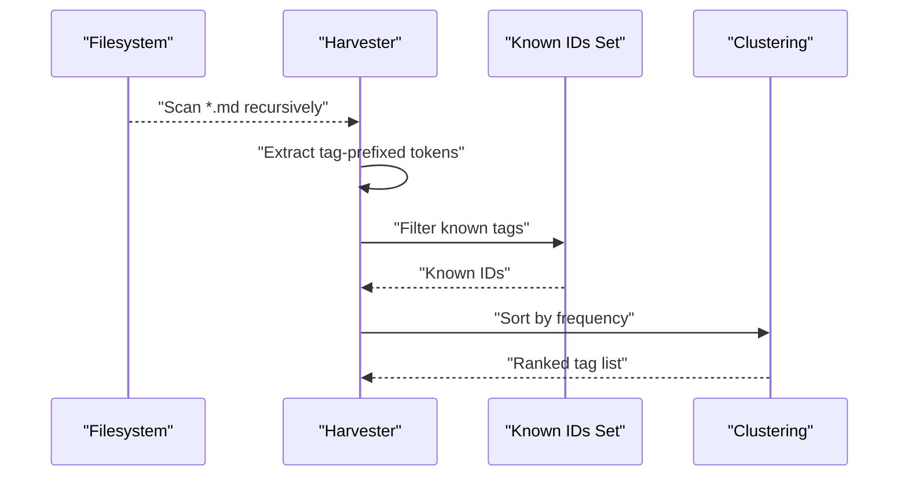
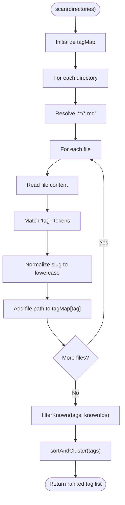
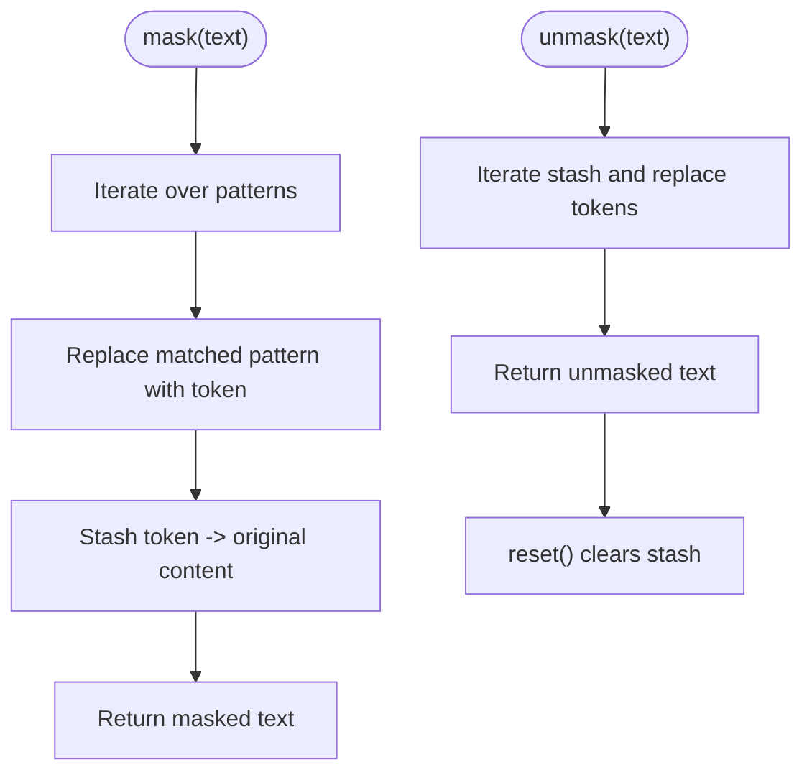
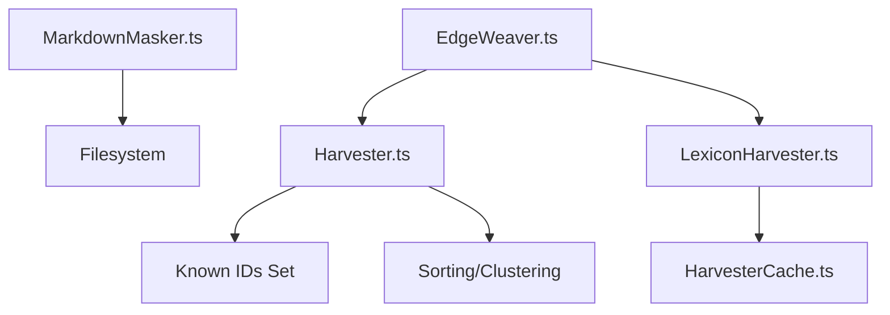

# Markdown Parsing and Extraction

<cite>
**Referenced Files in This Document**
- [Harvester.ts](file://src/core/Harvester.ts)
- [MarkdownMasker.ts](file://src/core/MarkdownMasker.ts)
- [LexiconHarvester.ts](file://src/core/LexiconHarvester.ts)
- [HarvesterCache.ts](file://src/core/HarvesterCache.ts)
- [EdgeWeaver.ts](file://src/core/EdgeWeaver.ts)
- [tagged_test.md](file://tests/fixtures/tagged_test.md)
- [ingest_test.md](file://tests/fixtures/ingest_test.md)
- [ingest_test_boxed.md](file://tests/fixtures/ingest_test_boxed.md)
- [tagged_output.md](file://tests/fixtures/tagged_output.md)
</cite>

## Table of Contents
1. [Introduction](#introduction)
2. [Project Structure](#project-structure)
3. [Core Components](#core-components)
4. [Architecture Overview](#architecture-overview)
5. [Detailed Component Analysis](#detailed-component-analysis)
6. [Dependency Analysis](#dependency-analysis)
7. [Performance Considerations](#performance-considerations)
8. [Troubleshooting Guide](#troubleshooting-guide)
9. [Conclusion](#conclusion)

## Introduction
This document explains Amalfa’s markdown parsing and extraction capabilities with a focus on:
- Scanning directories for tag-based metadata using the Harvester class
- The tag extraction algorithm that identifies tag-prefixed tokens and organizes them into tag maps
- Filtering mechanisms that remove known tags from the lexicon and entity index
- Sorting and clustering logic for organizing extracted tags by frequency
- The MarkdownMasker’s role in content sanitization and formatting
- Examples of tag extraction patterns, custom extraction rules, and handling of malformed markdown content
- Performance considerations for large-scale content processing

## Project Structure
The markdown parsing and extraction features are implemented primarily in the core module, with supporting utilities for masking, caching, and lexicon harvesting. The following diagram shows the relevant files and their roles.

**Diagram sources**
- [Harvester.ts](file://src/core/Harvester.ts#L1-L74)
- [MarkdownMasker.ts](file://src/core/MarkdownMasker.ts#L1-L50)
- [LexiconHarvester.ts](file://src/core/LexiconHarvester.ts#L1-L176)
- [HarvesterCache.ts](file://src/core/HarvesterCache.ts#L1-L69)
- [EdgeWeaver.ts](file://src/core/EdgeWeaver.ts#L47-L77)
- [tagged_test.md](file://tests/fixtures/tagged_test.md#L1-L49)
- [ingest_test.md](file://tests/fixtures/ingest_test.md#L1-L13)
- [ingest_test_boxed.md](file://tests/fixtures/ingest_test_boxed.md#L1-L13)
- [tagged_output.md](file://tests/fixtures/tagged_output.md#L1-L49)

**Section sources**
- [Harvester.ts](file://src/core/Harvester.ts#L1-L74)
- [MarkdownMasker.ts](file://src/core/MarkdownMasker.ts#L1-L50)
- [LexiconHarvester.ts](file://src/core/LexiconHarvester.ts#L1-L176)
- [HarvesterCache.ts](file://src/core/HarvesterCache.ts#L1-L69)
- [EdgeWeaver.ts](file://src/core/EdgeWeaver.ts#L47-L77)
- [tagged_test.md](file://tests/fixtures/tagged_test.md#L1-L49)
- [ingest_test.md](file://tests/fixtures/ingest_test.md#L1-L13)
- [ingest_test_boxed.md](file://tests/fixtures/ingest_test_boxed.md#L1-L13)
- [tagged_output.md](file://tests/fixtures/tagged_output.md#L1-L49)

## Core Components
- Harvester: Scans directories for tag-prefixed tokens, builds a tag map, filters known tags, and sorts/clusters by frequency.
- MarkdownMasker: Masks “no-fly zone” constructs (code blocks, inline code, tables) to preserve atomicity during downstream processing.
- LexiconHarvester: Aggregates sidecar outputs into a frequency-ordered lexicon candidate list and writes to JSONL.
- HarvesterCache: Provides atomic caching for extraction results keyed by content hash.
- EdgeWeaver: Processes explicit tag syntax and wiki-links for strict-mode semantic weaving.

**Section sources**
- [Harvester.ts](file://src/core/Harvester.ts#L12-L72)
- [MarkdownMasker.ts](file://src/core/MarkdownMasker.ts#L6-L48)
- [LexiconHarvester.ts](file://src/core/LexiconHarvester.ts#L19-L174)
- [HarvesterCache.ts](file://src/core/HarvesterCache.ts#L20-L67)
- [EdgeWeaver.ts](file://src/core/EdgeWeaver.ts#L47-L77)

## Architecture Overview
The markdown extraction pipeline integrates scanning, masking, filtering, and sorting. The following sequence diagram maps the end-to-end flow from file discovery to tag clustering.

**Diagram sources**
- [Harvester.ts](file://src/core/Harvester.ts#L16-L72)

## Detailed Component Analysis

### Harvester: Directory Scanning and Tag Extraction
Harvester scans directories for markdown files and extracts tag-prefixed tokens. It:
- Uses a glob pattern to traverse directories recursively
- Reads each file’s content and applies a regular expression to match tokens with the “tag-” prefix
- Normalizes matched tokens to lowercase and aggregates file paths per tag
- Filters out known tags by checking against a provided set of known identifiers
- Sorts tags by occurrence count to produce a ranked list suitable for downstream processing

Key behaviors:
- Token extraction: Matches tokens of the form tag-<slug> and captures the slug portion
- Normalization: Converts slugs to lowercase for consistent indexing
- Aggregation: Builds a map of tag → array of file paths
- Filtering: Excludes tags present in the known IDs set (including term- prefixed variants)
- Sorting: Produces a list ordered by frequency (descending)

**Diagram sources**
- [Harvester.ts](file://src/core/Harvester.ts#L16-L72)

**Section sources**
- [Harvester.ts](file://src/core/Harvester.ts#L12-L72)

### Tag Extraction Algorithm Details
- Pattern: tag- followed by word characters and hyphens
- Capture group: The slug part after tag-
- Normalization: Lowercase conversion ensures case-insensitive grouping
- Aggregation: One tag → many file paths; preserves provenance for targeted processing
- Edge cases handled implicitly by skipping empty captures

Examples of recognized patterns in fixtures:
- Inline tag usage in content: see ingest_test.md and ingest_test_boxed.md
- Large content with fenced code blocks and inline code: see tagged_test.md and tagged_output.md

**Section sources**
- [Harvester.ts](file://src/core/Harvester.ts#L20-L35)
- [ingest_test.md](file://tests/fixtures/ingest_test.md#L7-L12)
- [ingest_test_boxed.md](file://tests/fixtures/ingest_test_boxed.md#L7-L12)
- [tagged_test.md](file://tests/fixtures/tagged_test.md#L22-L39)
- [tagged_output.md](file://tests/fixtures/tagged_output.md#L22-L39)

### Filtering Mechanism: Removing Known Tags
Harvester exposes a filter method that removes tags already present in the lexicon or entity index:
- Checks whether a tag or a term- prefixed variant exists in the known IDs set
- Preserves only unknown tags for further enrichment or clustering

This mechanism prevents redundant processing of already-known concepts and entities.

**Section sources**
- [Harvester.ts](file://src/core/Harvester.ts#L38-L54)

### Sorting and Clustering Logic
Harvester sorts extracted tags by frequency:
- Transforms tagMap entries into arrays of objects with tag, count, and files
- Sorts by count in descending order
- Returns a ranked list suitable for prioritizing high-frequency tags

Note: The current implementation performs frequency-based sorting rather than semantic clustering.

**Section sources**
- [Harvester.ts](file://src/core/Harvester.ts#L56-L72)

### MarkdownMasker: Content Sanitization and Formatting
MarkdownMasker protects “no-fly zones” (atomic constructs) during processing:
- Patterns masked:
  - Fenced code blocks (multi-line)
  - Inline code spans
  - GitHub Flavored Markdown tables (basic detection)
- Mechanism:
  - Replaces matched patterns with unique inert tokens
  - Stashes originals in an internal map for restoration
  - Provides reset to clear stash after processing
- Use case:
  - Ensures atomicity of code and tables when downstream processors split or tokenize content

**Diagram sources**
- [MarkdownMasker.ts](file://src/core/MarkdownMasker.ts#L16-L48)

**Section sources**
- [MarkdownMasker.ts](file://src/core/MarkdownMasker.ts#L6-L48)

### LexiconHarvester: Candidate Aggregation and Output
LexiconHarvester complements tag extraction by aggregating sidecar outputs:
- Loads a stop-list and manifest
- Iterates sidecar JSON files to collect entities and concepts
- Normalizes terms, filters stop-list items, and accumulates frequencies and sources
- Writes a frequency-sorted JSONL output

While distinct from Harvester’s tag scanning, it shares normalization and frequency-sorting concerns.

**Section sources**
- [LexiconHarvester.ts](file://src/core/LexiconHarvester.ts#L32-L174)

### HarvesterCache: Atomic Caching for Extraction Results
HarvesterCache provides persistent caching for extraction results:
- Generates SHA-256 hashes of content to key cache entries
- Atomic write pattern using a temporary file then rename
- Robust error handling for corrupt cache entries

This supports performance and reproducibility in large-scale processing.

**Section sources**
- [HarvesterCache.ts](file://src/core/HarvesterCache.ts#L20-L67)

### EdgeWeaver: Strict Semantic Tagging and WikiLinks
EdgeWeaver enforces strict-mode extraction:
- Explicit tag syntax: [tag: ...]
- Wiki-links: [[...]]
- Metadata tags and markdown links are also considered
- Integrates with a lexicon to resolve concepts and create edges

This component is complementary to Harvester’s scanning and filtering, focusing on precise semantic tagging during weaving.

**Section sources**
- [EdgeWeaver.ts](file://src/core/EdgeWeaver.ts#L47-L77)

## Dependency Analysis
The following diagram shows how core components depend on each other and external inputs.

**Diagram sources**
- [Harvester.ts](file://src/core/Harvester.ts#L16-L72)
- [MarkdownMasker.ts](file://src/core/MarkdownMasker.ts#L16-L48)
- [LexiconHarvester.ts](file://src/core/LexiconHarvester.ts#L19-L174)
- [HarvesterCache.ts](file://src/core/HarvesterCache.ts#L20-L67)
- [EdgeWeaver.ts](file://src/core/EdgeWeaver.ts#L47-L77)

**Section sources**
- [Harvester.ts](file://src/core/Harvester.ts#L16-L72)
- [MarkdownMasker.ts](file://src/core/MarkdownMasker.ts#L16-L48)
- [LexiconHarvester.ts](file://src/core/LexiconHarvester.ts#L19-L174)
- [HarvesterCache.ts](file://src/core/HarvesterCache.ts#L20-L67)
- [EdgeWeaver.ts](file://src/core/EdgeWeaver.ts#L47-L77)

## Performance Considerations
- I/O and globbing:
  - Scanning large directory trees with recursive globs can be expensive. Consider limiting directories or using file lists to reduce traversal overhead.
- Regex matching:
  - Token extraction uses a single pass with a global regex. For very large files, consider streaming or chunked processing to avoid memory spikes.
- Filtering:
  - Known tag filtering relies on a set lookup. Ensure the known IDs set is constructed efficiently (e.g., pre-normalized) to minimize lookup cost.
- Sorting:
  - Sorting by frequency is O(n log n). For very large tag sets, consider sampling or approximate methods if exact ordering is not required.
- Masking:
  - Masking introduces additional passes over content. Keep patterns minimal and reuse masks across stages when possible.
- Caching:
  - Use HarvesterCache to avoid recomputation. Ensure cache invalidation aligns with content hashing and manifest updates.

[No sources needed since this section provides general guidance]

## Troubleshooting Guide
Common issues and remedies:
- Missing or malformed tag syntax:
  - Ensure tag-prefixed tokens follow the expected pattern (tag-<slug>). Verify fixture content for correct usage.
  - See inline tag usage in ingest_test.md and ingest_test_boxed.md.
- Malformed markdown content:
  - Large fenced code blocks and inline code are preserved as atomic units via MarkdownMasker. Confirm masking behavior in tagged_test.md and tagged_output.md.
- Known tags still appearing:
  - Verify the known IDs set includes both plain tags and term- prefixed variants. Harvester checks both forms during filtering.
- Sorting unexpected:
  - Confirm that tag counts reflect actual occurrences. Sorting is strictly by frequency descending.

**Section sources**
- [Harvester.ts](file://src/core/Harvester.ts#L38-L72)
- [MarkdownMasker.ts](file://src/core/MarkdownMasker.ts#L16-L48)
- [ingest_test.md](file://tests/fixtures/ingest_test.md#L7-L12)
- [ingest_test_boxed.md](file://tests/fixtures/ingest_test_boxed.md#L7-L12)
- [tagged_test.md](file://tests/fixtures/tagged_test.md#L22-L39)
- [tagged_output.md](file://tests/fixtures/tagged_output.md#L22-L39)

## Conclusion
Amalfa’s markdown parsing and extraction stack combines robust scanning, sanitization, filtering, and ranking to support downstream enrichment and graph weaving. Harvester provides efficient tag discovery and frequency-based sorting, MarkdownMasker ensures atomicity of sensitive constructs, and LexiconHarvester and HarvesterCache support scalable aggregation and persistence. Together, these components enable reliable, high-performance processing of large markdown corpora while preserving content integrity.