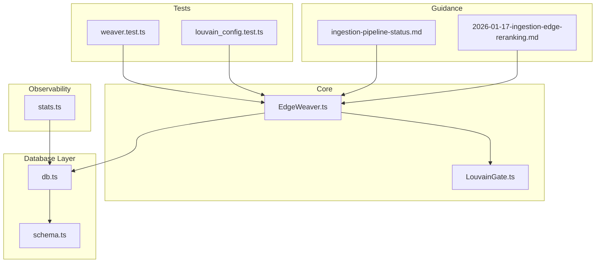
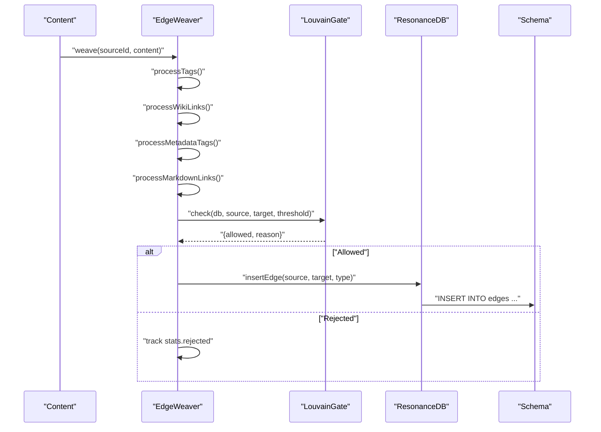
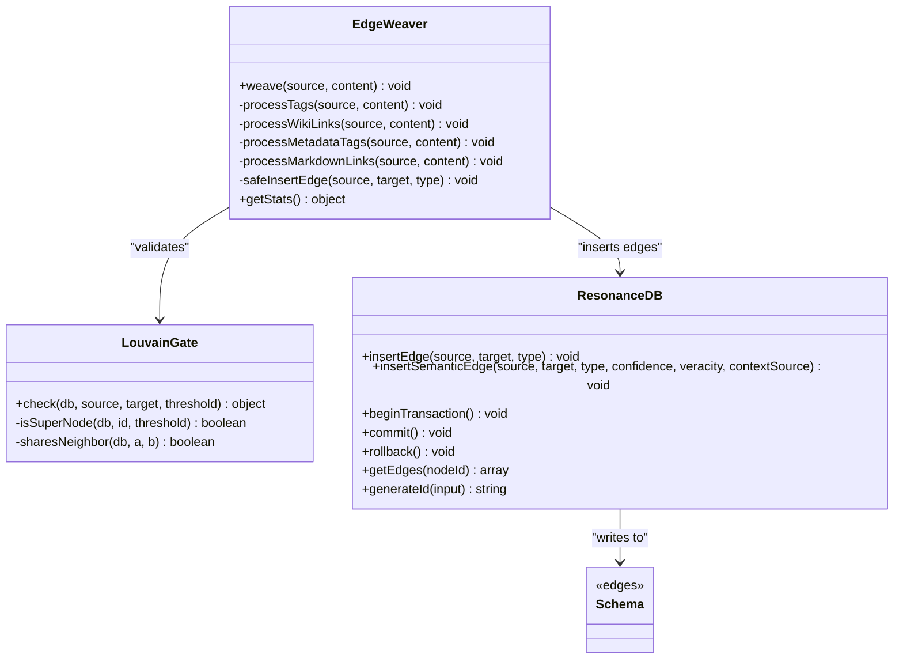
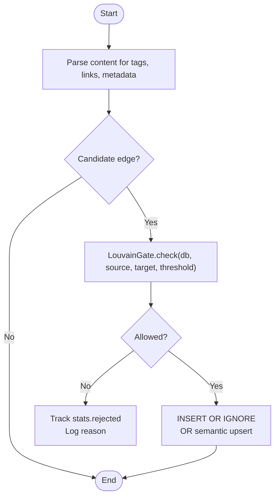

# Edge Types and Properties Management

<cite>
**Referenced Files in This Document**
- [EdgeWeaver.ts](file://src/core/EdgeWeaver.ts)
- [LouvainGate.ts](file://src/core/LouvainGate.ts)
- [db.ts](file://src/resonance/db.ts)
- [schema.ts](file://src/resonance/drizzle/schema.ts)
- [stats.ts](file://src/resonance/services/stats.ts)
- [weaver.test.ts](file://tests/weaver.test.ts)
- [louvain_config.test.ts](file://tests/louvain_config.test.ts)
- [ingestion-pipeline-status.md](file://public/reports/ingestion-pipeline-status.md)
- [2026-01-17-ingestion-edge-reranking.md](file://briefs/archive/2026-01-17-reranking/2026-01-17-ingestion-edge-reranking.md)
</cite>

## Table of Contents
1. [Introduction](#introduction)
2. [Project Structure](#project-structure)
3. [Core Components](#core-components)
4. [Architecture Overview](#architecture-overview)
5. [Detailed Component Analysis](#detailed-component-analysis)
6. [Dependency Analysis](#dependency-analysis)
7. [Performance Considerations](#performance-considerations)
8. [Troubleshooting Guide](#troubleshooting-guide)
9. [Conclusion](#conclusion)
10. [Appendices](#appendices)

## Introduction
This document explains Amalfa’s edge types and properties management system. It covers supported edge types, property schemas, metadata storage, validation rules, insertion mechanics, safety checks, duplicate prevention, transaction management, querying patterns, indexing strategies, performance optimization for large graphs, and troubleshooting edge-related database issues.

## Project Structure
The edge management system spans several modules:
- Edge extraction and weaving: [EdgeWeaver.ts](file://src/core/EdgeWeaver.ts)
- Safety and validation: [LouvainGate.ts](file://src/core/LouvainGate.ts)
- Database layer and schema: [db.ts](file://src/resonance/db.ts), [schema.ts](file://src/resonance/drizzle/schema.ts)
- Metrics and observability: [stats.ts](file://src/resonance/services/stats.ts)
- Tests validating behavior: [weaver.test.ts](file://tests/weaver.test.ts), [louvain_config.test.ts](file://tests/louvain_config.test.ts)
- Additional guidance and proposals: [ingestion-pipeline-status.md](file://public/reports/ingestion-pipeline-status.md), [2026-01-17-ingestion-edge-reranking.md](file://briefs/archive/2026-01-17-reranking/2026-01-17-ingestion-edge-reranking.md)

**Diagram sources**
- [EdgeWeaver.ts](file://src/core/EdgeWeaver.ts#L1-L194)
- [LouvainGate.ts](file://src/core/LouvainGate.ts#L1-L68)
- [db.ts](file://src/resonance/db.ts#L1-L488)
- [schema.ts](file://src/resonance/drizzle/schema.ts#L1-L77)
- [stats.ts](file://src/resonance/services/stats.ts#L1-L328)
- [weaver.test.ts](file://tests/weaver.test.ts#L48-L134)
- [louvain_config.test.ts](file://tests/louvain_config.test.ts#L42-L81)
- [ingestion-pipeline-status.md](file://public/reports/ingestion-pipeline-status.md#L118-L150)
- [2026-01-17-ingestion-edge-reranking.md](file://briefs/archive/2026-01-17-reranking/2026-01-17-ingestion-edge-reranking.md#L1-L364)

**Section sources**
- [EdgeWeaver.ts](file://src/core/EdgeWeaver.ts#L1-L194)
- [LouvainGate.ts](file://src/core/LouvainGate.ts#L1-L68)
- [db.ts](file://src/resonance/db.ts#L1-L488)
- [schema.ts](file://src/resonance/drizzle/schema.ts#L1-L77)
- [stats.ts](file://src/resonance/services/stats.ts#L1-L328)
- [weaver.test.ts](file://tests/weaver.test.ts#L48-L134)
- [louvain_config.test.ts](file://tests/louvain_config.test.ts#L42-L81)
- [ingestion-pipeline-status.md](file://public/reports/ingestion-pipeline-status.md#L118-L150)
- [2026-01-17-ingestion-edge-reranking.md](file://briefs/archive/2026-01-17-reranking/2026-01-17-ingestion-edge-reranking.md#L1-L364)

## Core Components
- EdgeWeaver: Extracts explicit relationships from content and inserts validated edges into the database.
- LouvainGate: Applies modularity-based validation to prevent low-quality edges to “super nodes.”
- ResonanceDB: Provides database operations, schema-backed edge storage, and transaction management.
- schema.ts: Defines the edges table structure and indices.
- stats.ts: Aggregates ingestion metrics including edge counts by type.

Key responsibilities:
- Parse tags, wiki links, and metadata blocks to derive edge types and targets.
- Enforce safety thresholds before inserting edges.
- Persist edges with optional confidence and veracity metadata.
- Provide transactional batch operations for performance.

**Section sources**
- [EdgeWeaver.ts](file://src/core/EdgeWeaver.ts#L47-L194)
- [LouvainGate.ts](file://src/core/LouvainGate.ts#L3-L67)
- [db.ts](file://src/resonance/db.ts#L140-L184)
- [schema.ts](file://src/resonance/drizzle/schema.ts#L34-L51)
- [stats.ts](file://src/resonance/services/stats.ts#L8-L131)

## Architecture Overview
The edge pipeline transforms textual content into typed relationships with safety and metadata.

**Diagram sources**
- [EdgeWeaver.ts](file://src/core/EdgeWeaver.ts#L54-L181)
- [LouvainGate.ts](file://src/core/LouvainGate.ts#L15-L36)
- [db.ts](file://src/resonance/db.ts#L140-L159)
- [schema.ts](file://src/resonance/drizzle/schema.ts#L34-L51)

## Detailed Component Analysis

### Edge Types and Extraction Patterns
Supported edge types and how they are derived:
- TAGGED_AS: Explicit tag syntax [tag: Concept] resolves to a concept ID via the lexicon.
- EXEMPLIFIES: Legacy tag-slug format tag-something or explicit tag-slug mapped to exemplification.
- CITES: WikiLink [[Target]] resolved to concept ID; if not found, path-aware ID generation is attempted.
- LINKS_TO: Markdown internal link [text](./path.md) resolves to a node ID; external URLs are ignored.
- Custom relationship types: Metadata block <!-- tags: [RELATION: Target] --> allows arbitrary relation types (lowercased and uppercased on insertion). Non-structural tags (e.g., quality, hashtags) are filtered out.

Extraction logic and examples are validated by tests:
- Tag-based exemplification and alias mapping.
- WikiLink citation mapping.
- Mixed tag and link scenarios.
- Metadata block parsing for custom relations.

**Section sources**
- [EdgeWeaver.ts](file://src/core/EdgeWeaver.ts#L61-L166)
- [weaver.test.ts](file://tests/weaver.test.ts#L48-L134)
- [ingestion-pipeline-status.md](file://public/reports/ingestion-pipeline-status.md#L118-L129)

### Edge Property Schemas and Metadata Storage
Edge schema supports:
- source: text (not null)
- target: text (not null)
- type: text (not null)
- confidence: real (default 1.0)
- veracity: real (default 1.0)
- context_source: text

Composite primary key ensures uniqueness of (source, target, type). Indices on source and target accelerate traversals.

Additional metadata can be stored in node-level meta JSON for provenance and auditing.

**Section sources**
- [schema.ts](file://src/resonance/drizzle/schema.ts#L34-L51)
- [db.ts](file://src/resonance/db.ts#L165-L184)

### Relationship Validation Rules
Safety checks:
- LouvainGate rejects edges to “super nodes” (high-degree targets) when the source has no shared neighbor with the target, enforcing triadic closure.
- Threshold is configurable and tracked in statistics.

Validation flow:
- For each candidate edge, compute degree and neighbor overlap.
- Allow or reject with a reason.

**Section sources**
- [LouvainGate.ts](file://src/core/LouvainGate.ts#L15-L66)
- [EdgeWeaver.ts](file://src/core/EdgeWeaver.ts#L168-L181)
- [louvain_config.test.ts](file://tests/louvain_config.test.ts#L42-L81)

### Edge Insertion Process and Duplicate Prevention
Insertion mechanics:
- Explicit edges: INSERT OR IGNORE prevents duplicates for the composite key (source, target, type).
- Semantic edges: INSERT with ON CONFLICT updates confidence, veracity, and context_source for the same triple.
- Transaction management: beginTransaction, commit, rollback enable batching and atomicity.

Duplicate prevention:
- Composite primary key enforces uniqueness of (source, target, type).
- INSERT OR IGNORE avoids errors on repeated insertions.

**Section sources**
- [db.ts](file://src/resonance/db.ts#L140-L184)
- [schema.ts](file://src/resonance/drizzle/schema.ts#L44-L50)

### Transaction Management
- Begin and commit/rollback wrap bulk operations to ensure atomicity and improve throughput.
- WAL mode is enforced by the database factory for consistent read/write behavior.

Best practices:
- Group multiple insertions within a transaction.
- Use rollback on failure to maintain consistency.

**Section sources**
- [db.ts](file://src/resonance/db.ts#L349-L359)

### Examples of Edge Creation Patterns
Common patterns validated by tests:
- Tag-based exemplification with canonical ID resolution.
- WikiLink citation mapping to concept IDs.
- Mixed tag and link content generating multiple edges.
- Metadata block relations with filtering of non-structural tags.

These patterns demonstrate how explicit content drives structured relationships.

**Section sources**
- [weaver.test.ts](file://tests/weaver.test.ts#L48-L134)
- [EdgeWeaver.ts](file://src/core/EdgeWeaver.ts#L61-L166)

### Relationship Querying
- Retrieve outbound edges from a node using a typed accessor.
- Use indices on source and target for efficient traversals.
- For advanced queries (e.g., semantic rescues), leverage raw SQL with joins and vector similarity.

**Section sources**
- [db.ts](file://src/resonance/db.ts#L426-L430)
- [schema.ts](file://src/resonance/drizzle/schema.ts#L47-L50)

### Edge Indexing Strategies
- Source index: idx_edges_source
- Target index: idx_edges_target
- Composite primary key on (source, target, type)

Recommendations:
- Prefer composite primary key for uniqueness.
- Maintain indices for frequent traversals.
- Consider adding domain-specific indices if querying by type or metadata becomes common.

**Section sources**
- [schema.ts](file://src/resonance/drizzle/schema.ts#L44-L50)

### Performance Optimization for Large Graphs
- Use transactions for batch inserts.
- Apply safety checks early to reduce wasted work.
- Limit result sets and avoid SELECT *; use targeted queries.
- Monitor edge counts and types via ingestion stats.
- Propose semantic edge enhancement (reranking) as a background phase to increase recall without impacting initial ingestion latency.

**Section sources**
- [db.ts](file://src/resonance/db.ts#L349-L359)
- [stats.ts](file://src/resonance/services/stats.ts#L64-L131)
- [2026-01-17-ingestion-edge-reranking.md](file://briefs/archive/2026-01-17-reranking/2026-01-17-ingestion-edge-reranking.md#L16-L36)

## Dependency Analysis

**Diagram sources**
- [EdgeWeaver.ts](file://src/core/EdgeWeaver.ts#L5-L194)
- [LouvainGate.ts](file://src/core/LouvainGate.ts#L3-L67)
- [db.ts](file://src/resonance/db.ts#L140-L430)
- [schema.ts](file://src/resonance/drizzle/schema.ts#L34-L51)

**Section sources**
- [EdgeWeaver.ts](file://src/core/EdgeWeaver.ts#L1-L194)
- [LouvainGate.ts](file://src/core/LouvainGate.ts#L1-L68)
- [db.ts](file://src/resonance/db.ts#L1-L488)
- [schema.ts](file://src/resonance/drizzle/schema.ts#L1-L77)

## Performance Considerations
- Batch operations inside transactions to minimize WAL writes.
- Use indices on source/target for traversals; composite primary key prevents duplicates.
- Avoid scanning entire tables; apply filters and limits.
- For semantic enrichment, prefer background processing to keep initial ingestion fast.
- Monitor edge counts and types to detect anomalies.

[No sources needed since this section provides general guidance]

## Troubleshooting Guide
Common issues and resolutions:
- Duplicate edges: INSERT OR IGNORE prevents insertion; verify composite key uniqueness and content normalization.
- Safety rejections: Check LouvainGate thresholds and shared neighbor conditions; adjust threshold or review graph topology.
- Missing targets: Ensure lexicon entries exist for wiki links and tags; fallback to path-aware ID generation.
- Transaction errors: Wrap operations in beginTransaction/commit; rollback on failure.
- Slow traversals: Confirm indices exist and queries filter appropriately.

**Section sources**
- [db.ts](file://src/resonance/db.ts#L140-L184)
- [LouvainGate.ts](file://src/core/LouvainGate.ts#L15-L66)
- [EdgeWeaver.ts](file://src/core/EdgeWeaver.ts#L168-L181)

## Conclusion
Amalfa’s edge management system combines explicit content parsing with safety validation and robust persistence. By leveraging lexicon-driven resolution, strict validation, and schema-backed metadata, it produces a reliable and extensible knowledge graph. Transactions and indices support performance at scale, while metrics and tests ensure correctness and detect regressions.

[No sources needed since this section summarizes without analyzing specific files]

## Appendices

### Appendix A: Edge Types Reference
- TAGGED_AS: Explicit tag mapping to a concept.
- EXEMPLIFIES: Legacy or explicit exemplification.
- CITES: WikiLink citation.
- LINKS_TO: Internal Markdown link.
- Custom relations: Derived from metadata blocks with filtering of non-structural tags.

**Section sources**
- [EdgeWeaver.ts](file://src/core/EdgeWeaver.ts#L61-L166)
- [weaver.test.ts](file://tests/weaver.test.ts#L48-L134)
- [ingestion-pipeline-status.md](file://public/reports/ingestion-pipeline-status.md#L118-L129)

### Appendix B: Edge Property Reference
- Required: source, target, type
- Optional: confidence, veracity, context_source
- Uniqueness: composite key (source, target, type)

**Section sources**
- [schema.ts](file://src/resonance/drizzle/schema.ts#L34-L51)
- [db.ts](file://src/resonance/db.ts#L165-L184)

### Appendix C: Validation Flow

**Diagram sources**
- [EdgeWeaver.ts](file://src/core/EdgeWeaver.ts#L54-L181)
- [LouvainGate.ts](file://src/core/LouvainGate.ts#L15-L36)
- [db.ts](file://src/resonance/db.ts#L140-L184)