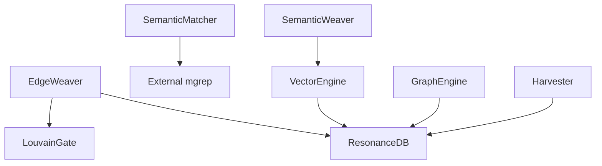
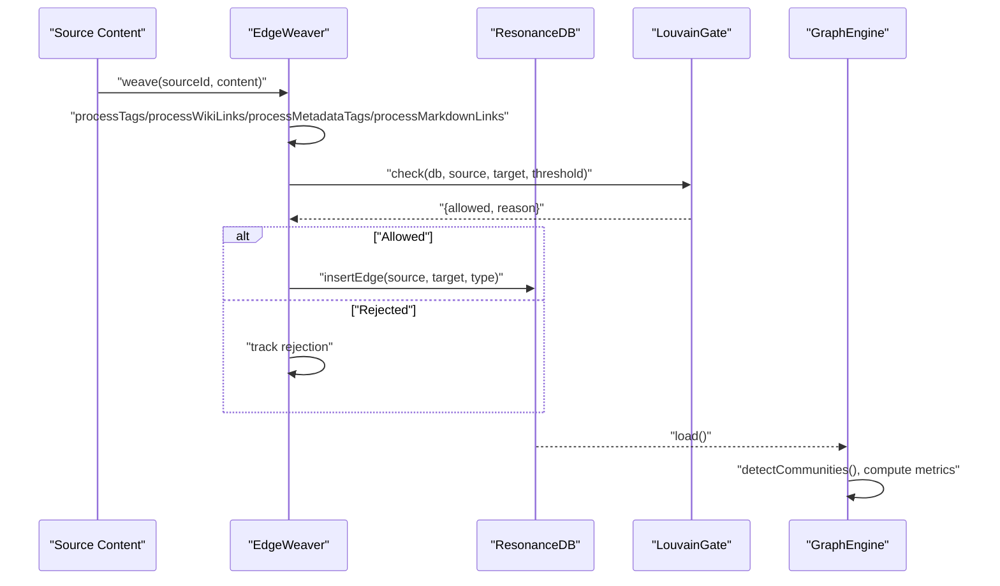
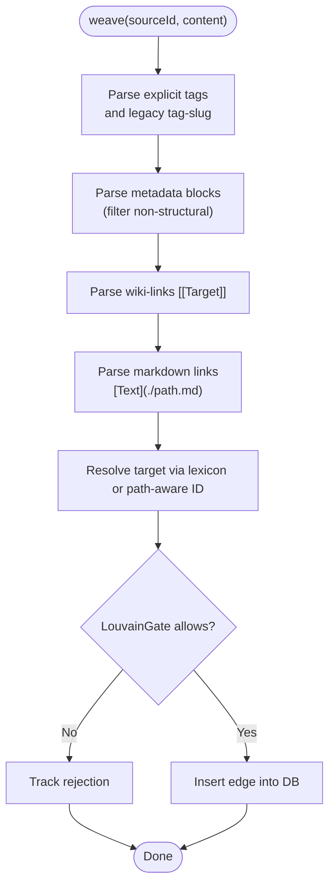
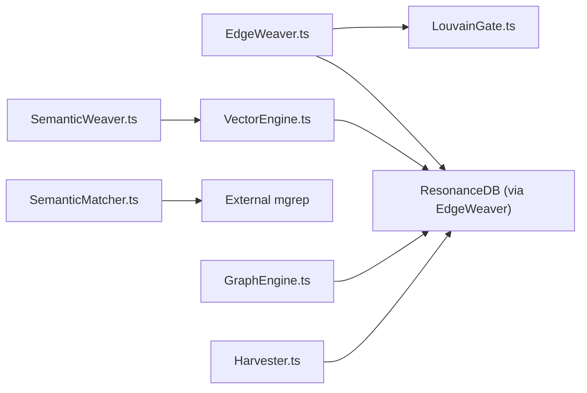

# Edge Weaving and Relationship Discovery

<cite>
**Referenced Files in This Document**
- [EdgeWeaver.ts](file://src/core/EdgeWeaver.ts)
- [SemanticMatcher.ts](file://src/core/SemanticMatcher.ts)
- [FractureLogic.ts](file://src/core/FractureLogic.ts)
- [LouvainGate.ts](file://src/core/LouvainGate.ts)
- [GraphEngine.ts](file://src/core/GraphEngine.ts)
- [SemanticWeaver.ts](file://src/core/SemanticWeaver.ts)
- [VectorEngine.ts](file://src/core/VectorEngine.ts)
- [Harvester.ts](file://src/core/Harvester.ts)
</cite>

## Table of Contents
1. [Introduction](#introduction)
2. [Project Structure](#project-structure)
3. [Core Components](#core-components)
4. [Architecture Overview](#architecture-overview)
5. [Detailed Component Analysis](#detailed-component-analysis)
6. [Dependency Analysis](#dependency-analysis)
7. [Performance Considerations](#performance-considerations)
8. [Troubleshooting Guide](#troubleshooting-guide)
9. [Conclusion](#conclusion)
10. [Appendices](#appendices)

## Introduction
This document explains Amalfa’s edge weaving and relationship discovery system. It focuses on how EdgeWeaver discovers semantic relationships between nodes using explicit markup and path-aware identification, how SemanticMatcher identifies candidate connections via a fuzzy search tool, and how FractureLogic supports text segmentation for discovery. It documents the relationship scoring and confidence mechanisms, the prevention of super-node collapse using Louvain clustering, and the edge creation process including edge types, properties, and metadata. Practical examples illustrate custom matching rules, edge filtering criteria, and troubleshooting common issues.

## Project Structure
The edge weaving system spans several core modules:
- EdgeWeaver: Extracts explicit semantic signals from content and inserts edges after conflict checks.
- SemanticMatcher: Finds candidate relationships using an external search tool.
- FractureLogic: Provides regex-based segmentation primitives for text splitting.
- LouvainGate: Enforces structural balance by preventing edges into high-degree “super nodes” without triadic closure.
- GraphEngine: Loads the graph into memory and computes structural measures (including Louvain communities) to guide discovery.
- SemanticWeaver: Rescues orphan nodes by connecting them to semantically similar nodes using vector similarity.
- VectorEngine: Generates FAFCAS-compliant embeddings and performs fast similarity search.
- Harvester: Scans content for legacy tag tokens to seed discovery.

**Diagram sources**
- [EdgeWeaver.ts](file://src/core/EdgeWeaver.ts#L1-L194)
- [LouvainGate.ts](file://src/core/LouvainGate.ts#L1-L68)
- [SemanticMatcher.ts](file://src/core/SemanticMatcher.ts#L1-L90)
- [SemanticWeaver.ts](file://src/core/SemanticWeaver.ts#L1-L97)
- [VectorEngine.ts](file://src/core/VectorEngine.ts#L1-L242)
- [GraphEngine.ts](file://src/core/GraphEngine.ts#L1-L314)
- [Harvester.ts](file://src/core/Harvester.ts#L1-L74)

**Section sources**
- [EdgeWeaver.ts](file://src/core/EdgeWeaver.ts#L1-L194)
- [LouvainGate.ts](file://src/core/LouvainGate.ts#L1-L68)
- [SemanticMatcher.ts](file://src/core/SemanticMatcher.ts#L1-L90)
- [SemanticWeaver.ts](file://src/core/SemanticWeaver.ts#L1-L97)
- [VectorEngine.ts](file://src/core/VectorEngine.ts#L1-L242)
- [GraphEngine.ts](file://src/core/GraphEngine.ts#L1-L314)
- [Harvester.ts](file://src/core/Harvester.ts#L1-L74)

## Core Components
- EdgeWeaver: Scans content for explicit semantic markers (tags, wiki links, metadata blocks, markdown links), resolves targets via a lexicon and path-aware ID generation, and inserts edges after LouvainGate approval.
- SemanticMatcher: Executes fuzzy semantic search against a corpus to surface candidate matches with content snippets and scores.
- FractureLogic: Supplies regex patterns for prioritized segmentation (pivot transitions, enumerations, digressions, sentence boundaries).
- LouvainGate: Prevents edges into “super nodes” unless there is triadic closure (shared neighbor), enforcing local modularity.
- GraphEngine: Loads the graph into memory, computes centrality, communities, and structural indices (e.g., Adamic-Adar) to guide discovery.
- SemanticWeaver: Connects orphan nodes with embeddings to similar nodes using dot-product similarity.
- VectorEngine: Produces FAFCAS-compliant embeddings and performs high-throughput similarity search.
- Harvester: Enumerates legacy tag tokens to seed discovery and prune known concepts.

**Section sources**
- [EdgeWeaver.ts](file://src/core/EdgeWeaver.ts#L1-L194)
- [SemanticMatcher.ts](file://src/core/SemanticMatcher.ts#L1-L90)
- [FractureLogic.ts](file://src/core/FractureLogic.ts#L1-L23)
- [LouvainGate.ts](file://src/core/LouvainGate.ts#L1-L68)
- [GraphEngine.ts](file://src/core/GraphEngine.ts#L1-L314)
- [SemanticWeaver.ts](file://src/core/SemanticWeaver.ts#L1-L97)
- [VectorEngine.ts](file://src/core/VectorEngine.ts#L1-L242)
- [Harvester.ts](file://src/core/Harvester.ts#L1-L74)

## Architecture Overview
The edge weaving pipeline integrates explicit markup parsing, semantic candidate discovery, and structural safeguards:

**Diagram sources**
- [EdgeWeaver.ts](file://src/core/EdgeWeaver.ts#L54-L181)
- [LouvainGate.ts](file://src/core/LouvainGate.ts#L15-L36)
- [GraphEngine.ts](file://src/core/GraphEngine.ts#L50-L100)

## Detailed Component Analysis

### EdgeWeaver: Explicit Markup Parsing and Edge Insertion
EdgeWeaver scans content for:
- Explicit tags: [tag: Concept] syntax
- Legacy tags: tag-slug format
- Metadata blocks: <!-- tags: [RELATION: Target] --> with filtering for non-structural keys
- Wiki-links: [[Target]]
- Markdown links: [Text](./path.md) excluding external URLs

It resolves targets via a lexicon built from IDs, slugs, and aliases, and falls back to path-aware ID generation. Edges are inserted only if approved by LouvainGate.

Key behaviors:
- Strict parsing modes for explicit semantics
- Slug normalization for robust matching
- Path-aware ID generation for markdown-linked files
- Rejection tracking for downstream reporting

Edge types observed during weaving:
- TAGGED_AS
- EXEMPLIFIES
- CITES
- LINKS_TO

Confidence and filtering:
- No explicit numeric confidence threshold is applied in weaving; edges are filtered by LouvainGate and lexicon resolution quality.

Preventing super-node collapse:
- Approved edges are inserted directly; LouvainGate rejects edges into high-degree nodes unless triadic closure exists.

**Section sources**
- [EdgeWeaver.ts](file://src/core/EdgeWeaver.ts#L54-L194)
- [LouvainGate.ts](file://src/core/LouvainGate.ts#L15-L36)

#### Edge Creation Flow

**Diagram sources**
- [EdgeWeaver.ts](file://src/core/EdgeWeaver.ts#L61-L166)
- [LouvainGate.ts](file://src/core/LouvainGate.ts#L15-L36)

### SemanticMatcher: Candidate Discovery via Fuzzy Search
SemanticMatcher invokes an external search tool to locate semantically similar content blocks. It parses structured output into candidate records with file, line, and content fields, returning up to a configured limit.

Scoring and confidence:
- The underlying tool reports a percentage match; SemanticMatcher extracts this value and includes it in parsed results.
- Confidence thresholding is not performed inside SemanticMatcher; downstream logic decides whether to accept candidates.

Custom matching rules:
- Adjust the external tool invocation (command, flags) to tune recall/precision.
- Modify the limit parameter to control candidate volume.
- Post-process parsed content to apply custom filters (e.g., exclude noisy separators).

**Section sources**
- [SemanticMatcher.ts](file://src/core/SemanticMatcher.ts#L16-L88)

### FractureLogic: Text Segmentation Primitives
FractureLogic defines regex patterns for splitting text into meaningful segments:
- Priority A: Structural pivots (e.g., However, Therefore)
- Priority B: Enumerations (numbered/lettered/bulleted lists)
- Priority C: Digressions (Note:, Edit:, Update:)
- Fallback: Sentence boundaries

These patterns underpin higher-level segmentation strategies and can be combined to split content prior to discovery.

**Section sources**
- [FractureLogic.ts](file://src/core/FractureLogic.ts#L8-L22)

### LouvainGate: Conflict Resolution and Super-Node Prevention
LouvainGate enforces a structural safeguard:
- A node is considered a “super node” if it exceeds a configurable degree threshold.
- An edge into a super node is rejected unless the source and target share at least one neighbor (triadic closure).
- The decision is returned with a reason string for diagnostics.

Tuning:
- The threshold is configurable and defaults to a fixed value; it can be adjusted per deployment.

**Section sources**
- [LouvainGate.ts](file://src/core/LouvainGate.ts#L15-L66)

### GraphEngine: In-Memory Graph and Metrics
GraphEngine loads nodes and edges into memory and exposes:
- Community detection via Louvain
- Centrality metrics (PageRank, Betweenness)
- Structural indices (Adamic-Adar)
- Shortest path computation
- Traversal and integrity checks

Discovery guidance:
- Communities reveal cohesive groups; focus weaving within or across communities based on goals.
- Adamic-Adar highlights structurally promising pairs not yet connected.
- Pillar identification (high PageRank) helps prioritize hubs.

**Section sources**
- [GraphEngine.ts](file://src/core/GraphEngine.ts#L50-L100)
- [GraphEngine.ts](file://src/core/GraphEngine.ts#L178-L238)
- [GraphEngine.ts](file://src/core/GraphEngine.ts#L244-L255)

### SemanticWeaver: Rescuing Orphans with Vector Similarity
SemanticWeaver rescues nodes with embeddings but no incident edges by connecting them to semantically similar nodes:
- Identifies orphans with available embeddings and excludes root/domain types.
- Computes dot products against candidate nodes (e.g., experience or note nodes).
- Inserts RELATED_TO edges for matches exceeding a similarity threshold.

Threshold tuning:
- The threshold is applied when selecting best matches; adjust based on embedding quality and domain characteristics.

**Section sources**
- [SemanticWeaver.ts](file://src/core/SemanticWeaver.ts#L10-L96)
- [VectorEngine.ts](file://src/core/VectorEngine.ts#L58-L74)

### VectorEngine: Embedding Generation and Search
VectorEngine:
- Embeds text using a fast embedding model and normalizes to unit length (FAFCAS protocol).
- Stores embeddings as BLOBs and supports similarity search using dot products.
- Hydrates metadata for top-k results.

Performance:
- Zero-copy views over BLOBs minimize allocations.
- Threshold filtering reduces candidate sets.

**Section sources**
- [VectorEngine.ts](file://src/core/VectorEngine.ts#L115-L139)
- [VectorEngine.ts](file://src/core/VectorEngine.ts#L159-L240)

### Harvester: Legacy Tag Token Enumeration
Harvester scans directories for legacy tag tokens and:
- Builds a tag-to-files map
- Filters out known concepts present in the lexicon
- Sorts by frequency for prioritization

This primes discovery by surfacing unclassified concepts and their occurrences.

**Section sources**
- [Harvester.ts](file://src/core/Harvester.ts#L16-L73)

## Dependency Analysis
The following diagram shows module-level dependencies among the core components involved in edge weaving and discovery:

**Diagram sources**
- [EdgeWeaver.ts](file://src/core/EdgeWeaver.ts#L1-L194)
- [LouvainGate.ts](file://src/core/LouvainGate.ts#L1-L68)
- [SemanticMatcher.ts](file://src/core/SemanticMatcher.ts#L1-L90)
- [SemanticWeaver.ts](file://src/core/SemanticWeaver.ts#L1-L97)
- [VectorEngine.ts](file://src/core/VectorEngine.ts#L1-L242)
- [GraphEngine.ts](file://src/core/GraphEngine.ts#L1-L314)
- [Harvester.ts](file://src/core/Harvester.ts#L1-L74)

**Section sources**
- [EdgeWeaver.ts](file://src/core/EdgeWeaver.ts#L1-L194)
- [LouvainGate.ts](file://src/core/LouvainGate.ts#L1-L68)
- [SemanticMatcher.ts](file://src/core/SemanticMatcher.ts#L1-L90)
- [SemanticWeaver.ts](file://src/core/SemanticWeaver.ts#L1-L97)
- [VectorEngine.ts](file://src/core/VectorEngine.ts#L1-L242)
- [GraphEngine.ts](file://src/core/GraphEngine.ts#L1-L314)
- [Harvester.ts](file://src/core/Harvester.ts#L1-L74)

## Performance Considerations
- Prefer explicit semantic markup for deterministic, low-latency edge insertion.
- Use GraphEngine to precompute communities and centrality to guide targeted weaving.
- Tune the super-node threshold to balance connectivity and modularity.
- For SemanticMatcher, cap the limit to control downstream processing costs.
- VectorEngine’s dot product is O(n) per candidate; apply early filtering and limit top-k to reduce IO.
- Leverage path-aware ID generation to avoid repeated lexicon lookups.

## Troubleshooting Guide
Common issues and resolutions:
- Edges being rejected:
  - Cause: Target is a super node without shared neighbors.
  - Action: Introduce a bridging node or connect the source to a neighbor of the target to establish triadic closure.
  - Reference: [LouvainGate.ts](file://src/core/LouvainGate.ts#L24-L33)

- Low-confidence semantic matches:
  - Cause: Underlying tool threshold too strict or noisy output.
  - Action: Adjust external tool parameters or post-filter parsed content.
  - Reference: [SemanticMatcher.ts](file://src/core/SemanticMatcher.ts#L24-L42)

- Orphan nodes not connected:
  - Cause: Insufficient similarity or embedding quality.
  - Action: Lower the similarity threshold slightly or improve embeddings.
  - Reference: [SemanticWeaver.ts](file://src/core/SemanticWeaver.ts#L77-L82)

- Excessive edge density causing collapse:
  - Action: Increase the super-node threshold or apply community-aware weaving.
  - Reference: [LouvainGate.ts](file://src/core/LouvainGate.ts#L19-L22), [GraphEngine.ts](file://src/core/GraphEngine.ts#L131-L133)

- Legacy tag-slug warnings:
  - Action: Migrate to [tag: Concept] syntax for clarity and future-proofing.
  - Reference: [EdgeWeaver.ts](file://src/core/EdgeWeaver.ts#L83-L86)

## Conclusion
Amalfa’s edge weaving system combines explicit semantic markup parsing, fuzzy candidate discovery, and structural safeguards to build a robust knowledge graph. EdgeWeaver ensures high-quality connections through lexicon resolution and LouvainGate enforcement. SemanticMatcher and SemanticWeaver complement explicit signals with semantic similarity. GraphEngine provides in-memory analytics to guide discovery and maintain modularity. Together, these components form a scalable, principled approach to relationship discovery.

## Appendices

### Edge Types and Properties
- TAGGED_AS: Explicit semantic tagging of a node.
- EXEMPLIFIES: Legacy exemplification via tag-slug.
- CITES: Wiki-link references.
- LINKS_TO: Internal markdown link references.
- RELATED_TO: Semantic similarity-based connection for orphans.

Edge metadata:
- Type is recorded per edge.
- No additional properties are set during weaving; metadata enrichment occurs elsewhere.

**Section sources**
- [EdgeWeaver.ts](file://src/core/EdgeWeaver.ts#L74-L164)
- [SemanticWeaver.ts](file://src/core/SemanticWeaver.ts#L86-L87)

### Relationship Scoring and Confidence Thresholds
- Explicit weaving does not apply numeric confidence thresholds; decisions rely on lexicon resolution and LouvainGate.
- SemanticMatcher reports a percentage match; downstream logic selects candidates based on thresholds.
- SemanticWeaver applies a similarity threshold when choosing best matches.

**Section sources**
- [SemanticMatcher.ts](file://src/core/SemanticMatcher.ts#L53-L88)
- [SemanticWeaver.ts](file://src/core/SemanticWeaver.ts#L77-L82)

### Examples: Custom Matching Rules and Filtering
- External tool invocation customization:
  - Modify the command array and flags passed to the search tool.
  - Reference: [SemanticMatcher.ts](file://src/core/SemanticMatcher.ts#L24-L30)
- Limit adjustment:
  - Control the number of candidates returned.
  - Reference: [SemanticMatcher.ts](file://src/core/SemanticMatcher.ts#L19-L20)
- Metadata block filtering:
  - Exclude non-structural relations in metadata blocks.
  - Reference: [EdgeWeaver.ts](file://src/core/EdgeWeaver.ts#L112-L114)
- Community-aware weaving:
  - Use GraphEngine communities to constrain weaving to cohesive groups.
  - Reference: [GraphEngine.ts](file://src/core/GraphEngine.ts#L260-L269)