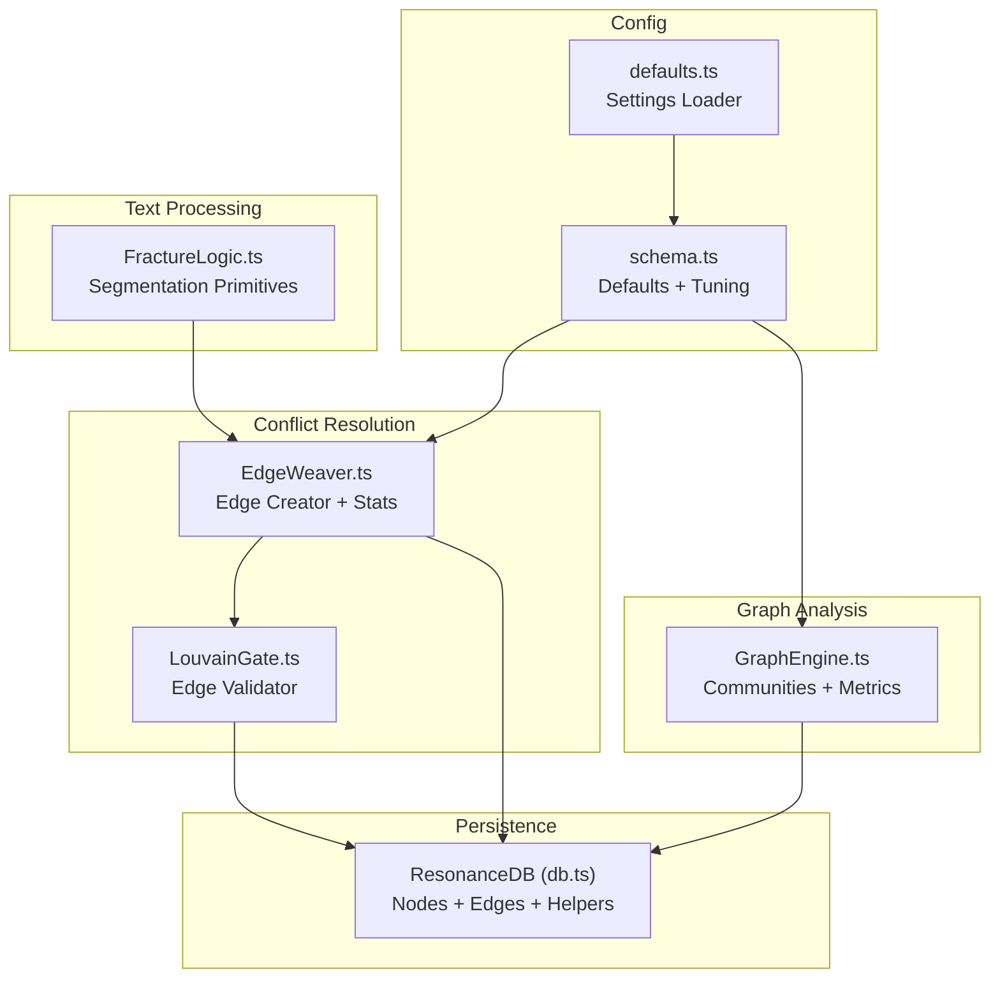
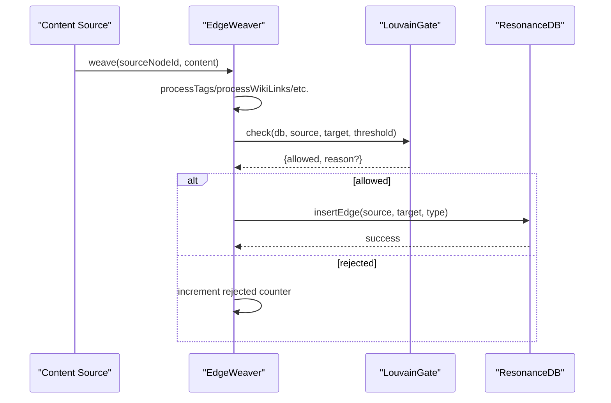
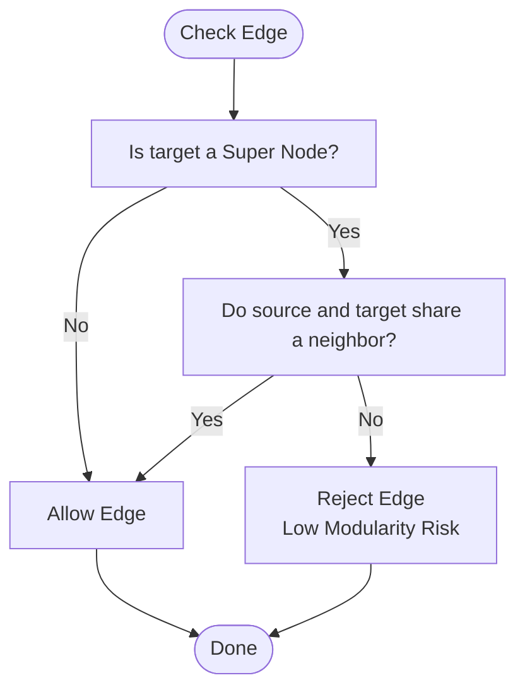
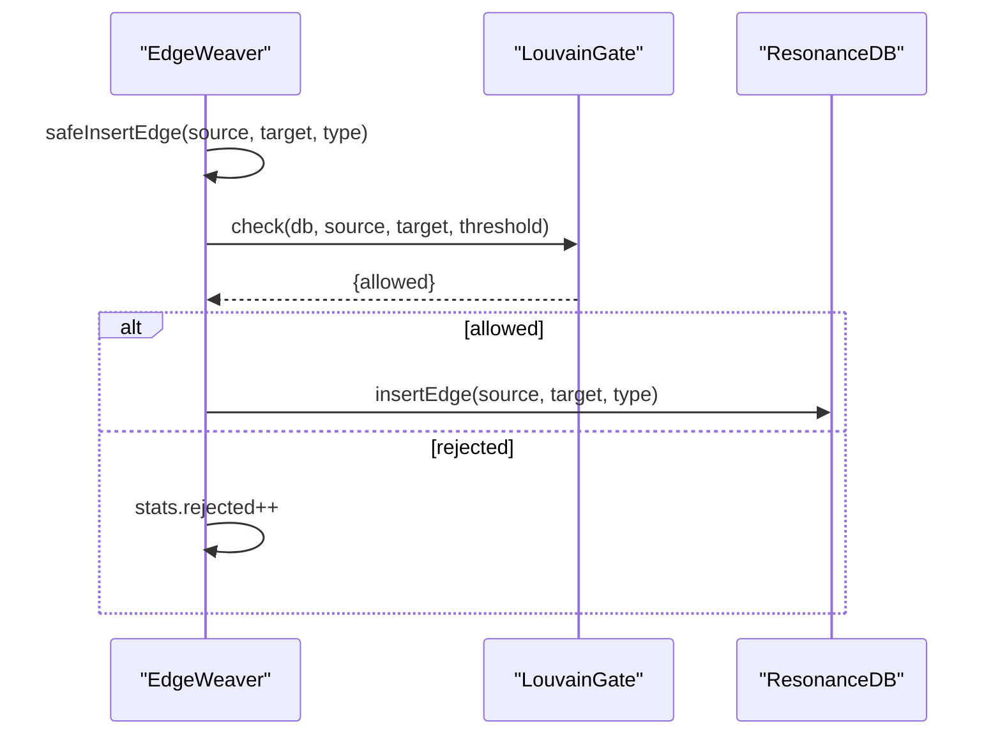
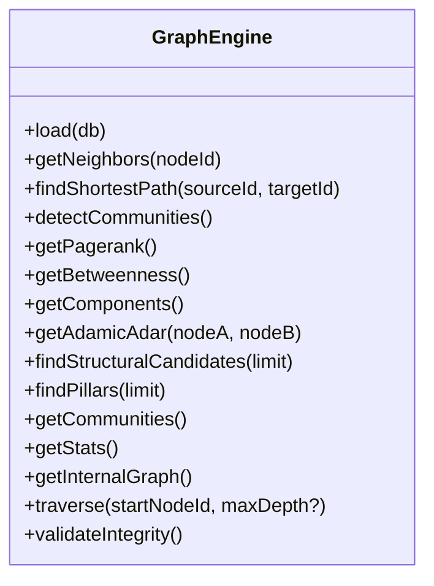
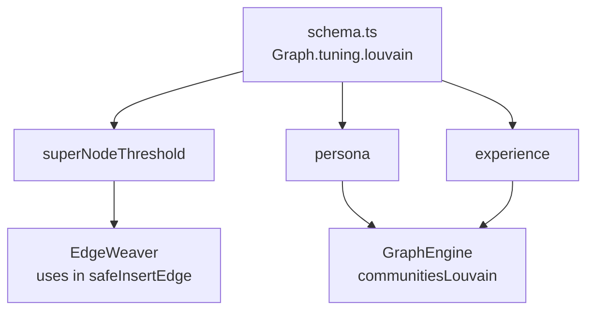
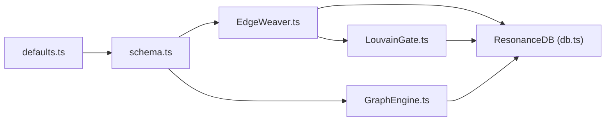

# Fracture Logic and Conflict Resolution

<cite>
**Referenced Files in This Document**
- [FractureLogic.ts](file://src/core/FractureLogic.ts)
- [LouvainGate.ts](file://src/core/LouvainGate.ts)
- [EdgeWeaver.ts](file://src/core/EdgeWeaver.ts)
- [GraphEngine.ts](file://src/core/GraphEngine.ts)
- [db.ts](file://src/resonance/db.ts)
- [schema.ts](file://src/config/schema.ts)
- [defaults.ts](file://src/config/defaults.ts)
- [validate.ts](file://public/cli/commands/validate.ts)
- [verify_graph_integrity.ts](file://scripts/verify/verify_graph_integrity.ts)
- [louvain_config.test.ts](file://tests/louvain_config.test.ts)
- [strategies.test.ts](file://tests/strategies.test.ts)
</cite>

## Table of Contents
1. [Introduction](#introduction)
2. [Project Structure](#project-structure)
3. [Core Components](#core-components)
4. [Architecture Overview](#architecture-overview)
5. [Detailed Component Analysis](#detailed-component-analysis)
6. [Dependency Analysis](#dependency-analysis)
7. [Performance Considerations](#performance-considerations)
8. [Troubleshooting Guide](#troubleshooting-guide)
9. [Conclusion](#conclusion)

## Introduction
This document explains Amalfa’s Fracture Logic and conflict resolution mechanisms with a focus on preventing graph fragmentation and maintaining structural coherence during edge creation. It details the conflict detection algorithms, edge validation rules, and automatic resolution strategies. It also clarifies the relationship between Fracture Logic and Louvain clustering in preserving graph stability, and provides configuration options for tuning conflict tolerance levels across different knowledge graph structures.

## Project Structure
The relevant subsystems for Fracture Logic and conflict resolution are organized around:
- Fracture Logic: Text segmentation primitives used to maintain coherent chunks during content processing.
- LouvainGate: A prescriptive constraint that rejects edges to “super nodes” unless triadic closure is satisfied.
- EdgeWeaver: Orchestrates edge creation while applying LouvainGate checks and tracking statistics.
- GraphEngine: In-memory graph analysis and community detection used to monitor stability and guide structural decisions.
- ResonanceDB: Persistent storage for nodes and edges, providing transactional inserts and integrity helpers.
- Configuration: Centralized schema defining Louvain tuning parameters and defaults.

**Diagram sources**
- [FractureLogic.ts](file://src/core/FractureLogic.ts#L1-L23)
- [LouvainGate.ts](file://src/core/LouvainGate.ts#L1-L68)
- [EdgeWeaver.ts](file://src/core/EdgeWeaver.ts#L1-L194)
- [GraphEngine.ts](file://src/core/GraphEngine.ts#L1-L314)
- [db.ts](file://src/resonance/db.ts#L1-L488)
- [schema.ts](file://src/config/schema.ts#L119-L133)
- [defaults.ts](file://src/config/defaults.ts#L84-L143)

**Section sources**
- [FractureLogic.ts](file://src/core/FractureLogic.ts#L1-L23)
- [LouvainGate.ts](file://src/core/LouvainGate.ts#L1-L68)
- [EdgeWeaver.ts](file://src/core/EdgeWeaver.ts#L1-L194)
- [GraphEngine.ts](file://src/core/GraphEngine.ts#L1-L314)
- [db.ts](file://src/resonance/db.ts#L1-L488)
- [schema.ts](file://src/config/schema.ts#L119-L133)
- [defaults.ts](file://src/config/defaults.ts#L84-L143)

## Core Components
- Fracture Logic: Defines regex-based segmentation rules for splitting text into coherent chunks. These rules help prevent fragmented graph nodes by ensuring sentence boundaries and structural cues are respected during content ingestion.
- LouvainGate: Enforces a structural constraint that rejects edges to “super nodes” (nodes with high degree) unless the source and target share at least one neighbor. This preserves modularity and avoids destabilizing hubs.
- EdgeWeaver: Coordinates edge creation from content, applies LouvainGate checks, and records statistics on accepted vs. rejected edges.
- GraphEngine: Loads the graph into memory, computes communities via Louvain, and exposes metrics to monitor stability and coherence.
- ResonanceDB: Provides transactional edge insertion and utility functions for integrity checks and ID generation.
- Configuration: Central schema defines Louvain tuning parameters (including super node threshold) and defaults.

**Section sources**
- [FractureLogic.ts](file://src/core/FractureLogic.ts#L6-L22)
- [LouvainGate.ts](file://src/core/LouvainGate.ts#L15-L36)
- [EdgeWeaver.ts](file://src/core/EdgeWeaver.ts#L168-L181)
- [GraphEngine.ts](file://src/core/GraphEngine.ts#L129-L171)
- [db.ts](file://src/resonance/db.ts#L140-L159)
- [schema.ts](file://src/config/schema.ts#L119-L133)

## Architecture Overview
The edge creation pipeline integrates Fracture Logic and LouvainGate to maintain structural coherence:

**Diagram sources**
- [EdgeWeaver.ts](file://src/core/EdgeWeaver.ts#L54-L59)
- [EdgeWeaver.ts](file://src/core/EdgeWeaver.ts#L168-L181)
- [LouvainGate.ts](file://src/core/LouvainGate.ts#L15-L36)
- [db.ts](file://src/resonance/db.ts#L140-L159)

## Detailed Component Analysis

### Fracture Logic
Fracture Logic provides regex-based segmentation rules to maintain textual coherence during content ingestion. These rules prioritize:
- Structural pivots (e.g., “However,” “Therefore,”) to preserve argumentative transitions.
- Enumerations (numbered/lettered lists, bullets) to keep structured lists intact.
- Notes/edits to avoid fragmenting editorial remarks.
- Sentence boundaries as a fallback to ensure grammatical coherence.

These primitives reduce the risk of creating fragmented nodes and edges by keeping semantically cohesive units together.

**Section sources**
- [FractureLogic.ts](file://src/core/FractureLogic.ts#L6-L22)

### Conflict Detection and Resolution: LouvainGate
LouvainGate enforces a modularity-preserving constraint:
- If the target node is a “super node” (degree exceeds threshold), the edge is allowed only if the source and target share at least one neighbor (triadic closure).
- Otherwise, the edge is rejected with a reason indicating low modularity risk.

This mechanism prevents destabilizing hubs from attracting arbitrary connections, thereby reducing fragmentation and preserving cluster cohesion.

**Diagram sources**
- [LouvainGate.ts](file://src/core/LouvainGate.ts#L15-L36)

**Section sources**
- [LouvainGate.ts](file://src/core/LouvainGate.ts#L15-L66)

### Edge Creation Workflow and Statistics
EdgeWeaver orchestrates edge creation from content:
- Processes explicit tags, legacy tags, metadata blocks, wiki-links, and markdown links.
- For each candidate edge, invokes LouvainGate.check and conditionally inserts via ResonanceDB.
- Tracks counters for checked and rejected edges.

**Diagram sources**
- [EdgeWeaver.ts](file://src/core/EdgeWeaver.ts#L168-L181)
- [LouvainGate.ts](file://src/core/LouvainGate.ts#L15-L36)
- [db.ts](file://src/resonance/db.ts#L140-L159)

**Section sources**
- [EdgeWeaver.ts](file://src/core/EdgeWeaver.ts#L54-L59)
- [EdgeWeaver.ts](file://src/core/EdgeWeaver.ts#L168-L181)

### Relationship Between Louvain Clustering and Graph Stability
GraphEngine detects communities using Louvain and exposes metrics that inform stability:
- Communities: Cluster assignments for nodes.
- Pagerank and Betweenness: Node centrality measures useful for identifying authorities and bridges.
- Components: Connected components count to detect fragmentation.
- Adamic-Adar: Structural candidate scoring to propose edges that strengthen ties between nodes sharing specific neighbors.

These metrics enable proactive monitoring and intervention to maintain structural coherence.

**Diagram sources**
- [GraphEngine.ts](file://src/core/GraphEngine.ts#L39-L314)

**Section sources**
- [GraphEngine.ts](file://src/core/GraphEngine.ts#L129-L171)
- [GraphEngine.ts](file://src/core/GraphEngine.ts#L174-L238)
- [GraphEngine.ts](file://src/core/GraphEngine.ts#L244-L255)
- [GraphEngine.ts](file://src/core/GraphEngine.ts#L260-L269)
- [GraphEngine.ts](file://src/core/GraphEngine.ts#L274-L281)
- [GraphEngine.ts](file://src/core/GraphEngine.ts#L293-L312)

### Configuration Options for Conflict Tolerance
The configuration schema defines tunable parameters:
- superNodeThreshold: Degree threshold to classify a node as a “super node.”
- persona and experience: Louvain resolution parameters used by GraphEngine for community detection.

These parameters influence how aggressively the system enforces structural constraints and partitions the graph.

**Diagram sources**
- [schema.ts](file://src/config/schema.ts#L119-L133)
- [EdgeWeaver.ts](file://src/core/EdgeWeaver.ts#L7-L21)
- [GraphEngine.ts](file://src/core/GraphEngine.ts#L129-L133)

**Section sources**
- [schema.ts](file://src/config/schema.ts#L119-L133)
- [EdgeWeaver.ts](file://src/core/EdgeWeaver.ts#L7-L21)
- [GraphEngine.ts](file://src/core/GraphEngine.ts#L129-L133)

## Dependency Analysis
Key dependencies and interactions:
- EdgeWeaver depends on LouvainGate and ResonanceDB to validate and persist edges.
- LouvainGate queries the database to determine degrees and shared neighbors.
- GraphEngine depends on Graphology libraries for community detection and metrics.
- Configuration is loaded via defaults.ts and validated by schema.ts.

**Diagram sources**
- [EdgeWeaver.ts](file://src/core/EdgeWeaver.ts#L1-L194)
- [LouvainGate.ts](file://src/core/LouvainGate.ts#L1-L68)
- [db.ts](file://src/resonance/db.ts#L1-L488)
- [GraphEngine.ts](file://src/core/GraphEngine.ts#L1-L314)
- [schema.ts](file://src/config/schema.ts#L119-L133)
- [defaults.ts](file://src/config/defaults.ts#L84-L143)

**Section sources**
- [EdgeWeaver.ts](file://src/core/EdgeWeaver.ts#L1-L194)
- [LouvainGate.ts](file://src/core/LouvainGate.ts#L1-L68)
- [GraphEngine.ts](file://src/core/GraphEngine.ts#L1-L314)
- [db.ts](file://src/resonance/db.ts#L1-L488)
- [schema.ts](file://src/config/schema.ts#L119-L133)
- [defaults.ts](file://src/config/defaults.ts#L84-L143)

## Performance Considerations
- In-memory graph analysis: GraphEngine loads nodes and edges into memory for fast traversal and metrics computation, minimizing database overhead during analysis.
- Community detection: Louvain is efficient for large graphs; tune resolution parameters to balance granularity and interpretability.
- Edge validation: LouvainGate performs lightweight SQL queries to check degrees and shared neighbors; batching and indexing can further improve performance.
- Transactions: Use ResonanceDB.begin/commit/rollback to batch edge insertions and maintain atomicity.

[No sources needed since this section provides general guidance]

## Troubleshooting Guide
Common issues and resolutions:
- Excessive edge growth on a single node (“hairball”): Indicates overly permissive edge creation. Lower the superNodeThreshold or review content extraction rules.
- Too few edges: May indicate overly strict thresholds or missing structural signals. Adjust thresholds and ensure Fracture Logic segmentation captures relevant cues.
- Orphaned edges: Validate graph integrity and remove dangling edges.
- Self-loops: Investigate content processing logic to avoid linking nodes to themselves.

Diagnostic utilities:
- CLI validation: Reports dangling edges, self-loops, and super nodes exceeding threshold.
- Integrity verification script: Confirms super-node containment and warns on anomalies.

**Section sources**
- [validate.ts](file://public/cli/commands/validate.ts#L42-L87)
- [verify_graph_integrity.ts](file://scripts/verify/verify_graph_integrity.ts#L80-L101)

## Conclusion
Amalfa’s Fracture Logic and LouvainGate work together to prevent graph fragmentation and maintain structural coherence during edge creation. Fracture Logic ensures textual coherence, while LouvainGate enforces modularity-preserving constraints. EdgeWeaver coordinates validation and persistence, and GraphEngine provides stability metrics. Configuration parameters allow tuning conflict tolerance to suit diverse knowledge graph structures.