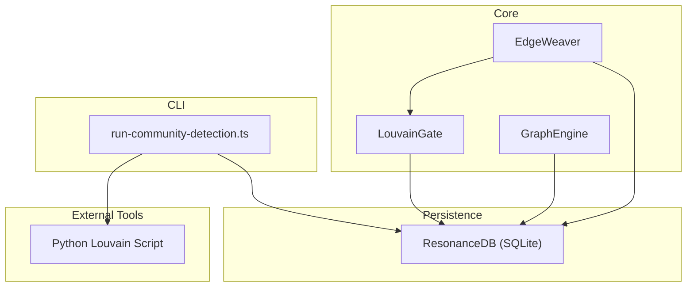
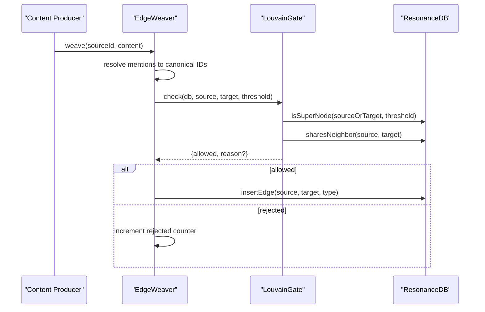
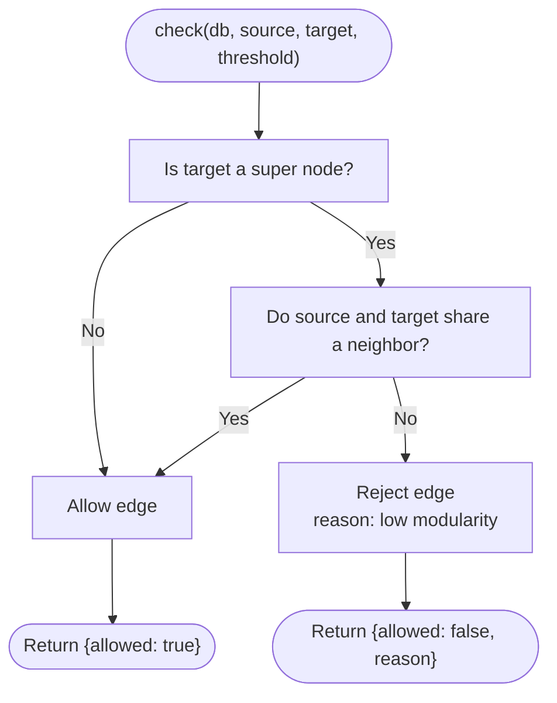
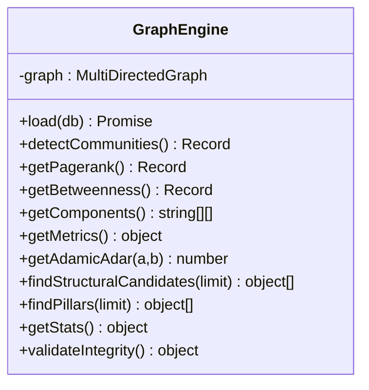
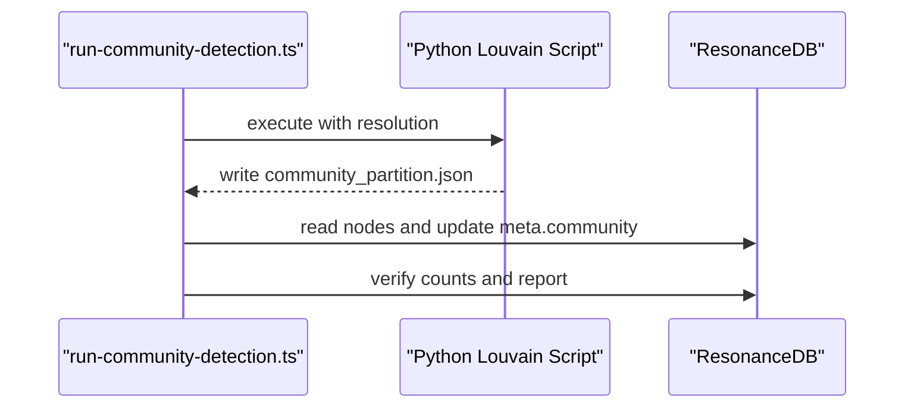
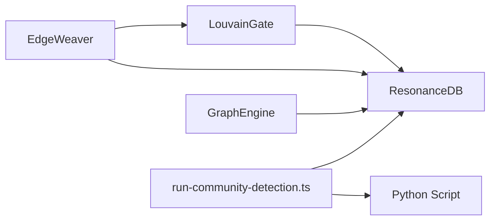

# Louvain Clustering and Super-Node Prevention

<cite>
**Referenced Files in This Document**
- [LouvainGate.ts](file://src/core/LouvainGate.ts)
- [EdgeWeaver.ts](file://src/core/EdgeWeaver.ts)
- [GraphEngine.ts](file://src/core/GraphEngine.ts)
- [run-community-detection.ts](file://scripts/run-community-detection.ts)
- [louvain_config.test.ts](file://tests/louvain_config.test.ts)
- [weaver.test.ts](file://tests/weaver.test.ts)
- [Graph and Vector Database Best Practices.md.bak](file://docs/references/Graph and Vector Database Best Practices.md.bak)
- [graphology-playbook.md](file://public/docs/playbooks/graphology-playbook.md)
</cite>

## Table of Contents
1. [Introduction](#introduction)
2. [Project Structure](#project-structure)
3. [Core Components](#core-components)
4. [Architecture Overview](#architecture-overview)
5. [Detailed Component Analysis](#detailed-component-analysis)
6. [Dependency Analysis](#dependency-analysis)
7. [Performance Considerations](#performance-considerations)
8. [Troubleshooting Guide](#troubleshooting-guide)
9. [Conclusion](#conclusion)
10. [Appendices](#appendices)

## Introduction
This document explains Amalfa’s Louvain clustering integration and the super-node prevention mechanism centered on the LouvainGate. It details how the system enforces local modularity constraints during edge creation to prevent “super-node” collapse, how community detection is performed and persisted, and how thresholds and statistics are managed. It also provides practical guidance on tuning thresholds for different document sizes, understanding performance impacts on large knowledge graphs, and troubleshooting clustering-related issues.

## Project Structure
The Louvain integration spans several modules:
- EdgeWeaver orchestrates safe edge insertion and delegates to LouvainGate for super-node checks.
- LouvainGate enforces triadic closure for high-degree targets and computes whether a node qualifies as a super-node.
- GraphEngine performs in-memory community detection and other graph analytics.
- run-community-detection.ts executes a Python-based Louvain pipeline and persists community IDs into the node metadata.
- Tests validate configuration, statistics tracking, and behavior under various scenarios.



**Diagram sources**
- [EdgeWeaver.ts](file://src/core/EdgeWeaver.ts#L1-L194)
- [LouvainGate.ts](file://src/core/LouvainGate.ts#L1-L68)
- [GraphEngine.ts](file://src/core/GraphEngine.ts#L1-L314)
- [run-community-detection.ts](file://scripts/run-community-detection.ts#L1-L155)

**Section sources**
- [EdgeWeaver.ts](file://src/core/EdgeWeaver.ts#L1-L194)
- [LouvainGate.ts](file://src/core/LouvainGate.ts#L1-L68)
- [GraphEngine.ts](file://src/core/GraphEngine.ts#L1-L314)
- [run-community-detection.ts](file://scripts/run-community-detection.ts#L1-L155)

## Core Components
- LouvainGate: Enforces a local modularity constraint by rejecting edges to “super nodes” unless triadic closure is satisfied. It exposes methods to detect super nodes and to check for shared neighbors.
- EdgeWeaver: Integrates with the knowledge graph construction pipeline. It resolves mentions to canonical IDs, then safely inserts edges while applying LouvainGate checks and tracking statistics.
- GraphEngine: Performs in-memory graph analytics including Louvain community detection, PageRank, betweenness centrality, and connected components.
- run-community-detection.ts: Orchestrates a Python-based Louvain computation and persists community IDs into node metadata.

Key configuration and behavior:
- superNodeThreshold: Controls the degree threshold to qualify a node as a “super node.” Defaults to 50 and can be overridden via configuration.
- Statistics tracking: EdgeWeaver counts total checks and rejections for visibility into enforcement effectiveness.

**Section sources**
- [LouvainGate.ts](file://src/core/LouvainGate.ts#L1-L68)
- [EdgeWeaver.ts](file://src/core/EdgeWeaver.ts#L1-L194)
- [GraphEngine.ts](file://src/core/GraphEngine.ts#L128-L133)
- [run-community-detection.ts](file://scripts/run-community-detection.ts#L1-L155)
- [louvain_config.test.ts](file://tests/louvain_config.test.ts#L15-L55)

## Architecture Overview
The system integrates Louvain-based constraints into the edge-creation pipeline and periodically recomputes communities for graph-wide partitioning.



**Diagram sources**
- [EdgeWeaver.ts](file://src/core/EdgeWeaver.ts#L168-L181)
- [LouvainGate.ts](file://src/core/LouvainGate.ts#L15-L36)

## Detailed Component Analysis

### LouvainGate: Super-Node Prevention and Local Modularity
LouvainGate enforces a triadic closure rule for high-degree nodes:
- If the target is a super node (degree > threshold), reject the edge unless the source and target share at least one neighbor.
- Otherwise, allow the edge.

Implementation highlights:
- isSuperNode: Counts total incident edges for a node to determine super-node status.
- sharesNeighbor: Detects shared neighbors across edges to satisfy triadic closure.



**Diagram sources**
- [LouvainGate.ts](file://src/core/LouvainGate.ts#L15-L36)

**Section sources**
- [LouvainGate.ts](file://src/core/LouvainGate.ts#L1-L68)

### EdgeWeaver: Safe Edge Insertion with Threshold and Stats
EdgeWeaver integrates mention resolution and edge insertion:
- Builds a lexicon map for slug-to-ID resolution.
- Applies LouvainGate.check with configurable superNodeThreshold.
- Tracks checked and rejected edges for observability.

```mermaid
classDiagram
class EdgeWeaver {
-db : ResonanceDB
-superNodeThreshold : number
-lexicon : Map<string,string>
-stats : {checked,rejected}
+constructor(db, context, config)
+weave(sourceId, content) void
-safeInsertEdge(source,target,type) void
+getStats() object
-slugify(text) string
}
class LouvainGate {
+check(db, source, target, threshold) object
+isSuperNode(db, id, threshold) boolean
+sharesNeighbor(db, a, b) boolean
}
EdgeWeaver --> LouvainGate : "calls check()"
```

**Diagram sources**
- [EdgeWeaver.ts](file://src/core/EdgeWeaver.ts#L5-L45)
- [EdgeWeaver.ts](file://src/core/EdgeWeaver.ts#L168-L181)
- [LouvainGate.ts](file://src/core/LouvainGate.ts#L3-L67)

**Section sources**
- [EdgeWeaver.ts](file://src/core/EdgeWeaver.ts#L1-L194)
- [louvain_config.test.ts](file://tests/louvain_config.test.ts#L15-L80)

### GraphEngine: In-Memory Community Detection and Metrics
GraphEngine loads a hollow representation of the graph from ResonanceDB and supports:
- Louvain community detection via graphology-communities-louvain.
- PageRank, betweenness centrality, connected components, and shortest path computations.
- Adamic-Adar scoring to identify structural candidates.



**Diagram sources**
- [GraphEngine.ts](file://src/core/GraphEngine.ts#L39-L314)

**Section sources**
- [GraphEngine.ts](file://src/core/GraphEngine.ts#L128-L171)

### Community Detection Pipeline: Python + Persistence
The run-community-detection.ts script:
- Executes a Python-based Louvain computation to produce a partition file.
- Loads the partition and updates node metadata with community IDs.
- Verifies persistence and reports counts.



**Diagram sources**
- [run-community-detection.ts](file://scripts/run-community-detection.ts#L24-L155)

**Section sources**
- [run-community-detection.ts](file://scripts/run-community-detection.ts#L1-L155)

## Dependency Analysis
- EdgeWeaver depends on LouvainGate for enforcement and on ResonanceDB for edge insertion.
- LouvainGate depends on ResonanceDB for degree counting and neighbor queries.
- GraphEngine depends on graphology libraries for analytics.
- run-community-detection.ts depends on a Python environment and ResonanceDB for persistence.



**Diagram sources**
- [EdgeWeaver.ts](file://src/core/EdgeWeaver.ts#L1-L3)
- [LouvainGate.ts](file://src/core/LouvainGate.ts#L1-L1)
- [GraphEngine.ts](file://src/core/GraphEngine.ts#L1-L12)
- [run-community-detection.ts](file://scripts/run-community-detection.ts#L16-L84)

**Section sources**
- [EdgeWeaver.ts](file://src/core/EdgeWeaver.ts#L1-L3)
- [LouvainGate.ts](file://src/core/LouvainGate.ts#L1-L1)
- [GraphEngine.ts](file://src/core/GraphEngine.ts#L1-L12)
- [run-community-detection.ts](file://scripts/run-community-detection.ts#L16-L84)

## Performance Considerations
- Super-node threshold tuning: Lower thresholds reduce the risk of super-node formation but may increase rejections. Higher thresholds allow more edges but risk clustering instability. Typical starting points:
  - Small corpora (< 1K nodes): 50–100
  - Medium corpora (1K–10K nodes): 100–200
  - Large corpora (> 10K nodes): 200–500
- Query complexity: LouvainGate queries scale with edge counts. On very large graphs, consider indexing strategies or sampling for neighbor checks.
- In-memory analytics: GraphEngine loads a hollow graph snapshot for fast analytics. Community detection is efficient but still O(E + V log V) for Louvain; batch runs are recommended for periodic recomputation.
- Persistence cost: run-community-detection.ts updates metadata per node; batching and checkpoints help minimize overhead.

[No sources needed since this section provides general guidance]

## Troubleshooting Guide
Common issues and resolutions:
- Excessive rejections near high-degree nodes:
  - Cause: Target is a super node and no shared neighbor exists.
  - Action: Introduce triadic closure by linking the source to a shared neighbor, or raise the threshold if appropriate.
- Misconfigured threshold:
  - Symptom: Too many or too few rejections.
  - Action: Adjust superNodeThreshold in configuration and verify with statistics.
- Community partition mismatch:
  - Symptom: Nodes lack community IDs after run-community-detection.ts.
  - Action: Confirm partition file exists, verify node IDs, and re-run with proper resolution.
- Inconsistent community coloring:
  - Symptom: Colors shift across runs due to arbitrary community IDs.
  - Action: Color by rank (size) as described in the graphology playbook.

Validation and tests:
- Tests confirm default and configured thresholds, and verify stats counters for checked/rejected edges.

**Section sources**
- [louvain_config.test.ts](file://tests/louvain_config.test.ts#L15-L80)
- [weaver.test.ts](file://tests/weaver.test.ts#L12-L32)
- [graphology-playbook.md](file://public/docs/playbooks/graphology-playbook.md#L199-L231)

## Conclusion
Amalfa’s Louvain integration prevents super-node collapse by enforcing local modularity constraints during edge creation and by periodically computing and persisting community partitions. The EdgeWeaver and LouvainGate work together to maintain graph integrity, while GraphEngine enables efficient in-memory analytics. Proper tuning of the superNodeThreshold and periodic community detection yield scalable, coherent knowledge graphs suitable for downstream tasks.

[No sources needed since this section summarizes without analyzing specific files]

## Appendices

### Configuration Reference: superNodeThreshold
- Location: graph.tuning.louvain.superNodeThreshold
- Default: 50
- Behavior: Degree threshold to classify a node as a super node; influences LouvainGate decisions.

**Section sources**
- [EdgeWeaver.ts](file://src/core/EdgeWeaver.ts#L19-L21)
- [louvain_config.test.ts](file://tests/louvain_config.test.ts#L32-L55)

### Community Detection Notes
- The system supports both in-memory Louvain via GraphEngine and a Python-based pipeline via run-community-detection.ts.
- Community IDs are persisted into node metadata for visualization and downstream use.

**Section sources**
- [GraphEngine.ts](file://src/core/GraphEngine.ts#L128-L133)
- [run-community-detection.ts](file://scripts/run-community-detection.ts#L80-L151)

### Principles and Stability Guarantees
- Local modularity constraint: Prevents edges that would degrade intra-cluster compactness.
- Structural integrity check (ΔQ): Evaluates whether additions improve or harm global modularity.
- Topological defense: Mitigates “hairball” growth from semantic noise by prioritizing structurally relevant edges.

**Section sources**
- [Graph and Vector Database Best Practices.md.bak](file://docs/references/Graph and Vector Database Best Practices.md.bak#L95-L101)