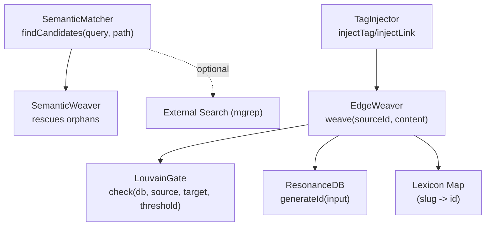
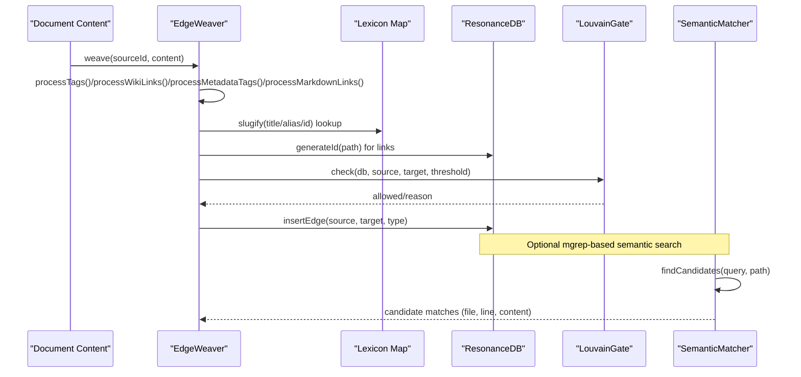
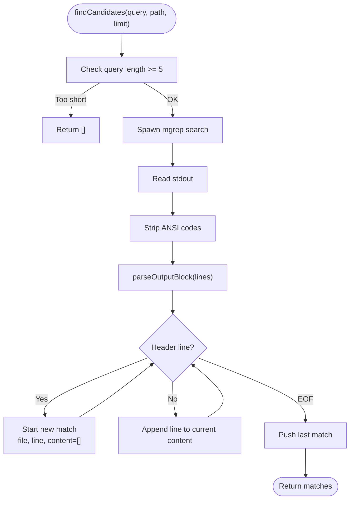
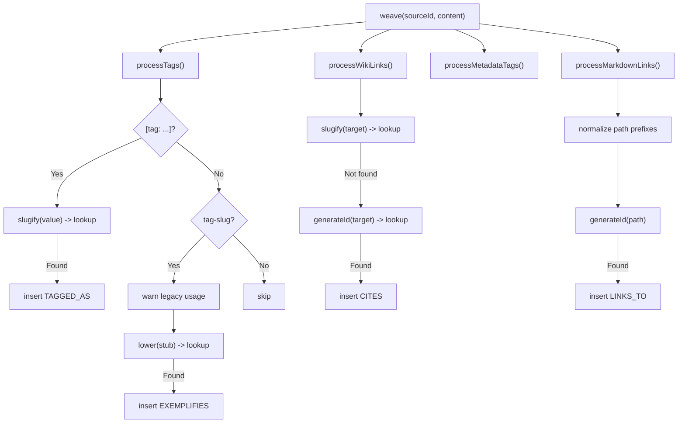
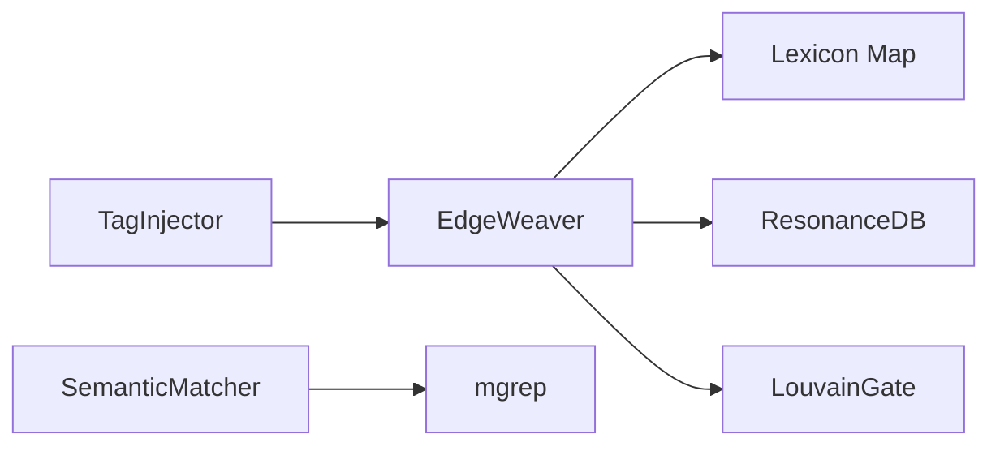

# Semantic Matching and Pattern Recognition

<cite>
**Referenced Files in This Document**
- [SemanticMatcher.ts](file://src/core/SemanticMatcher.ts)
- [EdgeWeaver.ts](file://src/core/EdgeWeaver.ts)
- [LouvainGate.ts](file://src/core/LouvainGate.ts)
- [db.ts](file://src/resonance/db.ts)
- [TagInjector.ts](file://src/utils/TagInjector.ts)
- [cda.ts](file://scripts/lab/cda.ts)
- [simpleTokenizer.ts](file://src/resonance/services/simpleTokenizer.ts)
- [2026-01-28-consistent-id-generation.md](file://briefs/future/2026-01-28-consistent-id-generation.md)
- [debug_node.ts](file://scripts/verify/debug_node.ts)
- [Logger.ts](file://src/utils/Logger.ts)
</cite>

## Table of Contents
1. [Introduction](#introduction)
2. [Project Structure](#project-structure)
3. [Core Components](#core-components)
4. [Architecture Overview](#architecture-overview)
5. [Detailed Component Analysis](#detailed-component-analysis)
6. [Dependency Analysis](#dependency-analysis)
7. [Performance Considerations](#performance-considerations)
8. [Troubleshooting Guide](#troubleshooting-guide)
9. [Conclusion](#conclusion)

## Introduction
This document explains Amalfa’s semantic matching and pattern recognition system with a focus on the SemanticMatcher and the EdgeWeaver. It covers how explicit and implicit patterns are extracted from content to discover relationships beyond explicit markup. The system supports:
- Explicit tag syntax: [tag: Concept]
- Legacy tag-slug format: tag-slug
- Metadata blocks: <!-- tags: [RELATION: Target] -->
- Wiki links: [[Target]]
- Markdown links: [label](./path.md)

It also details slugification, case-insensitive matching, false-positive prevention, and performance optimization techniques, along with troubleshooting guidance for common matching issues.

## Project Structure
The semantic discovery pipeline spans several modules:
- Core matching and weaving logic
- Database ID generation and graph edge insertion
- Optional external semantic search integration
- Utilities for injecting and validating links

**Diagram sources**
- [SemanticMatcher.ts](file://src/core/SemanticMatcher.ts#L16-L42)
- [EdgeWeaver.ts](file://src/core/EdgeWeaver.ts#L54-L59)
- [LouvainGate.ts](file://src/core/LouvainGate.ts#L15-L36)
- [db.ts](file://src/resonance/db.ts#L378-L391)
- [TagInjector.ts](file://src/utils/TagInjector.ts#L46-L84)

**Section sources**
- [SemanticMatcher.ts](file://src/core/SemanticMatcher.ts#L1-L90)
- [EdgeWeaver.ts](file://src/core/EdgeWeaver.ts#L1-L194)
- [LouvainGate.ts](file://src/core/LouvainGate.ts#L1-L68)
- [db.ts](file://src/resonance/db.ts#L374-L391)
- [TagInjector.ts](file://src/utils/TagInjector.ts#L46-L84)

## Core Components
- SemanticMatcher: Performs external semantic search using mgrep and parses structured output into candidate matches with file, line, and content context.
- EdgeWeaver: Scans content for explicit and implicit patterns, resolves targets via a slugified lexicon, and inserts edges after passing LouvainGate checks.
- LouvainGate: Prevents edges to “super nodes” unless triadic closure conditions are met, reducing noise and preserving modularity.
- ResonanceDB: Provides deterministic, path-aware ID generation for nodes and edges.
- TagInjector: Utility to inject explicit tags and wiki-links into markdown content.
- simpleTokenizer: Builds a vocabulary map for greedy matching with case-normalization and hyphen variant handling.

**Section sources**
- [SemanticMatcher.ts](file://src/core/SemanticMatcher.ts#L9-L42)
- [EdgeWeaver.ts](file://src/core/EdgeWeaver.ts#L54-L194)
- [LouvainGate.ts](file://src/core/LouvainGate.ts#L3-L36)
- [db.ts](file://src/resonance/db.ts#L378-L391)
- [TagInjector.ts](file://src/utils/TagInjector.ts#L46-L84)
- [simpleTokenizer.ts](file://src/resonance/services/simpleTokenizer.ts#L92-L110)

## Architecture Overview
The semantic discovery architecture integrates explicit markup parsing with optional external semantic search and strict edge validation.

**Diagram sources**
- [EdgeWeaver.ts](file://src/core/EdgeWeaver.ts#L54-L194)
- [LouvainGate.ts](file://src/core/LouvainGate.ts#L15-L36)
- [db.ts](file://src/resonance/db.ts#L378-L391)
- [SemanticMatcher.ts](file://src/core/SemanticMatcher.ts#L16-L42)

## Detailed Component Analysis

### SemanticMatcher
Purpose:
- Executes external semantic search to surface candidate matches for a given query within a path.
- Parses structured output to produce a list of matches with file path, line range, and content excerpt.

Key behaviors:
- Validates minimum query length and limits results.
- Spawns mgrep search and cleans ANSI escape sequences from output.
- Parses headers to extract file and line info, aggregates content blocks, and returns structured matches.

**Diagram sources**
- [SemanticMatcher.ts](file://src/core/SemanticMatcher.ts#L16-L88)

**Section sources**
- [SemanticMatcher.ts](file://src/core/SemanticMatcher.ts#L9-L90)

### EdgeWeaver
Role:
- Strict-mode scanner that identifies relationships from explicit and implicit patterns without fuzzy token matching.
- Uses a prebuilt lexicon (slug -> id) and path-aware ID generation to resolve targets.
- Inserts edges only if validated by LouvainGate.

Matching strategies:
- Explicit tag syntax: [tag: Concept]
  - Extracts value, trims, slugifies, and looks up concept ID.
  - Inserts TAGGED_AS edge if found.
- Legacy tag-slug: tag-slug
  - Emits a warning and maps to EXEMPLIFIES using lowercase stub.
- Metadata blocks: <!-- tags: [RELATION: Target] -->
  - Filters non-structural relations (e.g., quality, hashtags).
  - Inserts edges with uppercase relation type.
- Wiki links: [[Target]]
  - Slugifies target; falls back to path-aware ID if needed.
  - Inserts CITES edge.
- Markdown links: [label](./path.md)
  - Skips external URLs.
  - Normalizes leading path prefixes and generates path-aware ID.
  - Inserts LINKS_TO edge.

Slugification and case-insensitivity:
- Lowercases text, replaces non-alphanumeric sequences with dashes, trims leading/trailing dashes.
- Lexicon indexing includes ID, title, and aliases in slugified form.

False positives and safety:
- Edges pass through LouvainGate to avoid connecting to “super nodes” without shared neighbors.
- Stats tracking records checked and rejected edges.

**Diagram sources**
- [EdgeWeaver.ts](file://src/core/EdgeWeaver.ts#L54-L194)
- [db.ts](file://src/resonance/db.ts#L378-L391)

**Section sources**
- [EdgeWeaver.ts](file://src/core/EdgeWeaver.ts#L54-L194)
- [LouvainGate.ts](file://src/core/LouvainGate.ts#L15-L36)
- [db.ts](file://src/resonance/db.ts#L378-L391)

### LouvainGate
Purpose:
- Enforces local modularity by preventing edges to “super nodes” unless the source shares a neighbor with the target (triadic closure).
- Threshold is configurable and defaults to 50.

Validation logic:
- Determines if target exceeds threshold.
- If yes, checks for shared neighbor; rejects otherwise with a reason.

**Section sources**
- [LouvainGate.ts](file://src/core/LouvainGate.ts#L3-L36)

### ResonanceDB ID Generation
Purpose:
- Provides deterministic, path-aware IDs for nodes and links.
- Normalizes input by stripping relative prefixes, extensions, lowercasing, replacing non-alphanumeric characters with dashes, collapsing slashes, and trimming edges.

Path-awareness:
- Preserves directory structure by converting slashes to dashes, enabling disambiguation across files with identical names in different folders.

**Section sources**
- [db.ts](file://src/resonance/db.ts#L378-L391)
- [2026-01-28-consistent-id-generation.md](file://briefs/future/2026-01-28-consistent-id-generation.md#L42-L56)

### TagInjector
Purpose:
- Injects explicit tag blocks and wiki-links into markdown files for downstream semantic processing.

Usage:
- injectTag(filePath, tagName, tagValue) adds a frontmatter-like tag block.
- injectLink(filePath, targetId, label?) appends a wiki-link at the end of the file.

**Section sources**
- [TagInjector.ts](file://src/utils/TagInjector.ts#L46-L84)

### simpleTokenizer Vocabulary
Purpose:
- Builds a greedy vocabulary map keyed by lowercased forms for fast matching.
- Handles hyphen-to-space variants to improve recall for IDs containing hyphens.

**Section sources**
- [simpleTokenizer.ts](file://src/resonance/services/simpleTokenizer.ts#L92-L110)

## Dependency Analysis
Key dependencies and interactions:
- EdgeWeaver depends on:
  - Lexicon Map for slug-to-ID resolution
  - ResonanceDB for path-aware ID generation
  - LouvainGate for edge validation
- SemanticMatcher optionally integrates with mgrep for semantic search.
- TagInjector supports authoring explicit markup to guide matching.

**Diagram sources**
- [EdgeWeaver.ts](file://src/core/EdgeWeaver.ts#L54-L194)
- [LouvainGate.ts](file://src/core/LouvainGate.ts#L15-L36)
- [db.ts](file://src/resonance/db.ts#L378-L391)
- [SemanticMatcher.ts](file://src/core/SemanticMatcher.ts#L16-L42)
- [TagInjector.ts](file://src/utils/TagInjector.ts#L46-L84)

**Section sources**
- [EdgeWeaver.ts](file://src/core/EdgeWeaver.ts#L54-L194)
- [LouvainGate.ts](file://src/core/LouvainGate.ts#L15-L36)
- [db.ts](file://src/resonance/db.ts#L378-L391)
- [SemanticMatcher.ts](file://src/core/SemanticMatcher.ts#L16-L42)
- [TagInjector.ts](file://src/utils/TagInjector.ts#L46-L84)

## Performance Considerations
- Regex scanning is linear in content size; keep patterns minimal and anchored where possible.
- Slugification is O(n) per string; reuse computed slugs when iterating multiple targets.
- External semantic search (mgrep) should be scoped to relevant paths and limited by count to reduce IO overhead.
- Path-aware ID generation avoids collisions across directories, reducing re-tries and lookups.
- LouvainGate short-circuits expensive validations early by checking thresholds and shared neighbors.
- Prefer precomputing and caching the lexicon map to avoid repeated build costs during weaving.

[No sources needed since this section provides general guidance]

## Troubleshooting Guide
Common issues and resolutions:
- No edges inserted despite visible patterns
  - Verify slugification differences between content and lexicon entries. Confirm that titles and aliases are indexed in slugified form.
  - Check that legacy tag-slug warnings are not masking a missing concept.
  - Inspect LouvainGate rejection reasons for “super node” conditions.
  - Use the node debugger to locate the exact node and review connected edges.

- Wiki links not recognized
  - Ensure the target matches a slugified title or a path-aware ID.
  - Confirm that the path-aware ID is present in the lexicon after normalization.

- Markdown links ignored
  - External URLs are intentionally skipped; ensure internal relative paths are used.
  - Normalize leading prefixes (e.g., remove leading ./ or ../) before ID generation.

- Semantic search returns no candidates
  - Ensure the query length meets the minimum threshold.
  - Limit the search path to relevant directories.
  - Review mgrep output cleaning and header parsing logic if customizing the matcher.

- False positives and noisy edges
  - Adjust LouvainGate threshold to tighten or relax modularity enforcement.
  - Use TagInjector to add explicit tags and wiki-links to anchor relationships.

Debugging aids:
- Node connection debugger: locate a node by label, list connected edges, and inspect attributes.
- Logging: configure logger level to capture warnings and reasons from LouvainGate and SemanticMatcher.

**Section sources**
- [EdgeWeaver.ts](file://src/core/EdgeWeaver.ts#L168-L181)
- [LouvainGate.ts](file://src/core/LouvainGate.ts#L24-L33)
- [db.ts](file://src/resonance/db.ts#L378-L391)
- [debug_node.ts](file://scripts/verify/debug_node.ts#L1-L42)
- [Logger.ts](file://src/utils/Logger.ts#L1-L23)

## Conclusion
Amalfa’s semantic matching system combines explicit markup parsing with optional external semantic search and strict edge validation. EdgeWeaver’s strict-mode scanning, slugification, and path-aware ID generation ensure precise relationship discovery, while LouvainGate prevents modularity violations. Utilities like TagInjector and the node debugger help authors and operators maintain high-quality graphs with fewer false positives and clearer diagnostics.