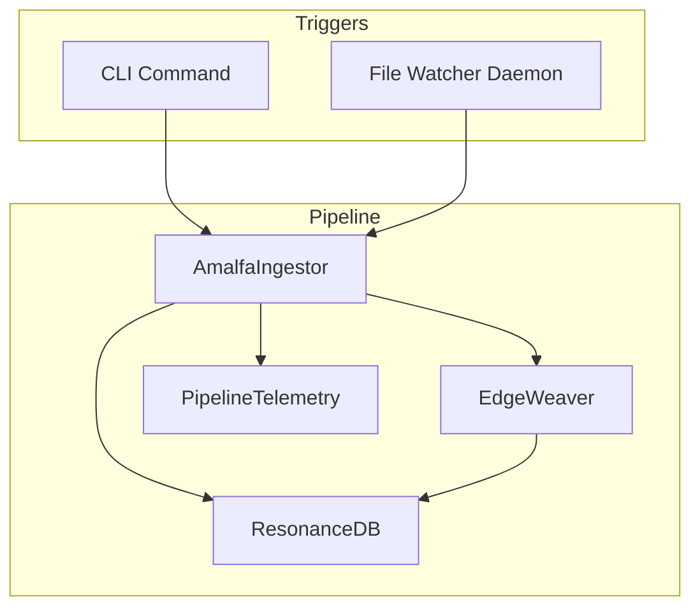
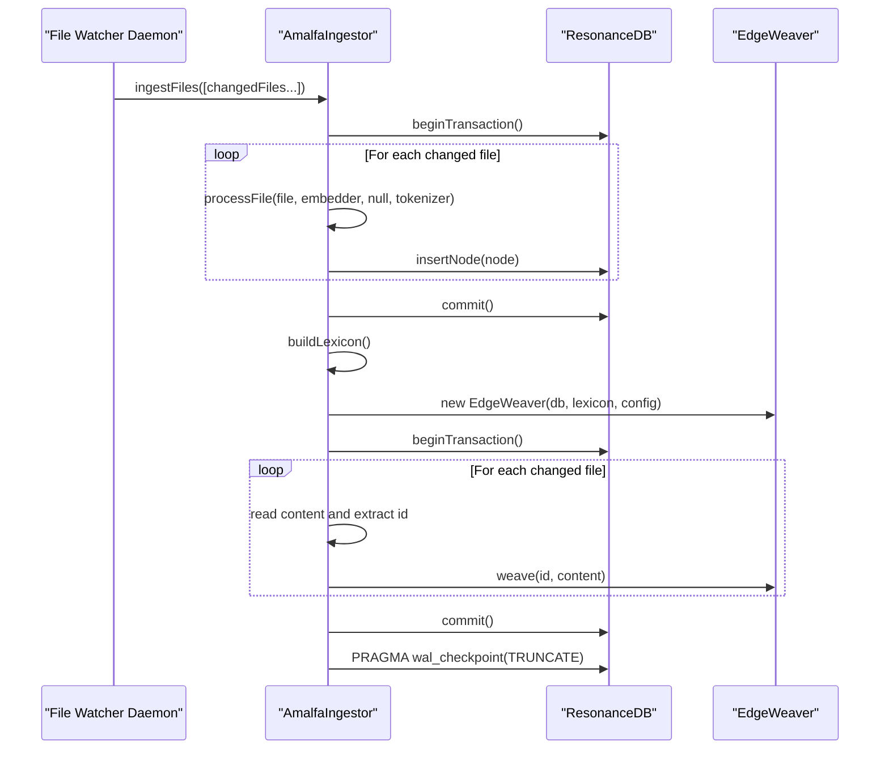
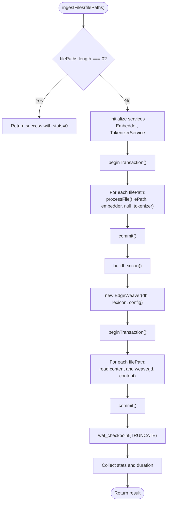
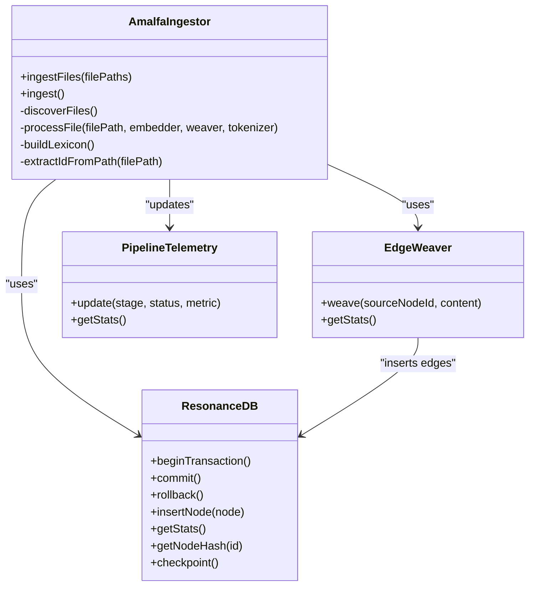

# Incremental Ingestion and Updates

<cite>
**Referenced Files in This Document**
- [AmalfaIngestor.ts](file://src/pipeline/AmalfaIngestor.ts)
- [index.ts](file://src/daemon/index.ts)
- [PipelineTelemetry.ts](file://src/services/PipelineTelemetry.ts)
- [db.ts](file://src/resonance/db.ts)
- [EdgeWeaver.ts](file://src/core/EdgeWeaver.ts)
- [incremental-ingestion.test.ts](file://tests/pipeline/incremental-ingestion.test.ts)
- [ingestion-pipeline.md](file://docs/architecture/ingestion-pipeline.md)
- [amalfa.settings.json](file://amalfa.settings.json)
- [defaults.ts](file://src/config/defaults.ts)
</cite>

## Table of Contents
1. [Introduction](#introduction)
2. [Project Structure](#project-structure)
3. [Core Components](#core-components)
4. [Architecture Overview](#architecture-overview)
5. [Detailed Component Analysis](#detailed-component-analysis)
6. [Dependency Analysis](#dependency-analysis)
7. [Performance Considerations](#performance-considerations)
8. [Troubleshooting Guide](#troubleshooting-guide)
9. [Conclusion](#conclusion)
10. [Appendices](#appendices)

## Introduction
This document explains Amalfa’s incremental ingestion capabilities, focusing on how the system tracks file changes using MD5 hashing, processes only modified files, and maintains consistency during partial updates. It details the ingestFiles method’s implementation, including batch processing, transaction management, and how the system handles file deletions and renames. It also covers telemetry integration for monitoring incremental operations, the performance benefits of selective processing, and practical guidance for configuration, large-scale updates, and troubleshooting.

## Project Structure
The incremental ingestion feature centers around a single ingestion pipeline with two modes:
- Full ingestion mode (ingest): scans all configured sources and processes every file.
- Incremental ingestion mode (ingestFiles): processes only a provided list of changed files.

The daemon watches for file changes and triggers ingestFiles with the exact set of changed files, avoiding unnecessary directory scans.

**Diagram sources**
- [AmalfaIngestor.ts](file://src/pipeline/AmalfaIngestor.ts#L45-L134)
- [index.ts](file://src/daemon/index.ts#L159-L160)
- [PipelineTelemetry.ts](file://src/services/PipelineTelemetry.ts#L17-L41)
- [db.ts](file://src/resonance/db.ts#L25-L431)
- [EdgeWeaver.ts](file://src/core/EdgeWeaver.ts#L5-L45)

**Section sources**
- [ingestion-pipeline.md](file://docs/architecture/ingestion-pipeline.md#L1-L226)
- [index.ts](file://src/daemon/index.ts#L159-L160)
- [AmalfaIngestor.ts](file://src/pipeline/AmalfaIngestor.ts#L45-L134)

## Core Components
- AmalfaIngestor.ingestFiles: Processes a targeted list of files, skipping unchanged ones via MD5 hashing, and performs two-pass edge weaving.
- ResonanceDB: Provides transaction management, node storage, and statistics collection.
- EdgeWeaver: Builds edges for affected nodes using a lexicon derived from existing nodes.
- PipelineTelemetry: Tracks stage progress and metrics for monitoring.
- File Watcher Daemon: Detects file changes and invokes ingestFiles with the exact changed file list.

**Section sources**
- [AmalfaIngestor.ts](file://src/pipeline/AmalfaIngestor.ts#L45-L134)
- [db.ts](file://src/resonance/db.ts#L298-L336)
- [EdgeWeaver.ts](file://src/core/EdgeWeaver.ts#L54-L59)
- [PipelineTelemetry.ts](file://src/services/PipelineTelemetry.ts#L17-L41)
- [index.ts](file://src/daemon/index.ts#L159-L160)

## Architecture Overview
The ingestion pipeline follows a two-pass design:
- Pass 1 (nodes only): Creates or updates nodes for the changed files, skipping unchanged files using MD5 hashes.
- Pass 2 (edges only): Rebuilds edges for the affected nodes using a lexicon built from existing nodes.

Transactions wrap batches to ensure atomicity and reduce lock contention. WAL checkpointing ensures durability.

**Diagram sources**
- [AmalfaIngestor.ts](file://src/pipeline/AmalfaIngestor.ts#L45-L134)
- [db.ts](file://src/resonance/db.ts#L349-L359)
- [EdgeWeaver.ts](file://src/core/EdgeWeaver.ts#L54-L59)

## Detailed Component Analysis

### Incremental Ingestion: ingestFiles
The ingestFiles method orchestrates targeted incremental processing:
- Validates input and short-circuits for empty lists.
- Initializes services (embedder, tokenizer).
- Pass 1: Begins a transaction, iterates the provided file paths, and processes each file. Unchanged files are skipped via MD5 comparison against stored hashes.
- Pass 2: Rebuilds edges for affected nodes by building a lexicon from existing nodes and weaving edges for each changed file.
- Finalizes with a WAL checkpoint and collects statistics.

**Diagram sources**
- [AmalfaIngestor.ts](file://src/pipeline/AmalfaIngestor.ts#L45-L134)
- [db.ts](file://src/resonance/db.ts#L349-L359)

Key implementation highlights:
- MD5 hashing: A per-file MD5 is computed from trimmed content and compared to the stored hash; unchanged files are skipped.
- Two-pass edge weaving: Edges are rebuilt after nodes are inserted, ensuring the lexicon is fully populated.
- Transaction batching: Pass 1 uses per-file transactions to minimize lock duration; Pass 2 uses a single transaction for edge updates.
- WAL checkpoint: Ensures durable persistence after updates.

**Section sources**
- [AmalfaIngestor.ts](file://src/pipeline/AmalfaIngestor.ts#L45-L134)
- [db.ts](file://src/resonance/db.ts#L298-L336)

### Hash-Based Change Tracking
Change detection relies on MD5 hashing:
- The current content MD5 is computed from trimmed content.
- Stored hash is retrieved from the database.
- If hashes match, processing is skipped; otherwise, the node is updated and the hash is persisted.

This mechanism enables selective processing and avoids redundant work.

**Section sources**
- [AmalfaIngestor.ts](file://src/pipeline/AmalfaIngestor.ts#L391-L398)
- [db.ts](file://src/resonance/db.ts#L298-L303)

### Transaction Management and Batch Processing
- Pass 1 uses per-file transactions to keep lock durations minimal and prevent SQLITE_BUSY errors when daemons or other services are active.
- Pass 2 uses a single transaction to ensure atomic edge updates.
- WAL checkpointing is performed after both passes to enforce durability.

These practices balance performance and consistency.

**Section sources**
- [AmalfaIngestor.ts](file://src/pipeline/AmalfaIngestor.ts#L70-L91)
- [db.ts](file://src/resonance/db.ts#L349-L359)
- [db.ts](file://src/resonance/db.ts#L365-L367)

### Edge Weaving for Modified Files
EdgeWeaver builds edges for the changed files using a lexicon constructed from existing nodes:
- Lexicon is built from nodes excluding content and embedding to optimize performance.
- EdgeWeaver supports explicit tags, wiki-links, metadata tags, and markdown links.
- Edges are inserted atomically within a transaction.

This ensures relationships are consistently updated for modified content.

**Section sources**
- [AmalfaIngestor.ts](file://src/pipeline/AmalfaIngestor.ts#L78-L91)
- [EdgeWeaver.ts](file://src/core/EdgeWeaver.ts#L5-L45)
- [EdgeWeaver.ts](file://src/core/EdgeWeaver.ts#L54-L166)

### Telemetry Integration
PipelineTelemetry tracks stage progress and metrics:
- Stages: Discovery, Sync, Embedding, Weaving, Enrichment.
- Each stage stores status, metric string, and last updated timestamp.
- AmalfaIngestor and the daemon update telemetry during ingestion and enrichment.

This enables real-time monitoring of incremental operations.

**Section sources**
- [PipelineTelemetry.ts](file://src/services/PipelineTelemetry.ts#L17-L41)
- [AmalfaIngestor.ts](file://src/pipeline/AmalfaIngestor.ts#L163-L242)
- [index.ts](file://src/daemon/index.ts#L164-L213)

### Handling File Deletions and Renames
- Deleted files: Not currently handled by the file watcher; deletion detection would require tracking missing files during periodic full scans.
- Renames: Detected as delete + create pairs; content hash can be used to correlate nodes and update meta.source paths if desired.

Future enhancements could include explicit deletion and rename handling for improved consistency.

**Section sources**
- [index.ts](file://src/daemon/index.ts#L162-L213)
- [debriefs/2026-01-17-targeted-incremental-ingestion.md](file://briefs/archive/2026-01-17-documentation/2026-01-17-targeted-incremental-ingestion.md#L162-L172)

## Dependency Analysis
The incremental ingestion pipeline depends on:
- AmalfaIngestor for orchestration and processing.
- ResonanceDB for transactions, node storage, and statistics.
- EdgeWeaver for edge construction.
- PipelineTelemetry for monitoring.
- File Watcher Daemon for triggering ingestFiles with changed files.

**Diagram sources**
- [AmalfaIngestor.ts](file://src/pipeline/AmalfaIngestor.ts#L32-L134)
- [db.ts](file://src/resonance/db.ts#L25-L431)
- [EdgeWeaver.ts](file://src/core/EdgeWeaver.ts#L5-L193)
- [PipelineTelemetry.ts](file://src/services/PipelineTelemetry.ts#L17-L41)

**Section sources**
- [AmalfaIngestor.ts](file://src/pipeline/AmalfaIngestor.ts#L32-L134)
- [db.ts](file://src/resonance/db.ts#L25-L431)
- [EdgeWeaver.ts](file://src/core/EdgeWeaver.ts#L5-L193)
- [PipelineTelemetry.ts](file://src/services/PipelineTelemetry.ts#L17-L41)

## Performance Considerations
- Hash-based skipping: Reduces processing to only changed files, minimizing IO and compute.
- Transaction batching: Keeps per-batch lock durations low to avoid blocking concurrent operations.
- WAL checkpointing: Ensures durability without long exclusive locks.
- Telemetry: Enables visibility into stage throughput and bottlenecks.

Practical guidance:
- Use ingestFiles for targeted updates after detecting file changes.
- Monitor telemetry to identify slow stages (e.g., embedding, weaving).
- Tune debounce intervals and batch sizes according to workload and concurrent access.

**Section sources**
- [AmalfaIngestor.ts](file://src/pipeline/AmalfaIngestor.ts#L45-L134)
- [db.ts](file://src/resonance/db.ts#L349-L359)
- [PipelineTelemetry.ts](file://src/services/PipelineTelemetry.ts#L17-L41)

## Troubleshooting Guide
Common issues and resolutions:
- Ingestion fails mid-way:
  - Check transaction boundaries and ensure proper commit/rollback.
  - Verify WAL checkpoint succeeded and database file exists and is not empty.
- Hash mismatch or unexpected reprocessing:
  - Confirm MD5 computation uses trimmed content and that stored hash is present.
  - Validate node IDs generated from file paths match expectations.
- Edge weaving anomalies:
  - Ensure lexicon is built from existing nodes and that content parsing is correct.
  - Review EdgeWeaver rules for tags, wiki-links, and markdown links.
- Telemetry not updating:
  - Confirm telemetry.update calls occur during discovery, sync, embedding, and weaving stages.
- Large-scale updates:
  - Use ingestFiles with targeted file lists to avoid full scans.
  - Monitor stage metrics to detect hotspots.

Validation references:
- Incremental ingestion tests confirm behavior for empty lists, unchanged files, and content updates.

**Section sources**
- [AmalfaIngestor.ts](file://src/pipeline/AmalfaIngestor.ts#L121-L133)
- [db.ts](file://src/resonance/db.ts#L255-L269)
- [incremental-ingestion.test.ts](file://tests/pipeline/incremental-ingestion.test.ts#L7-L100)
- [PipelineTelemetry.ts](file://src/services/PipelineTelemetry.ts#L27-L34)

## Conclusion
Amalfa’s incremental ingestion leverages MD5 hashing and targeted processing to efficiently update only changed files while maintaining consistency through two-pass edge weaving and transactional updates. The file watcher daemon feeds ingestFiles with precise file lists, eliminating unnecessary directory scans. Telemetry provides operational visibility, and performance characteristics scale well for large repositories. Future enhancements can address deletion and rename handling for even stronger consistency guarantees.

## Appendices

### Incremental Configuration Examples
- Sources and exclusions: Configure source directories and exclusion patterns to control which files are considered.
- Watch settings: Debounce interval and notifications influence responsiveness and feedback.
- Graph tuning: Super-node threshold affects edge filtering during weaving.

**Section sources**
- [amalfa.settings.json](file://amalfa.settings.json#L9-L47)
- [defaults.ts](file://src/config/defaults.ts#L84-L124)

### Handling Large-Scale Updates
- Prefer ingestFiles for targeted updates after detecting file changes.
- Monitor telemetry to identify slow stages and adjust debounce and batch sizes accordingly.
- Ensure WAL checkpointing completes successfully to maintain durability.

**Section sources**
- [index.ts](file://src/daemon/index.ts#L159-L160)
- [AmalfaIngestor.ts](file://src/pipeline/AmalfaIngestor.ts#L93-L94)
- [PipelineTelemetry.ts](file://src/services/PipelineTelemetry.ts#L27-L34)