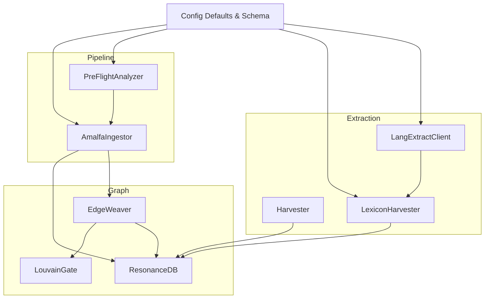
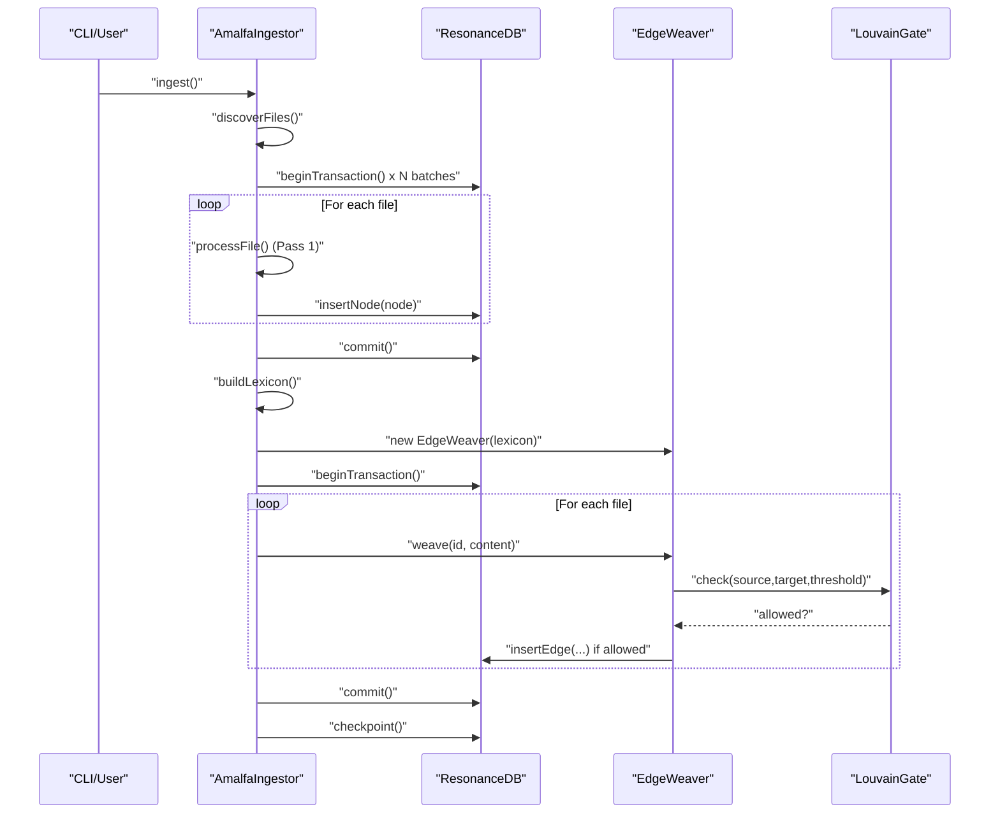
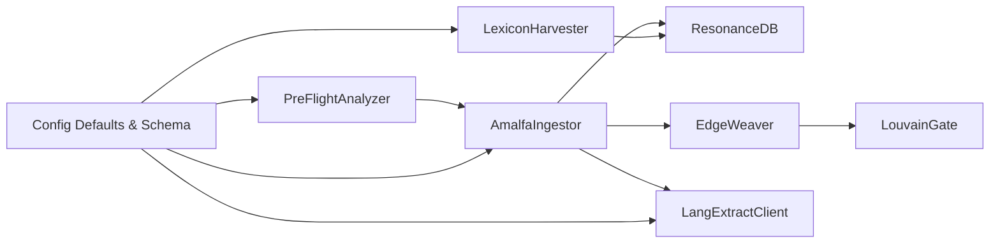
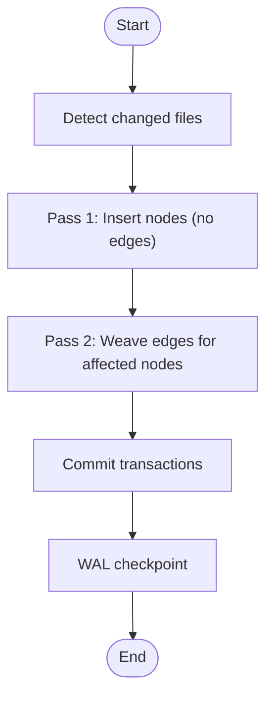

# Ingestion Pipeline

<cite>
**Referenced Files in This Document**
- [AmalfaIngestor.ts](file://src/pipeline/AmalfaIngestor.ts)
- [PreFlightAnalyzer.ts](file://src/pipeline/PreFlightAnalyzer.ts)
- [Harvester.ts](file://src/core/Harvester.ts)
- [LexiconHarvester.ts](file://src/core/LexiconHarvester.ts)
- [EdgeWeaver.ts](file://src/core/EdgeWeaver.ts)
- [LouvainGate.ts](file://src/core/LouvainGate.ts)
- [db.ts](file://src/resonance/db.ts)
- [defaults.ts](file://src/config/defaults.ts)
- [schema.ts](file://src/config/schema.ts)
- [amalfa.settings.json](file://amalfa.settings.json)
- [LangExtractClient.ts](file://src/services/LangExtractClient.ts)
</cite>

## Table of Contents
1. [Introduction](#introduction)
2. [Project Structure](#project-structure)
3. [Core Components](#core-components)
4. [Architecture Overview](#architecture-overview)
5. [Detailed Component Analysis](#detailed-component-analysis)
6. [Dependency Analysis](#dependency-analysis)
7. [Performance Considerations](#performance-considerations)
8. [Troubleshooting Guide](#troubleshooting-guide)
9. [Conclusion](#conclusion)
10. [Appendices](#appendices)

## Introduction
This document explains Amalfa’s ingestion pipeline: a two-pass strategy that first extracts nodes from documents and then discovers relationships to form edges. It covers orchestration by the AmalfaIngestor, validation and optimization by the PreFlightAnalyzer, content extraction and normalization by the Harvester and LangExtractClient, and the construction of a conceptual lexicon by the LexiconHarvester. It also documents incremental ingestion, error handling, recovery mechanisms, performance optimizations, and practical configuration and troubleshooting guidance.

## Project Structure
The ingestion pipeline spans several modules:
- Pipeline orchestration and orchestration of the two-pass ingestion
- Pre-flight validation and optimization
- Content extraction and normalization
- Conceptual lexicon building
- Graph persistence and edge weaving
- Configuration and settings

**Diagram sources**
- [AmalfaIngestor.ts](file://src/pipeline/AmalfaIngestor.ts#L32-L309)
- [PreFlightAnalyzer.ts](file://src/pipeline/PreFlightAnalyzer.ts#L61-L131)
- [Harvester.ts](file://src/core/Harvester.ts#L4-L73)
- [LexiconHarvester.ts](file://src/core/LexiconHarvester.ts#L25-L111)
- [EdgeWeaver.ts](file://src/core/EdgeWeaver.ts#L5-L59)
- [LouvainGate.ts](file://src/core/LouvainGate.ts#L3-L36)
- [db.ts](file://src/resonance/db.ts#L25-L431)
- [defaults.ts](file://src/config/defaults.ts#L15-L59)
- [schema.ts](file://src/config/schema.ts#L146-L266)

**Section sources**
- [AmalfaIngestor.ts](file://src/pipeline/AmalfaIngestor.ts#L32-L309)
- [PreFlightAnalyzer.ts](file://src/pipeline/PreFlightAnalyzer.ts#L61-L131)
- [Harvester.ts](file://src/core/Harvester.ts#L4-L73)
- [LexiconHarvester.ts](file://src/core/LexiconHarvester.ts#L25-L111)
- [EdgeWeaver.ts](file://src/core/EdgeWeaver.ts#L5-L59)
- [LouvainGate.ts](file://src/core/LouvainGate.ts#L3-L36)
- [db.ts](file://src/resonance/db.ts#L25-L431)
- [defaults.ts](file://src/config/defaults.ts#L15-L59)
- [schema.ts](file://src/config/schema.ts#L146-L266)

## Core Components
- AmalfaIngestor: Orchestrates discovery, batched node insertion, and two-pass edge weaving with transaction batching and WAL checkpointing.
- PreFlightAnalyzer: Scans sources, validates files, and writes a pre-flight report with recommendations.
- Harvester: Scans for explicit tags and sorts candidates by frequency; integrates with known lexicon IDs.
- LexiconHarvester: Aggregates sidecar outputs into a ranked conceptual lexicon, applying stop-list filtering and manifest-based source mapping.
- EdgeWeaver: Discovers edges from explicit tags, wiki-links, metadata blocks, and markdown links; enforces LouvainGate rules.
- LouvainGate: Prevents creation of edges to “super nodes” without triadic closure.
- ResonanceDB: Provides typed node/edge operations, transactions, statistics, and ID generation.
- LangExtractClient: Connects to a Python sidecar via MCP, caches results, and validates structured outputs.

**Section sources**
- [AmalfaIngestor.ts](file://src/pipeline/AmalfaIngestor.ts#L32-L309)
- [PreFlightAnalyzer.ts](file://src/pipeline/PreFlightAnalyzer.ts#L61-L131)
- [Harvester.ts](file://src/core/Harvester.ts#L4-L73)
- [LexiconHarvester.ts](file://src/core/LexiconHarvester.ts#L25-L111)
- [EdgeWeaver.ts](file://src/core/EdgeWeaver.ts#L5-L59)
- [LouvainGate.ts](file://src/core/LouvainGate.ts#L3-L36)
- [db.ts](file://src/resonance/db.ts#L25-L431)
- [LangExtractClient.ts](file://src/services/LangExtractClient.ts#L31-L353)

## Architecture Overview
The ingestion pipeline follows a strict two-pass design:
- Pass 1: Nodes only. Documents are parsed, embeddings generated (when content length permits), semantic tokens extracted, and nodes inserted. Edges are intentionally skipped.
- Pass 2: Edges only. A lexicon is built from existing nodes, and EdgeWeaver creates edges based on explicit tags, wiki-links, metadata blocks, and markdown links. LouvainGate filters edges to maintain graph stability.

**Diagram sources**
- [AmalfaIngestor.ts](file://src/pipeline/AmalfaIngestor.ts#L139-L309)
- [db.ts](file://src/resonance/db.ts#L349-L367)
- [EdgeWeaver.ts](file://src/core/EdgeWeaver.ts#L54-L59)
- [LouvainGate.ts](file://src/core/LouvainGate.ts#L15-L36)

## Detailed Component Analysis

### AmalfaIngestor: Two-Pass Orchestration
- Discovery: Glob-based scanning of sources with exclusion patterns.
- Batched ingestion: Transactions grouped in small batches to reduce lock contention and prevent SQLITE_BUSY.
- Pass 1: Nodes are inserted with hashing to detect unchanged content, embeddings generated conditionally, and semantic tokens extracted.
- Pass 2: Edges are woven using a lexicon built from existing nodes; WAL checkpoint is forced for durability.
- Incremental mode: Processes only changed files, rebuilds edges for affected nodes, and applies the same two-pass strategy.

Key behaviors:
- Transaction batching and progress reporting.
- Sidecar readiness check for advanced extraction.
- OH-104 pinch check to verify database file presence and non-empty after checkpoint.

**Section sources**
- [AmalfaIngestor.ts](file://src/pipeline/AmalfaIngestor.ts#L45-L134)
- [AmalfaIngestor.ts](file://src/pipeline/AmalfaIngestor.ts#L139-L309)
- [db.ts](file://src/resonance/db.ts#L349-L367)

### PreFlightAnalyzer: Validation and Optimization
- Scans all source directories recursively for .md files.
- Validates symlinks, circular references, sizes, emptiness, and non-markdown files.
- Computes totals and estimates node counts.
- Writes a structured pre-flight report to a log file with severity levels and recommendations.
- Enforces thresholds for large files and corpora, and flags empty sets.

Recommendations:
- Split large files under the configured size limit.
- Remove or fix circular symlinks.
- Ensure source directories contain valid markdown.

**Section sources**
- [PreFlightAnalyzer.ts](file://src/pipeline/PreFlightAnalyzer.ts#L75-L131)
- [PreFlightAnalyzer.ts](file://src/pipeline/PreFlightAnalyzer.ts#L167-L268)
- [PreFlightAnalyzer.ts](file://src/pipeline/PreFlightAnalyzer.ts#L297-L337)
- [PreFlightAnalyzer.ts](file://src/pipeline/PreFlightAnalyzer.ts#L342-L452)

### Harvester: Tag Discovery and Sorting
- Scans directories for explicit tag tokens and builds a tag-to-files map.
- Filters out tags already known as lexicon IDs.
- Sorts candidates by frequency for prioritization.

Use cases:
- Building candidate lists for lexicon enrichment.
- Supporting downstream lexicon harvesting.

**Section sources**
- [Harvester.ts](file://src/core/Harvester.ts#L16-L73)

### LexiconHarvester: Conceptual Lexicon Builder
- Loads a stop-list and a manifest mapping hashes to source paths.
- Iterates sidecar JSON outputs, normalizes terms, and aggregates frequencies and sources.
- Writes candidates to an output JSONL file, sorted by frequency.

Integration points:
- Consumes LangExtractClient outputs.
- Uses ResonanceDB for lexicon queries elsewhere in the system.

**Section sources**
- [LexiconHarvester.ts](file://src/core/LexiconHarvester.ts#L83-L111)
- [LexiconHarvester.ts](file://src/core/LexiconHarvester.ts#L113-L154)
- [LexiconHarvester.ts](file://src/core/LexiconHarvester.ts#L156-L174)

### EdgeWeaver: Relationship Discovery and Insertion
- Processes explicit tags, legacy tag-slug format, wiki-links, metadata blocks, and markdown links.
- Builds a slugified lexicon map from node IDs, labels, and aliases.
- Inserts edges only if LouvainGate allows them.

Edge types observed:
- TAGGED_AS, EXEMPLIFIES, CITES, LINKS_TO.

**Section sources**
- [EdgeWeaver.ts](file://src/core/EdgeWeaver.ts#L54-L59)
- [EdgeWeaver.ts](file://src/core/EdgeWeaver.ts#L61-L96)
- [EdgeWeaver.ts](file://src/core/EdgeWeaver.ts#L122-L166)

### LouvainGate: Edge Filtering for Stability
- Identifies “super nodes” by degree threshold.
- Requires triadic closure (shared neighbor) to allow edges to super nodes.
- Tracks checked and rejected counts for diagnostics.

**Section sources**
- [LouvainGate.ts](file://src/core/LouvainGate.ts#L15-L36)

### ResonanceDB: Persistence and Utilities
- Typed node and edge operations with safe defaults and optional exclusion of large BLOBs.
- Transaction management and WAL checkpointing.
- Statistics collection and node ID generation aligned with ingestion logic.
- Dot product and FAFCAS utilities for vector handling.

**Section sources**
- [db.ts](file://src/resonance/db.ts#L83-L134)
- [db.ts](file://src/resonance/db.ts#L140-L184)
- [db.ts](file://src/resonance/db.ts#L194-L239)
- [db.ts](file://src/resonance/db.ts#L305-L336)
- [db.ts](file://src/resonance/db.ts#L378-L391)
- [db.ts](file://src/resonance/db.ts#L448-L464)

### LangExtractClient: Extraction and Caching
- Detects sidecar availability and connects via MCP stdio transport.
- Supports provider selection via environment or settings.
- Validates structured outputs and caches results keyed by content hash.
- Parses and surfaces substrate-level errors with suggestions.

**Section sources**
- [LangExtractClient.ts](file://src/services/LangExtractClient.ts#L49-L57)
- [LangExtractClient.ts](file://src/services/LangExtractClient.ts#L248-L343)

## Dependency Analysis
High-level dependencies:
- AmalfaIngestor depends on ResonanceDB, EdgeWeaver, Embedder, TokenizerService, and LangExtractClient.
- EdgeWeaver depends on ResonanceDB and LouvainGate.
- PreFlightAnalyzer depends on filesystem APIs and writes to logs.
- LexiconHarvester depends on sidecar outputs and manifest files.
- Config defaults and schema provide centralized settings.

**Diagram sources**
- [AmalfaIngestor.ts](file://src/pipeline/AmalfaIngestor.ts#L32-L39)
- [EdgeWeaver.ts](file://src/core/EdgeWeaver.ts#L5-L16)
- [LouvainGate.ts](file://src/core/LouvainGate.ts#L3-L20)
- [LangExtractClient.ts](file://src/services/LangExtractClient.ts#L31-L43)
- [LexiconHarvester.ts](file://src/core/LexiconHarvester.ts#L25-L30)
- [PreFlightAnalyzer.ts](file://src/pipeline/PreFlightAnalyzer.ts#L61-L70)
- [defaults.ts](file://src/config/defaults.ts#L15-L59)
- [schema.ts](file://src/config/schema.ts#L146-L266)

**Section sources**
- [AmalfaIngestor.ts](file://src/pipeline/AmalfaIngestor.ts#L32-L39)
- [EdgeWeaver.ts](file://src/core/EdgeWeaver.ts#L5-L16)
- [LouvainGate.ts](file://src/core/LouvainGate.ts#L3-L20)
- [LangExtractClient.ts](file://src/services/LangExtractClient.ts#L31-L43)
- [LexiconHarvester.ts](file://src/core/LexiconHarvester.ts#L25-L30)
- [PreFlightAnalyzer.ts](file://src/pipeline/PreFlightAnalyzer.ts#L61-L70)
- [defaults.ts](file://src/config/defaults.ts#L15-L59)
- [schema.ts](file://src/config/schema.ts#L146-L266)

## Performance Considerations
- Transaction batching: Reduces lock contention and improves throughput by committing in small groups.
- WAL checkpointing: Ensures durability and prevents database file corruption.
- Embedding and tokenization: Skipped for very short content to save compute.
- Embedding warm-up: Initial embedding call primes the model for faster subsequent generations.
- Vector utilities: FAFCAS normalization and dot product enable efficient similarity comparisons.
- Pre-flight checks: Catch large files early to avoid expensive processing.

[No sources needed since this section provides general guidance]

## Troubleshooting Guide
Common issues and resolutions:
- No markdown files found: Verify source directories and patterns in configuration.
- Large files causing ingestion delays: Split files under the configured size limit.
- Circular symlinks: Remove or fix to prevent scanning loops.
- Empty or very small files: Add meaningful content or remove.
- Database connectivity: Ensure the database path exists and is readable/writable.
- Sidecar extraction failures: Confirm provider credentials and sidecar availability; check logs for substrate errors and suggestions.
- Edge filtering: If edges are being rejected, review LouvainGate thresholds and triadic closure requirements.

Operational checks:
- Pre-flight report: Review for errors and warnings before ingestion.
- OH-104 pinch check: After checkpoint, verify database file exists and is non-empty.
- Incremental mode: Ensure only changed files are processed and edges are rebuilt for affected nodes.

**Section sources**
- [PreFlightAnalyzer.ts](file://src/pipeline/PreFlightAnalyzer.ts#L297-L337)
- [PreFlightAnalyzer.ts](file://src/pipeline/PreFlightAnalyzer.ts#L342-L452)
- [AmalfaIngestor.ts](file://src/pipeline/AmalfaIngestor.ts#L255-L270)
- [LangExtractClient.ts](file://src/services/LangExtractClient.ts#L288-L343)

## Conclusion
Amalfa’s ingestion pipeline is designed for reliability and scalability: a two-pass approach ensures robust node and edge creation, while validation, caching, and transaction batching optimize performance. The modular components—orchestrator, analyzer, extractors, and graph engine—work together to produce a stable knowledge graph from markdown sources.

[No sources needed since this section summarizes without analyzing specific files]

## Appendices

### Configuration Reference
Key configuration areas:
- Sources and exclusions: Define input directories and patterns to ignore.
- Database path: Location of the SQLite database file.
- Embeddings: Model and dimensionality for vector generation.
- Watch mode: Enable file watching with debounce and notifications.
- Graph tuning: Louvain thresholds and persona/experience weights.
- Fixtures: Paths to conceptual lexicon and CDA fixtures.
- Ember, Scratchpad: Cognitive and transient memory settings.
- Sonar: Local/cloud inference configuration.
- LangExtract: Provider selection and model settings.

Practical tips:
- Start with conservative thresholds and increase gradually.
- Use pre-flight analysis to validate corpus health.
- Keep sidecar providers’ API keys secure in environment variables.

**Section sources**
- [amalfa.settings.json](file://amalfa.settings.json#L1-L96)
- [schema.ts](file://src/config/schema.ts#L146-L266)
- [defaults.ts](file://src/config/defaults.ts#L84-L139)

### Incremental Ingestion Workflow
- Detect changed files (e.g., via file watcher).
- Process only those files in Pass 1 (nodes).
- Rebuild edges for affected nodes using the current lexicon.
- Commit and checkpoint.

**Diagram sources**
- [AmalfaIngestor.ts](file://src/pipeline/AmalfaIngestor.ts#L45-L134)
- [db.ts](file://src/resonance/db.ts#L349-L367)

### Example: Custom Extraction Rules
- Explicit tags: Use strict syntax to link to concepts.
- Wiki-links: Automatically resolve to canonical IDs.
- Metadata blocks: Define relations via structured comments.
- Markdown links: Link to other documents with path-aware ID generation.

Implementation anchors:
- Tag processing and legacy tag-slug support.
- Wiki-link resolution with path-aware ID fallback.
- Metadata block parsing and relation insertion.
- Markdown link extraction and normalization.

**Section sources**
- [EdgeWeaver.ts](file://src/core/EdgeWeaver.ts#L61-L96)
- [EdgeWeaver.ts](file://src/core/EdgeWeaver.ts#L122-L166)