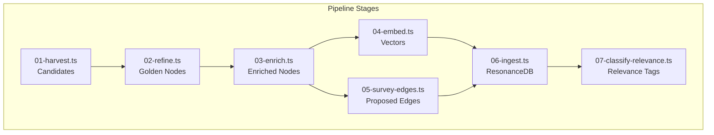
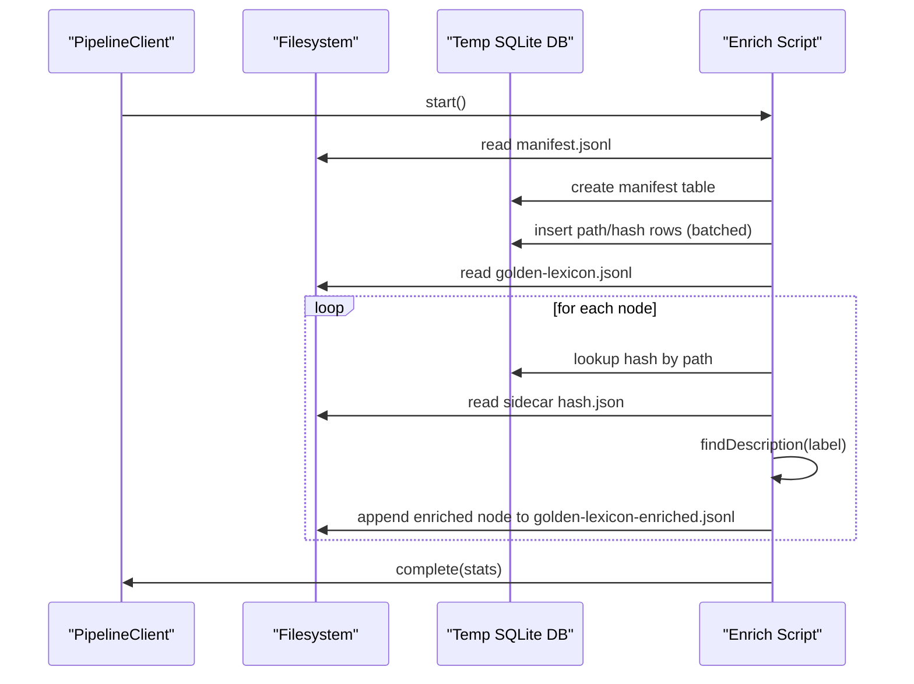
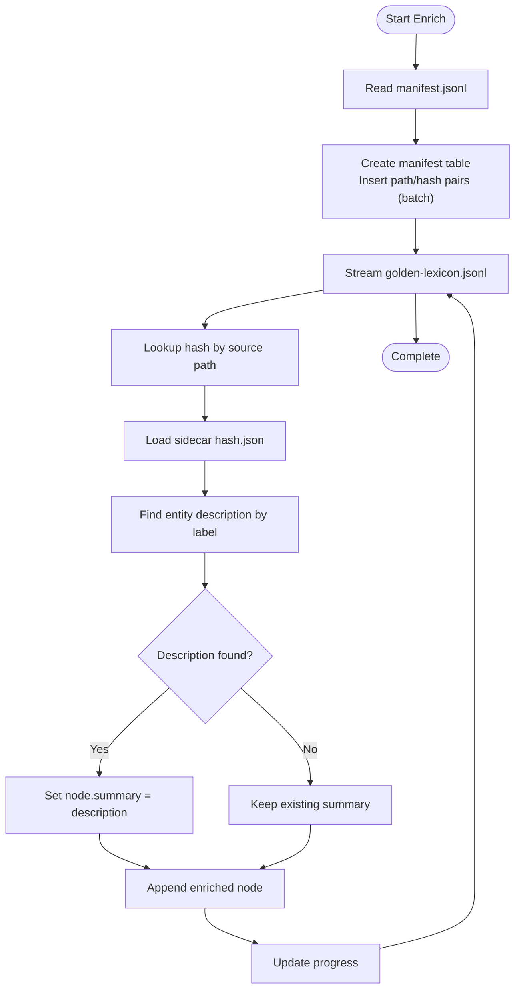
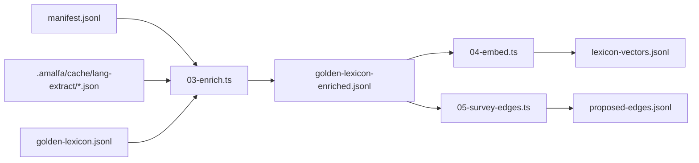

# Enrich Stage

<cite>
**Referenced Files in This Document**
- [03-enrich.ts](file://src/pipeline/lexicon/03-enrich.ts)
- [02-refine.ts](file://src/pipeline/lexicon/02-refine.ts)
- [README.md](file://src/pipeline/lexicon/README.md)
- [04-embed.ts](file://src/pipeline/lexicon/04-embed.ts)
- [05-survey-edges.ts](file://src/pipeline/lexicon/05-survey-edges.ts)
- [07-classify-relevance.ts](file://src/pipeline/lexicon/07-classify-relevance.ts)
- [LexiconHarvester.ts](file://src/core/LexiconHarvester.ts)
- [SemanticWeaver.ts](file://src/core/SemanticWeaver.ts)
- [SemanticMatcher.ts](file://src/core/SemanticMatcher.ts)
- [simpleTokenizer.ts](file://src/resonance/services/simpleTokenizer.ts)
- [edge-generation-methods.md](file://docs/references/edge-generation-methods.md)
- [Graph and Vector Database Best Practices.md.bak](file://docs/references/Graph and Vector Database Best Practices.md.bak)
- [enriched-cda.ts](file://src/resonance/types/enriched-cda.ts)
</cite>

## Table of Contents
1. [Introduction](#introduction)
2. [Project Structure](#project-structure)
3. [Core Components](#core-components)
4. [Architecture Overview](#architecture-overview)
5. [Detailed Component Analysis](#detailed-component-analysis)
6. [Dependency Analysis](#dependency-analysis)
7. [Performance Considerations](#performance-considerations)
8. [Troubleshooting Guide](#troubleshooting-guide)
9. [Conclusion](#conclusion)
10. [Appendices](#appendices)

## Introduction
This document explains the Lexicon Enrich Stage and how it transforms “hollow” lexicon nodes into semantically rich, contextually grounded knowledge items. The enrichment process:
- Adds semantic metadata and summaries to refined lexicon items
- Cross-references items to external knowledge sources (sidecars) to fill missing definitions
- Integrates contextual information from structured and unstructured sources
- Improves downstream edge weaving accuracy and semantic search performance by grounding concepts with authoritative descriptions

The stage sits between refinement and embedding in the Golden Lexicon pipeline, ensuring that enriched nodes carry meaningful descriptions before vectorization and edge proposal.

## Project Structure
The Lexicon Enrich Stage is part of a multi-stage pipeline that produces verified JSONL artifacts at each step. The enrichment stage consumes golden lexicon nodes and sidecar manifests to produce enriched JSONL with descriptions.

**Diagram sources**
- [README.md](file://src/pipeline/lexicon/README.md#L12-L51)

**Section sources**
- [README.md](file://src/pipeline/lexicon/README.md#L1-L52)

## Core Components
- Enrichment pipeline script orchestrating manifest indexing, sidecar lookup, and description injection
- Golden lexicon refinement filters candidates into high-signal nodes
- Embedding stage generates vectors for enriched nodes
- Edge survey stage proposes edges using sidecar relationships and validated node IDs
- Relevance classification leverages cross-domain signals to tag lexicon entities

Key responsibilities:
- Enrich: Fill node.summary from sidecar entities where available
- Refine: Produce stable, canonical node IDs and remove noise
- Embed: Generate dense vectors for semantic search
- Survey Edges: Propose edges using sidecar-derived relationships
- Classify Relevance: Tag entities based on cross-domain connectivity and confidence

**Section sources**
- [03-enrich.ts](file://src/pipeline/lexicon/03-enrich.ts#L1-L132)
- [02-refine.ts](file://src/pipeline/lexicon/02-refine.ts#L1-L153)
- [04-embed.ts](file://src/pipeline/lexicon/04-embed.ts#L1-L68)
- [05-survey-edges.ts](file://src/pipeline/lexicon/05-survey-edges.ts#L1-L103)
- [07-classify-relevance.ts](file://src/pipeline/lexicon/07-classify-relevance.ts#L1-L49)

## Architecture Overview
The enrichment stage reads golden nodes and attempts to attach descriptions from sidecars. It builds a temporary lookup table from the manifest to resolve source paths to hashes, then streams through nodes to enrich where possible.

**Diagram sources**
- [03-enrich.ts](file://src/pipeline/lexicon/03-enrich.ts#L47-L129)

## Detailed Component Analysis

### Enrichment Pipeline Orchestrator
The enrichment orchestrator:
- Indexes the manifest into a temporary SQLite database for fast path-to-hash resolution
- Streams golden nodes, resolves source identifiers, loads sidecars, and injects descriptions
- Maintains counters for processed and enriched nodes and updates telemetry

Key behaviors:
- Temporary DB with WAL mode for durability and concurrency
- Batched inserts for manifest indexing
- Sidecar cache with eviction to cap memory usage
- Confidence-like heuristic: uses the first description found for a matching entity label

**Diagram sources**
- [03-enrich.ts](file://src/pipeline/lexicon/03-enrich.ts#L47-L129)

**Section sources**
- [03-enrich.ts](file://src/pipeline/lexicon/03-enrich.ts#L1-L132)

### Golden Lexicon Refinement
Refinement converts harvested candidates into canonical, high-signal nodes:
- Applies frequency, length, stop-word, and noise filters
- Generates stable IDs from labels
- Produces meta with frequency and sources

These golden nodes serve as the input to enrichment and are later embedded and used to propose edges.

**Section sources**
- [02-refine.ts](file://src/pipeline/lexicon/02-refine.ts#L89-L150)

### Embedding Stage
Embedding generates dense vectors for enriched nodes:
- Uses an embedder instance to compute vectors from concatenated label and summary
- Writes vectors to a separate JSONL file for downstream ingestion
- Provides telemetry on generation counts

Benefits:
- Grounded vectors improve recall and precision in semantic search
- Separation of node metadata and vectors simplifies ingestion and auditing

**Section sources**
- [04-embed.ts](file://src/pipeline/lexicon/04-embed.ts#L15-L67)

### Edge Survey Stage
Edge survey proposes edges using sidecar-derived relationships:
- Loads valid node IDs from enriched nodes
- Iterates manifest to load sidecars
- Validates that both ends of relationships exist in the golden set
- Emits edges with metadata indicating origin and description

Impact:
- Reduces false positives by validating IDs against refined nodes
- Incorporates explicit relationships from sidecars into the knowledge graph

**Section sources**
- [05-survey-edges.ts](file://src/pipeline/lexicon/05-survey-edges.ts#L45-L99)

### Relevance Classification
Relevance classification tags lexicon entities based on cross-domain connectivity:
- Counts connections to documents via appears_in edges
- Computes average confidence and deprecation/activity scores
- Assigns categories (active/deprecated/historical) with reasons

This stage helps maintain a healthy, up-to-date lexicon and improves downstream search by prioritizing active concepts.

**Section sources**
- [07-classify-relevance.ts](file://src/pipeline/lexicon/07-classify-relevance.ts#L23-L49)

### Supporting Components

#### LexiconHarvester
While not part of enrichment, harvesting establishes the initial candidate pool that refinement and enrichment operate on:
- Loads stop-list and manifest
- Normalizes terms and aggregates frequencies and sources
- Outputs sorted candidates to JSONL

**Section sources**
- [LexiconHarvester.ts](file://src/core/LexiconHarvester.ts#L25-L175)

#### SemanticMatcher
Used in broader graph tasks to find semantically similar content blocks for context-aware linking:
- Spawns mgrep to search for matches
- Parses structured output into candidate matches with content snippets
- Supports fuzzy alignment of definitions to concepts

**Section sources**
- [SemanticMatcher.ts](file://src/core/SemanticMatcher.ts#L9-L89)

#### SemanticWeaver
Performs orphan rescue by connecting isolated nodes with similar embeddings:
- Identifies orphans with available embeddings
- Performs manual vector search and applies a similarity threshold
- Creates RELATED_TO edges to nearest neighbors

This demonstrates the importance of similarity thresholds and confidence-like heuristics in edge creation.

**Section sources**
- [SemanticWeaver.ts](file://src/core/SemanticWeaver.ts#L3-L96)

#### Tokenizer and Lexicon Tagging
The tokenizer can tag extracted terms into categories (Concept, Protocol, Organization) and load lexicon entries to guide extraction:
- Loads lexicon entries to populate vocabulary
- Tags extracted tokens accordingly for downstream processing

**Section sources**
- [simpleTokenizer.ts](file://src/resonance/services/simpleTokenizer.ts#L82-L90)

#### Enriched CDA Types
Defines typed structures for enriched concepts and documents, including extracted keywords and aliases, which inform matching and search:

**Section sources**
- [enriched-cda.ts](file://src/resonance/types/enriched-cda.ts#L84-L112)

## Dependency Analysis
The enrichment stage depends on:
- Manifest indexing for path-to-hash resolution
- Sidecar cache for efficient repeated lookups
- Golden lexicon nodes produced by refinement
- Embedding and edge survey stages for downstream processing

**Diagram sources**
- [03-enrich.ts](file://src/pipeline/lexicon/03-enrich.ts#L9-L16)
- [02-refine.ts](file://src/pipeline/lexicon/02-refine.ts#L8-L10)
- [04-embed.ts](file://src/pipeline/lexicon/04-embed.ts#L8-L13)
- [05-survey-edges.ts](file://src/pipeline/lexicon/05-survey-edges.ts#L8-L12)

## Performance Considerations
- Temporary DB: Using WAL mode and batched inserts reduces I/O overhead during manifest indexing.
- Sidecar caching: LRU-like eviction keeps memory bounded while minimizing repeated file reads.
- Streaming: Processing nodes and sidecars incrementally avoids loading entire datasets into memory.
- Telemetry: Periodic updates enable monitoring throughput and identifying bottlenecks.

Recommendations:
- Tune batch sizes for manifest insertion based on dataset scale.
- Monitor cache hit rate and adjust eviction thresholds.
- Parallelize sidecar reads where safe and beneficial.

[No sources needed since this section provides general guidance]

## Troubleshooting Guide
Common issues and remedies:
- Missing manifest: The stage requires manifest.jsonl; ensure it exists before running enrichment.
- Empty or missing sidecars: Verify cache directory contents and hash correctness.
- Low enrichment rate: Check whether sidecar entities include descriptions for node labels.
- Slow performance: Confirm DB WAL mode is active and batching is effective; review cache size and eviction behavior.

Operational checks:
- Inspect progress updates emitted by the pipeline client.
- Validate output JSONL structure and presence of summary fields.
- Confirm that subsequent stages (embedding, edge survey) receive the enriched nodes.

**Section sources**
- [03-enrich.ts](file://src/pipeline/lexicon/03-enrich.ts#L47-L129)

## Conclusion
The Lexicon Enrich Stage is a critical bridge between raw candidates and a semantically robust knowledge graph. By attaching authoritative descriptions from sidecars, it:
- Fills “hollow” nodes with meaningful summaries
- Improves edge weaving accuracy by grounding relationships in enriched concepts
- Enhances semantic search performance through richer, more precise vectors

Together with refinement, embedding, edge survey, and relevance classification, the enrichment stage ensures that the lexicon is accurate, contextualized, and ready for production use.

[No sources needed since this section summarizes without analyzing specific files]

## Appendices

### Enrichment Algorithms and Heuristics
- Description lookup: Exact label match against sidecar entities; first match wins.
- Similarity thresholding: Used in related maintenance tasks (e.g., SemanticWeaver) to decide edge creation.
- Confidence scoring: Informal thresholds (e.g., 0.85) guide edge acceptance in rescue workflows.

**Section sources**
- [03-enrich.ts](file://src/pipeline/lexicon/03-enrich.ts#L90-L119)
- [SemanticWeaver.ts](file://src/core/SemanticWeaver.ts#L77-L82)

### External Data Integration Patterns
- Manifest-based path-to-hash resolution enables deterministic linkage to cached sidecars.
- Sidecar entity descriptions are integrated as node summaries when available.
- Relationship extraction from sidecars informs edge proposals after ID validation.

**Section sources**
- [03-enrich.ts](file://src/pipeline/lexicon/03-enrich.ts#L83-L119)
- [05-survey-edges.ts](file://src/pipeline/lexicon/05-survey-edges.ts#L62-L86)

### Enrichment Rule Configuration
- Stop-list and refinement filters are defined in the refinement stage and influence which nodes reach enrichment.
- Embedding model selection and vector output location are configured in the embedding stage.
- Edge survey accepts relationships with explicit types and weights; metadata records origin and description.

**Section sources**
- [02-refine.ts](file://src/pipeline/lexicon/02-refine.ts#L14-L71)
- [04-embed.ts](file://src/pipeline/lexicon/04-embed.ts#L32-L50)
- [05-survey-edges.ts](file://src/pipeline/lexicon/05-survey-edges.ts#L75-L85)

### How Enriched Lexicons Improve Accuracy and Search
- Grounded definitions reduce ambiguity and improve matching quality.
- Richer summaries increase vector discriminability, improving nearest neighbor retrieval.
- Cross-domain edges derived from sidecars connect concepts to documents and other entities, strengthening the semantic web.

**Section sources**
- [04-embed.ts](file://src/pipeline/lexicon/04-embed.ts#L32-L37)
- [05-survey-edges.ts](file://src/pipeline/lexicon/05-survey-edges.ts#L67-L86)
- [Graph and Vector Database Best Practices.md.bak](file://docs/references/Graph and Vector Database Best Practices.md.bak#L99-L101)