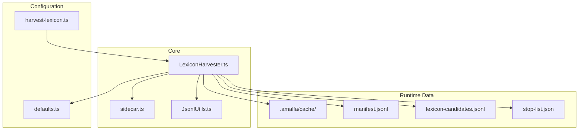
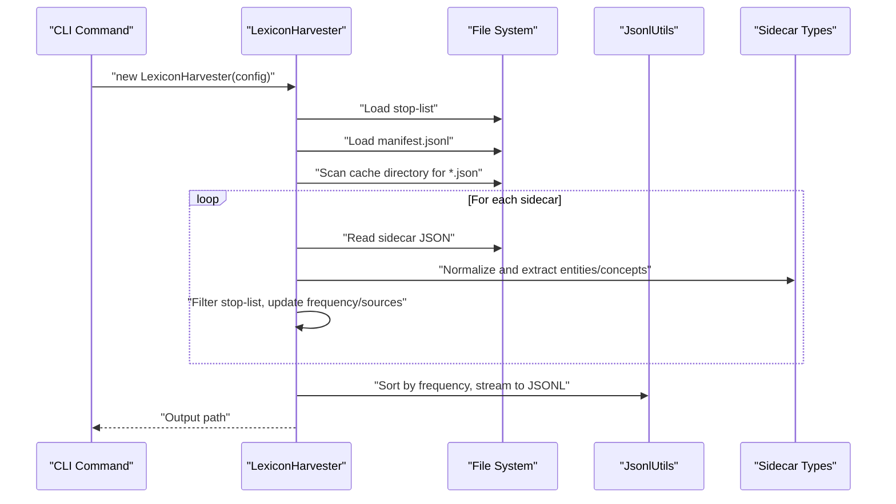
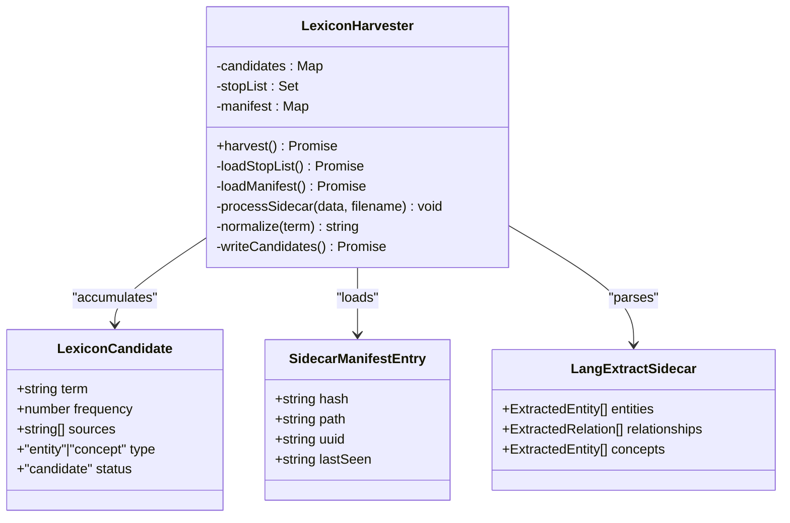
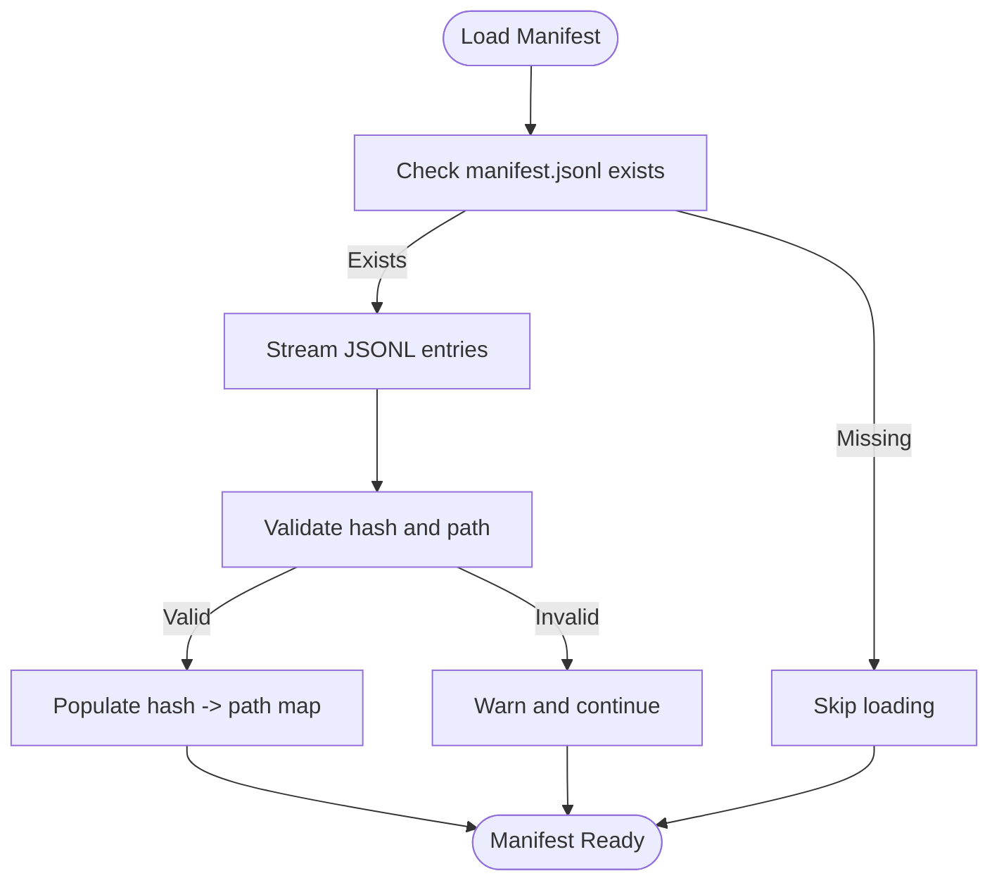
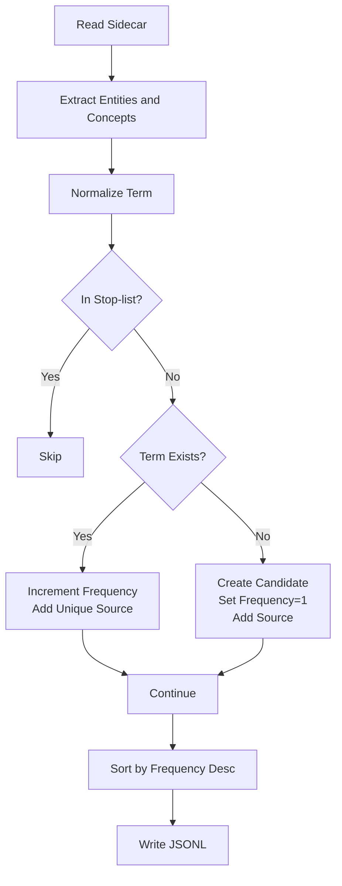
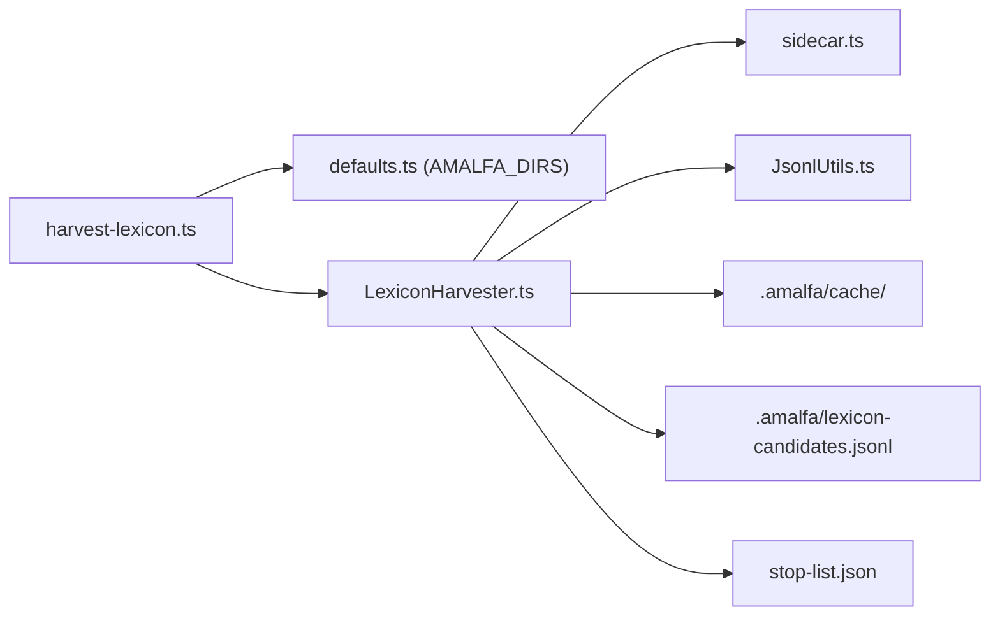

# Harvest Stage

<cite>
**Referenced Files in This Document**
- [LexiconHarvester.ts](file://src/core/LexiconHarvester.ts)
- [sidecar.ts](file://src/types/sidecar.ts)
- [defaults.ts](file://src/config/defaults.ts)
- [harvest-lexicon.ts](file://src/cli/commands/harvest-lexicon.ts)
- [JsonlUtils.ts](file://src/utils/JsonlUtils.ts)
- [classify-nodes.ts](file://scripts/maintenance/classify-nodes.ts)
- [lexicon-candidates.jsonl](file://.amalfa/lexicon-candidates.jsonl)
- [stop-list-candidates.jsonl](file://.amalfa/stop-list-candidates.jsonl)
</cite>

## Table of Contents
1. [Introduction](#introduction)
2. [Project Structure](#project-structure)
3. [Core Components](#core-components)
4. [Architecture Overview](#architecture-overview)
5. [Detailed Component Analysis](#detailed-component-analysis)
6. [Dependency Analysis](#dependency-analysis)
7. [Performance Considerations](#performance-considerations)
8. [Troubleshooting Guide](#troubleshooting-guide)
9. [Conclusion](#conclusion)

## Introduction
The Lexicon Harvest Stage extracts vocabulary candidates from sidecar outputs produced by the language extraction pipeline. It consolidates entities and concepts, normalizes terms, applies stop-list filtering, tracks frequency and source provenance, and streams the results to JSONL for downstream refinement. This document explains the harvesting workflow, candidate data structures, stop-list configuration, sidecar manifest loading, and the JSONL output format used by subsequent stages.

## Project Structure
The harvest stage centers around a dedicated core component that orchestrates loading, processing, and output of lexicon candidates. Supporting utilities handle JSONL streaming and file I/O, while configuration defines directory locations and CLI entry points.

**Diagram sources**
- [LexiconHarvester.ts](file://src/core/LexiconHarvester.ts#L25-L176)
- [sidecar.ts](file://src/types/sidecar.ts#L1-L30)
- [defaults.ts](file://src/config/defaults.ts#L15-L40)
- [harvest-lexicon.ts](file://src/cli/commands/harvest-lexicon.ts#L1-L29)
- [JsonlUtils.ts](file://src/utils/JsonlUtils.ts#L36-L101)

**Section sources**
- [LexiconHarvester.ts](file://src/core/LexiconHarvester.ts#L1-L176)
- [defaults.ts](file://src/config/defaults.ts#L15-L40)
- [harvest-lexicon.ts](file://src/cli/commands/harvest-lexicon.ts#L1-L29)

## Core Components
- LexiconHarvester: Orchestrates stop-list loading, manifest loading, sidecar scanning, candidate accumulation, normalization, deduplication, frequency tracking, and JSONL output.
- Sidecar Types: Defines the structure of cached sidecar outputs (entities, concepts, relationships).
- JSONL Utilities: Provides safe streaming, parsing, and appending for JSONL files.
- CLI Command: Configures cache directory, stop-list path, and output path for harvesting.

Key responsibilities:
- Load stop-list from a JSON file and normalize entries.
- Load sidecar manifest mapping content hashes to source paths.
- Scan cache directory for sidecar JSON files.
- Extract entities and concepts, normalize terms, filter stop-list items, and track frequencies and sources.
- Write sorted candidates to JSONL for downstream refinement.

**Section sources**
- [LexiconHarvester.ts](file://src/core/LexiconHarvester.ts#L11-L30)
- [sidecar.ts](file://src/types/sidecar.ts#L24-L29)
- [JsonlUtils.ts](file://src/utils/JsonlUtils.ts#L36-L101)
- [harvest-lexicon.ts](file://src/cli/commands/harvest-lexicon.ts#L5-L28)

## Architecture Overview
The harvest stage operates as a batch processor that transforms sidecar outputs into a unified lexicon candidate set.

**Diagram sources**
- [LexiconHarvester.ts](file://src/core/LexiconHarvester.ts#L83-L111)
- [JsonlUtils.ts](file://src/utils/JsonlUtils.ts#L55-L87)
- [sidecar.ts](file://src/types/sidecar.ts#L24-L29)

## Detailed Component Analysis

### LexiconHarvester
The core class maintains:
- A map of normalized terms to candidate entries.
- A stop-list set for filtering.
- A manifest mapping sidecar content hashes to source paths.

Processing pipeline:
- Stop-list loading: Reads a JSON file containing an array of strings; each string is normalized and added to the stop-list set.
- Manifest loading: Reads manifest.jsonl and populates a hash-to-path mapping for source resolution.
- Sidecar scanning: Iterates cache directory for .json files, parses each sidecar, and extracts entities and concepts.
- Candidate building: Normalizes terms, filters stop-list items, increments frequency, and appends unique source identifiers.
- Output: Writes candidates to JSONL, sorted by frequency in descending order.

**Diagram sources**
- [LexiconHarvester.ts](file://src/core/LexiconHarvester.ts#L11-L30)
- [LexiconHarvester.ts](file://src/core/LexiconHarvester.ts#L113-L154)
- [sidecar.ts](file://src/types/sidecar.ts#L1-L29)

**Section sources**
- [LexiconHarvester.ts](file://src/core/LexiconHarvester.ts#L25-L176)

### Candidate Data Structures
Each candidate encapsulates:
- term: Normalized string form.
- frequency: Count of occurrences across sidecars.
- sources: Unique identifiers for provenance (UUID, resolved path, or filename hash).
- type: Entity or concept.
- status: Candidate flag for downstream processing.

Example structure (paths only):
- [LexiconCandidate interface](file://src/core/LexiconHarvester.ts#L11-L17)
- [Sample candidates output](file://.amalfa/lexicon-candidates.jsonl#L1-L20)

**Section sources**
- [LexiconHarvester.ts](file://src/core/LexiconHarvester.ts#L11-L17)
- [.amalfa/lexicon-candidates.jsonl](file://.amalfa/lexicon-candidates.jsonl#L1-L20)

### Stop-list Configuration and Filtering
- Stop-list file: A JSON array of strings representing terms to exclude.
- Loading: The harvester reads the file, expects an array, and adds normalized strings to a set.
- Filtering: During candidate building, normalized terms found in the stop-list are skipped.

Example generation script demonstrates heuristics for stop-list candidate identification:
- [classify-nodes.ts](file://scripts/maintenance/classify-nodes.ts#L20-L76)

Stop-list candidates output:
- [stop-list-candidates.jsonl](file://.amalfa/stop-list-candidates.jsonl#L1-L37)

**Section sources**
- [LexiconHarvester.ts](file://src/core/LexiconHarvester.ts#L35-L52)
- [classify-nodes.ts](file://scripts/maintenance/classify-nodes.ts#L20-L76)
- [.amalfa/stop-list-candidates.jsonl](file://.amalfa/stop-list-candidates.jsonl#L1-L37)

### Sidecar Manifest Loading and Source Resolution
- Manifest location: Expected at the cache directory root as manifest.jsonl.
- Entry structure: Contains hash, path, optional uuid, and lastSeen timestamp.
- Resolution: For each sidecar, the harvester attempts to resolve a source identifier using uuid, manifest path, or filename hash fallback.

**Diagram sources**
- [LexiconHarvester.ts](file://src/core/LexiconHarvester.ts#L57-L74)
- [sidecar.ts](file://src/types/sidecar.ts#L1-L6)

**Section sources**
- [LexiconHarvester.ts](file://src/core/LexiconHarvester.ts#L57-L74)
- [sidecar.ts](file://src/types/sidecar.ts#L1-L6)

### Candidate Collection Process
- Extraction: Entities and concepts are extracted from sidecar outputs. Both string and structured forms are supported.
- Normalization: Terms are lowercased and trimmed.
- Deduplication: Uses normalized term as the key.
- Frequency Tracking: Incremented per occurrence.
- Source Tracking: Ensures unique source identifiers are appended.
- Sorting and Output: Candidates are sorted by frequency descending and streamed to JSONL.

**Diagram sources**
- [LexiconHarvester.ts](file://src/core/LexiconHarvester.ts#L113-L154)
- [LexiconHarvester.ts](file://src/core/LexiconHarvester.ts#L156-L174)

**Section sources**
- [LexiconHarvester.ts](file://src/core/LexiconHarvester.ts#L113-L174)

### JSONL Output Format and Downstream Use
- Format: One JSON object per line representing a candidate.
- Fields: term, frequency, sources, type, status.
- Ordering: Sorted by frequency descending.
- Consumption: Subsequent refinement stages consume this JSONL to further filter, categorize, and enrich candidates.

Example output:
- [lexicon-candidates.jsonl](file://.amalfa/lexicon-candidates.jsonl#L1-L20)

**Section sources**
- [LexiconHarvester.ts](file://src/core/LexiconHarvester.ts#L156-L174)
- [.amalfa/lexicon-candidates.jsonl](file://.amalfa/lexicon-candidates.jsonl#L1-L20)

## Dependency Analysis
The harvest stage relies on configuration-defined cache directories, sidecar types, and JSONL utilities. The CLI command wires these together for execution.

**Diagram sources**
- [harvest-lexicon.ts](file://src/cli/commands/harvest-lexicon.ts#L1-L29)
- [defaults.ts](file://src/config/defaults.ts#L15-L40)
- [LexiconHarvester.ts](file://src/core/LexiconHarvester.ts#L25-L30)
- [JsonlUtils.ts](file://src/utils/JsonlUtils.ts#L36-L101)

**Section sources**
- [harvest-lexicon.ts](file://src/cli/commands/harvest-lexicon.ts#L1-L29)
- [defaults.ts](file://src/config/defaults.ts#L15-L40)
- [LexiconHarvester.ts](file://src/core/LexiconHarvester.ts#L25-L30)

## Performance Considerations
- Memory footprint: Candidates are stored in a Map keyed by normalized term; stop-list is a Set. For large vocabularies, consider limiting stop-list size and avoiding unnecessary normalization overhead.
- I/O patterns: Scans cache directory for .json files; processes each file synchronously. For very large datasets, consider batching or parallelizing file processing with caution to preserve ordering.
- Sorting cost: Sorting is performed after collecting all candidates; for very large sets, consider streaming sort or external sorting if memory becomes constrained.
- Manifest loading: JSONL streaming avoids loading entire manifest into memory.

[No sources needed since this section provides general guidance]

## Troubleshooting Guide
Common issues and resolutions:
- Missing manifest.jsonl: The harvester logs a warning and continues without source path resolution. Ensure the manifest exists in the cache directory.
  - [LexiconHarvester.ts](file://src/core/LexiconHarvester.ts#L57-L74)
- Malformed sidecar JSON: The harvester skips problematic files and continues. Verify sidecar outputs conform to the expected structure.
  - [LexiconHarvester.ts](file://src/core/LexiconHarvester.ts#L96-L105)
- Empty or invalid stop-list: If the stop-list file fails to parse, the harvester logs a warning and proceeds without filtering. Confirm the file is a JSON array of strings.
  - [LexiconHarvester.ts](file://src/core/LexiconHarvester.ts#L35-L52)
- Output not generated: Verify the output path is writable and the harvester completes successfully. Check for permission errors or disk space issues.
  - [LexiconHarvester.ts](file://src/core/LexiconHarvester.ts#L156-L174)
- Stop-list tuning: Use the maintenance script to identify potential stop-list candidates based on heuristics, then curate a refined stop-list.
  - [classify-nodes.ts](file://scripts/maintenance/classify-nodes.ts#L20-L76)

**Section sources**
- [LexiconHarvester.ts](file://src/core/LexiconHarvester.ts#L35-L52)
- [LexiconHarvester.ts](file://src/core/LexiconHarvester.ts#L57-L74)
- [LexiconHarvester.ts](file://src/core/LexiconHarvester.ts#L96-L105)
- [LexiconHarvester.ts](file://src/core/LexiconHarvester.ts#L156-L174)
- [classify-nodes.ts](file://scripts/maintenance/classify-nodes.ts#L20-L76)

## Conclusion
The Lexicon Harvest Stage provides a robust, configurable pipeline for extracting and consolidating vocabulary candidates from sidecar outputs. By normalizing terms, applying stop-list filtering, tracking frequency and provenance, and emitting a sorted JSONL stream, it prepares data for subsequent refinement and enrichment stages. Proper configuration of cache directories, manifest availability, and stop-list curation ensures reliable and high-quality candidate generation.