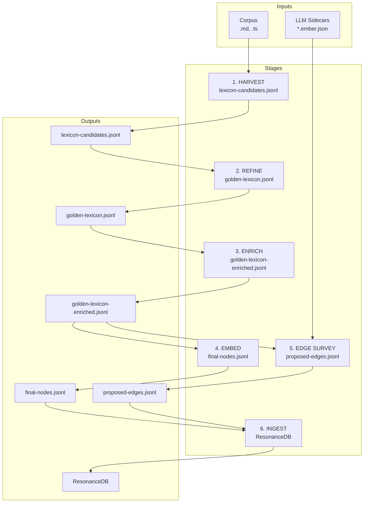
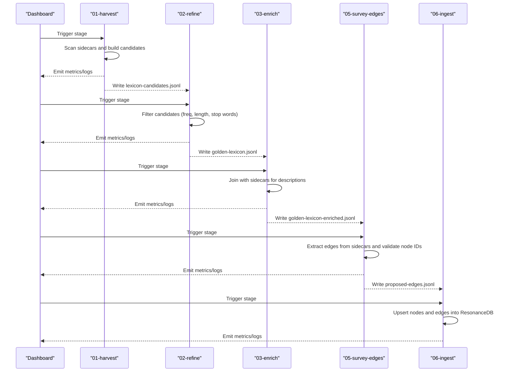
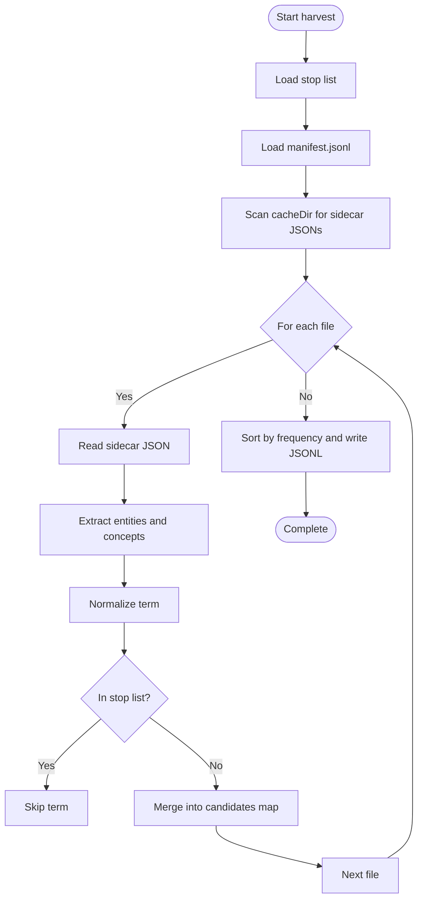
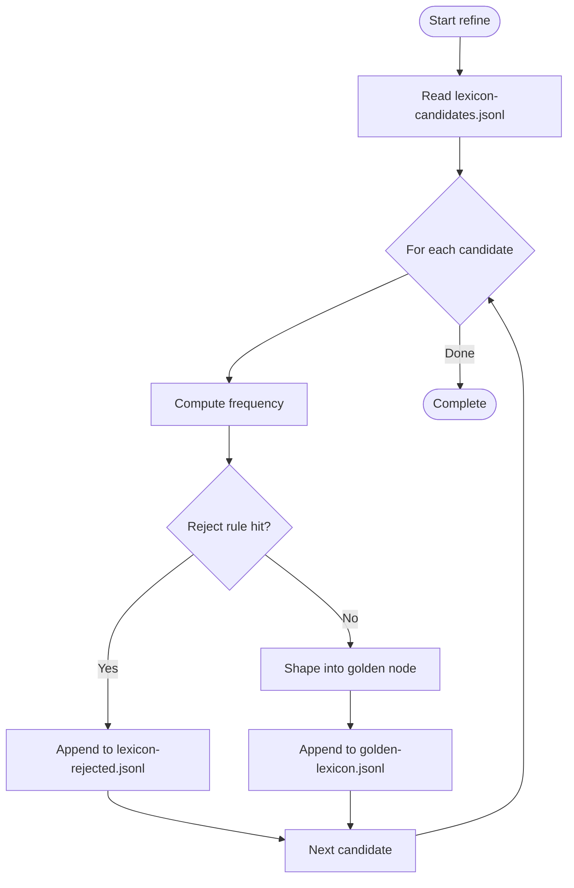
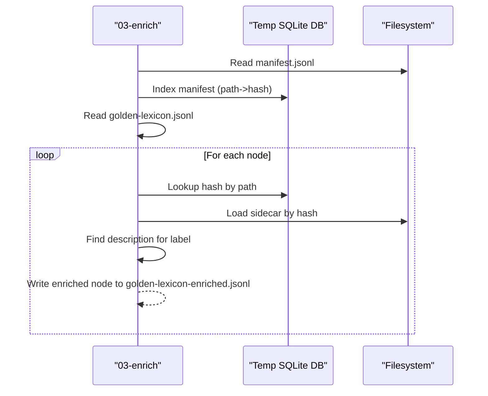
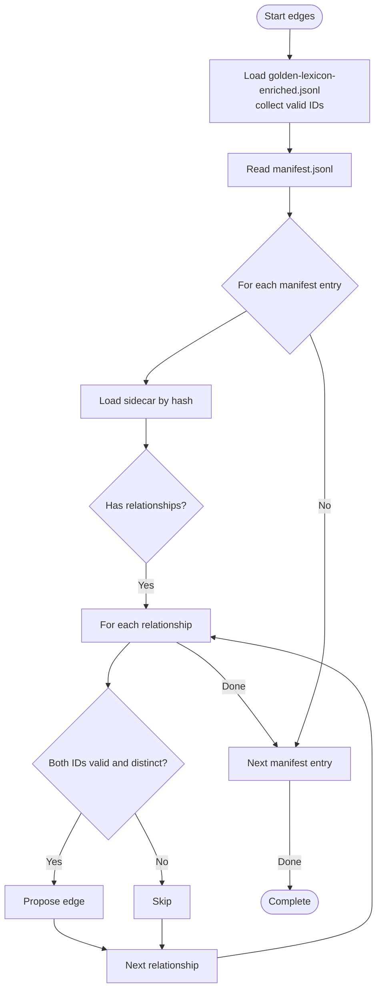
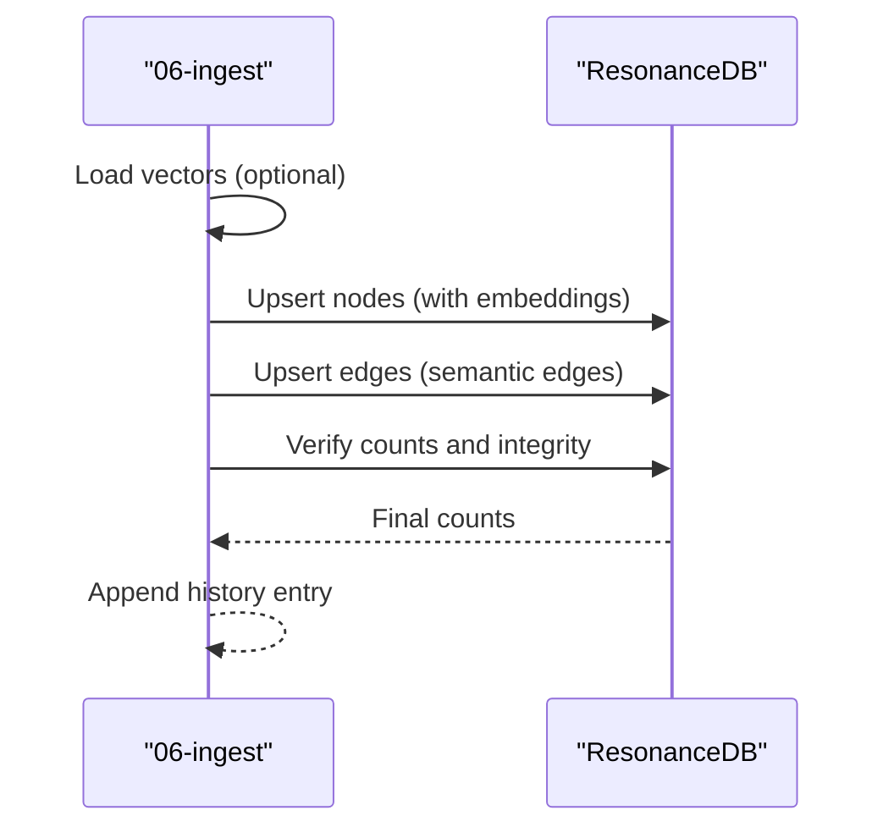
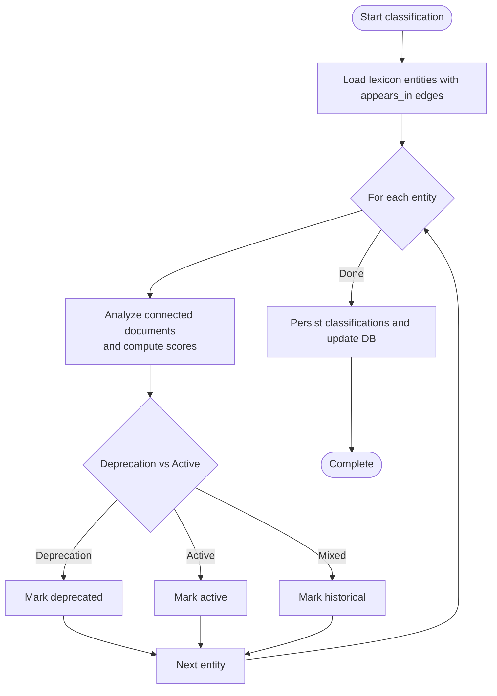
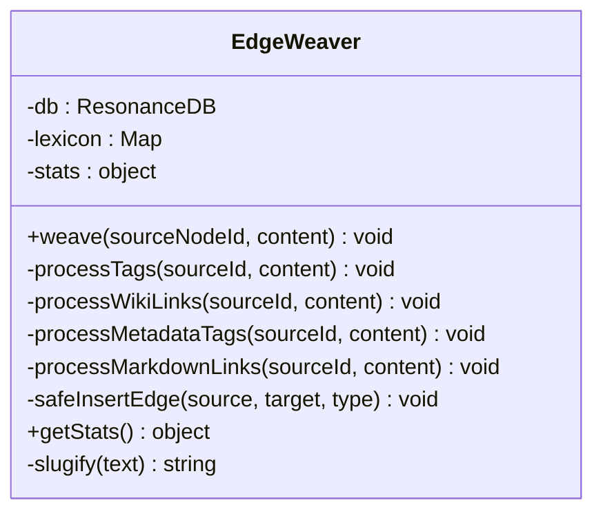
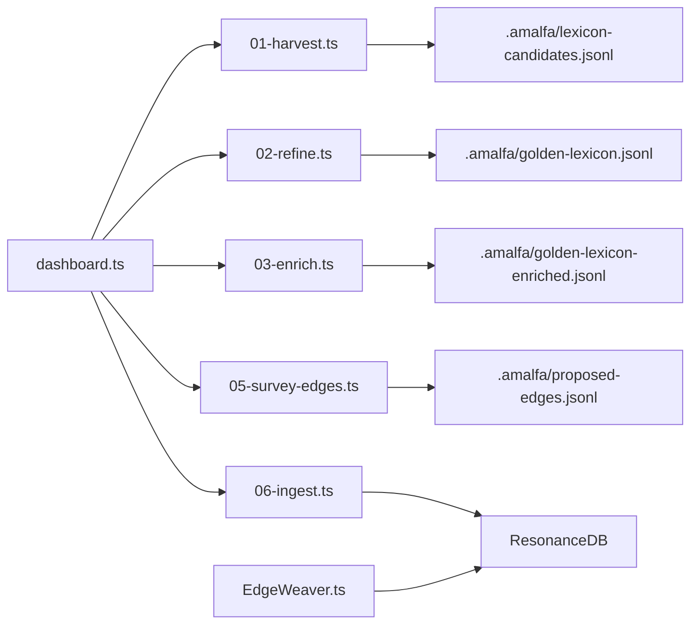

# Lexicon Building and Management

<cite>
**Referenced Files in This Document**
- [LexiconHarvester.ts](file://src/core/LexiconHarvester.ts)
- [01-harvest.ts](file://src/pipeline/lexicon/01-harvest.ts)
- [02-refine.ts](file://src/pipeline/lexicon/02-refine.ts)
- [03-enrich.ts](file://src/pipeline/lexicon/03-enrich.ts)
- [05-survey-edges.ts](file://src/pipeline/lexicon/05-survey-edges.ts)
- [06-ingest.ts](file://src/pipeline/lexicon/06-ingest.ts)
- [07-classify-relevance.ts](file://src/pipeline/lexicon/07-classify-relevance.ts)
- [dashboard.ts](file://src/pipeline/lexicon/dashboard.ts)
- [README.md](file://src/pipeline/lexicon/README.md)
- [pipeline.dot](file://src/pipeline/lexicon/pipeline.dot)
- [EdgeWeaver.ts](file://src/core/EdgeWeaver.ts)
- [simpleTokenizer.ts](file://src/resonance/services/simpleTokenizer.ts)
- [public/data/lexicon.jsonl](file://public/data/lexicon.jsonl)
</cite>

## Table of Contents
1. [Introduction](#introduction)
2. [Project Structure](#project-structure)
3. [Core Components](#core-components)
4. [Architecture Overview](#architecture-overview)
5. [Detailed Component Analysis](#detailed-component-analysis)
6. [Dependency Analysis](#dependency-analysis)
7. [Performance Considerations](#performance-considerations)
8. [Troubleshooting Guide](#troubleshooting-guide)
9. [Conclusion](#conclusion)
10. [Appendices](#appendices)

## Introduction
This document explains Amalfa’s lexicon building and management system, focusing on how the LexiconHarvester constructs the conceptual lexicon from ingested content. It covers the three-stage lexicon pipeline: harvest (initial entity extraction), refine (quality filtering and deduplication), and enrich (semantic enrichment and cross-referencing). It also documents the lexicon data structures, storage mechanisms, and how the lexicon supports edge weaving and semantic search. Examples of configuration, custom entity recognition rules, and troubleshooting quality issues are included.

## Project Structure
The lexicon pipeline is implemented as a series of stateless, artifact-driven stages orchestrated by a dashboard. Each stage writes a JSONL artifact consumed by the next stage. The system integrates with ResonanceDB for persistence and leverages sidecar outputs for semantic enrichment.

**Diagram sources**
- [pipeline.dot](file://src/pipeline/lexicon/pipeline.dot#L1-L64)
- [README.md](file://src/pipeline/lexicon/README.md#L1-L52)

**Section sources**
- [README.md](file://src/pipeline/lexicon/README.md#L1-L52)
- [pipeline.dot](file://src/pipeline/lexicon/pipeline.dot#L1-L64)

## Core Components
- LexiconHarvester: Scans sidecar outputs to collect candidate entities and concepts, normalizes terms, filters by stop words, and writes candidates to a JSONL artifact.
- Pipeline stages: 01-harvest, 02-refine, 03-enrich, 05-survey-edges, 06-ingest, 07-classify-relevance.
- Dashboard: Monitors stage progress and triggers execution.
- EdgeWeaver: Performs strict edge weaving from content into the knowledge graph.
- Tokenizer: Loads lexicon entries to support tokenization and categorization.

**Section sources**
- [LexiconHarvester.ts](file://src/core/LexiconHarvester.ts#L1-L176)
- [01-harvest.ts](file://src/pipeline/lexicon/01-harvest.ts#L1-L49)
- [02-refine.ts](file://src/pipeline/lexicon/02-refine.ts#L1-L153)
- [03-enrich.ts](file://src/pipeline/lexicon/03-enrich.ts#L1-L132)
- [05-survey-edges.ts](file://src/pipeline/lexicon/05-survey-edges.ts#L1-L103)
- [06-ingest.ts](file://src/pipeline/lexicon/06-ingest.ts#L1-L142)
- [07-classify-relevance.ts](file://src/pipeline/lexicon/07-classify-relevance.ts#L1-L253)
- [dashboard.ts](file://src/pipeline/lexicon/dashboard.ts#L1-L316)
- [EdgeWeaver.ts](file://src/core/EdgeWeaver.ts#L1-L194)
- [simpleTokenizer.ts](file://src/resonance/services/simpleTokenizer.ts#L82-L90)

## Architecture Overview
The lexicon pipeline is unidirectional and artifact-driven. Each stage is idempotent and observable, producing a JSONL artifact that becomes the input for the next stage. The final stage loads nodes and edges into ResonanceDB, enabling semantic search and graph traversal.

**Diagram sources**
- [dashboard.ts](file://src/pipeline/lexicon/dashboard.ts#L242-L271)
- [01-harvest.ts](file://src/pipeline/lexicon/01-harvest.ts#L8-L48)
- [02-refine.ts](file://src/pipeline/lexicon/02-refine.ts#L89-L152)
- [03-enrich.ts](file://src/pipeline/lexicon/03-enrich.ts#L47-L131)
- [05-survey-edges.ts](file://src/pipeline/lexicon/05-survey-edges.ts#L45-L102)
- [06-ingest.ts](file://src/pipeline/lexicon/06-ingest.ts#L13-L141)

## Detailed Component Analysis

### LexiconHarvester: Candidate Construction
The LexiconHarvester aggregates entities and concepts from sidecar outputs, normalizes terms, applies a stop list, and writes a ranked JSONL artifact.

Key behaviors:
- Loads a stop list from a JSON file and normalizes entries.
- Reads a manifest mapping hashes to source paths to resolve provenance.
- Iterates sidecars, extracting entities and concepts, and increments frequency and source IDs.
- Writes candidates sorted by frequency to a JSONL file.

**Diagram sources**
- [LexiconHarvester.ts](file://src/core/LexiconHarvester.ts#L35-L174)

**Section sources**
- [LexiconHarvester.ts](file://src/core/LexiconHarvester.ts#L1-L176)
- [01-harvest.ts](file://src/pipeline/lexicon/01-harvest.ts#L8-L48)

### Stage 2: Refine (Quality Filtering and Deduplication)
The refine stage converts candidates into golden nodes, applying frequency thresholds, minimum length, stop word filtering, and noise detection. It generates deterministic IDs and writes to golden-lexicon.jsonl.

**Diagram sources**
- [02-refine.ts](file://src/pipeline/lexicon/02-refine.ts#L89-L152)

**Section sources**
- [02-refine.ts](file://src/pipeline/lexicon/02-refine.ts#L1-L153)

### Stage 3: Enrich (Semantic Description Mapping)
The enrich stage joins golden nodes with sidecar outputs to populate descriptions. It builds a temporary SQLite index of manifest entries for fast lookup and caches sidecar JSONs to reduce IO.

**Diagram sources**
- [03-enrich.ts](file://src/pipeline/lexicon/03-enrich.ts#L47-L131)

**Section sources**
- [03-enrich.ts](file://src/pipeline/lexicon/03-enrich.ts#L1-L132)

### Stage 5: Edge Survey (Cross-Reference Relationships)
The edge survey stage scans the manifest and sidecars to propose semantic edges between validated node IDs. It ensures source and target IDs exist in the golden lexicon and writes proposed-edges.jsonl.

**Diagram sources**
- [05-survey-edges.ts](file://src/pipeline/lexicon/05-survey-edges.ts#L45-L102)

**Section sources**
- [05-survey-edges.ts](file://src/pipeline/lexicon/05-survey-edges.ts#L1-L103)

### Stage 6: Ingest (ResonanceDB Persistence)
The ingest stage loads nodes and edges into ResonanceDB. It optionally applies embeddings and performs a round-trip verification by counting nodes and edges.

**Diagram sources**
- [06-ingest.ts](file://src/pipeline/lexicon/06-ingest.ts#L13-L141)

**Section sources**
- [06-ingest.ts](file://src/pipeline/lexicon/06-ingest.ts#L1-L142)

### Stage 7: Relevance Classification
The relevance classifier analyzes cross-domain edges and document content to classify lexicon entities as active, deprecated, or historical, updating node metadata accordingly.

**Diagram sources**
- [07-classify-relevance.ts](file://src/pipeline/lexicon/07-classify-relevance.ts#L23-L173)

**Section sources**
- [07-classify-relevance.ts](file://src/pipeline/lexicon/07-classify-relevance.ts#L1-L253)

### Edge Weaving and Semantic Search
EdgeWeaver performs strict edge weaving from content into the knowledge graph using explicit semantic tags, wiki links, and metadata blocks. It enforces safety checks and integrates with clustering gates to prevent overly dense regions.

**Diagram sources**
- [EdgeWeaver.ts](file://src/core/EdgeWeaver.ts#L5-L194)

**Section sources**
- [EdgeWeaver.ts](file://src/core/EdgeWeaver.ts#L1-L194)

### Tokenizer Integration
The tokenizer loads lexicon entries to categorize tokens into concepts, protocols, and organizations, aiding downstream processing and normalization.

**Section sources**
- [simpleTokenizer.ts](file://src/resonance/services/simpleTokenizer.ts#L82-L90)

## Dependency Analysis
The pipeline stages depend on JSONL artifacts and ResonanceDB. The dashboard orchestrates execution and exposes SSE updates. EdgeWeaver depends on ResonanceDB and clustering gates.

**Diagram sources**
- [dashboard.ts](file://src/pipeline/lexicon/dashboard.ts#L242-L271)
- [01-harvest.ts](file://src/pipeline/lexicon/01-harvest.ts#L8-L48)
- [02-refine.ts](file://src/pipeline/lexicon/02-refine.ts#L89-L152)
- [03-enrich.ts](file://src/pipeline/lexicon/03-enrich.ts#L47-L131)
- [05-survey-edges.ts](file://src/pipeline/lexicon/05-survey-edges.ts#L45-L102)
- [06-ingest.ts](file://src/pipeline/lexicon/06-ingest.ts#L13-L141)
- [EdgeWeaver.ts](file://src/core/EdgeWeaver.ts#L1-L194)

**Section sources**
- [dashboard.ts](file://src/pipeline/lexicon/dashboard.ts#L1-L316)
- [README.md](file://src/pipeline/lexicon/README.md#L1-L52)

## Performance Considerations
- Artifact-driven stages enable incremental reprocessing without hidden state.
- Temporary SQLite indices and sidecar caching reduce IO overhead during enrichment and edge survey.
- Batched inserts and transactions minimize database round trips during ingest.
- Streaming JSONL processing avoids loading entire datasets into memory.

[No sources needed since this section provides general guidance]

## Troubleshooting Guide
Common issues and resolutions:
- Empty or missing output artifacts: Verify stage-specific input paths and permissions; check logs emitted by the dashboard.
- Low-frequency candidates: Adjust stop lists and minimum frequency thresholds in the refine stage.
- Missing descriptions after enrichment: Confirm manifest entries and sidecar availability; ensure labels match normalized forms.
- Edge proposal failures: Validate node IDs against golden lexicon; confirm sidecar relationships are present.
- Ingestion integrity warnings: Review node and edge counts; re-run verification steps.
- Relevance classification anomalies: Inspect document titles and confidence scores; adjust classification thresholds if needed.

**Section sources**
- [02-refine.ts](file://src/pipeline/lexicon/02-refine.ts#L110-L138)
- [03-enrich.ts](file://src/pipeline/lexicon/03-enrich.ts#L90-L119)
- [05-survey-edges.ts](file://src/pipeline/lexicon/05-survey-edges.ts#L62-L89)
- [06-ingest.ts](file://src/pipeline/lexicon/06-ingest.ts#L97-L117)
- [07-classify-relevance.ts](file://src/pipeline/lexicon/07-classify-relevance.ts#L106-L125)

## Conclusion
Amalfa’s lexicon pipeline transforms raw sidecar outputs into a structured, enriched knowledge graph. By enforcing quality gates, mapping semantic relationships, and persisting to ResonanceDB, it enables robust edge weaving and semantic search. The dashboard provides observability and orchestration, while the tokenizer and edge weaver integrate lexicon semantics into broader graph construction.

[No sources needed since this section summarizes without analyzing specific files]

## Appendices

### Lexicon Data Structures
- Candidate: term, frequency, sources, type, status.
- Golden Node: id, type, label, domain, layer, meta (frequency, sources, promoted_at).
- Enriched Node: Golden Node plus summary/description.
- Edge: source, target, type, weight, meta (origin, desc).
- Relevance Signal: entity, connectedDocs, avgConfidence, deprecationScore, activeScore, classification, reason, replacedBy.

**Section sources**
- [LexiconHarvester.ts](file://src/core/LexiconHarvester.ts#L11-L17)
- [02-refine.ts](file://src/pipeline/lexicon/02-refine.ts#L125-L136)
- [03-enrich.ts](file://src/pipeline/lexicon/03-enrich.ts#L113-L114)
- [05-survey-edges.ts](file://src/pipeline/lexicon/05-survey-edges.ts#L75-L81)
- [07-classify-relevance.ts](file://src/pipeline/lexicon/07-classify-relevance.ts#L12-L21)

### Storage Mechanisms
- JSONL artifacts (.amalfa/) serve as durable, immutable stage outputs.
- ResonanceDB persists nodes and edges with optional embeddings.
- Temporary SQLite database used for manifest indexing during enrichment.

**Section sources**
- [03-enrich.ts](file://src/pipeline/lexicon/03-enrich.ts#L51-L81)
- [06-ingest.ts](file://src/pipeline/lexicon/06-ingest.ts#L22-L58)

### Examples

- Lexicon configuration (paths and outputs):
  - See stage scripts for cacheDir, stopListPath, outputPath, and output files.
  - Example references:
    - [01-harvest.ts](file://src/pipeline/lexicon/01-harvest.ts#L11-L15)
    - [02-refine.ts](file://src/pipeline/lexicon/02-refine.ts#L8-L11)
    - [03-enrich.ts](file://src/pipeline/lexicon/03-enrich.ts#L9-L16)

- Custom entity recognition rules:
  - Modify stop list and refine thresholds to tune candidate quality.
  - Reference:
    - [02-refine.ts](file://src/pipeline/lexicon/02-refine.ts#L14-L71)

- Edge weaving from content:
  - Use explicit tags, wiki links, and metadata blocks; enforced by EdgeWeaver.
  - Reference:
    - [EdgeWeaver.ts](file://src/core/EdgeWeaver.ts#L54-L59)

- Public lexicon preview:
  - Example entries in public dataset:
    - [public/data/lexicon.jsonl](file://public/data/lexicon.jsonl#L945-L947)

**Section sources**
- [01-harvest.ts](file://src/pipeline/lexicon/01-harvest.ts#L11-L15)
- [02-refine.ts](file://src/pipeline/lexicon/02-refine.ts#L14-L71)
- [03-enrich.ts](file://src/pipeline/lexicon/03-enrich.ts#L9-L16)
- [EdgeWeaver.ts](file://src/core/EdgeWeaver.ts#L54-L59)
- [public/data/lexicon.jsonl](file://public/data/lexicon.jsonl#L945-L947)